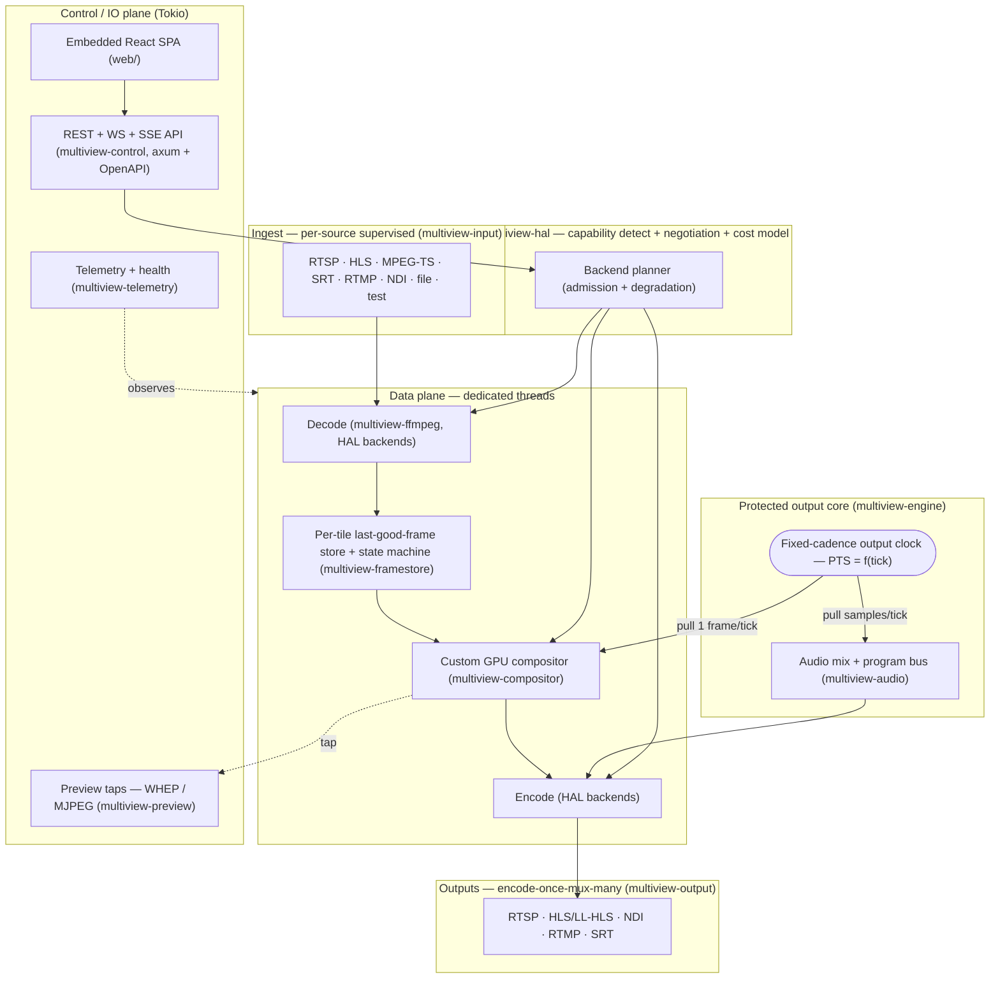

# Multiview

**An efficient, hardware-accelerated, Rust live video multiview generator.** Ingest many live
sources, composite them into a templated multiview on the GPU, and serve the result robustly —
built to run great on **commodity hardware** with **bulletproof, never-falters output**.

> [!NOTE]
> **Status: early stage — design complete, implementation beginning.** This repository is the whole
> Multiview application. Its architecture, full API/UI design, 89 ADRs, and verification-hardened
> research are finished and pinned in [`docs/`](docs/). Implementation is just starting: the
> `crates/`, `xtask/`, and `web/` trees are an early scaffold — they compile
> (`cargo check`/`clippy`/`fmt` are green), but bodies are trait/type stubs being built out against
> the documented contracts. The current phase is the documentation pass; APIs and config shown below
> describe the target design. See [`ROADMAP.md`](ROADMAP.md) for the milestone plan and
> [`FEATURES.md`](FEATURES.md) for the capability/status matrix.

---

## What it does

Multiview is a headless, scriptable compositor/router. It samples many independent live inputs into
a fixed, templated canvas, encodes that canvas **once per rendition**, and fans the same stream out
to many transports — RTSP, HLS/LL-HLS, NDI, RTMP, SRT — all managed over a web UI and an
OpenAPI-described HTTP API.

The two non-negotiable theses:

1. **Bulletproof, continuous output.** At every tick of a single fixed-cadence internal clock the
   output stage emits exactly one valid, correctly-timestamped frame (plus matching audio),
   *forever*, independent of any input. Inputs are *sampled*, never *pacing*. A dead camera shows a
   "no signal" card in its tile — it never freezes, stalls, or corrupts the multiview.
2. **Commodity hardware first.** The binding resource on an Intel iGPU, an AMD APU, a base Apple
   Silicon Mac, or an entry NVIDIA card is **memory bandwidth and fixed-function decode/encode**,
   not compositor math. Multiview decodes at display resolution, stays NV12 end-to-end, keeps frames
   on-device within a vendor island, and degrades tile-by-tile under load before the program output
   is ever touched. A 4-GPU server is the trivial case, not the target.

---

## Features

| Area | Capabilities |
|------|--------------|
| **Inputs** | RTSP, HLS/M3U, MPEG-TS, SRT, NDI (opt-in), RTMP, file, and synthetic test sources — with supervised reconnect, jitter buffers, and per-input timestamp normalization. |
| **GPU HAL** | Per-stage backend **auto-negotiation** (decode / composite / encode chosen independently) with a cost-model planner that prefers single-vendor **zero-copy islands** and costs every cross-vendor copy. Software is the universal fallback. |
| **Compositor** | A **custom GPU-native compositor** (not FFmpeg filters): scale + place + per-tile color convert + linear-light blend + overlays, fused into one pass. Owns all fit/cover/crop, gaps, borders, rounded corners. |
| **Layouts** | Declarative, **hot-reconfigurable** templates — named presets (`grid:2x2`, `grid:3x3`, `1+5`, `pip`), CSS-grid-like tracks with ASCII area maps, and absolute normalized rects for arbitrary PiP/overlap. |
| **Outputs** | RTSP, HLS, **Apple LL-HLS** (custom CMAF segmenter), NDI out, RTMP push, SRT push — via **encode-once-mux-many** fan-out. H.264 is the interop baseline; HEVC/AV1 are runtime-detected upgrades. |
| **Audio** | Per-input decode/resample/mix; clean **discrete per-input tracks** + a normalized program bus (EBU R128 / `loudnorm`); silence-fill on dropout so tracks never vanish; capability-aware routing per output. |
| **Subtitles** | CEA-608/708, DVB-sub, teletext, WebVTT/SRT/ASS ingest; **libass burn-in** (off the hot path) and format-aware discrete passthrough. |
| **Overlays** | Serializable layer stack — text, clocks, logos, tally borders, alert cards, audio meters — rendered input-decoupled so the alert path works even when every input and the GPU are gone. |
| **Web UI + API** | A single embedded React SPA + an **axum** REST API with **OpenAPI 3.1** (interactive Scalar docs), WebSocket/SSE realtime, auth + RBAC, and SQLite-backed config-as-code. |
| **Preview** | Sub-second **WHEP/WebRTC** preview + a cheap **MJPEG/JPEG** fallback, strictly isolated from the program path (preview can never back-pressure the engine). |

---

## Architecture

A layered Rust workspace with two planes: a **Tokio control/IO plane** for networking and the API,
and a dedicated-thread **data plane** for the codec/composite hot path. The protected output core
owns the clock and emits a frame every tick regardless of upstream state.



See the [Core Engine brief](docs/research/core-engine.md) and
[Resilience & A/V brief](docs/research/resilience-and-av.md) for the full data flow, and the
[canonical conventions](docs/architecture/conventions.md) for the authoritative crate map, feature
flags, and invariants.

---

## Quickstart

> [!IMPORTANT]
> Multiview links **FFmpeg / libav** for demux/decode/encode. The default build expects an
> **LGPL FFmpeg** with NVENC/NVDEC headers (`nv-codec-headers`); it does **not** require — and must
> not link — x264/x265 or libnpp. See [Licensing](#licensing). Build instructions for fetching and
> compiling an LGPL-clean FFmpeg live in `xtask` once implemented; until then, a recent
> shared FFmpeg (8.x) with the backends for your platform is the prerequisite.

### Build

```bash
# Default build: pure-Rust trait/type layer, no native GPU deps, LGPL-clean.
cargo build

# Platform umbrella presets (defined in multiview-cli):
cargo build --features nvidia       # cuda + ffmpeg + wgpu (NVENC/NVDEC/CUDA)
cargo build --features apple        # videotoolbox + metal + ffmpeg (macOS)
cargo build --features linux-vaapi  # vaapi + qsv + ffmpeg + wgpu (Intel/AMD)
cargo build --features full         # everything non-GPL
```

### Run a 2×2 multiview

Multiview is configured by a declarative TOML/JSON document — canvas, layout, cells (sources),
overlays, and outputs. Example configs live in `examples/` (added alongside the implementation).

```bash
# Validate a config without starting the pipeline
multiview validate examples/2x2.toml

# Run it
multiview run examples/2x2.toml
```

A minimal 2×2 canvas drawing from four sources:

```toml
# examples/2x2.toml
schema_version = 1

[canvas]
width = 1920
height = 1080
fps = "30000/1001"   # exact rational — never float fps
pixel_format = "nv12"
background = "#101014"

[layout]
kind = "grid:2x2"

[[cells]]
area = "0,0"
fit  = "cover"
[cells.source]
kind = "hls"
url  = "https://samples.example.net/abc-news.m3u8"

[[cells]]
area = "1,0"
fit  = "cover"
[cells.source]
kind = "rtsp"
url  = "rtsp://gpu-test-box.example.net:8554/webcam"
transport = "tcp"

[[cells]]
area = "0,1"
fit  = "contain"
[cells.source]
kind = "test"          # synthetic source — always available, deterministic
pattern = "smptebars"

[[cells]]
area = "1,1"
fit  = "cover"
[cells.source]
kind = "test"
pattern = "testsrc2"

[[outputs]]
kind = "rtsp"
mount = "/multiview"
codec = "h264"
profile = "low_latency"
```

The web UI and OpenAPI docs are served from the same process and port once running (Scalar
try-it-out at `/docs`, spec at `/api/v1/openapi.json`).

> Real and synthetic test streams — including the ABC/CNN/Frigate demo set, a deliberately diverse
> "gotcha" matrix (mixed fps, codecs, untagged color, subtitles), and reproducible synthetic
> sources — are cataloged in **[docs/reference/example-streams.md](docs/reference/example-streams.md)**.

---

## Platform support

| Platform | Decode | Composite | Encode | Notes |
|----------|--------|-----------|--------|-------|
| **Linux / NVIDIA** | NVDEC | Custom CUDA | NVENC | Zero-copy NVDEC→CUDA→NVENC island; via NVIDIA Container Toolkit. |
| **Linux / Intel·AMD** | VAAPI / QSV | Vulkan·wgpu·libplacebo | VAAPI / QSV | dma-buf zero-copy where the driver allows; `/dev/dri` passthrough. |
| **macOS (Apple Silicon + Intel)** | VideoToolbox | Metal | VideoToolbox | Native universal2 build; zero-copy VT→Metal→VT island. |
| **Any (software fallback)** | libav / dav1d | wgpu / CPU | x264 / SVT-AV1 | Universal fallback tier; the GPU-free CI path. |

**No Windows.** Targets are Linux (x86_64 + aarch64, containerized) and macOS (native). Edition
Rust 2021, pinned via `rust-toolchain.toml`; MSRV documented at release.

---

## Documentation

| Section | What's there |
|---------|--------------|
| **[docs/architecture](docs/architecture/)** | The [canonical conventions](docs/architecture/conventions.md) — **source of truth** for crate names, API paths, feature flags, invariants, and licensing. |
| **[docs/decisions](docs/decisions/)** | 72 Architecture Decision Records ([index](docs/decisions/README.md)) capturing every load-bearing choice. |
| **[docs/research](docs/research/)** | Deep, verification-hardened design briefs ([index](docs/research/README.md)) — [core engine](docs/research/core-engine.md), [resilience & A/V](docs/research/resilience-and-av.md), [efficiency](docs/research/efficiency.md), [color](docs/research/color-management.md), [web/API stack](docs/research/web-api-stack.md), and more. |
| **API** | REST + realtime conventions are pinned in [conventions.md §6](docs/architecture/conventions.md); the live OpenAPI 3.1 spec is served at `/api/v1/openapi.json` with interactive Scalar docs at `/docs`. |
| **[docs/reference](docs/reference/)** | [Example & test streams](docs/reference/example-streams.md) and the [bibliography](docs/reference/bibliography.md). |

---

## Licensing

Project code is dual-licensed **MIT OR Apache-2.0** — use either at your option.

The **default build is LGPL-clean and redistributable**: FFmpeg is linked LGPL, NVENC/NVDEC use the
MIT `nv-codec-headers` (no `--enable-gpl`, no `--enable-nonfree`), and all scaling/compositing is
done in-house (no libnpp, no x264/x265). Two capabilities are strictly opt-in:

| Feature | Effect |
|---------|--------|
| `gpl-codecs` | Pulls in x264/x265 → the resulting build is **GPL**. Off by default. |
| `ndi` | Uses the **proprietary** NDI SDK (royalty-free, runtime-loaded, never vendored). Carries the NDI EULA and **mandatory attribution** — "NDI® is a registered trademark of Vizrt NDI AB." Off by default. |

Codec **patent** licensing (H.264/HEVC/AAC pools) is a separate question from software copyright and
may apply to your outputs regardless of build flags. CI gates licenses and advisories with
`cargo-deny`. See [conventions.md §7](docs/architecture/conventions.md) and
[ADR-0012](docs/decisions/ADR-0012.md) for the full licensing model.
