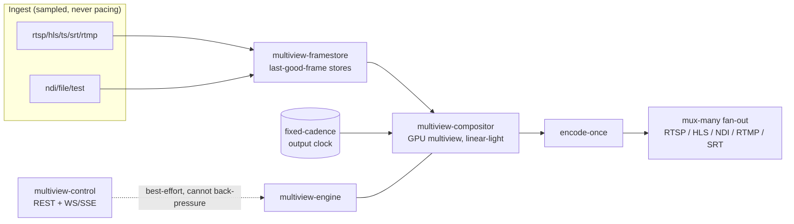

# Multiview Documentation

**Multiview** is an efficient, hardware-accelerated, Rust live video multiview generator: ingest many
live sources, composite a templated multiview on the GPU, and serve it robustly. It is built to run
great on **commodity hardware** and to produce **bulletproof, continuous output** — at every tick
of one fixed internal clock, the engine emits exactly one valid frame, **forever**, independent of
any input.

This is the documentation portal — the single navigational entrypoint. Start with the
[Conventions](architecture/conventions.md) (the source of truth) and the
[Architecture Overview](architecture/overview.md), then dive into the area you need. If you are an
agent working in the code, read [Working in this monorepo](development/working-in-this-monorepo.md).
For the implementation plan and per-feature status, see [ROADMAP.md](../ROADMAP.md) and
[FEATURES.md](../FEATURES.md).

> **Reading map.** The [research briefs](research/) are the deep, verification-hardened design
> records; the [ADRs](decisions/) capture the load-bearing decisions distilled from them; the
> [conventions](architecture/conventions.md) pin canonical names/APIs/invariants and **win** wherever
> a brief differs. Topic docs below summarize and cross-link rather than duplicate.

---

## At a glance

| | |
|---|---|
| **Binary / daemon** | `multiview` |
| **Language / edition** | Rust 2021 (stable, pinned via `rust-toolchain.toml`) |
| **License (project)** | MIT OR Apache-2.0 — see [Licensing model](architecture/conventions.md#7-licensing-model-build-profiles) |
| **Platforms** | Linux (x86_64 + aarch64; NVIDIA, Intel/AMD VAAPI) and macOS (Apple Silicon + Intel). **No Windows.** |
| **GPU compositor** | Custom, wgpu baseline with vendor fast paths (see [pipeline](architecture/pipeline.md)) |
| **Default build** | Pure-Rust, LGPL-clean, no native deps; GPU/codec/NDI behind opt-in features |

---

## Documentation map

### Architecture (`architecture/`)
System-level design: the protected output core, timing, resilience, efficiency, and color.

| Doc | Description |
|-----|-------------|
| [conventions.md](architecture/conventions.md) | **Source of truth** — canonical crate map, feature flags, invariants, API conventions, licensing, stack. |
| [overview.md](architecture/overview.md) | The end-to-end architecture: crates, dependency direction, and the inverted control flow. |
| [pipeline.md](architecture/pipeline.md) | The frame pipeline stage-by-stage: ingest -> framestore -> compositor -> encode -> mux. |
| [timing-and-sync.md](architecture/timing-and-sync.md) | The single internal monotonic timeline, fixed-cadence output clock, PTS normalization, and drift control. |
| [resilience.md](architecture/resilience.md) | Continuous-output guarantee, fault isolation tiers, supervision, and the output-validity SLO probe. |
| [hardware-and-efficiency.md](architecture/hardware-and-efficiency.md) | The HAL + per-stage backend negotiation, decode-at-display-resolution, NV12-throughout, encode-once-mux-many, and resource-adaptive degradation. |
| [color.md](architecture/color.md) | The fixed color pipeline order, linear-light compositing, untagged-input policy, and output tagging. |

### I/O (`io/`)
Getting media in and out across many transports, robustly.

| Doc | Description |
|-----|-------------|
| [inputs.md](io/inputs.md) | Ingest sources (rtsp/hls/ts/srt/rtmp/ndi/file/test), the input pacer, jitter buffers, and supervised reconnect. |
| [outputs.md](io/outputs.md) | Output sinks/servers: RTSP, HLS/LL-HLS, NDI out, RTMP/SRT push, and encode-once-mux-many fan-out. |
| [ndi.md](io/ndi.md) | NDI input & output: the feature-gated runtime-load model, frame formats, framesync, and the licensing/attribution constraints. |

### Media (`media/`)
The audio/visual feature path. (Decode and the GPU compositor are covered in
[architecture/pipeline.md](architecture/pipeline.md), [hardware-and-efficiency.md](architecture/hardware-and-efficiency.md),
and [research/core-engine.md](research/core-engine.md).)

| Doc | Description |
|-----|-------------|
| [audio-subtitles-overlays.md](media/audio-subtitles-overlays.md) | Multistream discrete audio + program bus + EBU R128 metering; subtitle ingest/burn-in (libass) + passthrough; overlay layers. |

### Templates & layout (`templates/`)
The multiview layout and template model that drives compositing.

| Doc | Description |
|-----|-------------|
| [layout-and-config.md](templates/layout-and-config.md) | The layered Canvas -> Layout -> Cells -> Overlays model, presets, transitions, source binding/hot-swap, and config-as-code (TOML/JSON, validation, import/export). |

### API (`api/`)
The management and realtime control plane.

| Doc | Description |
|-----|-------------|
| [rest.md](api/rest.md) | The `/api/v1` REST surface, RFC 9457 errors, ETag/If-Match concurrency, auth (sessions + API keys + RBAC), and OpenAPI 3.1 (utoipa + Scalar). |
| [realtime.md](api/realtime.md) | WebSocket (primary) + SSE (fallback): versioned envelope, snapshot+delta, seq resume, and AsyncAPI docs. |

### Web UI (`web/`)
The management single-page app embedded in the binary.

| Doc | Description |
|-----|-------------|
| [management-app.md](web/management-app.md) | Stack (React 19 + TS + Vite + shadcn/ui + TanStack), the key screens incl. the react-konva + dnd-kit layout editor, a11y, and the generated API client. |
| [preview.md](web/preview.md) | Isolated preview (input/program/output), the browser-codec transcode-decision matrix, WHEP/MJPEG/snapshot, signed tokens, and auto-stop. |
| [accessibility.md](web/accessibility.md) | WCAG 2.2 AA conformance plan: the SPA, the keyboard/SR-accessible canvas layout editor, no-color-alone realtime status, and the CI a11y gate. |
| [internationalization.md](web/internationalization.md) | i18n/l10n: library, ICU MessageFormat, Intl date/time/number, multi-timezone clocks, RTL, and the localization policy. |

### Operations (`operations/`)
Building, deploying, and running Multiview.

| Doc | Description |
|-----|-------------|
| [building.md](operations/building.md) | Building on Linux + macOS, FFmpeg/GPU deps, and the feature-flag build profiles (`nvidia` / `apple` / `linux-vaapi` / `full` / `gpl-codecs`). |
| [containerization.md](operations/containerization.md) | Linux container with NVIDIA Container Toolkit / VAAPI passthrough; image/LGPL notes; macOS native note. |
| [testing-and-benchmarking.md](operations/testing-and-benchmarking.md) | Unit/integration, synthetic sources, chaos/soak + output-validity SLOs, density benchmarks, and CI-without-GPU. |
| [observability.md](operations/observability.md) | `tracing`, Prometheus metrics, and health endpoints (`/livez`, `/readyz`). |
| [devcontainer.md](operations/devcontainer.md) | The dev container (GPU passthrough, 1Password, multi-arch tooling) and its macOS limitations. |

---

## Decisions, research & reference

### Architecture Decision Records (`decisions/`)
89 ADRs grouped by area (Core, Resilience & A/V, Efficiency, Color, Streaming/Timing, Preview,
Realtime API, Management, Web/API, Dev Container, Engineering Guardrails, Broadcast Multiviewer,
Accessibility & Internationalization). See the full annotated index:

➡️ **[ADR index](decisions/README.md)**

### Research briefs (`research/`)
Deep, verification-hardened design records — the substrate the ADRs and topic docs are built on.

➡️ **[Research index](research/README.md)**

| Brief | Area |
|-------|------|
| [core-engine.md](research/core-engine.md) | Core engine architecture (hybrid media engine, HAL, concurrency) |
| [resilience-and-av.md](research/resilience-and-av.md) | Bulletproof output, fault isolation, audio/subtitles/overlays |
| [efficiency.md](research/efficiency.md) | Efficiency on commodity hardware (decode/pixel/encode budgets, degradation) |
| [color-management.md](research/color-management.md) | The full color pipeline and tone-mapping defaults |
| [streaming-gotchas.md](research/streaming-gotchas.md) | Streaming robustness runbook (timing, HLS, codec edge cases) |
| [preview-subsystem.md](research/preview-subsystem.md) | Preview isolation, transports, and lifecycle |
| [realtime-api.md](research/realtime-api.md) | Realtime/eventing API design |
| [management-capability-matrix.md](research/management-capability-matrix.md) | What the UI + API must manage, with live-apply classification |
| [web-api-stack.md](research/web-api-stack.md) | Web app + API stack choices |
| [devcontainer-design.md](research/devcontainer-design.md) | Dev container design (GPU, secrets, base image) |

### Reference (`reference/`)

| Doc | Description |
|-----|-------------|
| [example-streams.md](reference/example-streams.md) | Curated live/VOD sources doubling as a gotcha test matrix (mixed fps, codecs, tagging). |
| [bibliography.md](reference/bibliography.md) | Curated, de-duplicated sources consulted during research. |

### Development (`development/`)

| Doc | Description |
|-----|-------------|
| [working-in-this-monorepo.md](development/working-in-this-monorepo.md) | The agent playbook for this monorepo: nested `CLAUDE.md`, context discipline, subagents, navigation. |
| [codebase-map.md](development/codebase-map.md) | One-screen map of the whole repo (crates, web, docs). |
| [agent-guardrails.md](development/agent-guardrails.md) | Non-negotiable engineering guardrails: absolute typing, TDD + mutation testing, adversarial cross-vendor review. |
| [completeness-checklist.md](development/completeness-checklist.md) | The 212-item checklist verifying the UI + API fully manage the engine. |

---

## Core invariants (read these first)

Every doc and implementation respects these; full details in
[conventions §5](architecture/conventions.md#5-canonical-technical-invariants) and the briefs.

1. **Output-clock invariant** — one fixed-cadence clock emits exactly one valid frame (+ audio) per
   tick, forever; output PTS = `f(tick)`. Inputs are *sampled*, never *pacing*.
2. **Per-tile last-good-frame + state machine** — lock-free single-slot stores; the compositor never
   blocks; tiles ride LIVE -> STALE -> RECONNECTING -> NO_SIGNAL.
3. **NV12-throughout** — frames stay NV12; YUV -> RGB happens in-shader at tile size.
4. **Encode-once, mux-many** — composite once, encode per rendition, fan the same packets to all
   transports.
5. **Fixed color pipeline order** — detect 4 axes -> range-expand -> matrix -> linearize -> blend in
   linear -> OETF -> compress -> tag output -> verify.
6. **Isolation** — control plane, preview, and realtime layers are *physically incapable* of
   back-pressuring the engine; a CI chaos gate enforces it.

---

## Conventions for these docs

- **Crate names** are always `multiview-<area>` (kebab); types `UpperCamel`; features `kebab-case`.
- **Link** to the deep brief in [`research/`](research/) or an [`ADR`](decisions/) rather than
  duplicating it.
- Where any doc disagrees with [`architecture/conventions.md`](architecture/conventions.md), the
  conventions win (and the Rust code is the ultimate source of truth).
