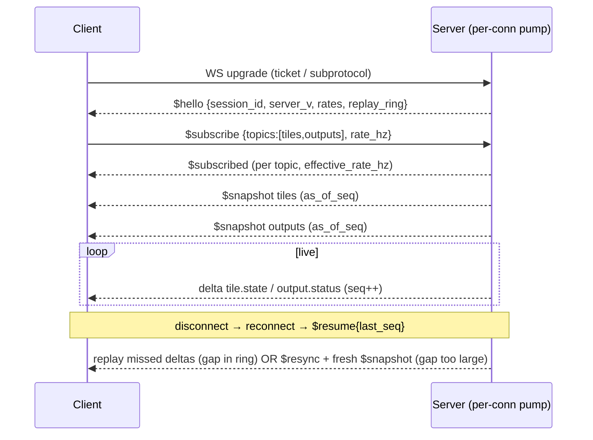
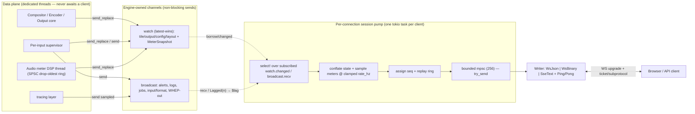

# Realtime / Eventing API

> **Audience:** integrators building dashboards, automation, or alternative UIs against a running
> `mosaic` daemon. **Source of truth:** the wire types in the `mosaic-events` crate and the generated
> AsyncAPI document at `/asyncapi.json` (rendered at `/docs/events`). This page is a stable, skimmable
> map of that contract — where it differs from generated specs, the generated specs win.

Mosaic exposes **two complementary control-plane surfaces** on the same axum router in `mosaic-control`
under `/api/v1`:

- **REST** (OpenAPI 3.1, docs at `/docs`) — synchronous **commands / CRUD**. See the
  [REST API reference](./rest.md). Long-running work returns `202 Accepted` + a `correlationId`
  (`corr`); the result streams back on the realtime channel.
- **Realtime** (this document) — **events / state**. A full snapshot on connect, then ordered deltas:
  tile state transitions, input/output status, audio meters, alerts, layout/config changes, log tail,
  job progress, and WHEP preview signaling.

The deep design is in [`../research/realtime-api.md`](../research/realtime-api.md); decisions are
captured in [ADR-RT001](../decisions/ADR-RT001.md)…[ADR-RT006](../decisions/ADR-RT006.md). Naming,
paths, and invariants follow [`../architecture/conventions.md`](../architecture/conventions.md) §6.

---

## 1. Transports

| Transport | Endpoint | Direction | Carries | Use when |
|---|---|---|---|---|
| **WebSocket** (PRIMARY) | `/api/v1/ws` | bidirectional | full envelope: events, subscriptions, WHEP signaling, client pings | default for browsers + API clients |
| **SSE** (FALLBACK) | `/api/v1/events` | server → client only | identical envelope (no client subscribes, no WHEP) | proxies/MITM that strip the WS `Upgrade` |
| **REST** (commands) | `/api/v1/...` | request/response | CRUD + commands, returns `corr` | every mutation; result arrives on the stream |

> The brief uses `/api/v1/realtime` for the WS upgrade; **the canonical path is `/api/v1/ws`**
> (conventions §6) with the SSE fallback at `/api/v1/events`.

There is exactly **one fan-out core** with **two wire encoders** (`WsJson`/`WsBinary` and `SseText`):
subscription, sequencing, snapshot, conflation, and resume logic are transport-agnostic — only framing
differs. See [ADR-RT001](../decisions/ADR-RT001.md).

### The load-bearing invariant

> The realtime layer is strictly **best-effort** and **physically incapable of back-pressuring the
> engine.** Every event originates from engine-owned `tokio::watch` (latest-wins state) / `broadcast`
> (fan-out) channels; the engine **never awaits a client**. A slow consumer can only ever lose or
> coalesce *its own* messages, or be disconnected — never stall or OOM the compositor/encoder/output
> core.

This is invariant #10 in [conventions §5](../architecture/conventions.md) and is enforced by a CI
chaos/backpressure gate. The structural model is in [§7](#7-backpressureconflation) and
[ADR-RT004](../decisions/ADR-RT004.md).

---

## 2. The versioned envelope

Every message — events, control frames, WHEP signaling — uses **one** envelope so a single
parse/validate/route path serves WS and SSE. See [ADR-RT002](../decisions/ADR-RT002.md).

```jsonc
{
  "v":    1,                 // u16 envelope schema MAJOR. Client rejects unknown major.
  "t":    "tile.state",      // dotted event type; selects the `data` schema (discriminator)
  "topic":"tiles",           // subscription routing key; control frames use "$control"
  "id":   "tile:big",        // optional resource scope (tile/input/output/job id)
  "seq":  184213,            // u64 per-connection monotonic resume cursor (gaps = drops)
  "ts":   920451123456,      // i64 engine monotonic ns (same clock family as output PTS)
  "corr": "req_5f2a",        // optional correlation id echoing a REST command / job
  "data": { /* typed payload selected by t */ }
}
```

| Field | Type | Meaning |
|---|---|---|
| `v` | `u16` | Envelope schema **major**. Additive changes bump minor (clients ignore unknown `t`/fields); breaking changes bump `v`. Client **rejects unknown major**. |
| `t` | string | Dotted event type; the discriminator selecting the `data` schema. |
| `topic` | string | Subscription routing key (coarse, group-level). Control frames use `"$control"`. |
| `id` | string? | Optional resource scope — the tile/input/output/job id the event concerns. |
| `seq` | `u64` | **Per-connection** monotonic cursor. A gap means messages were dropped → resume/re-snapshot. |
| `ts` | `i64` | Engine monotonic nanoseconds (same clock family as output PTS). Use for cross-topic reconciliation. |
| `corr` | string? | Correlation id echoing a REST command / job lifecycle. |
| `data` | object | Typed payload selected by `t`. |

**Rust ↔ TypeScript:** `struct Envelope<T> { v, t, topic, id, seq, ts, corr, data: T }` wraps an
internally-tagged `EventPayload` enum (`#[serde(tag = "t", content = "data")]`). This renders as a
JSON-Schema `oneOf` with a `const` discriminator → a TypeScript discriminated union supporting an
exhaustive `switch`.

**Binary fast-path:** high-rate meter frames MAY use a compact CBOR/MessagePack/fixed-LE body (same
envelope shape, `t = "audio.meter"`) when the client negotiates subprotocol **`mosaic.bin.v1`**. JSON
is the canonical *documented* form; the AsyncAPI schema describes the decoded shape and notes the
binary `contentType`.

**Subprotocol = wire major:** the negotiated subprotocol `mosaic.v1` makes the major explicit;
`$hello.server_v` advertises all supported majors (the server may speak several during a migration
window).

### Control frames (`topic = "$control"`)

`$hello`, `$subscribe`/`$subscribed`, `$unsubscribe`, `$snapshot`, `$resume`/`$resync`/`$lag`,
`$ping`/`$pong`, `$error` — all reuse the same envelope.

**`$hello`** — always the first server frame after auth:

```json
{ "v":1,"t":"$hello","topic":"$control","seq":0,"ts":920000000000,
  "data":{ "session_id":"s_8f3a91c2","server_v":[1],"heartbeat_ms":15000,
    "min_rate_hz":1,"max_rate_hz":30,"default_rate_hz":10,
    "clock_epoch_unix_ns":1717329600000000000,"replay_ring":1024,
    "auth":{ "sub":"operator:troy","scopes":["realtime:read","preview:signal"] } } }
```

---

## 3. Event taxonomy

Topics are deliberately **coarse (group-level)** subscription units that carry fine `t` event types;
fine-grained scoping is the `ids` filter, **not** more topics. High-rate volume is isolated to
`audio.meters` (and optionally fast `tile.fps`) so conflation machinery applies only there.

| Event type `t` | Topic | Trigger | Rate / policy |
|---|---|---|---|
| `system.health` | `system` | livez/readyz/startup change | low / lossless |
| `system.gpu` | `system` | device-lost, rebuild, encoder-recycle | low / lossless |
| `system.degradation` | `system` | adaptation-ladder step | low / lossless |
| `capabilities.snapshot` / `.changed` | `capabilities` | startup / probe change | low / lossless |
| `input.added` / `.removed` | `inputs` | source add/remove | low / lossless |
| `input.connection` | `inputs` | connected/disconnected/reconnecting/connecting | low / lossless |
| `input.format` | `inputs` | mid-stream codec/res/fps/pixfmt/color change | low / lossless |
| `input.supervision` | `inputs` | backoff / circuit-breaker Closed/Open/Half-Open | low / lossless |
| `input.error` | `inputs` | read/decode error | low / lossless |
| `tile.state` | `tiles` | LIVE/STALE/RECONNECTING/NO_SIGNAL transition | low / lossless |
| `tile.fps` | `tiles` | measured fps update | mid / conflate (opt-in fast) |
| `tile.bound` / `.unbound` | `tiles` | input↔tile binding change | low / lossless |
| `output.status` | `outputs` | running/error/starting/migrating | low / lossless |
| `output.bitrate` | `outputs` | measured bitrate sample | mid / conflate |
| `output.clients` | `outputs` | consumer connect/disconnect | low / lossless |
| `output.validity` | `outputs` | SLO probe (gaps/PTS-monotonic/freeze) | low / lossless |
| `audio.meter` | `audio.meters` | per-input/track peak/RMS/clip | **HIGH / conflate → sample 10–30 Hz** |
| `audio.loudness` | `audio.loudness` | M/S/I/LRA/dBTP update | ~10 Hz / conflate |
| `alert.raised` / `.cleared` / `.updated` | `alerts` | condition raised/cleared (dedupe `key`) | low / lossless |
| `layout.changed` | `layout` | resolved DrawQuad diff or full layout | low / lossless |
| `layout.preview` / `.transition` | `layout` | Preview→Program cue / Cut/Crossfade | low / lossless |
| `config.changed` / `.applied` / `.rejected` | `config` | operator applies/validates config | low / lossless |
| `log.line` | `logs` | tracing tail | rate-limited / drop-oldest + marker |
| `job.accepted` / `.progress` / `.result` / `.failed` | `jobs` | long REST command lifecycle (`corr`) | low / lossless |
| `preview.offer` / `.answer` / `.ice` / `.closed` | `preview` | WHEP signaling | best-effort, **never dropped by meter policy** |

The `tile.state` machine (LIVE → STALE → RECONNECTING → NO_SIGNAL) is the same one described in
[`../architecture/resilience.md`](../architecture/resilience.md) — invariant #2 in conventions §5.

### Sample payloads

`tile.state` (a delta on the `tiles` topic):

```json
{"v":1,"t":"tile.state","topic":"tiles","id":"tile:small1","seq":184213,"ts":920451123456,
 "data":{"from":"RECONNECTING","to":"NO_SIGNAL","input":"input:ndi3","trigger":"nosignal_timeout",
   "showing":"signal_lost_slate","since_ts":920451123456}}
```

`audio.meter` (high-rate, conflated/sampled; numeric only, **never** audio):

```json
{"v":1,"t":"audio.meter","topic":"audio.meters","id":"input:cam1","seq":901244,"ts":920451140000,
 "data":{"track":0,"peak_db":[-6.2,-7.1],"rms_db":[-18.4,-19.0],"clip":false,"overflow":false,"sampled_hz":25}}
```

`alert.raised` (the `key` dedupes the same condition so it coalesces):

```json
{"v":1,"t":"alert.raised","topic":"alerts","id":"alert:enc_recycle_main","seq":7781,"ts":920451300000,
 "data":{"key":"encoder.recycle:output:rtsp_main","severity":"warning","category":"encoder",
   "source":"output:rtsp_main","title":"Encoder recycled behind hot standby",
   "detail":"NVENC INVALID_DEVICE threshold; recycled, output continuous","active":true}}
```

`job.progress` (correlated to the originating REST call via `corr`):

```json
{"v":1,"t":"job.progress","topic":"jobs","id":"job:apply_8821","corr":"req_5f2a","seq":33120,
 "ts":920451400000,"data":{"phase":"prewarming_inputs","pct":60,"message":"input:cam4 connected"}}
```

---

## 4. Subscriptions

The client controls its own view with control frames; the server filters **server-side**, so unwanted
events never enter the connection's queue.

```jsonc
// client -> server: subscribe to topics, optionally scope by ids, request a rate, resume in one shot
{"v":1,"t":"$subscribe","topic":"$control","seq":1,"ts":920000111111,
 "data":{"topics":["tiles","audio.meters"],"ids":["tile:big","input:cam1"],"rate_hz":25,"since_seq":184250}}

// server -> client: one ack per topic (with the clamped effective rate), then the snapshot
{"v":1,"t":"$subscribed","topic":"$control","seq":42,"ts":920000112000,
 "data":{"topic":"audio.meters","effective_rate_hz":25,"snapshot_seq":43}}
```

| Frame | Payload | Notes |
|---|---|---|
| `$subscribe` | `{topics[], ids?[], rate_hz?, since_seq?}` | `ids` restricts to a resource subset; `rate_hz` is a *max* cadence (only meaningful for high-rate topics); `since_seq` does subscribe+resume together. |
| `$unsubscribe` | `{topics[]}` | Stops a topic; its events stop entering the queue. |
| `set_rate` | `{topic, rate_hz}` | Re-clamps cadence live (open meter panel → 25 Hz; close → 5 Hz). |

- **Server clamps** `rate_hz` to `[min_rate_hz, max_rate_hz]` (from `$hello`) and reports the
  `effective_rate_hz`.
- **Access control:** auth scopes gate which topics/ids a client may subscribe to — e.g.
  `realtime:logs` for `logs`, `realtime:write` for `cmd`, `preview:signal` for `preview`.
- **Default UI subscriptions on connect:** `inputs, tiles, outputs, alerts, layout, config, system,
  capabilities` at default rate; `audio.meters` only when a meter panel is visible; `logs` only when
  the log view is open.

---

## 5. Snapshot then delta

On subscribe the server immediately sends **one `$snapshot` per topic** — full current state of every
resource in that topic (optionally `ids`-filtered) plus the `seq`/`ts` it is current as of. Every later
message on that topic is a **delta**. Therefore:

> **snapshot ⊕ ordered deltas = current truth** — with no REST polling.

```json
{"v":1,"t":"$snapshot","topic":"tiles","seq":43,"ts":920000112500,
 "data":{"as_of_seq":43,"tiles":[
   {"id":"tile:big","state":"LIVE","input":"input:cam1","fps":50.0,"since_ts":910000000000},
   {"id":"tile:small1","state":"NO_SIGNAL","input":"input:ndi3","fps":0.0,"since_ts":918200000000,
    "reason":"nosignal_timeout"}]}}
```

Snapshots are cheap and non-blocking: the engine already keeps latest-state in `watch` channels, so a
snapshot is a read of `watch::Receiver::borrow()` — never a request the engine must service
synchronously. See [ADR-RT003](../decisions/ADR-RT003.md).

**Ordering & granularity:**

- **Race-free boundary:** the subscription / `borrow_and_update()` is captured *before* serializing the
  snapshot, so no transition is lost between snapshot and first delta.
- **Within a topic**, `seq` is monotonic and deltas are causally ordered after their snapshot.
- **No global cross-topic order** — each topic streams from its own channel; clients reconcile via `ts`.
  Changes that must be atomic across resources (e.g. a layout change + the tile states it implies) are
  emitted as a **single coupled delta**.
- **High-churn topics** (tiles/outputs) use field-level patches; `config`/`layout` use a structural
  DrawQuad diff, or an embedded fresh snapshot above a size threshold.



---

## 6. Auth, heartbeat, and resume

### Auth handshake (browsers cannot set WS headers)

The server supports three paths; the **one-time ticket is the recommended default for browsers**.
Validation happens **before `on_upgrade`**, so failures are debuggable HTTP responses rather than silent
socket closes. See [ADR-RT005](../decisions/ADR-RT005.md).

| Method | Flow | Notes |
|---|---|---|
| **One-time ticket** (default) | `POST /api/v1/realtime/ticket` (bearer/cookie) → `{ticket, expires_in:30, bound_to:{ip,origin}, ws_url}`, then `wss://…/api/v1/ws?ticket=…&last_seq=N` | 256-bit single-use, short-TTL, bound to user/scopes + IP + Origin. Consumed atomically on upgrade. Keeps long-lived tokens out of URLs/logs. |
| **Subprotocol token** | `new WebSocket(url, ['mosaic.v1','mosaic.token.'+jwt])` | Server validates the JWT and **MUST echo back exactly one** non-secret subprotocol (`mosaic.v1`) or the browser silently closes. Token may leak into proxy logs — ticket preferred. |
| **Cookie** (same-origin UI) | session cookie + **mandatory strict `Origin` allow-list** | WS is NOT subject to CORS → CSWSH risk without the check. |

**API/non-browser clients** may send `Authorization: Bearer` directly on the upgrade. **SSE** uses the
Authorization header or the same ticket query param. All paths converge on one
`AuthContext { principal, scopes }` shared with the REST identity system. Auth failure closes with WS
code **4401** (auth required) / **4403** (forbidden scope) before any data. The first server frame is
always `$hello`.

### Heartbeat

- Server sends a WS `Ping` **and** an app-level `$ping` envelope every ~15 s (so proxies and SSE both
  work). No `Pong`/frame within ~10 s → close `1011`.
- SSE sends a comment heartbeat (`: ping\n\n`) on the same cadence.
- Also enforced: a handshake auth deadline and a read-idle timeout.

### Resume via `seq` / `Last-Event-ID`

The server keeps a **bounded per-session/per-topic replay ring** (e.g. last ~1024 serialized
envelopes, drop-oldest). On reconnect the client presents its last `seq`:

- **WS:** `$resume{session_id, last_seq}` (or `?last_seq=`).
- **SSE:** the standard `Last-Event-ID` header (the SSE `id:` field carries `seq`).

```jsonc
// client reconnect (after $hello)
{"v":1,"t":"$resume","topic":"$control","seq":0,"ts":920500000000,
 "data":{"session_id":"s_8f3a91c2","last_seq":184250}}
// server: gap too large -> fresh snapshot, new seq baseline
{"v":1,"t":"$resync","topic":"$control","seq":1,"ts":920500001000,
 "data":{"reason":"seq_evicted","resubscribe":["tiles","outputs","alerts"]}}
// server: THIS connection's queue overflowed -> client re-snapshots the affected topic
{"v":1,"t":"$lag","topic":"$control","seq":184980,"ts":920500050000,
 "data":{"topic":"audio.meters","dropped_n":143,"action":"conflated"}}
```

Three resume outcomes:

| Outcome | Condition | Server action |
|---|---|---|
| **Normal** | `last_seq` == last sent | nothing to replay |
| **Gap replayable** | `last_seq` is in the ring | replay missed deltas in order, then resume live — no discontinuity |
| **Gap too large** | `last_seq` evicted, or unknown `session_id` / server restarted | `$resync{reason}` + a fresh `$snapshot` |

> **`$resync` = REBUILD, not merge.** The UI MUST discard local state on `$resync`; otherwise stale
> local state leaks across reconnects. This is the #1 carried-forward risk.

**Memory bounds:** rings are sized by churn; **high-rate meters are excluded from the replay ring
entirely** (latest-only, re-snapshotable). Sessions expire after a TTL (~30 s) to reclaim ring/state.

**Auto-reconnect** (shipped in the typed client): exponential backoff + full jitter (base 0.5 s, ×2,
cap 15 s). Treat close `1008`/`4401` as "mint a new ticket then retry"; `1013` (try-later) as "back off
harder".

### Close codes

| Code | Meaning |
|---|---|
| `1000` | Normal closure |
| `1008` / `4401` | Auth required / failed (re-mint ticket) |
| `4403` | Forbidden scope |
| `1011` / `4408` | Server error / backpressure wedge |
| `1013` | Try later (overload/restart — back off harder) |

---

## 7. Backpressure / conflation

A three-stage isolation funnel; the engine **NEVER awaits a client**. See
[ADR-RT004](../decisions/ADR-RT004.md) and efficiency invariant #10.



1. **Engine publishes** into channels it owns — `tokio::watch` (latest-wins, snapshot-able state:
   tile/output/config/layout + a single `watch::<MeterSnapshot>`) and `tokio::broadcast` (fan-out:
   alerts, logs, format changes, job progress, tile-state transitions, WHEP-out). `watch::send_replace`
   overwrites latest and never blocks; `broadcast::send` never blocks and surfaces slow consumers as
   `RecvError::Lagged(n)`. Sync data-plane producers bridge via `flume`.
2. **Per-connection pump** (one tokio task per client) `select!`s over its subscribed receivers, applies
   conflation + meter sampling, assigns `seq`, and `try_send`s into stage 3. It converts `Lagged(n)`
   directly into `$lag` + re-snapshot — the single most error-prone spot, unit-tested per topic.
3. **Per-connection bounded mpsc** (~256 frames) to the socket writer — the **only** queue a client can
   fill.

**Overflow policy by event class:**

| Class | Policy on overflow |
|---|---|
| STATE (tile/output/config/layout) | conflate (latest-wins) |
| METERS | conflate (latest-wins) |
| ALERTS / JOBS / CONFIG / tile-state | lossless — emit a compact gap marker + re-snapshot, never block |
| LOG TAIL | drop-oldest + a "logs dropped: N" marker |
| Persistent wedge | close `1011`/`4408`; client reconnects + resumes |

> **One slow client = one disconnect, never a stalled engine.** Hard code-review rule: the pump's hot
> branches use `try_send` and never `.await` a full queue; no realtime future is ever `.await`ed on a
> data-plane thread.

### High-rate meter sampling (10–30 Hz)

The audio meter DSP thread (isolated per [resilience](../architecture/resilience.md): reads a lock-free
SPSC drop-oldest ring, never on the media thread) publishes the newest full meter vector into the single
`watch::<MeterSnapshot>` (intermediate values dropped for free). Each connection's pump runs a
`tokio::time::interval` at the negotiated rate (default 20 Hz, clamp 10–30) and on each tick reads
`*watch.borrow()` and sends **one** compact frame (preferably binary fixed-LE: per-track f32 +
clip/overflow bitflags). Wire rate is decoupled from production rate; a backlogged client just gets the
latest sample next tick. dBTP/true-peak is computed only for tracks the client actually subscribed to
(true-peak is ~2.5–3× costlier — cap it to displayed tracks). **Conflation lives in the per-connection
task, never the audio thread.**

---

## 8. WHEP preview signaling

Live preview uses **WHEP** (WebRTC-HTTP Egress Protocol). Its SDP offer/answer + trickle ICE ride the
**same** WebSocket (one authenticated, heartbeated, resumable socket for the whole UI) under the
`preview` topic, on its **own bounded best-effort lane with independent metrics**, keyed by
`session` / `preview_id`:

```jsonc
// client -> server
{"v":1,"t":"preview.offer","topic":"preview","id":"pv_7","data":{"session":"pv_7","sdp":"v=0...m=video..."}}
// server -> client
{"v":1,"t":"preview.answer","topic":"preview","id":"pv_7","seq":12001,
 "data":{"session":"pv_7","sdp":"v=0...a=ice-ufrag:..."}}
// both sides trickle: preview.ice{session,candidate}; teardown: preview.stop / preview.closed{session,reason}
```

- `preview` is the **only** topic with meaningful client→server payloads; everything else stays
  commands-over-REST.
- **Signaling is correctness-critical, not best-effort-droppable** — it MUST NOT share the meter
  conflation/drop policy. It is isolated on its own lane (a dedicated `/api/v1/realtime/preview` channel
  is the escape hatch if isolation needs grow; AsyncAPI models both).
- The preview encode is a **separate, capacity-budgeted** encoder session (counts against the session
  caps) fully decoupled from program output — a preview client churning never touches the bulletproof
  core. A resilient reconnect must re-establish or explicitly tear down in-flight PeerConnections to
  avoid orphaned encoder sessions.
- **SSE-fallback clients** (no upstream channel) get a separate standards-compliant plain-HTTP WHEP
  endpoint (`POST offer → 201 answer + Location for ICE/DELETE`), or preview is disabled.

Preview internals (taps, encoder pool, MJPEG/snapshot, signed tokens, auto-stop) are documented with the
`mosaic-preview` crate; see [`../research/preview-subsystem.md`](../research/preview-subsystem.md).

---

## 9. Documentation, schemas, and typed clients

**Single source of truth:** every wire message is a Rust type in **`mosaic-events`** deriving
`serde::{Serialize, Deserialize}` + `schemars::JsonSchema`. The same types feed `utoipa` (OpenAPI 3.1)
and the AsyncAPI 3.0 generator, so a field added once shows up in both docs and both generated clients —
**docs cannot drift from the wire.** See [ADR-RT006](../decisions/ADR-RT006.md).

| Asset | Path | What |
|---|---|---|
| REST docs (Scalar) | `/docs` | commands / CRUD over `/api/v1/openapi.json` |
| **Event docs (AsyncAPI)** | **`/docs/events`** | `@asyncapi/react-component` over `/asyncapi.json` |
| OpenAPI spec | `/api/v1/openapi.json` | OpenAPI 3.1 |
| AsyncAPI spec | `/asyncapi.json` | AsyncAPI 3.0 |

- The **AsyncAPI 3.0** document describes the WS server (ticket/subprotocol/cookie `securitySchemes`),
  the SSE server (a receive-only channel), every channel/topic + `$control` + `preview`, operations
  (send/receive), and the envelope message as a `oneOf` over payloads. Generated by an `xtask`
  (`gen-asyncapi`); validated with `npx @asyncapi/cli validate`.
- An in-browser **WS "Try it" console** sits beside `/docs/events`: token field, Connect via the
  documented subprotocol handshake, a live type-filtered envelope log with `seq`, and a send box
  pre-filled from AsyncAPI `send` examples. "Show meter frames" is off by default.
- **Typed clients (CI-generated, build fails on git diff):** Modelina emits TS interfaces + the envelope
  discriminated union from `asyncapi.json` (types only). A thin **hand-written** `MosaicRealtimeClient`
  (TS + Rust) owns the lifecycle — subprotocol auth, ping/pong, backoff reconnect,
  `Last-Event-ID`/`seq` resume, snapshot-vs-delta dispatch — typed by the generated models, exposing
  `client.on(type, handler)` with full narrowing and `client.send(op, payload)`. Generated WS *runtimes*
  are avoided (they fight the conflation/resume semantics).

### Web app reconciliation (React + TanStack Query)

- A single `<RealtimeProvider>` instantiates the client once. The connect **snapshot seeds caches** via
  `queryClient.setQueryData(['tiles' | 'outputs' | 'layout' | 'config' | 'alerts'], …)` → existing
  `useQuery` hooks render instantly with no HTTP. Set high `staleTime`; disable
  `refetchOnWindowFocus` (WS is the source of truth; REST GETs are cold-start/fallback only).
- Subsequent **deltas** route through one envelope-`type` → reducer map that updates the matching query
  key immutably — delivering **multi-operator sync** (operator A's change arrives as a delta in operator
  B's cache).
- **High-rate meters BYPASS Query** entirely → a zustand/ref store consumed by the canvas on rAF
  (latest-wins; ballistics/peak-hold client-side).
- **Optimistic mutations reconciled by `corr`/`X-Mutation-Id`:** `onMutate` applies optimistically; the
  echoed WS delta with the same id is **confirmation, not re-apply** (prevents double-apply/flicker);
  `onError` rolls back; `onSettled` invalidates as the safety net. Long jobs stream progress on the same
  `corr`.

---

## 10. Operational notes & metrics

- **Crate placement:** the realtime layer lives in `mosaic-control`; wire types live in the shared
  no-deps **`mosaic-events`** crate — the contract shared by engine, REST, WS, the AsyncAPI generator,
  and codegen. `xtask` emits the combined OpenAPI + AsyncAPI + JSON-Schema bundle.
- **Metrics** (bound cardinality — **never** label by connection id): aggregate counters
  `dropped_meters`, `lagged_events`, `mpsc_full_disconnects`, `active_connections`, `resyncs`.
- **Testability** (CI): every example envelope is a fixture validated against the generated schema
  (serde round-trip + JSON-Schema); a conformance harness drives
  subscribe → snapshot → delta → disconnect → resume asserting seq monotonicity, gap-replay, re-snapshot
  on overflow, and rate clamping; a **backpressure test** attaches a deliberately-stalled consumer and
  asserts ZERO effect on engine tick/output-validity SLO and bounded memory; the parser is fuzzed
  (cargo-fuzz + arbitrary); the subprotocol-echo handshake is integration-tested.

### Top risks (carried forward)

| Risk | Mitigation |
|---|---|
| `$resync` = rebuild, not merge | UI MUST discard local state on `$resync`; documented + tested |
| No cross-topic ordering | couple atomic multi-resource changes into one delta; else reconcile via `ts` |
| `Lagged(n)` handling | convert to `$lag` + re-snapshot; unit-tested per topic |
| CSWSH | cookie auth MUST allow-list `Origin` (WS bypasses CORS); prefer ticket |
| Token-in-URL leakage | short-TTL single-use IP/origin-bound ticket; never log full query strings |
| WHEP sharing meter drop policy | isolate signaling on its own lane (correctness-critical) |
| Spec drift | CI regenerates OpenAPI/AsyncAPI/TS and fails on any git diff |
| Replay-ring memory `O(conns × ring × envelope)` | bound connection count + ring size; exclude meters |
| Multi-node/HA | in-proc ticket store + rings don't span replicas; behind traits now (single-engine today) |

---

## Related

- Deep brief: [`../research/realtime-api.md`](../research/realtime-api.md)
- Decisions: [ADR-RT001](../decisions/ADR-RT001.md) · [ADR-RT002](../decisions/ADR-RT002.md) ·
  [ADR-RT003](../decisions/ADR-RT003.md) · [ADR-RT004](../decisions/ADR-RT004.md) ·
  [ADR-RT005](../decisions/ADR-RT005.md) · [ADR-RT006](../decisions/ADR-RT006.md)
- Conventions: [`../architecture/conventions.md`](../architecture/conventions.md) §6 (API & realtime)
- Resilience / tile state machine: [`../architecture/resilience.md`](../architecture/resilience.md)
- Preview subsystem: [`../research/preview-subsystem.md`](../research/preview-subsystem.md)
- REST API: [`./rest.md`](./rest.md)
