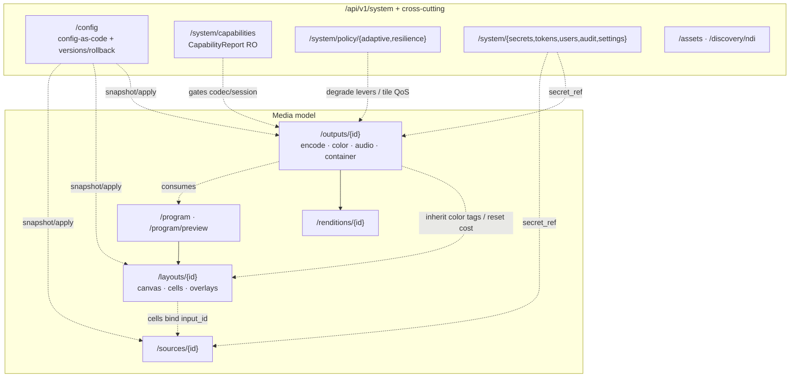

# Multiview — REST API

The Multiview control plane is a single [axum](../decisions/ADR-W001.md) HTTP service inside the
`multiview` binary. It exposes a **versioned, resource-oriented REST API** for all CRUD and command
operations, an [OpenAPI 3.1](../decisions/ADR-W002.md) contract, and interactive docs. Realtime
state (snapshots, deltas, meters, the *result* of async operations) flows over a separate
WebSocket/SSE channel documented in [realtime.md](./realtime.md).

> **Design principle.** The REST layer is a *thin shell*. A validated request is turned into a
> bounded command on the engine command bus and either answered synchronously or with `202 Accepted`
> + an operation id. The HTTP layer can **never** back-pressure or block the render/encode hot path
> (invariant #10). See [ADR-W008](../decisions/ADR-W008.md).

**Authoritative sources:** the management research brief
[`../research/management-capability-matrix.md`](../research/management-capability-matrix.md) (full
capability matrix + schemas) and the web stack brief
[`../research/web-api-stack.md`](../research/web-api-stack.md). Decisions:
[ADR-M001](../decisions/ADR-M001.md)…[M007](../decisions/ADR-M007.md) (resource/management model)
and [ADR-W001](../decisions/ADR-W001.md)…[W008](../decisions/ADR-W008.md) (stack).

---

## 1. Base path & versioning

| Property | Value |
|---|---|
| **Base path** | `/api/v1` |
| **Media type** | `application/json` (requests/responses); `application/problem+json` (errors) |
| **Versioning** | URL-prefixed major version. Breaking changes ⇒ `/api/v2`; additive changes stay in `v1`. |
| **OpenAPI spec** | `GET /api/v1/openapi.json` (OpenAPI **3.1.0**) |
| **Interactive docs** | `GET /docs` (Scalar try-it-out, same-origin) |
| **Realtime** | WS `/api/v1/ws`; SSE `/api/v1/events`; AsyncAPI at `/docs/events` — see [realtime.md](./realtime.md) |
| **Health** | `/livez`, `/readyz` (separate bind; never blocked by media) |
| **Metrics** | `/metrics` (Prometheus) |

The base path is **`/api/v1`** per the [canonical conventions](../architecture/conventions.md#6-api--realtime-conventions).
(The research briefs abbreviate this as `/api/v1/…`; read those resource paths as relative to `/api/v1`.)

---

## 2. Resource model

The API is rooted at `/api/v1` with these top-level resources. Ownership is assigned explicitly so
there is never a two-sources-of-truth conflict (see [ADR-M001](../decisions/ADR-M001.md)).

| Resource | Purpose | Owns (writes) |
|---|---|---|
| **`/sources/{id}`** | Inputs: ingest/decode, per-source **color override** (4 CICP axes), jitter/reconnect/resilience, per-input audio + subtitle attributes, transform, QoS | per-input ingest, decode, color, audio *attributes* |
| **`/layouts/{id}`** | Layout/template documents: `canvas` (incl. **working color space**), `layout` (grid\|absolute), `cells[]` (bind sources), `overlays[]` (first-class z-stack) | canvas, cell geometry, overlays, source binding |
| **`/outputs/{id}`** | Publishers: `encode` (EncodeProfile + backend), `color` (CICP tagging + HDR + tone-map + verify), `audio` (program bus + discrete tracks), `subtitles`, `container`, `failover`, `adaptive` | encode/transcode, output color *tagging*, input→track mapping |
| **`/renditions/{id}`** | ABR ladder rungs — each rung = one scale + encode session | rendition res/bitrate/codec |
| **`/program`, `/program/preview`** | Program/Preview bus: cue-then-take, cut/crossfade | which layout is live |
| **`/system/...`** | Capabilities, policy (adaptive/resilience), observability, config-as-code, users/RBAC, tokens, secrets, audit, settings (TLS/CORS/ports) | global policy defaults, security, settings |
| **`/assets`, `/secrets`, `/discovery/ndi`** | Cross-cutting stores (slate/logo assets, write-only secrets, NDI discovery) | — |



The full per-parameter capability matrix (every controllable engine parameter → API method+path →
UI control → apply class) lives in the
[management research brief](../research/management-capability-matrix.md#2-capability-tables); §6
below summarizes it.

---

## 3. Representative endpoints

Standard collection/item conventions apply across resources (`GET` list, `POST` create, `GET` item,
`PATCH` partial update, `PUT` replace, `DELETE`). Non-CRUD verbs use a `:action` suffix.

### 3.1 Sources

| Method | Path | Purpose |
|---|---|---|
| `GET` | `/api/v1/sources` | List sources |
| `POST` | `/api/v1/sources` | Create a source |
| `GET` | `/api/v1/sources/{id}` | Get a source |
| `PATCH` | `/api/v1/sources/{id}` | Update (most fields **hot**; URL/protocol = hot-with-reconnect) |
| `DELETE` | `/api/v1/sources/{id}` | Delete (drained off-thread) |
| `POST` | `/api/v1/sources/{id}/enable` · `/disable` | Toggle (disable ⇒ tile to NO-SIGNAL, no output reset) |
| `POST` | `/api/v1/sources/probe` · `/sources/{id}/probe` | ffprobe; auto-fills dropdowns (RO) |
| `POST` | `/api/v1/sources/{id}/reconnect` · `/reset` | Reconnect now / rebase PTS + clear jitter |
| `POST` | `/api/v1/sources/{id}/prewarm` · `/cue` | Off-air decode, then cue to preview |
| `GET` | `/api/v1/sources/{id}/color` | Resolved 4-axis color + per-axis provenance (RO) |
| `GET` | `/api/v1/sources/{id}/status` · `/info` · `/tracks` · `/metrics` | Health/state, stream info, A/V/sub tracks, metrics (RO) |

### 3.2 Layouts (canvas / cells / overlays)

| Method | Path | Purpose |
|---|---|---|
| `POST`/`GET`/`PUT`/`DELETE` | `/api/v1/layouts[/{id}]` | CRUD; `DELETE ?force` blocked if on Program |
| `POST` | `/api/v1/layouts/{id}:duplicate` · `:validate` · `:diff` · `:rollback` | Lifecycle (validate = garde + schemars) |
| `PATCH` | `/api/v1/layouts/{id}/canvas` | Resolution/fps/pixfmt/**working color space** (**reset if bound**) |
| `POST`/`PATCH`/`DELETE` | `/api/v1/layouts/{id}/cells[/{cellId}]` | Cell geometry/fit/border/color override |
| `PUT`/`DELETE` | `/api/v1/layouts/{id}/cells/{cellId}/source` | Bind / unbind a source (pre-warm then bind) |
| `POST` | `/api/v1/layouts/{id}/cells/{cellId}/source:swap` | Hot swap, no black flash |
| `POST`/`PATCH`/`DELETE` | `/api/v1/layouts/{id}/overlays[/{overlayId}]` | Overlay layers (label/clock/tally/meter/image/alert/subtitle…) |
| `GET` | `/api/v1/layouts/{id}/export?format=` · `POST /api/v1/layouts:import` | Config-as-code (migration on import) |

### 3.3 Program / Preview (the only path to live)

| Method | Path | Purpose |
|---|---|---|
| `GET`/`PUT` | `/api/v1/program` | Current program binding |
| `PUT` | `/api/v1/program/preview` | Cue a layout (pre-warms) |
| `POST` | `/api/v1/program:take` | **TAKE** — cut/crossfade to program (core live path) |
| `POST` | `/api/v1/program:take?dry_run=true` | Plan only; returns `reset_required` classification |

### 3.4 Outputs / Renditions

| Method | Path | Purpose |
|---|---|---|
| `POST`/`GET`/`DELETE` | `/api/v1/outputs[/{id}]` | CRUD (drained off-thread) |
| `POST` | `/api/v1/outputs/{id}/start` · `/stop` | Graceful EOS + flush |
| `PATCH` | `/api/v1/outputs/{id}/encode` · `/color` · `/audio` · `/subtitles` · `/container` | Sub-resource edits (apply class varies — §5) |
| `POST` | `/api/v1/outputs/{id}/plan` | **Dry-run**: seamless \| reset-lite \| migration |
| `POST` | `/api/v1/outputs/{id}/migrate` | Class-2 make-before-break cutover |
| `GET` | `/api/v1/outputs/{id}/health` · `/metrics` · `/color/verify` | Validity SLO + ffprobe verify gate (RO) |
| `POST`/`PATCH`/`DELETE` | `/api/v1/renditions[/{id}]` | ABR rungs (new = hot; live rung = Class-2) |

### 3.5 System

| Method | Path | Purpose |
|---|---|---|
| `GET` | `/api/v1/system/capabilities` · `/devices/{id}` · `/capabilities/sessions` | CapabilityReport — gates UI + validator ([ADR-M007](../decisions/ADR-M007.md)) |
| `GET`/`PUT` | `/api/v1/system/policy/adaptive` · `/policy/resilience` | Adaptive degradation + resilience policy |
| `GET`/`PUT` | `/api/v1/config` · `POST /api/v1/config:validate` · `:apply` · `/config/rollback` | Config-as-code ([ADR-M006](../decisions/ADR-M006.md)) |
| `GET`/`POST`/`DELETE` | `/api/v1/system/{users,tokens,secrets,audit,settings}` | Security & settings |
| `GET` | `/api/v1/system/build` | Effective license / features / NDI attribution (RO) |

---

## 4. Error model — RFC 9457

All errors use `application/problem+json` ([RFC 9457 Problem Details](https://www.rfc-editor.org/rfc/rfc9457)).
A `type` URI dereferences to documentation; field-level validation (garde via `axum-valid`) is carried
in an `errors[]` extension that the SPA renders inline.

```http
HTTP/1.1 422 Unprocessable Entity
Content-Type: application/problem+json
```
```json
{
  "type": "https://multiview.dev/problems/validation",
  "title": "Validation failed",
  "status": 422,
  "detail": "One or more fields are invalid.",
  "instance": "/api/v1/sources/cam-stage-main",
  "errors": [
    { "field": "srt.latency_us", "code": "out_of_range", "message": "must be 20000..8000000 (microseconds)" }
  ]
}
```

| Status | When |
|---|---|
| `400` | Malformed request |
| `401` / `403` | Unauthenticated / unauthorized (incl. per-object **BOLA** denial) |
| `404` | Unknown resource id |
| `409` | Conflict — e.g. **admission control rejected** the change (insufficient headroom) |
| `412` | `If-Match` precondition failed (stale version — §5) |
| `422` | Validation failed (`errors[]` populated) |
| `429` / `503` | Command bus saturated (`try_send` overflow — back-pressure shed, never blocked) |

---

## 5. Concurrency, idempotency & async operations

### 5.1 ETag / If-Match (optimistic concurrency)

Every mutable resource carries a monotonic version surfaced as an `ETag`. Mutations **must** send
`If-Match`; a stale value returns `412 Precondition Failed` so two operators cannot clobber a layout.
Backed by SQLite/sqlx ([ADR-W006](../decisions/ADR-W006.md)).

```http
GET /api/v1/layouts/lyt_1plus5            →  200 OK   ETag: "7"
PATCH /api/v1/layouts/lyt_1plus5          If-Match: "7"   →  200 OK   ETag: "8"
PATCH /api/v1/layouts/lyt_1plus5          If-Match: "7"   →  412 Precondition Failed
```

### 5.2 Idempotency-Key

State-changing **commands** (`start`/`stop`/`:swap`/`:take`) accept an `Idempotency-Key` header. A
retried request with the same key returns the original result instead of re-executing — safe retries
across flaky networks.

### 5.3 202 + operation id (async, frame-boundary apply)

Long-running / frame-boundary reconfiguration (source swap, relayout, controlled migration) returns
`202 Accepted` with an **operation id**. The HTTP response does **not** mean "done" — the final
outcome (success/failure, applied tick) arrives on the realtime stream keyed by that id. This keeps
the API honest: the UI shows real progress, never a fake "done" (see
[ADR-W008](../decisions/ADR-W008.md), invariant #11).

```http
POST /api/v1/program:take
Idempotency-Key: 4f1c…   If-Match: "8"
```
```http
HTTP/1.1 202 Accepted
Location: /api/v1/operations/op_8f2a
```
```json
{ "operation_id": "op_8f2a", "status": "accepted", "watch": "/api/v1/ws?op=op_8f2a" }
```

---

## 6. Live-apply classification (capability matrix)

Every edit is classified **before apply** (via `POST /outputs/{id}/plan` and
`program:take?dry_run=true`) and the class is surfaced in the UI so an operator knows the blast
radius. See [ADR-M005](../decisions/ADR-M005.md) and invariant #11.

| Class | Meaning | Examples |
|---|---|---|
| **Class-1 (hot / seamless)** | Applied at a frame boundary via atomic double-buffered scene-graph swap or `NvEncReconfigureEncoder` | the vast majority of params: geometry, color override, bitrate, fps, color *tags*, labels |
| **Reset-lite** | Single IDR / discontinuity within pre-allocated `max_width/max_height` | in-max NVENC resolution change |
| **Class-2 (controlled reset)** | Make-before-break parallel-output migration; downstream-visible discontinuity | `kind`, `video.codec/profile/level`, `pixel_format/bit_depth/chroma`, GOP structure (bframes/lookahead/refs/fixed-GOP), `max_width/height`, audio track layout, subtitle track-set, **canvas resolution/fps/pixfmt/working-color-space** (cost borne by attached outputs), HDR enable |
| **Listener-restart (safe)** | Never touches media output | API/health/metrics bind, TLS, port, CORS |

The capability matrix is **machine-readable** (`CapabilityReport`, [ADR-M007](../decisions/ADR-M007.md)):
the same data gates UI controls (greys impossible options) and the server-side validator. The
exhaustive table is in the
[management research brief §2](../research/management-capability-matrix.md#2-capability-tables).

---

## 7. Authentication & authorization

Dual-credential on one axum server ([ADR-W005](../decisions/ADR-W005.md)):

| Caller | Mechanism |
|---|---|
| **Web UI** | `tower-sessions` signed+encrypted cookie (HttpOnly + Secure + SameSite) **plus a CSRF synchronizer token** on state-changing requests (SameSite alone is insufficient) |
| **Machine / API** | Long random **API key (Bearer)**, stored as SHA-256/HMAC hash, shown once at creation (`POST /api/v1/system/tokens`) |

- **RBAC** `admin` / `operator` / `viewer` via `axum-login`.
- **BOLA (OWASP API1) is the #1 risk:** a per-object authorization check runs on **every** resource
  id (source/output/layout/preview), not just role gating.
- **Rate-limiting** on auth endpoints (`tower-governor`); **CORS** locked to the app origin (never
  `*` with credentials).
- **Secrets** (RTSP/SRT/RTMP/NDI creds) are reference-only (`${secret:ref}` / `op://…`), write-only,
  and never echoed back; preview access is gated by short-lived signed tokens.

---

## 8. OpenAPI 3.1 & interactive docs

The contract is **code-first** ([ADR-W002](../decisions/ADR-W002.md)): `utoipa 5` + `utoipa-axum`
register `#[utoipa::path]` handlers; `split_for_parts()` yields **both** the axum `Router` and the
`OpenApi` object from one source — no doc drift. utoipa emits **OpenAPI 3.1.0** (the requirement;
poem/poem-openapi was disqualified for emitting 3.0 only).

| Surface | Path | Notes |
|---|---|---|
| Spec | `/api/v1/openapi.json` | OpenAPI 3.1.0 |
| Try-it-out | `/docs` | **Scalar** (primary), assets embedded, same-origin |
| AsyncAPI (events) | `/docs/events` | Realtime envelope — see [realtime.md](./realtime.md) |

The SPA's typed client is generated from the spec (`openapi-typescript` + `openapi-fetch`).
Polymorphic `Source`/`Output` schemas use serde `untagged` + explicit discriminator mapping for clean
`oneOf`; the generated spec is validated in CI.

> **Scalar same-origin caveat:** same-origin alone does **not** disable Scalar's default external
> `proxy.scalar.com`. Use relative `servers` URLs, set `proxyUrl` to a same-origin path (or disable),
> and emit CORS headers — see the [web stack brief](../research/web-api-stack.md).

---

## See also

- [realtime.md](./realtime.md) — WebSocket/SSE envelope, snapshot+delta, operation results, meters.
- [Management capability matrix (research)](../research/management-capability-matrix.md) — every parameter, endpoint, UI control, apply class, and JSON/TOML schemas.
- [Web API stack brief (research)](../research/web-api-stack.md) — axum / utoipa / auth / sqlx / command-bus rationale.
- ADRs: [M001](../decisions/ADR-M001.md) · [M002](../decisions/ADR-M002.md) · [M003](../decisions/ADR-M003.md) · [M004](../decisions/ADR-M004.md) · [M005](../decisions/ADR-M005.md) · [M006](../decisions/ADR-M006.md) · [M007](../decisions/ADR-M007.md) · [W001](../decisions/ADR-W001.md) · [W002](../decisions/ADR-W002.md) · [W005](../decisions/ADR-W005.md) · [W006](../decisions/ADR-W006.md) · [W008](../decisions/ADR-W008.md).
- [Canonical conventions](../architecture/conventions.md) — the source of truth for paths, names, invariants.
