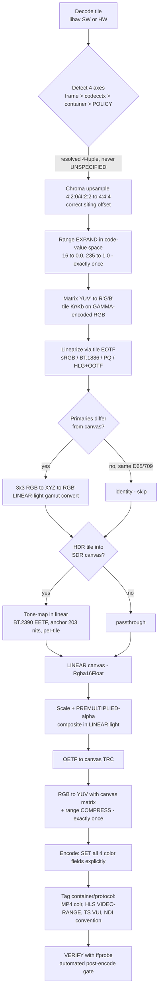

# Color Correctness Runbook

> **Source of truth for code:** [`conventions.md`](./conventions.md) §5 invariant 8.
> **Deep reference:** [`../research/color-management.md`](../research/color-management.md).
> **Decisions:** [ADR-C001](../decisions/ADR-C001.md) … [ADR-C006](../decisions/ADR-C006.md).

Multiview composites **heterogeneous** sources — each tile can carry different primaries,
transfer function, YUV↔RGB matrix, and range — into **one** canvas. Because the
[`multiview-compositor`](./conventions.md) runs a **custom GPU compositor and deliberately
bypasses swscale/FFmpeg filters**, libav performs **no** implicit color conversion for us.
We own correctness end-to-end: **detect → convert → composite in linear light → encode →
tag → verify**. Get any axis wrong and the output is *silently, visibly* wrong on some
players with zero errors. This is the bug class Multiview has repeatedly been burned by.

---

## 1. The four INDEPENDENT axes

Color is **four orthogonal axes**. They are signaled and defaulted **independently** — a
stream commonly tags one and leaves the rest unspecified. **Never collapse them into a
single "colorspace" concept.**

| # | Axis | Controls | FFmpeg field | "Unspecified" sentinel | Symptom when WRONG |
|---|------|----------|--------------|------------------------|--------------------|
| 1 | **Primaries** | R/G/B chromaticities + white point (the gamut) | `color_primaries` (`AVColorPrimaries`) | **2** | Wrong saturation/hue, gamut over/under-shoot (worst mixing BT.2020 into BT.709) |
| 2 | **Transfer / TRC** | Opto-electronic gamma curve (code ↔ linear light) | `color_transfer` (`AVColorTransferCharacteristic`) | **2** | Wrong gamma/contrast; PQ EOTF on SDR → grossly dark/washed; sRGB↔709↔1886 → "off" mids |
| 3 | **Matrix / Colorspace** | YUV↔RGB coefficients (Kr/Kg/Kb) | `color_space` (`AVColorSpace`) | **2** · `RGB=0` = "no matrix" | Hue/sat shift (greens & reds) when 601 coeffs applied to 709 content or vice-versa |
| 4 | **Range** | Quantization swing: limited "TV" (16–235 / 16–240) vs full "PC" (0–255) | `color_range` (`AVColorRange`) | **0** · `MPEG`=1 limited · `JPEG`=2 full | Limited-as-full → **grey/elevated blacks, washed, low contrast**; full-as-limited → **crushed blacks, clipped whites** |

> **Sentinel trap:** unspecified is **2** for primaries/TRC/matrix but **0** for range.
> Do not assume one sentinel across the four. (Source: `libavutil/pixfmt.h`.)
>
> **Range** is one of the highest-impact **and** most common bugs — but it is **not**
> categorically worse than a matrix mismatch. **Treat all four as first-class.**

### Range numerics (implement precisely)

- **Limited 8-bit:** luma `16..235`, chroma `16..240`, center `128`.
- **Full 8-bit:** luma `0..255`, chroma centered `128`.
- **10-bit limited:** luma `64..940`, chroma `64..960`, center `512`.
- Tie chroma center to **bit depth** (128 / 512 / 32768), never a constant. P010 stores
  10-bit in the **high** bits of 16-bit words — descale (right-shift 6) before normalizing.

---

## 2. The non-reorderable pipeline

The canonical per-tile recipe mirrors libplacebo and zimg. **The order is load-bearing —
do NOT reorder it** ([conventions §5.8](./conventions.md), [ADR-C003](../decisions/ADR-C003.md),
[ADR-C004](../decisions/ADR-C004.md)).



### Strict ordering rules (never violate)

1. **Range expansion BEFORE the YUV→RGB matrix**, in code-value space (black 16 → `0.0`,
   white 235 → `1.0`).
2. **Matrix runs on gamma-encoded R′G′B′** — not on linear light.
3. **Linearize (EOTF) before any scaling/blending/primaries math.**
4. **Primaries conversion is in LINEAR light** (RGB→XYZ→RGB′), separate from the YUV
   matrix — never matrix-YUV between primaries. Identity (skip) when all sources and canvas
   are same-D65 BT.709.
5. **Scale & alpha-blend in LINEAR light with PREMULTIPLIED alpha.** Compositing in
   gamma/YUV space causes dark edge fringing and wrong mids — independent of all other
   correctness. ([ADR-C003](../decisions/ADR-C003.md).)
6. **Exactly ONE range expansion on input and ONE compression on output.** Beware double
   conversion — a HW decoder or an auto-inserted swscale `scale` can implicitly convert
   before your code runs. ([ADR-C004](../decisions/ADR-C004.md).)

The linear working/canvas buffer is **`Rgba16Float`** (16-bit float minimum; 8-bit bands
severely, HDR requires float). **`*_SRGB` texture formats give free HW sRGB↔linear only for
the sRGB curve** — do PQ / HLG / BT.709-OETF / BT.1886 linearization **manually in-shader**,
or all downstream linear math is silently corrupted. Frames stay **NV12 throughout**
([conventions §5.5](./conventions.md)); YUV→RGB happens in-shader at tile size. Select the
per-tile kernel/uniforms from the full `(primaries, trc, matrix, range, bit-depth)` tuple,
not a hardcoded matrix.

> Coefficient tables (Kr/Kg/Kb), exact range divisors, EOTF/OETF constants, and chroma
> siting offsets are in [`../research/color-management.md` §4](../research/color-management.md).

---

## 3. Untagged-input default policy

**The untagged trap is the heart of this domain.** Vast amounts of real live content
(RTSP/SRT/TS, IP cameras, webcams) ship **untagged**, and every consumer guesses
*differently*. swscale silently uses **index-0 = BT.601** for an unspecified matrix
**regardless of resolution**; players/libplacebo/mpv use a **resolution heuristic** instead.
**Multiview must reproduce the PLAYER behavior, not swscale's** — otherwise the multiview disagrees
with how a source looks in a real player. ([ADR-C002](../decisions/ADR-C002.md).)

### 3.1 Detection precedence (per tile, every frame)

**Lock the precedence as `frame > codec ctx > container > policy` and test it.**

1. **`AVFrame.color_*`** — preferred (may differ per frame).
2. **`AVCodecContext.color_*`** for any field still `UNSPECIFIED`. Keep an explicit guard
   (`if (frame->color_range == AVCOL_RANGE_UNSPECIFIED) frame->color_range = avctx->color_range;`)
   — current FFmpeg usually does this, but behavior is **path/version dependent**.
3. **Container tags** (MP4/MOV `colr` nclx, surfaced by the demuxer). Note: container `colr`
   can contradict or be absent relative to the elementary-stream VUI — wrong precedence
   silently flips colors.
4. Still unspecified → apply the **default policy** below and **log the fallback** with the
   tile id + resolved 4-tuple.

### 3.2 Default policy (the libplacebo/mpv rules)

| Axis | Default for genuinely unspecified |
|------|-----------------------------------|
| **Range** | YCbCr/YUV ⇒ **limited** (`MPEG`); RGB/packed-RGB ⇒ **full**. Matches H.264 Annex E / H.265 inferring `video_full_range_flag = 0` when absent. |
| **Matrix + Primaries** | Resolution heuristic: `width ≥ 1280 OR height > 576` ⇒ **BT.709**; `height == 576` ⇒ **BT.601-625 (PAL)**; `height == 480 or 486` ⇒ **BT.601-525 (NTSC/170M)**; else **BT.709**. |
| **TRC** | SDR default **BT.709 transfer**. Decode video with **BT.1886** (≈ pure 2.4) as display EOTF; use **sRGB piecewise** for graphics/screen-capture/PNG/JPEG RGB. |

- **NEVER auto-promote to BT.2020 / PQ / HLG from resolution** — libplacebo refuses (4K is
  still guessed BT.709). Honor wide-gamut/HDR **only when explicitly tagged**.
  Mis-promoting SDR→HDR or applying a PQ EOTF to SDR is catastrophic.
- **Where the stream DOES tag an axis, always trust the tag over the heuristic.**
- **Provide a per-source override** in config for each axis (and chroma siting) — the
  heuristic *will* sometimes be wrong (SD intended as 709, full-range YUV mislabeled
  limited, vendor cameras with nonstandard tags). Overrides take precedence over detection.

### 3.3 Hardware-decode metadata caveats

| Decoder | Behavior | Action |
|---------|----------|--------|
| **NVDEC / cuvid** | Maps VUI → avctx; current FFmpeg propagates avctx → frame. A properly-tagged stream **does** carry color (the old "HW frames are always UNSPECIFIED" premise is inaccurate). | Keep the avctx→frame guard + policy fallback; verify per FFmpeg/driver version. |
| **VideoToolbox (Apple)** | Carries color as CVImageBuffer attachments; **does not invent** tags for untagged input. **Known bug:** HW decode has mis-applied the full-range flag (mpv #6546). | **Trust the bitstream/container VUI, NOT the decoded surface, for range on macOS.** |
| **VAAPI** | Frame-level color reliability **not confirmed**. | Best-effort: inherit from codec ctx/parser; verify empirically (open item). |

> **The detection layer must emit a never-`UNSPECIFIED` 4-tuple** (+ chroma siting + bit
> depth) for every tile every frame, stored beside the tile's GPU frame handle. **Never pass
> `*_UNSPECIFIED` into the kernel.** Log when the policy fallback fires.

---

## 4. Canvas default

**Default canvas: SDR BT.709, limited range** — `primaries=1, transfer=1, matrix=1,
full_range_flag=0` ([ADR-C001](../decisions/ADR-C001.md)). It is the universally and
correctly-rendered lingua franca across RTSP/HLS/RTMP/SRT/NDI; downstream HDR rendering is
fragile. Canvas color space is a **config option**: `sdr-bt709-limited` (default) /
`hdr-pq-bt2020` / `hdr-hlg-bt2020` (opt-in), driving whether gamut-convert + tone-map are
active and which output tags / static metadata are authored.

**Mixing HDR tiles into the SDR canvas — the wash-out rule:** one HDR tile must not wash out
the SDR multiview. **Tone-map each HDR tile DOWN, per-tile (not per-canvas), with a roll-off
anchored at BT.2408 reference white = 203 cd/m²** (≈58% PQ → SDR 100% white; highlights roll
off). Linear normalization to peak crushes the SDR tiles. Default tone-mapper is **BT.2390
EETF** — standardized, deterministic, temporally stable (no live flicker), portable to
CUDA/Metal/wgpu ([ADR-C005](../decisions/ADR-C005.md)). **Never composite PQ/HLG/BT.709 code
values directly** — `PQ 0.58 ≠ HLG 0.58 ≠ BT.709 0.58` in linear; converge in BT.709 linear,
then blend. HDR strategy depth (passthrough canvas, what actually triggers HDR) is in
[`../research/color-management.md` §5](../research/color-management.md).

---

## 5. Output tagging + verify

> **Tagging only LABELS; it never converts.** The encoder copies your `color_*` fields into
> the bitstream VUI/SEI (and MP4 `colr`) and derives **nothing** from pixels. **The declared
> tags MUST match the pixels your shaders produced.** **Encoders write NOTHING by default** —
> unspecified ⇒ CICP 2 ⇒ players re-guess (the same trap, at the output stage).
> ([ADR-C006](../decisions/ADR-C006.md).)

### 5.1 Canonical SDR output tag

**BT.709 limited:** `color_primaries=1`, `color_trc=1`, `colorspace=1`, `color_range=tv`,
pixel format NV12/yuv420p limited. **Set all four every time** to remove the player's
resolution guess.

### 5.2 Per-encoder pitfalls

- **libx264 / libx265:** default all four to **undef**; x265 emits a VUI with timing only.
  Set `colorprim/transfer/colormatrix` + range. (x264/x265 are **GPL** — the LGPL-clean
  default build uses a different software encoder, but the **same tagging discipline** applies.)
- **NVENC (NV12):** writes `videoFullRangeFlag=1` **only when** `color_range == JPEG` or
  pixfmt is YUVJ. **NV12 has no YUVJ escape hatch** → for full-range NV12 you MUST set
  `AVCOL_RANGE_JPEG` and confirm it reaches the encoder, else flag=0 and players crush/expand.
  Driving the SDK directly, you OWN `videoSignalTypePresentFlag`, `colourDescriptionPresentFlag`,
  `videoFullRangeFlag`, and the three CICP fields.
- **VideoToolbox:** defaults to **MPEG/limited** silently
  (*"Color range not set for yuv420p. Using MPEG range."*); set frame `AVCOL_RANGE_JPEG` for
  full range.
- **VAAPI / SVT-AV1 / libaom:** behavior **not verified here** — test per driver/encoder with
  ffprobe (open items).

### 5.3 Per-container / protocol

| Transport | How color is carried | Rule |
|-----------|----------------------|------|
| **MP4/MOV** | `colr` (**nclx**) atom, written by default when color is set | Prefer **nclx** over legacy `nclc` (no range bit). SDR 709 limited = `1/1/1, full_range_flag=0`. |
| **HLS (fMP4)** | `colr` in init segment **AND** playlist `EXT-X-STREAM-INF VIDEO-RANGE` | Both must match TRC: **SDR** for TC {1,6,13,14,15}, **HLG** for TC 18, **PQ** for TC 16. Correct `CODECS` string. |
| **MPEG-TS** | **No container box** — color lives **only** in the elementary-stream VUI | TS correctness is 100% dependent on the encoder writing a **complete VUI**; the in-band `full_range_flag` is the *sole* range signal. |
| **NDI** | **No per-frame CICP** — pure convention | **YUV (UYVY/NV12/I420/P216/YV12) = LIMITED** (matrix by resolution: 601 SD / 709 HD / 2020 UHD); **RGBA/BGRA = FULL**. Apply by hand on **both ingest and output**. |
| **RTMP / raw** | VUI only | Same as TS — force a complete encoder VUI. |

> For HDR: VUI color tags (PQ/HLG transfer + BT.2020 primaries + 10-bit) are **what trigger
> HDR rendering**, NOT ST 2086/MaxCLL. Static metadata is recommended (guides tone-mapping)
> but **omitting it does not demote the stream to SDR**; omitting the **VUI tags** causes the
> dim/washed look. For elementary-stream transports prefer **in-band SEI** for ST 2086 +
> MaxCLL/MaxFALL. See [`../research/color-management.md` §5.4](../research/color-management.md).

### 5.4 VERIFY — mandatory automated post-encode gate

Never assume the encoder wrote what you asked. **Fail the stream if any field is `unknown` or
differs from policy.** This runs as part of the "bulletproof continuous output" SLA — a tag
regression fails fast rather than silently shipping wrong color.

```bash
ffprobe -hide_banner -loglevel warning -select_streams v -print_format json \
  -show_entries stream=color_space,color_primaries,color_transfer,color_range,pix_fmt \
  -show_frames -read_intervals '%+#1' INPUT
```

- Check **both** the bitstream VUI **and** (for MP4) the `colr` atom.
- **Re-verify after every encode AND every remux** — TS↔MP4 remux can lose/regenerate `colr`.
- For **relabel-only** fixups (pixels correct, merely mislabeled) use the
  `h264_metadata` / `hevc_metadata` bitstream filters with `-c copy` — they **never
  re-process pixels**.

---

## 6. High-risk claims (carry verbatim)

1. **Encoders write NO color tags by default.** Untagged ⇒ players guess ⇒ silently wrong.
   Tag all four + verify in the actual bitstream/container.
2. **Tagging ≠ converting.** If shader output doesn't match declared tags, the file is
   silently wrong with zero errors.
3. **HDR is triggered by VUI color tags (PQ/HLG transfer + BT.2020 primaries + 10-bit), NOT
   by ST 2086/MaxCLL.** Omitting static metadata does **not** cause SDR fallback; omitting
   the VUI tags DOES cause the dim/washed look.
4. **NVENC full_range_flag needs `JPEG` range/YUVJ; NV12 has no YUVJ escape hatch** → full-
   range NV12 needs explicit JPEG range reaching the encoder, else flag=0 and crush/expand.
5. **VideoToolbox defaults to limited silently; VT HW decode has mis-applied full-range
   (#6546)** — trust the VUI, not the surface.
6. **swscale defaults an unspecified matrix to BT.601 with no resolution awareness** —
   opposite of players; never lean on swscale defaults for untagged HD.
7. **HW-decode metadata is version/path/driver dependent.** Keep the avctx→frame guard +
   policy fallback; verify per version (NVDEC/VAAPI/VT).
8. **NDI carries no CICP** — YUV=limited (matrix-by-resolution), RGBA=full; wrong = elevated-
   black/crushed bug on both ingest and output.
9. **Never auto-promote SDR→BT.2020/PQ/HLG by resolution.**
10. **Double range conversion** (HW decoder or auto-swscale converts before your code) —
    expand exactly once.
11. **FFmpeg 7 is stricter** — may ERROR ("Invalid color space") on unspecified in filter
    graphs instead of silently defaulting; do not depend on implicit defaulting.

---

## See also

- Deep brief — [`../research/color-management.md`](../research/color-management.md) (coefficient
  tables, EOTF/OETF constants, NPM matrices, chroma siting, HDR strategy).
- ADRs — [C001 canvas default](../decisions/ADR-C001.md) ·
  [C002 untagged policy](../decisions/ADR-C002.md) ·
  [C003 linear-light compositing](../decisions/ADR-C003.md) ·
  [C004 range once](../decisions/ADR-C004.md) ·
  [C005 tone-mapping](../decisions/ADR-C005.md) ·
  [C006 tag + verify](../decisions/ADR-C006.md).
- Conventions — [`conventions.md`](./conventions.md) (§5.5 NV12-throughout, §5.8 pipeline order).
