# Feature Dependency Map — 2026-06-13 intake

**Status:** Design map (Proposed) — docs-only. Companion to the
[feature-intake catalog](../development/feature-intake-2026-06-13.md).

This map shows how the new design domains (the 2026-06-13 operator intake) depend on each other and on
the **existing** programs already on current main. An edge means **extends / depends-on / maps-onto /
shares**. Nothing here changes a data-plane invariant: every new domain is a *consumer-side* or
*control-plane* addition (inv #1/#10).

## 1. Graph

```mermaid
flowchart TD
  classDef existing fill:#e6f0ff,stroke:#356,stroke-width:1px;
  classDef intake fill:#eaffea,stroke:#363,stroke-width:1px;
  classDef defect fill:#fff0e6,stroke:#963,stroke-width:1px;

  subgraph EX[Existing on current main]
    PS[production-switcher\nADR-0054-0059]:::existing
    MP[media-playout\nADR-0057/0058]:::existing
    DR[decoupled-routing\nADR-0034]:::existing
    ISO[iso-program-recording\nADR-0037]:::existing
    PV[preview-subsystem\nADR-P001-P007]:::existing
    MD[managed-devices\nADR-M008/M009]:::existing
    WR[webrtc\nADR-0048/0049]:::existing
    SAP2[self-aware-placement\nADR-0035]:::existing
    WC[wall-clock-sync\nADR-0038]:::existing
    OVL[overlay\nADR-R008/0016]:::existing
    A59[switcher-audio first slice\nADR-0059]:::existing
    YT[yt-dlp resolver\nADR-0015]:::existing
    CN[conspect telemetry\nADR-0052]:::existing
    EM[EncodeProfile+tag\nADR-M002/C006]:::existing
    LA[live-apply\nADR-M005/M012/W018/W022]:::existing
    GM[gpu-monitoring\nADR-0017/0018]:::existing
  end

  subgraph IN[Intake 2026-06-13]
    SWAUD[switcher-audio\n0077-0079]:::intake
    OFF[input/consumption offsets\nT016/T017]:::intake
    CUES[broadcast-cues\n0072-0076]:::intake
    REC[recording-storage-offload\n0069-0071]:::intake
    DET[object-detection-ai\n0066/0067]:::intake
    MOT[motion-scene-detection\n0068]:::intake
    ONV[onvif-and-ptz\n0062-0064]:::intake
    UNI[unifi-protect-compat\n0065]:::intake
    MGFX[motion-graphics-html\n0080-0082]:::intake
    URL[url-input\n0083]:::intake
    SIP[sip-calling\n0084/0085]:::intake
    SURF[control-surfaces-midi\n0086]:::intake
    OSVC[online-services\n0087]:::intake
    OUTM[output-metadata+orientation\n0088/0089]:::intake
    LOG[observability-logging\n0060]:::intake
    STAT[system-stats-attribution\n0061]:::intake
    WEB[webui-operability-gaps\n0090-0094]:::intake
    DEF[current-defects triage]:::defect
  end

  SWAUD --> A59
  SWAUD --> DR
  OFF --> WC
  OFF --> A59
  OFF --> DR
  OFF -. per-switcher audio = strip delay .-> SWAUD
  CUES --> PS
  CUES --> DR
  CUES --> REC
  CUES --> SWAUD
  CUES -. GPIO node .-> MD
  REC --> ISO
  REC --> CN
  DET --> PV
  DET --> SAP2
  DET --> REC
  MOT --> DET
  MOT --> REC
  ONV --> MD
  UNI --> ONV
  MGFX --> OVL
  MGFX --> MP
  URL --> MGFX
  SIP --> WR
  SIP --> SWAUD
  SURF --> PS
  SURF --> SWAUD
  OSVC --> YT
  OSVC --> MP
  OSVC --> REC
  OUTM --> EM
  OUTM --> PV
  STAT --> SAP2
  STAT --> GM
  WEB --> PV
  WEB --> LA
  WEB --> SAP2
  WEB -. selectable tracks .-> DR
  LOG --> CN
  DEF --> LOG
```

## 2. Build-order chains (longest-pole first)

- **Detection→record chain:** `preview-tap → DET (0066) → MOT (0068) → REC trigger (0067/0069) → S3
  offload (0070) → Iceberg/SeaweedFS catalog (0071)`. The frame-tap (DET) is the shared foundation
  for both detection and motion; recording-storage is the sink.
- **Cue chain:** `cue bus + action vocab (0072, maps onto switcher M012/W021) → GPIO/SCTE/manifest/BXF
  ingress (0073-0076)`. Actions reuse the shipped switcher/macros/audio/record surfaces — the new work
  is *ingress* + *emit*.
- **Audio chain:** `ADR-0059 first slice → SWAUD strips/buses/matrix (0077) → mix-minus/talkback
  (0078) → monitor/AFV/output-routing (0079)`; SIP returns and SURF faders hang off it.
- **Graphics chain:** `MGFX engine (0080) → templating/n-source (0081) → render-to-VT (0082)`; URL-input
  (0083) shares the engine.
- **Offset chain:** `ADR-0038 encoded-delay + ADR-0059 §5 AudioReader → OFFSET realization (T017) →
  4-level resolution + apply-class (T016)`; the switcher per-strip delay is its per-switcher audio
  case.
- **Device chain:** `managed-devices → ONVIF (0062-0064) → UniFi compat (0065)`.

## 3. Invariant stress (where each domain must prove #1/#10)

| Domain | #1 (output clock) | #10 (no back-pressure) |
|---|---|---|
| switcher-audio, offsets | consumer-side bus mix / read-index shift — never paces the clock | AudioReader cursors, drop-oldest seam |
| cues | cues are *sampled*; actions go through the control command bus | GPIO/SCTE/manifest ingress off the data plane |
| detection, motion | output never gated on a detector | read-only drop-oldest frame tap |
| recording, S3/Iceberg | record taps copy; never stalls the engine | bounded drop-oldest + capped-backoff write path (reuses ADR-0037) |
| sip | media via the WebRTC engine, off the data plane | drop-oldest rings; mix-minus return |
| html graphics, url-input | renderer decoupled; engine never awaits it | drop-oldest latest-frame |
| onvif/ptz, surfaces, unifi | program output never contingent on a device (managed-devices doctrine) | control-plane pollers/actors |
| logging, stats | — | bounded/async; read-only telemetry |
| output metadata/orientation | applied at encode/mux, not on the clock path | — |
| webui gaps | live-apply Class-1/2; re-assess confirm | preview/control isolation preserved |

## 4. See also

- [feature-intake catalog](../development/feature-intake-2026-06-13.md) — the request→doc matrix +
  backlog lanes + operator decision points.
- [conventions.md §5](conventions.md) — the canonical invariants.
- Existing program briefs: [production-switcher](../research/production-switcher.md),
  [conspect-account-architecture](../research/conspect-account-architecture.md),
  [decoupled-routing](../research/decoupled-routing.md), [managed-devices](../research/managed-devices.md),
  [iso-program-recording](../research/iso-program-recording.md), [self-aware-placement](../research/self-aware-placement.md).
