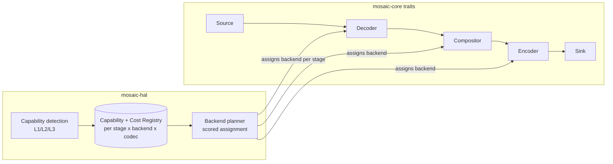
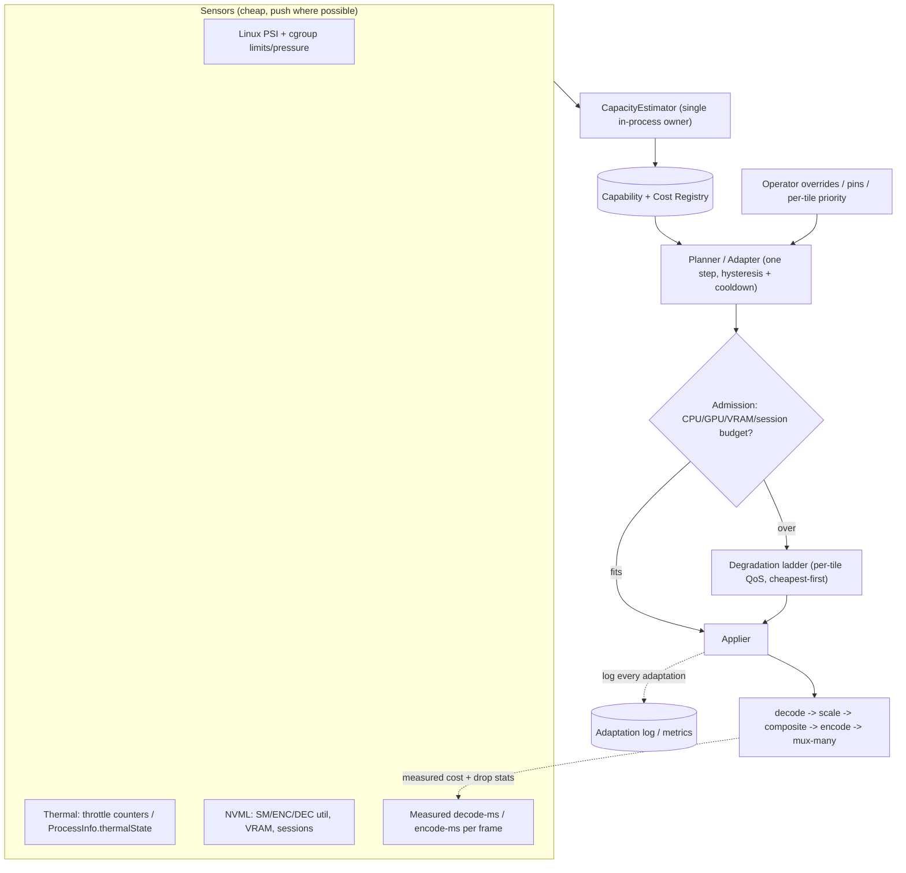

# Hardware Abstraction & Commodity-Hardware Efficiency

How Mosaic stays fast and bounded on real hardware: the **Hardware Abstraction Layer (HAL)**, per-stage backend **negotiation** and **cost model**, and the **commodity-first efficiency strategy** (decode-at-display-resolution, NV12-throughout, encode-once-mux-many, frame pooling, and resource-adaptive degradation).

> Canonical names, crate boundaries, feature flags, and invariants live in [`conventions.md`](./conventions.md) — that document wins on any naming conflict. This page links to the deep briefs at [`../research/core-engine.md`](../research/core-engine.md) and [`../research/efficiency.md`](../research/efficiency.md) rather than duplicating them.

**Governing constraint:** an N-tile live mosaic must run *well* on a single entry/old GPU, an Intel iGPU (QSV/VAAPI), an AMD APU, a base Apple-silicon Mac, and low-RAM/few-core boxes. A 4-GPU/1 TB server is the trivial case, never the design target.

---

## 1. Where the work lives

| Concern | Canonical crate | What it owns |
|---|---|---|
| Capability detection, backend registry, **negotiation** + **cost model/planner** | [`mosaic-hal`](./conventions.md#3-canonical-crate-map) | Probes hardware; ranks/scores backends per stage; emits a plan; feeds admission + degradation inputs |
| Shared traits & types | `mosaic-core` | `Frame`, `PixelFormat` (NV12 canonical), `ColorInfo`, the stage traits (`Source`, `Sink`, `Decoder`, `Encoder`, `Compositor`, `Backend`) |
| Last-good-frame stores + tile state machine | `mosaic-framestore` | Lock-free single-slot stores; LIVE→STALE→RECONNECTING→NO_SIGNAL |
| The GPU compositor (NV12-in → NV12-out, single pass) | `mosaic-compositor` | wgpu baseline + CUDA/Metal/VAAPI fast paths |
| The protected output core + **adaptive control loop** | `mosaic-engine` | Output clock, compositor drive, admission/degradation loop, hot-reconfiguration |
| Per-engine telemetry behind a `GpuStats` trait | `mosaic-telemetry` | NVML / macmon-IOReport / no-op; corroborates the cost model |

> The efficiency brief sketches `mosaic-planner` / `mosaic-sensors` / `mosaic-frame` as separate crates; per [`conventions.md`](./conventions.md), those responsibilities are **folded into `mosaic-hal`, `mosaic-engine`, `mosaic-telemetry`, and `mosaic-framestore`** respectively. The triangle that matters is **planner ↔ capability+cost registry ↔ frame pool**: the registry says *what is possible and what it costs*, the pool *bounds the bytes*, and the planner *chooses the cheapest plan that fits and degrades gracefully when it does not*.

---

## 2. The HAL: per-stage backends behind one trait set

Each pipeline stage is a trait in `mosaic-core` with multiple **feature-gated** implementations. Stages are negotiated **independently**, but the planner heavily penalizes any cross-vendor/device seam. Channels carry **backend-tagged frame handles, never pixels** — a handle wraps the concrete surface (CUDA `CUdeviceptr` + pitch, `VkImage`/wgpu `Texture`, `IOSurface`/`MTLTexture`, or a host buffer) plus color matrix/range/`sw_format`/geometry metadata.



### 2.1 Three-layer capability detection

Pattern proven by OBS, GStreamer, and Norsk (see [core-engine brief §6.2](../research/core-engine.md)):

- **L1 — Portable baseline (FFmpeg):** `av_hwdevice_iterate_types`, `av_hwdevice_ctx_create` (probe device init), `avcodec_get_hw_config` per codec. Coarse, vendor-agnostic.
- **L2 — Vendor deep queries:** NVIDIA encode `NvEncGetEncodeCaps`/`NV_ENC_CAPS` (needs an open session) + decode `cuvidGetDecoderCaps`; Intel oneVPL `MFXQueryImplsDescription`; VAAPI `vaQueryConfigProfiles`/`Entrypoints`; macOS `VTCopyVideoEncoderList` + `VTIsHardwareDecodeSupported`. **NVML cannot report codec/resolution capability** — only sessions/utilization/capacity.
- **L3 — Sandboxed probe:** open a tiny encode+decode session at the target resolution in a subprocess to catch driver mismatch and session-cap exhaustion. Cache keyed by `(GPU model + driver/SDK version + OS)`; invalidate on driver/OS change.

Devices are correlated across NVML / VAAPI DRM node / oneVPL / wgpu adapter by **PCI bus id / UUID / IOKit id** so the planner knows when decode + composite + encode share one physical device — the precondition for staying on-GPU. **Never key by NVML index** (enumeration order is not stable across reboots).

### 2.2 Scoring / planning algorithm

Modelled as a constrained assignment over nodes `{decode, composite, encode}` per stream/output. Each candidate backend carries a static **rank** (the prior per `(vendor, stage, codec)`), a **measured cost** (decode-ms/encode-ms from the registry), and **hard constraints** (codec/resolution support; NVENC session budget). See [ADR-0003](../decisions/ADR-0003.md) and [ADR-E008](../decisions/ADR-E008.md).

```text
plan(stream):
  candidates = {stage: [backends compiled-in AND probed-available]}
  for each full assignment a:
    cost(a) = Σ stage_rank_cost
            + Σ boundary_penalty(stage_i.device, stage_{i+1}.device)   # 0 if same device
            + (session_budget_violation(a) ? +∞ : 0)
            + (capability_violation(a)    ? +∞ : 0)
    if a stays on one device end-to-end: large bonus  # prefer zero-copy island
  choose argmin cost(a)
  insert explicit hwtransfer node at any surviving device boundary
```

**Default:** keep a stream's full decode→composite→encode on one device; split across vendors **only** when a hard constraint forces it (session cap, codec absent, capacity). Software is the universal fallback tier and the GPU-less CI enabler.

### 2.3 Zero-copy islands, costed seams

Mosaic treats each GPU vendor as a **zero-copy island** and budgets an explicit `av_hwframe_transfer_data` (host) copy at every seam ([ADR-0004](../decisions/ADR-0004.md)). **Cross-vendor on-GPU zero-copy does not exist on desktop** — never architect for it.

| Path | Status | Note |
|---|---|---|
| NVDEC → CUDA composite → NVENC | **Zero-copy** | One shared CUDA context; keep `AV_PIX_FMT_CUDA` end-to-end (skip `av_hwframe_transfer_data`) to avoid the ~2× PCIe penalty |
| VideoToolbox → Metal → VideoToolbox | **Zero-copy** (lowest risk) | IOSurface-backed `CVPixelBuffer` via `CVMetalTextureCache`; keep IOSurface use-counts |
| VAAPI/QSV → Vulkan via DRM-PRIME/dma-buf | **Zero-copy, fragile** | Modifier + cross-API sync sensitive; validate per driver; keep copy fallback |
| Any cross-vendor (e.g. VAAPI decode → NVENC) | **Copy** | Host round-trip; importing a foreign dma_buf into CUDA is Tegra-Thor-only |
| CUDA → wgpu(Vulkan) | **Copy** | wgpu has no stable external-memory import → prefer a CUDA-native compositor on NVIDIA |
| NDI in/out | **Copy** (host memory) | Always ≥1 host↔GPU transfer; "zero-copy" only means avoiding the *extra* memcpy |

A CI **"stayed-on-GPU"** assertion counts host↔device copies so silent fallbacks fail the build.

---

## 3. Per-platform backend matrix

The negotiator's per-platform priority and zero-copy reality. macOS has **no** CUDA/NVENC/VAAPI; VideoToolbox/Metal is the only HW path. AV1 HW decode needs Ampere+/Arc/RDNA2+/M3+; AV1 HW encode needs Ada+/recent Intel/AMD — runtime-probe, never assume.

| Platform | Decode (priority) | Composite | Encode (priority) | On-GPU zero-copy? |
|---|---|---|---|---|
| **Linux NVIDIA** | NVDEC (cuda hwaccel) → CPU | **Custom CUDA kernels** (fused convert+scale+place) | NVENC → x264/SVT-AV1 (`gpl-codecs`/sw) | **Yes** — NVDEC→CUDA→NVENC, single CUDA context |
| **Linux Intel/AMD** | VAAPI / QSV (oneVPL, Gen12+) → CPU | **wgpu / Vulkan(ash) / libplacebo** via dma-buf | VAAPI (`low_power`) / QSV → x264/SVT-AV1 | **Yes within VAAPI/Vulkan** via dma-buf (modifier + sync sensitive) |
| **macOS (Apple Silicon + Intel)** | VideoToolbox → CPU | **Metal compute** (IOSurface via `CVMetalTextureCache`) | VideoToolbox → x264/SVT-AV1 | **Yes** — VT→IOSurface→Metal→VT (cleanest) |
| **CPU / software (any)** | native libav / dav1d | wgpu portable or CPU/SIMD | x264 / SVT-AV1 / native AAC | N/A (host memory) |

Feature flags (canonical, [conventions §4](./conventions.md#4-feature-flag-taxonomy-canonical)): codec backends `cuda`, `videotoolbox`, `vaapi`, `qsv`, `software` (always on); compositor backends `wgpu` (default), `metal`, `cuda`; umbrella presets `nvidia` / `apple` / `linux-vaapi` / `full`. NV12 is unsupported on the wgpu **Metal** backend, which is *why* macOS uses native Metal for the fast path.

---

## 4. Efficiency philosophy

1. **Bandwidth and memory are the wall, not compositor arithmetic.** A mosaic is sample-scale-into-a-grid; that math is cheap. Especially on iGPUs/APUs/Apple-silicon (GPU shares DDR with CPU), the binding resource is **memory bandwidth** and **VRAM/RAM footprint**, then fixed-function decode/encode throughput. **Optimize bytes moved before FLOPs.**
2. **Pixels you never materialize cost nothing.** Never decode/carry a tile at more pixels than displayed; never expand to RGBA. Both reductions are multiplicative across N tiles.
3. **Encode is the most expensive and capacity-capped stage.** Composite once, encode the canvas once, fan the *same* bitstream to many transports. Per-output/per-tile re-encode is the cardinal sin.
4. **Stay on-device, refcount, bound everything.** One shared context, device-resident surfaces, refcounted pooled frames, tiny bounded queues that **drop** rather than buffer.
5. **Capability is per-(stage × backend × codec), negotiated, never assumed.** Budget for the *worst realized path* per tile, not the best.
6. **Adapt to the box, degrade gracefully, never break output.**
7. **Measure per-engine, budget per-tier, regression-gate in CI.** Decode, composite, encode live on physically distinct hardware → distinct counters. Density is a vector: tiles per core, per GB, per watt, per tier.

See the full treatment in [efficiency brief §1](../research/efficiency.md).

---

## 5. Decode-at-display-resolution capability matrix

The highest-leverage lever — but **decode-time downscaling is neither universal nor nonexistent**. Model it as a per-backend tier ([ADR-E001](../decisions/ADR-E001.md), [invariant §5.6](./conventions.md#5-canonical-technical-invariants)):

| Backend | Decode-time downscale reality | Where the cost lands |
|---|---|---|
| **NVIDIA NVDEC** | **TRUE fused decode-time resize** (`-resize WxH`/`-crop`, `CUVIDDECODECREATEINFO::ulTargetWidth/Height`); runs on the NVDEC ASIC for free, output stays NV12/P016 (never RGB). **One output res per session** — a source feeding two tile sizes needs one extra on-GPU `scale_cuda` pass. Bitstream is still entropy-decoded at source res → budget by **source MP/s**. | NVDEC ASIC; resize free |
| **Apple VideoToolbox** | **TRUE reduced-res decode exists** (`kVTDecompressionPropertyKey_ReducedResolutionDecode`) but **optional, codec-dependent, best-effort**. **FFmpeg's VT decoder never requests it** → via FFmpeg you decode full-res then `scale_vt`. True reduction needs a direct `VTDecompressionSession`, probed per codec. | Media Engine (full-res via FFmpeg); VTPixelTransferSession for the scale |
| **Intel QSV / VAAPI** | **Mostly post-decode.** `scale_qsv`/`scale_vaapi` is a separate VPP/SFC pass *after* full-res decode. Intel SFC decode-scaling exists in libva but FFmpeg does **not** fuse it (and SFC has min/max ratio limits). **Budget ≥1 full-res surface per stream.** | VDBox full-res decode + cheap SFC/VPP scale |
| **Software (libavcodec)** | **No decode-time downscale for codecs that matter.** `lowres` only works where `max_lowres>0` (MPEG-1/2, MJPEG); H.264/HEVC/VP9/AV1 all report `max_lowres=0` → `lowres` silently no-ops. Only lever is frame skipping. | CPU at full res |

**Design consequence:** a per-tile decode planner negotiates one of `{fused, separate-on-die, separate-with-full-res-intermediate, software-full-res}` per `(backend, codec)`. On NVIDIA/Apple-native, resize each *deduplicated source* once to the **largest** consuming tile, then scale down to smaller tiles. On Intel/AMD/software, **reserve a full-res surface set per stream** in the VRAM/RAM budget. Prefer requesting a **lower-resolution source rendition/substream** (RTSP secondary stream, smaller HLS variant) where the protocol offers it — that shrinks the bitstream itself, the only universal decode-cost reduction.

**Compounding levers (backend-agnostic):** `skip_frame`/`AVDISCARD` per tile — `nokey` (I-frames only) for thumbnails, `noref` for low-priority tiles, `AVDISCARD_ALL`/pause for occluded/off-layout tiles. **Budget decode in decoded megapixels/sec, not stream count** (a 4K tile ≈ 9× a 720p tile).

---

## 6. NV12-throughout

Stay in **NV12 (1.5 B/px)**; never store **RGBA (4 B/px)** — RGBA is **2.67×** the memory and bandwidth ([ADR-E002](../decisions/ADR-E002.md), [invariant §5.5](./conventions.md#5-canonical-technical-invariants)).

| Resolution | NV12 | RGBA |
|---|---|---|
| 1080p | ≈ 3.0 MB | ≈ 7.9 MB |
| 4K | ≈ 11.9 MB | ≈ 31.6 MB |

Hardware decoders output NV12 natively. **YUV→RGB happens inside the compositor shader at the small tile size** (sample Y plane + interleaved UV, apply the BT.601/709/2020 matrix in-shader) — never materialize an RGBA buffer per tile. Allocate per the decoder's reported **linesize** (16/32/256-byte aligned), not `width*1.5`. Pick **one canonical working format (NV12 8-bit)**; normalize P010 (10-bit) tiles on GPU before compositing rather than mixing formats. The full color pipeline order (the #1 silent-bug class) is fixed by [invariant §5.8](./conventions.md#5-canonical-technical-invariants) and the C-series color ADRs ([ADR-C002](../decisions/ADR-C002.md), [ADR-C003](../decisions/ADR-C003.md), [ADR-C004](../decisions/ADR-C004.md)).

---

## 7. Encode-once, mux-many

Composite all tiles into the canvas, **encode exactly once per rendition**, and **fan the same compressed packets to all transports** (RTSP/HLS/SRT/RTMP) — the FFmpeg `tee`-muxer semantic, replicated in-process ([ADR-E003](../decisions/ADR-E003.md), [ADR-E004](../decisions/ADR-E004.md), [ADR-0014](../decisions/ADR-0014.md), [invariant §5.7](./conventions.md#5-canonical-technical-invariants)). Each slow/flaky output sits behind its own thread + bounded queue + ignore-on-fail so it cannot back-pressure the encoder ([isolation invariant §5.10](./conventions.md#5-canonical-technical-invariants)).

**Hard boundary:** packet fan-out is free **only when every output wants the same codec + resolution + bitrate.** Any differing rendition forces a **separate scale + encode** — this does *not* extend to an ABR ladder. If a ladder is required: composite once, split the canvas, scale on-GPU per rung, run **one encoder session per rung** with fixed closed GOPs (`keyint = fps × segment_seconds`, scene-cut disabled) aligned across rungs so HLS segments cut cleanly. Each rung counts against the session budget.

**Density is bounded by physical NVENC chips, not the session-count headline.** Most GeForce SKUs have **one** NVENC (RTX 5090 = 3). The per-system concurrent-session cap is a **moving driver number** (2→3→5→8→**12 since Nov 2025**; GTX 1630 = 3; unlimited on datacenter/Quadro) — **probe at runtime** (`nvmlDeviceGetEncoderSessions` + attempt-and-handle), treat as a hard constraint, never depend on `nvidia-patch`. NVDEC has no session cap but is bounded by physical engine count, per-engine pixels/sec, and VRAM. Hardware encoders cost ~1/15th the CPU and ~1/17th the power of x264 and are largely preset-invariant. Prefer the newest codec the hardware encodes (AV1 > HEVC > H.264) for the primary output but **always keep an H.264 fallback** (the mandatory interop baseline).

---

## 8. Frame pooling & bounded working set

[ADR-E005](../decisions/ADR-E005.md); the lock-free single-slot stores live in `mosaic-framestore` ([invariant §5.2](./conventions.md#5-canonical-technical-invariants)).

- **Reference-count, never copy.** FFmpeg `AVFrame`/`AVBuffer` refcounting + `av_buffer_pool`; `bytes::Bytes` for CPU fan-out; stream-ordered GPU pools (`cudaMallocAsync`/`gpu-allocator`) for scratch.
- **Pooling needs explicit recycle-on-drop.** Plain `Bytes`/`AVFrame` last-drop returns memory to the **global allocator, not your pool** — wrap in a pooled handle with a custom drop. Refcounting alone gives sharing, not reuse. **Drop refs early** — a slow sink holding refs drains the pool.
- **Bound every inter-stage queue to depth 1–3, drop-oldest (latest-frame-wins).** Per-tile capacity-1 "latest frame" slot (`watch` / `Mutex<Option<Frame>>`); the compositor pulls newest at its own cadence. Unbounded queues are the canonical OOM mode. Working set ≈ `N tiles × (1 pending + 1 in-composite)` small NV12 frames + 1–2 output frames — **not** `queue-depth × full-res RGBA`. Budget B-frame reorder depth, filter holds, and sink jitter buffers as extra pinned frames.
- **Size decode pools minimally, per actual content.** NVDEC `ulNumDecodeSurfaces = min+3..4`, set `ulMaxWidth/Height` to **real** content size (an inflated max balloons a 1080p decoder from ~41–53 MB to ~542 MB). VAAPI/QSV `init_pool_size` must cover codec reference frames (H.264/HEVC/AV1 +16, VP9 +8) + work + output; some drivers can't resize → undersize stalls, oversize OOMs.
- **Share one GPU/CUDA context across all decoders.** The ~84–115 MB context is paid **once**; per-decoder contexts dominate a small GPU's VRAM.
- **Swap the global allocator to mimalloc** (or jemalloc) for the long-running process — 30–50% less fragmentation for the small-object control-plane churn.

> **Dirty-region recompositing & fps-harmonization** ([ADR-E006](../decisions/ADR-E006.md)) is **opt-in** for mostly-static dashboard/security feeds: skip recompositing tiles with no new frame, driven by **source new-frame signals (decoder timestamps)** — never pixel-diff readback on the hot path. Near-zero benefit for full-motion content, so keep it adaptive.

---

## 9. Resource-adaptive degradation & admission control

A closed control loop — **Sensors → CapacityEstimator → Planner/Adapter → Applier** — on a slow tick (1–2 s) with **hysteresis and a cooldown** before any recovery move (naive recovery oscillates or takes 5–10 min). It sheds load tile-by-tile in a **cheapest-impact-first** order **before** the composited output is ever touched ([ADR-E007](../decisions/ADR-E007.md), [resilience invariant §5.9](./conventions.md#5-canonical-technical-invariants)). The estimator owns the cost registry ([ADR-E008](../decisions/ADR-E008.md)).



### 9.1 Pressure detection

| Platform | Signals | Notes |
|---|---|---|
| **Linux** | PSI `/proc/pressure/{cpu,memory,io}` + cgroup `*.pressure` (own-cgroup in containers) with `poll()/epoll`; cgroup v2 `cpu.max`/`memory.max` (take MIN across constraints); thermal throttle deltas; NVML SM/ENC/DEC util, VRAM, `nvmlDeviceGetEncoderSessions` | In containers read cgroup limits — host `/proc` over-admits. `available_parallelism()` honors cgroup CPU but `memory.max` must be read manually. |
| **macOS** | `ProcessInfo.thermalState` (nominal/fair/serious/critical) — the only fully-public signal, and **coarse**; GPU util/VRAM only via private IOReport/IOKit (AGXAccelerator) | "serious" = start degrading, "critical" = aggressive shed; corroborate with rising encode-ms. |

**GPU-attribution traps (verified):** Apple VideoToolbox runs on a dedicated **Media Engine, NOT the GPU** (GPU ≈ 2 mW during HW decode) — size Apple density by **max concurrent decode/encode sessions sustained without drops**, not GPU-util%; the media-engine power domain ("AVE") is read via IOReport's Energy Model. NVIDIA `%enc`/`%dec` are **time-averaged busy-fraction, not session counts or headroom** (documented `%enc=0` while active; `%dec` capping at ~50% on 2-NVDEC parts) — corroborate with measured fps/`speed=`, never util% alone.

### 9.2 Admission control

Calibrate **empirically per box** at startup and continuously: keep a per-`(codec,resolution,fps,backend)` cost in decode-ms/encode-ms learned from actual frame times. Admit a tile only if predicted cost fits remaining CPU(cgroup)/GPU(per-engine)/VRAM/session budget. **Hard, non-negotiable constraints:**

- **NVENC sessions are per-SYSTEM, binding at session-create, a moving driver number** — probe, never hard-code. NVDEC has no session cap but is bounded by physical engine count.
- **Apple media engines:** base M1/M2/M3 = 1 decode + 1 encode; Max = +1 encode; Ultra = 2 decode + 4 encode. No public limit — learn empirically.

Because contention makes real cost **super-linear near saturation**, the predictor can over-admit — so **leaky queues + fast-down hysteresis are the real safety net; the predictor is the first line.**

### 9.3 Degradation ladder (cheapest-impact-first)

Per-tile `degradationPreference` (WebRTC vocabulary): `maintain-framerate` (drop resolution — thumbnails/motion tiles), `maintain-resolution` (drop fps — text/hero tiles), `balanced`. Apply lowest-priority tiles first; reverse to recover:

1. Drop per-tile decode resolution
2. Drop per-tile fps (`skip_frame` noref → nokey)
3. Switch to a simpler/faster scaler
4. Step the **output encoder preset** faster (cheap, large swing)
5. Lower output bitrate
6. Lower output fps
7. Lower output resolution
8. Shed/freeze lowest-priority tiles entirely (`AVDISCARD_ALL`)

Steps 1–3 degrade individual low-priority tiles and shared resources **before** the output everyone sees. Bounded leaky queues at every tile input and before each encoder guarantee continuous output: a stalled source degrades to a stale/dropped tile, never a stall or OOM. **Auto policy is ON by default but fully operator-overridable** (pins like "720p30", per-tile priority); **every adaptation is logged** for trust and tuning.

---

## 10. Per-stage cost model & efficiency budgets

Build cost tables cheaply by differencing `ffmpeg -benchmark`/`-benchmark_all` (reports `utime`/`stime`/`maxrss`) across decode-only vs decode+scale vs decode+composite+encode, per backend ([ADR-E008](../decisions/ADR-E008.md)). **Caveat:** `-benchmark` captures only host CPU/RAM — for HW backends the decode/encode time is **off-CPU**, so pair it with per-engine GPU telemetry (NVIDIA `dmon`, `intel_gpu_top`, Apple IOReport) and split phases with NVTX / os_signpost.

The **efficiency budget is a per-tier vector**, enforced as documented budgets and gated by perf-regression CI ([ADR-E009](../decisions/ADR-E009.md)):

- **max tiles @ target fps per CPU core** (decode/demux/RTP/audio host cost)
- **max tiles per GB RAM/VRAM** (full-res surface sets, pool sizes)
- **max tiles per watt** (fixed-function offload; fanless/battery targets)
- **engine ceilings:** decoded MP/s per NVDEC/media engine; encode-session count; SFC downscale-ratio limit

Sanity-check `per-tile budget × tile count < measured engine fps ceiling` on the **specific target SKU** — published anchors only bracket the order of magnitude. CI uses `iai-callgrind` (deterministic instruction/allocation counts — the hard fail) + `criterion` wall-clock on a **self-hosted hardware matrix**, tracked over time.

---

## 11. Commodity hardware tiers & default configs

Decode-heavy/encode-light (mosaic profile). The binding limit per tier is **bold**; defaults are conservative — overcommit on the weakest box drops frames.

| Tier | Example hardware | Binding limit | Realistic density | Session/engine caps | Recommended default |
|---|---|---|---|---|---|
| **Intel iGPU (QSV/VAAPI)** | N100, N305, UHD 770, Iris Xe | **Shared DDR bandwidth** (single vs dual channel ≈ 2× swing); SFC ratio limits; post-decode full-res surface/stream | N100 ≈ 8×1080p decode or 3×4K | **No encode-session cap** (density leader); dual MFX on Arc/UHD-7xx | 2×2–3×3 @1080p tiles, single 1080p output, QSV `low_power` if HuC present |
| **Entry NVIDIA dGPU** | GTX 1650 / T400 / T600 / T1000 | **Single NVDEC throughput** (not the encode cap) | ~3×3 (decode-bound); ample encode headroom | NVENC **12/system** (Nov 2025; GTX 1630 = 3); NVDEC uncapped, 1 engine | 3×3 bounded by NVDEC; NVDEC `cuvid -resize`; 1 NVENC output |
| **AMD APU / dGPU** | 680M/780M (VCN3/4), RX series | **Bandwidth + no Linux engine-occupancy telemetry** for scheduling | Largely undocumented — measure | **No encode-session cap**; H.264 HW encoder has **no B-frames** (use HEVC/AV1 out) | 2×2–3×3 @1080p, HEVC/AV1 output, conservative (blind scheduling) |
| **Apple base M-series** | M1/M2/M3 Mac mini | **One decode engine** + unified-memory bandwidth | 2×2–3×3 @1080p | **1 decode + 1 encode**; no AV1 encode any gen; AV1 decode M3+ | 2×2–3×3 bounded by 1 decode engine; VideoToolbox `-q:v`; zero-copy IOSurface path |
| **Strong Apple (Max/Ultra)** | M-Max/Ultra | More engines + high bandwidth | Higher many-tile decode | Max +1 encode; Ultra 2 decode/4 encode | Scale tile count to engine count |
| **CPU-only** | 4–6 core modern x86/ARM | **CPU cores + bandwidth**; HEVC ~1 core/1080p30 | 2×2 1080p **H.264** max (no headroom) | n/a (libyuv/zimg SIMD) | 2×2 1080p H.264; no 4K/HEVC scaling; reject overcommit |

**Cheapest credible boxes:** 2×2 → Intel N100 mini-PC; 3×3 → N305/N100 or used Arc A310/A380 (dual MFX, no cap) or 12th-gen+ UHD 770; 4×4 → Arc A380/A750 or 11th/12th-gen Iris Xe or any modern dGPU with 2× NVDEC.

**Smallest footprint:** one process per GPU, single shared context, surfaces device-resident decode→scale→composite→encode, 1–2 encode sessions out (avoid process-per-input — it multiplies context memory + copies); compile-time feature gates so unused HALs aren't linked; LGPL-dynamic-link FFmpeg; minimal stripped container.

---

## 12. Related decisions & briefs

**Core ADRs:** [0003 — Per-stage HAL + negotiation + zero-copy-island preference](../decisions/ADR-0003.md) · [0004 — Zero-copy islands, costed seams](../decisions/ADR-0004.md) · [0005 — Custom GPU-native compositor](../decisions/ADR-0005.md) · [0014 — Encode once; size density to physical NVENC chips](../decisions/ADR-0014.md)

**Efficiency ADRs:** [E001 decode-at-display-res](../decisions/ADR-E001.md) · [E002 NV12-throughout](../decisions/ADR-E002.md) · [E003 composite-once-encode-once](../decisions/ADR-E003.md) · [E004 mux-many fan-out](../decisions/ADR-E004.md) · [E005 frame pool + bounded working set](../decisions/ADR-E005.md) · [E006 dirty-region/fps-harmonization](../decisions/ADR-E006.md) · [E007 adaptive degradation + admission](../decisions/ADR-E007.md) · [E008 cost-model planner + registry](../decisions/ADR-E008.md) · [E009 per-tier budgets + perf CI](../decisions/ADR-E009.md)

**Deep briefs:** [Core Engine](../research/core-engine.md) (HAL, negotiation, zero-copy) · [Efficiency on Commodity Hardware](../research/efficiency.md) (capability matrices, tiers, control loop)
