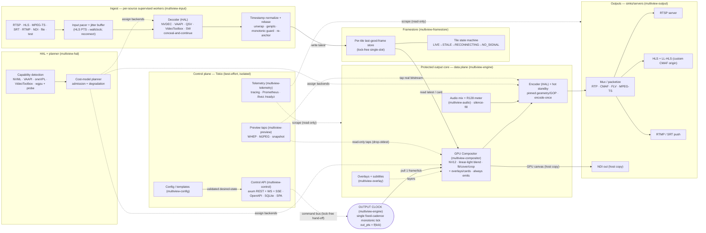
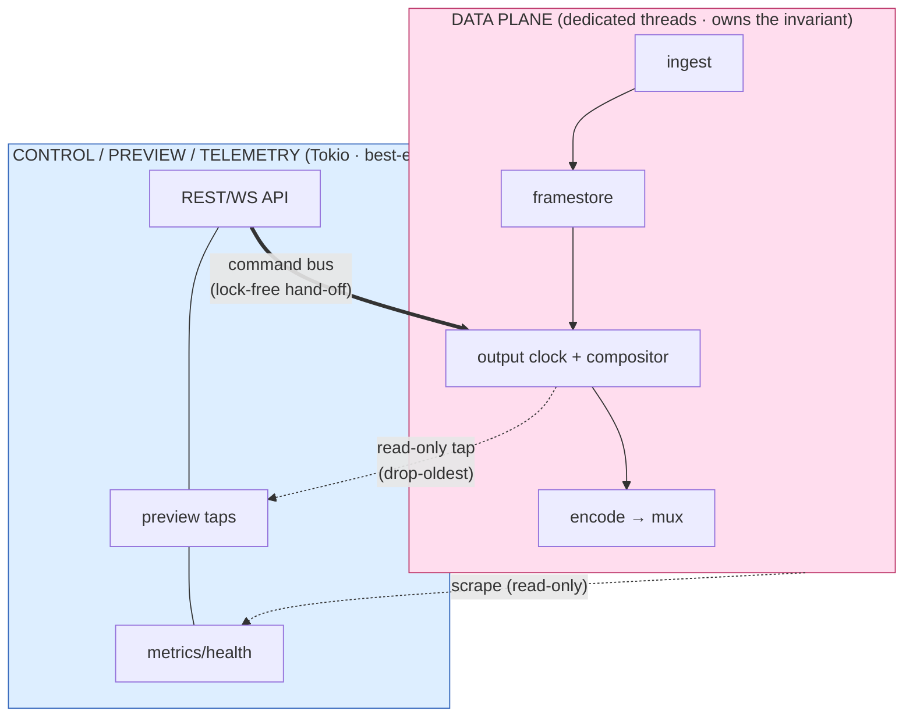

# Multiview — Architecture Overview

> The front door to the Multiview architecture. This page tells the end-to-end story, draws the
> master component diagram, splits the **data plane** from the **control plane**, summarizes the
> canonical **invariants**, maps the **crates**, and points you to the deep research briefs and ADRs.
>
> **Source of truth:** [`conventions.md`](conventions.md) pins canonical names, APIs, features,
> invariants, and licensing. Where any doc disagrees with conventions, conventions wins; the Rust
> code is the ultimate authority.

---

## 1. What Multiview is

**Multiview** is an efficient, hardware-accelerated, Rust live video multiview generator. It:

1. **Ingests** many live sources — RTSP, HLS/M3U, MPEG-TS, SRT, RTMP, NDI, file, and first-class
   in-process synthetic sources (colour `bars`, `solid` slates, full-frame `clock`s).
2. **Composites** them into a templated multiview (2×2, 3×3, 1-large+5-small, PiP, custom) **on the GPU**.
3. **Serves** the result robustly over RTSP, HLS/LL-HLS, NDI, and RTMP/SRT push.

It is a **hybrid engine**: FFmpeg/libav handles demux/decode/encode (where libav is strongest), while a
**custom Rust + GPU-native compositor** and a **custom serving/output stage** are the project's
differentiators. It targets **commodity hardware** (entry GPUs, Intel iGPUs, AMD APUs, base Apple
silicon, low-RAM boxes) and guarantees **bulletproof continuous output**. Platforms: **Linux**
(NVIDIA via the Container Toolkit; Intel/AMD via VAAPI) and **macOS** (Apple Silicon + Intel, native).
**No Windows.**

The decisive design conclusions (verification-hardened) are captured in the deep briefs; the
one-line versions:

- **Keep frames on the GPU within a single vendor island** — decode→composite→encode with no host
  round-trip. Cross-vendor zero-copy does not exist on desktop; every vendor/NDI/CPU boundary is an
  explicit, costed copy. ([ADR-0004](../decisions/ADR-0004.md))
- **Own the compositor** in Rust+GPU — FFmpeg has no CUDA stack filter and no per-cell fit/cover/crop.
  ([ADR-0005](../decisions/ADR-0005.md))
- **Encode the canvas once per rendition** and fan the same packets to many transports.
  ([ADR-0014](../decisions/ADR-0014.md), [ADR-E003](../decisions/ADR-E003.md), [ADR-E004](../decisions/ADR-E004.md))
- **One fixed-cadence output clock drives everything**; inputs are *sampled*, never *pacing*.
  ([ADR-T001](../decisions/ADR-T001.md), [ADR-R001](../decisions/ADR-R001.md))

---

## 2. Master component diagram

The system is two cooperating planes around a **protected output core**. The data plane (dedicated
threads) carries pixels; the control/preview/telemetry planes (Tokio async) are best-effort and
**physically incapable of back-pressuring the engine**.

Solid arrows are the **pixel/sample data path**; dotted arrows are **control, preview, and telemetry**
— all read-only or drop-oldest with respect to the engine.

---

## 3. End-to-end narrative

1. **Ingest.** Each source runs an isolated, supervised worker (`multiview-input`). The input pacer
   absorbs jitter and — for HLS/VOD-as-live — paces frames to wall-clock by PTS (a custom pacer; `-re`
   is for files, never live). Decode uses the **generic internal hwaccel path** with software fallback;
   a corrupt packet is concealed, never fatal. ([streaming-gotchas](../research/streaming-gotchas.md),
   [ADR-T004](../decisions/ADR-T004.md), [ADR-T007](../decisions/ADR-T007.md))
2. **Normalize & rebase.** Per-input PTS is unwrapped (33-bit TS / 32-bit RTP), genpts-filled,
   monotonic-guarded, and rebased onto one internal nanosecond timeline; discontinuities re-anchor
   smoothly. ([ADR-T003](../decisions/ADR-T003.md))
3. **Framestore.** The normalized frame is written into the tile's **lock-free last-good-frame store**
   (`multiview-framestore`). The decoder never blocks; the newest frame wins; stale updates are dropped.
   Each tile rides a **state machine** (LIVE → STALE → RECONNECTING → NO_SIGNAL).
   ([ADR-R001](../decisions/ADR-R001.md), [ADR-T002](../decisions/ADR-T002.md))
4. **Output clock.** A single fixed-cadence monotonic clock in `multiview-engine` ticks forever. At each
   tick it **pulls** the latest valid frame from every tile (or a placeholder card) — it **never waits
   for all inputs**. ([ADR-T001](../decisions/ADR-T001.md), [ADR-0013](../decisions/ADR-0013.md))
5. **Composite.** The GPU compositor (`multiview-compositor`) keeps frames in **NV12**, converts YUV→RGB
   in-shader at tile size, blends in **linear light** with premultiplied alpha, applies the resolved
   layout (fit/cover/crop/gaps/borders), and stamps on overlays/subtitles
   (`multiview-overlay`). The exact, never-reordered color pipeline is in [Invariant 8](#5-canonical-invariants).
   ([ADR-0005](../decisions/ADR-0005.md), [ADR-E002](../decisions/ADR-E002.md), [ADR-C003](../decisions/ADR-C003.md))
6. **Audio.** Each input's audio is rebased on the same clock, resampled to 48 kHz, silence-filled on
   dropout, routed to discrete tracks + a program bus, and EBU R128-metered (read-only, off the hot
   path). ([ADR-R005](../decisions/ADR-R005.md), [ADR-R006](../decisions/ADR-R006.md))
7. **Encode-once.** The canvas is encoded **once per rendition** (low-latency profile, pinned
   geometry/GOP), with a hot-standby encoder for seamless recovery.
   ([ADR-0014](../decisions/ADR-0014.md), [ADR-R004](../decisions/ADR-R004.md))
8. **Mux-many.** The *same* packets fan out to all transports (`multiview-output`): RTSP server, custom
   CMAF/LL-HLS origin, NDI out (one host copy), RTMP/SRT push. A different codec/resolution/bitrate is
   the *only* reason to encode again. ([ADR-E004](../decisions/ADR-E004.md), [ADR-0006](../decisions/ADR-0006.md),
   [ADR-0007](../decisions/ADR-0007.md), [ADR-T005](../decisions/ADR-T005.md))

Throughout, the **HAL** (`multiview-hal`) detects hardware, negotiates the cheapest viable per-stage
backend, prefers single-vendor zero-copy islands, and runs the **resource-adaptive degradation** loop
that sheds load tile-by-tile before the program output is ever touched.

---

## 4. Data plane vs. control plane

The split is structural and load-bearing — it is what makes "never falters" provable.

| Aspect | Data plane | Control / preview / telemetry plane |
|---|---|---|
| Runtime | Dedicated OS threads (optionally pinned + RT priority) | Tokio async |
| Carries | Ref-counted GPU/host frame handles, never pixels-by-value | JSON, events, snapshots, sampled meters |
| Crates | `engine`, `compositor`, `framestore`, `ffmpeg`, `input`, `output`, `audio`, `overlay` | `control`, `preview`, `telemetry`, `config`, `events` |
| Clock | The single fixed-cadence output clock | Wall-clock / request-driven |
| Failure stance | Must emit forever; bounded queues **drop**, never grow | Best-effort; may drop/lag freely |
| Coupling to engine | Owns the invariants | **Cannot** back-pressure the engine (watch/broadcast + drop-oldest; the engine never awaits a client) |

Long synchronous codec/CUDA/VideoToolbox calls **must never** run on Tokio workers. Conversely, the
control plane reaches the engine only through a **lock-free desired-state hand-off / command bus**
([ADR-W008](../decisions/ADR-W008.md)); preview uses **read-only taps** with drop-oldest queues
([ADR-P001](../decisions/ADR-P001.md)); telemetry only scrapes. A CI **chaos gate** enforces the
isolation. ([resilience-av](../research/resilience-and-av.md), [ADR-RT004](../decisions/ADR-RT004.md))

---

## 5. Canonical invariants

These are summarized from [`conventions.md` §5](conventions.md#5-canonical-technical-invariants) — the
canonical text lives there. Every implementation and doc must respect them.

| # | Invariant | One-line summary | Deep links |
|---|---|---|---|
| 1 | **Output clock** | Every tick emits exactly one valid, correctly-timestamped frame (+ audio) forever; inputs are sampled, never pacing; `out_pts = f(tick)`. | [streaming](../research/streaming-gotchas.md) · [ADR-T001](../decisions/ADR-T001.md) · [ADR-R001](../decisions/ADR-R001.md) |
| 2 | **Last-good-frame + state machine** | Inputs write lock-free single-slot stores; the compositor reads latest (or a card) and never blocks; tiles ride LIVE→STALE→RECONNECTING→NO_SIGNAL. | [resilience](../research/resilience-and-av.md) · [ADR-T002](../decisions/ADR-T002.md) |
| 3 | **Unified timing** | Normalize per-input PTS (unwrap, genpts, monotonic guard) onto one ns timeline; re-stamp all output PTS/DTS from the tick. NTSC 1001 rates as exact rationals — never float fps. | [streaming](../research/streaming-gotchas.md) · [ADR-T003](../decisions/ADR-T003.md) |
| 4 | **HLS ingest pacing** | Live/VOD-as-live paced to wall-clock by PTS via a custom pacer; `-re` is for files. | [ADR-T004](../decisions/ADR-T004.md) |
| 5 | **NV12-throughout** | Frames stay NV12 (1.5 B/px); never materialize RGBA per tile; YUV→RGB in-shader at tile size. | [efficiency](../research/efficiency.md) · [ADR-E002](../decisions/ADR-E002.md) |
| 6 | **Decode-at-display-resolution** | Decode near displayed size where the backend supports it; prefer a smaller source rendition; budget decode in MP/s. | [efficiency](../research/efficiency.md) · [ADR-E001](../decisions/ADR-E001.md) |
| 7 | **Encode-once-mux-many** | Composite once, encode the canvas once per rendition, fan the *same* packets everywhere. | [ADR-0014](../decisions/ADR-0014.md) · [ADR-E003](../decisions/ADR-E003.md) · [ADR-E004](../decisions/ADR-E004.md) |
| 8 | **Color pipeline order** | detect 4 axes → range-expand → YUV→RGB → linearize → primaries → scale+premult-blend in linear → OETF → RGB→YUV + range-compress → tag output → verify. **Never reorder.** | [color-management](../research/color-management.md) · [ADR-C001..C006](../decisions/) |
| 9 | **Resource-adaptive degradation** | Closed loop (sense→estimate→plan→apply, hysteresis) sheds load tile-by-tile cheapest-impact-first **before** touching program output; bounded queues drop, never grow. | [efficiency](../research/efficiency.md) · [ADR-E007](../decisions/ADR-E007.md) |
| 10 | **Isolation** | Control/preview/realtime are best-effort and cannot back-pressure the engine; CI chaos gate enforces it. | [resilience](../research/resilience-and-av.md) · [ADR-RT004](../decisions/ADR-RT004.md) · [ADR-P001](../decisions/ADR-P001.md) |
| 11 | **Live-apply classification** | Every change is Class-1 (hot/seamless at a frame boundary) or Class-2 (controlled reset via make-before-break parallel-output migration); the API surfaces which before applying. | [management-capability-matrix](../research/management-capability-matrix.md) · [ADR-R004](../decisions/ADR-R004.md) · [ADR-M005](../decisions/ADR-M005.md) |

---

## 6. Crate map

The canonical crate list lives in [`conventions.md` §3](conventions.md#3-canonical-crate-map). All
crates are `multiview-*` under `crates/`; hardware/FFI/GPU code is behind **off-by-default features** so
the default `cargo check` builds the pure-Rust, LGPL-clean, no-native-deps layer. Dependency direction:
`core` ← everything; leaf crates depend on `core` (+ `hal`/`ffmpeg`/`events`); `engine` depends on the
media crates; `control`/`preview` depend on `engine` + `events`; `cli` depends on all. No cycles.

| Plane | Crate | Role |
|---|---|---|
| Foundation | `multiview-core` | Shared types/traits: `Frame`, `PixelFormat`, `ColorInfo`, `MediaTime`, layout model, stage traits, errors. No FFI. |
| Foundation | `multiview-hal` | Capability detection, backend registry, per-stage negotiation + cost-model planner. |
| Foundation | `multiview-ffmpeg` | Safe RAII wrappers over libav* (demux/decode/encode, hwframe lifecycle). |
| Foundation | `multiview-events` | Shared realtime event types + versioned envelope. |
| Data plane | `multiview-compositor` | Custom GPU compositor (wgpu baseline; CUDA/Metal/VAAPI fast paths). |
| Data plane | `multiview-framestore` | Per-tile last-good-frame stores + tile state machine. |
| Data plane | `multiview-input` | Ingest sources, input pacer, jitter buffers, timestamp normalization, reconnect. |
| Data plane | `multiview-output` | RTSP server, HLS/LL-HLS, NDI out, RTMP/SRT push; encode-once-mux-many fan-out. |
| Data plane | `multiview-audio` | Per-input audio decode/resample/mix/route + EBU R128 metering. |
| Data plane | `multiview-overlay` | Overlay layers, text, subtitle ingest/render (libass), passthrough. |
| Data plane | `multiview-engine` | The protected output core: output clock, compositor drive, supervisor/actors, hot-reconfig, admission/degradation loop. |
| Control plane | `multiview-config` | Config & template schema (serde), validation, config-as-code. |
| Control plane | `multiview-control` | axum REST + WS + SSE API: OpenAPI, auth, SQLite, command-bus shell, embedded SPA. |
| Control plane | `multiview-preview` | Preview taps + encoder pool; WHEP/MJPEG/snapshot; isolated from program path. |
| Control plane | `multiview-telemetry` | tracing + Prometheus + health (`/livez`, `/readyz`). |
| Binary / dev | `multiview-cli` | Binary `multiview`: wires engine + control plane; aggregates feature presets. |
| Binary / dev | `xtask` | Dev automation (build web, gen OpenAPI/AsyncAPI, lint). |

**Feature presets** (in `multiview-cli`): `nvidia` = cuda+ffmpeg+wgpu · `apple` = videotoolbox+metal+ffmpeg ·
`linux-vaapi` = vaapi+qsv+ffmpeg+wgpu · `full` = everything non-GPL. The default build is LGPL-clean;
`gpl-codecs` (x264/x265) and `ndi` are strictly opt-in. See [`conventions.md` §4](conventions.md#4-feature-flag-taxonomy-canonical)
and [§7](conventions.md#7-licensing-model-build-profiles).

---

## 7. Where to read more

### Deep research briefs ([`../research`](../research/))

| Brief | Covers |
|---|---|
| [core-engine](../research/core-engine.md) | Hybrid engine, HAL & per-stage negotiation, zero-copy islands, compositor/decode/encode subsystems, inputs/outputs, timing, threading, templates, build/deploy, roadmap. |
| [efficiency](../research/efficiency.md) | Bandwidth-first philosophy, decode-at-display-res, NV12 policy, pooling, per-tier density budgets, adaptive degradation loop, perf-regression CI. |
| [resilience-and-av](../research/resilience-and-av.md) | Bulletproof-output invariant, supervision & fault isolation, hot reconfiguration (Class-1/2), audio routing & metering, subtitles, overlays, web/API surface, resilience testing. |
| [streaming-gotchas](../research/streaming-gotchas.md) | Unified timing model, fps mismatch, PTS/wrap/discontinuity, HLS ingest/output pacing, long-run drift, codec edge cases, A/V sync & jitter buffers. |
| [color-management](../research/color-management.md) | The four color axes, untagged-input policy, linear-light blend, range handling, HDR→SDR, output tagging + verify. |
| [management-capability-matrix](../research/management-capability-matrix.md) | Per-output capability matrix gating the UI/validator; live-apply vs needs-reset semantics. |
| [realtime-api](../research/realtime-api.md) · [web-api-stack](../research/web-api-stack.md) · [preview-subsystem](../research/preview-subsystem.md) | WebSocket/SSE/REST realtime, axum/OpenAPI/SPA stack, isolated preview taps. |

### Decisions ([`../decisions`](../decisions/)) — see the [ADR index](../decisions/README.md) (89 ADRs)

- **Core engine:** [ADR-0001..0014](../decisions/README.md#core-engine) — hybrid engine, HAL, zero-copy islands, custom compositor, RTSP/LL-HLS serving, NDI, concurrency, config, deadline compositor, encode-once.
- **Resilience & A/V:** [ADR-R001..R009](../decisions/README.md#resilience--av) — continuous-output guarantee, fault isolation, supervision, pinned sessions, audio routing, metering, subtitles, overlays, testing.
- **Efficiency:** [ADR-E001..E009](../decisions/README.md#efficiency) — decode-at-display-res, NV12, encode-once, mux-many, frame pool, dirty-region, degradation, cost-model planner, per-tier budgets.
- **Color:** [ADR-C001..C006](../decisions/README.md#color) — canvas defaults, untagged policy, linear-light blend, range, HDR→SDR, output tagging.
- **Streaming/timing:** [ADR-T001..T008](../decisions/README.md#streamingtiming) — output clock, per-tile resampling, normalization, HLS in/out pacing, drift, codec policy, A/V sync.
- **Preview / Realtime / Management / Web:** [ADR-P*](../decisions/README.md#preview) · [ADR-RT*](../decisions/README.md#realtime-api) · [ADR-M*](../decisions/README.md#management) · [ADR-W*](../decisions/README.md#webapi-stack).

---

*This overview is intentionally a map, not the territory. For any load-bearing detail, follow the link
to the brief or ADR — and remember [`conventions.md`](conventions.md) is the source of truth.*
