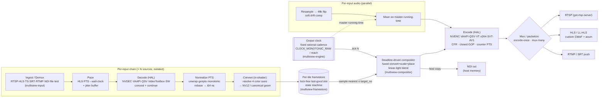

# Multiview — Data-Plane Pipeline

The **data plane** is the media hot path: from raw bytes on the wire to encoded packets
fanned out to every transport. It runs on **dedicated OS threads** (never Tokio workers —
codec/GPU calls are long synchronous calls), while the control/IO plane stays on Tokio. See
[`conventions.md`](./conventions.md) for the canonical crate map, feature flags, and invariants
this document refines.

> **The one principle that governs everything:** *the output is driven by a single internal
> monotonic clock; inputs are **sampled** into the output, they never **pace** it.* This is the
> **output-clock invariant** ([conventions §5.1](./conventions.md)) and it makes the output
> bulletproof — a stalled, bursting, or wrong-fps input cannot stall, speed up, or skew the
> multiview. Everything below exists to honour it.

---

## 1. Pipeline at a glance

Two halves meet at the **per-tile framestore**:

1. **Per-input ingest chain** (one isolated supervisor per source): `ingest → pace → decode →
   normalize → convert → framestore`. Bounded, drop-oldest, conceal-and-continue, never blocks
   the compositor.
2. **The protected output core** (one thread, wall-clocked): `output clock → deadline-driven
   compositor → encode → mux/serve`. Emits exactly one valid frame per tick, forever.

| Stage | Owning crate | Off the hot path? | Key invariant |
|-------|--------------|-------------------|---------------|
| Ingest / demux | `multiview-input` | per-source task | `AVIOInterruptCB` + outer DNS watchdog |
| Pace (HLS / jitter) | `multiview-input` | per-source task | custom PTS→wall-clock pacer, **not** `-re` |
| Decode | `multiview-ffmpeg` + `multiview-hal` | per-source thread | generic hwaccel + per-input SW fallback; conceal, never abort |
| Normalize (timestamps) | `multiview-input` | per-source | unwrap → rebase → monotonic guard, all in i64 ns |
| Convert (color/format) | `multiview-compositor` (in-shader) | fused into composite | NV12-throughout; resolve 4 color axes, never `UNSPECIFIED` |
| Framestore | `multiview-framestore` | lock-free slot | last-good-frame + LIVE→STALE→RECONNECTING→NO_SIGNAL |
| Output clock | `multiview-engine` | **the** core thread | `out_pts = f(tick)`, exact rationals, never float fps |
| Compositor | `multiview-compositor` | core thread | deadline-driven; **never** wait-for-all-inputs |
| Encode | `multiview-output` + `multiview-hal` | encode thread(s) | composite once, encode **once per rendition** |
| Mux / serve | `multiview-output` | Tokio egress | encode-once-**mux-many**; wall-clock-paced HLS |

### End-to-end flow



Deep dives: per-input mechanics in [`../research/streaming-gotchas.md`](../research/streaming-gotchas.md);
overall engine in [`../research/core-engine.md`](../research/core-engine.md); color in
[`../research/color-management.md`](../research/color-management.md). Timing, color, and resilience
get their own sibling architecture docs: [`timing-and-sync.md`](./timing-and-sync.md),
[`color.md`](./color.md), [`resilience.md`](./resilience.md).

---

## 2. The per-input ingest chain

Each source runs its **own task/thread with bounded drop-oldest (leaky-downstream) queues**, so
`av_read_frame` on one source never blocks the composite loop, and one dead source never freezes
the multiview. Channels carry **ref-counted pooled frame handles, never pixels**.

### 2.1 Ingest / demux

- **Primary backend:** `rsmpeg` over libavformat — one `AVFormatContext` code path for RTSP,
  HLS/M3U, MPEG-TS, and SRT. Optional pure-Rust RTSP via `retina` behind the same `Source` trait
  (TCP only). NDI in via `grafton-ndi` / dynamic-load (`NDIlib_v6_load()`), feature-gated.
- **RTSP:** force `rtsp_transport=tcp`/`prefer_tcp`; set `timeout` **and** an `AVIOInterruptCB`
  (mandatory). The interrupt callback and `timeout` do **not** bound synchronous DNS
  (`getaddrinfo`) — add an **outer per-tile watchdog** (async/pre-resolved DNS or a recyclable
  worker thread).
- **HLS:** `reconnect=1`, `reconnect_at_eof=1`, `reconnect_streamed=1`, `http_persistent=1`,
  start at the live edge minus hold-back (`live_start_index=-3` / honour `EXT-X-START`).
- **MPEG-TS / SRT:** `scan_all_pmts`; SRT `latency` is in **microseconds**; verify
  `ffmpeg -protocols` lists `srt`.
- **Supervision:** circuit breakers + bounded backoff reconnect; the tile rides the framestore
  state machine while down (see [`resilience.md`](./resilience.md),
  [ADR-R003](../decisions/ADR-R003.md)).

### 2.2 Pace

Live ingest must be paced to **wall clock**, not read as fast as the network allows.

- **HLS ingest bursting** is the canonical trap: on connect/reconnect, several published segments
  sit on the origin and a naive reader pulls them back-to-back → the tile time-warps and RAM
  blows up. Fix is a **custom PTS-to-wall-clock pacer** between demux and decode:

  ```
  on first frame: anchor_wall = now(); pts0 = frame.pts
  release frame when now() >= anchor_wall + (pts − pts0)
  bounded ring (~0.5–3 s pre-roll); connect-burst overflow is absorbed/dropped
  re-anchor (pts0, anchor_wall) on EXT-X-DISCONTINUITY or |pts − last| > threshold
  bounded catch-up at ≤ ~1.25× when behind edge; never instant-seek small drift
  ```

- **`-re` is for files, not live ingest** — it is `-readrate 1` and FFmpeg warns against it on
  live input; after a stall its budget refills via an *unthrottled burst*. `readrate_catchup`
  (FFmpeg 8.0+) is **CLI-only**, unavailable to a libav-linked Rust pipeline. **Build the pacer.**
- **RTP/SRT jitter buffer** per input: reorder by seqnum, de-dup, drop too-late, bounded memory.
  Size ≈ `3–4·J + margin` (RFC 3550 interarrival jitter); LAN 30–100 ms — the RTP default 200 ms
  is far too high. SRT's own latency window *is* a jitter buffer; budget across transport + app,
  don't double-buffer.

See [ADR-T004](../decisions/ADR-T004.md) (HLS ingest pacing) and
[ADR-T008](../decisions/ADR-T008.md) (jitter-buffer model).

### 2.3 Decode

- **Generic internal hwaccel path** (software-named decoder + `hw_device_ctx` + `get_format`),
  **not** `*_cuvid`/`*_qsv` wrapper decoders — only the generic path supports automatic software
  fallback and uniform negotiation. Decode each source **near its display resolution** where the
  backend supports it (NVDEC `-resize` fused), budgeting decode in megapixels/sec
  ([conventions §5.6](./conventions.md), [ADR-E001](../decisions/ADR-E001.md)).
- `get_format` is `unsafe extern "C"`, runs on the decode thread, returns `AV_PIX_FMT_NONE` on
  failure (returning a software format silently disables HW), and is a **re-negotiation hook**:
  geometry/`sw_format` may change mid-stream, so it (re)builds `AVHWFramesContext` per call and the
  compositor re-imports textures on change.
- **Conceal-and-continue, never abort the multiview** (from
  [`streaming-gotchas.md` §6](../research/streaming-gotchas.md)): set `err_recognition` **without**
  `AV_EF_EXPLODE`; gate compositing on **both** `AV_FRAME_FLAG_CORRUPT` clear **and**
  `decode_error_flags == 0`, plus format sanity. Wait-for-IDR is the default (do not set
  `AV_CODEC_FLAG2_SHOW_ALL`). Schedule by `best_effort_timestamp` (display order), never DTS.
- **No-EXPLODE ≠ never-fails:** keep a per-input error counter + no-output watchdog → drain
  (send NULL) → `avcodec_flush_buffers()` → request IDR / reconnect → hold last-good.
- **Per-input software fallback:** on HW init/decode failure recreate *that one input's* decoder
  in software, holding last-good during re-init. See [ADR-T007](../decisions/ADR-T007.md).

### 2.4 Normalize (timestamps)

Per input, on every decoded frame, produce a clean monotonic `i64` nanosecond `media_time`. The
**only timestamps the encoder/muxer ever see are clean and counter-derived** —
[conventions §5.3](./conventions.md):

```
raw       = frame.best_effort_timestamp
if raw == NOPTS: raw = synthesize_from_cadence()              # genpts-equiv fallback
unwrapped = raw + accumulated_wrap_i                          # delta-based, NOT value-based
if (unwrapped − last_unwrapped_i) < −(1 << (wrap_bits−1)):    # 33-bit TS / 32-bit RTP
        accumulated_wrap_i += (1 << wrap_bits)
ns = av_rescale_q(unwrapped, in_tb, NS_TB)                    # NS_TB = 1/1_000_000_000
if |ns − expected_ns_i| > DISCONTINUITY_NS  OR  saw_EXT_X_DISCONTINUITY:
        offset_i += continuous_time_i − ns                   # re-anchor (smooth continuation)
on first valid frame: anchor_i = master_now(); offset_i = anchor_i − ns
media_time = ns + offset_i
if media_time <= last_media_time_i: media_time = last_media_time_i + 1   # monotonic guard
```

- **Unwrap delta-based**, never value-based — do **not** trust libavformat's
  `pts_wrap_reference`/`correct_ts_overflow` (a bogus SDP `rtptime` made FFmpeg schedule a *false*
  rollover at ~13h and corrupt output). Handle MPEG-TS 33-bit wrap (~26.5 h), RTP 32-bit (~13.25 h).
- **Discontinuity → re-anchor, don't pass through** (`EXT-X-DISCONTINUITY`, TS
  `discontinuity_indicator`, or `|jump| > ~10 s`); after a discontinuity PTS may be *descending*.
- **NTSC `1001` rates carried as exact rationals/ns — never float fps** (float drifts ~3.6 s/hour).
- No single FFmpeg flag does this; **own the timeline** and test past the wrap boundary. See
  [ADR-T003](../decisions/ADR-T003.md).

### 2.5 Convert (color + format)

Because the **custom GPU compositor deliberately bypasses swscale**, libav does **no** implicit
color conversion — Multiview owns color end-to-end. Conversion is **fused into the composite kernel**
(no separate RGBA materialization), but the *detection* logic lives at the ingest seam:

- **Resolve all four color axes** per tile, per frame, to a **never-`UNSPECIFIED`** 4-tuple
  `(primaries, trc, matrix, range)` + chroma siting + bit depth, stored beside the GPU frame
  handle. Precedence is `frame.color_* > AVCodecContext.color_* > container colr > policy`.
- **Untagged-default policy matches players, not swscale** (swscale wrongly defaults unspecified
  matrix to BT.601 regardless of resolution): YUV ⇒ limited range, RGB ⇒ full; matrix/primaries by
  resolution heuristic (`≥1280 || >576` ⇒ BT.709; `576` ⇒ BT.601-625; `480/486` ⇒ BT.601-525).
  **Never auto-promote SDR → BT.2020/PQ/HLG by resolution.** Per-source override available in config.
- **HW-decode guard:** copy `AVCodecContext.color_*` → frame for any unspecified field; on macOS
  take **range from the bitstream/container VUI, not the VT surface** (VT decode mis-applies the
  full-range flag).
- **NV12-throughout** ([conventions §5.5](./conventions.md), [ADR-E002](../decisions/ADR-E002.md)):
  frames stay NV12 (1.5 B/px); the YUV→RGB matrix, range expansion, and linearization happen
  **in-shader at tile size**, exactly once on input.

The full conversion math (range numerics, matrices, EOTFs, primaries, tone-mapping) is in
[`color.md`](./color.md) and [`../research/color-management.md`](../research/color-management.md)
([ADR-C001](../decisions/ADR-C001.md)–[ADR-C006](../decisions/ADR-C006.md)).

### 2.6 Framestore (the seam)

The handoff from per-input chains to the output core. Per-tile **last-good-frame** stores
(`multiview-framestore`, [conventions §5.2](./conventions.md), [ADR-R001](../decisions/ADR-R001.md)):

- **Lock-free single-slot triple-buffer** (overwrite policy → bounded memory, **newest wins**).
  Inputs write; the compositor always reads the latest (or a placeholder card) and **never blocks**.
- **Tile state machine:** `LIVE → STALE → RECONNECTING → NO_SIGNAL`, driven by frame freshness +
  the ingest supervisor. After a configurable stale timeout the tile renders last-good-with-overlay,
  then a "no signal" placeholder.
- This is mathematically equivalent to per-tile nearest/previous-PTS resampling with
  duplicate-on-stall and drop-on-overrun, at zero interpolation cost
  ([ADR-T002](../decisions/ADR-T002.md)). Timing buffers are **orthogonal to memory placement** —
  zero-copy GPU compositing still needs these per-tile caches.

---

## 3. The protected output core

One thread, gated by the **wall clock**, that drives compositor → encode → mux. Per the
output-clock invariant it emits exactly one valid frame every tick, **independent of any input**.

### 3.1 Output clock

```
start = master_now()                                  # monotonic Instant
for N in 0.. :
    target_ns = N * 1_000_000_000 * fps_den / fps_num # exact rational, 1001-safe
    deadline  = start + target_ns
    sleep_until(deadline − SPIN_MARGIN); busy_spin_until(deadline)   # accurate cadence
    composite_at(target_ns)                           # §3.2
    encode_and_mux(out_pts = N)                        # §3.3–3.4, CFR, counter-derived
```

- **Master clock** = `CLOCK_MONOTONIC_RAW` (Linux) / `mach_continuous_time` (macOS), **never** an
  input clock or audio hardware clock. Fixed **rational** cadence (e.g. `60000/1001`).
- Accurate cadence via `sleep_until` + busy-spin tail (read the clock with `quanta`, hit the
  deadline with `spin_sleep`). `out_pts = f(tick)` — input PTS are **never** propagated to the muxer.
- See [`timing-and-sync.md`](./timing-and-sync.md), [ADR-T001](../decisions/ADR-T001.md).

### 3.2 Deadline-driven compositor

**Never wait-for-all-inputs** (mirrors `GstAggregator` `get_next_time()` + timeout; note the
framework default is wait-for-all, so the deadline path must be deliberately engineered as the
primary mode). At each deadline:

```
for each tile i:
    f = framestore[i].nearest_at_or_before(target_ns)
    if f is None: f = framestore[i].last_good()       # HOLD on starvation
    composite(f)                                      # GPU, one fused launch
```

- One launch reads N sources and writes the whole canvas — **fused convert + scale + place**
  ([ADR-E003](../decisions/ADR-E003.md), [ADR-0005](../decisions/ADR-0005.md)). Three backends
  behind a backend-tagged handle: **CudaCompositor**, **MetalCompositor**, **VulkanCompositor**
  (ash/libplacebo) with **wgpu/WGSL** as the portable default.
- **Resampling, scaling, and alpha-blend in LINEAR light with premultiplied alpha**
  ([ADR-C003](../decisions/ADR-C003.md)) into an `Rgba16Float` canvas; selectable kernels
  (bilinear for small/PiP tiles, Lanczos/Jinc for primaries). The custom compositor owns all
  fit/cover/crop/gaps/borders — FFmpeg's xstack has none of these.
- **HDR tile into SDR canvas → tone-map down per-tile** (BT.2390 EETF anchored at 203-nit reference
  white), never a linear scale to peak ([ADR-C005](../decisions/ADR-C005.md)).
- Layout is a flattened, atomically-swappable `Vec<DrawQuad>` — runtime relayout/source-swap diffs
  resolved quads and publishes the new list with no black flash ([ADR-R004](../decisions/ADR-R004.md)).
- Stays **on-GPU within one vendor island** (NVDEC→CUDA→NVENC; VT→Metal→VT; VAAPI/QSV→Vulkan via
  dma-buf); any cross-vendor / NDI / CPU boundary inserts exactly **one explicit, costed copy**
  ([ADR-0004](../decisions/ADR-0004.md)).

### 3.3 Encode

- **Composite once, encode the canvas once per rendition** ([conventions §5.7](./conventions.md),
  [ADR-E003](../decisions/ADR-E003.md), [ADR-0014](../decisions/ADR-0014.md)) — separate encode
  only when codec/resolution/bitrate differ.
- **One canonical low-latency profile** across backends: CBR, B-frames = 0 (IPPP), lookahead = 0,
  single-pass, small VBV, periodic forced-IDR/intra-refresh, zero reorder delay (NVENC
  `tune=ull -rc cbr -bf 0`; x264 `-tune zerolatency`; VideoToolbox `EnableLowLatencyRateControl`
  + `RealTime`). Optional opt-in quality/VOD profile re-enables B-frames + lookahead.
- **CFR + closed, fixed GOP for the whole session**, forced keyframes (`-force_key_frames
  expr:gte(t,n_forced*SEG)`), counter-derived PTS; the encoder assigns DTS. x265 defaults to
  **open GOP — must pass `open-gop=0`**. NVENC cannot reconfigure GOP mid-session → canvas params
  are pinned ([ADR-R004](../decisions/ADR-R004.md)).
- **Density is bounded by physical NVENC chips, not the session-count headline** (most GeForce = 1
  NVENC; per-system cap 12 since Nov 2025, unlimited on datacenter) — detect at runtime, schedule
  encode jobs against active NVENC count, CPU-fallback overflow ([ADR-0014](../decisions/ADR-0014.md)).
- H.264 is the mandatory interop baseline; HEVC/AV1 are runtime-feature-detected upgrades.
- **Tag all four color axes explicitly** on the encoder (encoders write nothing by default →
  CICP 2 → players re-guess). For full-range NV12, NVENC needs `AVCOL_RANGE_JPEG` reaching the
  encoder; VideoToolbox defaults to limited ([ADR-C006](../decisions/ADR-C006.md)).

### 3.4 Mux / serve

**Encode-once-mux-many fan-out** ([conventions §5.7](./conventions.md),
[ADR-E004](../decisions/ADR-E004.md)): fan the *same* encoded packets to all transports.

| Sink | Mechanism | Notes |
|------|-----------|-------|
| **RTSP** | in-process `gst-rtsp-server` (`appsrc → h264parse → rtph264pay name=pay0`, no re-encode); MediaMTX optional sidecar | `is-live=true`, `config-interval=-1`, `factory.set_shared(true)` so one encode fans out ([ADR-0006](../decisions/ADR-0006.md)) |
| **HLS / LL-HLS** | **custom CMAF** (libav movenc fragmented MP4) → derive HLS/LL-HLS/DASH from one in-memory part store; `hls-playlist` crate for tags; custom axum/hyper blocking-reload origin | FFmpeg's `hls` muxer **cannot** emit Apple LL-HLS; `-lhls` ≠ Apple LL-HLS ([ADR-0007](../decisions/ADR-0007.md), [ADR-T005](../decisions/ADR-T005.md)) |
| **RTMP / SRT push** | native `rml_rtmp` / `srt-tokio`, libav `rtmp://`/`srt://` as reliable fallback | interop validated per destination |
| **NDI out** | single Sender; **host-memory copy** from GPU canvas | NDI YUV = **limited** range; attribution mandatory ([ADR-0008](../decisions/ADR-0008.md)) |

- **Wall-clock-paced publication** ([ADR-T005](../decisions/ADR-T005.md)): the master output clock
  already guarantees ≤ one segment per `hls_time` of real time. **Never catch up by flushing
  buffered frames — drop to live instead.** GOP-aligned, closed, fixed GOP; anchor
  `EXT-X-PROGRAM-DATE-TIME` to a real monotonic→UTC clock.
- **CMAF/fMP4 preferred over MPEG-TS**; emit `EXT-X-DISCONTINUITY` only on genuine timeline breaks.
- **Stream-copy DTS safety:** any copy path clamps `dts = max(dts, last+1)`, `pts = max(pts, dts)`
  before `av_interleaved_write_frame` (it **aborts** on the first non-monotonic DTS); set
  `avoid_negative_ts=make_zero`. On the encoded path, let libavcodec assign DTS.
- **Verify color after every encode AND every remux** with the `ffprobe` gate — fail the stream if
  any field is `unknown` or differs from policy ([ADR-C006](../decisions/ADR-C006.md)).

---

## 4. Audio path (parallel)

Audio rides the **same PTS rebasing** as its source's video, then mixes on master running-time
([conventions §5.3](./conventions.md), [ADR-R005](../decisions/ADR-R005.md)):

- Decode → **resample to 48 kHz fltp before mixing** (`amix`/mixers require identical rates) →
  program bus + discrete tracks.
- **Continuous soft drift compensation** by measured ppm (libswresample `async > 1` /
  `swr_set_compensation`, soxr `SOXR_VR`, or `rubato`) — **never** audibly drop/dup blocks; hard
  compensation is a discontinuity-only safety net. `async=1` alone does only hard fill/trim and is
  **not** a multi-hour drift fix.
- Keep A/V skew within the **EBU R37 window (+40 / −60 ms)** — bias audio slightly behind (never
  ahead of video).
- **Audio-only / video-only sources are first-class:** synthesize the missing modality (silence /
  black / last-frame) *upstream of the mixer* so the mixer/compositor always see a gap-free stream.
- **EBU R128** metering is in-process, read-only, non-blocking ([ADR-R006](../decisions/ADR-R006.md)).

---

## 5. Isolation & backpressure

The data plane is structurally protected ([conventions §5.10](./conventions.md),
[ADR-R001](../decisions/ADR-R001.md)/[ADR-R002](../decisions/ADR-R002.md)):

- **Bounded queues drop, never grow** ([ADR-E005](../decisions/ADR-E005.md)); per-source
  drop-oldest queues prevent head-of-line blocking. Frame buffers come from per-device pools
  allocated at start, returned via `Drop`.
- **One decode actor per source**; the engine **never awaits a client.** Control, preview, and
  realtime layers are watch/broadcast + drop-oldest and **physically incapable of back-pressuring
  the engine** — a CI chaos gate enforces this ([ADR-R009](../decisions/ADR-R009.md),
  [ADR-P001](../decisions/ADR-P001.md)).
- **Resource-adaptive degradation** (sense→estimate→plan→apply with hysteresis) sheds load
  tile-by-tile, cheapest-impact-first, **before** the program output is ever touched
  ([conventions §5.9](./conventions.md), [ADR-E007](../decisions/ADR-E007.md)).
- **Hot-reconfiguration** is classified Class-1 (seamless at a frame boundary) vs Class-2
  (make-before-break parallel-output migration); the API surfaces which before applying
  ([conventions §5.11](./conventions.md), [ADR-M005](../decisions/ADR-M005.md)).

---

## 6. Related documents

- **Timing & sync:** [`timing-and-sync.md`](./timing-and-sync.md) ·
  ADRs [T001](../decisions/ADR-T001.md)–[T008](../decisions/ADR-T008.md)
- **Color:** [`color.md`](./color.md) ·
  ADRs [C001](../decisions/ADR-C001.md)–[C006](../decisions/ADR-C006.md)
- **Resilience & A/V:** [`resilience.md`](./resilience.md) ·
  ADRs [R001](../decisions/ADR-R001.md)–[R009](../decisions/ADR-R009.md)
- **Efficiency:** ADRs [E001](../decisions/ADR-E001.md)–[E009](../decisions/ADR-E009.md)
- **Deep briefs:** [core-engine](../research/core-engine.md) ·
  [streaming-gotchas](../research/streaming-gotchas.md) ·
  [color-management](../research/color-management.md) ·
  [resilience-and-av](../research/resilience-and-av.md)
- **Canonical conventions:** [`conventions.md`](./conventions.md)
