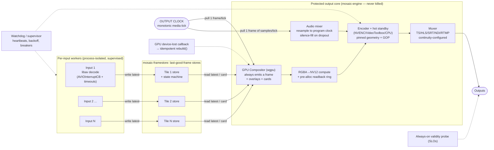
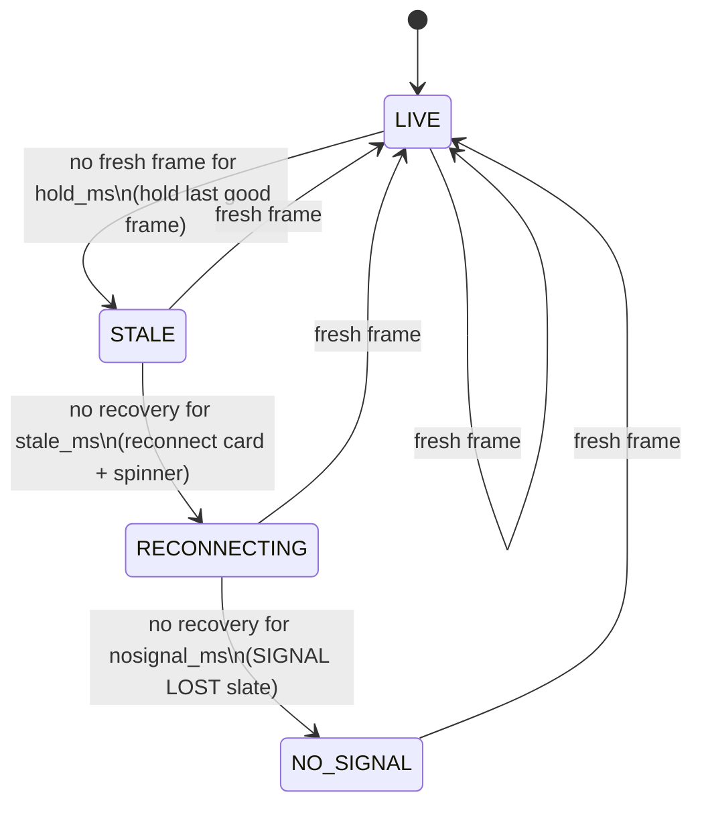

# Mosaic — Bulletproof Output & Resilience

> **Status:** Architecture overview. Authoritative depth lives in the deep brief
> [`../research/resilience-and-av.md`](../research/resilience-and-av.md); the load-bearing
> decisions are recorded in [ADR-R001](../decisions/ADR-R001.md)–[ADR-R004](../decisions/ADR-R004.md)
> and [ADR-R009](../decisions/ADR-R009.md). Where this page and a brief differ, the
> [canonical conventions](./conventions.md) win.

Mosaic exists to do one thing without compromise: **once an output session starts, it never
falters.** Inputs may die, change resolution mid-stream, hang in a C library, or vanish entirely;
the GPU may be reset out from under us; an encoder may leak itself to death. None of that is allowed
to reach the wire. This document describes the mechanisms that make that guarantee provable rather
than aspirational.

---

## 1. The invariant

> **At every tick of a single fixed-cadence internal monotonic clock, the output stage emits exactly
> one valid, correctly-timestamped frame (and the matching number of audio samples per track),
> forever, regardless of the state of any input, the compositor, or the GPU.**

This is a **liveness + validity** invariant (canonical invariant #1), not a best-effort target. It
decomposes into measurable sub-invariants that the [validity probe](#7-proving-it-slos--testing)
asserts continuously:

| Sub-invariant | Meaning |
|---|---|
| **Continuity** | Output PTS/DTS are a pure monotonic function of the tick counter — `PTS = f(tick)`. No gaps, no backward jumps. |
| **Validity** | The muxed stream is perpetually decodable: TS continuity counters/PCR continuous, HLS segments continuous, no spurious discontinuity markers. |
| **Independence** | Output cadence is *never* derived from any input clock. A pipeline gated on input frame arrival **will** stall on input loss — never `-copyts`, never timestamp from an input. |
| **Format honesty** | Any change a container/codec cannot absorb is implemented as a *new parallel output + consumer migration*, never an in-place mutation. |

NTSC `1001` rates are carried as exact rationals/ns — **never float fps** (conventions invariant #3).

---

## 2. Control inversion: the structure that enforces it

Control flow is **inverted**. Inputs only ever *write into buffers*; a fixed-rate **output clock
pulls** frames from the compositor, which pulls the latest frame from each tile's last-good-frame
store. This is the NDI frame-synchronizer model (push→pull, hold-last-frame) combined with the
GStreamer `GstAggregator` force-live / `livesync` model (deadline-based aggregation, repeat last
frame on miss). Because the output clock is the only pacer, PTS becomes `f(tick_count)` — monotonic
and gap-free *by construction*.

**Structural rules** (see [ADR-R001](../decisions/ADR-R001.md)):

1. **Output clock = locally-generated monotonic media clock** (a frame/sample counter), only
   *loosely* disciplined to wall-clock. Owned by `mosaic-engine`; inputs are *sampled*, never pacing.
2. **Per-tile last-good-frame store** (`mosaic-framestore`) = lock-free single-slot / triple-buffer
   (`Arc`-swap, SPSC). The decoder writes freely, the compositor always reads the latest complete
   frame, stale updates are dropped, and **neither side ever blocks**.
3. **The compositor always emits.** Every tick it renders into the fixed canvas, substituting a
   per-tile placeholder card when a tile is stale or down. The disturbance from any one input is
   contained to that tile's rectangle.
4. **The encoder is never starved.** A pre-allocated ring of GPU→CPU readback buffers feeds the
   RGBA→NV12 compute conversion (wgpu cannot render directly to NV12), guaranteeing the encoder
   always has a frame.
5. **The muxer is configured for continuity:** mpegts `+resend_headers` / `pat_pmt_at_frames`; HLS
   `force_key_frames` at segment boundaries + `independent_segments`. No discontinuity is emitted
   under normal operation.

---

## 3. Per-tile state machine & slate cards

Each tile rides a configurable failure ladder, modeled on AWS Elemental MediaLive's rule that *a
running channel must always be encoding content* (repeat-frame → black → slate). The state machine
lives in `mosaic-framestore`; the cards are drawn by `mosaic-overlay`.

The **whole-output stage** has the analogous ladder for total blackout: if *all* tiles are down (or
the GPU is lost), the output still emits a full-canvas slate **plus a live ticking clock overlay**
plus silence / last-good audio. The "SIGNAL LOST" and slate assets are **atlas-resident at startup**
so they can be drawn at the exact instant of failure with no GPU upload, and the alert path renders
purely from local state (clock, health flags) — never from a live decoded input frame. The
always-ticking clock element is also what the validity probe watches to distinguish "one tile froze"
(expected) from "the whole canvas froze" (a real falter).

---

## 4. Failure-mode handling

Every entry below keeps the output continuous. Full detail in
[the deep brief §1.4](../research/resilience-and-av.md).

| Failure | Handling | Output impact |
|---|---|---|
| **Input loss / reconnect** | libav `AVIOInterruptCB` + per-protocol timeouts (`rw_timeout`, tcp/rtsp `timeout`) make a stalled read return; supervisor reconnects with backoff. Tile rides LIVE→STALE→…→NO_SIGNAL. | None — other tiles unaffected; failed tile shows a card. |
| **Mid-stream resolution / codec / fps / aspect change** | Absorbed *inside the tile*: decoder re-inits (or parallel hot-swap) behind the frame store while the compositor keeps reading last-good and scaling to the fixed tile rect. Never reaches output geometry. | None. |
| **Source add / remove** | New input pre-warmed off-air (connect + decode + jitter-buffer fill) before binding to a tile; removal drained on a non-render thread. Atomic scene-graph swap binds at a frame boundary. | None. |
| **Live layout change** | Atomic double-buffered scene-graph pointer swap at a frame boundary (cut) or per-frame alpha interpolation (crossfade). Output geometry/GOP/codec **pinned** — only the composited picture changes. | None. |
| **GPU device loss / TDR** | First-class recoverable: one idempotent `rebuild()` re-creates all wgpu/Metal resources on the device-lost callback. The output stage (own clock) keeps emitting slate during the rebuild. NVENC/CUDA "fell off the bus" (Xid 79) needs a GPU reset, so a CPU/software encoder fallback or hot-standby carries output across the gap. | Slate during rebuild; **no gap**. |
| **Encoder hiccup / forced re-init** | Hot-standby encoder with identical pinned config; SMPTE-2022-7-style packet/GOP-level merge; force IDR + repeat SPS/PPS at the splice. The one truly disruptive event (GOP/canvas change) is hidden behind make-before-break. | Continuous; a correctly-*signalled* discontinuity only if the format demands it. |
| **Output consumer connect / disconnect** | Periodic SPS/PPS + IDR (NVENC `forceIDR` / infinite-GOP) and PAT/PMT resend let late joiners decode immediately; consumer churn never touches the pipeline. | None. |

---

## 5. Supervision & fault isolation

`catch_unwind` is **necessary but not sufficient**: it catches only unwinding Rust panics, is a
no-op under `panic=abort`, and cannot catch C/CUDA/NDI segfaults, aborts, foreign exceptions, or
*hangs*. There is no safe way to force-kill a thread wedged in FFI without risking shared-state
corruption — only an OS process can be `SIGKILL`ed cleanly. Hence a **three-tier isolation model**
([ADR-R002](../decisions/ADR-R002.md)):

| Tier | Fault domain | Isolation | Rationale |
|---|---|---|---|
| **A — Control / compositor logic** | Pure Rust (layout engine, scene graph, control plane) | Supervised `tokio` tasks/threads + `catch_unwind` at boundaries | Cheap; shares the GPU context; only panics need containment. |
| **B — Per-input FFI ingest** | FFmpeg / NDI / SRT decode | OS-process-isolated worker (Linux); in-process re-initable on macOS | FFI hangs/segfaults must be `SIGKILL`-able; libav interrupt callbacks handle the *common* network stalls in-process without a kill. |
| **C — NVENC / CUDA encoder** | Hardware encode | OS-process-isolated worker; proactive recycling | Documented multi-day host/kernel leaks and `INVALID_DEVICE` degradation clear only by process restart. |
| **Core — Output / clock** | Clock, mux, slate generator (`mosaic-engine`) | Most-protected; never restarted; decoupled by bounded drop-newest queues | The invariant lives here. |

**Platform split:** macOS/Apple-Silicon (VideoToolbox/Metal) FFI is more stable, so inputs/encoder
may run as in-process threads with an aggressive watchdog + re-init; Linux/NVENC uses process
isolation. Cross-process transport uses shared-memory ring buffers; GPU frames stay on-GPU
(CUDA IPC / DMA-BUF) where the worker is the encoder.

### Supervision mechanics ([ADR-R003](../decisions/ADR-R003.md))

- **Supervision tree** (`mosaic-engine` supervisor): OTP-style — `OneForOne` for independent inputs,
  `RestForOne` where a downstream stage depends on an upstream one.
- **Restart intensity:** per-level `max_restarts / max_window` meltdown limits. Intensities must
  **not** be equal at every level (they multiply: 10×10 = 100 leaf restarts). Window 5–10 min.
- **Backoff:** exponential + jitter to avoid thundering-herd reconnects. (The `backoff` crate is
  unmaintained — RUSTSEC-2025-0012 — so `backon` is used.)
- **Circuit breaker:** Closed/Open/Half-Open per input connect and per output publish — stop
  hammering a dead endpoint; gate half-open recovery probes.
- **Watchdog:** every worker writes an `AtomicU64` monotonic heartbeat each loop; a missed deadline
  is declared dead and triggers restart/kill. Cooperative cancellation (`CancellationToken` +
  `TaskTracker`) for clean flush/free is **always paired with a hard timeout + process kill**, since
  a worker wedged in FFI never observes the token.
- **Memory & GPU stability:** no-panic hot path (`deny(unwrap_used, panic)`); RAII `Drop` wrappers
  for every FFI handle; `av_frame_ref` before any AVFrame crosses a queue/thread boundary; bounded
  buffer pools; proactive encoder-process recycling overlapped behind the hot standby.

### Recovery matrix

| Detected by | Fault | Recovery action |
|---|---|---|
| libav interrupt callback / `EAGAIN` | network stall, input down | in-thread unwind → supervised reconnect (backoff) |
| Heartbeat miss | hung worker (FFI deadlock, CPU spin) | watchdog → `SIGKILL` process → respawn |
| Process exit code / signal | segfault/abort in FFI worker | supervisor respawn; circuit-break if flapping |
| `panic` payload | Rust logic panic (Tier A) | `catch_unwind` → task restart |
| Device-lost callback | GPU TDR / driver reset | `rebuild()` all resources; slate during rebuild |
| NVENC `INVALID_DEVICE` / leak threshold | encoder degradation | recycle encoder process behind hot standby |

---

## 6. Hot reconfiguration & the pinning rule

Every management change is classified **Class-1 (seamless)** vs **Class-2 (controlled reset)** and
the API surfaces which *before* applying (conventions invariant #11; see
[ADR-R004](../decisions/ADR-R004.md)).

**Class 1 — truly seamless** (atomic double-buffered scene-graph pointer swap at a frame boundary,
exposed as a Preview→Program cue-then-take with **Cut** and **Crossfade**):

- Tile geometry / position / z-order / alpha; swapping which source feeds a tile; whole-layout switch.
- Adding/removing tiles and inputs (new input pre-warmed off-air; removal drained off-thread).
- Per-tile overlays, labels, clocks, logos, meters, alert cards, subtitle burn-in.
- **NVENC live-safe edits:** bitrate, rate-control mode, framerate via `NvEncReconfigureEncoder`; and
  **keyframe cadence** via infinite-GOP init (`NVENC_INFINITE_GOPLENGTH`, B-frames off) + per-frame
  `forceIDR`. No restart needed for GOP cadence.

**Class 2 — controlled reset / parallel-output migration.** These force new SPS/PPS + IDR and a
downstream-visible discontinuity (HLS `EXT-X-DISCONTINUITY` → rebuffer; RTMP/many players break).
**Implemented as make-before-break:** spin up a new parallel output instance with the new pinned
config, migrate consumers, then retire the original. Never an in-place mutation.

- Output **resolution** beyond pre-allocated `maxEncodeWidth/Height` (VideoToolbox cannot change
  resolution live at all — must recreate the session).
- Output **codec / pixel-format / bit-depth / chroma**.
- **GOP structure** (idrPeriod/gopLength/frameIntervalP) and sync/async mode.
- Audio **track-layout** changes (count/identity) and subtitle **track-set** changes.

> ### The pinning rule (load-bearing)
> **Pin output geometry, codec, GOP structure, pixel format, framerate, and audio/subtitle track
> layout for the life of an output session.** Set `maxEncodeWidth/Height` to the largest canvas you
> will ever emit at session creation. Live edits change only the composited picture and audio mix.
> This is what makes "never falters" provable: no discontinuity is ever needed under normal operation.

The `OutputSession` data structure carries these pinned params and is **immutable for the life of the
session**; "session restart" (a Class-2 migration) is the only path to change them.

---

## 7. Proving it: SLOs & testing

The invariant is encoded as numeric SLOs from an always-on **output-validity probe**
([ADR-R009](../decisions/ADR-R009.md); see [the deep brief §9](../research/resilience-and-av.md)),
exported via `mosaic-telemetry` as Prometheus histograms with custom buckets around the nominal frame
interval:

- Output frame-interval jitter within bound; **zero gaps** (interval > N× nominal); PTS strictly
  monotonic.
- Zero TR 101 290 priority-1 errors (TS/SRT); HLS/LL-HLS conformance with discontinuities asserted as
  *tagged*, not absent.
- No unexpected freeze/black/silence — the always-ticking clock overlay must keep advancing.
- All configured discrete audio/subtitle tracks present and correctly mapped.

**Fault injection** drives this: Toxiproxy (TCP), tc/netem via Pumba (UDP/SRT/RTSP/NDI), container
**pause** (a perfect hung-source simulation), deliberately-mutating FFmpeg test sources, and
stateful property-based chaos (`proptest-state-machine`) over randomized live-reconfig command
sequences whose invariant is simply *"output stayed valid."* **Total blackout + GPU loss are
first-class scenarios:** kill all inputs and/or force `device.destroy()` and assert zero output gaps.

**CI without a GPU:** every per-stage backend is abstracted so a CPU/software path (llvmpipe /
SwiftShader, software libav) runs the full chaos + validity + fuzz suite on every PR. Scarce GPU
runners are reserved for a periodic backend-parity + real GPU-device-loss job — software CI cannot
reproduce NVENC reset / CUDA device loss / VRAM exhaustion, so the real-GPU job closes that gap.

---

## 8. Where this lives in the workspace

| Concern | Crate |
|---|---|
| Output clock, compositor drive, supervisor/actors, hot-reconfig, admission/degradation loop | [`mosaic-engine`](./conventions.md) |
| Per-tile last-good-frame store + tile state machine | `mosaic-framestore` |
| GPU compositor, scene-graph atomic swap, RGBA→NV12, readback ring, device-lost `rebuild()` | `mosaic-compositor` |
| Slate / placeholder cards, alert overlays, atlas-resident must-never-fail assets | `mosaic-overlay` |
| Process-isolated FFI ingest workers, interrupt callbacks, supervised reconnect | `mosaic-input` |
| Encode-once-mux-many fan-out, continuity-configured muxers, hot-standby encoder | `mosaic-output` |
| Validity probe, health, Prometheus metrics, `/livez` `/readyz` | `mosaic-telemetry` |
| Live-apply Class-1/Class-2 classification surfaced over the API | `mosaic-control` |

> Note: the deep brief proposes finer crate splits (`mosaic-clock`, `mosaic-encoder`,
> `mosaic-mux`, `mosaic-supervisor`, `mosaic-ipc`). Per the [conventions](./conventions.md) these
> responsibilities are folded into the canonical crate map above; the brief's names are indicative,
> not normative.

---

## Related reading

- Deep brief: [Bulletproof output, resilience & A/V](../research/resilience-and-av.md)
- Conventions (source of truth): [`conventions.md`](./conventions.md) — invariants #1, #2, #3, #9, #10, #11
- Decisions: [ADR-R001](../decisions/ADR-R001.md) (continuous-output guarantee),
  [ADR-R002](../decisions/ADR-R002.md) (three-tier isolation),
  [ADR-R003](../decisions/ADR-R003.md) (supervision/backoff/breakers/watchdogs),
  [ADR-R004](../decisions/ADR-R004.md) (pinning + Class-1/Class-2 reconfig),
  [ADR-R009](../decisions/ADR-R009.md) (resilience testing & SLOs)
