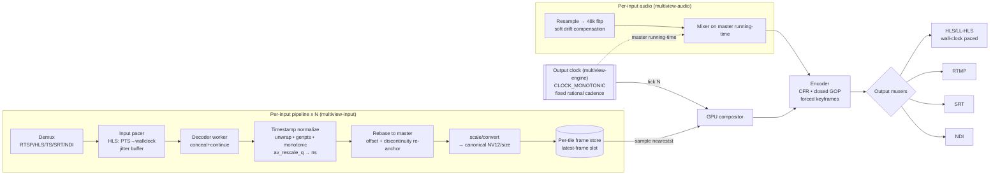

# Timing & Synchronization Model

> **Runbook scope.** This is the single, authoritative description of how Multiview keeps time: the
> monotonic output clock, per-input PTS normalization and rebasing, the
> `input-PTS → normalized-time → output-frame-index` algorithm, NTSC `1001` handling, HLS ingest
> pacing, and long-run clock-drift correction (video frame-select + audio soft resampling). It is
> derived from the streaming-gotchas research brief and the timing ADRs; where this document and the
> deep brief differ, the [canonical conventions](./conventions.md) win.

**Deep briefs:** [streaming-gotchas](../research/streaming-gotchas.md) ·
[resilience-and-av](../research/resilience-and-av.md)
**Decisions:** [ADR-T001](../decisions/ADR-T001.md) · [ADR-T002](../decisions/ADR-T002.md) ·
[ADR-T003](../decisions/ADR-T003.md) · [ADR-T004](../decisions/ADR-T004.md) ·
[ADR-T005](../decisions/ADR-T005.md) · [ADR-T006](../decisions/ADR-T006.md) ·
[ADR-T007](../decisions/ADR-T007.md) · [ADR-T008](../decisions/ADR-T008.md) ·
[ADR-R001](../decisions/ADR-R001.md)

---

## 1. The one principle

> **The output is driven by a single internal monotonic clock. Inputs are *sampled* into the
> output; they never *pace* it.**

Every timing failure mode — mismatched fps, PTS wraparound, HLS bursts, multi-hour drift — is
ultimately solved by decoupling each input behind a per-input buffer + timestamp normalizer and
driving the compositor and muxer from one fixed-cadence output clock. There is **no single FFmpeg
flag** that makes output bulletproof: error resilience, timestamp normalization, clock decoupling,
and CFR enforcement are *separate* mechanisms that must *all* be present.

This is invariant #1 and #3 from the [conventions](./conventions.md#5-canonical-technical-invariants):
at every tick of one fixed-cadence internal monotonic clock, the output stage emits exactly one
valid, correctly-timestamped frame (+ matching audio), forever, independent of any input. Output
PTS = `f(tick)`.

Ownership lives in `multiview-engine` (the output clock and compositor drive), with normalization in
`multiview-input` and the per-tile stores in `multiview-framestore`. `MediaTime` is defined in
`multiview-core`.

---

## 2. The three-stage timestamp pipeline (per input)

```
RAW INPUT PTS  ──►  [1] NORMALIZE  ──►  [2] REBASE  ──►  internal media_time (i64 ns)
                       unwrap wrap          offset = anchor_now − first_pts
                       genpts fallback      re-anchor on discontinuity
                       monotonic guard
                       rescale via av_rescale_q

internal media_time  ──►  per-tile FRAME STORE (latest-frame slot / small ring)

[3] OUTPUT CLOCK (free-running, CLOCK_MONOTONIC, fixed cadence)
    output frame N  ⇒  out_pts = N   (in 1/out_fps timebase)
    at each tick: sample the tile frame whose media_time is nearest-but-not-after N/out_fps
    re-stamp ALL output PTS/DTS from the output counter — never propagate input PTS to the muxer
```

| Stage | Crate | Responsibility |
|-------|-------|----------------|
| **[1] Normalize** | `multiview-input` | Unwrap 33-bit TS / 32-bit RTP wrap (delta-based), genpts fallback, monotonic guard, rescale to ns. |
| **[2] Rebase** | `multiview-input` | Offset onto the master timeline; re-anchor on discontinuity. |
| **Frame store** | `multiview-framestore` | Single-slot last-good cell (overwrite, newest wins) keyed by `media_time`. |
| **[3] Output clock** | `multiview-engine` | Fixed-cadence ticker; samples each tile; re-stamps all output PTS/DTS from the counter. |

### Dataflow diagram



See [ADR-T001](../decisions/ADR-T001.md) (output clock) and
[ADR-T002](../decisions/ADR-T002.md) (per-tile resampling) for the decisions and rejected
alternatives.

---

## 3. The exact algorithm

### 3.1 Per input `i`, on every decoded frame

```text
raw      = frame.best_effort_timestamp        // use best_effort, NOT dts (B-frames reorder)
if raw == AV_NOPTS_VALUE: raw = synthesize_from_cadence()   // genpts-equiv fallback
unwrapped = raw + accumulated_wrap_i          // 33-bit TS / 32-bit RTP unwrap, delta-based
if (unwrapped - last_unwrapped_i) < -(1 << (wrap_bits-1)):
        accumulated_wrap_i += (1 << wrap_bits)         // wrap detected
ns       = av_rescale_q(unwrapped, in_tb, NS_TB)       // NS_TB = 1/1_000_000_000
if abs(ns - expected_ns_i) > DISCONTINUITY_NS  OR  saw_EXT_X_DISCONTINUITY:
        offset_i += continuous_time_i − ns             // RE-ANCHOR (smooth continuation)
on first valid frame: anchor_i = master_now(); offset_i = anchor_i − ns
media_time = ns + offset_i
if media_time <= last_media_time_i: media_time = last_media_time_i + 1   // monotonic guard
frame_store[i].put(media_time, frame)         // single-slot overwrite (or small ring)
```

Rules that make this load-bearing (see [ADR-T003](../decisions/ADR-T003.md)):

- **Schedule by `best_effort_timestamp`, never DTS** — decode order ≠ display order with B-frames.
  Only the *output encoder* needs DTS, which libavcodec assigns automatically.
- **Unwrap delta-based, not value-based.** Do **not** trust libavformat's `pts_wrap_reference` /
  `correct_ts_overflow` heuristic — a bogus SDP `rtptime` has scheduled a *false* rollover at
  ~13h14m and corrupted output in production. Own the timeline.
- **Discontinuity → re-anchor, don't pass through.** On `EXT-X-DISCONTINUITY`, the TS
  `discontinuity_indicator`, or a jump `> ~10 s`, shift `offset` so output media time continues
  smoothly. After `EXT-X-DISCONTINUITY` PTS may be *any* value, including descending (RFC 8216) —
  reset the per-input parser/decoder if needed and `avcodec_flush_buffers()`.
- **Monotonic guard** is the final safety net so the store key never goes backward.

### 3.2 The output clock (one thread, drives the whole multiview)

```text
start = master_now()                                   // monotonic Instant
for N in 0.. :
    target_ns   = N * 1_000_000_000 * out_fps_den / out_fps_num   // exact rational, 1001-safe
    deadline    = start + target_ns
    sleep_until(deadline − SPIN_MARGIN); busy_spin_until(deadline)  // accurate cadence
    for each tile i:
        f = frame_store[i].nearest_at_or_before(target_ns)
        if f is None: f = frame_store[i].last_good()   // HOLD on starvation
        composite(f)                                   // GPU
    encode_and_mux(out_pts = N)                         // CFR, counter-derived PTS
```

This is mathematically equivalent to per-tile nearest/previous-PTS resampling with implicit
duplicate-on-stall and drop-on-overrun, at **zero motion-interpolation cost**:

| Input behaviour | Store effect | Output effect |
|---|---|---|
| Stalled source | nothing written | tile holds last good frame (then rides the state machine) |
| Bursting source | slot overwritten, newest wins | implicit drop (bounded RAM) |
| Wrong / variable fps | writes at its own rate | implicit duplicate/drop resample |

The output **never** stalls because it is gated by the wall clock, not any input. Duplicate/drop is
the default per-tile policy (O(1), scales to N tiles at 50/60 fps). Motion-compensated
(`minterpolate`) or linear-blend (`framerate`) resampling are opt-in *per-tile* quality modes only,
never the global default (see [ADR-T002](../decisions/ADR-T002.md)).

### 3.3 Cadence accuracy

OS sleep granularity is ~1–15 ms, so a naive `sleep(frame_interval)` accumulates drift. Use
**absolute deadlines** (`deadline = start + N·interval`) with `sleep_until` + a busy-spin tail
(`quanta` to read the clock, `spin_sleep` to hit the deadline). Per-frame spacing must be
**measured and validated**, not assumed — the output-validity probe asserts frame-interval jitter is
within bound and that PTS is strictly monotonic with zero gaps.

> **HIGH RISK.** `-fps_mode cfr` / `-vsync 1` / the `fps` filter on a multi-input `filter_complex`
> does **not** make output bulletproof — a stalled (no-EOF) input freezes the whole graph
> (confirmed at FFmpeg source level via `framesync.c`). CFR must be the compositor's *own* output
> clock + per-tile latch; `-fps_mode cfr` is valid only as the *final encoder-stage* CFR
> enforcement on already-paced output.

---

## 4. NTSC `1001` (fractional-rate) handling

The NTSC family rates are **exact rationals**, never floats:

| Nominal | Exact rational |
|---|---|
| 23.976 | 24000 / 1001 |
| 29.97 | 30000 / 1001 |
| 59.94 | 60000 / 1001 |

Rules:

- **Carry all internal time as i64 nanoseconds** (90 kHz is an acceptable alternative tick base).
  Pick a **rational output cadence** (e.g. `60000/1001` for NTSC ecosystems) — store `out_fps_num`
  / `out_fps_den`, never a float.
- **Never use float fps.** `29.97f` drifts ~3.6 s/hour and eventually produces non-monotonic /
  duplicate PTS — a latent overnight falter.
- Rescale with `av_rescale_q` using `AV_ROUND_NEAR_INF | AV_ROUND_PASS_MINMAX`.
- **Do not attempt inverse-telecine in the live path.** A telecined source simply becomes a
  slightly juddery, stall-free tile.

Choose fps/segment durations so the GOP keyint divides evenly (e.g. 30 fps + 2 s segments →
keyint = 60); see §6.

---

## 5. HLS ingest pacing

| | |
|---|---|
| **Problem** | On connect/reconnect, several already-published segments sit on the origin; a naive reader pulls them all back-to-back. |
| **Symptom** | Tile plays too fast / time-warps; RAM blowup; tile skips. |
| **Root cause** | Segment-granular HTTP delivery + a consumer reading as fast as the network allows. |

**Mitigation — a custom PTS-to-wall-clock pacer between demux and compositor** (in
`multiview-input`; see [ADR-T004](../decisions/ADR-T004.md)):

```text
on first frame: anchor_wall = now(); pts0 = frame.pts
release frame when now() >= anchor_wall + (pts − pts0)
bounded ring buffer (target ~0.5–3 s pre-roll); overflow on connect is fine (absorbed)
re-anchor (pts0, anchor_wall) on EXT-X-DISCONTINUITY or |pts−last| > threshold
bounded catch-up: if latency-to-edge grows, advance releases at ≤ ~1.25× until back to target
```

- **Start at live edge minus hold-back:** `live_start_index=-3` (default) or honor `EXT-X-START`
  via `prefer_x_start=1`; respect `HOLD-BACK` / `PART-HOLD-BACK`.
- **Detect live vs VOD up front** (`EXT-X-ENDLIST` / `EXT-X-PLAYLIST-TYPE`); treat ambiguous as
  live. Set `seg_max_retry>0` (default 0 silently skips a failed segment → gap), but cap it. Try
  `http_multiple=0` if bursting is severe.

> **HIGH RISK.** **`-re` is for files, not live ingest.** FFmpeg documents it verbatim as
> "equivalent to `-readrate 1`" and warns it "should not be used with actual grab devices or live
> input streams." After a stall its wall-clock-anchored budget refills via an *unthrottled burst* —
> the opposite of a fix. `readrate_catchup` (FFmpeg 8.0+) is a **CLI-only fftools option**,
> unavailable to a libav-linked Rust pipeline at any version. **Build your own pacer** — it is
> mandatory for in-process libav.

---

## 6. HLS / LL-HLS output pacing

Server-side pacing is authoritative (see [ADR-T005](../decisions/ADR-T005.md)). The master output
clock already guarantees ≤ one segment per `hls_time` of real time.

- **Pace segment *publication* to wall clock. Never catch up by flushing buffered frames — drop to
  live instead.**
- **GOP-aligned, closed, fixed GOP:** `-g N -keyint_min N -sc_threshold 0` +
  `-force_key_frames 'expr:gte(t,n_forced*SEG_SECONDS)'`. x265 **defaults to OPEN gop — must pass
  `open-gop=0`**. NVENC cannot reconfig GOP structure; keep the canvas pinned for the session.
- **Standard HLS:** `hls_segment_type fmp4`, `hls_time 2`, `hls_list_size 6–10`,
  `hls_flags +delete_segments+temp_file+independent_segments+program_date_time+omit_endlist`.
  `+temp_file` gives atomic rename (no fetch-during-write stall). Anchor
  `EXT-X-PROGRAM-DATE-TIME` to a real monotonic→UTC clock (computing from summed `EXTINF` *drifts*).
- **CMAF/fMP4 preferred over MPEG-TS.** Emit `EXT-X-DISCONTINUITY` + bump
  `EXT-X-DISCONTINUITY-SEQUENCE` only on genuine timeline breaks.

> **HIGH RISK.** **FFmpeg's `lhls` flag is NOT Apple LL-HLS** — it emits only `#EXT-X-PREFETCH`
> (community LHLS); there is **no `EXT-X-PART` option** in the FFmpeg HLS muxer. True LL-HLS needs a
> custom CMAF origin (axum/hyper + `tokio::sync::Notify` per part) emitting `EXT-X-SERVER-CONTROL` +
> `EXT-X-PART` + `EXT-X-PRELOAD-HINT` with blocking playlist reload over HTTP/2. Do not rely on
> `maxLiveSyncPlaybackRate` as the primary fix; it is a secondary client trim. Any free-running
> consume stage you own reintroduces bursting — every owned stage must be wall-clocked.

---

## 7. Long-run clock drift

| | |
|---|---|
| **Problem** | Every source crystal drifts tens–hundreds of ppm vs the output clock over hours/days. |
| **Symptom** | Slow buffer overrun (drop) or underrun (freeze/repeat); A/V desync. |
| **Root cause** | Independent clocks, no active correction; making an input the master. |

**Master clock = system `CLOCK_MONOTONIC` driving the output pacer** — never an input clock or
audio-hardware clock. The per-source drift control loop (see [ADR-T006](../decisions/ADR-T006.md)):

- **PI + dead-band + EMA:** low-pass the buffer-level / PTS error, dead-band ~40 ms, accumulate many
  samples before acting. The loop output is the per-source ppm correction.
- **Video:** correct by whole-frame select/drop/duplicate at the compositor — free, artifact-light
  (this is exactly what the §3.2 latch-on-tick model already does).
- **Audio: never drop/dup blocks audibly — apply continuous soft resampling** by the measured ppm
  (a software word-clock). Two paths:
  - **libswresample:** set `async > 1` (e.g. `async=1000`) to enable soft stretch, or explicitly set
    `min_comp` / `comp_duration` / `max_soft_comp` and drive `swr_set_compensation` + `swr_next_pts`
    from the master-clock A/V offset each interval. (Pure-Rust alternative: `rubato`; high-quality:
    `soxr` `SOXR_VR`.)
  - Keep **hard** compensation (silence inject / sample drop) as a *discontinuity-only* safety net.

> **HIGH RISK.** `aresample=async=1` alone is NOT a multi-hour drift fix. `async=1` does **no
> stretching** (hard fill/trim only) and `min_hard_comp` (default 0.1 s) lets ~100 ms accumulate —
> *larger than the EBU R37 lip-sync window* — before correction fires. Drive correction from the
> master-clock offset, act earlier, and **soak-test for ≥72 h** (acceptance: max |A/V offset| within
> window + zero output gaps).

---

## 8. A/V sync & per-input jitter buffers

See [ADR-T008](../decisions/ADR-T008.md). Audio runs on the **master running-time** (same monotonic
source as video) in `multiview-audio`.

- **Per-input adaptive jitter buffer:** reorder by RTP seqnum, de-dup, drop too-late, bound memory.
  Size from RFC 3550 interarrival jitter `J` (`target ≈ 3–4·J + margin`). For audio, adopt WebRTC
  **NetEq** principles (relative-delay histogram, 0.95-quantile target, WSOLA accelerate/expand).
- **Sizing:** LAN/SRT 50–200 ms; internet RTSP/RTP/SRT 200 ms–1 s; HLS = multi-second segment
  smoothing (not a packet jitter buffer). **SRT's latency window IS a jitter buffer** — don't
  double-buffer.
- **Lip-sync:** align via RTCP SR (NTP↔RTP) for RTP inputs, or container PTS for muxed inputs; rebase
  to master. Target window EBU R37 **+40 / −60 ms** (audio-ahead is more perceptible — bias audio
  slightly behind).
- **Unify to 48 kHz fltp before mixing** (`amix` requires identical rates). On dropout, fill with
  `anullsrc` silence PTS-locked to the program clock so discrete tracks never gap (load-bearing for
  the bulletproof-output invariant — see [resilience-and-av](../research/resilience-and-av.md)).
- **Audio-only / video-only inputs are first-class:** synthesize the missing modality upstream of
  the mixer (silence; black/last-frame/placeholder video) so the mixer/compositor always see a
  continuous gap-free stream.

---

## 9. Timebase & muxer-output safety

The only timestamps the encoder/muxer ever see are clean and **counter-derived** (§3.2):

- **Output encoder:** let libavcodec assign DTS on the encoded path. Use CFR (`-fps_mode cfr`, not
  the deprecated `-vsync 1`), closed fixed GOP, forced keyframes at segment boundaries.
- **Stream-copy paths only:** clamp `dts = max(dts, last_dts+1)`, `pts = max(pts, dts)` before
  `av_interleaved_write_frame` (it **aborts** on the first non-monotonic DTS). Set
  `avoid_negative_ts=make_zero` and a small `max_interleave_delta`. Prefer re-encode over copy when
  source timestamps are pathological.
- For ABR, IDR frames across renditions must land on **identical** timestamps.

---

## 10. Failure-mode quick reference

| Problem | Symptom | Mitigation | Decision |
|---|---|---|---|
| Mismatched/variable fps | Stall/skip/judder | Per-tile latch + output-clock sampling; dup/drop | [T002](../decisions/ADR-T002.md) |
| Wrong declared fps | Bad dup/drop ratios | Median of decoded PTS deltas; ignore `r_frame_rate`/SDP | [T002](../decisions/ADR-T002.md) |
| 1001-family rates | Drift, non-mono PTS over hours | i64 ns / 90 kHz rational time; `av_rescale_q` | [T001](../decisions/ADR-T001.md) |
| MPEG-TS/RTP wrap | Non-mono DTS, segmenter stall | Delta-based unwrap, own 64-bit clock (NOT `correct_ts_overflow`) | [T003](../decisions/ADR-T003.md) |
| Discontinuity | Burst or multi-min stall | Re-anchor offset; flush parser/decoder | [T003](../decisions/ADR-T003.md) |
| B-frame reorder | Wrong scheduling | Schedule by `best_effort_timestamp`; flush on reset | [T003](../decisions/ADR-T003.md) |
| Muxer abort | Output dies | Clamp `dts=max(dts,last+1)`; `avoid_negative_ts=make_zero` | [T007](../decisions/ADR-T007.md) |
| HLS ingest burst | Tile too fast / RAM blowup | PTS→wallclock pacer + jitter buffer + live edge (NOT `-re`) | [T004](../decisions/ADR-T004.md) |
| HLS output burst | Player fast-forwards | Wall-clock-paced publication; drop-to-live | [T005](../decisions/ADR-T005.md) |
| No real LL-HLS | "Low latency" ignored | Custom CMAF `EXT-X-PART` origin (NOT `-lhls`) | [T005](../decisions/ADR-T005.md) |
| Clock drift | Overrun/underrun, desync | PI+dead-band loop; frame-select video; soft-resample audio | [T006](../decisions/ADR-T006.md) |
| A/V desync | Lip-sync off | RTCP SR align; EBU R37 window; NetEq buffer | [T008](../decisions/ADR-T008.md) |

---

## 11. Acceptance gates (runbook)

The timing model is verified, not asserted. The always-on output-validity probe
(`multiview-telemetry`) and the chaos suite enforce:

- **Zero output gaps** (no frame-interval > N× nominal) and **strictly monotonic** output PTS, with
  custom Prometheus buckets around the nominal frame interval.
- **Output-PTS-vs-wallclock drift** tracked over multi-day soak — a slowly diverging clock is a
  latent falter. Clock arithmetic is also tested deterministically (tokio paused clock / `madsim`
  to simulate days in seconds).
- **Wrap boundaries tested explicitly** with synthetic wrapping timestamps (MPEG-TS 33-bit ≈ 26.5 h;
  RTP 32-bit ≈ 13.25 h) — 24/7 services that ran fine for an hour fail overnight.
- **A/V offset** stays within the EBU R37 window across a ≥72 h soak with adaptive resampling
  enabled.
- A stalled / bursting / wrong-fps input is fault-injected (container pause = perfect hung-source
  sim) and asserted to affect **only its own tile**, never the output cadence.

See [resilience-and-av](../research/resilience-and-av.md) §9 for the full SLO/chaos definition and
[ADR-R001](../decisions/ADR-R001.md) for the continuous-output guarantee this timing model
implements.
