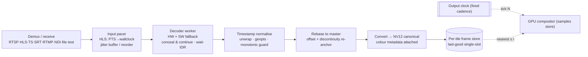
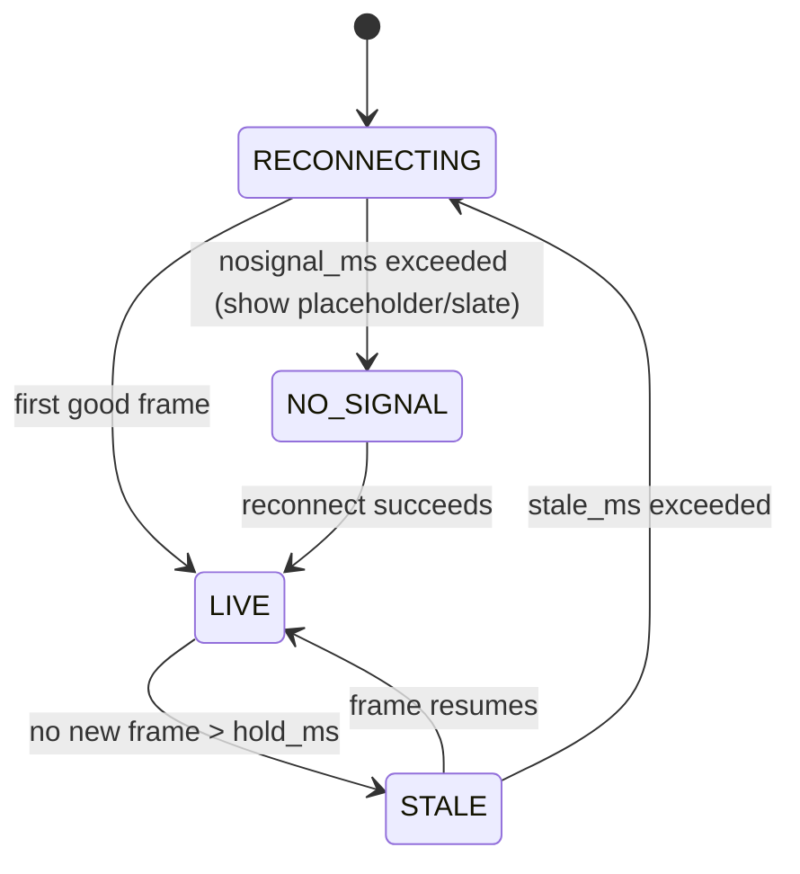

# Multiview — Input / Source Subsystem

The input subsystem ingests every live (and file/test) source, normalises its timing and
colour, and hands frames to the compositor through per-tile last-good-frame stores. It is
implemented in the **`multiview-input`** crate (ingest sources, the input pacer, jitter buffers,
timestamp normalisation, supervised reconnect; features `ffmpeg`, `ndi`).

> **The one principle that governs everything:** *the output is driven by a single internal
> monotonic clock; inputs are **sampled** into the output, never allowed to **pace** it.* A
> stalled, bursting, drifting, or corrupt source can degrade its own tile but can **never** stall,
> speed up, or back-pressure the multiview. See the deep
> [Streaming Robustness Runbook](../research/streaming-gotchas.md) and
> [ADR-T001](../decisions/ADR-T001.md) / [ADR-R001](../decisions/ADR-R001.md).

Related canonical references:

- Architecture: [conventions §3, §5](../architecture/conventions.md) (crate map, invariants).
- Deep briefs: [Core Engine](../research/core-engine.md) · [Streaming Gotchas](../research/streaming-gotchas.md) · [Management Capability Matrix](../research/management-capability-matrix.md) · [Resilience & A/V](../research/resilience-and-av.md).
- Test material: [Example & Test Streams](../reference/example-streams.md) — a deliberately diverse gotcha matrix used throughout this doc.

---

## 1. Per-source pipeline

Each source runs as an **isolated supervised task** (one decode actor per source) feeding a
bounded, drop-oldest queue. `av_read_frame` on one source never blocks the composite loop, and one
dead RTSP camera never freezes the multiview ([ADR-0013](../decisions/ADR-0013.md),
[ADR-R001](../decisions/ADR-R001.md)).



The stages map onto the broader data-plane pipeline in
[conventions §5](../architecture/conventions.md). Timestamp normalisation, rebasing, the frame
store, and the deadline-driven sampling are covered in depth in
[Streaming Gotchas §0–2](../research/streaming-gotchas.md) and
[ADR-T002](../decisions/ADR-T002.md) / [ADR-T003](../decisions/ADR-T003.md).

---

## 2. Supported protocols

The `kind` field (internally-tagged enum, `#[serde(tag="kind")]`) selects the source and exposes a
kind-specific options block. The decoded protocols are
**`rtsp` · `hls` · `ts` · `srt` · `rtmp` · `ndi` · `file`**; alongside them sit the in-process
**synthetic** kinds **`bars` · `solid` · `clock`** (`test` is a back-compat alias for `bars`).
Synthetic sources are first-class peers of decoded feeds — rendered in pure Rust with no libav and
no subprocess, published per tick into the same per-tile store — see
[ADR-0027](../decisions/ADR-0027.md).

| `kind` | Backend(s) | Live? | Default transport | Feature | Notes |
|--------|-----------|:----:|-------------------|---------|-------|
| `rtsp` | `rsmpeg`/libavformat **or** `retina` (pure-Rust) | yes | TCP | `ffmpeg`, (`retina`) | Primary IP-camera path. `retina` is TCP-only. |
| `hls`  | libavformat | yes / VOD-as-live | HTTPS | `ffmpeg` | Needs the **input pacer** (anti-burst). |
| `ts`   | libavformat (MPEG-TS) | yes | UDP / file | `ffmpeg` | `scan_all_pmts`; multi-program selection. |
| `srt`  | `srt-tokio` **or** libav `srt://` | yes | caller | `ffmpeg`, (`srt`) | Latency is in **microseconds** (footgun). |
| `rtmp` | `rml_rtmp` **or** libav `rtmp://` | yes | TCP (FLV) | `ffmpeg` | App + stream key; key is a secret. |
| `ndi`  | `grafton-ndi` (build-link) / `NDIlib_v6_load` (dynamic) | yes | mDNS LAN | `ndi` | Bind by source **name**; host-memory frames. |
| `file` | libavformat | no (loopable) | — | `ffmpeg` | Slate/standby clip; `-re`-style pacing valid here. |
| `bars` | in-process pure-Rust generator | yes | — | — | 75% colour bars (line-up signal); no network. `test` is an alias. |
| `solid` | in-process pure-Rust generator | yes | — | — | Solid-colour slate; `color = "#RRGGBB"`. |
| `clock` | in-process generator (reuses the clock rasterizer) | yes | — | (`overlay`) | Full-frame analog/digital clock; needs `overlay` in the full pipeline. |

> **Resolver-backed extension (opt-in):** a **`youtube`** source kind is planned (backlog) as a thin
> wrapper that resolves a YouTube live URL to an HLS master playlist via an external, runtime-discovered
> **`yt-dlp`** binary, then feeds the resolved URL into the `hls` path above. It is off by default behind
> a `youtube` feature and is **not** one of the eight canonical protocol kinds — see
> [io/youtube-live.md](youtube-live.md) and [ADR-0015](../decisions/ADR-0015.md).

> **Decode-at-display-resolution applies to every protocol.** Each source is decoded near its
> displayed tile size where the backend supports it, and a smaller substream/rendition is preferred
> over the full-resolution feed ([conventions §5 invariant 6](../architecture/conventions.md),
> [ADR-E001](../decisions/ADR-E001.md)). See `decode.scale_to_display`, `requested_rendition`, and
> `rtsp.substream_path` in [§7](#7-track--rendition-selection).

### 2.1 RTSP

- **Backend:** `rtsp.ingest_backend = ffmpeg | retina`. `ffmpeg` (libavformat) is the default and the
  only option for lossy **UDP** RTSP (it has the reorder buffer); `retina` is a pure-Rust path that
  defaults to RTP-over-TCP — its lack of a reorder buffer is moot over TCP.
- **Transport:** `rtsp.transport = tcp | udp | udp_multicast | prefer_tcp`. **Prefer TCP** for
  reliability over the public internet / VPN. Force `rtsp_transport=tcp` or `prefer_tcp`.
- **Jitter / reorder (UDP only):** `rtsp.reorder_queue_size`, `rtsp.max_delay_us` trade jitter
  tolerance against latency.
- **Timeouts:** `timeouts.connect_us` / `timeouts.rw_timeout_us` back an **`AVIOInterruptCB`**
  (mandatory). **Gotcha:** the interrupt callback and `timeout` do **not** bound synchronous DNS
  (`getaddrinfo`) — `timeouts.dns_watchdog_ms` drives a mandatory outer DNS watchdog
  ([ADR-R003](../decisions/ADR-R003.md)).
- **Test source:** an example RTSP camera (HEVC 1080p50, BT.709 limited, TCP) — see
  [example-streams §RTSP](../reference/example-streams.md).

### 2.2 HLS

- **Resilient pull:** `hls.reconnect`, `hls.reconnect_at_eof`, `hls.reconnect_streamed`,
  `hls.http_persistent` (keep-alive). `http.headers` / `http.user_agent` for CDN gating (values may
  reference `${secret:ref}`).
- **Live edge:** `hls.live_start_index` (default `-3`, i.e. live edge minus hold-back); honour
  `EXT-X-START` via `prefer_x_start=1`. Detect live vs VOD up front
  (`EXT-X-ENDLIST` / `EXT-X-PLAYLIST-TYPE`); treat ambiguous as live.
- **Anti-burst pacing** (`hls.pace_to_wallclock`): the single most important HLS knob — see
  [§3](#3-the-input-pacer).
- **Test sources:** a synthetic 25 fps untagged feed, a synthetic 29.97 fps BT.709-limited
  feed, Big Buck Bunny (public VOD-as-live, 44.1 kHz), Apple BipBop (fMP4/CMAF + WebVTT) —
  [example-streams](../reference/example-streams.md).

### 2.3 MPEG-TS (`ts`)

- `ts.scan_all_pmts` (default **on**); `ts.program` selects one program from a multi-program
  transport. Normalise extradata for elementary streams (`h264_mp4toannexb` / extract-extradata),
  especially for VideoToolbox decode — see `decode.extradata_normalize`.
- 33-bit PTS wrap (~26.5 h) is handled by the timestamp normaliser, **not** by libav's heuristics —
  [§4](#4-timestamp-normalisation--rebasing).

### 2.4 SRT

- `srt.mode = caller | listener | rendezvous`; `srt.backend = srt-tokio | libav`.
- **`srt.latency_us` is in MICROSECONDS** — the canonical footgun. The UI surfaces a µs field with a
  ms helper. SRT's own latency window **is** a jitter buffer — budget across transport + app, do not
  double-buffer ([§5](#5-jitter-buffers)).
- Encryption: `srt.passphrase_ref` (secret store) + `srt.pbkeylen` (16/24/32). Access control via
  `srt.streamid`.
- **Build check:** confirm `ffmpeg -protocols` lists `srt` (SRT silently 404s if libsrt isn't
  linked). The once-claimed `--enable-shared` conflict is a misdiagnosed pkg-config issue, **not** a
  real FFmpeg limitation.

### 2.5 RTMP

- `rtmp.app` + `rtmp.stream_key_ref` (secret). Native `rml_rtmp` (FLV / H.264+AAC) or libav
  `rtmp://` as the interop-reliable fallback.

### 2.6 NDI

- **Bind by source name:** `ndi.source_name` (e.g. `STUDIO (CAM 1)`); discover via
  `GET /api/v1/discovery/ndi`. Unresolved names show an **offline card** until they appear on the LAN.
- `ndi.receive_color_format = fastest | best`; `ndi.bandwidth_mode = highest | lowest` (proxy).
- **Host-memory frames:** NDI delivers UYVY/P216/BGRA in host memory, so there is always one
  host→GPU upload on NDI in (read the SDK-owned borrowed buffer directly into the upload to avoid an
  *extra* memcpy). NDI is CPU/SIMD-decoded and network-heavy — plan 10/25 GbE
  ([conventions §7](../architecture/conventions.md), [ADR-0008](../decisions/ADR-0008.md)).
- **Licensing:** proprietary, royalty-free, **feature-gated**, never vendored; mandatory
  attribution. See [ADR-0008](../decisions/ADR-0008.md). There is no public NDI over the internet —
  test with NDI Tools on a LAN ([example-streams](../reference/example-streams.md)).

### 2.7 File & synthetic sources

- **`file`** (`file.path`, `file.loop`): slate / standby clip. Files are the **only** input where
  wall-clock-throttled read (`-re`-style) is appropriate — live ingest must use the pacer, never
  `-re` ([§3](#3-the-input-pacer)).
- **`bars`** (no fields): built-in 75% SMPTE/EBU colour bars — the classic line-up signal.
  Rendered in-process in pure Rust (no libav, no subprocess); requires no network and is identical
  across the FFmpeg-free and full builds. `test` is accepted as a back-compat alias and
  canonicalizes to `bars` ([ADR-0027](../decisions/ADR-0027.md)). The bars audio companion (tone) is
  not yet implemented.
- **`solid`** (`color`): a single-colour slate; `color` is a `#RRGGBB` (or `#RGB`) hex string,
  validated at config-load time. In-process, pure-Rust.
- **`clock`** (`face`, `twelve_hour`, `tz_offset_minutes`): a full-frame analog or digital clock that
  can fill a tile or the whole canvas, disciplined by the system wall clock. `face` is `analog`
  (default) or `digital`; `twelve_hour` selects a 12-hour AM/PM readout (digital only);
  `tz_offset_minutes` is a UTC offset in minutes (`-720..=840`, validated at load). It reuses the
  clock overlay rasterizer, so in the full pipeline it needs the `overlay` feature
  ([ADR-0027](../decisions/ADR-0027.md)).

---

## 3. The input pacer

The pacer sits **between demux and the decoder/compositor** and converts segment-granular or bursty
delivery into wall-clock-paced frames. It is mandatory for in-process libav and is the only safe
anti-burst path on older/distro FFmpeg builds ([ADR-T004](../decisions/ADR-T004.md)).

```text
on first frame:  anchor_wall = now();  pts0 = frame.pts
release a frame when:  now() >= anchor_wall + (pts - pts0)
bounded ring buffer (~0.5–3 s pre-roll); connect-time overflow is absorbed (drop)
re-anchor (pts0, anchor_wall) on EXT-X-DISCONTINUITY or |pts - last| > threshold
bounded catch-up: if behind, advance releases at ≤ ~1.25× until back to target — never instant seek
```

- **HLS bursting** (`hls.pace_to_wallclock`): on connect/reconnect several published segments sit on
  the origin; a naive reader pulls them back-to-back → the tile time-warps and RAM balloons. The
  pacer locks the tile to real time. Reproduce by pointing ingest at a VOD HLS (Mux BBB) with the
  pacer off, then on ([example-streams §Reproducing the HLS "bursting" failure](../reference/example-streams.md)).
- **`-re` is for files, not live ingest.** It is documented verbatim as "equivalent to `-readrate 1`"
  and FFmpeg warns it can cause packet loss on live input; after a stall it refills via an
  *unthrottled* burst. `readrate_catchup` is CLI-only fftools (FFmpeg 8.0+) and unavailable to a
  libav-linked Rust pipeline at any version. **Build your own pacer** — see
  [ADR-T004](../decisions/ADR-T004.md).
- **Wall-clock everything you own.** Any free-running consume stage re-introduces bursting, so the
  whole input path must be paced.

---

## 4. Timestamp normalisation & rebasing

Per-input PTS is normalised and rebased onto one internal nanosecond timeline; the output then
re-stamps all PTS/DTS from the tick counter ([conventions invariant 3](../architecture/conventions.md),
[ADR-T003](../decisions/ADR-T003.md)). The encoder/muxer only ever sees clean, counter-derived
timestamps.

| Concern | Rule |
|---------|------|
| Source of truth | Use `frame.best_effort_timestamp` (display order), **not** raw DTS (B-frames reorder). |
| Missing PTS | Synthesise from cadence (`genpts`-equivalent fallback). |
| Wrap | **Delta-based** unwrap: 33-bit MPEG-TS (~26.5 h) and 32-bit RTP (~13.25 h). Do **not** trust libav's `pts_wrap_reference`/`correct_ts_overflow` — its RTP heuristic has misfired in production. |
| Discontinuity | On `EXT-X-DISCONTINUITY`, TS `discontinuity_indicator`, or a large jump → **re-anchor** (`offset += continuous_time − new_raw`); do not pass new PTS through. |
| Monotonic guard | `media_time = max(media_time, last + 1)` after rebasing. |
| Rationals | NTSC `1001` rates carried as exact rationals / ns — never float fps (drifts ~3.6 s/hour). |

> **No single FFmpeg flag "just works."** `+genpts`, `avoid_negative_ts`, `correct_ts_overflow`,
> and `use_wallclock_as_timestamps` each handle only one slice of the problem. Multiview **owns the
> timeline** and tests past the wrap boundary. Full algorithm in
> [Streaming Gotchas §0, §2](../research/streaming-gotchas.md).

---

## 5. Jitter buffers

Each input has its own adaptive jitter buffer, sized by transport and capped by the latency budget.
A high-latency / flaky tile is treated as **leaky** (drop/hold) so the worst source never inflates
or stalls the multiview — it contributes via MIN, not MAX, latency
([conventions §11](../architecture/conventions.md)).

- **Config:** `jitter.buffer_ms` (LAN/WAN presets), `jitter.queue_depth`,
  `jitter.leaky = drop_oldest` (unbounded queues are forbidden;
  [ADR-E005](../decisions/ADR-E005.md)).
- **Sizing:** LAN / SRT ~50–200 ms; internet RTSP/RTP/SRT ~200 ms–1 s; HLS is a multi-second
  *segment-smoothing* buffer, not a packet jitter buffer. **SRT's `latency_us` is already a jitter
  buffer** — don't double-buffer.
- **Reorder:** by RTP seqnum, de-dup, drop too-late. RTP's default 200 ms jitterbuffer is far too
  high for LAN — tune to ~30–100 ms.
- **Audio buffers** follow WebRTC NetEq principles (relative-delay histogram, WSOLA accel/expand);
  audio-only / video-only inputs synthesise the missing modality so the mixer/compositor always see
  a continuous stream. A/V detail lives in [Streaming Gotchas §7](../research/streaming-gotchas.md)
  and [ADR-T008](../decisions/ADR-T008.md).

---

## 6. Reconnect, supervision & the tile state machine

Inputs are part of an OTP-style supervision tree (OneForOne for independent inputs); reconnect uses
exponential backoff + jitter, gated by per-endpoint circuit breakers, with heartbeat watchdogs for
hung (not crashed) workers ([ADR-R003](../decisions/ADR-R003.md)).



- **State machine:** every tile rides `LIVE → STALE → RECONNECTING → NO_SIGNAL`. The compositor
  always reads the latest good frame (or a placeholder card) and never blocks
  ([conventions invariant 2](../architecture/conventions.md), implemented via the
  **`multiview-framestore`** last-good stores).
- **Ladder timers:** `resilience.hold_ms`, `resilience.stale_ms`, `resilience.nosignal_ms`;
  `resilience.placeholder` (offline card / slate, atlas-resident).
- **Backoff:** `reconnect.{initial_ms, max_ms, multiplier, jitter}`; `reconnect.max_attempts`
  (`0` = infinite). `reconnect.circuit_breaker.{threshold, open_ms, half_open_probes}` with state
  read-only (Closed / Open / Half-Open).
- **Manual actions:** `POST .../reconnect` (Reconnect-now overrides circuit-breaker park),
  `POST .../reset` (rebases PTS, clears the jitter buffer). Disabling a source drops the tile to
  `NO_SIGNAL` with **no output reset**.
- **Decoder resilience:** the per-input `DecoderWorker` conceals-and-continues (never aborts the
  multiview): `err_recognition` without `AV_EF_EXPLODE`, gate compositing on the CORRUPT +
  `decode_error_flags` clear, wait-for-IDR, per-input error-counter + no-output watchdog, and
  per-input HW→SW fallback ([ADR-T007](../decisions/ADR-T007.md),
  [Streaming Gotchas §6](../research/streaming-gotchas.md)).

Management surfaces every one of these knobs — status badges, reconnect-now, circuit-breaker state,
and per-input resilience overrides — per the
[Management Capability Matrix §2.1](../research/management-capability-matrix.md) and
[ADR-R003](../decisions/ADR-R003.md).

---

## 7. Track & rendition selection

A universal decode-cost lever: pick the smallest rendition/substream that still fills the tile, and
select the right elementary streams.

| Knob | API field | Values | Purpose |
|------|-----------|--------|---------|
| Rendition | `requested_rendition` | `auto · lowest · highest · index:N · res:WxH` | ABR/multivariant rung — universal decode-cost lever. |
| RTSP substream | `rtsp.substream_path` | URL (main/sub) | NVR sub-stream selection. |
| TS program | `ts.program` | program id | Pick one program from a multi-program transport. |
| Decode size | `decode.target_size` + `decode.scale_to_display` | auto / WxH | Decode at display resolution (fused NVDEC / best-effort VT / VPP / no-op sw). |
| Audio tracks | `audio.tracks[]` | track ids + channels | Feeds the output audio routing matrix. |
| Captions | `captions.mode` (+ `page`/`id`/`field`/`path`) | `auto · off · teletext_page · track · embedded_cc · sidecar` | Native caption ingest selection (owned by Source) — see [io/captions.md](captions.md). |
| Frame skip | `decode.skip_frame` | `none · bidir · nonref · nonkey · all` | Coarse decode-cost reduction. |

The source **owns** per-input attributes (track select, gain, mute, metering); the *cross-product*
input→output-track mapping is owned by `Output.audio`
([Management Capability Matrix §1.2](../research/management-capability-matrix.md),
[ADR-M004](../decisions/ADR-M004.md)). Backend preference is an ordered list
`decode.backend_preference` (e.g. `[nvdec, vt, vaapi, qsv, sw]`) that falls back automatically
([ADR-0003](../decisions/ADR-0003.md), [ADR-E001](../decisions/ADR-E001.md)).

---

## 8. Per-source colour override

Colour is detected per source on four independent axes and may be overridden per source. Detection
defaults match **players, not swscale**; PQ/HLG is never auto-promoted
([conventions invariant 8](../architecture/conventions.md),
[ADR-C002](../decisions/ADR-C002.md), [ADR-M003](../decisions/ADR-M003.md)).

| Axis | Field | Notes |
|------|-------|-------|
| 1 — Primaries | `color_override.primaries` | `auto` follows detection precedence. |
| 2 — Transfer (TRC) | `color_override.transfer` | Never auto-promote PQ/HLG; warn on SDR. |
| 3 — Matrix | `color_override.matrix` | `rgb(0)` ≠ `unspecified(2)`. |
| 4 — Range | `color_override.range` | **Highest-impact bug class.** VideoToolbox range bug → trust the VUI. |
| Chroma siting | `color_override.chroma_siting` | `left · center · topleft`. |
| Bit depth | `color_override.bit_depth` | 8/10/12; drives chroma centre. |
| HDR tone-map | `color_override.tonemap.*` | Per-tile BT.2390 EETF anchored at 203 nits ([ADR-C005](../decisions/ADR-C005.md)). |
| Detected (RO) | `GET /api/v1/sources/{id}/color` | Provenance: Frame / Codec / Container / Guessed. |

The per-source override sets **per-tile compositor kernel uniforms**; the actual range expand /
YUV→RGB / linearise / convert happens in the compositor in the fixed colour-pipeline order, and
frames stay NV12 until then ([conventions invariants 5, 8](../architecture/conventions.md)). Range is
handled explicitly in-shader exactly once ([ADR-C004](../decisions/ADR-C004.md)). Untagged inputs
(a synthetic untagged feed, Big Buck Bunny) and odd mixed tags (Apple BipBop `smpte170m`/`bt709`)
are the canonical test cases — see [example-streams](../reference/example-streams.md). Full colour
design lives in the
[Colour Management brief](../research/color-management.md).

---

## 9. Configuration reference

A source is one TOML/JSON document with a `kind`-tagged protocol block (see
[core-engine brief §13](../research/core-engine.md) and the JSON form in the
[Management Capability Matrix §3.1](../research/management-capability-matrix.md)). Abbreviated:

```toml
[[cells.source]]            # or a managed /api/v1/sources/{id}
kind = "rtsp"
url  = "rtsp://cam-stage.lan/main"

[cells.source.rtsp]
ingest_backend     = "ffmpeg"        # ffmpeg | retina
transport          = "tcp"           # tcp | udp | udp_multicast | prefer_tcp
reorder_queue_size = 0               # UDP only
max_delay_us       = 200000

[cells.source.timeouts]
connect_us     = 5000000
rw_timeout_us  = 8000000
dns_watchdog_ms = 4000               # mandatory — AVIO timeout does NOT bound DNS

[cells.source.jitter]
buffer_ms   = 60
queue_depth = 2
leaky       = "drop_oldest"          # unbounded forbidden

[cells.source.reconnect]
initial_ms = 500
max_ms     = 30000
multiplier = 2.0
jitter     = 0.3
max_attempts = 0                     # 0 = infinite

[cells.source.resilience]
hold_ms     = 500
stale_ms    = 3000
nosignal_ms = 10000

[cells.source.color_override]
range = "auto"                       # auto | tv | pc — highest-impact bug axis
```

Per-kind blocks (decoded: `hls`, `ts`, `srt`, `rtmp`, `ndi`, `file`; synthetic: `solid`'s `color`,
`clock`'s `face`/`twelve_hour`/`tz_offset_minutes`; `bars`/`test` take no fields) carry the options
described in [§2](#2-supported-protocols). Secrets are referenced (`${secret:ref}` / `secret_ref`),
never inlined ([ADR-M006](../decisions/ADR-M006.md)).

---

## 10. Related ADRs

| ADR | Topic |
|-----|-------|
| [ADR-T001](../decisions/ADR-T001.md) | Single internal monotonic timeline + fixed-cadence output clock |
| [ADR-T002](../decisions/ADR-T002.md) | Per-tile resampling: hold-last-good + duplicate/drop on output tick |
| [ADR-T003](../decisions/ADR-T003.md) | Timestamp normalisation: unwrap, genpts, monotonic guard, re-anchor |
| [ADR-T004](../decisions/ADR-T004.md) | HLS ingest pacing: custom PTS→wall-clock pacer, not `-re` |
| [ADR-T007](../decisions/ADR-T007.md) | Codec edge-case & decode policy: one bad input never stalls the multiview |
| [ADR-T008](../decisions/ADR-T008.md) | A/V sync & per-input jitter-buffer model |
| [ADR-R001](../decisions/ADR-R001.md) | Continuous-output guarantee, output clock, last-good stores |
| [ADR-R003](../decisions/ADR-R003.md) | Supervision, backoff, circuit breakers, watchdogs, bounded memory |
| [ADR-E001](../decisions/ADR-E001.md) | Decode each tile at/near display resolution |
| [ADR-C002](../decisions/ADR-C002.md) | Untagged-input default colour policy |
| [ADR-C004](../decisions/ADR-C004.md) | Range handled explicitly in-shader exactly once |
| [ADR-M003](../decisions/ADR-M003.md) | Four-axis per-source colour override |
| [ADR-M004](../decisions/ADR-M004.md) | Audio track-mapping ownership (Source vs Output) |
| [ADR-0008](../decisions/ADR-0008.md) | NDI first-class, feature-gated, dynamically loaded, attribution |
| [ADR-0013](../decisions/ADR-0013.md) | Deadline-driven compositor with per-tile FrameSync |
