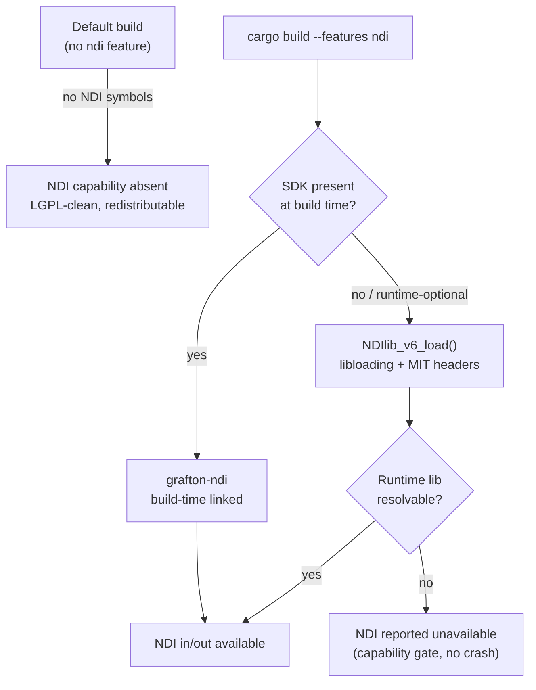
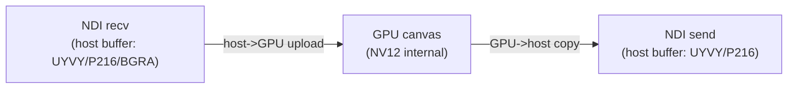

# NDI — Network Device Interface (In & Out)

Multiview treats **NDI as a first-class source and sink** for both ingest and output, but it is
**isolated** from the rest of the build: NDI is proprietary software, so it is off by default,
runtime-loaded, and carries **mandatory licensing and attribution obligations** that this document
makes prominent (see [§ Licensing](#licensing--redistribution--attribution-must-read)).

> NDI® is a registered trademark of **Vizrt NDI AB**.

| | |
|---|---|
| **Crates** | `multiview-input` (NDI in), `multiview-output` (NDI out) |
| **Cargo feature** | `ndi` (off by default); `ndi-advanced` for HX (separate paid license) |
| **Binding** | `grafton-ndi` (Apache-2.0, NDI 6) + a `NDIlib_v6_load()` dynamic-load path |
| **Frame memory** | **Host memory** — always one host↔GPU copy at the NDI boundary |
| **Per-source timing** | Wrapped in a per-source **FrameSync** (see [`multiview-framestore`](../architecture/conventions.md)) |
| **Key ADRs** | [ADR-0008](../decisions/ADR-0008.md) (NDI model), [ADR-0012](../decisions/ADR-0012.md) (licensing), [ADR-0004](../decisions/ADR-0004.md) (copy boundary) |
| **Deep briefs** | [core-engine.md § 10](../research/core-engine.md), [resilience-and-av.md](../research/resilience-and-av.md) |

---

## 1. What NDI is, and why it is special here

NDI (Network Device Interface) is Vizrt's low-latency IP video transport widely used in
broadcast/AV. Multiview supports:

- **NDI in** — discover sources on the LAN and receive video + audio (+ PTZ/tally/metadata),
  feeding each source into a tile like any other ingest.
- **NDI out** — publish the composited multiview canvas as a single NDI sender.

The reason NDI gets its own document (rather than living alongside RTSP/SRT/HLS) is twofold:

1. **It cannot be vendored or statically linked into the permissive repo.** The SDK is proprietary
   and the binding links a dynamic library at build time — so NDI must be **feature-gated and
   runtime-loaded** to keep the default build LGPL-clean and redistributable.
2. **NDI frames are host-memory.** There is no on-GPU zero-copy island for NDI; every NDI receive
   incurs a host→GPU upload and every NDI send incurs a GPU→host copy. This is an explicit,
   architecturally-acknowledged copy boundary ([ADR-0004](../decisions/ADR-0004.md)).

---

## 2. The feature-gated + runtime-load model

### 2.1 Why two code paths

The chosen binding, **`grafton-ndi`** (Apache-2.0, targets NDI 6), is excellent — it covers
Finder/Receiver/Sender/FrameSync/audio/PTZ/tally plus Advanced-SDK hooks, with borrowed
(zero-extra-copy) receive and async send. **But its `build.rs` emits
`cargo:rustc-link-lib=dylib=ndi` and bindgens the SDK headers at build time, and panics if the SDK
is absent.** That means a plain `grafton-ndi` dependency would make the *whole build* require the
proprietary SDK — unacceptable for a default open-source build.

Multiview therefore uses **two layers** behind the `ndi` feature:

| Path | When | Mechanism | SDK required to build? |
|---|---|---|---|
| **Build-time linked** (`grafton-ndi`) | CI/Docker images that ship NDI; dev with SDK present | Links `libndi` at link time | **Yes** |
| **Runtime dynamic-load** | Truly optional capability; build without the SDK | `NDIlib_v6_load()` via `libloading` + vendored MIT headers | **No** |

> Note: NDI 6 uses **`NDIlib_v6_load`** (not the v5 symbol). The dynamic-load backend loads the
> user-provided runtime at startup and resolves the function table; if the runtime is absent, the
> `ndi` capability is simply reported unavailable and Multiview continues without it.



### 2.2 Feature flags

Per the [canonical feature taxonomy](../architecture/conventions.md):

- **`ndi`** — proprietary SDK; **off by default**; runtime-loaded. Enables NDI in (`multiview-input`)
  and NDI out (`multiview-output`).
- **`ndi-advanced`** — NDI **Advanced SDK** (compressed HX H.264/HEVC). A **separate paid
  commercial license**, with codec royalties on you; strictly opt-in and distributed separately.

NDI is **not** part of the `full` umbrella preset (which is "everything non-GPL **and**
non-proprietary"); it must be requested explicitly.

### 2.3 Capability gating

The NDI capability surfaces through the same `CapabilityReport` gate used everywhere else
([ADR-M007](../decisions/ADR-M007.md)): the UI/validator only offers NDI sources/sinks when the
runtime resolved successfully. There is no silent failure — an unresolved runtime is reported, not
crashed-on.

---

## 3. Frame formats

NDI delivers and accepts frames in **host memory** in YUV/packed layouts — never as GPU surfaces.

### 3.1 NDI in (receive)

- Common receive layouts: **UYVY** (8-bit 4:2:2 packed), **P216** (16-bit 4:2:2), **BGRA**.
- Multiview reads the SDK-owned **borrowed** buffer directly into the host→GPU upload — "zero-extra-copy"
  here means avoiding an *additional* CPU `memcpy`, **not** avoiding the unavoidable PCIe upload.
- After upload, frames are converted in the compositor toward the canonical **NV12-throughout**
  internal representation; YUV→RGB and color conversion happen in-shader per the
  [color pipeline order](../architecture/conventions.md) (never reordered).
- Audio is **planar float (FLTP)** and is rebased onto the program clock like any other source.

### 3.2 NDI out (send)

A single NDI **Sender** publishes the composited multiview. The canvas is copied GPU→host, then sent:

| Color mode | Layout | Use when |
|---|---|---|
| `fastest` | UYVY / UYVA | **Latency** priority (default for live multiview) |
| `best` | P216 / PA16 | **Quality / HDR** priority |

The example config selects this directly:

```toml
[[outputs]]
kind  = "ndi"
name  = "MULTIVIEW OUT"
color = "fastest"      # or "best"
```

### 3.3 The copy boundary (always one copy)

Per [ADR-0004](../decisions/ADR-0004.md) and the zero-copy-islands rule, **NDI is never on a
GPU zero-copy island**:



The planner accounts for the latency/bandwidth cost of these copies; do **not** architect any path
that assumes cross-vendor or NDI on-GPU zero-copy.

---

## 4. FrameSync & timing

Each NDI source is wrapped in a per-source **FrameSync / TBC** (the NDI frame-synchronizer model:
push→pull, hold-last-frame), exactly as for every other ingest
([ADR-0013](../decisions/ADR-0013.md), [ADR-T002](../decisions/ADR-T002.md)):

- Converts NDI's push delivery into **pull** ("give me the frame valid at running_time T").
- Absorbs jitter with a small per-tile buffer.
- Absorbs **inevitable crystal drift** (e.g. 48000 vs 48001 Hz) via continuous video **drop/repeat**
  and **adaptive high-order audio resample** to the master clock. Align-once-at-startup *will*
  glitch within minutes — continuous correction is mandatory ([ADR-T006](../decisions/ADR-T006.md)).
- PTS is rebased onto the single internal ns timeline by the engine
  ([ADR-T003](../decisions/ADR-T003.md)); raw NDI timestamps are used to *measure* drift, never to
  pace output.

This feeds directly into the **bulletproof output guarantee**: NDI tiles ride the standard per-tile
state machine **LIVE → STALE → RECONNECTING → NO_SIGNAL**
([ADR-R001](../decisions/ADR-R001.md), [resilience-and-av.md](../research/resilience-and-av.md)).
A dead or hung NDI source never freezes the multiview — its tile shows last-good then a placeholder
card; the output clock keeps emitting.

**Source binding is by name.** NDI tiles bind to a source name (e.g. `STUDIO (CAM 1)`), with an
offline-card fallback for unresolved sources:

```toml
[[cells]]
area = "small1"
fit  = "contain"
[cells.source]
kind     = "ndi"
name     = "STUDIO (CAM 1)"   # bound by NDI source name
fallback = "offline_card"
```

---

## 5. Audio over NDI

NDI's audio model is **fundamentally different** from MPEG-TS/RTSP and constrains the
[discrete-audio capability matrix](../decisions/ADR-R005.md) ([ADR-M004](../decisions/ADR-M004.md)):

- **NDI has no discrete selectable audio tracks** — it carries **ONE audio stream per source**, as
  **channels** (planar FLTP). Capacity: up to 255 channels (Opus) / effectively unlimited (PCM);
  **AAC is capped at 2 channels**.
- To carry per-input audio over NDI you therefore must either:
  1. **Channel-map** (input *k* → channels *2k, 2k+1*), or
  2. emit **N separate NDI senders** (one per program).
- This is a **designed-in degradation**, surfaced explicitly by the capability-aware validator — the
  UI shows "channel-map" for NDI rather than offering N selectable tracks, and never silently drops
  audio. (Verification refuted the earlier "interleaved / N tracks" assumption.)

Subtitles over NDI are **effectively unavailable** for interop: there is no selectable subtitle
track, and FFmpeg's NDI muxer sets `subtitle_codec = AV_CODEC_ID_NONE`. The default is **burn-in**;
CEA-708-over-NDI-metadata is an advanced, direct-SDK, best-effort feature only
([ADR-R007](../decisions/ADR-R007.md)).

---

## 6. Performance & density

NDI ingest/egress is bounded by **network and CPU**, not the GPU:

- **Full NDI (SpeedHQ)** is ~**125–250 Mbps per 1080p60 stream** and **decodes on CPU/SIMD**.
- Dense NDI ingest is therefore network- and CPU-bound — **plan 10/25 GbE** and **budget CPU
  decode**, not just GPU headroom.
- Every NDI tile carries an unavoidable host→GPU upload (in) and the single NDI sender carries a
  GPU→host copy (out) — factor these copies into the per-system bandwidth budget.

**NDI Advanced (HX)** trades CPU/bandwidth for compressed H.264/HEVC transport, but requires the
paid **Advanced SDK** (`ndi-advanced` feature) and makes you responsible for H.264/H.265/AAC codec
royalties. It is a distinct, separately-distributed opt-in.

| Concern | Full NDI | NDI Advanced (HX) |
|---|---|---|
| Bitrate (1080p60) | ~125–250 Mbps | Much lower (compressed) |
| Decode cost | CPU/SIMD (heavy) | H.264/HEVC (HW where available) |
| License | NDI EULA (royalty-free) | **Separate paid** + codec royalties |
| Feature flag | `ndi` | `ndi-advanced` |

---

## 7. Licensing, redistribution & attribution (MUST READ)

> The NDI SDK is **proprietary and royalty-free — NOT open-source.** These obligations are
> **load-bearing**. See [ADR-0008](../decisions/ADR-0008.md), [ADR-0012](../decisions/ADR-0012.md),
> and the [licensing model](../architecture/conventions.md#7-licensing-model-build-profiles).

### 7.1 What you may and may **not** do

| ✅ Permitted | ❌ Prohibited |
|---|---|
| Redistribute the **unmodified** NDI runtime bundled in **your app folder** (not system paths) | Relicense, modify, or reverse-engineer the SDK/runtime |
| Use it under the `ndi` feature with the dynamic-load path | **Vendor the SDK source into a permissive repo** (static baking is license-prohibited) |
| Keep versions **current** (SDK < 30 days old at release, per EULA §2b) | Ship a stale runtime |
| Flow down NDI's no-modify / no-reverse-engineer terms in your product EULA (EULA §3d) | Omit attribution / branding |

### 7.2 Mandatory attribution & branding

- A **link to `ndi.video`** near NDI uses (UI/docs).
- An About-box notice: **"NDI® is a registered trademark of Vizrt NDI AB"**.
- You must **contact NDI** before putting "NDI" in the product name.

These obligations appear in the **UI/About box and docs** as part of the `ndi` feature — they are
not optional documentation niceties; the management surface ([web/API](../research/web-api-stack.md))
must render them when NDI is enabled.

### 7.3 How Multiview stays clean by default

- **The default build never contains NDI.** No SDK, no proprietary symbols, no obligations — the
  default profile is **LGPL-clean and redistributable**
  ([ADR-0012](../decisions/ADR-0012.md)).
- The SDK/runtime is the **user's responsibility**: enabling `ndi` means *you* fetch the SDK
  (CI/Docker for the `ndi` image variant), and at runtime the resolvable dylib (or the
  `NDIlib_v6_load` dynamic-load path) must be present.
- `cargo-deny` (`deny.toml`) gates licenses/advisories in CI; the effective license is reported
  **per built artifact**, so the NDI obligations attach only to NDI-enabled artifacts.

### 7.4 Build-profile summary

| Profile | Adds | Effective status |
|---|---|---|
| **default** | — | LGPL-clean, redistributable |
| **+ndi** | proprietary NDI runtime (royalty-free) | Permissive code **+ NDI EULA + mandatory attribution/branding** |
| **+ndi-advanced** | NDI Advanced SDK (HX H.264/HEVC) | **Separate paid** commercial license + codec royalties |

### 7.5 Runtime license gate (required)

NDI is gated **twice**: the off-by-default `ndi` build feature, **and** an explicit **runtime license
confirmation** the operator must give before any NDI source or output is allowed to start.

- Even in an `ndi`-enabled build, NDI I/O is **inert until the operator confirms** they have read and
  accepted the NDI SDK license and have the right to use NDI. This is a one-time, **audited**
  acknowledgement:
  - **Config / API:** a system setting — e.g. `[system.ndi] accept_license = true` with `accepted_by`
    + `accepted_at` — settable via `PATCH /api/v1/system/settings`.
  - **UI:** a one-time consent dialog showing the NDI license summary, the **`ndi.video`** link, and the
    **"NDI® is a registered trademark of Vizrt NDI AB"** notice; NDI controls stay disabled until accepted.
- **Until confirmed,** any configured NDI source/output is **refused and clearly reported** (an
  `ndi_unlicensed` status; an NDI tile shows a "NDI not enabled" placeholder card). It never starts NDI
  and never crashes (per the [output-clock invariant](../architecture/conventions.md#5-canonical-technical-invariants)).
- The acceptance (who/when) is **audit-logged** and exported with config as a flag (never a secret);
  revoking it disables all NDI I/O at the next safe boundary.

This keeps even NDI-enabled builds **legally clean by construction**: no NDI traffic flows until a human
with authority accepts the terms. See [conventions §7](../architecture/conventions.md#7-licensing-model-build-profiles)
and [ADR-0008](../decisions/ADR-0008.md).

---

## 8. Related decisions & briefs

- [ADR-0008 — NDI first-class but feature-gated, dynamically loaded, with attribution](../decisions/ADR-0008.md)
- [ADR-0012 — LGPL-clean default build; GPL/nonfree/NDI strictly opt-in](../decisions/ADR-0012.md)
- [ADR-0004 — Zero-copy islands; explicit copy at every cross-vendor/NDI/CPU boundary](../decisions/ADR-0004.md)
- [ADR-0013 — Deadline-driven compositor with per-tile FrameSync + drift correction](../decisions/ADR-0013.md)
- [ADR-R001 — Continuous-output guarantee (output clock + last-good-frame stores)](../decisions/ADR-R001.md)
- [ADR-R005 — Discrete per-input audio routing + per-output capability matrix](../decisions/ADR-R005.md)
- [ADR-M004 — Audio track-mapping model (capability-aware projection)](../decisions/ADR-M004.md)
- [ADR-T002 — Per-tile resampling (hold-last-good + drop/duplicate)](../decisions/ADR-T002.md) ·
  [ADR-T003 — Timestamp normalization](../decisions/ADR-T003.md) ·
  [ADR-T006 — Long-run clock drift](../decisions/ADR-T006.md)
- Deep briefs: [Core Engine § 10 (NDI Integration & Licensing)](../research/core-engine.md) ·
  [Bulletproof Output, Resilience & A/V](../research/resilience-and-av.md)
- Canonical naming/features/licensing: [conventions.md](../architecture/conventions.md)
