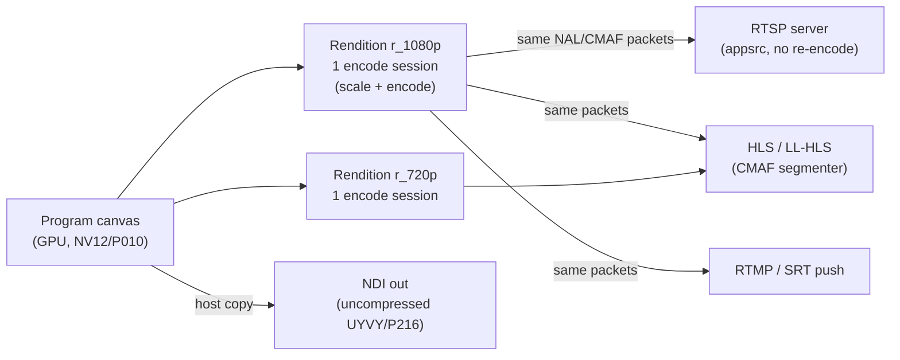

# Outputs & Sinks

How Multiview publishes the composited program: the sink subsystem. One canvas is composited, encoded **once per rendition**, and the resulting packets are **fanned out** to every transport that can share them — RTSP server, HLS/LL-HLS packager, NDI out, and RTMP/SRT push. Per-output encode profiles, color tagging, multistream audio, segment/continuity settings, and failover are all managed declaratively and verified at runtime.

- **Crate:** [`multiview-output`](../architecture/conventions.md#3-canonical-crate-map) — *"Output sinks/servers: RTSP server, HLS/LL-HLS packager, NDI out, RTMP/SRT push; encode-once-mux-many fan-out."* Features: `ffmpeg`, `ndi`.
- **Driven by:** [`multiview-engine`](../architecture/conventions.md#3-canonical-crate-map) (the protected output core: fixed-cadence output clock, supervisor, hot-reconfiguration).
- **Managed by:** [`multiview-control`](../architecture/conventions.md#3-canonical-crate-map) at `/api/v1/outputs/{id}`.

> Companion docs: [inputs.md](./inputs.md) (ingest), the deep briefs [`../research/core-engine.md`](../research/core-engine.md), [`../research/streaming-gotchas.md`](../research/streaming-gotchas.md), [`../research/resilience-and-av.md`](../research/resilience-and-av.md), and the management matrix [`../research/management-capability-matrix.md`](../research/management-capability-matrix.md).

---

## 1. The encode-once-mux-many model

The single most load-bearing efficiency decision on the output side: **composite once → encode the canvas once per rendition → fan the *same* packets to all transports.** Separate encode sessions are spun up **only** when codec, resolution, or bitrate differ between outputs.

> **Invariant 7 (encode-once-mux-many):** composite once, encode the canvas once per rendition, fan the *same* packets to all transports; separate encode only when codec/res/bitrate differ. — [conventions §5](../architecture/conventions.md#5-canonical-technical-invariants)



- Two outputs sharing **canvas + rendition + codec + bitrate** get *free* packet fan-out — the UI badges this "shares encoder, free fan-out". Any differing rendition is a separate session and badged "+1 against NVENC budget". See [`../research/management-capability-matrix.md`](../research/management-capability-matrix.md) §4.3.
- **Renditions** (`/api/v1/renditions/{id}`) are ABR ladder rungs; each rung = one scale + encode session. GOP-aligned, scene-cut **off** (mandatory for ABR switching).
- **NDI is the exception:** it carries *uncompressed* host-memory frames, so NDI out never shares an encoder; it takes a GPU→host copy off the canvas directly.
- Density is bounded by **physical NVENC chips, not the session-count headline** (most GeForce = 1 NVENC; the per-system concurrent-session cap is 12 since Nov 2025 on consumer, unlimited on datacenter). The session budget is **probed live, never hardcoded**, and shown as used/total. See [ADR-0014](../decisions/ADR-0014.md), [ADR-E003](../decisions/ADR-E003.md), [ADR-E004](../decisions/ADR-E004.md).

---

## 2. Output transports at a glance

| Output kind | Codec carriers | Latency class | Discrete audio | Discrete subtitles | Notes |
|---|---|---|---|---|---|
| **RTSP server** | H.264 / HEVC | sub-second–few s | **Yes, N** (RTP subsessions) | Yes, N (TS/in-band) | In-process `gst-rtsp-server`; serve pre-encoded NALs, **no re-encode**. |
| **HLS / LL-HLS** | H.264 / HEVC / AV1 | classic 6–30 s · LL ~2–5 s | **Yes, N — select-one** (`EXT-X-MEDIA`) | **Yes, N** (WebVTT + in-band 608/708) | Custom **CMAF-first** segmenter + blocking-reload origin. |
| **NDI out** | uncompressed (HX = paid) | sub-second (LAN) | **channels only** (no tracks) | **effectively none** → burn-in | One sender per source; host-memory copy. Attribution mandatory. |
| **RTMP / FLV push** | H.264 (+ HEVC/AV1 via E-RTMP) | ~1–3 s | **tiered** (1 legacy; N via E-RTMP, endpoint-gated) | **No** → burn-in only | `rml_rtmp` native + libav fallback. |
| **SRT push** | H.264 / HEVC (MPEG-TS) | sub-second–few s | **Yes, N PIDs** (receiver-dependent) | Yes, N (DVB/teletext/608/708) | `srt-tokio` + libav fallback; latency in **µs**. |
| **File** (archive) | any | n/a | Yes, N | Yes, N | MP4/MKV/TS; writes `colr`/nclx tags. |

Sub-second WebRTC output is **out of v1 scope** (the architecture leaves room). Deep dive: [`../research/core-engine.md`](../research/core-engine.md) §9.2, [`../research/streaming-gotchas.md`](../research/streaming-gotchas.md).

---

## 3. RTSP server

Primary path is an **in-process `gst-rtsp-server`** (via the `gstreamer-rtsp-server` crate) fed **pre-encoded** NAL units — there is **no GStreamer re-encode**.

```
appsrc (is-live=true, format=TIME, correct PTS/duration)
  ! h264parse        # avc<->byte-stream / au<->nal / SPS-PPS fixups — parse, NOT decode
  ! rtph264pay name=pay0   # h265parse ! rtph265pay for HEVC; audio payloader = pay1
```

| Setting | Value / behaviour | API |
|---|---|---|
| `mount` | RTSP mount point (e.g. `/multiview`) | `PATCH .../container/rtsp {mount}` |
| `transports` | `tcp`, `udp` (client `SETUP`s each) | `PATCH .../container/rtsp {transports}` |
| `config_interval` | `-1` → SPS/PPS inline every IDR so **late joiners** decode immediately | `PATCH .../container/rtsp {config_interval}` |
| `shared` | `factory.set_shared(true)` → one encode fans out to all clients | `PATCH .../container/rtsp {shared}` |

- Discrete audio: each track is a separate RTP **subsession** (multiple `m=audio` SDP lines); the client `SETUP`s each. RTSP is one of the strongest multitrack carriers.
- The GStreamer/GLib C stack runs on its own GLib main-loop thread, bridged to Tokio. For a lean static binary, the **MediaMTX sidecar** is the alternative (one extra network hop, fans one published source to RTSP/HLS/SRT/WebRTC/RTMP).
- See [ADR-0006](../decisions/ADR-0006.md) and [`../research/core-engine.md`](../research/core-engine.md) §9.2.

---

## 4. HLS / LL-HLS packager

**CMAF-first, custom-built.** FFmpeg's `hls` muxer **cannot emit Apple LL-HLS** (`-lhls` is the legacy `EXT-X-PREFETCH` DASH variant), so Multiview owns the segmenter and origin.

- Encode once into **fragmented MP4** via libav `movenc` (`-movflags cmaf+frag_custom+empty_moov+delay_moov`) and derive HLS, LL-HLS, and (optionally) DASH from **one** in-memory segment/part store.
- **Tag layer** is reused from the `hls-playlist` crate (EXT-X-PART, PART-INF, SERVER-CONTROL with `CAN-BLOCK-RELOAD` + `PART-HOLD-BACK`, PRELOAD-HINT, RENDITION-REPORT, SKIP).
- **Built in-house:** the CMAF segmenter (sub-second parts aligned to IDR/keyframe boundaries) and the LL-HLS HTTP origin (axum/hyper) with blocking playlist reload (`_HLS_msn`/`_HLS_part` held requests), preload-hint byte-range responses, and chunked-transfer push of in-progress parts.

| Container setting | Default / rule | Apply class | API |
|---|---|---|---|
| `segment_ms` | ~2000 ms; `keyint = fps × segment` | Class-2 (re-pin GOP) | `PATCH .../container {segment_ms}` |
| `part_ms` (LL) | ~200–300 ms | Hot | `PATCH .../container {part_ms}` |
| `gop_ms` | ~2000 ms (aligned to segment) | Class-2 | encode profile |
| `playlist_window` / `dvr_window` | sliding live window / DVR depth | Hot | `PATCH .../container {playlist_window,dvr_window}` |
| `segment_format` | `fmp4` (LL-HLS forces fmp4) or `ts` | **Reset-on-change** | `PATCH .../container {segment_format}` |
| LL-HLS server-control | `PART-HOLD-BACK = 3× PART-TARGET`, HTTP/2 | Hot | `PATCH .../container/llhls {*}` |

- **Continuity rule:** segments are continuous; a discontinuity marker is only emitted when a format change *demands* it (and is then correctly *signalled*, never spurious). Keep a standard longer-segment HLS rendition for compatibility/DVR alongside the LL rendition.
- `CODECS`/`VIDEO-RANGE`/`STREAM-INF` are derived from the encode profile and color TRC (`VIDEO-RANGE` from transfer). Manifest is previewable via `GET .../container/manifest`.
- Conformance is gated by Apple `mediastreamvalidator` in CI (assert discontinuities are *tagged*, not absent). See [ADR-0007](../decisions/ADR-0007.md), [ADR-T005](../decisions/ADR-T005.md), and [`../research/streaming-gotchas.md`](../research/streaming-gotchas.md).

---

## 5. NDI out

A single NDI **Sender** publishes the composited multiview. NDI frames live in **host memory**, so there is always one GPU→host copy off the canvas (no encode session consumed).

| Setting | Options | API |
|---|---|---|
| `sender_name` | NDI source name (e.g. `MULTIVIEW OUT`) | `PATCH .../container/ndi {sender_name}` |
| `groups` | NDI group membership | `PATCH .../container/ndi {groups}` |
| `color_format` | `fastest` (UYVY/UYVA, latency) · `best` (P216/PA16, HDR/quality) | `PATCH .../container/ndi {color_format}` |
| `clock` | clock-to-video / clock-to-audio | `PATCH .../container/ndi {clock}` |

- **No CICP:** NDI has no in-band color tagging — color is carried by convention (`color_format`), not CICP metadata.
- **Audio = channels, not tracks.** One audio stream per source (planar FLTP); per-input audio becomes a **channel map** (input *k* → ch 2k, 2k+1) **or** N separate NDI senders. AAC is capped at 2 ch; selecting `ndi_mode` is **Reset-on-change**.
- **Subtitles:** effectively none over FFmpeg's NDI muxer → **burn-in** is the default path.
- **HX (compressed) NDI** needs the **Advanced SDK** — a separate **paid** commercial license + codec royalties — feature-gated as `ndi-advanced`.
- **Licensing/branding (mandatory):** the NDI SDK is proprietary/royalty-free, never vendored; the `ndi` feature is runtime dynamic-load (`NDIlib_v6_load`). Ship the About-box notice **"NDI® is a registered trademark of Vizrt NDI AB"**, link to ndi.video, and flow down the EULA. See [conventions §7](../architecture/conventions.md#7-licensing-model-build-profiles), [ADR-0008](../decisions/ADR-0008.md).

---

## 6. RTMP / SRT push

| Push kind | Native backend | Fallback | Carrier | Key settings |
|---|---|---|---|---|
| **RTMP / E-RTMP** | `rml_rtmp` (FLV / H.264 + AAC) | libav `rtmp://` | FLV | `url`, `app`, `stream_key` (secret) |
| **SRT** | `srt-tokio` (caller, encryption, streamid) | libav `srt://` | MPEG-TS | `latency_us` (**microseconds!**), `passphrase`, `streamid` |

- Default-reliable behaviour falls back to libav output for interop with arbitrary endpoints; `srt-tokio` interop with reference libsrt must be validated per destination.
- SRT `latency` is in **microseconds** — a documented footgun; the UI shows µs with a ms helper.
- Push destinations reconnect with backoff on failure (see §9); the stream key/passphrase live in the **secret store** (`${secret:ref}`), never plaintext.
- See [`../research/core-engine.md`](../research/core-engine.md) §9.2.

---

## 7. Per-output encode profiles

Each output carries an **EncodeProfile** (video) negotiated independently per backend. The canonical low-latency profile is one bundle across all backends; a quality/VOD profile re-enables B-frames + lookahead.

```jsonc
"encode": {
  "video": {
    "codec": "h264",            // h264 | hevc | av1
    "backend": "auto",          // nvenc | vt | vaapi | qsv | x264 | x265 | svt_av1 | aom
    "profile": "high", "level": "auto",
    "width": 1920, "height": 1080,
    "max_width": 1920, "max_height": 1080,   // pinned ceiling for the session
    "scaler": "lanczos", "fps": "60000/1001",
    "pixel_format": "nv12", "bit_depth": 8, "chroma": "420",
    "latency_profile": "low_latency",        // one-click bundle
    "rc": { "mode": "cbr", "bitrate": 6000000, "maxrate": 6000000,
            "bufsize": 100000, "filler_data": true },
    "preset": "p4", "tune": "ull",
    "gop": { "mode": "infinite_force_idr", "length_ms": 2000,
             "closed": true, "scene_cut": false },
    "bframes": 0, "lookahead": 0, "refs": 1, "sfe": false,
    "intra_refresh": { "enabled": false }
  }
}
```

### Canonical low-latency profile (all backends)
CBR, **B-frames = 0** (IPPP), lookahead = 0, single-pass, small VBV (~bitrate/fps), periodic forced-IDR or intra-refresh, zero reorder delay.

| Backend | Low-latency flags |
|---|---|
| **NVENC** | `tune=ull`, `-rc cbr`, `-bf 0`, `-rc-lookahead 0`, `-multipass disabled`, `enableFillerDataInsertion=1` |
| **x264** | `-tune zerolatency` |
| **VideoToolbox** | `EnableLowLatencyRateControl` + `RealTime` (H.264-only LL path; plan H.264 for the mac LL path) |

- **Backend `auto`** uses the HAL scored negotiation (platform fixed-function first, software fallback); every codec/profile/level/session option in the Output editor is **gated by `CapabilityReport`** (impossible options greyed with a tooltip). H.264 is the mandatory interop baseline (RTSP/RTMP/SRT); HEVC/AV1 are runtime-feature-detected upgrades for capable HLS/LL-HLS players.
- **SFE** (NVIDIA Split-Frame Encoding) is Ada+ HEVC/AV1 only.
- See [ADR-M002](../decisions/ADR-M002.md), [ADR-0014](../decisions/ADR-0014.md), and [`../research/core-engine.md`](../research/core-engine.md) §8.3.

---

## 8. Output color tagging

> **Tagging never converts.** Pixels are produced by the compositor in the canvas working space; output CICP only *labels* them. A mandatory post-encode **ffprobe verify gate** enforces label-vs-pixel agreement.

All four CICP axes **must** be set (never leave CICP = 2 / unspecified): **primaries**, **transfer/TRC**, **matrix**, **range**. Defaults **inherit the canvas working color space**.

```jsonc
"color": {
  "inherit_canvas": true,
  "primaries": "bt709", "transfer": "bt709", "matrix": "bt709", "range": "tv",
  "hdr": { "mode": "off", "mastering_display": null,
           "max_cll": null, "max_fall": null,
           "sei_inband": true, "container_box": true },
  "tonemap": { "enabled": false, "algorithm": "bt2390_eetf",
               "target_nits": 203, "desat": 1.0, "peak_percentile": 99.995 },
  "verify": { "enabled": true, "on_fail": "alert" }   // alert | restart | stop
}
```

Pitfalls auto-handled and surfaced in the UI:

- **NVENC** full-range NV12 needs JPEG range to reach the encoder (auto-handled).
- **VideoToolbox** silently defaults to MPEG/limited.
- **TS / RTSP / SRT** carry color only in VUI → HDR static metadata must be **in-band SEI** (`sei_inband`).
- **HDR is explicit-only:** the `hdr.mode` toggle (Off / HDR10 / HLG) flips 10-bit + main10 and reveals ST 2086 mastering display + MaxCLL/MaxFALL. Enabling HDR is **Class-2** (changes bit-depth/codec constraints).
- **Tone-map** engages whenever the canvas and output color targets differ (default BT.2390 EETF anchored at **203 nits** — "the wash-out fix").
- The **verify gate** runs after every encode *and* remux (TS↔MP4 can drop `colr`), fails on unknown/mismatch, and shows observed-vs-expected in the Health panel.

Color tag changes are **Hot (relabel)** unless they flip HDR/bit-depth. Full pipeline order is invariant 8 in [conventions §5](../architecture/conventions.md#5-canonical-technical-invariants). See [ADR-C006](../decisions/ADR-C006.md), [ADR-M003](../decisions/ADR-M003.md), [`../research/color-management.md`](../research/color-management.md).

---

## 9. Multistream audio tracks

Audio mirrors video PTS rebasing onto the program clock. Two destinations: a **program bus** (mixed + loudnorm) and **clean discrete per-input tracks** (no gain/normalization). **Source owns the per-input attributes; Output owns the cross-product input→output-track mapping.**

```jsonc
"audio": {
  "program": { "enabled": true, "codec": "aac", "channels": 2,
    "sample_rate": 48000, "bitrate": 128000, "language": "eng", "title": "Program",
    "loudnorm": { "enabled": true, "target_lufs": -23, "true_peak": -1.5, "lra": 7 } },
  "tracks": [
    { "id": "a_cam1", "input_id": "in_cam1", "source_channels": [0,1],
      "codec": "aac", "channels": 2, "sample_rate": 48000, "bitrate": 128000,
      "language": "eng", "title": "Camera 1", "default": true, "autoselect": true,
      "include_in_program_bus": true, "program_gain_db": 0.0, "program_mute": false } ],
  "ndi_mode": null, "rtmp_multitrack": "auto"
}
```

### Per-output discrete-audio capability (verified)

| Output | Discrete tracks | Mechanism / limit |
|---|---|---|
| **MPEG-TS / SRT / RIST** | **Yes, N** (best general carrier) | one audio ES per PID; `-streamid` (base-10). SRT/RIST receiver may select only first PID. |
| **RTSP / SDP** | **Yes, N simultaneous** | each track = its own RTP subsession. |
| **HLS / LL-HLS / DASH** | **Yes, N — select-one** | `EXT-X-MEDIA TYPE=AUDIO` by GROUP-ID → UI is a *selector*, not simultaneous monitor. |
| **NDI** | **No tracks — channels only** | one stream ≤255 ch (Opus) / unlimited (PCM); AAC ≤2 ch; planar FLTP. Channel-map or multi-sender. |
| **RTMP / FLV** | **Tiered** | legacy = 1; E-RTMP v2 = N via `audioTrackId` — **endpoint-gated** (Twitch ≤2; YouTube ignores). |
| **MP4 / MKV** (file) | Yes, N — select-one | multiple tracks; VOD/archive only. |

- **Discrete tracks are decode→re-encode normalized**, not passthrough (passthrough breaks when an input changes codec mid-stream).
- **Program bus:** `amix` → `loudnorm` (EBU R128, single-pass live mode), e.g. -23 LUFS broadcast / -16 LUFS web, TP -1.5 dBTP; the -70 LUFS gate excludes silence from a lost input.
- **Missing audio** → `anullsrc` silence, PTS-locked, so a track **never gaps** (load-bearing for the continuous-output invariant). On total input loss the fill source still emits the correct *number* of (silent) tracks so discrete tracks never vanish from the mux.
- The UI **routing matrix** (rows = inputs, cols = output tracks/channels) is **capability-aware**: it greys impossible cells per output and surfaces **explicit degradation** (e.g. "Twitch: degraded to single mixed bus") — never a silent drop.
- See [ADR-R005](../decisions/ADR-R005.md), [ADR-M004](../decisions/ADR-M004.md), and [`../research/resilience-and-av.md`](../research/resilience-and-av.md) §4.

> Subtitles follow the same carrier-asymmetry rule (N tracks on TS/HLS; burn-in only on RTMP/NDI). See [ADR-R007](../decisions/ADR-R007.md) and the inputs/overlay docs.

---

## 10. Segment & continuity settings

The bulletproof-output guarantee reaches the muxer: under normal operation **no discontinuity is ever emitted**, and every container is configured for perpetual decodability.

- **PTS/DTS = f(tick):** the output stage re-stamps all PTS/DTS from the fixed-cadence tick counter — monotonic, gap-free by construction (invariant 1). Never `-copyts`; never timestamp from an input.
- **MPEG-TS:** continuity counters + PCR continuous; `+resend_headers` / PAT-PMT-at-frames so late joiners lock immediately.
- **HLS/LL-HLS:** segments continuous; `force_key_frames` at segment boundaries; `independent_segments`; discontinuity markers only when a format change demands one (then correctly *tagged*).
- **RTSP/RTP:** periodic SPS/PPS via `config_interval=-1` + forced IDR so consumer churn never touches the pipeline.
- **GOP discipline:** infinite GOP with `forceIDR` driven per-frame (NVENC) makes keyframe **cadence** fully live-controllable without a restart; GOP **structure** (bframes/lookahead/refs/fixed-GOP) is **pinned** for the session's life.

Validity is enforced by an always-on **output-validity probe** (Prometheus SLOs): zero gaps (interval > N× nominal), strictly monotonic PTS, zero TR 101 290 priority-1 errors, and an always-ticking clock overlay as a falter sentinel. See [ADR-R001](../decisions/ADR-R001.md), [ADR-T001](../decisions/ADR-T001.md), [ADR-R009](../decisions/ADR-R009.md), and [`../research/resilience-and-av.md`](../research/resilience-and-av.md) §1, §9.

---

## 11. Failover & output resilience

Each output is a supervised publisher. Failure is contained to the output; the protected core keeps emitting.

```jsonc
"failover": {
  "on_fail": "retry_backoff",                 // ignore | retry_backoff | failover | stop
  "backoff": { "base_ms": 500, "max_ms": 30000, "jitter": true },
  "backup_endpoints": [], "redundancy": "none",  // none | hot_standby
  "slate": { "enabled": true, "card_asset": "signal_lost",
             "show_clock": true, "audio_on_blackout": "silence" }
}
```

| Failure | Handling | Output impact |
|---|---|---|
| **Push endpoint down** | circuit breaker (Closed/Open/Half-Open) per output publish + backoff (`backon`, exponential + jitter); fail over to `backup_endpoints` if configured. | none to other outputs. |
| **Consumer connect/disconnect** | periodic SPS/PPS + IDR (RTSP/RTMP) and PAT/PMT resend (TS) — late joiners decode immediately; churn never touches the pipeline. | none. |
| **Encoder hiccup / re-init** | **hot-standby encoder** with identical pinned config; SMPTE-2022-7-style GOP-level merge; force IDR + repeat SPS/PPS at the splice. *Note: hot standby doubles session use against the NVENC budget.* | continuous. |
| **GPU device loss / TDR** | output core (own clock) keeps emitting **slate + live clock** during idempotent `rebuild()`; NVENC/CUDA "fell off the bus" carried by CPU/software encoder or hot-standby. | slate during rebuild; **no gap**. |
| **Total blackout (all tiles down)** | full-canvas slate + live ticking clock overlay + silence/last-good audio; slate assets are **atlas-resident at startup**. | continuous (canvas never freezes). |
| **Class-2 reconfig** | make-before-break parallel-output migration (§12). | downstream-visible discontinuity, correctly signalled. |

- The `output_onfail_default` system policy supplies defaults (default `ignore`); a per-output PATCH overrides it.
- Proactive **encoder-process recycling** (schedule/threshold) overlapped behind hot standby keeps multi-day NVENC leaks invisible.
- See [ADR-R002](../decisions/ADR-R002.md), [ADR-R003](../decisions/ADR-R003.md), [ADR-R004](../decisions/ADR-R004.md), and [`../research/resilience-and-av.md`](../research/resilience-and-av.md) §1–§3.

---

## 12. Live-apply: pinned vs hot parameters

Every output edit is classified and surfaced **before apply** via `POST /api/v1/outputs/{id}/plan` (dry-run). The **pinning rule** is what makes "never falters" provable.

> **Pin output geometry, codec, GOP structure, pixel format, framerate, and audio/subtitle track layout for the life of an output session.** Set `max_width/max_height` to the largest canvas you will ever emit at session creation. Live edits change only the composited picture and audio mix. — [ADR-R004](../decisions/ADR-R004.md)

| Class | Applied how | Examples |
|---|---|---|
| **Class-1 (Hot / seamless)** | atomic double-buffered swap / `NvEncReconfigureEncoder` at a frame boundary | bitrate, rc.mode, maxrate, bufsize, preset, fps (NVENC reconfig), color **tags** (relabel), per-track labels/gain |
| **Reset-lite** | single IDR / discontinuity within pre-allocated `max_width/max_height` | in-max NVENC resolution change |
| **Class-2 (Controlled reset / migration)** | **make-before-break** parallel output + consumer migration | `kind`, `video.codec/profile/level`, `pixel_format/bit_depth/chroma`, GOP **structure** (bframes/lookahead/refs/fixed-GOP), `max_width/height`, audio track layout, subtitle track-set, **HDR enable** |
| **Listener-restart (safe)** | control-plane reconnect only | API/health/metrics/TLS bind/port — **never touches media output** |

- VideoToolbox **cannot** change resolution live → resolution change on a VT output is Class-2.
- Class-2 controls show a "will reset N outputs / consumers reconnect" badge + confirm. `POST .../migrate {new_config, cutover}` runs the make-before-break wizard.
- This is **invariant 11 (live-apply classification)** in [conventions §5](../architecture/conventions.md#5-canonical-technical-invariants). See [ADR-M005](../decisions/ADR-M005.md).

---

## 13. Management surface (API ↔ UI)

Every output parameter is reachable under `/api/v1/outputs/{id}` and surfaced in a named UI screen. Long-running ops return `202 Accepted` + an operation id; results arrive on the realtime stream ([conventions §6](../architecture/conventions.md#6-api--realtime-conventions)).

| Area | API | UI |
|---|---|---|
| Lifecycle | `POST/DELETE /api/v1/outputs`, `POST .../{start,stop}` | Outputs list, header Start/Stop |
| Protocol/kind | `POST {kind}` (Reset-on-change) | Protocol dropdown (capability-gated form) |
| Rendition binding | `PATCH {canvas_id, rendition_id}` | Source > Canvas + Rendition (free fan-out badge) |
| Encode profile | `PATCH .../encode {...}` | Encoding tab (codec/backend/rc/gop/latency) |
| Color tagging | `PATCH .../color {...}`, `GET .../color/verify` | Color tab (4 axes + HDR + verify) |
| Audio mapping | `PATCH .../audio/{program,tracks} {...}` | Audio routing matrix |
| Subtitles | `PATCH .../subtitles {...}` | Subtitles tab |
| Container | `PATCH .../container[/{rtsp,llhls,ts,push,ndi,file}] {...}` | Container tab (per-protocol) |
| Failover | `PATCH .../failover {...}` | Reliability tab |
| Adaptive | `PATCH .../adaptive {...}` | Adaptive tab |
| Plan / migrate | `POST .../plan`, `POST .../migrate` | Pinned-params panel, Apply-with-restart wizard |
| Config-as-code | `GET .../config`, `PUT /api/v1/config` | Config drawer (View as TOML) |
| Health | `GET .../health`, `.../metrics`, `.../preview.jpg` | Outputs > Health panel + thumbnail |

The Outputs editor's protocol dropdown re-renders the form to that protocol's **capability set**; impossible options are greyed by the machine-readable `CapabilityReport` (the single source of truth for UI + validator). Encode-once-fan-out vs +1-session is badged, and the live NVENC budget is shown. Full matrix: [`../research/management-capability-matrix.md`](../research/management-capability-matrix.md) §2.3–§2.5; ADRs [M001](../decisions/ADR-M001.md), [M002](../decisions/ADR-M002.md), [M005](../decisions/ADR-M005.md), [M007](../decisions/ADR-M007.md).

---

## Related decisions

| ADR | Topic |
|---|---|
| [ADR-0006](../decisions/ADR-0006.md) | RTSP serving via in-process gst-rtsp-server + MediaMTX sidecar |
| [ADR-0007](../decisions/ADR-0007.md) | CMAF-first HLS with custom Apple LL-HLS |
| [ADR-0008](../decisions/ADR-0008.md) | NDI first-class, feature-gated, dynamically loaded, attribution |
| [ADR-0012](../decisions/ADR-0012.md) | LGPL-clean default; GPL/nonfree/NDI opt-in |
| [ADR-0014](../decisions/ADR-0014.md) | Encode the multiview once; size density to physical NVENC chips |
| [ADR-E003](../decisions/ADR-E003.md) / [E004](../decisions/ADR-E004.md) | Composite once; encode-once mux-many fan-out |
| [ADR-C006](../decisions/ADR-C006.md) | Tag output across encoder + container, verify with ffprobe |
| [ADR-T001](../decisions/ADR-T001.md) / [T005](../decisions/ADR-T005.md) | Output clock; wall-clock-paced GOP-aligned LL-HLS segments |
| [ADR-R001](../decisions/ADR-R001.md) / [R004](../decisions/ADR-R004.md) | Continuous-output guarantee; pinned session + Class-2 migration |
| [ADR-R005](../decisions/ADR-R005.md) | Discrete per-input audio + program bus + capability matrix |
| [ADR-M002](../decisions/ADR-M002.md) / [M004](../decisions/ADR-M004.md) / [M005](../decisions/ADR-M005.md) | EncodeProfile/transcode; audio mapping; live-apply classes |
