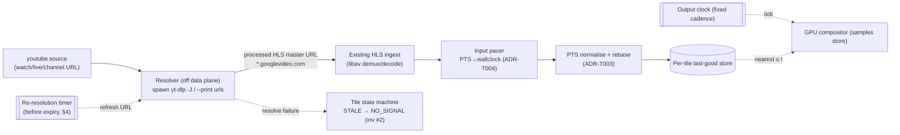

# YouTube Live — ingest via an external runtime-discovered resolver

Mosaic can ingest a **live YouTube** stream as a source by treating a YouTube watch/live URL as
something to be **resolved**, not demuxed directly. A new `youtube` source kind runs a small
**resolver** that invokes an external **`yt-dlp`** binary (discovered at runtime, never vendored)
to turn the watch/live URL into a concrete, FFmpeg-readable **HLS master-playlist URL** on
`*.googlevideo.com`. From there the stream flows through Mosaic's **existing HLS ingest path** —
the libav demux/decode worker, the custom HLS **input pacer**, PTS normalisation, jitter buffer,
and supervised reconnect — exactly like any other `hls` source. The only new machinery is the
resolver and a **periodic re-resolution** loop that refreshes the URL before it expires.

> **The governing principle (unchanged):** *the output is driven by a single internal monotonic
> clock; inputs are sampled, never allowed to pace it.* A YouTube source that fails to resolve,
> goes offline, or whose manifest expires degrades **its own tile** (LIVE → STALE → NO_SIGNAL,
> [invariant #2](../architecture/conventions.md#5-canonical-technical-invariants)) and can **never**
> stall, slow, or back-pressure the mosaic ([invariant #1](../architecture/conventions.md#5-canonical-technical-invariants)).
> Resolution and re-resolution happen **off the data plane**.

| | |
|---|---|
| **Crate** | `mosaic-input` (a `youtube` module behind the `youtube` feature) |
| **Cargo feature** | `youtube` (off by default); requires `ffmpeg` (the HLS ingest path it feeds) |
| **External dependency** | `yt-dlp` binary — **operator-installed, runtime-discovered, NOT vendored** (mirrors the NDI runtime-load posture) |
| **Resolved transport** | HLS master playlist (`m3u8_native`) → existing `hls` ingest + input pacer |
| **Key ADR** | [ADR-0015](../decisions/ADR-0015.md) (YouTube live ingest via an external runtime-discovered resolver) — **Proposed** |
| **Related ADRs** | [ADR-T004](../decisions/ADR-T004.md) (HLS pacing), [ADR-T003](../decisions/ADR-T003.md) (PTS normalisation), [ADR-R001](../decisions/ADR-R001.md)/[ADR-R003](../decisions/ADR-R003.md) (continuous output + supervision), [ADR-0012](../decisions/ADR-0012.md) (licensing), [ADR-0008](../decisions/ADR-0008.md) (NDI runtime-load precedent) |
| **Deep briefs** | [Streaming Gotchas §3](../research/streaming-gotchas.md) (HLS pacing), [inputs.md §2.2/§3](inputs.md) (HLS ingest + pacer), [core-engine §9.1](../research/core-engine.md) |

---

## 1. Why YouTube is special (and why a resolver, not a demuxer)

YouTube does **not** publish a stable manifest URL. A live broadcast page (`https://www.youtube.com/watch?v=…`,
`https://www.youtube.com/live/…`, or a channel `…/live` URL) is an HTML/JS application; the playable
media lives behind YouTube's private **InnerTube `player` API**. To obtain a media URL a client must:

1. POST to `https://www.youtube.com/youtubei/v1/player` with a JSON `context.client` block
   identifying a specific "player client" (e.g. `web_safari`, `android_vr`, `ios`, `tv`), and read
   the JSON `player_response`.
2. Read `player_response.streamingData.hlsManifestUrl` (and/or `dashManifestUrl`) for live, plus
   `videoDetails.isLive` / `isLiveContent` / `isUpcoming` / `isPostLiveDvr` to classify the stream.
3. **Mutate the manifest URL before it is fetchable**: solve the JavaScript **`n`-signature
   challenge** embedded in the URL path and rewrite it, and (where required) append a **GVS PO
   token** path segment. The emitted URL is the *processed*, ready-to-fetch URL — a caller must use
   the resolver's output, not reconstruct `streamingData` itself.

This is a large, **fragile, frequently-changing** surface. YouTube rotates the player JS, the n-sig
algorithm, client requirements, and PO-token policy on no fixed schedule; an extraction approach that
worked last month can break this week. Re-implementing it inside Mosaic would put a brittle,
high-maintenance scraper on the critical path of a product whose entire premise is *bulletproof
continuous output*. The pragmatic, well-trodden answer — used by Streamlink, OBS plugins, and
countless media tools — is to delegate extraction to **`yt-dlp`**, the de-facto reference
implementation that the open-source community keeps current, and consume only its **output**.

> Sources for the extraction flow: yt-dlp YouTube extractor
> [`yt_dlp/extractor/youtube/_video.py`](https://raw.githubusercontent.com/yt-dlp/yt-dlp/master/yt_dlp/extractor/youtube/_video.py)
> (`streamingData.hlsManifestUrl` / `dashManifestUrl`; `live_status` derivation from `videoDetails`;
> `n`-sig + PO-token URL mutation) and
> [`yt_dlp/extractor/youtube/_base.py`](https://raw.githubusercontent.com/yt-dlp/yt-dlp/master/yt_dlp/extractor/youtube/_base.py)
> (`INNERTUBE_CLIENTS`, default clients, GVS PO-token policy). Independently corroborated by
> Streamlink's plugin
> [`src/streamlink/plugins/youtube.py`](https://raw.githubusercontent.com/streamlink/streamlink/master/src/streamlink/plugins/youtube.py)
> (POST `youtubei/v1/player`, read `streamingData.hlsManifestUrl`, detect live via
> `videoDetails.isLive`). *Fetched 2026-06; this is an actively-moving target — re-verify line
> references against current `master` before relying on them.*

---

## 2. Where it fits in Mosaic

### 2.1 A new `youtube` source kind

`youtube` joins the canonical, adjacently-tagged ([`#[serde(tag="kind")]`](../architecture/conventions.md#9-naming--style))
source union alongside `rtsp · hls · ts · srt · rtmp · ndi · file · test` (see [inputs.md §2](inputs.md)).
It is a **thin wrapper over `hls`**: the resolver produces an HLS URL, and the rest of the per-source
pipeline is the existing HLS path verbatim. Binding is by **URL** (the YouTube watch/live/channel
URL), not by a manifest the operator hand-copies — copied URLs expire (see [§4](#4-url-expiry--re-resolution)).

```toml
[[cells]]
area = "small1"
fit  = "contain"
[cells.source]
kind     = "youtube"
url      = "https://www.youtube.com/watch?v=…"   # watch | /live/… | channel …/live
fallback = "offline_card"

[cells.source.youtube]
# Resolver behaviour (all optional; sensible defaults shown)
player_client   = "web_safari"   # pinned default; see §5 (avoid "ios" for live HLS)
prefer          = "hls"          # hls (live edge, default) | dash
reresolve_lead_s = 900           # re-resolve this many seconds before the URL's expiry (§4)
yt_dlp_path     = "yt-dlp"       # binary name/path; resolved on PATH if unset (§6)
cookies_ref     = "${secret:youtube_cookies}"   # optional, for age/member-gated (§7)
extractor_args  = []             # optional pass-through to yt-dlp --extractor-args

# The resolved HLS feed then uses the standard hls/timeouts/jitter/reconnect/resilience
# blocks documented in inputs.md §9 (they apply to the resolved stream unchanged).
[cells.source.hls]
pace_to_wallclock = true         # invariant #4 — the single most important HLS knob
live_start_index  = -3
```

### 2.2 Data flow



The resolver and the re-resolution timer run as **Tokio tasks on the control/IO plane** (the
subprocess spawn, JSON parse, and timer are async, off the dedicated data-plane threads — consistent
with [ADR-0009](../decisions/ADR-0009.md)). They hand a plain URL string to the existing HLS ingest
actor; nothing about resolution touches the compositor or the output clock.

### 2.3 yt-dlp as an OPTIONAL runtime dependency (the NDI precedent)

`yt-dlp` is **not vendored, not linked, and not built into Mosaic.** It is an external executable the
operator installs and Mosaic discovers at runtime — directly mirroring the
[NDI runtime-load posture](ndi.md#2-the-feature-gated--runtime-load-model):

- The **default build never contains or requires `yt-dlp`.** The `youtube` feature is off by default.
- Even in a `youtube`-enabled build, the capability is **probed at runtime**: Mosaic resolves the
  binary on `PATH` (or `youtube.yt_dlp_path`), checks `yt-dlp --version`, and surfaces the result
  through the same `CapabilityReport` gate used everywhere else ([ADR-M007](../decisions/ADR-M007.md)).
  If the binary is absent, the `youtube` capability is reported **unavailable** — never crashed-on —
  and the UI/validator does not offer `youtube` sources.
- The operator owns the binary's lifecycle: installation, **keeping it current** (see [§5](#5-anti-bot-po-tokens-n-sig--operational-fragility)),
  and any cookies/PO-token configuration.

> **Why this matters for licensing:** Mosaic invokes `yt-dlp` as a **separate out-of-process
> subprocess** — it does not link, embed, or import `yt-dlp`'s code. `yt-dlp` is released into the
> **public domain (the Unlicense)**, so even the source imposes no copyleft/linking obligation; the
> subprocess boundary makes the question moot regardless. The default Mosaic build stays
> **LGPL-clean and dependency-free** ([ADR-0012](../decisions/ADR-0012.md)). Source: yt-dlp `LICENSE`
> (Unlicense — "free and unencumbered software released into the public domain", unlicense.org).
> Caveat: a self-contained PyInstaller-bundled `yt-dlp` release packages its own dependencies under
> their respective licenses; an operator who *redistributes* a bundled binary should review those —
> but Mosaic neither ships nor bundles it.

---

## 3. The resolver interface (yt-dlp CLI/JSON)

The resolver invokes `yt-dlp` and reads structured output. The **recommended** interface is the JSON
info-dict, which carries everything the resolver needs to choose a format, detect live status, and
schedule re-resolution.

| Need | yt-dlp invocation | What is read |
|------|-------------------|--------------|
| **Rich resolution (recommended)** | `yt-dlp -J <URL>` (`--dump-single-json`) | Single JSON; top-level `live_status` / `is_live`; per-format `url`, `manifest_url`, `protocol` (`m3u8_native` / `http_dash_segments` / `https`), `format_id`, `ext`, `vcodec`/`acodec`, `height`/`fps`, `tbr` |
| **Quick concrete URL** | `yt-dlp -f best -g <URL>` | Prints the processed media URL(s). `-g`/`--get-url` is now a deprecated alias for `--print urls`; prefer `--print` / `-J` |
| **Live classification** | (from `-J`) | `live_status ∈ {is_live, post_live, is_upcoming, was_live, not_live}` — accept only `is_live` for a live tile |
| **Scheduled streams** | `yt-dlp --wait-for-video MIN[-MAX] …` | Wait for an `is_upcoming` stream to go live (use sparingly — it blocks; better to poll + re-resolve, see [§4](#4-url-expiry--re-resolution)) |

Key resolver rules, derived from yt-dlp's behaviour:

- **Use the processed URL yt-dlp emits — do not reconstruct `streamingData`.** yt-dlp solves the
  `n`-sig and appends any PO-token path segment; its emitted manifest URL is ready to fetch, the raw
  `streamingData` URL is not.
- **Prefer the live HLS master manifest.** For a true "join the live edge now" tile, select an HLS
  format (`protocol == "m3u8_native"`); its `manifest_url` is the master playlist Mosaic feeds to
  libav. The default `web_safari` client returns pre-merged video+audio HLS renditions
  (144p/240p/360p/720p/1080p), so a single master URL covers the standard ladder.
- **Do NOT pass `--live-from-start`.** That flag (experimental; YouTube/Twitch/TVer only) downloads
  from the broadcast's beginning using DASH/adaptive `is_from_start` processing — the opposite of
  Mosaic's live-edge use case. Omit it to tail the live edge in real time.
- **DASH is the fallback** (`prefer = "dash"`): yt-dlp can emit a DASH MPD (`protocol ==
  "http_dash_segments"`) that libav can also read, but for live the HLS master from `web_safari` is
  the simpler, PO-token-free path (see [§5](#5-anti-bot-po-tokens-n-sig--operational-fragility)).

> Sources: yt-dlp README (options `-j`/`-J`, deprecated `-g → --print urls`, `--live-from-start`,
> `--wait-for-video`, default clients `android_vr,web_safari`); `_video.py`
> (`_extract_m3u8_formats_and_subtitles(...)` for HLS, `_extract_mpd_formats_and_subtitles(...)` for
> DASH, `_needs_live_processing` gating on `--live-from-start`). *yt-dlp README/man-page, fetched
> 2026-06.*

---

## 4. URL expiry & re-resolution (load-bearing)

Resolved `googlevideo.com` / `manifestN.googlevideo.com` URLs **expire**. They carry an `expire`
query parameter — a **Unix timestamp** (seconds since 1970-01-01) — after which the CDN returns
**HTTP 403 Forbidden**. For **YouTube live HLS specifically the TTL is roughly six hours**: a
long-running ingest that does nothing will see its segments start 403-ing at the expiry boundary and
its tile go dark.

Therefore the `youtube` source **must re-resolve before expiry**, with the refresh handled entirely
off the data plane:

- **Read the deadline, don't guess it.** Parse the `expire` value from the resolved URL (and/or trust
  yt-dlp's metadata) and schedule a re-resolution **`reresolve_lead_s` seconds before** it (default
  900 s / 15 min lead inside a ~6 h window). Never rely on a fixed wall-clock interval alone.
- **Make-before-break.** Resolve the *new* URL, validate it, then hand it to the HLS ingest actor as
  a seamless source swap (a Class-1-style hot change at a tile boundary,
  [ADR-R004](../decisions/ADR-R004.md)/[ADR-M005](../decisions/ADR-M005.md)) so the tile does not
  blink. The output clock is never involved; at worst the tile briefly holds last-good.
- **Belt-and-braces.** Also treat a sustained **403/segment-fetch-failure** burst from the HLS
  reader as a trigger to re-resolve immediately, in case the TTL estimate was wrong or YouTube
  rotated the URL early. The existing HLS `reconnect` machinery ([inputs.md §6](inputs.md))
  brackets the gap.
- **Bounded retries.** Re-resolution failures back off (reuse the source `reconnect` policy) and,
  while the resolver is failing, the tile rides **LIVE → STALE → NO_SIGNAL** like any other dead
  source — the mosaic keeps emitting.

> Sources: Streamlink issue
> [#3995](https://github.com/streamlink/streamlink/issues/3995) (live HLS playlist with
> `expire/1630825855/` 403-ing after ~5 h 59 m; fix is to re-fetch the manifest for fresh URLs; opened
> 2021-09-05); VideoHelp forum [thread 372536](https://forum.videohelp.com/threads/372536) (`expire`
> = "number in seconds from the 1st of January 1970"); yt-dlp issues
> [#10469](https://github.com/yt-dlp/yt-dlp/issues/10469) /
> [#14936](https://github.com/yt-dlp/yt-dlp/issues/14936) (403 on expired/unsigned googlevideo URLs).
> *The ~6 h figure is the live-HLS case reported in 2021 and is approximate — treat the parsed
> `expire` value as authoritative, not the constant.*

---

## 5. Anti-bot, PO tokens, n-sig & operational fragility

This is the part operators must understand: **extraction can fail at any time**, because YouTube
actively changes the player surface and adds anti-automation friction.

- **The player JS / n-sig changes frequently.** yt-dlp solves an embedded JavaScript `n`-signature
  challenge to make URLs fetchable; when YouTube rotates the algorithm, an **out-of-date `yt-dlp`
  breaks** until updated. Operational rule: **keep `yt-dlp` current** (it releases often). Mosaic
  should record the resolver's `--version` and surface a "resolver out of date / extraction failing"
  alarm rather than letting a tile silently sit at NO_SIGNAL.
- **PO tokens (Proof-of-Origin).** Many VOD `https`/DASH formats now require a **GVS PO token**, which
  can need an external token provider. **For LIVE HLS this is the good news:** per the yt-dlp
  [PO Token Guide](https://github.com/yt-dlp/yt-dlp/wiki/PO-Token-Guide) (last edited 2026-03-10),
  *"HLS live streams do not require a PO Token (excluding the `ios` client)."* The GVS PO-token policy
  for HLS on `web_safari` / `tv_simply` is `required = false, recommended = true`. So a **live YouTube
  HLS master from the default `web_safari` client is typically obtainable and fetchable without a PO
  token** — which is precisely why Mosaic should:
  - **Pin `player_client = "web_safari"`** (a current default client that yields PO-token-free live
    HLS), and
  - **avoid the `ios` client** for live HLS — `ios` is the documented exception (`required = true`,
    with a comment that HLS livestreams require a PO token ~30 s in).
- **A JavaScript runtime helps.** yt-dlp's default clients are `android_vr,web_safari`, but if no JS
  engine is available it falls back to `android_vr` only; for reliable n-sig solving, a JS runtime
  (e.g. Deno, as yt-dlp recommends) should be available on the host alongside `yt-dlp`.
- **Cookies / authentication.** Age-gated, member-only, or region-locked live streams may require
  cookies. Support an optional `youtube.cookies_ref` resolved from the **secret store** (never
  inlined; [ADR-M006](../decisions/ADR-M006.md)) and passed to `yt-dlp --cookies`. Cookies are
  sensitive credentials — handle them as secrets and scope them tightly.
- **Implication for Mosaic's resilience contract:** because extraction is best-effort, the resolver
  is treated as a **fallible supervised subtask**. Its failure is *expected and handled*: the tile
  degrades, an operator-visible alarm fires, and the output never falters. The resolver must have a
  hard timeout and run under the standard supervision/backoff
  ([ADR-R003](../decisions/ADR-R003.md)) — a hung `yt-dlp` is killed, not awaited.

> Sources: yt-dlp [PO Token Guide](https://github.com/yt-dlp/yt-dlp/wiki/PO-Token-Guide) (edited
> 2026-03-10); `_base.py` `INNERTUBE_CLIENTS` / `GVS_PO_TOKEN_POLICY` (web_safari live-HLS PO-token
> `required=false`; ios exception); yt-dlp README EXTRACTOR ARGUMENTS > youtube (default
> `android_vr,web_safari`; "If no JavaScript runtime/engine is available, then only `android_vr` is
> used"). *PO-token policy and client behaviour change often — re-check the wiki and `_base.py`.*

---

## 6. Runtime discovery & invocation hardening

- **Discovery:** resolve `youtube.yt_dlp_path` if set, else find `yt-dlp` on `PATH`. Probe with
  `yt-dlp --version`; cache the version string; report capability availability through
  `CapabilityReport`.
- **No shell.** Spawn `yt-dlp` with an argument vector (no shell interpolation). The YouTube URL is
  validated/normalised before being passed as a single argument — never concatenated into a command
  line.
- **Hard timeouts + supervision.** Every resolve has a deadline; a slow/hung process is killed. The
  resolver task runs under the engine's supervision tree with bounded backoff
  ([ADR-R003](../decisions/ADR-R003.md)); it is incapable of back-pressuring the engine
  ([invariant #10](../architecture/conventions.md#5-canonical-technical-invariants)).
- **Captured, redacted logs.** `yt-dlp` stderr is captured into `tracing` for diagnosis (extraction
  warnings, "Sign in to confirm you're not a bot", n-sig failures), with any cookie/secret material
  redacted.
- **Pinned, current binary.** Surface the resolver version in telemetry and the UI; recommend
  operators automate `yt-dlp` updates.

---

## 7. Legal / Terms-of-Service note (operator responsibility)

Ingesting YouTube content can implicate **YouTube's Terms of Service**, the content owner's rights,
and local law. Mosaic provides the *mechanism*; **using it lawfully is the operator's
responsibility.**

- Mosaic does **not** bundle, distribute, or endorse circumventing access controls. The `youtube`
  feature is off by default and the resolver binary is operator-supplied.
- The management UI/docs should carry a clear notice when the `youtube` source is configured:
  *the operator is responsible for ensuring they have the right to ingest and redistribute the
  source, and for compliance with YouTube's Terms of Service and applicable law.* This mirrors how
  Mosaic surfaces the [NDI license/attribution obligations](ndi.md#7-licensing-redistribution--attribution-must-read)
  — an explicit, operator-facing acknowledgement rather than a buried footnote.
- This is vendor-neutral plumbing built on a public-domain tool over an open(-ish) HLS manifest; it
  copies no proprietary feature or trademarked design ([CODE_OF_CONDUCT.md](../../CODE_OF_CONDUCT.md)).

---

## 8. Appendix — Rust-native alternatives (and why the subprocess wins, for now)

A pure-Rust resolver would avoid the external-binary dependency. The trade-offs:

| Approach | Pros | Cons |
|---|---|---|
| **External `yt-dlp` subprocess** (chosen) | Reference implementation; community keeps n-sig/PO-token/player-client current; public-domain; zero linking obligation; isolates the fragile scraper in another process | External binary the operator must install + keep updated; per-resolve process spawn; output-format coupling |
| **`rustypipe`** (Rust YouTube client) | Pure Rust, no external binary, no subprocess | Smaller maintainer base than yt-dlp; must independently track YouTube's player/n-sig/PO-token changes; if it lags, **every** YouTube tile breaks in-process (the fragility moves onto Mosaic's release cadence); live-HLS coverage + PO-token handling must be verified |
| **Direct InnerTube re-implementation in Mosaic** | No third-party extractor at all | We would own the entire n-sig solver, PO-token logic, and per-client quirks — the single highest-maintenance, most-breakage-prone code in the product, on a *bulletproof-output* engine. Strongly discouraged |
| **Vendoring `yt-dlp`'s Python** | Pinned version | Pulls a Python runtime + its dependency licenses into the product; defeats the LGPL-clean default; still needs updating for n-sig churn |

**Recommendation:** ship the **external-subprocess resolver** first (lowest risk, isolates the
fragility, licensing-clean). Keep a **Rust-native resolver (e.g. `rustypipe`) as a future
alternative backend** behind the same `youtube` source kind — a `youtube.resolver = yt_dlp |
rustypipe` knob — so Mosaic can adopt a pure-Rust path once it is proven to track YouTube's changes
as reliably as yt-dlp. The decision is recorded in [ADR-0015](../decisions/ADR-0015.md).

---

## 9. Open questions & risks

- **Extraction breakage cadence.** How aggressively must operators update `yt-dlp`? Needs a
  documented "supported `yt-dlp` minimum version" and a CI/runtime check that warns on staleness.
- **JS runtime requirement.** Should Mosaic detect/recommend (or, in container images, ship) a JS
  engine (Deno) for reliable n-sig solving, given that `web_safari` n-sig solving wants one?
- **Exact live-HLS expiry window.** The ~6 h figure is a 2021 data point; the implementation must
  parse the real `expire` timestamp and treat the constant only as an upper-bound guard.
- **PO-token drift.** PO-token policy could tighten for live HLS in future; the resolver should be
  ready to plug in a PO-token provider (matching yt-dlp's mechanism) without re-architecting.
- **Resolved-format selection.** Default to the full live HLS master (let the HLS ABR logic pick), or
  pre-select a rendition near the tile's display size to honour decode-at-display-resolution
  ([ADR-E001](../decisions/ADR-E001.md))? Likely: prefer a master and let the existing
  rendition-selection logic ([inputs.md §7](inputs.md)) choose.
- **Audio.** `web_safari` live HLS is pre-merged video+audio; confirm the audio track rebases onto
  the program clock through the standard path with no YouTube-specific handling.
- **Container packaging.** Whether the `youtube` Docker image variant ships `yt-dlp` + a JS runtime
  (operator-updatable) the way the `ndi` variant ships the NDI runtime.

---

## 10. Phased implementation outline

This is **backlog**, building on **M4 (Full I/O)** — it depends on the HLS ingest path, input pacer,
and supervised reconnect landing first. Suggested phases:

1. **P0 — Resolver core (pure, testable).** A `youtube` module in `mosaic-input` behind the
   `youtube` feature: spawn `yt-dlp -J`, parse the info-dict, classify `live_status`, extract the
   HLS `manifest_url` and the `expire` deadline. Unit/property tests over **recorded yt-dlp JSON
   fixtures** (no network) — exactly the pure-model-first pattern used across the build-out.
2. **P1 — Capability gate + config.** Runtime discovery (`--version`), `CapabilityReport` entry, the
   `youtube` source kind + config schema, secret-ref cookies, validator integration.
3. **P2 — Wire to HLS ingest.** Feed the resolved URL into the existing `hls` ingest actor + input
   pacer; verify the standard tile state machine and reconnect bracket resolution failures.
4. **P3 — Re-resolution loop.** Parse `expire`, schedule lead-time refresh, make-before-break source
   swap, 403-triggered immediate re-resolve, bounded backoff, staleness/breakage alarms.
5. **P4 — Hardening + ops.** Hung-process kill, redacted log capture, JS-runtime detection, operator
   ToS acknowledgement in the UI, telemetry (resolver version, resolve latency, re-resolve count,
   extraction-failure rate), soak test across a multi-hour live stream spanning ≥1 expiry boundary.
6. **P5 (later) — Rust-native backend.** Evaluate `rustypipe` behind `youtube.resolver`; adopt only
   if it tracks YouTube changes as reliably as yt-dlp.

---

## 11. Related decisions & briefs

- [ADR-0015 — YouTube live ingest via an external runtime-discovered resolver (yt-dlp)](../decisions/ADR-0015.md) *(Proposed)*
- [ADR-T004 — HLS ingest pacing: custom PTS→wall-clock pacer, not `-re`](../decisions/ADR-T004.md)
- [ADR-T003 — Per-input timestamp normalisation](../decisions/ADR-T003.md)
- [ADR-R001 — Continuous-output guarantee](../decisions/ADR-R001.md) ·
  [ADR-R003 — Supervision, backoff, circuit breakers, watchdogs, bounded memory](../decisions/ADR-R003.md)
- [ADR-R004 — Seamless edits via atomic scene-graph swap](../decisions/ADR-R004.md) ·
  [ADR-M005 — Live-apply vs needs-reset semantics](../decisions/ADR-M005.md)
- [ADR-M007 — CapabilityReport as the single machine-readable gate](../decisions/ADR-M007.md) ·
  [ADR-M006 — Config-as-code with reference-only secrets](../decisions/ADR-M006.md)
- [ADR-0008 — NDI runtime-load + licensing precedent](../decisions/ADR-0008.md) ·
  [ADR-0012 — LGPL-clean default build; opt-in escalations](../decisions/ADR-0012.md) ·
  [ADR-0009 — Hybrid concurrency: data plane vs control/IO plane](../decisions/ADR-0009.md)
- I/O docs: [Inputs §2.2 (HLS) / §3 (input pacer) / §6 (reconnect)](inputs.md) · [NDI (runtime-load precedent)](ndi.md)
- Deep briefs: [Streaming Gotchas §3 (HLS pacing)](../research/streaming-gotchas.md) · [Core Engine §9.1 (ingest)](../research/core-engine.md)
- Canonical naming/features/licensing: [conventions.md](../architecture/conventions.md)
</content>
</invoke>
