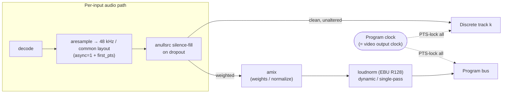

# Audio, Subtitles & Overlays

How Mosaic handles the *secondary essences* that ride alongside the composited
video canvas: **audio** (discrete per-input tracks + a program bus + EBU R128
metering), **subtitles/captions** (ingest, burn-in, and discrete passthrough),
and **overlays** (labels, clocks, logos, meters, alert cards composited on the
GPU).

These features are subordinate to one rule that governs the whole engine — the
**output-clock invariant**: at every tick the output stage emits exactly one
valid, correctly-timestamped frame *and the matching number of audio samples per
track*, forever, independent of any input. Everything below is designed so that
audio, subtitles, and overlays **never** stall, gap, or back-pressure that
output clock.

> **Deep brief:** [`../research/resilience-and-av.md`](../research/resilience-and-av.md) is the authoritative source for the design and the verification corrections. This page is the skimmable map; prefer the brief for depth.
>
> **Decisions:** [ADR-R005](../decisions/ADR-R005.md) (audio routing + capability matrix), [ADR-R006](../decisions/ADR-R006.md) (metering), [ADR-R007](../decisions/ADR-R007.md) (subtitles), [ADR-R008](../decisions/ADR-R008.md) (overlays). The output-clock and pinning rules that bound all three live in [ADR-R001](../decisions/ADR-R001.md) and [ADR-R004](../decisions/ADR-R004.md).

---

## Crate ownership

Crate responsibilities are defined in the canonical
[crate map](../architecture/conventions.md) (§3); the relevant ones here:

| Concern | Crate | Optional features |
|---|---|---|
| Per-input audio decode/resample/mix/route, program bus, EBU R128 metering | `mosaic-audio` | `ffmpeg` |
| Subtitle ingest/render (libass burn-in) + overlay layers + text rendering | `mosaic-overlay` | `libass` |
| GPU compositing of overlays/cards into the canvas | `mosaic-compositor` | `wgpu` (default), `metal`, `cuda` |
| Per-output discrete-track muxing & capability matrix | `mosaic-output` | `ffmpeg`, `ndi` |
| The output/program clock that paces audio sample emission | `mosaic-engine` | — |

The audio program clock is the **same monotonic source** as the video output
clock (see the [unified timing model](../architecture/conventions.md), invariant 3).

---

## 1. Audio

### 1.1 Routing model

Each input is decoded, resampled to a common base (48 kHz / common layout) and
fanned out to **two destinations**:

1. A **clean discrete per-input track** — passed through unaltered (no gain, no
   normalization) to preserve authenticity.
2. The **program bus** — mixed and loudness-normalized for the headline mix.



Load-bearing details:

- **Everything is PTS-locked to the program clock.** On total input loss the
  silence-fill source still emits the *correct number* of (silent / last-good)
  tracks, so discrete tracks never vanish from the mux — this is what keeps the
  audio side of the output-clock invariant true.
- **Discrete tracks are decode → re-encode normalized, not bitstream
  passthrough.** Raw passthrough breaks the instant an input changes codec
  mid-stream; re-encoding to a pinned track codec keeps the mux continuous.
- **Program-bus loudness** uses `loudnorm` in live (dynamic / single-pass) mode.
  Targets are configurable, e.g. **−23 LUFS** (broadcast) or **−16 LUFS** (web),
  true-peak **−1.5 dBTP**. Live tolerance is **±1 LU** (vs ±0.2 LU for files);
  the −70 LUFS gate correctly excludes a silent/lost input from the measurement.
- **Normalization is program-bus only.** Discrete tracks stay unaltered — this
  is the authenticity guarantee.

### 1.2 Sync, drift, and missing audio

| Concern | Mechanism |
|---|---|
| Per-input clock vs program clock | `aresample async=1` (**off by default — must enable**) + `first_pts`; long-term drift absorbed by adaptive resampling. |
| Missing / dropped audio | `anullsrc` silence, PTS-locked, so the track never gaps. |
| Mid-stream codec change on a source | Discrete track is re-encoded, not passed through, so the change is absorbed inside the input path. |

### 1.3 Routing data model (API / UI)

A single `AudioRoute` per mapping, validated against the selected output's
capability matrix **at config time**:

```
AudioRoute {
  input_id,
  source_channel_selection,
  target_track_index | PID | rendition,   // depends on output kind
  language, title,
  include_in_program_bus,                  // bool
  gain, mute
}
```

### 1.4 Output discrete-audio capability matrix

Whether *N discrete selectable tracks* survive to the consumer depends entirely
on the output transport. This matrix is a **first-class, machine-readable data
structure** (`OutputCapability`) that gates the UI/validator — not scattered
conditionals. See [ADR-R005](../decisions/ADR-R005.md).

| Output | Discrete tracks? | Mechanism / limit | Notes |
|---|---|---|---|
| **MPEG-TS** | **Yes, N** (best general carrier) | One audio elementary stream per PID; `-streamid` (base-10!), per-track `language`/`title` | No practical FFmpeg cap. Primary multitrack target. |
| **SRT** | Yes, N | Carries MPEG-TS → inherits N PIDs | **Receiver-dependent**: many decoders select only the first PID. |
| **RIST** | Yes, N | Carries MPEG-TS | Same receiver caveat. |
| **RTSP / SDP** | **Yes, N simultaneous** | Multiple `m=audio` lines, each its own RTP subsession | Client must `SETUP` each subsession. |
| **HLS / LL-HLS** | **Yes, N — but SELECT-one-of-N** | `EXT-X-MEDIA TYPE=AUDIO` renditions by `GROUP-ID` | Player plays one at a time → UI = track *selector*, not simultaneous monitor. |
| **DASH** | Yes, N — select-one | Audio AdaptationSets | As HLS. |
| **NDI** | **No discrete tracks — channels only** | ONE audio stream/source; up to 255 ch (Opus) / unlimited (PCM); **AAC capped at 2 ch**; layout is **planar (FLTP)** | Per-input audio = channel-map (input *k* → ch 2k, 2k+1) **or** emit N NDI senders. |
| **RTMP / FLV** | **Tiered** | Legacy: **1 track only**. Enhanced-RTMP v2 + FFmpeg `flvenc`: **N tracks via `audioTrackId` / `audioTrackIdInfoMap`** | **Real constraint is endpoint capability.** Twitch ≤2 tracks; YouTube ignores multitrack; IVS multitrack = video. |
| **MP4 / MKV** | Yes, N — select-one | Multiple tracks ("secondary audio program") | "Mark all default" trick is non-standard; VOD/archive only. |

**High-risk corrections (do not regress these):**

- **NDI cannot carry N selectable tracks.** Use a channel-map or multiple NDI
  senders; the layout is planar FLTP (verification refuted "interleaved / N
  tracks").
- **RTMP is *conditionally* multitrack** via Enhanced-RTMP — do **not** hardcode
  "RTMP = single track impossible". Gate the multitrack path on *detected
  endpoint capability* and surface degradation in the UI. **Degrade explicitly
  to the mixed bus; never silently drop tracks.**

---

## 2. Audio metering (EBU R128)

Metering is **per-input and per-output-track, read-only, and non-blocking** — it
must never run on the media/compositor/encoder thread and never apply
back-pressure. See [ADR-R006](../decisions/ADR-R006.md).

- **Engine:** the pure-Rust [`ebur128`](../research/resilience-and-av.md) crate,
  one `EbuR128` instance per track. Reports M/S/I LUFS, LRA, sample-peak, and
  true-peak (dBTP); BS.1770-4/-5 + EBU Tech 3341/3342 compliant.
- **Tap & isolate:** audio is taken via a bounded lock-free SPSC ring
  (drop-oldest) per track; DSP runs on a **separate thread**. Enable FTZ/DAZ
  (flush denormals) on those threads.

| Cadence | Rate | Metrics | Where ballistics live |
|---|---|---|---|
| **Fast** | video frame rate | sample-peak + ~50 ms RMS | client/renderer (PPM-style: fast attack, slow decay, peak-hold) |
| **Slow** | ~10 Hz | M / S / I / LRA / dBTP telemetry | UI; program-bus compliance |

**True-peak is the expensive metric** (4× oversampling FIR, ~2.5–3× costlier
than sample-peak, far worse on ARM/Apple Silicon) → **cap true-peak to tracks
that actually display dBTP.**

**Mid-stream SR/channel change (corrected):**
`ebur128::change_parameters(channels, rate)` re-inits the filters/resampler/peak
state but **preserves** the I/LRA integration history — it does **not** restart
it.

- Want continuity across a transient input reconfig → `change_parameters`
  (note: retained gating-block energies were computed under the old SR/layout —
  a subtle averaging hazard).
- Want a fresh window → call `reset()` (or construct a new instance).
- Returns: `NoMem` for `channels == 0` / out-of-range rate; `Ok(())` no-op if
  unchanged.

**Wire to browser:** a single multiplexed WebSocket at **10–25 Hz**, compact
binary payload (peak, RMS, M, S, I, LRA, dBTP, clip/overflow flags per
tile/track). **Numeric only — never audio.** This conflated high-rate stream
rides the isolated realtime layer ([conventions §6](../architecture/conventions.md)),
so it can never back-pressure the engine.

---

## 3. Subtitles & captions

See [ADR-R007](../decisions/ADR-R007.md). Two independent capabilities: **ingest
→ burn-in** (rasterize into the picture) and **discrete passthrough** (carry as
selectable tracks where the output supports it).

### 3.1 Ingest

| Source | How it is read |
|---|---|
| **CEA-608 / 708** | NOT a mappable stream — rides as `AVFrame` side data `AV_FRAME_DATA_A53_CC` (+ video SEI). Read via decoded-frame side data, the `movie=...[out+subcc]` lavfi trick, or CCExtractor (robust; 708 weak in some paths). |
| **DVB-sub (bitmap)** | Decode per PID; passthrough bit-exact when format matches. |
| **DVB teletext** | libzvbi; one PID multiplexes multiple pages → handle **page selection**, not just PID. |
| **WebVTT / SRT / ASS / mov_text** | Native libav decoders. |

### 3.2 Burn-in (render)

Everything is normalized to **ASS internally** and rasterized with **libass**
(CPU-only; there is no GPU libass renderer) into sparse alpha-coverage bitmaps.

- **Off the hot path (load-bearing):** subtitle decode + libass run in dedicated
  threads with a lock-free *latest-rendered-overlay* handoff. The compositor
  samples per frame and holds/drops if late. **Never** put the libavfilter
  `subtitles`/`ass` filter in the live output path — it is synchronous and can
  stall.
- **Build requirements:** libass ≥ 0.17 with libunibreak + HarfBuzz + FriBidi
  (Unicode wrap / CJK / RTL). `libass-rs`/`libass-sys` are thin — expect to
  vendor/fork. `ass-rs` (pure Rust) is a candidate to drop the C dep but must be
  fidelity-validated first.
- **Alpha:** libass output is **already premultiplied** (`r,g,b ≤ alpha`) →
  upload as-is and blend with premultiplied factors; do **not** premultiply
  again (see §4 alpha rules).

### 3.3 Discrete subtitle passthrough — capability matrix

| Output | Discrete subtitle tracks? | Mechanism |
|---|---|---|
| **HLS / LL-HLS** | **Yes, N** | Segmented WebVTT renditions (`EXT-X-MEDIA TYPE=SUBTITLES`) **and/or** in-bitstream 608/708 (`TYPE=CLOSED-CAPTIONS` + `INSTREAM-ID`). Ship both. `X-TIMESTAMP-MAP` must use the **90 kHz** MPEGTS timescale, recomputed per segment (fMP4 PTS~0 vs TS PTS~10s = classic ~10 s desync). |
| **MPEG-TS / SRT / RIST** | **Yes, N** | One DVB-sub PID per language + teletext PIDs + 608/708 in video SEI (via `A53_CC` side data). |
| **RTMP / FLV** | **No** | Only single, lossy 608 via `onCaptionInfo`; E-RTMP multitrack is audio+video only → **burn-in only** (or one 608 service). |
| **NDI** | **Effectively no** | No selectable subtitle track in the SDK; FFmpeg's NDI muxer sets `subtitle_codec = NONE` → passthrough via FFmpeg impossible. **Burn-in default**; CEA-708-over-NDI-metadata only as an advanced, direct-SDK, best-effort feature with no interop guarantee. |

### 3.4 608/708 survival through re-render

Because the mosaic is fully re-rendered, in-bitstream captions are preserved by
**attaching `AV_FRAME_DATA_A53_CC` side data to the output canvas frames**;
libx264/x265 / NVENC / QSV / VAAPI / VideoToolbox then emit it as SEI (via
`ff_alloc_a53_sei`). This also drives HLS `CLOSED-CAPTIONS` signalling for free.

> **FFmpeg cannot rasterize text into DVB-sub.** Text → DVB-sub output requires
> feeding libass bitmaps to the dvbsub encoder.

---

## 4. Overlays

Labels, clocks, logos, level meters, lower-thirds, and alert cards composited on
the GPU. See [ADR-R008](../decisions/ADR-R008.md).

### 4.1 Layer model

An OBS-style, serializable, ordered `Layer` stack. The compositor walks it each
frame and blends premultiplied "over":

```
Layer {
  id,
  kind: text | meter | logo | lower_third | clock | alert_card | subtitle,
  target: full-canvas | tile N,
  rect / transform, z, opacity, blend_mode, clip,
  color_space, data_binding, visibility
}
```

Per-tile layers re-bind **atomically with the tile** during live layout changes,
in the same frame (a Class-1 seamless edit — see
[ADR-R004](../decisions/ADR-R004.md)).

### 4.2 Rendering stack

| Element | Renderer |
|---|---|
| Text + small images | `cosmic-text` + `glyphon` on wgpu (CPU shaping/raster cached in an `etagere` atlas; `CustomGlyph` also draws arbitrary RGBA for logos/icons/meter caps). One `SwashCache`; reuse `Buffer`s; re-shape only changed strings. |
| Rich vector (rounded cards, gradients, gauges) | `Vello` / `Vello Hybrid` — **alpha and compute-shader-dependent**. |
| **Must-never-fail** (SIGNAL LOST card, per-tile meters) | Hand-written SDF / textured-quad shaders, assets **atlas-resident at startup**. |
| Meters | Levels pushed as small uniforms each frame; bar = scaled quad / SDF rounded rect. **No per-frame bitmap re-upload.** |

### 4.3 Load-bearing correctness rules

- **Premultiplied alpha end-to-end.** wgpu `PREMULTIPLIED_ALPHA_BLENDING` =
  `OVER` (`src = One`, `dst = OneMinusSrcAlpha`) for both color and alpha.
  - **swash / zeno output is straight coverage** → you MUST premultiply
    (`rgb * coverage, coverage`) before atlas upload.
  - **libass output is already premultiplied** → upload as-is.
  - A mismatch produces dark/colored halos on *every* antialiased edge — a
    silent, pervasive bug.
- **Dirty-region / sub-texture uploads are mandatory.** A full 1080p RGBA layer
  is ~8.3 MB/frame (~249 MB/s @30, ~498 @60, ~995 @4K30) and competes with
  decode/encode bandwidth (tight on Apple unified memory). Re-upload only
  animated regions (meter bars, clock seconds, pulsing cards). There is no
  stable wgpu external-texture import → overlay output is a portable
  **premultiplied RGBA atlas + quad list**.
- **Decoupled from input health.** Overlays render purely from local state
  (clock, health flags, cached levels) — **never** from a live decoded input
  frame — so the alert path is drawable even when all inputs *and* the GPU are
  gone. This is what makes the whole-canvas slate + always-ticking clock
  possible during a total blackout (the failure ladder in
  [ADR-R001](../decisions/ADR-R001.md)).
- **Color management:** blend in linear light; per-layer color-space tag;
  convert sRGB overlays → BT.2020 PQ/HLG when the program is HDR, or overlays
  shift color. Follows the engine's [color pipeline order](../architecture/conventions.md)
  (invariant 8).
- **Fallback only:** FFmpeg `drawtext`/`overlay` is used solely in a degraded
  CPU/software path.

---

## 5. Live-reconfiguration classes

Audio/subtitle/overlay edits are classified like every other change
([conventions §5](../architecture/conventions.md), invariant 11;
[ADR-R004](../decisions/ADR-R004.md)). The API surfaces the class **before**
applying.

| Change | Class | Why |
|---|---|---|
| Overlay add/move/restyle; subtitle burn-in on/off + position/style; per-tile meters | **Class-1 (seamless)** | Atomic scene-graph swap at a frame boundary; only the composited picture changes. |
| Program-bus gain/weights/mute; loudnorm target | **Class-1** | Mix-only; track layout unchanged. |
| Audio **track layout** change (count/identity of tracks) | **Class-2** | Pinned for the output session; needs make-before-break parallel-output migration. |
| Subtitle **track-set** change | **Class-2** | Same pinning rule. |

> **The pinning rule:** output geometry, codec, GOP, pixel format, framerate,
> **and audio/subtitle track layout** are pinned for the life of an output
> session. Live edits change only the composited picture and the audio mix —
> this is what makes "never falters" provable.

---

## 6. Management surface

The Web UI / OpenAPI API fully manages all three subsystems (see
[`../research/management-capability-matrix.md`](../research/management-capability-matrix.md)
and the [realtime API brief](../research/realtime-api.md)):

- **Audio routing matrix** — per-input → output-track mapping (PID / rendition /
  NDI channel / RTMP trackId), language, title, include-in-program-bus, gain,
  mute, with a **capability-aware validator** that disables impossible
  selections per output (greys out N-track audio on a legacy-RTMP endpoint,
  shows "channel-map" for NDI) and surfaces explicit degradation.
- **Metering** — live per-tile/per-track meters (peak/RMS/M/S/I/LRA/dBTP),
  program-bus compliance, clip/overflow alerts over the conflated 10–25 Hz
  WebSocket.
- **Subtitles** — per-input ingest source + format, page/language selection
  (teletext), burn-in on/off + per-tile position/style, passthrough track config
  with per-output capability indication.
- **Overlays** — full layer editor (kind, target, transform, z, opacity, blend,
  data binding, color space, visibility); alert-card triggers; clock/label/logo
  config.

---

## Related reading

- [`../research/resilience-and-av.md`](../research/resilience-and-av.md) — full design + verification corrections.
- [`../architecture/conventions.md`](../architecture/conventions.md) — canonical crates, features, invariants, licensing.
- ADRs: [R005](../decisions/ADR-R005.md) · [R006](../decisions/ADR-R006.md) · [R007](../decisions/ADR-R007.md) · [R008](../decisions/ADR-R008.md) · [R001](../decisions/ADR-R001.md) · [R004](../decisions/ADR-R004.md).
