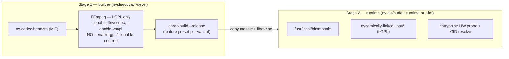

# Containerization

How Mosaic is packaged as a Linux container image: a **multi-stage build** that compiles an
**LGPL-clean FFmpeg** plus the `mosaic` binary, then ships a lean runtime that relies on the
**NVIDIA Container Toolkit** (NVENC/NVDEC) for discrete GPUs and **VAAPI `/dev/dri` passthrough**
for Intel/AMD. The container assets will live under `deploy/` (Dockerfile, compose, entrypoint), added during
implementation; the build itself is described below.

> **macOS does not containerize.** Apple's GPU stack (VideoToolbox/Metal) is unavailable inside
> containers — Docker on macOS runs a Linux VM with no Metal. macOS ships as a **native, signed +
> notarized universal2 binary**, not an image. See [deployment.md](./building.md) and
> [ADR-0011](../decisions/ADR-0011.md).

**Source of truth:** the canonical [conventions](../architecture/conventions.md) §7 (licensing) and
the deep briefs — [core-engine](../research/core-engine.md) §17 (Build & Deployment) and
[efficiency](../research/efficiency.md) §6 (smallest-footprint build). For build *profiles* and
feature flags see [build-and-features.md](./building.md); for the legal model see
[licensing.md](../architecture/conventions.md#7-licensing-model-build-profiles).

---

## 1. Image variants

Two amd64/arm64 image variants, never one mega-image (bloat and conflated driver requirements —
[ADR-0011](../decisions/ADR-0011.md)).

| Variant | Base image | HW path | Arch | GPU libs in image? |
|---------|-----------|---------|------|--------------------|
| **`nvidia`** | `nvidia/cuda:*-runtime` (build on `*-devel`) | NVENC / NVDEC / CUDA | amd64 | **No** — injected by the Container Toolkit at runtime |
| **`generic`** | slim Debian/Ubuntu | VAAPI (Intel/AMD) | amd64 + arm64 | VAAPI userspace drivers only; kernel DRM via `/dev/dri` |

Both link FFmpeg **dynamically** (the LGPL relink right — see §4) and contain only the runtime set:
`libav*`, the custom GPU compositor, and the serving layer. Nothing else
([efficiency](../research/efficiency.md) §6).

---

## 2. Multi-stage build

The goal is to keep the heavy CUDA/FFmpeg toolchain out of the shipped image. Stage 1 is the only
place that needs a compiler and `-devel` base.



Key points (from [core-engine](../research/core-engine.md) §17):

- **Build FFmpeg yourself.** Distro FFmpeg is frequently already `--enable-gpl`/`--enable-nonfree`;
  that would silently poison the artifact's license. Verify with `ffmpeg -buildconf` that there is
  **no** `--enable-gpl`, `--enable-nonfree`, `--enable-libnpp`, or `--enable-cuda-nvcc`.
- **NVENC/NVDEC are LGPL-clean.** They are enabled via `nv-codec-headers` (MIT,
  `--enable-ffnvcodec`) and need **neither** `--enable-gpl` **nor** `--enable-nonfree`. Scaling is
  done in-house / via `scale_cuda` — **never `scale_npp`** (nonfree libnpp).
- **Multi-arch:** build with `docker buildx`; prefer **native runners over QEMU** for the heavy
  FFmpeg compile (QEMU makes the libav build painfully slow).
- **Rust feature preset per variant:** the `nvidia` image builds the `nvidia` umbrella preset
  (`cuda + ffmpeg + wgpu`); the `generic` image builds `linux-vaapi` (`vaapi + qsv + ffmpeg + wgpu`).
  See [build-and-features.md](./building.md) and [conventions](../architecture/conventions.md) §4.

---

## 3. Runtime: GPU access

### 3.1 NVIDIA — Container Toolkit driver injection

The image **ships none** of `libcuda`, `libnvidia-encode`, or `libnvidia-decode`. The **NVIDIA
Container Toolkit** mounts the *host's* driver libraries into the container at runtime, keeping the
image lean and driver-agnostic.

The one rule that bites everyone:

> **`NVIDIA_DRIVER_CAPABILITIES` must include `video`.**
> The default (`utility,compute`) does **not** include `video`, and omitting it **silently kills
> NVENC/NVDEC while CUDA keeps working** — so the app appears healthy but every encode/decode fails.

Bake the capability into the image `ENV` and require the GPU at run time:

```bash
docker run --gpus all \
  -e NVIDIA_DRIVER_CAPABILITIES=compute,utility,video \
  -e NVIDIA_VISIBLE_DEVICES=all \
  mosaic:nvidia
```

- **Driver ↔ SDK pinning:** the **host driver must satisfy the Video Codec SDK the build targets**.
  Pin and record the `nv-codec-headers` SDK version and derive the minimum driver (e.g. **SDK 13.0
  → driver ≥ 570**). Document this in the image labels / release notes.
- **Startup probe:** the entrypoint / app `dlopen`s `libnvcuvid` / `libnvidia-encode` and opens
  throwaway sessions, then **fails loudly or falls back to VAAPI/CPU** rather than serving black
  frames ([core-engine](../research/core-engine.md) §6, [ADR-0011](../decisions/ADR-0011.md)).
- **Session caps are per-system and a moving target.** The consumer NVENC concurrent-session cap is
  **12** (since Nov 2025; was 8) — never hardcode it; probe at runtime. Density is bounded by the
  *physical* NVENC/NVDEC engine count, not the headline cap ([efficiency](../research/efficiency.md)
  §3.2, [ADR-0014](../decisions/ADR-0014.md)).

### 3.2 Intel/AMD — VAAPI `/dev/dri` passthrough

The `generic` variant uses the kernel DRM render node, passed through and group-authorized.

```bash
docker run \
  --device /dev/dri:/dev/dri \
  --group-add "$(getent group render | cut -d: -f3)" \
  --group-add "$(getent group video | cut -d: -f3)" \
  mosaic:generic
```

- **Resolve render/video GIDs dynamically** — they vary per host (and per distro); **never
  hardcode** them ([core-engine](../research/core-engine.md) §17).
- Audit the filter graph for any inserted `hwdownload`/`hwupload`/software-scale: on iGPUs/APUs a
  silent host round-trip blows the shared-DDR bandwidth budget ([efficiency](../research/efficiency.md)
  §2.5). Telemetry should fail loudly on such a fallback.

### 3.3 Capability summary

| Need | NVIDIA variant | Generic (VAAPI) variant |
|------|----------------|--------------------------|
| Runtime | `--gpus all` (NVIDIA Container Toolkit) | `--device /dev/dri` |
| Mandatory env / args | `NVIDIA_DRIVER_CAPABILITIES=...,video` | `--group-add` render + video GIDs |
| GPU libs source | host driver, injected | VAAPI userspace driver in image; DRM via device |
| Driver pin | host driver ≥ SDK-derived minimum | kernel + Mesa/iHD/i965 on host |
| Fallback | VAAPI → CPU | CPU |

---

## 4. Base image, dynamic linking & LGPL/GPL implications

The licensing model is the [conventions](../architecture/conventions.md) §7 and
[ADR-0012](../decisions/ADR-0012.md); the table below is just the container-specific view.

| Build profile | What it adds | Effect on the image |
|---------------|-------------|----------------------|
| **default** | LGPL-2.1 FFmpeg (dynamic), NVENC/NVDEC via MIT headers, native AAC + GnuTLS | **Redistributable, LGPL-clean** — the shippable image |
| **`gpl-codecs`** | x264 / x265 | Whole artifact becomes **GPL-2.0-or-later**; opt-in only |
| **`nonfree`** | libnpp / FDK-AAC / OpenSSL | **NOT redistributable** — internal/personal images only |
| **`ndi`** | proprietary NDI runtime (runtime-loaded) | Permissive code + NDI EULA + mandatory attribution; SDK **never vendored** into the image |

**Why dynamic linking matters in a container.** FFmpeg is linked **dynamically (LGPL-2.1)** so the
LGPL relink right is preserved — a user can replace `libav*` inside the image. Keep that property:
do not statically fold libav into the binary, and do not strip the dynamic libs out
([core-engine](../research/core-engine.md) §17, [ADR-0012](../decisions/ADR-0012.md)).

**NDI is special.** The NDI SDK is proprietary (royalty-free, redistribution-restricted) and is
**never baked into a permissive image**. The `ndi` feature uses a runtime dynamic-load path
(`NDIlib_v6_load()`); supplying the NDI runtime is the operator's responsibility, with the EULA and
attribution obligations documented. See [licensing.md](../architecture/conventions.md#7-licensing-model-build-profiles) and
[ADR-0008](../decisions/ADR-0008.md).

> **Patent vs copyright are separate.** H.264/HEVC/AAC patent-pool licensing applies to encoded
> *outputs* regardless of which build flags produced the image; it is not waived by an LGPL-clean
> build.

---

## 5. Image-size tips

A mosaic runtime is "decode-heavy, encode-light" and benefits from a minimal footprint
([efficiency](../research/efficiency.md) §6). Concrete levers:

- **Multi-stage, always.** Compilers, `-devel` headers, the CUDA toolkit, and Rust artifacts stay
  in the builder stage; only the binary + `libav*` + entrypoint reach the final image.
- **Choose the smallest correct base.** Prefer `nvidia/cuda:*-runtime` (or `*-base` if the CUDA
  runtime libs you actually need are minimal) over `*-devel`; the Toolkit injects the driver libs
  anyway. For the generic variant use a **slim** Debian/Ubuntu, not the full distro.
- **`strip` the binary and copied libs** (the brief calls for stripping) — but keep the libs
  *present and dynamic* (do not strip away the relink right).
- **Copy only the libav libs you built**, not a full FFmpeg install (skip `ffmpeg`/`ffprobe` CLIs in
  production unless an entrypoint needs them; if used for probing, that is a deliberate inclusion).
- **Compile-time feature gates** mean unused codecs/HALs are never linked, so the binary itself is
  smaller per variant ([efficiency](../research/efficiency.md) §6).
- **mimalloc** as the global allocator reduces long-running fragmentation; it adds negligible size
  while improving the runtime's RAM behavior.
- **`.dockerignore`** the workspace target dir, `web/node_modules`, `.git`, and the transient
  `.mosaic-build/` so the build context stays small and cache-friendly.
- **Order layers cache-first:** dependency fetch/compile before source copy; FFmpeg build before the
  Rust build, so source edits don't re-trigger the (slow) FFmpeg compile.

---

## 6. macOS: native only (no container GPU)

This bears repeating because it is a hard platform constraint, not a packaging preference:

- **There is no container GPU path on macOS.** Docker Desktop runs a Linux VM; Metal/VideoToolbox
  are not exposed to it, so NVENC/NVDEC/VAAPI/Metal are all unavailable in a Mac container.
- macOS ships as a **native universal2** (`aarch64` + `x86_64`) binary, `lipo`'d into one artifact,
  with bundled LGPL `libav*` dylibs (`@rpath`/`@loader_path` install names), **inside-out
  codesigned** (hardened runtime + secure timestamp + consistent Team ID), then
  `notarytool` + `stapler`.
- See [deployment.md](./building.md) (macOS section), [core-engine](../research/core-engine.md)
  §17, and [ADR-0011](../decisions/ADR-0011.md) for the full signing/notarization flow.

---

## 7. Operational checklist

| Check | NVIDIA | Generic (VAAPI) |
|-------|--------|------------------|
| GPU reachable | `nvidia-smi` inside container lists the GPU | `vainfo` lists the expected profiles |
| `video` capability | `NVIDIA_DRIVER_CAPABILITIES` contains `video` | n/a |
| Device passthrough | `--gpus all` | `/dev/dri` present + render/video GIDs added |
| Driver/SDK | host driver ≥ build's SDK-derived minimum | host Mesa/iHD recent enough |
| License verified | `ffmpeg -buildconf` shows no gpl/nonfree/libnpp | same |
| Startup probe | passes (or logs a loud fallback to VAAPI/CPU) | passes (or CPU fallback) |
| Health | `/readyz` green after backend init; `/livez` in-process only | same — see [observability.md](./observability.md) |

---

## See also

- [deployment.md](./building.md) — full deploy guide (containers + macOS native).
- [build-and-features.md](./building.md) — feature-flag taxonomy and umbrella presets.
- [licensing.md](../architecture/conventions.md#7-licensing-model-build-profiles) — build-profile licensing model in depth.
- [observability.md](./observability.md) — health endpoints and metrics for running containers.
- Deep briefs: [core-engine §17](../research/core-engine.md) · [efficiency §6](../research/efficiency.md).
- ADRs: [ADR-0011](../decisions/ADR-0011.md) (cross-platform targets) ·
  [ADR-0012](../decisions/ADR-0012.md) (licensing) · [ADR-0008](../decisions/ADR-0008.md) (NDI) ·
  [ADR-0014](../decisions/ADR-0014.md) (NVENC density).
