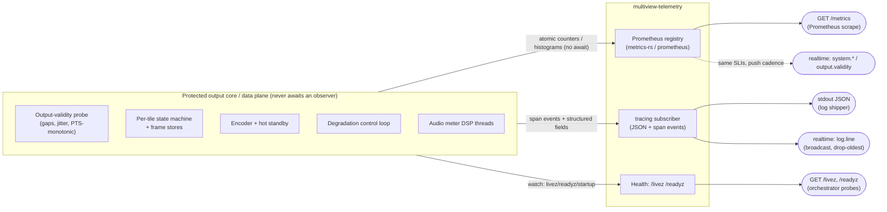

# Observability

How to see what Multiview is doing: structured **tracing/logging**, **Prometheus metrics**
(per-tile FPS/drops/bitrate, encode time, GPU/VRAM, output gaps/jitter), **health endpoints**
(`/livez`, `/readyz`), and how all of it relates to the realtime **event stream**.

Observability in Multiview is owned by the [`multiview-telemetry`](../architecture/conventions.md#3-canonical-crate-map)
crate (`tracing` + Prometheus metrics + health). It is built on the same first-class
[output-validity probe](../decisions/ADR-R009.md) that arbitrates the project's central
[bulletproof-output invariant](../architecture/conventions.md#5-canonical-technical-invariants):
*every operational signal exists to prove, or diagnose deviations from, "the output never falters."*

> **Cardinal rule (load-bearing):** observability is **read-only and best-effort**. Scraping
> metrics, tailing logs, or subscribing to events can **never** back-pressure or stall the
> protected output core. This mirrors the realtime layer's isolation rule
> ([ADR-RT004](../decisions/ADR-RT004.md), [invariant 10](../architecture/conventions.md#5-canonical-technical-invariants)).

---

## 1. The three pillars and how they relate

| Pillar | Surface | Audience | Cadence | Source of truth |
|---|---|---|---|---|
| **Tracing / logs** | stdout JSON + `log.line` event topic | humans, log shippers | event-driven | [§2](#2-tracing--structured-logging) |
| **Metrics** | `GET /metrics` (Prometheus text) | Prometheus/Grafana, alerting | pull (scrape) | [§3](#3-prometheus-metrics) |
| **Health** | `GET /livez`, `GET /readyz` | orchestrator (k8s/compose/systemd) | pull (probe) | [§4](#4-health-endpoints) |
| **Realtime events** | `/api/v1/ws`, `/api/v1/events` | the management UI, operators | snapshot+delta | [§5](#5-relationship-to-the-realtime-event-stream) |

The same underlying signals fan out to **all four** surfaces. Metrics are the *durable, aggregated,
historical* view; the realtime stream is the *live, per-resource, operator-facing* view; logs are the
*causal narrative*; health is the *binary fitness* gate.

---

## 2. Tracing / structured logging

Per [conventions §9](../architecture/conventions.md#9-naming--style), all logging uses
[`tracing`](https://docs.rs/tracing). The subscriber is configured in `multiview-telemetry` and wired
once in the `multiview-cli` binary.

- **Format:** structured JSON by default (`tracing-subscriber` JSON layer) for machine ingestion;
  a human-friendly pretty formatter is selectable for local dev. Output goes to stdout (12-factor;
  the container/host log driver ships it).
- **Spans on the data plane are cheap:** the hot path (compositor tick, encode, mux) is a
  [no-panic, no-alloc path](../decisions/ADR-R003.md). Logging there is via lightweight span events
  and pre-allocated fields, never blocking I/O. **No log call ever awaits or allocates unboundedly
  on the output core.**
- **Levels & filtering:** `RUST_LOG`-style `EnvFilter` (per-crate, per-span directives). Default
  `info`; the data-plane crates default to `warn` to keep the hot path quiet.
- **Correlation:** long-running REST commands carry a `correlationId` (`corr`); the same id appears
  in the span fields and in the `job.*` realtime events, so a single operator action is traceable
  from REST → engine spans → realtime result ([realtime brief §3](../research/realtime-api.md)).
- **Canonical structured fields:** `tile`, `input`, `output`, `backend`, `codec`, `corr`,
  `breaker`, `from`/`to` (state transitions). Use the **same field names** as the metric labels
  ([§3.6](#36-label-discipline)) so logs and metrics join cleanly.

### Log tail over the realtime stream

A bounded `tracing` layer also feeds the `logs` topic as `log.line` events
(`{level, target, fields, span}`). This is **strictly best-effort**: rate-limited, **drop-oldest**,
and it emits a `logs dropped: N` marker rather than ever blocking the emitter
([realtime brief §8](../research/realtime-api.md), [ADR-RT004](../decisions/ADR-RT004.md)). The log
view in the UI subscribes only while open.

---

## 3. Prometheus metrics

`multiview-telemetry` exposes a Prometheus text endpoint at **`GET /metrics`** (served by the same axum
router as the API). Engine code updates metrics through **atomic counters/histograms** — the publish
path never blocks the output clock.

> **Histogram buckets matter.** Default web/latency buckets are useless for a real-time video
> engine. Output frame-interval and jitter histograms use **custom buckets centred on the nominal
> frame interval** (tens to hundreds of ms) so a single missed tick is visible
> ([ADR-R009](../decisions/ADR-R009.md), [resilience brief §9.1](../research/resilience-and-av.md)).

### 3.1 Output validity & timing (the bulletproof SLIs)

These come straight from the always-on output-validity probe and **are** the numeric encoding of the
[output-clock invariant](../architecture/conventions.md#5-canonical-technical-invariants)
([ADR-R001](../decisions/ADR-R001.md), [ADR-R009](../decisions/ADR-R009.md)).

| Metric | Type | Labels | Meaning |
|---|---|---|---|
| `multiview_output_frame_interval_seconds` | histogram | `output` | Inter-frame interval at the mux; custom buckets around nominal. |
| `multiview_output_gaps_total` | counter | `output` | Intervals > N× nominal — **target: never increments**. |
| `multiview_output_pts_monotonic` | gauge (0/1) | `output` | 1 while output PTS is strictly monotonic. |
| `multiview_output_jitter_seconds` | histogram | `output` | Deviation of emit time from the ideal tick deadline. |
| `multiview_output_pts_wallclock_drift_seconds` | gauge | `output` | Output media clock vs wall clock — a slow diverging clock is a latent falter ([ADR-T006](../decisions/ADR-T006.md)). |
| `multiview_output_ts_priority1_errors_total` | counter | `output` | TR 101 290 priority-1 errors (TS/SRT). Target: 0. |

### 3.2 Per-tile

| Metric | Type | Labels | Meaning |
|---|---|---|---|
| `multiview_tile_fps` | gauge | `tile`, `input` | Measured composited tile frame rate. |
| `multiview_tile_state` | gauge (enum) | `tile`, `state` | 1 for the current `LIVE`/`STALE`/`RECONNECTING`/`NO_SIGNAL` state ([ADR-R001](../decisions/ADR-R001.md)). |
| `multiview_tile_frames_dropped_total` | counter | `tile` | Frames dropped at the tile frame store (stale-update drops). |
| `multiview_tile_last_good_age_seconds` | gauge | `tile` | Age of the last-good frame the compositor is holding. |
| `multiview_tile_state_transitions_total` | counter | `tile`, `from`, `to` | State-machine ladder transitions (flapping detector). |

### 3.3 Per-input

| Metric | Type | Labels | Meaning |
|---|---|---|---|
| `multiview_input_connection_state` | gauge (enum) | `input`, `state` | connected / reconnecting / connecting / disconnected. |
| `multiview_input_reconnects_total` | counter | `input` | Supervised reconnect attempts ([ADR-R003](../decisions/ADR-R003.md)). |
| `multiview_input_circuit_breaker_state` | gauge (enum) | `input` | `failsafe` breaker Closed/Open/Half-Open. |
| `multiview_input_jitter_buffer_seconds` | gauge | `input` | Jitter-buffer fill depth ([ADR-T008](../decisions/ADR-T008.md)). |
| `multiview_input_decode_errors_total` | counter | `input` | Decode/read errors (one bad input never stalls the multiview — [ADR-T007](../decisions/ADR-T007.md)). |

### 3.4 Encode, output bitrate, consumers

| Metric | Type | Labels | Meaning |
|---|---|---|---|
| `multiview_encode_duration_seconds` | histogram | `output`, `backend`, `codec` | Per-frame encode time (canvas encode, composite-once per [ADR-E003](../decisions/ADR-E003.md)). |
| `multiview_output_bitrate_bps` | gauge | `output` | Measured output bitrate. |
| `multiview_output_clients` | gauge | `output` | Connected consumers (churn never touches the pipeline). |
| `multiview_encoder_recycles_total` | counter | `output` | Proactive encoder-process recycles behind the hot standby ([ADR-R002](../decisions/ADR-R002.md)). |
| `multiview_encoder_hot_standby_switches_total` | counter | `output` | Make-before-break encoder failovers. |

### 3.5 GPU / VRAM, queues & degradation

| Metric | Type | Labels | Meaning |
|---|---|---|---|
| `multiview_gpu_utilization_ratio` | gauge | `device`, `engine` | Per-engine GPU util (NVML on NVIDIA; corroborate with measured fps — util% alone is unreliable, [ADR-E007](../decisions/ADR-E007.md)). |
| `multiview_gpu_vram_bytes` | gauge | `device` | VRAM used/total. |
| `multiview_gpu_encoder_sessions` | gauge | `device` | NVENC sessions vs the **probed** per-system cap (never hard-coded — [ADR-E007](../decisions/ADR-E007.md)). |
| `multiview_gpu_device_lost_total` | counter | `device` | Device-loss / TDR events triggering idempotent `rebuild()` ([ADR-R001](../decisions/ADR-R001.md)). |
| `multiview_queue_depth` | gauge | `stage` | Depth of a bounded drop-oldest stage queue (should stay shallow; growth = backpressure smell). |
| `multiview_queue_dropped_total` | counter | `stage` | Drops on bounded queues — by design they **drop, never grow** ([invariant 9](../architecture/conventions.md#5-canonical-technical-invariants)). |
| `multiview_degradation_step` | gauge | — | Current rung on the cheapest-impact-first degradation ladder ([ADR-E007](../decisions/ADR-E007.md)). |
| `multiview_supervision_restarts_total` | counter | `worker` | Supervised restarts; watch for meltdown-limit approach ([ADR-R003](../decisions/ADR-R003.md)). |

### 3.6 Realtime-layer self-metrics (label discipline)

The realtime fan-out exposes **aggregate** health so a slow client is visible without ever
labelling by connection id ([ADR-RT004](../decisions/ADR-RT004.md), [realtime brief §12](../research/realtime-api.md)):

`multiview_realtime_active_connections`, `multiview_realtime_dropped_meters_total`,
`multiview_realtime_lagged_events_total`, `multiview_realtime_mpsc_full_disconnects_total`,
`multiview_realtime_resyncs_total`.

> **Cardinality rule:** never label by connection id, client id, source URI, or any unbounded value.
> Labels are bounded sets: `tile`, `input`, `output`, `device`, `backend`, `codec`, `state`,
> `stage`, `worker`. Unbounded labels are the metrics-system OOM failure mode — the same discipline
> the engine applies to queues.

### 3.7 Audio metering vs. metrics

EBU R128 loudness (M/S/I/LRA/dBTP) is computed read-only on isolated DSP threads
([ADR-R006](../decisions/ADR-R006.md)) and is delivered primarily over the **realtime stream**
(`audio.meter` / `audio.loudness`), not Prometheus — it is high-rate, per-track, operator-facing
telemetry. Slow program-bus compliance signals (e.g. integrated LUFS vs target) MAY also be
surfaced as gauges for alerting. Metering **never** runs on the media/compositor/encoder thread and
**never** affects the output clock.

---

## 4. Health endpoints

Two liveness/readiness probes, served by `multiview-telemetry` and consumed by the orchestrator
(Kubernetes, Compose healthchecks, systemd, load balancers). Both are read from an engine-owned
`watch` channel (`system.health`: `{livez, readyz, startup}`), so a probe is a non-blocking
`borrow()` — it can never stall the engine.

| Endpoint | Semantics | 200 when | Non-200 when |
|---|---|---|---|
| **`GET /livez`** | *Is the process alive and the output core ticking?* | The output clock is advancing and the supervisor is not in meltdown. | Process wedged / output clock stalled. Orchestrator should **restart** the container. |
| **`GET /readyz`** | *Should we route traffic / consumers to it?* | Output session is up and emitting a valid stream (even if it's a slate). | During startup before the first valid frame, during a Class-2 parallel-output migration cutover, or while shedding under overload. Orchestrator should **stop routing** but **not** restart. |

Design notes:

- **`/livez` tracks the invariant, not the inputs.** Because the output emits a slate forever even
  with zero healthy inputs ([ADR-R001](../decisions/ADR-R001.md)), input loss does **not** fail
  `/livez`. A failing `/livez` means the *protected core itself* is dead — the only thing a restart
  can fix. Tile health lives in metrics/events, not the liveness gate.
- **`/readyz` may flap by design** during make-before-break migrations ([ADR-R004](../decisions/ADR-R004.md));
  the old output keeps serving until cutover, so readiness gates new routing without dropping the live
  stream.
- A failed health probe also surfaces as a `system.health` realtime event so the UI reflects it
  immediately ([realtime brief §3](../research/realtime-api.md)).

---

## 5. Relationship to the realtime event stream

Metrics, health, and events are **the same signals at different fidelities**. The realtime stream
([ADR-RT001](../decisions/ADR-RT001.md), [realtime brief](../research/realtime-api.md)) is the
operator-facing, per-resource, snapshot-then-delta view; Prometheus is the durable, aggregated,
historically-queryable view. Both originate from the **same engine-owned `watch`/`broadcast`
channels** and both are subject to the same non-blocking, best-effort isolation
([ADR-RT004](../decisions/ADR-RT004.md)).

### 5.1 Mapping table — metric ⟷ event

| Domain | Prometheus metric(s) | Realtime event `t` (topic) |
|---|---|---|
| Output validity / SLO | `multiview_output_gaps_total`, `_jitter_seconds`, `_pts_monotonic` | `output.validity` (`outputs`) |
| Output status / bitrate / clients | `multiview_output_bitrate_bps`, `_clients` | `output.status`, `output.bitrate`, `output.clients` (`outputs`) |
| Per-tile FPS | `multiview_tile_fps` | `tile.fps` (`tiles`, conflated) |
| Per-tile state | `multiview_tile_state`, `_state_transitions_total` | `tile.state` (`tiles`) |
| Input connection / supervision | `multiview_input_connection_state`, `_reconnects_total`, `_circuit_breaker_state` | `input.connection`, `input.supervision` (`inputs`) |
| GPU / device loss / recycle | `multiview_gpu_*`, `multiview_encoder_recycles_total` | `system.gpu` (`system`) |
| Degradation ladder | `multiview_degradation_step` | `system.degradation` (`system`) |
| Health | `/livez`, `/readyz` (probes) | `system.health` (`system`) |
| Audio loudness | (slow compliance gauges, optional) | `audio.meter`, `audio.loudness` (`audio.meters`/`audio.loudness`) |
| Realtime fan-out health | `multiview_realtime_*` | (aggregate only; surfaced via `alert.*`) |

### 5.2 Cadence & policy differences

- **Prometheus = pull, aggregate, lossless-by-scrape.** Cardinality-bounded labels; no per-client,
  per-connection, or per-URI labels ([§3.6](#36-label-discipline)).
- **Realtime = push, per-resource, conflated for high-rate topics.** State events are
  low-rate/lossless; `audio.meter` and `tile.fps` are **conflated/sampled to 10–30 Hz** in the
  per-connection pump ([realtime brief §8](../research/realtime-api.md), [ADR-RT004](../decisions/ADR-RT004.md)).
  A slow subscriber loses only its own messages.
- **Alerts.** Operationally significant transitions (encoder recycle, device-loss/rebuild, supervision
  meltdown approach, output gap, degradation step) raise dedupe-keyed `alert.raised`/`.cleared`
  events for the UI, while the *same conditions* drive Prometheus counters for external alerting
  (Alertmanager). Define alert rules off the metrics; use the event stream for the live operator view.

### 5.3 Recommended alerting starting points

| Condition | Metric expression (sketch) | Severity |
|---|---|---|
| Output gap | `increase(multiview_output_gaps_total[1m]) > 0` | critical |
| Clock drift | `abs(multiview_output_pts_wallclock_drift_seconds) > 0.5` | warning |
| GPU device loss | `increase(multiview_gpu_device_lost_total[5m]) > 0` | critical |
| Supervision meltdown risk | high `rate(multiview_supervision_restarts_total[10m])` | warning |
| Encoder session exhaustion | `multiview_gpu_encoder_sessions / <probed cap> > 0.9` | warning |
| Sustained degradation | `multiview_degradation_step > 0 for 5m` | warning |
| Realtime client thrash | high `rate(multiview_realtime_mpsc_full_disconnects_total[5m])` | info |

---

## 6. Testing & verification

Observability is verified by the resilience suite, not assumed:

- The **output-validity probe** ([ADR-R009](../decisions/ADR-R009.md)) emits the SLI metrics during
  every chaos/soak run and is the gating arbiter of "never falters."
- A **backpressure conformance test** ([ADR-RT004](../decisions/ADR-RT004.md)) attaches a
  deliberately-stalled metrics/event consumer and asserts **zero** effect on the engine tick and the
  output-validity SLO, plus bounded memory — the automated proof that observation cannot harm output.
- Soak runs sample RSS/FD/GPU-mem and especially **output-PTS-vs-wallclock drift**
  (`multiview_output_pts_wallclock_drift_seconds`); a slowly diverging clock is treated as a latent
  falter ([resilience brief §9.3](../research/resilience-and-av.md)).

---

## See also

- [Conventions](../architecture/conventions.md) — crate map, invariants, API conventions (source of truth).
- Briefs: [resilience-and-av.md](../research/resilience-and-av.md) · [realtime-api.md](../research/realtime-api.md) · [efficiency.md](../research/efficiency.md)
- ADRs: [R001](../decisions/ADR-R001.md) · [R002](../decisions/ADR-R002.md) · [R003](../decisions/ADR-R003.md) · [R006](../decisions/ADR-R006.md) · [R009](../decisions/ADR-R009.md) · [E007](../decisions/ADR-E007.md) · [T006](../decisions/ADR-T006.md) · [RT001](../decisions/ADR-RT001.md) · [RT004](../decisions/ADR-RT004.md)
