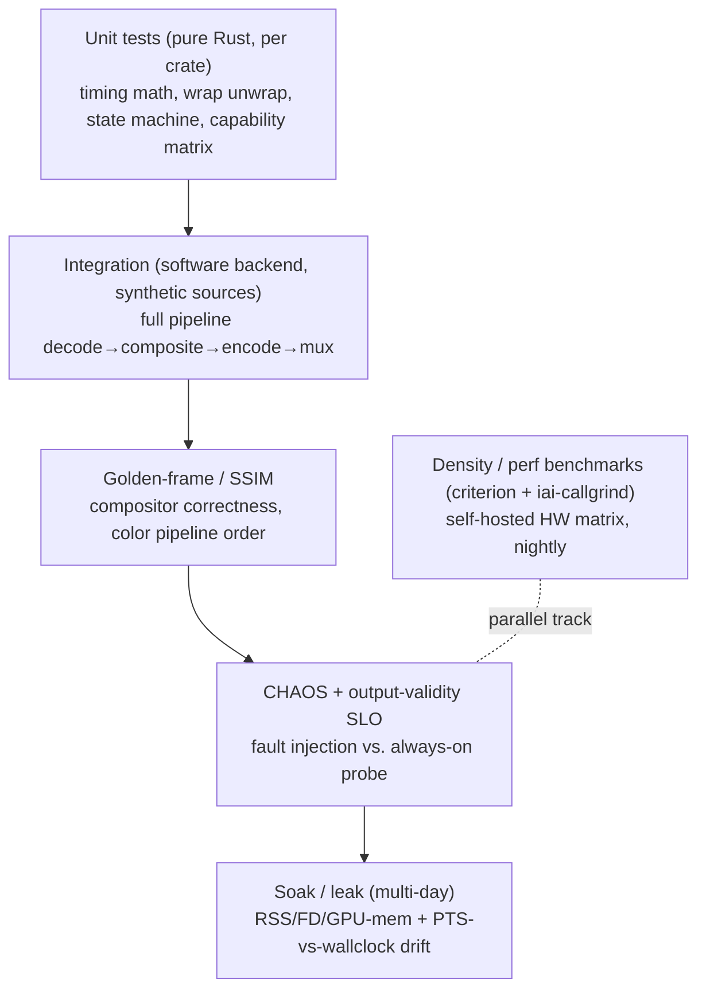
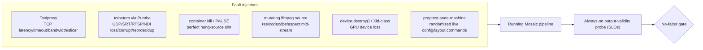
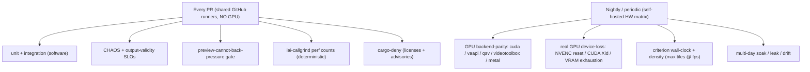

# Testing & Benchmarking

How Mosaic proves it is **bulletproof** and **efficient on commodity hardware** — the two
load-bearing promises of the project. This page is the operational map of the test strategy: what we
test, how we inject faults, the numeric SLOs that gate "never falters," the density/perf benchmarks
that gate efficiency regressions, and how almost all of it runs **without a GPU** on every PR.

> Source of truth for naming/invariants: [`../architecture/conventions.md`](../architecture/conventions.md).
> Deep design: the [Resilience & A/V brief](../research/resilience-and-av.md) (§9), the
> [Efficiency brief](../research/efficiency.md) (§7), and the
> [Streaming Robustness runbook](../research/streaming-gotchas.md).
> Source catalog: [`../reference/example-streams.md`](../reference/example-streams.md).

---

## 1. What we are testing (the two promises)

| Promise | Invariant (conventions §5) | Test family | The gate |
|---|---|---|---|
| **Never falters** | #1 output-clock, #2 last-good-frame, #3 timing, #9 degradation, #10 isolation | resilience / chaos / soak / fuzz | the **no-falter gate** + the **preview-cannot-back-pressure gate** |
| **Runs on commodity HW** | #5 NV12, #6 decode-at-display-res, #7 encode-once, #9 degradation | density / perf benchmarks | the **perf-regression gate** |

Everything below maps to one of those two columns. The two are deliberately coupled: degradation
(efficiency) is what *keeps* output continuous (resilience) under load, so the chaos suite and the
density suite share fixtures and SLO probes.

### Test pyramid

Layers U → C run on **every PR with no GPU**; S and B run on dedicated/self-hosted runners (§8).

---

## 2. Unit & integration tests

### 2.1 Unit (per-crate, pure Rust, no FFI)

The default `cargo test` builds the LGPL-clean, no-native-deps layer (conventions §4), so unit tests
never need a GPU or libav. High-value targets, by crate:

- **`mosaic-core` / `mosaic-clock`** — `out_pts = f(tick)` is a *pure function*: exhaustively assert
  monotonicity and gap-freeness, including the NTSC `1001` rational cadences (60000/1001, 30000/1001)
  carried as exact rationals/ns — **never float fps**. Test **past the wrap boundary**: feed
  synthetic 33-bit TS / 32-bit RTP timestamps that roll over and assert the delta-based unwrap stays
  monotonic (the MediaMTX #622 false-rollover trap). See the [timing model](../research/streaming-gotchas.md#0-the-unified-timing-model).
- **`mosaic-framestore`** — the per-tile LIVE → STALE → RECONNECTING → NO_SIGNAL ladder is a state
  machine: table-driven tests over `(state, event, elapsed)`; assert the lock-free single-slot store
  is latest-wins and never blocks either side.
- **`mosaic-input`** — timestamp normalize (unwrap, genpts fallback, monotonic guard, discontinuity
  re-anchor) and the HLS PTS→wall-clock pacer math, with **deterministic time** via the tokio paused
  clock so a 26.5 h wrap is simulated in milliseconds.
- **`mosaic-hal` / planner** — the capability+cost **registry** and the degradation **ladder** are
  pure data + ordering logic: assert the cheapest-impact-first order and hysteresis/cooldown never
  oscillate.
- **`mosaic-config` / `mosaic-control`** — schema round-trip (serde), and the **capability-aware
  validator** that greys out impossible routes per output (e.g. N discrete audio tracks on legacy
  RTMP, channel-map on NDI) — the [verified matrix](../research/resilience-and-av.md#42-output-discrete-audio-capability-matrix-verified) is a first-class data structure under test.

> No-panic hot path is enforced statically, not just by tests: clippy
> `deny(unwrap_used, panic)` on the media crates (conventions §9, [ADR-R003](../decisions/ADR-R003.md)).

### 2.2 Integration (software backend, real pipeline)

Integration tests wire the whole pipeline — `decode → normalize → framestore → composite → encode →
mux` — on the **software/CPU backend** (libav software decode, the portable wgpu path over
llvmpipe/SwiftShader, software libx264). They consume the **synthetic sources** of §3 and assert
output validity (§5). Backend parity against real GPU backends is a separate, periodic job (§8).

---

## 3. Synthetic & test sources

CI **must not** depend on third-party live streams — they are geo-restricted, rate-limited,
copyrighted, and removed without notice (see the warning in
[`example-streams.md`](../reference/example-streams.md)). The public streams (ABC News, CNN slate,
Frigate cam, Mux BBB, Apple BipBop, Red Bull) are a **dev/demo gotcha matrix** only.

For reproducible tests we generate sources with **lavfi** (`testsrc2`, `smptebars`, `sine`) and
re-serve them through **MediaMTX** for protocol coverage. Both are documented with copy-paste recipes
in [`example-streams.md` → Synthetic & reproducible sources](../reference/example-streams.md#synthetic--reproducible-sources).

The synthetic matrix is engineered to exercise every documented failure axis deterministically:

| Axis | What the fixture forces | Source recipe |
|---|---|---|
| **Mismatched fps** | 25 / 29.92 / 29.97 / 30 / 50 / 60 in one mosaic | `testsrc2=rate=…` per tile |
| **Fractional NTSC** | 30000/1001 carried as exact rational | `smptebars=rate=30000/1001` |
| **Color tagging** | untagged · BT.709 limited · BT.601 (smpte170m) · full-range | `scale=out_range=tv/pc` + `-color_*` tags |
| **Codec paths** | H.264 + HEVC | `libx264` / `libx265` |
| **Audio rates** | 22.05k / 44.1k / 48k → resample-to-48k | `sine=sample_rate=…` |
| **Protocols** | RTSP / SRT / HLS / MPEG-TS loopback | MediaMTX re-serve |
| **HLS ingest burst** | VOD-as-live raced ahead with no pacer | point ingest at Mux BBB VOD |
| **Mid-stream change** | resolution/codec/fps/aspect flip | deliberately-mutating ffmpeg source |

The local **MediaMTX** rig (`docker run … bluenviron/mediamtx`) lets one synthetic `testsrc2` be
consumed as `rtsp://`, `srt://`, and `http://…index.m3u8` simultaneously — one fixture, all
transports, no network.

---

## 4. Golden-frame & SSIM correctness

The compositor and color pipeline are validated against **golden reference frames**, not just
liveness:

- **Golden-frame checks** — for a fixed scene-graph + fixed input frames, the composited NV12 canvas
  must match a checked-in reference. Because GPU rasterization differs subtly across drivers, compare
  with **SSIM** (structural similarity) above a threshold rather than bit-exact equality; reserve
  bit-exact only for the deterministic CPU/software path.
- **Color pipeline order** — the [color order invariant](../architecture/conventions.md) (§8: detect
  4 axes → range-expand → matrix → linearize → primaries → blend in linear → OETF → re-tag) is
  verified end-to-end: feed the **deliberately-different colorimetry** fixtures (untagged, BT.709
  limited, BT.601 primaries, full-range MJPEG-style) and assert the output is correctly converted and
  **re-tagged**, verified with **ffprobe** on the output (primaries/TRC/matrix/range + HDR).
- **Premultiplied-alpha correctness** — overlays/subtitles must blend `OVER` premultiplied; assert no
  dark/colored halos on antialiased edges (the silent pervasive bug from
  [the overlay model](../research/resilience-and-av.md#7-overlay-rendering-model)). swash output is
  straight coverage (premultiply before upload); libass output is already premultiplied (upload as-is).
- **NV12-throughout** — assert tiles are never materialized as RGBA per tile (conventions §5, #5);
  YUV→RGB happens in-shader at tile size.

---

## 5. The CHAOS plan: fault injection + output-validity SLOs

This is the heart of "never falters." The invariant is encoded as **numeric SLOs** measured by an
**always-on output-validity probe** (`mosaic-telemetry` Prometheus histograms + an error budget),
and chaos is injected *against a running output* while the probe arbitrates. Deep detail:
[Resilience brief §9](../research/resilience-and-av.md#9-resilience-testing) and
[ADR-R009](../decisions/ADR-R009.md).

### 5.1 Output-validity SLIs (the no-falter gate)

The probe taps the **real output** and emits SLIs with custom buckets around the nominal frame
interval (tens–hundreds of ms — default web buckets are useless):

| SLI | Assertion | Tool |
|---|---|---|
| Frame-interval jitter | within bound; **zero gaps** (no interval > N× nominal) | output-validity probe |
| PTS/DTS continuity | strictly monotonic, gap-free, no backward jumps | probe + muxer checks |
| TS / SRT validity | **zero TR 101 290 priority-1 errors**; PCR/continuity-counter continuous | TSDuck `tsp` (analyze/continuity/pcrverify) |
| HLS / LL-HLS conformance | spec-valid; discontinuities are **correctly *signalled***, not absent | Apple `mediastreamvalidator` |
| No whole-canvas freeze/black/silence | distinguish "one tile froze" (**expected**) from "whole canvas + clock froze" (**falter**) | ffmpeg `freezedetect`/`blackdetect`/`silencedetect` + an always-ticking clock overlay that must advance |
| Track presence & mapping | all configured discrete audio/subtitle tracks present; per-track mapping correct | inject a distinct tone per input → confirm via `ebur128`/correlation |

**The no-falter gate fails the build** if any of these is violated during a chaos scenario. Crucially
it asserts *output continuity*, not *input health*: a downed tile showing a SIGNAL LOST slate while
the canvas keeps emitting is a **pass**.

### 5.2 Fault injection toolbox

- **TCP inputs/outputs** → **Toxiproxy** (latency, timeout, bandwidth, slicer) — TCP-only, test-env.
- **UDP / SRT / RTSP / NDI** → **tc/netem via Pumba** (loss, corruption, reorder, dup); mind the
  egress-direction caveat (impair source side / ifb / proxy).
- **Source death / hang** → container **kill** (death) and **pause** (the perfect hung-source
  simulation that exercises libav `AVIOInterruptCB` + `rw_timeout`/`tcp`/`rtsp` timeouts → supervised
  reconnect with `backon` backoff, [ADR-R003](../decisions/ADR-R003.md)).
- **Mid-stream changes** → deliberately-mutating ffmpeg sources flip resolution/codec/fps/aspect; the
  change must be absorbed *inside the tile* (reconfigure swscale/zscale, **never the output encoder**;
  [streaming runbook §6](../research/streaming-gotchas.md#6-codec--decode--encode-edge-cases)).
- **Live config/layout chaos** → **stateful property-based tests**
  (`proptest-state-machine`) drive randomized, **shrinkable** command sequences (add/remove tile,
  swap source, switch template, Preview→Program cut/crossfade). The invariant is "output stayed
  valid"; a failure shrinks to the **minimal bad ordering**.
- **Total blackout + GPU loss** → first-class scenarios: kill **all** inputs and/or force device loss
  and assert **zero output gaps** — the output emits a full-canvas slate + live ticking clock +
  silence while `rebuild()` runs ([ADR-R001](../decisions/ADR-R001.md), [ADR-R002](../decisions/ADR-R002.md)).

### 5.3 The preview-cannot-back-pressure gate

A **dedicated chaos gate** enforces conventions invariant #10 (isolation): the control plane,
preview, and realtime layers are *physically incapable* of back-pressuring the engine. The test
deliberately stalls/floods every best-effort consumer and asserts the engine output is untouched:

- Slow or hang a **WHEP/MJPEG preview** subscriber, a SSE/WebSocket client, and the REST control
  plane simultaneously.
- Assert the engine **never awaits a client**: watch/broadcast channels and bounded **drop-oldest**
  queues drop, they never grow or block (conventions §5 #10; preview isolation
  [ADR-P001](../decisions/ADR-P001.md)).
- The output-validity SLIs (§5.1) must hold throughout — a stalled preview must produce **zero**
  change in output frame-interval jitter. This gate is mandatory on every PR (it needs no GPU).

### 5.4 Per-format expectation parameterization

Chaos and validity tests are **parameterized by output format**. "N inputs → N discrete audio
tracks" *correctly fails* on legacy RTMP and single-stream NDI and *passes* on TS/HLS/RTSP — this
asymmetry is a **designed-in expectation, not a regression**. The
[capability matrix](../research/resilience-and-av.md#42-output-discrete-audio-capability-matrix-verified)
drives both the runtime validator and the test parameters ([ADR-R005](../decisions/ADR-R005.md)).

---

## 6. Soak, leak & long-run drift

Latent falters only appear over hours/days, so soak runs are a first-class job (not PR-blocking):

- **Multi-day soak** with continuous low-rate chaos. Always-on sampling of **RSS / FD count / GPU
  memory** (jemalloc/mimalloc stats) catches leaks; **heaptrack/dhat** are used *targeted* only —
  their overhead can OOM and perturb timing.
- **Output-PTS-vs-wall-clock drift** is the marquee soak SLI: a slowly diverging clock is a *latent
  falter*. Acceptance: **max |A/V offset| within the EBU R37 window (+40/−60 ms) and zero output gaps
  over ≥72 h** ([streaming runbook §5](../research/streaming-gotchas.md#5-long-run-clock-drift),
  [ADR-T006](../decisions/ADR-T006.md)). The pure clock-arithmetic portion is also tested
  *deterministically* — tokio paused clock / madsim simulate days in seconds.
- **Encoder-process recycling** (proactive, behind a hot standby) is exercised under soak to confirm
  the recycle is invisible to output (documented NVENC multi-day leaks /
  `INVALID_DEVICE` degradation, [ADR-R002](../decisions/ADR-R002.md)).
- **Fuzzing** — `cargo-fuzz`/libFuzzer + `arbitrary` (structure-aware) on demux/parse/SEI/caption/
  SDP/playlist parsers and on config/OpenAPI request bodies; `afl.rs` for **hang detection** (a parse
  hang *is* a falter). Mirror OSS-Fuzz's FFmpeg targets.

---

## 7. Density & performance benchmarks

The efficiency promise is gated by **per-tier budgets** and a **two-tool** benchmark stack
([Efficiency brief §7](../research/efficiency.md#7-profiling-density-benchmarking--perf-regression-ci),
[ADR-E009](../decisions/ADR-E009.md)).

### 7.1 The two-tool gate

| Tool | Measures | Role | Where it runs |
|---|---|---|---|
| **`iai-callgrind`** | Callgrind instruction + allocation counts | **the hard fail** — deterministic, noise-immune | any runner (no HW timing needed) |
| **`criterion`** | wall-clock latency (per-stage, per-tile) | trend + latency regression | **dedicated/self-hosted** runner only |

> `criterion` is unreliable on shared cloud runners and may not return non-zero on regression — so
> the **deterministic `iai-callgrind` counts are the gate**, and criterion runs on dedicated hardware.
> Track both plus end-to-end density over time with **Bencher** / `github-action-benchmark`.

### 7.2 Density metric: max tiles @ target fps

Density is a **vector**, not a scalar, measured on distinct engine counters (decode, composite,
encode live on physically different hardware):

- **max tiles @ target fps per CPU core** (decode/demux/RTP/audio host cost)
- **max tiles per GB RAM/VRAM** (full-res surface sets where decode-scale is post-decode; pool sizes)
- **max tiles per watt** (fixed-function offload; battery/fanless targets)
- **engine ceilings**: decoded **MP/s** per NVDEC/media engine; encode-session count; SFC
  downscale-ratio limit

Cost tables are built cheaply by differencing `ffmpeg -benchmark`/`-benchmark_all` (reports
`utime`/`stime`/`maxrss`) across **decode-only vs decode+scale vs decode+composite+encode**, per
backend (sw/qsv/vaapi/cuda/videotoolbox). **Caveat:** `-benchmark` captures only host CPU/RAM — for
hardware backends decode/encode is *off-CPU*, so pair it with per-engine GPU telemetry
(`nvidia-smi dmon`, `intel_gpu_top`, IOReport AVE) and split phases with NVTX / os_signpost. These
measured costs feed the planner's [capability+cost registry](../research/efficiency.md#28-cheapest-viable-per-stage-backend-selection-hal-negotiation)
([ADR-E008](../decisions/ADR-E008.md)).

Real "max tiles @ target fps" runs need a **self-hosted hardware matrix** (nightly), not shared
runners. The per-tier targets to bracket against (Efficiency brief §5):

| Tier | Binding limit | Default density target |
|---|---|---|
| Intel iGPU (N100/Arc) | shared DDR bandwidth; no encode-session cap | 2×2–3×3 @1080p |
| Entry NVIDIA dGPU | single NVDEC throughput | ~3×3 (decode-bound) |
| AMD APU/dGPU | bandwidth + blind scheduling | 2×2–3×3 @1080p |
| Apple base M-series | one decode engine + unified bandwidth | 2×2–3×3 @1080p |
| CPU-only | cores + bandwidth | 2×2 1080p **H.264** max |

> Published anchors only bracket the order of magnitude; sanity-check
> `per-tile budget × tile count < measured engine fps ceiling` on the **specific target SKU**.

### 7.3 In-process profiling backbone

**Tracy** (`tracy-client` + `tracing-tracy`) provides per-stage/per-tile zones, `frame_mark` per
composite, and `plot!` for live decode-ms / queue-depth / VRAM / %busy. Each zone is **tagged with
the negotiated backend** so cost auto-attributes to the right engine. It compiles out behind a cargo
feature (verify it truly vanishes on the hot per-tile path) and Tracy crate versions are **pinned**
(version-locked protocol). Always corroborate util% with measured fps — `nvidia-smi %enc/%dec` and
Apple GPU-util are misleading (VideoToolbox runs on a dedicated Media Engine, not the GPU; NVENC can
read `%enc=0` while active).

---

## 8. CI strategy — green without a GPU

The default `cargo check`/`cargo test` builds the **pure-Rust, LGPL-clean, no-native-deps** layer, so
the bulk of CI is GPU-free by construction (conventions §4). The per-stage backend is abstracted so a
**CPU/software path** (Mesa **llvmpipe** / **SwiftShader** for Vulkan, software libav, libx264) runs
the *full* chaos + validity + fuzz suite on **every PR**.

- **On every PR (no GPU):** unit + integration, the full chaos/validity suite, the
  **preview-back-pressure gate**, `iai-callgrind` perf-count regression, and **`cargo-deny`**
  (license + advisory gate, conventions §7).
- **Scarce GPU runners** (GitHub L4/T4, self-hosted NVIDIA, Apple-Silicon for Metal/VideoToolbox) are
  reserved for a **periodic backend-parity** job + **real GPU-device-loss** + criterion density +
  soak.
- **The known gap:** software CI **cannot** reproduce NVENC reset, CUDA device loss, or VRAM
  exhaustion — the **real-GPU job is required** to close it ([ADR-R009](../decisions/ADR-R009.md)).
  This is doubled by the platform split: macOS in-process FFI vs Linux process-isolated FFI is a
  separate test surface ([ADR-R002](../decisions/ADR-R002.md)).

---

## 9. Quick reference

| I want to… | Use | See |
|---|---|---|
| Reproduce a specific failure offline | lavfi synthetic source + MediaMTX | [example-streams §synthetic](../reference/example-streams.md#synthetic--reproducible-sources) |
| Assert "never falters" | output-validity probe SLIs | §5.1, [Resilience §9](../research/resilience-and-av.md#9-resilience-testing) |
| Prove preview can't stall the engine | preview-back-pressure gate | §5.3, [ADR-P001](../decisions/ADR-P001.md) |
| Check a perf regression locally | `iai-callgrind` (hard) + `criterion` (trend) | §7.1, [ADR-E009](../decisions/ADR-E009.md) |
| Measure density on a real box | self-hosted HW matrix, "max tiles @ fps" | §7.2, [Efficiency §7](../research/efficiency.md#7-profiling-density-benchmarking--perf-regression-ci) |
| Verify output color tags | ffprobe on the muxed output | §4, conventions §8 |
| Catch a slow clock drift | multi-day soak, PTS-vs-wallclock | §6, [ADR-T006](../decisions/ADR-T006.md) |

### Related ADRs

[T001](../decisions/ADR-T001.md) (output clock) ·
[T002](../decisions/ADR-T002.md) (per-tile resample) ·
[T003](../decisions/ADR-T003.md) (timestamp normalize) ·
[T006](../decisions/ADR-T006.md) (drift) ·
[T007](../decisions/ADR-T007.md) (codec edge cases) ·
[R001](../decisions/ADR-R001.md) (continuous output) ·
[R002](../decisions/ADR-R002.md) (fault isolation) ·
[R009](../decisions/ADR-R009.md) (resilience testing) ·
[E007](../decisions/ADR-E007.md) (degradation) ·
[E008](../decisions/ADR-E008.md) (cost-model planner) ·
[E009](../decisions/ADR-E009.md) (perf-regression CI) ·
[P001](../decisions/ADR-P001.md) (preview isolation).
