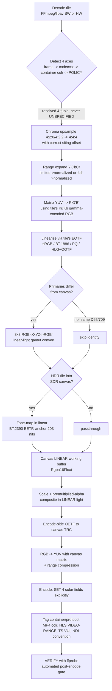

> **Design brief — Color.** Authoritative research/design record backing the implementation. Produced by a verification-hardened multi-agent research workflow (2026-06-02). Canonical crate/API naming lives in [docs/architecture](../architecture/). ADRs derived from this brief are in [docs/decisions](../decisions/).

---

# Multiview — Color Management Brief (Authoritative)

**Project:** Multiview — live GPU video multiview compositor (heterogeneous RTSP/HLS/TS/SRT/NDI in; custom CUDA/Metal/wgpu compositor; RTSP/HLS/NDI/RTMP/SRT out).
**Status:** Authoritative color-correctness runbook (source of truth for downstream docs/agent instructions).
**Platforms:** Linux (NVIDIA NVDEC/NVENC, Intel/AMD VAAPI) + macOS (VideoToolbox).
**Date:** 2026-06-02

> **Why this document exists.** Multiview composites *heterogeneous* sources — each tile can carry different color primaries, transfer function, YUV↔RGB matrix, and range — into ONE canvas. Because we run a **custom GPU compositor and deliberately bypass swscale/FFmpeg filters for the composite**, libav does **no** implicit color conversion for us. We own color correctness end-to-end: detect → convert → composite (ideally in linear light) → encode → **tag** → **verify**. Getting any of the four axes wrong produces output that is silently, visibly wrong on some players. This is the class of bug the project has been repeatedly burned by.

---

## 1. The Four INDEPENDENT Color Axes

Color is **four orthogonal axes**. They appear together but are signaled and defaulted **independently** — a stream commonly tags one and leaves the others unspecified. **Never collapse them into a single "colorspace" concept.**

| # | Axis | What it controls | FFmpeg type / "unspecified" | Symptom when WRONG |
|---|------|------------------|------------------------------|--------------------|
| 1 | **Primaries** | The chromaticity of R/G/B + white point (the gamut). | `AVColorPrimaries` (`AVCOL_PRI_*`), **unspecified = 2** | Wrong saturation/hue, gamut over/under-shoot (most visible mixing BT.2020 into BT.709). |
| 2 | **Transfer / TRC** | The opto-electronic curve (gamma) mapping linear light ↔ code values. | `AVColorTransferCharacteristic` (`AVCOL_TRC_*`), **unspecified = 2** | Wrong gamma/contrast; applying a PQ EOTF to SDR → grossly dark/washed; sRGB↔BT.709↔BT.1886 confusion → "slightly off" mids. |
| 3 | **Matrix / Colorspace** | The YUV↔RGB coefficients (Kr/Kg/Kb). | `AVColorSpace` (`AVCOL_SPC_*`), **unspecified = 2**, **`AVCOL_SPC_RGB=0` = "samples are RGB, no matrix"** (distinct from unspecified) | Hue/saturation shift (greens & reds most visible) when BT.601 coeffs applied to BT.709 content or vice-versa. |
| 4 | **Range** | Quantization swing: limited/"TV"/MPEG (Y′ 16–235, Cb/Cr 16–240) vs full/"PC"/JPEG (0–255). | `AVColorRange` (`AVCOL_RANGE_*`), **unspecified = 0** (`MPEG`=1 limited, `JPEG`=2 full) | The classic bug: limited-as-full → **elevated/grey blacks, washed-out, low contrast**; full-as-limited → **crushed blacks, clipped whites**. |

**Critical sentinel trap:** unspecified is **2** for primaries/TRC/matrix but **0** for range. Do not assume one sentinel across the four. (Source: `libavutil/pixfmt.h`.)

**Exact range numerics (8-bit), implement precisely:**
- Limited luma = `(219·E + 16)·2^(n−8)` → 8-bit `16..235`; limited chroma = `(224·E + 128)·2^(n−8)` → 8-bit `16..240`.
- Full luma = `(2^n−1)·E` → `0..255`; full chroma = `(2^n−1)·E + 2^(n−1)` → documented `1..255`, centered 128.
- 10-bit limited: luma `64..940`, chroma center `512` (`64..960`). Tie chroma center to **bit depth** (128 / 512 / 32768), never a constant.

> **Range is one of the highest-impact AND most common bugs**, but it is not categorically worse than a matrix mismatch. Treat all four as first-class. (Verification softened the original "highest-impact" superlative to "one of the highest-impact and most common.")

---

## 2. End-to-End Color Pipeline

The canonical per-tile recipe (mirrors libplacebo and zimg, the two reference implementations):



**Strict ordering rules (do not reorder):**
1. **Range expansion happens BEFORE the YUV→RGB matrix**, in code-value space. Black 16 → 0.0, white 235 → 1.0.
2. **Matrix happens on gamma-encoded R′G′B′** (not linear).
3. **Linearize (EOTF) before any scaling/blending/primaries math.**
4. **Primaries conversion is in LINEAR light** (RGB→XYZ→RGB′), separate from the YUV matrix — never matrix-YUV between primaries.
5. **Scale & alpha-blend in LINEAR light with premultiplied alpha** (NVIDIA "The Importance of Being Linear"). Compositing in gamma/YUV space causes dark fringing on edges/overlays and wrong mids — independent of all other correctness.
6. **Apply exactly ONE range expansion on input and ONE compression on output.** Beware double conversion (a HW decoder or auto-inserted swscale `scale` can implicitly convert before your code runs).

---

## 3. Detection & Default Policy for Untagged Inputs

**The untagged trap is the heart of this domain.** Enormous amounts of real-world live content (RTSP/SRT/TS feeds, IP cameras, webcams) ship UNTAGGED, and every consumer guesses *differently*. swscale silently uses **index-0 = BT.601** for an unspecified matrix **regardless of resolution** (`yuv2rgb.c`); players/libplacebo/mpv apply a **resolution heuristic** instead. **We must reproduce the PLAYER behavior**, not swscale's, or the multiview disagrees with how a source looks in a real player.

### 3.1 Detection precedence (per tile, every frame)
1. **`AVFrame.color_*`** (preferred — may differ per frame).
2. Fall back to **`AVCodecContext.color_*`** for any field still `UNSPECIFIED`. (In current FFmpeg, `ff_decode_frame_props`/`fill_frame_props` already copies avctx→frame with a *guarded* assignment — `if (frame->color_range == AVCOL_RANGE_UNSPECIFIED) frame->color_range = avctx->color_range;` — so this is usually already done, but **keep the explicit guard** because behavior is path/version-dependent.)
3. Fall back to **container tags** (MP4/MOV `colr` nclx, surfaced by the demuxer).
4. If still unspecified, apply the **default policy** below and **log the fallback** with the tile id + resolved 4-tuple.

> **Lock the precedence as `frame > codec ctx > container > policy` and test it.** Container `colr` can *contradict or be absent relative to* the elementary-stream VUI; choosing the wrong precedence silently flips colors.

### 3.2 Default policy for genuinely unspecified axes (the libplacebo/mpv rules)
- **Range:** YCbCr/YUV ⇒ **limited** (`AVCOL_RANGE_MPEG`); RGB/packed-RGB ⇒ **full**. (`pl_color_levels_guess`.) This matches H.264 Annex E / H.265 where `video_full_range_flag` is *inferred 0 (limited)* when absent.
- **Matrix + Primaries (resolution heuristic):** `width ≥ 1280 OR height > 576` ⇒ **BT.709**; `height == 576` ⇒ **BT.601-625 (BT.470BG/PAL)**; `height == 480 or 486` ⇒ **BT.601-525 (SMPTE-170M/NTSC)**; otherwise **BT.709**.
- **TRC:** SDR default **BT.709 transfer** (use **BT.1886** ≈ pure 2.4 as the *display* EOTF for decode of broadcast/capture video; use **sRGB piecewise** for graphics/screen-capture/PNG/JPEG RGB sources).
- **NEVER auto-promote to BT.2020 / PQ / HLG from resolution** — libplacebo deliberately refuses (4K is still guessed BT.709). Only honor wide-gamut/HDR when **explicitly tagged**. Mis-promoting SDR→HDR or applying a PQ EOTF to SDR is catastrophic.
- **Where the stream DOES tag an axis, always trust the tag over the heuristic.**
- **Provide a per-source override** in config — heuristics *will* sometimes be wrong (e.g. SD content intended as 709, full-range YUV mislabeled limited, vendor cameras with nonstandard tags).

### 3.3 Hardware decoder metadata: preserve vs drop
- **NVDEC / cuviddec (NVIDIA):** `cuvid_handle_video_sequence` maps `video_full_range_flag → color_range`, `matrix_coefficients → colorspace`, plus primaries/trc onto **`AVCodecContext`**. The standalone cuvid decoder (`h264_cuvid`/`hevc_cuvid`) calls `ff_decode_frame_props`, propagating to the frame; the **nvdec hwaccel** path has *no* color code and relies on the generic `decode.c` path — which also runs `ff_decode_frame_props`. **Net: a properly-tagged stream WILL carry color on the frame in current FFmpeg**; the original "hw frames are always UNSPECIFIED" premise is *inaccurate*. **But** propagation is only as good as avctx, untagged input stays unspecified, and behavior is version/path dependent — so **keep the avctx→frame guard and the policy fallback** as defensive practice and **verify empirically per FFmpeg+driver version**.
- **VideoToolbox (Apple):** carries color as CVImageBuffer attachments (`CGColorPrimaries`/`TransferFunction`/`YCbCrMatrix`). FFmpeg's `av_vt_pixbuf_set_attachments` **unsets** attachments for any property unspecified in the frame — VT does **not** invent tags for untagged input. **Known decode bug:** VT hardware decode has historically **mis-applied the full-range flag** (squeezed full-range to limited; mpv #6546). **Trust the bitstream/container VUI, NOT the decoded surface, for range on macOS.**
- **VAAPI:** frame-level color metadata reliability is **not confirmed** here — treat as best-effort, inherit from codec ctx/parser, and verify empirically (open question).

---

## 4. Conversion Math for the Custom GPU Compositor

Since we bypass swscale, all of this is implemented in shaders/kernels. **Canonical coefficient source: ITU-R BT.709/BT.601(SMPTE-170M)/BT.2020 + ISO/IEC 23091-2 (H.273 CICP)**, cross-checked against zimg/libplacebo to ≥4 decimals.

### 4.1 Luma weights (Kr, Kg, Kb)
- **BT.601:** 0.299 / 0.587 / 0.114
- **BT.709:** 0.2126 / 0.7152 / 0.0722
- **BT.2020:** 0.2627 / 0.6780 / 0.0593

### 4.2 Range normalization (do FIRST, in code-value space)
- **Limited 8-bit → normalized:** `Y = (Y8 − 16)/219`, `Cb = (Cb8 − 128)/224`, `Cr = (Cr8 − 128)/224`.
- **Full 8-bit → normalized:** `Y = Y8/255`, `Cb = (Cb8 − 128)/255`, `Cr = (Cr8 − 128)/255`.
- 10-bit limited: `/`876 luma (≈940−64), `/`896 chroma; P010 stores 10-bit in the **high bits** of 16-bit words (left-shift 6) — descale before normalizing.

### 4.3 YUV′ → R′G′B′ (gamma-encoded; Y∈[0,1], Cb,Cr∈[−0.5,0.5])
General: `R′=Y+2(1−Kr)Cr`, `B′=Y+2(1−Kb)Cb`, `G′=Y−(2Kr(1−Kr)/Kg)Cr−(2Kb(1−Kb)/Kg)Cb`. Numeric:
- **BT.709:** `R′=Y+1.5748·Cr`, `G′=Y−0.1873·Cb−0.4681·Cr`, `B′=Y+1.8556·Cb`
- **BT.601:** `R′=Y+1.402·Cr`, `G′=Y−0.344136·Cb−0.714136·Cr`, `B′=Y+1.772·Cb`
- **BT.2020-NCL:** `R′=Y+1.4746·Cr`, `G′=Y−0.16455312684366·Cb−0.57135312684366·Cr`, `B′=Y+1.8814·Cb`

Use **full-precision** constants (e.g. `0.16455312684366`, not `0.1645`) to avoid drift across many tiles/frames. BT.2020 has **NCL (non-constant luminance, the common one)** and **CL** variants — different math; verify content is NCL.

### 4.4 Transfer functions (linearize on decode, inverse on encode)
- **sRGB EOTF** (graphics/RGB): `L = C/12.92` if `C≤0.04045` else `((C+0.055)/1.055)^2.4`. Encode threshold 0.0031308, slope 12.92.
- **BT.709 OETF** (camera/encode): `V=4.5L` (`L<0.018`) else `1.099·L^0.45−0.099` (precise α=1.09929682680944, β=0.018053968510807). **BT.709 OETF ≠ BT.709 EOTF ≠ sRGB.** For *display-referred* SDR decode use **BT.1886** (≈ pure 2.4). Do not reuse the OETF as an EOTF.
- **PQ / ST 2084 EOTF** (code→linear, 1.0 = 10000 cd/m²): `L = 10000·( max(E′^(1/m2)−c1, 0) / (c2 − c3·E′^(1/m2)) )^(1/m1)` with `m1=0.1593017578125 (2610/16384)`, `m2=78.84375`, `c1=0.8359375`, `c2=18.8515625`, `c3=18.6875` (note `c1=c3−c2+1`).
- **HLG / ARIB STD-B67 OETF:** `V=√(3L)` (`L≤1/12`) else `a·ln(12L−b)+c`, `a=0.17883277`, `b=0.28466892`, `c=0.55991073`. **HLG is scene-referred and needs the OOTF/system gamma** `γ = 1.2 + 0.42·log10(Lw/1000)` (γ=1.2 at 1000 nits) to reach display-linear — a naive inverse-OETF round-trip is NOT display-correct.

### 4.5 Primaries (gamut) conversion — linear light only
`M = M_canvas⁻¹ · M_source`, where each `M_x` is the RGB→XYZ matrix from that space's primaries + white point (D65 for 601/709/2020). BT.2087 specifies the BT.709↔BT.2020 path; BT.2407 for BT.2020→BT.709 gamut mapping. **If all sources and canvas are same-D65 BT.709, this step is identity and can be skipped.** Derive exact NPM/inverse-NPM per primaries pair and verify against zimg/libplacebo (open item).

### 4.6 Chroma siting
4:2:0 H.264/HEVC/MPEG-2 default is **`left`/cosited-even horizontal, vertically centered** (`AVCHROMA_LOC_LEFT=1`); JPEG/MPEG-1 use **`center`**. Upsample to 4:4:4 with the **correct fractional texel offset**, or you get a persistent ~½-chroma-pixel shift and tinted high-contrast edges (worst at tile boundaries after scaling). Vulkan models this as `COSITED_EVEN` vs `MIDPOINT`.

### 4.7 GPU buffer & format guidance
- **Linear working/canvas buffer = `Rgba16Float`** (16-bit float minimum). 8-bit linear bands severely; HDR requires it; 32F doubles bandwidth for little gain.
- **`*_SRGB` texture formats** give *free* hardware sRGB↔linear on sample/store — **only** for the sRGB curve. **Do PQ/HLG/BT.709-OETF/BT.1886 linearization MANUALLY in-shader**; relying on `*_SRGB` for video TRCs silently mis-linearizes and corrupts all downstream linear math.
- Select the per-tile kernel/uniforms from the **`(primaries, trc, matrix, range, bit-depth)` tuple** (libyuv's I/J/H/F/U/V prefix convention is a good model), not a single hardcoded matrix.

---

## 5. HDR / SDR Strategy

**Recommended default canvas: SDR BT.709, limited range** (primaries=1, transfer=1, matrix=1, full_range_flag=0). It is the universally and correctly-rendered lingua franca across RTSP/HLS/RTMP/SRT/NDI players; downstream HDR rendering is fragile (tags dropped, players misrender). Make canvas color space a **config option** (`sdr-bt709` default; `hdr-pq` / `hdr-hlg` opt-in).

### 5.1 Mixing HDR tiles into the SDR canvas — the wash-out rule
The bug the user has been burned by: one HDR tile washes out the SDR multiview. **Fix: tone-map each HDR tile DOWN, per-tile (not per-canvas), with a roll-off curve anchored at diffuse white**, NOT a linear scale to peak. Anchor on **BT.2408 reference white = 203 cd/m²**: HDR diffuse white (≈203 nits / ≈58% PQ) maps to SDR 100% white; highlights above it roll off. Linear normalization to peak crushes the SDR tiles.

**Never composite PQ/HLG/BT.709 code values directly** — `PQ 0.58 ≠ HLG 0.58 ≠ BT.709 0.58` in linear light. Linearize + tone-map each tile in its own space, converge in BT.709 linear, then blend.

### 5.2 Tone-mapping algorithm
- **Default built-in: BT.2390 EETF** — standardized Hermite-spline shoulder with a 1:1 midtone region and black-lift, computed in PQ space. Cheap, deterministic, **temporally stable** (good for live; avoids flicker), easy to port to CUDA/Metal/wgpu.
- **Premium (optional): libplacebo** `spline`/`bt2390`/`st2094` with peak detection (`peak_percentile ≈ 99.995`). Per-frame dynamic peak detection can cause **temporal flicker/pumping** — scene-threshold/temporally-smooth it, or prefer metadata/static peak for stable live output.
- **libav-native fallback:** FFmpeg `vf_tonemap=hable/mobius` or `zscale`. `vf_tonemap` operates **only on linear-light float RGB and does NOT convert primaries** — sandwich it: `zscale linearize → primaries → tonemap → OETF`. Use highlight desaturation (`desat ≈ 0.5–2.0`) to avoid blown colors.

### 5.3 Optional HDR-passthrough canvas (BT.2020 + PQ or HLG)
Feasible but more fragile: keep HDR tiles native, **inverse-tone-map SDR tiles UP** (SDR 100% → ~203 nits / 58% PQ), composite in BT.2020 linear, encode HDR10/HLG with correct tags. **Scope to HDR10 (static) and HLG passthrough only.** Dynamic per-scene HDR metadata is out of scope for live operation.

### 5.4 What actually makes output HDR (CORRECTED — high-risk myth busted)
**The VUI/container COLOR TAGS are what trigger HDR rendering, NOT the static metadata.** A player decides "this is HDR" from `transfer_characteristics = PQ (16)` or `HLG (18)`, `colour_primaries = BT.2020 (9)`, `matrix = BT.2020-ncl (9)`, + 10-bit. (This is exactly why "PQ10" is HDR *with no metadata at all*.)

- **Mastering-display (SMPTE ST 2086) + MaxCLL/MaxFALL (CTA-861)** are **RECOMMENDED, not required** for HDR. They distinguish formal HDR10 from generic PQ10 and **guide tone-mapping**; **omitting them does NOT demote the stream to SDR** — the player just uses a default tone-map target (~1000 nits).
- The "dim / SDR BT.2020 / washed-out" failure is caused by **omitting the VUI color tags** (player applies an SDR EOTF to PQ pixels), **not** by omitting ST 2086/MaxCLL. The earlier research claim swapped the cause; **honor the corrected understanding.**
- **Pipeline traps:** NVENC/AMD VCN have historically written HDR static metadata **only to the container, not in-band SEI**; older NVENC could not emit HDR SEI at all (needs a bitstream patcher). For elementary-stream transports (RTSP/SRT/MPEG-TS), **prefer a path that injects ST 2086 + MaxCLL/MaxFALL as in-band SEI** (e.g. x265 `--master-display`/`--max-cll`) so it survives. For a mixed-source multiview, **author canonical static metadata for the composited canvas** (do not pass through one source's), measuring or conservatively defaulting MaxCLL/MaxFALL.

---

## 6. Output Tagging Policy (Encoders & Containers)

**Tagging only LABELS; it never converts.** The encoder copies whatever you put in `AVFrame`/`AVCodecContext` `color_*` into the bitstream VUI/SEI (and MP4 `colr`); it performs **no** conversion and derives **nothing** from pixels. **The declared tags MUST match the pixels your shaders produced.** **Encoders write NOTHING by default** — unspecified ⇒ CICP 2 ⇒ players re-guess (the same trap, at the output stage).

### 6.1 Canonical SDR output tag
**BT.709 limited:** `color_primaries=bt709 (1)`, `color_trc=bt709 (1)`, `colorspace=bt709 (1)`, `color_range=tv (limited)`, pixel format NV12/yuv420p limited. Set **all four** every time to remove the player's resolution guess.

### 6.2 Per-encoder pitfalls
- **libx264 / libx265:** default all four to **undef (not signaled)**. x265 "emits a VUI with only the timing info by default." Set `colorprim/transfer/colormatrix` (+ `range`/`fullrange`). FFmpeg's `libx264.c` only writes the VUI when avctx color ≠ `UNSPECIFIED`. (Note: x264/x265 are GPL — in Multiview's LGPL-clean default build the software encoder path differs, but the *same tagging discipline applies to whatever encoder is used*.)
- **NVENC (`h264_nvenc`/`hevc_nvenc`/`av1_nvenc`):** writes `videoFullRangeFlag=1` **only when** `color_range == AVCOL_RANGE_JPEG` **or** the pixfmt is YUVJ420/422/444. **NV12 can never satisfy the YUVJ branch** → for full-range NV12 output you MUST set `AVCOL_RANGE_JPEG` on avctx (CLI `-color_range pc`) **and confirm it reaches the encoder**, or NVENC writes flag=0 and players crush/expand. Writes a colour-description **only when** matrix/primaries/trc ≠ 2. **Driving the NVENC SDK directly** (likely for Multiview's custom pipeline): you OWN setting `videoSignalTypePresentFlag=1`, `colourDescriptionPresentFlag=1`, `videoFullRangeFlag`, and the three CICP fields yourself — NVENC assumes full range only for RGB input surfaces.
- **VideoToolbox (Apple):** defaults to **MPEG/limited** when `color_range` is unset; the verbatim log is **"Color range not set for yuv420p. Using MPEG range."** (NOT "assuming limited" — wording corrected). For full-range output set frame `AVCOL_RANGE_JPEG` (`-color_range pc`) explicitly. Maps binary: JPEG → FullRange CoreVideo format; anything else → VideoRange.
- **VAAPI:** full_range_flag/colour-description behavior **varies by driver** (Intel iHD vs Mesa/AMD) — **not verified here; test per driver with ffprobe** (open item).
- **SVT-AV1 / libaom AV1 `color_config`:** inferred to follow the same pattern but **not independently confirmed** — verify the AV1 `color_range`/CICP fields land.

### 6.3 Per-container / protocol
- **MP4/MOV:** FFmpeg's mov muxer writes the **`colr` (nclx)** atom **by default when color is set** (since ~FFmpeg 4.3) — so the **encoder color fields are the control point**; force with `-movflags +write_colr` if needed. nclx carries primaries+transfer+matrix (u16 CICP each) + `full_range_flag` (1 bit). **Prefer nclx over legacy QuickTime `nclc`, which has NO range bit** (players then default to limited). For SDR BT.709 limited: `1/1/1, full_range_flag=0`.
- **HLS (fMP4):** `colr` atom **must be present** in the init segment **AND** the playlist `EXT-X-STREAM-INF VIDEO-RANGE` attribute must match the TransferCharacteristics: **SDR for TC {1,6,13,14,15}, HLG for TC 18, PQ for TC 16**. Set the correct `CODECS` string. (HLS-in-TS: see TS below.)
- **MPEG-TS:** **NO container color box exists.** Color lives **only** in the elementary-stream **VUI** (HEVC may add a video descriptor in the PMT for HDR/WCG presence). **TS correctness is 100% dependent on the encoder writing a complete VUI** — doubly important because the in-band `full_range_flag` is the *sole* range signal for TS.
- **NDI:** carries **NO per-frame CICP tags** — correctness is **pure convention**. **YUV (UYVY/NV12/I420/P216/YV12) = LIMITED range** (Y 16–235, CbCr 16–240) with **matrix by resolution** (BT.601 SD / BT.709 HD / BT.2020 UHD); **RGBA/BGRA = FULL range**. Apply this by hand on **both ingest and output**. (The stray "NDI YUV is full range by default" claim is **wrong** — treat NDI YUV as limited.)
- **RTMP / raw:** carry color solely in the VUI — same as TS, force a complete encoder VUI.

### 6.4 VERIFY — mandatory automated post-encode gate
Never assume the encoder wrote what you asked. **Fail the stream if any field is `unknown` or differs from policy.**
```
ffprobe -hide_banner -loglevel warning -select_streams v -print_format json \
  -show_entries stream=color_space,color_primaries,color_transfer,color_range,pix_fmt \
  -show_frames -read_intervals '%+#1' INPUT
```
Check both the bitstream VUI **and** (for MP4) the `colr` atom; re-verify after **every encode AND every remux** (TS↔MP4 remux can lose/regenerate `colr`). For relabel-only fixups (pixels already correct, merely mislabeled) use `h264_metadata`/`hevc_metadata` bitstream filters with `-c copy` — they **never re-process pixels**.

---

## 7. Summary Table — Axis × Detection × Symptom × Handling

| Axis | Common values | Detected via (FFmpeg field) | Symptom if wrong | Multiview handling |
|------|---------------|-----------------------------|------------------|-----------------|
| **Primaries** | BT.709, BT.601-525/625, BT.2020, P3-D65 | `AVColorPrimaries` (`color_primaries`); unspec=2 | Wrong saturation/gamut; over/under-shoot mixing gamuts | Resolve via precedence; linear-light RGB→XYZ→RGB to canvas; identity if same-D65 709 |
| **Transfer/TRC** | BT.709, sRGB, BT.1886, PQ(2084), HLG(B67), γ2.2/2.4 | `AVColorTransferCharacteristic` (`color_transfer`); unspec=2 | Wrong gamma/contrast; PQ-on-SDR → dark/washed | Linearize per-tile EOTF (BT.1886 video, sRGB graphics, PQ/HLG+OOTF for HDR); canvas OETF on encode |
| **Matrix/Colorspace** | BT.709, BT.601, BT.2020-NCL; `RGB`=0 (no matrix) | `AVColorSpace` (`color_space`); unspec=2 | Hue/sat shift (greens/reds) | Per-tile Kr/Kb matrix on gamma RGB after range expand; canvas matrix on encode |
| **Range** | limited(MPEG/tv 16–235), full(JPEG/pc 0–255) | `AVColorRange` (`color_range`); **unspec=0** | Elevated/grey or crushed blacks, washed/clipped | Expand exactly once before matrix; YUV⇒limited / RGB⇒full default; canvas=limited output; tag explicitly |

---

## 8. Integration with the Compositor, Frame Metadata, and Config/UI

- **Per-tile resolved color tuple.** The detection layer produces, for every tile every frame, a **never-`UNSPECIFIED`** 4-tuple `(primaries, trc, matrix, range)` plus chroma siting and bit depth, stored alongside the tile's GPU frame handle. **Never pass `*_UNSPECIFIED` into the kernel.** Log when the policy fallback fires.
- **Compositor seam.** The compositor (custom CUDA/Metal/wgpu stage, per the core-engine architecture) consumes each tile's resolved tuple to select the per-tile decode kernel/uniforms (matrix coeffs, range scale/offset, EOTF id, primaries 3×3, optional tone-map). It composites into the single fixed-format **`Rgba16Float` linear canvas**, then the encode stage applies canvas OETF + matrix + range compression once.
- **Canvas color settings (config).** Expose canvas working/output color space: default `sdr-bt709-limited`; opt-in `hdr-pq-bt2020` / `hdr-hlg-bt2020`. Drives whether the gamut-convert and tone-map stages are active and which output tags + (for HDR) static metadata are authored.
- **Per-source color override (config/UI).** Every source gets optional overrides for each of the four axes (and chroma siting) to correct mis-tagged or untagged feeds (e.g. vendor camera with wrong matrix, full-range YUV mislabeled limited). Overrides take precedence over detection. This is essential because the resolution heuristic *will* be wrong for some real sources.
- **HW-decode guard hook.** After decode, the ingest layer copies `AVCodecContext.color_*` → `AVFrame.color_*` for any unspecified frame field (defensive even where current FFmpeg already does it), and on macOS sources range from the **bitstream/container VUI, not the VT surface** (VT decode range bug).
- **Output verification gate.** The serving/output side runs the `ffprobe` assertion after every encode/remux as part of the "bulletproof continuous output" SLA; a tag regression fails fast rather than silently shipping wrong color.
- **Open items to resolve in implementation** (see ADRs + bibliography notes): empirical NVDEC/VAAPI/VT frame-tag propagation per version; exact NPM matrices per primaries pair vs zimg; container-vs-VUI precedence test fixtures; HLS HLG draft wording; field survey of real camera color tags.

---

## 9. High-Risk Claims (carry these into the runbook verbatim)

1. **Encoders write NO color tags by default** (x264/x265/NVENC/VideoToolbox). Untagged ⇒ players guess ⇒ silently wrong. **Tag all four + verify in the actual bitstream/container.**
2. **Tagging ≠ converting.** If shader output doesn't match declared tags, the file is silently wrong with zero errors.
3. **HDR is triggered by VUI color tags (PQ/HLG transfer + BT.2020 primaries + 10-bit), NOT by ST 2086/MaxCLL.** Omitting static metadata does NOT cause SDR fallback (CORRECTED). Omitting the VUI tags DOES cause the dim/washed look.
4. **NVENC full_range_flag** needs `AVCOL_RANGE_JPEG`/YUVJ; **NV12 has no YUVJ escape hatch** → full-range NV12 needs explicit JPEG range reaching the encoder, else flag=0 and crush/expand.
5. **VideoToolbox** defaults to **limited** silently ("...Using MPEG range."); **VT HW decode has mis-applied full-range** (#6546) — trust the VUI, not the surface.
6. **swscale defaults unspecified matrix to BT.601 with no resolution awareness**, opposite of players — never lean on libav/swscale defaults for untagged HD.
7. **Hardware decode metadata is version/path/driver dependent.** Current FFmpeg usually propagates avctx→frame, but keep the guard + policy fallback; verify per version (NVDEC/VAAPI/VT).
8. **NDI carries no CICP** — YUV=limited(by-resolution matrix), RGBA=full; getting it wrong = elevated-black/crushed bug on both ingest and output.
9. **Never auto-promote SDR→BT.2020/PQ/HLG by resolution.**
10. **Double range conversion** (HW decoder or auto-swscale converts before your code) — expand exactly once.
11. **FFmpeg 7 is stricter:** may ERROR ("Invalid color space") on unspecified in filter graphs instead of silently defaulting — do not depend on implicit defaulting.
