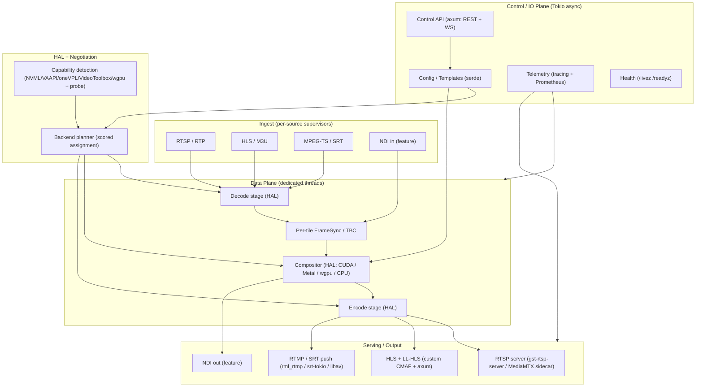
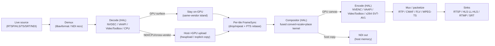

> **Design brief — Core Engine.** Authoritative research/design record backing the implementation. Produced by a verification-hardened multi-agent research workflow (2026-06-02). Canonical crate/API naming lives in [docs/architecture](../architecture/). ADRs derived from this brief are in [docs/decisions](../decisions/).

---

# MULTIVIEW — Architecture Brief

**Project:** Multiview — an efficient, hardware-accelerated, Rust-based live video multiview generator
**Status:** Authoritative architecture brief (source of truth for downstream docs/agent instructions)
**Platforms:** Linux (containerized, NVIDIA + Intel/AMD VAAPI) and macOS (native, Apple Silicon + Intel)
**Date:** 2026-06-02

---

## 1. Executive Summary

Multiview ingests multiple live video sources (RTSP, HLS/M3U, MPEG-TS, NDI, plus SRT/RTMP), composites them into a templated multiview (2x2, 3x3, 1-large+5-small, PiP, custom), and serves the result over RTSP, HLS/LL-HLS, NDI, and push (RTMP/SRT). The engine is a **hybrid**: it uses FFmpeg/libav for demux/decode/encode where libav is strongest, and **custom Rust + GPU-native code** for compositing and the serving/output side.

The design rests on a small number of decisive, verification-hardened conclusions:

1. **Keep frames on the GPU within a single vendor/device island.** The biggest performance lever is decode → composite → encode without a host round-trip. This is real and well-trodden **within one vendor**: NVDEC(CUDA) → CUDA kernel → NVENC on NVIDIA; VideoToolbox → IOSurface → Metal → VideoToolbox on Apple. **Cross-vendor zero-copy does not exist on desktop** (e.g. VAAPI-decode → NVENC-encode forces a system-memory copy; importing a foreign dma_buf into CUDA is Tegra-Thor-only). The architecture therefore treats each GPU vendor as a **zero-copy island** and budgets an explicit copy at any vendor boundary.

2. **Build the compositor as a custom, GPU-API-native stage, not an FFmpeg filter graph.** FFmpeg has **no** `xstack_cuda`/`hstack_cuda`/`vstack_cuda` (only chained two-input `overlay_cuda`); Intel has `xstack_qsv`/`xstack_vaapi` but NVIDIA does not, and none of the FFmpeg stack filters do per-cell fit/cover/crop. Owning the compositor in Rust+CUDA/Metal/wgpu is the project's core differentiator and the clean way to support fit modes, asymmetric layouts, gaps, and borders.

3. **Per-stage backend auto-negotiation is real and matches industry practice**, but the engineering risk lives entirely at the **cross-backend seams**. The negotiator strongly prefers single-vendor pipelines and treats any vendor/device boundary as an explicit, costed `av_hwframe_transfer_data` (host) copy.

4. **FFmpeg is the libav binding via `rsmpeg`** (the only mainstream binding with safe wrappers for the full hwaccel lifecycle plus shipped hw examples), with raw `ffi::` access for custom zero-copy frame pools. The default build is **LGPL-clean and redistributable**: NVENC/NVDEC via `nv-codec-headers` (MIT, `--enable-ffnvcodec`) need neither `--enable-gpl` nor `--enable-nonfree`; we avoid `libnpp`/`scale_npp` (nonfree) and x264/x265 (GPL) in the default build and do scaling/compositing in-house.

5. **NDI is first-class but isolated.** It is proprietary/royalty-free with mandatory attribution; the build-time-linked binding (`grafton-ndi`) means NDI must be feature-gated, and for a runtime-optional capability we provide a `NDIlib_v6_load()` dynamic-load backend. NDI frames are host-memory, so there is always one host→GPU upload at the NDI boundary.

6. **RTSP serving:** primary path is in-process **`gst-rtsp-server`** (via `gstreamer-rtsp-server`) fed pre-encoded NAL units through `appsrc → h264parse → rtph264pay` (no re-encode), with **MediaMTX as an optional sidecar** for unified multi-protocol fan-out. **LL-HLS must be custom-built** (FFmpeg's `hls` muxer cannot emit Apple LL-HLS); we reuse a Rust playlist crate for the tag layer and own the CMAF segmenter + blocking-reload HTTP server.

7. **Compositor cadence is deadline-driven, never wait-for-all-inputs** (mirroring `GstAggregator`). One stalled source must never freeze the multiview. Independent sources drift; continuous video drop/repeat + adaptive audio resample is mandatory.

The multiview's own controllable latency budget is ~50–250 ms; the output protocol dominates end-to-end latency (RTSP/SRT sub-second to a few seconds; LL-HLS ~2–5 s; classic HLS 6–30 s).

---

## 2. Goals & Non-Goals

### Goals
- Lowest practical glass-to-glass latency for live multiviews.
- Highest input density / throughput per GPU; decode-heavy, encode-light (encode the composed multiview **once** per output, not per tile).
- Full hardware acceleration of decode + composite + encode, **modular** with per-stage backend auto-negotiation.
- Zero-copy on-GPU end-to-end **where the hardware allows** (single-vendor islands).
- First-class NDI input and output, respecting NDI licensing.
- Declarative, hot-reconfigurable templated layouts.
- Linux (containerized) + macOS (native) only.
- Redistributable LGPL-clean default build; GPL/nonfree/NDI strictly opt-in.

### Non-Goals
- Windows support.
- Sub-second WebRTC output in v1 (WebRTC is the only sub-second protocol; deferred, architecture leaves room).
- Cross-vendor on-GPU zero-copy (proven not to exist on desktop — explicitly out of scope).
- Per-tile re-encode/ABR-per-tile (session-cap and bandwidth hostile).
- A general-purpose NLE/switcher feature set (Multiview is a headless, scriptable compositor/router).
- Statically baking the proprietary NDI SDK into a permissive repo (license-prohibited).

---

## 3. Glossary

- **Tile / Cell:** one source rendered into a sub-rectangle of the multiview canvas.
- **Canvas:** the output frame the multiview is composed onto (size/fps/pixel format/background).
- **Layout / Template:** declarative description of where tiles go (grid/asymmetric/PiP).
- **HAL:** Hardware Abstraction Layer — backend-agnostic traits per pipeline stage.
- **Backend:** a concrete per-vendor implementation of a stage (e.g. NVENC encoder, VAAPI decoder, Metal compositor).
- **hwaccel (FFmpeg):** generic path where a software-named decoder delegates to hardware via `AVHWDeviceContext` + `get_format` callback, yielding GPU-resident frames; supports software fallback.
- **AVHWFramesContext / AVHWDeviceContext:** libav structures describing the GPU frame pool and device.
- **sw_format:** the real memory layout (NV12/P010/…) behind an opaque hardware surface (`AV_PIX_FMT_CUDA`/`VAAPI`/`QSV`/`VIDEOTOOLBOX`).
- **Zero-copy island:** a single GPU vendor/device within which frames can move decode→composite→encode with no host copy.
- **FrameSync / TBC:** per-source time-base corrector that converts push delivery to pull and absorbs clock drift via drop/repeat (video) and resample (audio).
- **Deadline-driven compositor:** mixer that produces a frame at each fixed output deadline using whatever tiles are available (last-good frame for stalled tiles).
- **NV12 / P010 / P216 / UYVY:** YUV pixel layouts (8-bit semi-planar / 10-bit / 16-bit / packed 4:2:2).
- **NDI redistributable:** the proprietary NDI runtime library bundled with the app under NDI's EULA.
- **LL-HLS:** Apple Low-Latency HLS (EXT-X-PART partial segments, preload hints, blocking playlist reload).
- **SFE:** NVIDIA Split-Frame Encoding (single high-res stream across multiple NVENC engines; HEVC/AV1, Ada+).

---

## 4. High-Level Architecture

Multiview is a layered Rust workspace: an unsafe `-sys`/FFI tier, a safe RAII wrapper over libav, a backend-agnostic HAL/core, vendor backend impls behind feature flags, and leaf crates for ingest, compositing, serving, config, control, and telemetry. A **control/IO plane** (Tokio async) handles networking and the control API; a **data plane** (dedicated threads) runs the codec/composite hot path.



---

## 5. End-to-End Media Pipeline Data Flow

Each source runs an isolated decode→FrameSync chain feeding a single deadline-driven compositor; the composed canvas is encoded once per output codec/profile and fanned out to sinks.



**Key invariants:**
- On-GPU path holds only when decode, composite, and encode are on the **same physical device** (matched by PCI bus id / UUID / IOKit id).
- Any cross-vendor or NDI/CPU boundary inserts exactly one explicit copy; the planner accounts for its latency/bandwidth cost.
- `get_format` is treated as a re-negotiation hook: geometry/`sw_format` may change mid-stream; the compositor re-imports textures on change.
- The compositor never blocks waiting for all tiles; stalled tiles render last-good frame, then a "no signal" placeholder after a stale timeout.

---

## 6. Hardware Abstraction Layer & Per-Stage Backend Negotiation

### 6.1 Stage traits

The HAL defines a trait per pipeline stage, each with multiple feature-gated impls. Stages are negotiated **independently**, but the planner heavily penalizes cross-vendor stage boundaries.

- `Demuxer`, `Decoder`, `Compositor`, `Encoder`, `Muxer/Output`.
- A backend-tagged `FrameHandle` enum carries the concrete surface type (CUDA `CUdeviceptr` + pitch, `VkImage`/wgpu `Texture`, `IOSurface`/`MTLTexture`, or host buffer), plus color matrix/range/`sw_format`/geometry metadata. Channels carry handles, never pixels.

### 6.2 Three-layer capability detection

(Pattern proven by OBS, GStreamer, Norsk.)

- **L1 — Portable baseline (FFmpeg):** `av_hwdevice_iterate_types`, `av_hwdevice_ctx_create` (probe device init), `avcodec_get_hw_config` per codec. Coarse but vendor-agnostic.
- **L2 — Vendor deep queries:**
 - NVIDIA encode: `NvEncGetEncodeCaps`/`NV_ENC_CAPS` (needs an open session) for max width/height/level, AV1/HEVC/4:2:2; `NvEncGetEncodeGUIDs` for codec enumeration. **NVML CANNOT report codec/resolution capability** — it gives only sessions/utilization/capacity. NVIDIA decode: `cuvidGetDecoderCaps`/`CUVIDDECODECAPS` (needs CUDA context).
 - Intel: oneVPL `MFXLoad` + `MFXQueryImplsDescription` (query-before-init).
 - Linux open path: VAAPI `vaQueryConfigProfiles`/`vaQueryConfigEntrypoints` (cros-libva).
 - macOS: `VTCopyVideoEncoderList` (+ HW flag), `VTIsHardwareDecodeSupported(codec)`. No max-resolution query → probe.
- **L3 — Sandboxed probe:** open a tiny encode+decode session at target resolution in a subprocess (OBS model) to catch driver mismatch and session-cap exhaustion. Cache results keyed by (GPU model + driver/SDK version + OS); invalidate on driver/OS change.

Devices are correlated across NVML / VAAPI DRM node / oneVPL / wgpu adapter by **PCI bus id / UUID / IOKit id** so the planner knows when decode+composite+encode are the same physical device (the precondition for staying on-GPU). NVML enumeration order is not stable across reboots — never key by index.

### 6.3 Scoring / planning algorithm

Model as a constrained assignment: nodes = {decode, composite, encode} per stream/output. Each candidate backend per node carries:
- a static **rank** (the prior, per (vendor, stage, codec)),
- a measured capability/cost,
- **hard constraints** (codec/resolution support; NVENC session budget).

Objective: minimize total cost where **crossing a vendor/device boundary between adjacent stages adds a large copy penalty** and exceeding a per-engine session budget is a hard constraint.

```
plan(stream):
 candidates = {stage: [backends compiled-in AND probed-available]}
 for each full assignment a in candidates:
 cost(a) = Σ stage_rank_cost
 + Σ boundary_penalty(stage_i.device, stage_{i+1}.device) # 0 if same device
 + session_budget_violation(a) ? +∞ : 0
 + capability_violation(a) ? +∞ : 0
 if a stays on one device end-to-end: large bonus (prefer zero-copy island)
 choose argmin cost(a)
 insert explicit hwtransfer node at any device boundary that survives
```

Defaults: keep a stream's full decode→composite→encode on one device; only split across vendors when a hard constraint forces it (session cap, codec absent on that device, capacity). Software is the universal fallback tier.

### 6.4 Per-platform backend matrix

| Platform | Decode (priority) | Composite | Encode (priority) | On-GPU zero-copy? |
|---|---|---|---|---|
| **Linux NVIDIA** | NVDEC (cuda hwaccel) → CPU | **Custom CUDA kernels** (fused convert+scale+place) | NVENC → x264/SVT-AV1 (GPL/perm feature) | **Yes** NVDEC→CUDA→NVENC (single CUDA context) |
| **Linux Intel/AMD** | VAAPI (root) / QSV(oneVPL derived from VAAPI) → CPU | **Vulkan (ash) or libplacebo** via DRM-PRIME/dma-buf; CUDA N/A | VAAPI (`low_power`) / QSV → x264/SVT-AV1 | **Yes within VAAPI/Vulkan** via dma-buf (modifier+sync sensitive) |
| **macOS (Apple Silicon + Intel)** | VideoToolbox → CPU | **Metal compute** (import CVPixelBuffer/IOSurface via CVMetalTextureCache) | VideoToolbox → x264/SVT-AV1 | **Yes** VT→IOSurface→Metal→VT (cleanest path) |
| **CPU / software (any)** | dav1d/native libav decode | CPU/SIMD or wgpu portable | x264 / SVT-AV1 / native AAC | N/A (host memory) |

Notes: macOS has **no** CUDA/NVENC/VAAPI — VideoToolbox/Metal is the only HW path. AV1 HW decode requires Ampere+/Arc/RDNA2+/M3+; AV1 HW encode requires Ada+/recent Intel/AMD; runtime-probe, never assume. Software AV1 = SVT-AV1 (presets 8–12) for real-time at modest res.

### 6.5 Fallback rules

- Use the **generic internal hwaccel decode path** (software-named decoder + `hw_device_ctx` + `get_format`), NOT `*_cuvid`/`*_qsv` wrapper decoders, because only the generic path supports automatic software fallback and uniform negotiation.
- If a hardware stage fails to init or its device is absent at runtime → fall to the next-ranked backend, ultimately CPU.
- If NVENC session budget is exhausted → fall back to CPU encode for overflow outputs or reduce renditions; **never** depend on the unofficial nvidia-patch in a redistributable product.
- AV1 hardware absent → route AV1 to dav1d (decode) / SVT-AV1 (encode), or downgrade output codec to H.264 (interop baseline).

---

## 7. Zero-Copy GPU Memory Strategy (verification-hardened)

This section states clearly which paths are **truly zero-copy** vs **require a copy**, per adversarial verification.

### Truly zero-copy (same-vendor island)
- **NVIDIA NVDEC → CUDA composite → NVENC.** NVDEC frames are `AV_PIX_FMT_CUDA` with `data[i]` = `CUdeviceptr` (pitch in `linesize[i]`). A custom CUDA kernel reads them directly; NVENC consumes externally-allocated CUDA surfaces via `NvEncRegisterResource` (`NV_ENC_INPUT_RESOURCE_TYPE_CUDADEVICEPTR`). **Constraints (validated against SDK headers):** emit NV12 or YUV420_10BIT (P010-equivalent); pitch must be a multiple of 4 (use `cuMemAllocPitch`); CUarray inputs need `CUDA_ARRAY3D_SURFACE_LDST`; register-once + map-per-frame (cache registrations). All stages must share **one CUDA context**; the decoder's `AVHWFramesContext`/`AVCUDADeviceContext.cuda_ctx` is shared with the compositor and encoder. Keeping `AV_PIX_FMT_CUDA` end-to-end (and never calling `av_hwframe_transfer_data`) avoids the ~2× PCIe penalty.
- **Apple VideoToolbox → Metal → VideoToolbox.** Decoded frames are IOSurface-backed `CVPixelBufferRef` (`AVFrame.data[3]`). `CVMetalTextureCacheCreateTextureFromImage` maps them to `MTLTexture`(s) at zero cost (NV12 = two planes: R8 luma + RG8 chroma). Encode output frames come from the VT compression session's `CVPixelBufferPool` so the composited render target is the same surface the encoder reads. Must keep IOSurface use-counts so the pool doesn't recycle a surface Metal is still using. This is the **lowest-risk** zero-copy backend.
- **Linux VAAPI/QSV → Vulkan/OpenGL** via DRM-PRIME/dma-buf (`av_hwframe_ctx_create_derived` + `av_hwframe_map(AV_HWFRAME_MAP_DIRECT)`). **Correctness-fragile:** depends on DRM format-modifier (tiling) negotiation and explicit cross-API synchronization (foreign-queue ownership `VK_EXT_queue_family_foreign`, dma-buf implicit fence → Vulkan semaphore). Validate empirically per driver; keep a copy fallback.

### Requires a copy / not zero-copy
- **Any cross-vendor boundary** (e.g. Intel/VAAPI decode → NVENC encode). `av_hwframe_map` only aliases compatible **same-device** contexts; otherwise it falls back to `av_hwframe_transfer_data` through host RAM. **Importing a foreign dma_buf into CUDA as an image is Tegra-Thor-only — impossible on desktop NVIDIA.** Treat every vendor boundary as one explicit host (or staged) copy.
- **CUDA → wgpu(Vulkan).** wgpu has **no stable public external-memory import API** (issues #2320 open, #965 closed-not-planned). Zero-copy requires the unstable `wgpu-hal` layer (`create_texture_from_hal`/`texture_from_dmabuf_fd`/`add_wait_semaphore`) below wgpu plus raw Vulkan external memory + CUDA-Vulkan interop (exported FDs, external semaphores, **`VK_IMAGE_TILING_OPTIMAL` + dedicated allocation + matching device UUID**). On NVIDIA we therefore prefer a **CUDA-native compositor** rather than routing NVDEC output through wgpu; the portable wgpu compositor is the default for the non-NVIDIA/portable tier and accepts a copy on the CUDA seam if used there.
- **NV12 on wgpu Metal backend is unsupported** (issue #6921 not-planned). On macOS, do NOT assume a single `TextureFormat::NV12` across backends; import the two IOSurface planes as separate textures (R8/Rg8) and convert in WGSL, or use native Metal. (This is why macOS uses native Metal compute for the fast path.)
- **NDI** delivers/accepts frames in **host memory** (UYVY/P216/BGRA). There is always at least one host→GPU upload on NDI in and one GPU→host copy on NDI out. "Zero-copy" for NDI receive means avoiding the *extra* CPU memcpy (read the SDK-owned borrowed buffer directly into the upload), not avoiding the PCIe upload.

**Architectural rule:** never architect for cross-vendor on-GPU zero-copy; design each vendor as an isolated zero-copy island; pin each pipeline to one device where possible; probe dma-buf/external-memory interop at runtime before relying on it.

---

## 8. Subsystem Designs

### 8.1 Decode subsystem
- Generic internal hwaccel path keyed off `avcodec_get_hw_config`, ranked per stream, software fallback always available.
- `get_format` callback (unavoidably `unsafe extern "C"`, runs on the decode thread) selects the hw pixel format, returns `AV_PIX_FMT_NONE` on failure (returning a software format silently disables HW), and (re)builds `AVHWFramesContext` on every call to handle mid-stream resolution/profile changes — optionally attaching an app-managed frame pool shared with the compositor.
- `rsmpeg` provides safe wrappers (`AVHWDeviceContext::create`, `set_get_format`, `set_hw_device_ctx`, `hwframe_transfer_data`); raw `ffi::` is used for `av_hwframe_ctx_alloc`/`av_hwframe_map` and custom pools. An `unsafe` boundary module owns all raw FFI.
- Branch on `sw_format` (NV12 vs P010/P016) for plane layout and bit depth. Normalize extradata (h264_mp4toannexb, extract_extradata) for TS/SRT/RTMP elementary streams, esp. for VideoToolbox.

### 8.2 Compositor subsystem
- `Compositor` trait: input = list of `{FrameHandle, src_rect, color_space/range}` + `Layout`; output = a GPU canvas frame. Three implementations behind a backend-tagged handle:
 - **CudaCompositor:** custom fused kernels (NV12/P010 → linear-light → scale → place) in one launch per output; minimizes passes/PCIe traffic. NPP/CV-CUDA only as reference building blocks.
 - **MetalCompositor:** Metal compute shaders importing IOSurface-backed textures.
 - **VulkanCompositor (portable):** hand-written `ash` or **libplacebo** (mature gamma-correct Lanczos/Jinc scaling, YUV↔RGB, multi-input compositing; LGPLv2.1+; on macOS only via MoltenVK). wgpu/WGSL is the portable default for compute math but carries the NV12-on-Metal and external-memory-import caveats above.
- Resampling in **linear light**; selectable kernels: bilinear (hardware sampler) for PiP/small tiles, separable Lanczos (or libplacebo Jinc) for primary tiles. Color matrix (BT.601/709/2020) and range (limited/full) carried as explicit per-source metadata and applied with the matching inverse (the #1 silent bug class). Fit modes lower to (src-rect, dst-rect) pairs.
- Fuse passes: one launch reads N sources and writes the whole canvas. Each tile keeps a retained last-good GPU surface (VRAM budget per tile).

### 8.3 Encode subsystem
- `Encoder` trait, negotiated independently of decoder. Priority: Linux/NVIDIA → NVENC; Linux/Intel → QSV(oneVPL)→VAAPI; Linux/AMD → VAAPI; macOS → VideoToolbox; everywhere → x264 (and SVT-AV1 for software AV1).
- **One canonical low-latency profile across all backends:** CBR, B-frames=0 (IPPP), lookahead=0, single-pass, small VBV (~bitrate/fps), periodic forced-IDR or intra-refresh, zero reorder delay. NVENC: `tune=ll/ull`, `-rc cbr`, `-bf 0`, `-rc-lookahead 0`, `-multipass disabled`, `enableFillerDataInsertion=1`. x264: `-tune zerolatency`. VideoToolbox: `EnableLowLatencyRateControl` + `RealTime` (H.264 low-latency mode is H.264-only and incompatible with explicit CBR — choose one; HEVC low-latency on macOS unconfirmed → plan H.264 for the mac low-latency path). Optional opt-in "quality/VOD" profile re-enables B-frames + lookahead.
- **Density is bounded by physical NVENC chips, not the session-count headline.** Most GeForce SKUs have a **single** NVENC; top consumer cards have 2 (RTX 5090 = 3). A single stream cannot exceed one NVENC's throughput without SFE (HEVC/AV1, Ada+). Encode the multiview **once** per output; schedule encode jobs against active NVENC count; the per-system concurrent-session cap is **12** (since Nov 2025; was 8) on consumer GeForce, unlimited on datacenter/Quadro — detect at runtime, treat as a hard constraint.
- H.264 is the mandatory interop baseline (RTSP/RTMP/SRT). HEVC/AV1 are runtime-feature-detected upgrades for HLS/LL-HLS-capable players.

---

## 9. Input Sources & Output Sinks

### 9.1 Inputs
- **Primary ingest backend: `rsmpeg` over libavformat** for RTSP, HLS/M3U, MPEG-TS, and SRT (one `AVFormatContext` code path).
- **Optional pure-Rust RTSP backend: `retina`** behind the same `LiveSource` trait, default RTP-over-TCP (its lack of a reorder buffer is moot over TCP; use FFmpeg for lossy UDP RTSP).
- **RTSP tuning:** force `rtsp_transport=tcp`/`prefer_tcp`; set `timeout` + an **`AVIOInterruptCB`** (mandatory). **Note:** the interrupt callback and `timeout` do NOT bound synchronous DNS (`getaddrinfo`); add an outer watchdog (async/pre-resolved DNS or a recyclable worker thread). `reorder_queue_size`/`max_delay` tune jitter vs latency.
- **HLS:** `reconnect=1`, `reconnect_at_eof=1`, `reconnect_streamed=1`, `http_persistent=1`, `live_start_index` at live edge.
- **MPEG-TS/SRT:** `scan_all_pmts`; SRT `latency` is in **microseconds**; verify `ffmpeg -protocols` lists `srt` (SRT silently 404s if libsrt isn't linked — the once-claimed `--enable-shared` conflict is a misdiagnosed pkg-config issue, **not** a real FFmpeg limitation; Homebrew ships shared FFmpeg with SRT by default).
- **NDI in:** via `grafton-ndi`, each source wrapped in a per-source **FrameSync** (drop/repeat video + adaptive audio resample to master clock), zero-extra-copy borrowed receive into the GPU upload.
- **PTS rebasing is owned by the engine:** on first frame record (source_pts0, master_running_time0); handle 33-bit MPEG-TS PTS wrap (~26.5 h), HLS `EXT-X-DISCONTINUITY`, encoder restarts. Never feed raw cross-source PTS into one timeline.
- Each source runs its own task with bounded drop-oldest queues; `av_read_frame` on one source never blocks the composite loop.

### 9.2 Outputs
- **RTSP server (primary):** in-process `gst-rtsp-server` via the `gstreamer-rtsp-server` crate. Serve **pre-encoded** NAL units through `appsrc ! h264parse ! rtph264pay name=pay0` (h265parse/rtph265pay for HEVC) — **no GStreamer re-encode**. `appsrc` set `is-live=true`, `format=TIME`, correct PTS/duration; payloader named `pay0` (audio `pay1`); `config-interval=-1` for late joiners; `factory.set_shared(true)` so one encode fans out. h264parse handles avc↔byte-stream/au↔nal/SPS-PPS fixups (lightweight parsing, **not** decode/re-encode). Caveat: this pulls the GStreamer/GLib C stack and a GLib main loop (run on its own thread, bridged to Tokio). For a lean static binary, prefer the MediaMTX sidecar or a native-Rust RTSP path.
- **RTSP server (optional sidecar): MediaMTX** — single Go binary fanning one published source to RTSP/HLS/SRT/WebRTC/RTMP. Publish via libav RTSP/RTP or SRT. No in-process Go embedding API; it is a network-publish sidecar (one extra hop).
- **HLS + LL-HLS (custom Rust):** **CMAF-first** — encode once into fragmented MP4 via libav movenc (`-movflags cmaf+frag_custom+empty_moov+delay_moov`) and derive HLS, LL-HLS, and (optionally) DASH from one in-memory segment/part store. **FFmpeg's `hls` muxer cannot emit Apple LL-HLS** (`-lhls` is the legacy `EXT-X-PREFETCH` DASH variant). Reuse the **`hls-playlist`** crate for the tag layer (EXT-X-PART, PART-INF, SERVER-CONTROL with CAN-BLOCK-RELOAD + PART-HOLD-BACK, PRELOAD-HINT, RENDITION-REPORT, SKIP); **build in-house**: the CMAF segmenter (sub-second parts aligned to IDR/keyframe boundaries) and the LL-HLS HTTP server (axum/hyper) with blocking playlist reload (`_HLS_msn`/`_HLS_part` held requests), preload-hint byte-range responses, and chunked-transfer push of in-progress parts. Model on gohlslib (reference). Target ~2 s segments, ~200–300 ms parts, 2 s GOP, PART-HOLD-BACK = 3× PART-TARGET, HTTP/2. Keep a standard (longer-segment) HLS rendition for compatibility/DVR.
- **NDI out:** single Sender publishing the composited multiview (host-memory copy from GPU canvas). `color_format_fastest` (UYVY/UYVA) for latency or `_best` (P216/PA16, HDR) for quality. NDI Advanced SDK (compressed HX H.264/HEVC) is a **separate paid** path, feature-gated.
- **RTMP/SRT push:** native `rml_rtmp` (FLV/H.264+AAC) and `srt-tokio` (MPEG-TS, caller, encryption, streamid), with **libav `rtmp://`/`srt://` output as the default-reliable fallback** (interop with arbitrary endpoints). SRT `srt-tokio` interop with reference libsrt must be validated per destination.

---

## 10. NDI Integration & Licensing Handling

- **Binding:** `grafton-ndi` (Apache-2.0, NDI 6) — covers Finder/Receiver/Sender/FrameSync/audio/PTZ/tally + Advanced-SDK hooks, with borrowed (zero-extra-copy) receive and async send.
- **Build-time linkage caveat (verified):** `grafton-ndi`'s `build.rs` emits `cargo:rustc-link-lib=dylib=ndi` and bindgens the SDK headers at **build time**, and panics without the SDK. Therefore NDI is **feature-gated** (`ndi`), and for a truly runtime-optional, build-without-SDK capability we provide a **`NDIlib_v6_load()` dynamic-load backend** (libloading + vendored MIT headers). (Note: NDI 6 uses `NDIlib_v6_load`, not v5.)
- **Licensing (verified against the EULA):** the NDI SDK is **proprietary and royalty-free**, NOT open-source. You may redistribute the **unmodified runtime** bundled in your app folder (not system paths) and must keep versions current (SDK <30 days old at release per §2b); you may **not** relicense, modify, reverse-engineer, or vendor the SDK source into a permissive repo, and your product EULA must flow down NDI's no-modify/no-reverse-engineer terms (§3d). Mandatory: link to ndi.video near NDI uses, About-box notice **"NDI® is a registered trademark of Vizrt NDI AB"**, and you must contact NDI to put "NDI" in the product name.
- **HX (compressed) NDI** needs the **Advanced SDK** (separate commercial license; you are responsible for H.264/H.265/AAC codec royalties) — a distinct opt-in distribution.
- **Density note:** Full NDI (SpeedHQ) is ~125–250 Mbps per 1080p60 stream and decodes on CPU/SIMD; dense NDI ingest is network- and CPU-bound, not GPU-bound — plan 10/25GbE and budget CPU decode.

---

## 11. Synchronization & Timing Model

- **One master output clock** (`CLOCK_MONOTONIC_RAW` on Linux / `mach_continuous_time` on macOS, or the output device clock) and a **fixed rational output cadence** (e.g. 60000/1001) to avoid rounding drift. Sources are paced to it, never locked to it.
- **Per-tile FrameSync/TBC** (NDI framesync / broadcast TBC model): converts push to pull, exposes "give me the frame valid at running_time T", absorbs jitter (small per-tile buffer; RTP jitterbuffer default 200 ms is far too high — tune to 30–100 ms LAN), and absorbs **inevitable crystal drift** (e.g. 48000 vs 48001 Hz) via continuous video drop/repeat and adaptive high-order audio resampling. There is **no genlock/PTP** over arbitrary RTSP/HLS/RTMP; RTCP SR / TS PCR / NDI timestamps let you *measure* drift but do not phase-lock oscillators. Align-once-at-startup **will** glitch within minutes — continuous correction is mandatory.
- **Deadline-driven compositor:** at each output deadline, sample each tile's newest frame with running_time ≤ T; hold-last-frame for stalled/jittery tiles, drop intermediates for over-rate tiles, switch to placeholder/last-good-with-overlay after a configurable stale timeout. **Never wait-for-all-inputs** (one dead RTSP camera would freeze the whole multiview). This mirrors `GstAggregator` `get_next_time()` + timeout; note the framework's *default* is wait-for-all, so the deadline path must be deliberately engineered as the primary mode.
- **Audio:** carry each source's audio through the same PTS rebasing as its video; mix/select and adaptively resample to the master clock (libswr/aresample async). Keep AV skew within ±1–2 output frames (human tolerance ~ −45 ms audio-late to +125 ms audio-early; never let audio get ahead of video).
- **Latency budget (multiview-controllable):** per-tile jitter 30–100 ms (LAN) + HW decode ~1 frame + composite 1–2 frames (~17–40 ms) + low-latency encode → **~50–250 ms**. The **output protocol dominates** glass-to-glass: RTSP/SRT/RTMP sub-second to a few seconds; LL-HLS ~2–5 s; classic HLS 6–30 s. Sub-second requires WebRTC (out of v1 scope).
- A high-latency/flaky tile is treated as **leaky** (drop/hold), contributing via MIN not MAX, so the worst source never inflates or stalls the multiview (GStreamer latency math: global latency = MAX(min) and is infeasible if it exceeds MIN(max)).
- Timing buffers are **orthogonal to memory placement**: zero-copy GPU compositing still needs per-tile last-frame caches and deadline sampling.

---

## 12. Concurrency / Threading Model

- **Two planes (hybrid, NOT pure-Tokio).**
 - **Data plane:** dedicated OS threads (small fixed pool, optionally pinned + RT priority on Linux) for decode-driving, compositor, encode. Codec/CUDA/VideoToolbox calls are long synchronous calls that must never run on Tokio workers.
 - **Control/IO plane:** Tokio for network ingest/egress (RTSP/HLS/SRT/RTMP), HTTP control API, orchestration.
- **One decode actor per source** feeding a small **bounded, drop-oldest (leaky-downstream)** queue (mirrors GStreamer `queue leaky=downstream`). Per-source isolation prevents head-of-line blocking.
- **Channels carry ref-counted pooled frame handles, never pixels.** Default channel: **flume** (same channel works sync↔async, bridging data and control planes). Hottest SPSC hops: **rtrb/ringbuf** (wait-free, allocation-free). Sync MPMC/select: **crossbeam-channel**. Keep crossbeam as a fallback (flume is in casual maintenance).
- **Frame buffers from per-device pools** (GPU memory pools / `CVPixelBufferPool` on macOS / object pools for host staging); allocate at start, never per-frame. A dropped handle returns its buffer to the pool via `Drop` (avoid running the drop inside a Tokio async destructor). `AVFrame` is a clone-by-ref RAII type (`av_frame_ref`/`av_frame_unref`), enabling a source frame to feed multiple tiles without copy.
- **GPU concurrency:** one CUDA context per GPU shared by all sessions; one CUDA stream per decode/encode session + a compositor stream, synchronized with events; the NVIDIA driver load-balances multiple NVDEC/NVENC engines. On Apple: multiple Metal command queues + `CVMetalTextureCache`, synced via command-buffer completion handlers.
- **FFI thread-safety:** libav context wrappers are **`Send` + `!Sync`** (or Mutex-guarded); distinct contexts on distinct threads are fine, per-context access must be synchronized. Internal frame-threading callbacks can fire from multiple threads — expose frames only after the decoder yields ownership.
- Thread pinning (`core_affinity`) and RT priority (`thread-priority`/SCHED_FIFO on Linux; QoS on macOS) are an **optional tuning layer** behind a platform trait (SCHED_FIFO needs CAP_SYS_NICE and is absent on macOS — correctness must not depend on it).

---

## 13. Template / Layout System

Layered model: **Canvas → Layout → Cells → Overlays**, flattened by a resolver into an ordered `Vec<DrawQuad>{source_id, src_rect, dst_rect, z, alpha, fit, crop, transform}` that maps 1:1 onto any compositor backend.

- **Layout expressible three ways:** (a) named presets (`grid:2x2`, `grid:3x3`, `1+5`, `pip`), (b) CSS-grid-like tracks (fr/px/% columns+rows + `grid-template-areas` ASCII map + cell spans), (c) absolute normalized rects (for arbitrary PiP/overlap that grid can't express).
- **Fit modes** use CSS object-fit vocabulary `{fill, contain, cover, none, scale_down}` + an `align`/anchor (object-position). Cover/none crop the source (src-rect); contain/scale_down pad the destination (letterbox). Cell carries optional source-space crop and rotation (OBS bounds model).
- **The custom compositor owns all fit/cover/crop/gaps/borders/rounded-corners** — FFmpeg xstack has none of these (and tiles must be pre-scaled), and the base GStreamer `compositor`/`vacompositor` pads have only none/keep-aspect-ratio with no crop (only `glvideomixer` exposes per-pad crop). These features are shader src-rect/dst-rect math in our backend.
- **Overlays** are per-canvas/per-cell tagged-union items `{label, clock/timecode, image/logo, tally_border, box, meter}` with a 9-point anchor + normalized offset, z above the cell, optional data-binding (tally color from external state, clock strftime). Render via glyphon/vello (custom path) or drawtext/drawbox (FFmpeg fallback; requires libfreetype).
- **NDI bindings are by name** (`Machine (Source)`), with placeholder/offline-card fallback for unresolved sources.
- **Runtime relayout/source-swap** = apply a new config, diff resolved DrawQuads, atomically publish the new `Vec` (cheap on the custom compositor); transitions/keyframe-ready swaps avoid black flashes.

### Example config (TOML)

```toml
# multiview.toml
schema_version = 1

[canvas]
width = 1920
height = 1080
fps = "60000/1001" # rational to avoid drift
pixel_format = "nv12"
background = "#101014"

[layout]
# Asymmetric: 1 large + 5 small, via CSS-grid tracks + ASCII areas
kind = "grid"
columns = ["3fr", "1fr"]
rows = ["1fr", "1fr", "1fr"]
areas = [
 "big small1",
 "big small2",
 "big small3",
]

[[cells]]
area = "big"
z = 0
fit = "cover"
align = "center"
[cells.source]
kind = "rtsp"
url = "rtsp://cam-stage.lan/main"
transport = "tcp"

[[cells]]
area = "small1"
z = 0
fit = "contain"
[cells.source]
kind = "ndi"
name = "STUDIO (CAM 1)" # bound by NDI source name
fallback = "offline_card"

[[cells]]
area = "small2"
fit = "cover"
[cells.source]
kind = "srt"
url = "srt://ingest.lan:4201?mode=caller&latency=400000" # microseconds

[[cells]]
area = "small3"
fit = "cover"
[cells.source]
kind = "hls"
url = "https://origin.example/live/cam3/index.m3u8"

# Picture-in-picture overlay tile via absolute normalized rect
[[cells]]
z = 10
fit = "cover"
rect = { x = 0.72, y = 0.74, w = 0.25, h = 0.22 } # normalized 0..1
[cells.source]
kind = "rtmp"
url = "rtmp://ingest.lan/live/guest"

[[overlays]]
kind = "tally_border"
target = "big"
width_px = 6
color_binding = "tally://big" # driven by external state

[[overlays]]
kind = "clock"
anchor = "bottom_right"
offset = { x = -20, y = -16 }
format = "%H:%M:%S"

[[outputs]]
kind = "rtsp"
mount = "/multiview"
codec = "h264"
profile = "low_latency"

[[outputs]]
kind = "ll_hls"
path = "/hls/multiview"
codec = "h264"
part_target_ms = 250
segment_ms = 2000
gop_ms = 2000

[[outputs]]
kind = "ndi"
name = "MULTIVIEW OUT"
color = "fastest"
```

---

## 14. Configuration & Runtime Control API

- **Schema:** one set of serde structs with **adjacently-tagged enums** (`#[serde(tag="kind")]`) for source/overlay/fit unions (robust across TOML and JSON; never `untagged`). `schemars`-derived **JSON Schema** for editor validation; semantic checks via `garde`/`validator` (rects in 0..1, required cells non-overlapping, z sanity).
- **Formats:** TOML for human authoring; JSON canonical/over-the-wire. Layered config via `figment` (TOML + JSON + env overrides). Top-level `schema_version` + migration policy.
- **Control API (Tokio/axum):** REST for CRUD on layouts/sources/outputs and `apply`; WebSocket for live state (tile FPS, source up/down, tally) and push events. `apply` diffs resolved DrawQuads → drives input start/stop, RTSP pad add/remove (probe-blocked) or atomic quad-list swap, and output (re)config without full restart.
- Health server runs on a **separate port / lightweight runtime** so probes never contend with the video threads.

---

## 15. Observability

- **Tracing:** `tracing` + `tracing-subscriber`, `tracing-opentelemetry` (OTLP, batch span processor). Per-frame/per-tile spans for latency attribution (ingest→composite→encode). `tokio-console` (debug/staging) to surface task stalls and contended async locks.
- **Metrics:** `metrics` facade + Prometheus exporter. Counters (frames in/out, dropped, reconnects, encode errors); gauges (per-tile FPS, queue depth, VRAM, active encode sessions); histograms (decode/composite/encode + end-to-end latency, explicit buckets). Labels `{tile, source, backend, codec}` with bounded cardinality.
- **GPU telemetry behind a `GpuStats` trait** (non-portable!): NVIDIA = NVML (`nvml-wrapper`: encoder/decoder utilization, VRAM, sessions; **not** codec capability) or `dcgm-exporter` in fleets; **macOS = `macmon`/IOReport (GPU-busy%, power, frequency only — NO per-VideoToolbox-session stats)**, so macOS encode/decode timing is measured **in-process**; CPU = no-op. Selected by the same auto-negotiation as the codec backends.
- **Health endpoints:** `/livez` (in-process only — never checks GPU driver or upstream cameras, or it triggers restart loops) and `/readyz` (verifies ingest/backend init/output endpoints); optional `/startup` for slow GPU init.
- VRAM-trend soak monitoring is required to catch GPU surface leaks (Valgrind/ASan cannot see CUDA/Metal driver allocations).

---

## 16. Crate / Workspace Layout

Cargo workspace, `resolver = "2"` (mandatory so a Linux-only test/build dep can't leak into a macOS build). Two-tier libav binding + HAL + leaf crates + xtask. Mirrors the `gstreamer-rs` / `ffmpeg-sys-next`/`ffmpeg-next` layering.

| Crate | Responsibility | Key features |
|---|---|---|
| `multiview-sys` | All unsafe FFI; owns `rsmpeg`/`rusty_ffmpeg` raw access, NDI dlopen, CUDA/Metal/Vulkan interop primitives | `cuda`, `metal`, `vulkan`, `ndi` |
| `multiview-ffmpeg` | Safe RAII wrappers over libav (contexts `Send`+`!Sync`, `AVFrame` clone-by-ref, AVERROR→`thiserror`) | — |
| `multiview-core` (HAL) | Backend-agnostic stage traits, frame handle, pipeline graph, format/color types, negotiation planner. **No libav in public API.** | — |
| `multiview-compositor` | `Compositor` trait + CudaCompositor / MetalCompositor / VulkanCompositor(libplacebo/ash/wgpu); resolver DrawQuad→draw | `cuda`, `metal`, `vulkan`, `wgpu`, `cpu` |
| `multiview-io` | Ingest (RTSP/HLS/TS/SRT/NDI) + per-source FrameSync/supervisor | `ndi`, `srt`, `retina` |
| `multiview-server` | Output: RTSP (gst-rtsp-server), HLS/LL-HLS (custom CMAF + axum), NDI out, RTMP/SRT push | `gst-rtsp`, `ndi`, `ll-hls` |
| `multiview-config` | serde schema, JSON Schema (schemars), figment loading, validation | — |
| `multiview-control` | REST + WS control API (axum) | — |
| `multiview-telemetry` | tracing/OTEL, Prometheus, GpuStats trait + NVML/macmon impls, health | `nvml`, `macmon` |
| `multiview-cli` (bin) | Daemon/CLI; anyhow at this layer | rolls up platform feature sets |
| `xtask` | Build orchestration: fetch/compile LGPL FFmpeg with HW flags, fetch NDI SDK, codegen, container/macOS packaging | — |

**License-escalating features (additive, off by default, never alter public API):** `cuda`, `vaapi`, `qsv`, `videotoolbox`, `ndi`, `ndi-advanced`, `gpl-codecs`, `nonfree`. `cargo-deny` (deny.toml) gates licenses/advisories/bans/sources in CI; the effective license is reported **per built artifact**.

---

## 17. Build & Deployment

### Linux (containerized)
- Multi-stage build: stage 1 = `nvidia/cuda:*-devel-ubuntu24.04` to compile `nv-codec-headers`, an **LGPL-only** FFmpeg, and the Rust binary; final stage = `nvidia/cuda:*-runtime` (or `-base`). The **NVIDIA Container Toolkit injects** the host driver libs (`libnvidia-encode`/`libnvidia-decode`/`libcuda`) at runtime — the image ships none of them.
- **Two image variants:** (a) `nvidia` (CUDA base, NVENC/NVDEC/CUDA, amd64); (b) `generic` (slim base + VAAPI, amd64+arm64) using `/dev/dri` passthrough.
- **Runtime requirements (verified):** set `NVIDIA_DRIVER_CAPABILITIES=compute,utility,video` — **`video` is mandatory** for NVENC/NVDEC and is NOT in the default `utility,compute`; omitting it silently kills encode/decode while CUDA still works. Host driver must satisfy the Video Codec SDK the build targets (e.g. **SDK 13.0 → driver ≥ 570**; pin/record the `nv-codec-headers` SDK version and derive the minimum). The app **probes at startup** (`dlopen` `libnvcuvid`/`libnvidia-encode`, open throwaway sessions) and fails loudly / falls back to VAAPI/CPU.
- **VAAPI:** pass `/dev/dri`, add host render/video GIDs dynamically (`group_add $(getent group render | cut -d: -f3)`); GIDs vary per host — never hardcode.
- Multi-arch via `docker buildx`, prefer native runners over QEMU for the heavy FFmpeg compile.
- Prefer **dynamic linking** of FFmpeg (LGPL relink right); preserve the user's ability to replace `libav*` in the container.

### macOS (native)
- **No container GPU** — macOS is native-only. Build per-target (aarch64 + x86_64), `lipo` into a **universal2** binary, bundle LGPL `libav*` (and optional `libndi`) dylibs with `@rpath`/`@loader_path` install names, **inside-out codesign** every dylib + executable with **hardened runtime + secure timestamp and a consistent Team ID** (`codesign --deep` is unreliable), then `notarytool` + `stapler`. The pure-Rust `apple-codesign` (rcodesign) can sign/notarize from Linux CI.
- FFmpeg built `--enable-videotoolbox`; verify HW backends via `ffmpeg -hwaccels`/pkg-config.
- bindgen ≥ 0.70 (fixes aarch64-apple-darwin → clang arm64 target). libclang required on build hosts or ship pre-generated bindings.

---

## 18. Licensing Strategy & Build-Profile Matrix

Project license: **dual `MIT OR Apache-2.0`** (Rust standard; Apache patent grant + MIT GPLv2-compatibility — important because x264/x265 are GPLv2-or-later and Apache-2.0 alone is GPLv2-incompatible).

| Profile | Composition | Effective license / status |
|---|---|---|
| **default** | MIT/Apache project + dynamically-linked **LGPL-2.1** FFmpeg (no `--enable-gpl`, no `--enable-nonfree`; NVENC/NVDEC via MIT `nv-codec-headers`; **`scale_cuda` not `scale_npp`**) + MPL-2.0 libsrt + GnuTLS (LGPL TLS) | Redistributable, permissive/LGPL-clean |
| **+gpl** | + GPL FFmpeg with x264/x265 | Effective **GPL-2.0-or-later** (whole product) |
| **+nonfree** | + libnpp/scale_npp / FDK-AAC / OpenSSL | **NOT redistributable** — internal/personal use only |
| **+ndi** | + proprietary NDI runtime (royalty-free) | Permissive code + NDI EULA + mandatory attribution/branding |
| **+ndi-advanced** | + NDI Advanced SDK (HX H.264/HEVC) | Separate **paid** commercial license + codec royalties |

Rules: keep the default LGPL-clean; do scaling/compositing in-house (`scale_cuda` is the LGPL escape hatch for any GPU scaling needed); use native AAC + GnuTLS (avoid FDK-AAC/OpenSSL → nonfree, and mbedTLS → version3/LGPLv3); confine software x264/x265 to the `+gpl` variant; build FFmpeg yourself (distro FFmpeg may already be GPL/nonfree); verify `ffmpeg -buildconf` shows no `--enable-gpl`/`--enable-nonfree`/`--enable-libnpp`/`--enable-cuda-nvcc`. Codec **patent** licensing (H.264/HEVC/AAC pools) is a separate question from software copyright and may apply to outputs regardless of build flags.

---

## 19. Testing & Benchmarking

- **Synthetic sources:** FFmpeg lavfi (`testsrc`/`testsrc2`/`smptebars`) for every res/fps/pixfmt; **MediaMTX + looped `ffmpeg -re`** to simulate live RTSP/SRT/RTMP and validate egress.
- **Golden-frame:** exact `framemd5`/`framehash` ONLY for the **deterministic CPU/software** compositor on a **pinned CPU architecture** with order-stable, FMA-free (or integer) math; GPU encode output is **not** bit-exact across GPU/driver/FFmpeg versions → use **SSIM/PSNR** thresholds (align by PTS: `setpts=PTS-STARTPTS` + matching fps).
- **Benchmarks:** Criterion (criterion-rs v0.8+) with Throughput + BenchmarkGroups parameterized by layout/resolution/tile-count; `criterion-cuda` `CudaTime` for the CUDA kernel (default-stream caveat). End-to-end glass-to-glass harness: burn frame-id/timestamp at ingest, decode at each output, diff vs monotonic clock.
- **CI tiering:** software-backend full pipeline + golden + mocks on free GitHub runners (the CPU/software backend is the enabler); real GPU decode/composite/encode + SSIM/PSNR on GPU-tagged self-hosted runners (no free hosted GPU).
- **FFI soak:** hours-long runs under Valgrind (Linux) + ASan against looped sources, asserting flat RSS **and** VRAM trends (Valgrind can't see GPU allocations).
- Add a "no-fallback / stayed-on-GPU" assertion (count host↔device copies) so silent CPU/host fallbacks fail tests.

---

## 20. Phased Implementation Roadmap

- **M0 — Skeleton & HAL contracts.** Workspace, `resolver=2`, `multiview-sys`/`multiview-ffmpeg` with libav demux/decode/encode (software), HAL stage traits, frame handle, config schema + JSON Schema, CPU compositor, single RTSP-in → 2x2 → RTSP-out (software). *Exit:* end-to-end software multiview runs in GPU-free CI; golden-frame tests pass.
- **M1 — NVIDIA zero-copy island.** NVDEC hwaccel decode (cuda), custom CUDA compositor (fused convert+scale+place), NVENC encode, single shared CUDA context; "stayed-on-GPU" assertion. *Exit:* NVDEC→CUDA→NVENC zero-copy validated on real GPU; no host round-trip; latency within budget.
- **M2 — Apple zero-copy island.** VideoToolbox decode, Metal compute compositor via IOSurface/CVMetalTextureCache, VideoToolbox encode; universal2 build, signing/notarization. *Exit:* native macOS multiview, zero-copy VT→Metal→VT verified on Apple Silicon + Intel Mac.
- **M3 — Negotiation + capability detection.** L1/L2/L3 detection, device correlation by PCI/UUID, scored planner, software fallback, NVENC session budgeting. *Exit:* mixed-host auto-selects best per-stage backends; cross-vendor boundary inserts costed copy; graceful CPU fallback.
- **M4 — Ingest breadth.** RTSP (FFmpeg + retina), HLS, MPEG-TS, SRT with reconnect/interrupt-callback/DNS-watchdog, per-source FrameSync, PTS rebasing, deadline-driven compositor. *Exit:* one dead source never freezes multiview; multi-source drift held; survives PTS wrap/discontinuity.
- **M5 — Serving breadth.** gst-rtsp-server in-process serving (+ MediaMTX sidecar option), custom CMAF segmenter + LL-HLS playlists + blocking-reload HTTP server, RTMP/SRT push. *Exit:* RTSP/LL-HLS/RTMP/SRT outputs validated against real players; LL-HLS passes mediastreamvalidator; latency targets met.
- **M6 — NDI first-class.** grafton-ndi in/out behind feature + dynamic-load backend, FrameSync per NDI source, attribution/About-box, optional Advanced SDK profile. *Exit:* NDI in/out interop verified; license obligations in UI/docs; runtime-optional build without SDK works.
- **M7 — Linux Intel/AMD + portable compositor.** VAAPI/QSV decode+encode, Vulkan/libplacebo (or wgpu) compositor via dma-buf, container `generic` variant. *Exit:* full pipeline on Intel/AMD; dma-buf zero-copy validated per driver with copy fallback.
- **M8 — Hardening & observability.** Tracing/OTEL, Prometheus, GpuStats (NVML/macmon), health endpoints, soak/leak suite, benchmark dashboards, license CI (cargo-deny), build-profile matrix CI. *Exit:* production observability; clean soak; per-artifact license report.

---

## 21. Risks, Open Questions & Refuted/Uncertain Assumptions

### Load-bearing constraints (mitigations baked into the architecture)
- **No cross-vendor on-GPU zero-copy on desktop** (confirmed). Mitigation: zero-copy islands per vendor; explicit costed copy at boundaries; planner prefers single-device pipelines.
- **CUDA→wgpu has no stable zero-copy import; NV12 unsupported on wgpu Metal** (confirmed). Mitigation: CUDA-native compositor on NVIDIA, native Metal on Apple; wgpu/libplacebo only as the portable tier; pin wgpu and isolate any HAL interop behind the backend trait with a CPU-upload fallback.
- **NVENC density = physical NVENC chips, not the 12-session cap; most GeForce have 1 NVENC** (confirmed). Mitigation: encode multiview once; schedule against active NVENC count; CPU fallback for overflow; detect SKU per deployment.
- **FFmpeg has no CUDA stack filter; xstack has no fit/crop; GStreamer base compositor has no cover/crop** (confirmed). Mitigation: custom GPU compositor owns all layout/scaling/fit/crop.
- **FFmpeg `hls` muxer cannot emit Apple LL-HLS** (confirmed). Mitigation: custom CMAF segmenter + `hls-playlist` crate + custom blocking-reload HTTP server.
- **`grafton-ndi` links the NDI dylib at build time; NDI SDK is proprietary** (confirmed). Mitigation: feature-gate + `NDIlib_v6_load()` dynamic-load backend; never vendor SDK source; mandatory attribution.
- **`--enable-nonfree` ⇒ non-redistributable; `--enable-gpl` ⇒ whole product GPL** (confirmed). Mitigation: LGPL-clean default, `scale_cuda` not `scale_npp`, native AAC/GnuTLS, feature-gate GPL/nonfree.
- **NVIDIA Container Toolkit + `NVIDIA_DRIVER_CAPABILITIES=...,video` + matching driver are mandatory or HW silently disappears** (confirmed). Mitigation: bake caps into image ENV, startup probe + loud fail / VAAPI-CPU fallback, pin SDK→driver minimum.
- **libavformat `timeout`/interrupt-callback do NOT bound DNS** (confirmed, stronger than originally stated). Mitigation: outer per-tile watchdog with async/pre-resolved DNS or recyclable worker thread.
- **Independent sources drift; align-once breaks within minutes; deadline-driven (not wait-for-all) compositor mandatory** (confirmed). Mitigation: per-tile FrameSync with continuous drop/repeat + adaptive resample; deadline mixer.

### Refuted assumptions (corrected)
- **"`--enable-libsrt` conflicts with `--enable-shared`"** — REFUTED. It was a misdiagnosed pkg-config/static-link issue; Homebrew ships shared FFmpeg with SRT by default. Mitigation: just verify `ffmpeg -protocols` lists `srt` and ensure `srt.pc` is on `PKG_CONFIG_PATH`.
- **"No Rust crate emits standards-compliant LL-HLS"** — REFUTED. `hls-playlist` (serialize-complete, all LL tags) and `shiguredo_m3u8` exist. Mitigation: reuse `hls-playlist` for the tag layer; only the segmenter + blocking-reload HTTP server remain custom.
- **"GeForce NVENC session cap is 8"** — outdated; it is **12** since Nov 2025 (consumer, per-system; unlimited on datacenter). Mitigation: detect at runtime, don't hardcode.

### Open questions (require empirical validation on target hardware)
- Does the current NVIDIA production driver still need a device-to-device copy workaround for NVDEC/CUDA → Vulkan, or can a single shared allocation alias reliably? (Affects whether any NVIDIA→Vulkan path is viable; default plan avoids it.)
- Real-world per-GPU decode/encode density at target resolutions for representative source mixes (must be benchmarked, not assumed).
- Does VAAPI↔Vulkan (and QSV/AMF) dma-buf mapping stay truly zero-copy for P010 10-bit on target drivers, or copy?
- Is VideoToolbox AV1 decode production-stable on M3/M4 in the pinned FFmpeg (8.0+), or keep dav1d fallback on macOS? (AV1 HW decode is M3+ only; first stable in FFmpeg 8.0.)
- Does macOS extend VideoToolbox low-latency rate control to HEVC, or is the low-latency path H.264-only? (Default plan: H.264 for mac low-latency.)
- Exact NDI Advanced SDK commercial terms/cost and whether they permit the intended container + macOS-native redistribution model.
- `srt-tokio` interop reliability vs reference libsrt for arbitrary SRT receivers (else default to libav SRT egress).
- Maturity of FFmpeg 8.x Vulkan-native encode (esp. H.264/HEVC) per vendor — keep as probe-and-fallback, not a default backend.
