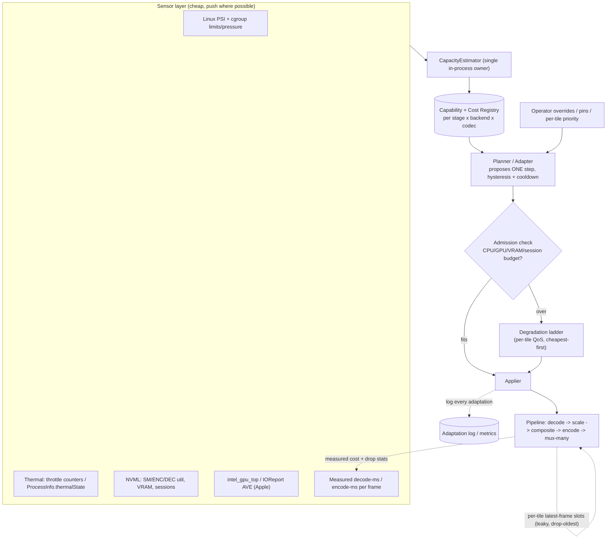

> **Design brief — Efficiency.** Authoritative research/design record backing the implementation. Produced by a verification-hardened multi-agent research workflow (2026-06-02). Canonical crate/API naming lives in [docs/architecture](../architecture/). ADRs derived from this brief are in [docs/decisions](../decisions/).

---

# Efficiency Brief: Live Video Multiview on Constrained Commodity Hardware

> **Authoritative efficiency brief for the Multiview engine.** This is the source of truth that downstream agents expand into repo docs. Where research and adversarial verification disagreed, the verification wins and is noted inline. The single governing constraint: **make an N-tile live multiview run well on a single entry/old GPU, an Intel iGPU (QSV/VAAPI), an AMD APU, a base Apple-silicon Mac, and low-RAM/few-core boxes.** A 4-GPU/1TB server is out of scope as a target — it is merely the trivial case.

---

## 1. Efficiency philosophy & guiding principles

1. **Bandwidth and memory are the wall, not compositor arithmetic.** A multiview is just sample-scale-into-a-grid; that math is cheap. On every commodity tier — and *especially* on iGPUs/APUs/Apple-silicon where the GPU shares DDR with the CPU — the binding resource is **memory bandwidth** and **VRAM/RAM footprint**, followed by fixed-function decode/encode throughput. Optimize bytes moved before optimizing FLOPs.
2. **Pixels you never materialize cost nothing.** The biggest single win is to **never decode or carry a tile at more pixels than it is displayed**, and to **never expand to RGBA**. Both reductions are quadratic/multiplicative across N tiles.
3. **Encode is the most expensive and most capacity-capped stage.** Composite once, encode the canvas once, and fan the *same compressed bitstream* out to many transports. Per-output or per-tile re-encode is the cardinal sin.
4. **Stay on-device, refcount, and bound everything.** One shared GPU/CUDA context, device-resident surfaces end-to-end, reference-counted pooled frames, and tiny bounded queues that *drop* rather than buffer. Continuous output is achieved by dropping stale frames, never by stalling a decoder or growing a queue.
5. **Capability is per-(stage × backend × codec), negotiated, never assumed.** Decode-time downscale, zero-copy, and session caps differ by backend. The pipeline must probe and negotiate the cheapest path that actually exists on the host, and budget for the *worst realized path* per tile, not the best.
6. **Adapt to the box, degrade gracefully, never break output.** A closed control loop (sense → estimate → plan → apply, with hysteresis) sheds load tile-by-tile in a defined cheapest-impact-first order before the composited output that everyone sees is ever touched.
7. **Measure per-engine, budget per-tier, regression-gate in CI.** Decode (media engine/NVDEC), composite (SM/shaders/GPU), and encode (NVENC/media engine) live on physically distinct hardware and must be measured on distinct counters. Density is a vector: tiles per core, per GB, per watt, per tier.

---

## 2. Key techniques (with concrete design)

### 2.1 Decode-at-display-resolution — real, but per-backend and bounded

This is the highest-leverage lever, and the verification corrected the most dangerous misconception in both directions: **decode-time downscaling is NOT universal, but it also is NOT nonexistent.** The blanket "it does not exist as a general capability" claim was **refuted**. The correct model is a three-tier capability matrix per backend:

| Backend | Decode-time downscale reality | Where the cost lands |
|---|---|---|
| **NVIDIA NVDEC (cuvid)** | **TRUE fused decode-time resize** via `-resize WxH` / `-crop` on the `*_cuvid` wrapper decoders (`CUVIDDECODECREATEINFO::ulTargetWidth/Height`). Runs on the NVDEC ASIC "for free," independent of CUDA cores. Output stays **YUV/NV12/P016 — never RGB**. **One output resolution per decode session**; a source feeding two tile sizes needs one extra `scale_cuda`/`scale_npp` pass (still on-GPU, never a host copy). The bitstream is still entropy-decoded at source res, so budget decode-engine load by **source** MP/s. | NVDEC ASIC; resize free |
| **Apple VideoToolbox** | **TRUE reduced-resolution decode exists** via `kVTDecompressionPropertyKey_ReducedResolutionDecode` and `destinationImageBufferAttributes` dimensions — but it is **OPTIONAL, codec-dependent, best-effort** (decoder may snap to coarse fixed sizes or ignore it). **CRITICAL: FFmpeg's videotoolbox decoder NEVER requests it** — via FFmpeg you always decode full-res then `scale_vt` (which uses `VTPixelTransferSession`, not Metal directly). True decode-time reduction requires a **direct `VTDecompressionSession`** implementation, probed per codec. | Media Engine (full-res via FFmpeg); VTPixelTransferSession for the scale |
| **Intel QSV / VAAPI** | **Mostly post-decode.** The standard FFmpeg path (`scale_qsv`/`scale_vaapi`) is a **separate VPP/SFC pass after full-res decode** — the decoder still reconstructs full-resolution reference frames. Intel's **SFC decode-scaling** (second scaled surface) exists in libva (Chromium uses it) but FFmpeg does **not** fuse it; SFC also has hardware min/max downscale-ratio limits. So **budget at least one full-res surface per stream on Intel/AMD.** | VDBox decode at full res + cheap SFC/VPP scale on the media block |
| **Software (libavcodec)** | **No decode-time downscale for the codecs that matter.** `lowres` (1/2,1/4,1/8) only works for legacy codecs with `max_lowres>0` (MPEG-1/2, MJPEG). **H.264/HEVC/VP9/AV1 all report `max_lowres=0`** — `lowres` silently no-ops. Software fallback decodes full-res; the only lever is frame skipping. | CPU at full res |

**Design consequence:** A per-tile decode planner negotiates one of `{fused, separate-on-die, separate-with-full-res-intermediate, software-full-res}` per (backend, codec). On NVIDIA/Apple-native, resize each *deduplicated source* once to the **largest** consuming tile, then `scale_cuda`/`scale_vt` down to smaller tiles. On Intel/AMD/software, the VRAM/RAM budget MUST reserve a full-res surface set per stream. Prefer requesting a **lower-resolution source rendition/substream** (RTSP secondary stream, smaller HLS/ABR variant) where the protocol offers it — that shrinks the bitstream itself and is the only universal decode-cost reduction.

**Compounding levers (backend-agnostic, stack on top of resolution):** `skip_frame`/`AVDISCARD` per tile — `nokey` (I-frames only) for thumbnail tiles, `noref` for low-priority tiles, `bidir` for light savings, `AVDISCARD_ALL`/pause for occluded/off-layout tiles. Budget decode in **decoded megapixels/sec**, not stream count (a 4K tile costs ~9× a 720p tile).

### 2.2 NV12-throughout pixel-format policy

Stay in **NV12 (1.5 B/px)**; never store **RGBA (4 B/px)** — RGBA is **2.67×** the memory and bandwidth. At 1080p: NV12 ≈ 3.0 MB vs RGBA ≈ 7.9 MB; at 4K, 11.9 vs 31.6 MB. Hardware decoders output NV12 natively. **Do YUV→RGB conversion inside the compositor shader at the small tile size** (sample the Y plane + interleaved UV plane, apply the BT.601/709/2020 matrix in-shader) rather than materializing an RGBA buffer per tile. Vulkan `VK_KHR_sampler_ycbcr_conversion`, D3D11/Metal multi-plane NV12 SRVs/textures, and FFmpeg `overlay_*/scale_*` all support direct NV12. Allocate per the decoder's reported **linesize** (16/32/256-byte aligned), not `width*1.5`. **Pick one canonical working format (NV12 8-bit)**; mixing NV12 and P010 (10-bit) forces conversion passes — normalize tiles on GPU before compositing.

### 2.3 Single-encode-of-canvas + encode-once-mux-many

Composite all tiles into the output canvas, then **encode exactly once per rendition** and **fan the same compressed packets to all transports** (RTSP/HLS/SRT/RTMP). This is the FFmpeg `tee`-muxer semantic: same encoded packets → N slave muxers, no re-encode. In-process we replicate it (one encoder → N protocol muxers receiving packet copies), isolating each slow/flaky output behind its own thread + bounded queue + `onfail=ignore`-equivalent so a stalled RTMP/SRT sink cannot back-pressure the encoder.

**Hard boundary (verified):** `tee`/packet-fan-out is free **only when every output wants the same codec + resolution + bitrate.** Any output needing a different resolution or codec forces a **separate scale+encode** — this does **not** extend to an ABR ladder. The pipeline must distinguish *same-bitstream fan-out (free)* from *different-rendition (re-encode, costly)*. If a ladder is required: composite once, `split` the canvas, scale on-GPU per rung, and run **one encoder session per rung** with **fixed closed GOPs (keyint = fps × segment_seconds, scene-cut keyframes disabled)** aligned across rungs so HLS segments cut cleanly. Each rung is a capacity-bounded encode session — count it against the session budget.

**Encoder selection & settings:** Default to the platform fixed-function encoder (NVENC / QSV+VAAPI / VideoToolbox); fall back to x264 only when no hardware encoder exists. Hardware encoders cost **~1/15th CPU and ~1/17th power** of x264 at near-identical live quality, and their cost is largely **preset-invariant** (run high-quality presets at low latency for free relative to CPU). Live settings: NVENC P4–P5 low-latency, QSV medium + `low_power` (gate on HuC/GuC firmware presence), VideoToolbox `-q:v` (Apple Silicon only) or capped `-b:v` (never default — it falls back to ~200 kbps); x264 veryfast/superfast + `zerolatency` with bumped bitrate. **Minimal/zero B-frames and lookahead** for low latency. Prefer the newest codec the hardware encodes (AV1 > HEVC > H.264) for the primary output but **always keep an H.264 fallback** — real-time AV1 is hardware-only (RTX40/Arc/RX7000/M3+; no AV1 *encode* on any Apple silicon). **Caveat (verified):** at low bitrates or against *slow* software presets, x264/x265/SVT-AV1 still produce smaller files at equal quality — so when **bandwidth, not CPU, is the binding constraint**, the hardware default trades bitrate for CPU. This only matters if a CPU can sustain a slow preset at live cadence (it usually cannot).

### 2.4 Memory pooling & bounded working set

- **Reference-count, never copy.** FFmpeg `AVFrame`/`AVBuffer` refcounting + `av_buffer_pool` for libav stages; `bytes::Bytes` (O(1) clone, O(1) zero-copy slice) for CPU fan-out; `object-pool`/`slab`/`bumpalo` for reusable host buffers; `gpu-allocator`/`gpu-alloc` or `cudaMallocAsync` stream-ordered pools for GPU scratch.
- **Gotcha (load-bearing):** plain `Bytes` and `AVFrame` refs return memory to the **global allocator** on last drop, *not* to your pool, unless wrapped in a pooled handle with a custom drop/vtable. Pooling needs explicit recycling logic; refcounting alone gives sharing, not reuse. Drop refs **early** — a slow sink holding refs drains the pool and forces blocking or growth.
- **Bound every inter-stage queue to depth 1–3 with drop-oldest (latest-frame-wins).** Per-tile capacity-1 "latest frame" slot (`watch` channel or `Mutex<Option<Frame>>`); the compositor pulls newest at its own cadence. Unbounded queues are the canonical OOM failure mode (Tokio's own warning). Working-set model: ~N tiles × (1 pending + 1 in-composite) small NV12 frames + 1–2 output frames — **not** queue-depth × full-res RGBA. Budget for B-frame reorder depth, filter-graph holds, and sink jitter buffers as extra pinned frames.
- **Size decode pools minimally and per actual content.** NVDEC: `ulNumDecodeSurfaces = min+3..4`, `ulNumOutputSurfaces = 1–2`, set `ulMaxWidth/Height` to **real** content size (leaving the max inflated balloons a 1080p decoder from ~41–53 MB to ~542 MB). VAAPI/QSV `init_pool_size` must cover codec reference frames (H.264/HEVC/AV1 +16, VP9 +8) + work + output; some drivers can't resize the pool, making it a hard max — undersize stalls, oversize OOMs.
- **Share one GPU/CUDA context across all decoders.** The ~84–115 MB CUDA context is paid **once**; per-decoder contexts multiply it by N and dominate a small GPU's VRAM.
- **Swap the global allocator to mimalloc (or jemalloc)** for the long-running process — 30–50% less fragmentation than glibc for the small-object control-plane churn around the pooled frame buffers (the pooling itself handles the big allocations).

### 2.5 Zero/low-copy paths (per tier)

- **Apple silicon / Intel-AMD iGPU = genuine unified-memory zero-copy.** Apple: `CVPixelBufferPool` backed by IOSurface (NV12 biplanar) → `CVMetalTextureCache` → Metal texture (Shared storage) → composite → hand output IOSurface back to VideoToolbox to encode, **no host copies**. Use Metal `Memoryless` for transient intermediate render targets (~30–50% bandwidth saving); never `.managed`/staging (silently copies). iGPU: VAAPI/QSV keep frames GPU-resident **only if you avoid `hwdownload`/`hwupload` round-trips** — audit the filter graph for any CPU-only stage.
- **Discrete GPU:** share one context, keep surfaces device-resident (`-hwaccel cuda -hwaccel_output_format cuda`), no PCIe round-trips.
- **wgpu reality (verified):** wgpu has **no stable external-texture import** — `create_texture_from_hal` is internal/unstable, the v27 `ExternalTexture` API is feature-gated and DX12-only, `texture_from_dmabuf_fd` is HAL-level Vulkan/Linux only. For non-Vulkan-Video decoders you pay a GPU→CPU→GPU round trip (~249 MB/s at 1080p30 — acceptable until ~4K60/mobile buses). The stable zero-copy path today is **Vulkan Video** (study `smelter`/`gpu-video`, though it is early/unstable and H.264-only). **Add telemetry that fails loudly on any inserted `hwdownload`/`hwupload`/software-scale** — silent format mismatches in FFmpeg `overlay_*`/`xstack_*` (all inputs must share exact NV12 layout) reintroduce copies and blow the iGPU budget.

### 2.6 Dirty-region recompositing & frame-rate harmonization (adaptive, opt-in)

For dashboard/security/low-fps feeds (mostly static), **skip recompositing tiles that produced no new frame**, and **harmonize input fps to the output clock** so a 5 fps camera tile isn't recomposited at 30 fps. The expensive saved work is the recomposite+scale, not the encode (encoders already skip unchanged macroblocks). **Gate behind a "static-friendly" mode** driven by **source-provided new-frame signals (decoder timestamps / frame arrival)** — never pixel-diff readback on the hot path, which burns the very bandwidth it aims to save. Near-zero benefit for full-motion content, so keep it adaptive.

### 2.7 Cheapest-viable per-stage backend selection (HAL negotiation)

The modular per-stage HAL negotiates the cheapest path that *actually exists* on the host, tagging each chosen backend for the profiler. A capability+cost **registry** records, per (stage, backend, codec): decode-scale tier, zero-copy availability, session caps, and measured per-frame cost. Negotiation ladder per tier:

- **Apple:** VideoToolbox + Metal (unified memory, IOSurface/CVMetalTextureCache; direct `VTDecompressionSession` + ReducedResolutionDecode only if a measured bottleneck).
- **Intel/AMD iGPU:** VAAPI/QSV media filters (`xstack_*`/`overlay_*` + `scale_*`) staying in the media stack; prefer QSV (oneVPL) on Gen12+, VAAPI for older gens (note Intel is dropping Linux QSV for pre-7th-gen).
- **NVIDIA:** NVDEC(`cuvid -resize`) + `scale_cuda`/`overlay_cuda` + NVENC, single shared context.
- **CPU-only fallback:** libyuv (NV12 scale/overlay) / zimg, capped by a `tiles × resolution × fps` budget the negotiator enforces — small grids only.

The compositor **core stays backend-agnostic** by holding to one contract: *NV12 tiles at display size → one composite pass → NV12 canvas at output res*.

---

## 3. Resource-adaptive runtime & graceful degradation

Adopt the WebRTC-proven loop generalized to a multi-tile pipeline: **Sensors → single in-process CapacityEstimator → Adapter (proposes one step) → Applier**, on a slow tick (1–2 s) with **hysteresis and a cooldown before any upward/recovery move** (OBS shows naive recovery oscillates or takes 5–10 min). Keep the estimator where the levers are (the SFU TWCC-over-REMB lesson).

### 3.1 Pressure detection (Linux + macOS)

| Platform | Signals | Notes |
|---|---|---|
| **Linux** | **PSI** `/proc/pressure/{cpu,memory,io}` and **cgroup** `*.pressure` (own-cgroup in containers) with `poll()/epoll` triggers (window 500ms–10s); **cgroup v2** `cpu.max`/`memory.max` for true limits (take MIN across constraints); `thermal_throttle/core_throttle_count` deltas; **NVML** SM/ENC/DEC util, VRAM, per-process util, `nvmlDeviceGetEncoderSessions`. | In containers read cgroup limits & own pressure — host `/proc` over-admits. `available_parallelism()` honors cgroup CPU but `memory.max` must be read manually. Verify `CONFIG_PSI=y`, else poll. |
| **macOS** | **`ProcessInfo.thermalState`** (nominal/fair/serious/critical) + change notification — the only fully public signal, and **coarse** (moderate and heavy throttle both report "fair"). GPU util/VRAM only via **private IOReport/IOKit** (AGXAccelerator) or root `powermetrics`. | Treat "serious" as start-degrading, "critical" as aggressive shed; corroborate with rising encode-ms. |

**Verified GPU-attribution traps:**
- **Apple: VideoToolbox runs on a dedicated Media Engine, NOT the GPU** (GPU ≈ 2 mW during HW decode). A density model sized from GPU-util% is badly wrong (reads ~0 during pure transcode; for a compositing multiview it reflects only the compositor, never the decode/encode load that gates tile count). **Correction:** do **not** use `powermetrics` package/ANE counters — package power was removed in Ventura+, and **ANE = Apple Neural Engine (ML), unrelated to video**. The media-engine power domain ("AVE") is read via **IOReport's Energy Model** (tools like `macpow`). Size Apple-tier density by **max concurrent decode/encode sessions sustained without frame drops**, scaled per chip tier.
- **NVIDIA: `nvidia-smi`/DCGM `%enc`/`%dec` are time-averaged busy-fraction, NOT session counts or throughput headroom.** Documented cases: `%enc=0` while NVENC active (Ada drivers); `%dec` capping at ~50% on 2-NVDEC parts (TU104) because the percentage doesn't aggregate across engines. **Corroborate with measured fps/`speed=` and `ffmpeg -benchmark`**, never util% alone.

### 3.2 Admission control & capacity model

Calibrate **empirically per box** at startup and continuously: maintain a per-`(codec,resolution,fps,backend)` cost in **decode-ms and encode-ms** learned from actual measured frame times (WebRTC's encode-time-per-frame CPU proxy). Admit a tile only if predicted cost fits remaining CPU(cgroup)/GPU(per-engine NVML)/VRAM/encoder-session budget. **Hard, non-negotiable admission constraints:**

- **NVENC concurrent sessions are per-SYSTEM (across all processes & all consumer cards), binding at session-create, and a MOVING driver-version number** — do **not** hard-code. Progression: 2 → 3 (2020) → 5 (Mar 2023) → 8 (Jan 2024, driver 551.23) → **12 (Nov 2025)**; **GTX 1630 = 3**. **Probe at runtime** (`nvmlDeviceGetEncoderSessions` + attempt-and-handle). Treat `nvidia-patch` as a documented opt-in escape hatch, never a dependency. NVDEC has **no session cap** but is bounded by physical NVDEC engine count (often 1, sometimes 0 on entry SKUs), per-engine pixels/sec, and VRAM.
- **Apple media engines:** base M1/M2/M3 = **1 decode + 1 encode**; Max adds a 2nd encode; Ultra = 2 decode + 4 encode. No public session limit — learn empirically.

Because shared-resource contention (memory bandwidth, GPU clock/thermal, engine saturation) makes real cost **super-linear near saturation**, the model can over-admit near the limit — so **leaky queues + fast-down hysteresis are the real safety net, the predictor is the first line.**

### 3.3 Per-tile QoS & ordered degradation levers

Per-tile `degradationPreference` (WebRTC): `maintain-framerate` (drop resolution — thumbnails, motion tiles), `maintain-resolution` (drop fps — text/subtitle/hero tiles), `balanced`. Apply a **fixed, documented, cheapest-impact-first ladder**, lowest-priority tiles first; reverse to recover:

1. Drop per-tile decode resolution
2. Drop per-tile fps (`skip_frame` noref → nokey)
3. Switch to a simpler/faster scaler
4. Step the **output encoder preset** faster (cheap, large swing)
5. Lower output bitrate
6. Lower output fps
7. Lower output resolution
8. Shed/freeze lowest-priority tiles entirely (`AVDISCARD_ALL`)

Earlier levers degrade individual low-priority tiles and shared resources **before** the composited output everyone sees. **Bounded leaky queues (depth 1–3, drop-oldest default, per-tile configurable)** at every tile input and before each encoder guarantee continuous output: a stalled source/decoder/momentarily-overloaded compositor degrades to a stale/dropped tile, never a stall or OOM.

### 3.4 Policy & control

**Auto policy ON by default, fully operator-overridable** via API/UI: expose the live capacity estimate, per-tile QoS/priority, manual lever pins ("pin output at 720p30", "cap power draw"), per-tile `degradationPreference`, and **log every adaptation** (mirroring OBS exposing lagged/skipped stats) for trust and tuning.

### 3.5 Adaptive planner / cost-model loop

---

## 4. Per-stage cost model & efficiency budget framework

**Build cost tables cheaply** by differencing `ffmpeg -benchmark`/`-benchmark_all` runs (reports `utime`/`stime`/`maxrss`) across decode-only vs decode+scale vs decode+composite+encode, per backend (sw/qsv/vaapi/cuda/videotoolbox). **Caveat (verified):** `-benchmark` captures only host CPU/RAM — for hardware backends the decode/encode time is **off-CPU**, so pair it with per-engine GPU telemetry (`dmon`/`intel_gpu_top`/IOReport) and split phases with **NVTX ranges** (Nsight Systems) / **os_signpost** intervals (Instruments).

**Efficiency budget = a per-tier vector**, enforced as documented budgets:
- **max tiles @ target fps per CPU core** (decode/demux/RTP/audio host cost)
- **max tiles per GB RAM/VRAM** (full-res surface sets where decode-scale is post-decode; pool sizes)
- **max tiles per watt** (fixed-function offload; battery/fanless targets)
- **engine ceilings**: decoded MP/s per NVDEC/media engine; encode-session count; SFC downscale-ratio limit

Sanity-check `per-tile budget × tile count < measured engine fps ceiling` at target res/preset on the **specific target SKU** — published anchors (e.g. ~62 fps 4K H.264 on Arc A770, N100 ~8×1080p, 8/12-session NVENC) only bracket the order of magnitude and drop sharply at higher presets/resolutions.

---

## 5. Commodity hardware tiers, densities & default configs

> Densities are decode-heavy/encode-light (multiview profile). The binding limit per tier is in **bold**. Defaults are conservative — overcommit on the weakest box drops frames.

| Tier | Example hardware | Binding limit | Realistic density | Session/engine caps | Recommended default |
|---|---|---|---|---|---|
| **Intel iGPU (QSV/VAAPI)** | N100 (~6–15 W), N305, UHD 770, Iris Xe | **Shared DDR bandwidth** (single- vs dual-channel ≈ 2× swing); SFC ratio limits; post-decode full-res surface per stream | N100 ≈ 8×1080p decode or 3×4K | **No encode-session cap** (density leader); dual MFX on Arc/UHD-7xx | 2×2–3×3 @1080p tiles, single 1080p output, QSV `low_power` if HuC present |
| **Entry NVIDIA dGPU** | GTX 1650 / T400 / T600 / T1000 | **Single NVDEC throughput** for many inputs (not the encode cap) | ~3×3 (decode-bound); ample encode headroom (only 1–2 outputs) | NVENC **12/system** (Nov 2025; **GTX 1630 = 3**); NVDEC uncapped but 1 engine | 3×3 bounded by NVDEC; NVDEC `cuvid -resize`; 1 NVENC output |
| **AMD APU / dGPU** | 680M/780M (VCN3/4), RX series | **Bandwidth + no Linux engine-occupancy telemetry** for scheduling | Largely undocumented — measure | **No encode-session cap**; H.264 HW encoder has **no B-frames** (use HEVC/AV1 out) | 2×2–3×3 @1080p, HEVC/AV1 output, conservative (blind scheduling) |
| **Apple base M-series** | M1/M2/M3 Mac mini | **One decode engine** + unified-memory bandwidth | 2×2–3×3 @1080p (single decode engine) | **1 decode + 1 encode** (base); no AV1 encode any gen; AV1 decode M3+ | 2×2–3×3 bounded by 1 decode engine; VideoToolbox `-q:v`; zero-copy IOSurface path |
| **Strong Apple (Max/Ultra)** | M-Max/Ultra | More engines + high bandwidth | Higher many-tile decode (don't size base off these) | Max +1 encode; Ultra 2 decode/4 encode | Scale tile count to engine count |
| **CPU-only** | 4–6 core modern x86/ARM | **CPU cores + bandwidth**; HEVC ~1 core/1080p30, dav1d cheapest for AV1 | 2×2 1080p **H.264** max (no headroom) | n/a (libyuv/zimg SIMD) | 2×2 1080p H.264, no 4K/HEVC scaling; reject overcommit |

**Cheapest credible boxes:** 2×2 → Intel N100 mini-PC (~$130–150); 3×3 → N305/N100 or used Arc A310/A380 (dual MFX, no cap) or 12th-gen+ UHD 770; 4×4 → Arc A380/A750 or 11th/12th-gen Iris Xe (dual MFX) or any modern dGPU with 2× NVDEC.

---

## 6. Smallest-footprint build & runtime

- **One process per GPU**, single shared device context, all surfaces device-resident decode→scale→composite→encode, **1–2 encode sessions out**. Avoid process-per-input (multiplies context memory + copies).
- **Compile-time feature gates** per backend so unused codecs/HALs are not linked; **mimalloc** global allocator; profiling instrumentation behind a cargo feature that truly compiles out in production (verify on the hot per-tile path).
- LGPL-dynamic-link FFmpeg; strip; minimal container base (the runtime is libav + the custom compositor + the serving layer, nothing else).

---

## 7. Profiling, density benchmarking & perf-regression CI

- **In-process backbone:** **Tracy** (`tracy-client` + `tracing-tracy`) — per-stage/per-tile zones, `frame_mark` per composite output, `plot!` for live per-tile decode-ms/queue-depth/VRAM/%busy, `ProfiledAllocator` for memory, `GpuContext` for GPU timing. Compiles out behind a feature; **pin exact crate versions** (Tracy protocol is version-locked). Tag each zone with the negotiated backend so cost auto-attributes to the right engine.
- **Per-engine telemetry (distinct counters!):** NVIDIA `nvidia-smi dmon/pmon -s u` + DCGM `DCGM_FI_DEV_DEC_UTIL/ENC_UTIL` + `DCGM_FI_PROF_*` (SM); Intel `intel_gpu_top` (Render/Video/VideoEnhance busy%); Apple IOReport (AVE) + power. Always corroborate util% with measured fps.
- **Deep dives (annotation-driven):** Nsight Systems/Compute (NVTX), VTune GPU Compute/Media Hotspots, Instruments Metal System Trace + os_signpost, `perf` + `cargo-flamegraph`/`samply` (release **with debug symbols**).
- **CI gate:** **`iai-callgrind`** (deterministic Callgrind instruction + allocation counts — noise-immune, the hard fail) + **`criterion`** for wall-clock latency on a **dedicated/self-hosted runner** (criterion is unreliable on shared cloud runners and may not return non-zero on regression). Track both + end-to-end density metrics over time with **Bencher**/`github-action-benchmark`. Real "max tiles @ target fps" runs need a **self-hosted hardware matrix** (nightly), not shared GitHub runners.

---

## 8. How this shapes the data model & crate layout

- **`multiview-hal`** — per-stage backend traits (Decoder, Scaler, Compositor, Encoder, Muxer) + the **capability+cost registry** (per stage×backend×codec: decode-scale tier, zero-copy flag, session caps, measured cost). Negotiation lives here.
- **`multiview-planner`** — the CapacityEstimator + Adapter + Applier control loop; admission control; degradation ladder; per-tile QoS. Consumes the registry, emits plan steps.
- **`multiview-sensors`** — Linux PSI/cgroup/thermal/NVML/intel_gpu_top + macOS thermalState/IOReport, behind a fallible `Sensor` trait so absent backends degrade cleanly (e.g. `nvml-wrapper` errors → no-GPU path).
- **`multiview-frame`** — the frame/surface type wrapping refcounted NV12 device/host buffers + the **frame pool** (pooled handles with recycle-on-drop), bounded latest-frame slots, format/linesize metadata, backend tag.
- **`multiview-compositor`** — backend-agnostic NV12-in/NV12-out single-pass core (wgpu portable path + native Vulkan/Metal/CUDA interop where zero-copy demands it), dirty-region + fps-harmonization gating.
- **`multiview-serve`** — in-process tee-equivalent: one encoder → N protocol muxers with per-output thread + bounded queue + failure isolation.
- **`multiview-profile`** — Tracy/NVTX/signpost integration + the cost-table harness feeding the registry.

The **planner ↔ registry ↔ frame-pool** triangle is the heart of the efficiency design: the registry says *what's possible and what it costs*, the pool *bounds the bytes*, and the planner *chooses the cheapest plan that fits and degrades gracefully when it doesn't.*
