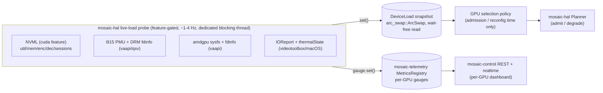

> **Design brief — GPU/CPU monitoring & multi-GPU work placement.** Authoritative research/design record backing the implementation. Produced by a verification-hardened research pass (2026-06-03) and synthesised against the existing `mosaic-hal` capability/cost/planner model and the `mosaic-telemetry` metrics registry. Canonical crate/API naming lives in [docs/architecture](../architecture/). The decision derived from this brief is [ADR-0017](../decisions/ADR-0017.md). Where research and adversarial verification disagreed, the verification wins and is noted inline.

---

# GPU/CPU Utilisation Monitoring & Affinity-Aware Multi-GPU Work Placement

> **Governing question.** When a host has more than one GPU and the operator has **not** pinned specific GPUs to specific tasks, which GPU should the engine place a tile's pipeline on? The working hypothesis was: *"use GPU memory + encoder/decoder utilisation to select the least-loaded GPU."* This brief validates that hypothesis and **refines it** with the one constraint it omits — **pipeline affinity** — because Mosaic's "zero-copy islands per vendor" invariant ([ADR-0004](../decisions/ADR-0004.md)) makes splitting a tile's `decode -> composite -> encode` across two GPUs cost an explicit PCIe round-trip plus latency. Least-loaded is the *tie-breaker among GPUs that can host the whole pipeline*, not the primary axis.

This brief extends [efficiency.md](efficiency.md) §3 (resource-adaptive degradation), §3.1 (pressure detection), §3.2 (admission control), and §4 (cost model). It does **not** restate them; it adds the **per-device live-load probe** and the **GPU-selection policy** that sit on top of the capability+cost+planner model already in `crates/mosaic-hal`.

---

## 0. TL;DR

- **Monitoring stack:** runtime-loaded vendor libraries behind off-by-default features (conventions §7). NVIDIA via **NVML** (`libnvidia-ml.so.1`, the `nvml-wrapper` crate, behind `cuda`); Linux Intel via **i915 PMU** + **DRM fdinfo**; Linux AMD via **amdgpu sysfs** (`gpu_busy_percent`) + **DRM fdinfo**; Apple via **IOReport** private API + `ProcessInfo.thermalState` (only the latter is a public API). CPU/RAM via the existing Linux PSI/cgroup + macOS `thermalState` sensors from efficiency §3.1.
- **Per-engine encode/decode utilisation is only cleanly available on NVIDIA (NVML) and Intel (i915 PMU).** AMD exposes media utilisation only **per-process via fdinfo**, and from **VCN4** decode and encode are *merged* into one "Media engine" figure (can't separate). Apple exposes **no public per-engine video utilisation** at all. The policy degrades gracefully where a vendor is blind.
- **Selection policy (the answer):** for each unpinned pipeline, rank the GPUs that can host the **whole** pipeline by a composite **least-loaded** score over `{free VRAM, encoder-util headroom, decoder-util headroom, NVENC session headroom}`, pick the best, and **keep decode+composite+encode on that one GPU**. Only split across GPUs as an explicit, accounted degradation step when no single GPU fits. Hysteresis + make-before-break prevent flapping. Operators can override with an explicit GPU pin per source/output.

---

## 1. What each vendor actually exposes (the honest matrix)

The single most important finding is that **per-engine video encode/decode utilisation is not uniformly available**, and the user's hypothesis (which leans on `enc%`/`dec%`) only fully holds where it is. The table below marks each metric **available / per-process-only / unavailable / unverified** per vendor, with the source. "Per-engine" means *the encode ASIC and the decode ASIC are counted on their own counters*, which is what the scheduler needs (encode and decode live on physically distinct silicon — efficiency §1.7, §4).

| Metric (per device) | NVIDIA | Intel (Linux) | AMD (Linux) | Apple (macOS) |
|---|---|---|---|---|
| **GPU core / compute busy %** | Available — `nvmlDeviceGetUtilizationRates().gpu` [N1] | Available — i915 PMU Render/3D engine busy [I1][I2] | Available — sysfs `gpu_busy_percent` (SMU aggregate) [A1] | Private only — IOReport / `powermetrics` (no public API) [P1][P2] |
| **VRAM used / total / free (bytes)** | Available — `nvmlDeviceGetMemoryInfo` -> `{total,free,used}` [N1] | Available (system DDR; iGPU) — fdinfo `drm-total-*` / sysfs; unified memory | Available — fdinfo `drm-memory-*` / sysfs VRAM | Unified memory; no clean per-process VRAM; IOReport/private [P1][P2] |
| **Encoder util % (per engine)** | Available — `nvmlDeviceGetEncoderUtilization` (0-100 % + `samplingPeriodUs`) [N1][N2] | Available — i915 PMU **Video (VCS)** engine busy [I1][I2] | **Per-process only** — fdinfo `drm-engine-enc`; **merged with decode from VCN4** [A2][A3] | **Unavailable (public)** — VideoToolbox runs on a dedicated Media Engine the public API does not meter [P1][P3] |
| **Decoder util % (per engine)** | Available — `nvmlDeviceGetDecoderUtilization` (0-100 % + `samplingPeriodUs`) [N1] | Available — i915 PMU **Video (VCS)** + **VideoEnhance (VECS)** busy [I1][I2] | **Per-process only** — fdinfo `drm-engine-dec`; **merged with encode from VCN4** [A2][A3] | **Unavailable (public)** [P1][P3] |
| **Encode session count (aggregate)** | Available — `nvmlDeviceGetEncoderStats` -> `(sessionCount, averageFps, averageLatency)` [N1] | n/a (no session cap) | n/a (no session cap) | Unverified (learn empirically — efficiency §3.2) |
| **Per-session encode detail** | Available *with caveat* — `nvmlDeviceGetEncoderSessions`; **often returns 0 / NOT_SUPPORTED on consumer GeForce** [N1][N3] | n/a | n/a | n/a |
| **Encoder capacity %** | Available — `nvmlDeviceGetEncoderCapacity(type)` returns **0-100 % of max capacity** for a codec type (NOT a session count) [N1] (verified — see trap below) | n/a | n/a | n/a |
| **Per-process GPU/mem/enc/dec util** | Available *with caveat* — `nvmlDeviceGetProcessUtilization`; **often unsupported on consumer GeForce** [N1] | Available — fdinfo `drm-engine-*` per `/proc/<pid>/fdinfo/<drm_fd>` [I3][A2] | Available — fdinfo `drm-engine-*` [A2] | Private only |
| **Concurrent encode-session ceiling** | **Per-SYSTEM hard limit** (see §1.1) [N4] | None documented | None documented | Small per-chip (base M = 1 dec + 1 enc; efficiency §3.2) — learn empirically |
| **Temp / power / clocks** | Available — `nvmlDeviceGet{Temperature,PowerUsage,ClockInfo}` [N1] | sysfs hwmon | sysfs hwmon | IOReport / `powermetrics` (private) |
| **Stable device identity (for pinning)** | Available — UUID / PCI bus id / index [N1] | DRM card/render node + PCI | DRM card/render node + PCI | Metal device registryID |

**Two verified traps the user's hypothesis must avoid:**

1. **`nvmlDeviceGetUtilizationRates().memory` is NOT bytes used.** It is "percentage of time over the past sample period during which global (device) memory was being read or written" — i.e. the **memory *controller* busy %**, not VRAM occupancy [N1, verified 2026-06-03]. The VRAM-pressure signal for selection **must** come from `nvmlDeviceGetMemoryInfo().used/total` (bytes), never from `.memory`.
2. **`nvmlDeviceGetEncoderCapacity` is a percentage (0-100), not a remaining-session count.** The authoritative NVML reference text says "current capacity of the device's encoder, as a percentage of maximum encoder capacity, range 0-100" [N1, verified 2026-06-03]. (One automated paraphrase during research wrongly read it as "max sessions" — that paraphrase is wrong; the reference wins.) It is a relative-headroom signal, useful as a tie-breaker, **not** a substitute for tracking the session count against the hard ceiling in §1.1.

Additional verified caveats already noted in efficiency §3.1 and reaffirmed here: NVIDIA `%enc`/`%dec` are **time-averaged busy fractions, not throughput headroom** (documented `%enc=0` while NVENC is active on some Ada drivers; `%dec` capping ~50 % on 2-NVDEC parts because the percentage does not aggregate across engines) — so corroborate util% with measured fps/`speed=`. Encoder/decoder utilisation queries are **not supported on MIG-enabled GPUs** [N1].

### 1.1 The NVENC concurrent-session ceiling (hard admission gate)

The NVENC concurrent-encode-session limit is a **per-system aggregate across all non-qualified (GeForce) cards combined**, enforced by the driver at session-create, and it is a **moving driver-version number** — do not hard-code it. The Video Codec SDK 13.0 NVENC Application Note states verbatim: "On non-qualified GPUs, the number of concurrent encode sessions is limited to **8 per system**" and "On qualified GPUs, the number of concurrent encode sessions is limited by available system resources" [N4, verified 2026-06-03]. Historically the cap has climbed 2 -> 3 (2020) -> 5 (Mar 2023) -> 8 (Jan 2024) and consumer reporting in 2025 cites 12 [N5][N6]; **probe at runtime, never assume.** NVDEC has no session cap but is bounded by physical NVDEC engine count (often 1, sometimes 0 on entry SKUs), per-engine pixels/sec, and VRAM. Because there is no clean "sessions remaining" query, **Mosaic must track its own live session count** (it owns every encoder it creates) and treat the discovered system ceiling as a hard gate at admission — this is an extension of the admission control in efficiency §3.2, applied at GPU-selection time.

---

## 2. The polling architecture

The probe is a **bounded, off-hot-path sampler** that refreshes a live-load snapshot for the scheduler and mirrors it into Prometheus gauges. It is structured to respect invariants #1 (output clock never falters) and #10 (isolation): **the engine never blocks on the probe, and the probe never blocks on the engine.**



**Design rules (all load-bearing):**

1. **Runtime-loaded, feature-gated, no build-time native deps.** NVML is loaded at runtime from `libnvidia-ml.so.1` via `dlopen` — exactly Mosaic's conventions §7 posture for vendor libs (NDI/NVENC). The `nvml-wrapper` crate does this through `libloading`; "the NVML library gets loaded upon calling `Nvml::init` and can return an error if NVML isn't present" [N7]. So the whole NVIDIA path sits behind the off-by-default `cuda` feature with **zero native build deps** and a clean no-GPU fallback (matches the existing `probe.rs` "feature-on but no device -> Absent, never panic" contract). The Linux Intel/AMD paths read `/sys` and `/proc/<pid>/fdinfo` — std file I/O, no native lib. The Apple IOReport path is private API behind `videotoolbox` + `target_os = "macos"`.
2. **Bounded poll, ~1-4 Hz, on a dedicated blocking thread.** NVML calls are synchronous and can take milliseconds; the i915-PMU/fdinfo path requires two snapshots a fixed interval apart to derive a busy %. Poll on its own thread (or `tokio::task::spawn_blocking`), never on the data plane and never on a Tokio reactor thread. NVML's internal utilisation sample window is device-dependent (NVIDIA staff: between 1 s and 1/6 s); the encoder/decoder calls return their **own** `samplingPeriodUs` — **read it, do not assume it** [N1][N8].
3. **Wait-free hand-off to the scheduler.** The probe publishes a `DeviceLoad` snapshot per GPU into an `arc_swap::ArcSwapOption` (the same wait-free latest-state primitive the engine already uses — [ADR-I001](../decisions/ADR-I001.md)). The scheduler reads the latest snapshot with no lock and no await; a stale snapshot is acceptable because **selection only happens at admission/reconfig time, not per-frame** (§3.5). If the probe thread dies, the engine keeps running on the last snapshot (and on the static cost model); telemetry is best-effort.
4. **Mirror into the telemetry registry.** Each poll also calls `gauge.set()` on the per-GPU gauges in the existing `mosaic-telemetry` `MetricsRegistry` (§4). Those handles are lock-free atomics; updating them is allocation-free and never blocks.
5. **Graceful absence.** A vendor that exposes nothing (Apple per-engine, AMD pre/post-VCN4 differences) yields a `DeviceLoad` with the available fields populated and the rest marked **unknown**; the policy in §3 handles `unknown` by falling back to `{free VRAM + overall-busy + cost-model estimate}`. No metric is fabricated.

### 2.1 Where it lives in the crate map

The probe is the natural fourth seam in `mosaic-hal`, beside `probe.rs` (presence detection), `cost.rs`, and `planner.rs`. Suggested module shape (no code this round):

- `mosaic-hal::load` — the `DeviceLoad` snapshot type (`{ gpu_busy: Option<f32>, vram_used/total: Option<u64>, enc_util/dec_util: Option<f32>, enc_sessions: Option<u32>, enc_capacity_pct: Option<f32>, device_id: DeviceId }`) plus the `LoadProbe` trait (the vendor seam, mirroring the existing injectable `DeviceProbe`). All `Option`/typed so "unknown" is a first-class state, never a sentinel.
- `mosaic-hal::select` — the pure, deterministic selection policy (§3), consuming `&[DeviceLoad]` + the existing `Capability`/`CostBudget`/affinity and returning a chosen `DeviceId` or a documented fallback. Pure = unit-testable with injected snapshots, no hardware.
- Feature-gated `LoadProbe` impls (`nvml`, `i915`, `amdgpu`, `ioreport`) behind the existing `cuda`/`vaapi`/`qsv`/`videotoolbox` features.

`DeviceId` should be the **stable** identity (NVML UUID / PCI bus id; DRM render-node + PCI; Metal registryID) — **never the enumeration index**, which is unstable across reboots and `CUDA_VISIBLE_DEVICES` reorderings [N1]. This is what operator pins (§3.4) bind to.

---

## 3. The selection policy (the answer to the governing question)

### 3.1 The refinement: affinity gates least-loaded

The user's hypothesis — *least-loaded by VRAM + enc/dec util* — is **correct as the ranking function but incomplete as the algorithm**, because it implicitly assumes work is freely placeable. Under Mosaic's "zero-copy islands" invariant ([ADR-0004](../decisions/ADR-0004.md)), cross-vendor/cross-GPU on-GPU zero-copy **does not exist on desktop**: a tile whose decode lands on GPU-A but whose composite/encode lands on GPU-B pays an explicit **GPU-A -> host -> GPU-B copy** plus latency on every frame. So the correct algorithm is:

> **Pick the least-loaded *single GPU that can host the whole `decode -> composite -> encode` pipeline*. Splitting a pipeline across GPUs is a last-resort, explicitly-accounted degradation step, never the default.**

Affinity is therefore a **hard gate applied before the least-loaded ranking**, not a term inside the score. The compositor is the natural anchor: the program canvas is composited on one GPU, so a tile's decode and its contribution-scale want to be on that same island; per-output encoders want to be on the island whose canvas they encode.

### 3.2 The composite least-loaded score

Among the GPUs that pass the affinity gate **and** the capability/cost admission check (efficiency §3.2, the existing `Planner::admit`), rank by a composite score where **lower is better (least loaded)**. The score is a weighted blend of normalised, dimensionless headroom deficits:

```
load(gpu) =  w_vram * vram_used_frac                  // bytes used / total  [primary]
           + w_enc  * enc_util_frac                    // encoder ASIC busy %
           + w_dec  * dec_util_frac                    // decoder ASIC busy %
           + w_sess * nvenc_session_frac               // sessions used / discovered system ceiling
           + w_comp * compute_busy_frac                // GPU core busy % (compositor pressure)
```

- **VRAM gets the highest weight** because it is a *hard* wall (OOM, not slowdown) and is the one signal available and trustworthy on every vendor. VRAM is the floor the user's hypothesis correctly identified.
- **`enc_util`/`dec_util`** are the per-engine signals; they are *busy-fraction*, so they are best read as "is this engine near saturation," corroborated by measured fps from the cost model (efficiency §3.1) — not treated as exact throughput headroom.
- **`nvenc_session_frac`** is NVIDIA-only and folds the §1.1 hard ceiling into the soft score so the scheduler steers away from a near-full encoder system *before* it hard-rejects at the ceiling.
- Any **`unknown`** term drops out of the blend with its weight redistributed to the known terms (so Apple, with only VRAM-ish + thermal, ranks on what it has — see §3.6).
- Ties (within an epsilon band) are broken by: existing affinity (prefer the GPU already hosting related tiles of the same scene, to maximise island reuse), then lowest device index for determinism.

The weights are config-exposed defaults (operator-tunable), not magic constants; the planner already treats budgets and hysteresis thresholds as data, and this follows suit.

### 3.3 Admission tie-in + the NVENC hard gate

Selection runs **inside** admission, not before it. The flow at admit/reconfig time:

1. Determine the pipeline's affinity set (which GPUs can host the whole thing given vendor/codec capability — reuses `BackendRegistry` + `probe.rs`).
2. For each candidate GPU, check the **hard** gates: capability (`Capability::supports`), cost budget (`Planner::admit` per-engine Mpix/s), VRAM headroom (predicted pool bytes <= free VRAM), and — for NVENC encode placement — **the per-system session ceiling** (§1.1). A candidate failing any hard gate is dropped.
3. Rank the survivors by the §3.2 score; choose the minimum.
4. If **no** GPU survives the hard gates as a whole-pipeline host, fall back in order: (a) trigger the efficiency §3.3 degradation ladder to shrink the pipeline's footprint and retry; (b) only if still infeasible, **split the pipeline across GPUs** and add the boundary copy to the cost model as an explicit accounted cost (a new, documented, last-resort plan), surfaced to the operator and logged.

### 3.4 Operator override (pinning) — always wins

The auto policy is **on by default and fully overridable** (efficiency §3.4). An operator may **pin** a source's decode, the composite, or an output's encode to a specific `DeviceId` (the stable UUID/PCI id, §2.1). A pin is a hard constraint: the scheduler honours it even if that GPU is more loaded, and surfaces a warning (and, via the live-apply classification, a dry-run plan) if the pin cannot be satisfied (capability/VRAM/session). Pins are how an operator builds deliberate islands (e.g. "all security tiles on GPU-1, the broadcast output on GPU-0"). When nothing is pinned, the auto policy of §3.1–§3.3 runs.

### 3.5 Timing: admission/reconfig only, never per-frame (invariants #1/#10)

GPU selection is a **placement decision**, made when a source/output is added or a scene is reconfigured — exactly the moments efficiency §3.2 already gates with admission. It is **never** re-evaluated per output tick: moving a live pipeline between GPUs costs a re-init and a copy, so it is a Class-2 (make-before-break) change, not a hot edit ([ADR-R004](../decisions/ADR-R004.md), invariant #11). Re-balancing an *already-running* set of pipelines (e.g. a GPU became hot) is therefore: propose a new placement -> spin up the new island in parallel -> migrate -> tear down the old (make-before-break), gated by the **same hysteresis/cooldown** as the degradation ladder so a transient load spike never triggers a churn of expensive migrations. The output clock keeps ticking on the old island throughout.

### 3.6 Graceful fallback where per-engine util is blind

| Vendor situation | Selection falls back to |
|---|---|
| **Apple** (no public per-engine util) | `{free unified-memory pressure (IOReport, private) + thermalState + cost-model decode/encode-session estimate}`. Size by *max concurrent sessions sustained without drops* (efficiency §3.2), not util%. On a single-GPU Apple box this is moot — there is one island. |
| **AMD VCN4+** (decode/encode merged in fdinfo) | Treat the merged "Media engine" figure as a **combined** enc+dec headroom signal; do not pretend to separate them. Corroborate with `gpu_busy_percent` + cost model. Pre-VCN4, the separate `drm-engine-dec`/`-enc` fdinfo keys are usable [A2][A3]. |
| **AMD any** (no per-engine sysfs %, fdinfo is per-process) | Sum Mosaic's *own* per-fd engine ns deltas (we own our processes) for our contribution; use `gpu_busy_percent` + VRAM + cost model for the whole-device picture. |
| **Any vendor, probe failed/absent** | Pure **cost-model placement**: rank by predicted Mpix/s headroom from `CostBudget` + VRAM-from-pool-sizing estimate. Degrades to the static planner that already exists. |

The invariant: **a blind vendor never blocks placement** — it falls back to VRAM + overall-busy + the cost-model estimate, which is always available. The user's enc/dec-util term is an *enhancement* where the silicon reports it, not a hard dependency.

---

## 4. API + WebUI exposure

### 4.1 Prometheus gauges (mosaic-telemetry)

The probe mirrors each poll into the existing `MetricsRegistry` as per-GPU gauges, labelled `{gpu, vendor, uuid}` (bounded cardinality — one series set per physical GPU). Proposed series (gauges unless noted):

- `mosaic_gpu_compute_utilization_ratio{gpu,vendor}` — 0.0-1.0 core/compute busy.
- `mosaic_gpu_encoder_utilization_ratio{gpu,vendor}` — 0.0-1.0 (absent label-value or NaN where unknown).
- `mosaic_gpu_decoder_utilization_ratio{gpu,vendor}` — 0.0-1.0 (unknown where unsupported).
- `mosaic_gpu_memory_used_bytes{gpu,vendor}` / `mosaic_gpu_memory_total_bytes{gpu,vendor}` — the authoritative VRAM-pressure pair.
- `mosaic_gpu_encoder_sessions_active{gpu,vendor}` — Mosaic's own tracked count (NVIDIA-corroborated by `nvmlDeviceGetEncoderStats` where available).
- `mosaic_gpu_encoder_session_ceiling{scope="system"}` — the discovered NVENC per-system ceiling (§1.1).
- `mosaic_gpu_temperature_celsius` / `mosaic_gpu_power_watts` / `mosaic_gpu_clock_mhz{domain}` — NVIDIA where available; sysfs hwmon on Linux Intel/AMD.
- `mosaic_gpu_pipeline_placements{gpu,role}` — how many decode/composite/encode roles the scheduler has placed on each GPU (the operator's view of the balance the policy produced).

These join the existing engine gauges (per-tile fps, queue depth, VRAM bytes, active encode sessions named in `metrics.rs`). **Convention to honour:** unknown is *not* `0.0` — a gauge that would lie (e.g. encoder util on Apple) is simply **not registered** for that GPU, so the dashboard shows "n/a" rather than a false zero. (The registry stores `f64`; the probe omits the `set()` for unknown metrics.)

### 4.2 Realtime API + dashboard

- The scheduler's chosen placement and the live `DeviceLoad` snapshot are exposed through the realtime stream (the per-topic conflated WS/SSE channel — [ADR-RT004](../decisions/ADR-RT004.md)), so the WebUI updates a **per-GPU panel** at the ~1-4 Hz probe cadence without polling REST. High-rate values are conflated (drop-oldest) on the way out — the engine never awaits the client (invariant #10).
- REST (`/api/v1`) exposes the static device inventory (`DeviceId`, vendor, VRAM total, capability summary) and the current placement map for the layout/settings views, and accepts the **pin** override (per source decode / per output encode) as a config edit, validated against capability + the live-apply classification.
- **WebUI dashboard:** one card per physical GPU showing compute / encoder / decoder utilisation bars (greyed "n/a" where the vendor is blind — never a misleading zero, and never colour-alone per [ADR-W011](../decisions/ADR-W011.md)), a VRAM used/total bar (the primary pressure signal), the active/ceiling encode-session counter for NVIDIA, temperature/power where available, and the list of pipelines (sources/outputs) currently placed on that GPU. A pin control per source/output lets the operator override auto-placement, with a dry-run plan showing the Class-1/Class-2 impact.

---

## 5. Open questions & risks

1. **`samplingPeriodUs` heterogeneity.** NVML encoder/decoder utilisation each report their own (device-chosen, variable) sampling window; the i915-PMU path uses our chosen interval; AMD fdinfo is a ns counter we difference ourselves. The composite score blends three signals with **different time bases**. Risk: a fast spike on one engine and a slow average on another are not directly comparable. Mitigation: low-pass each signal to a common ~1 s effective window before blending; document that the score is a *steering heuristic*, with the hard gates (VRAM, session ceiling, cost budget) as the real safety.
2. **Consumer-GeForce blind spots.** `nvmlDeviceGetEncoderSessions` and `nvmlDeviceGetProcessUtilization` are frequently `NOT_SUPPORTED` / return 0 on GeForce [N3]. Mosaic must rely on its **own** session bookkeeping (it owns its encoders) and the aggregate `nvmlDeviceGetEncoderStats`, not on per-session enumeration, for the session-headroom term. **Unverified:** the exact set of GeForce SKUs/drivers where `GetEncoderSessions` works — treat as best-effort and never a hard dependency.
3. **AMD VCN4 merge.** The decode/encode merge into one "Media engine" figure [A2][A3] means the policy cannot give AMD a separate `dec_util` and `enc_util` on recent silicon — the score uses one combined media term there. Acceptable, but it slightly weakens balance quality on AMD; VRAM + `gpu_busy_percent` + cost model carry the decision.
4. **Apple is effectively single-island for selection.** On the common base-M-series target there is one GPU and one media-engine pair, so "which GPU" is trivial — the real Apple problem is *admission* (session count), which efficiency §3.2 already owns. The per-engine-util blind spot therefore costs little in practice, but a true public Apple per-engine API would be a future improvement (**none verified to exist**).
5. **Cross-GPU split cost is an estimate.** When the last-resort split path runs, the PCIe copy + latency added to the cost model is a *modelled* number until measured per host. Risk: under-estimating it could make a split look cheaper than re-balancing. Mitigation: bias the model conservatively (splits are last-resort) and measure the boundary copy at startup like the other cost-table entries (efficiency §4).
6. **NVENC ceiling discovery.** Since the ceiling is a moving driver number with no clean query, "discover by attempt-and-handle session-create failure" is the robust path — but that means the *first* over-ceiling placement learns the limit by failing. Mitigation: cache the discovered ceiling, seed it from a conservative known floor, and surface it as the `encoder_session_ceiling` gauge.
7. **Probe cost on tiny boxes.** On an N100-class iGPU the fdinfo-walk over many `/proc/<pid>/fdinfo` entries at ~4 Hz is non-trivial. Mitigation: only walk Mosaic's own PIDs for the per-process contribution, and lean on the global i915-PMU engine counters for the whole-device figure.

---

## 6. How this shapes the data model

- **`mosaic-hal`** gains a `load` module (the `DeviceLoad` snapshot + `LoadProbe` trait, mirroring the injectable `DeviceProbe` seam) and a pure `select` module (the affinity-gated least-loaded policy). The vendor `LoadProbe` impls are feature-gated exactly like the existing presence detectors. `DeviceId` (stable UUID/PCI/registryID) becomes the placement + pin key.
- **`mosaic-telemetry`** gains the per-GPU gauge series in §4.1, registered against the existing `MetricsRegistry`; the probe owns the `set()` calls. "Unknown" metrics are simply not registered for that GPU.
- **`mosaic-engine`** drives the probe thread (off the data plane), reads the wait-free `DeviceLoad` snapshot at admission/reconfig, and runs the make-before-break migration when re-balancing (Class-2, hysteresis-gated).
- **`mosaic-control` + `web/`** expose the inventory + placement + per-GPU dashboard + the pin override, over REST + the conflated realtime channel.

The selection policy is a **pure function over `(affinity set, capability, cost budget, DeviceLoad[], pins)`** — deterministic and unit-testable with injected snapshots, holding to the same "pure core, feature-gated hardware seam" discipline as the rest of `mosaic-hal`.

---

## References

NVIDIA / NVML
- [N1] NVIDIA, *NVML API Reference — Device Queries* (`nvmlDeviceGetUtilizationRates`, `…MemoryInfo`, `…EncoderUtilization`, `…DecoderUtilization`, `…EncoderStats`, `…EncoderSessions`, `…EncoderCapacity`, `…ProcessUtilization`, identity queries). docs.nvidia.com/deploy/nvml-api/. Verified 2026-06-03 (field semantics: `.memory` = memory-controller busy %, NOT bytes; `EncoderCapacity` = 0-100 %; MIG-unsupported note).
- [N2] NVIDIA NVML man page (`nvmlDeviceGetEncoderUtilization(device, utilization, samplingPeriodUs)`), Kepler+. Verified 2026-06-03.
- [N3] NVIDIA Developer Forums, thread 239036 — `nvmlDeviceGetEncoderSessions` returns 0 / NOT_SUPPORTED on consumer GeForce. forums.developer.nvidia.com.
- [N4] NVIDIA, *NVENC Application Note*, Video Codec SDK 13.0 — "non-qualified GPUs … limited to 8 per system"; qualified limited by resources. docs.nvidia.com/video-technologies/video-codec-sdk/13.0/nvenc-application-note/. Verified 2026-06-03.
- [N5] Tom's Hardware — NVIDIA raised concurrent NVENC sessions 3 -> 5 (Mar 2023). tomshardware.com.
- [N6] TechPowerUp / NVENC (Wikipedia) — session-limit history 2 -> 3 -> 5 -> 8 -> 12. techpowerup.com / en.wikipedia.org/wiki/NVENC.
- [N7] rust-nvml, *nvml-wrapper* README + docs.rs (v0.12.1, MIT OR Apache-2.0, runtime-loads NVML via `libloading` on `Nvml::init`, targets NVML 11/12). github.com/rust-nvml/nvml-wrapper, docs.rs/nvml-wrapper. Verified 2026-06-03.
- [N8] NVIDIA Developer Forums — NVML utilisation internal sample window is device-dependent (~1 s to 1/6 s). forums.developer.nvidia.com.

Intel (Linux)
- [I1] *drm/i915 Intel GFX Driver*, Linux Kernel docs — i915 PMU per-engine-class busy counters (Render/3D, Copy/Blitter, Video/VCS, VideoEnhance/VECS), in ns. docs.kernel.org/gpu/i915.html.
- [I2] `intel_gpu_top` man page (Ubuntu/Debian) — displays Render/3D, Blitter, Video, VideoEnhance engine busy %. manpages.
- [I3] *DRM client usage stats*, Linux Kernel docs — fdinfo `drm-engine-<class>: <ns>` per-process. dri.freedesktop.org/docs/drm/gpu/drm-usage-stats.html.

AMD (Linux)
- [A1] amdgpu sysfs `gpu_busy_percent` (SMU aggregate GPU busy). kernel amdgpu docs.
- [A2] *DRM client usage stats* — fdinfo `drm-engine-*` per-process media engine ns (the source `amdgpu_top` reads). dri.freedesktop.org/docs/drm/gpu/drm-usage-stats.html.
- [A3] Umio-Yasuno/amdgpu_top README + docs — "Media decoder/encoder not shown on VCN4 or later; a combined Media engine is shown (decode+encode queues unified from VCN4)." github.com/Umio-Yasuno/amdgpu_top, docs.rs/amdgpu_top.

Apple (macOS)
- [P1] IOReport is a private macOS API (C bindings) for sampling CPU/GPU/energy; no public per-process GPU API. (asitop, macmon, vladkens "macOS power metrics with Rust".)
- [P2] `powermetrics` GPU telemetry is system-level, text-only, not per-process; Activity Monitor shows GPU history without per-process util/VRAM. support.apple.com / Apple Community.
- [P3] efficiency.md §3.1 (verified) — VideoToolbox runs on a dedicated Media Engine, NOT the GPU; GPU-util% does not reflect decode/encode load; size by max concurrent sessions, not util%.

Mosaic internal
- [efficiency.md](efficiency.md) §1.7, §3, §3.1, §3.2, §3.3, §4 — per-engine measurement, resource-adaptive degradation, admission control, cost model.
- [ADR-0004](../decisions/ADR-0004.md) — zero-copy islands per vendor (the affinity constraint).
- [ADR-I001](../decisions/ADR-I001.md) — `arc_swap` wait-free latest-state + `broadcast` drop-oldest (the isolation primitives the probe hand-off reuses).
- [ADR-RT004](../decisions/ADR-RT004.md) — structural backpressure isolation / per-topic conflation (the realtime exposure path).
- [ADR-R004](../decisions/ADR-R004.md) — pinned output params + make-before-break Class-2 migration (re-balancing mechanism).
