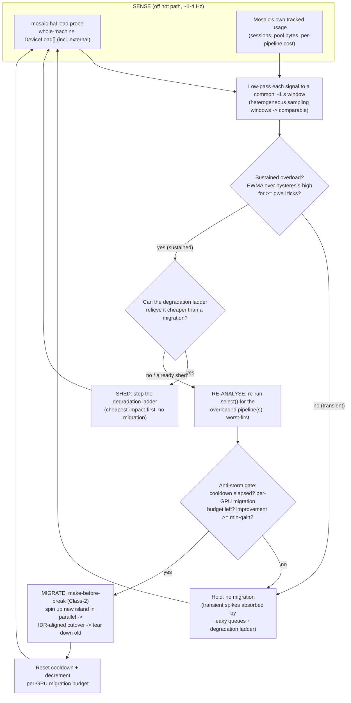

> **Design brief — GPU work-placement decision engine.** Authoritative research/design record backing the implementation. Produced by a verification-hardened research pass (2026-06-03) and synthesised against the monitoring matrix in [gpu-monitoring-and-scheduling.md](gpu-monitoring-and-scheduling.md), the cost/planner/degradation model in [efficiency.md](efficiency.md), and the supervisor/hot-reconfig model in [core-engine.md](core-engine.md). This brief **builds on** the monitoring brief — it consumes the verified per-vendor capability matrix and does **not** re-research what metrics are obtainable. Canonical crate/API naming lives in [docs/architecture](../architecture/). The decision derived from this brief is [ADR-0018](../decisions/ADR-0018.md). Where research and adversarial verification disagreed, the verification wins and is noted inline.

---

# GPU Work-Placement Decision Engine

> **Governing question.** Given a host with one or more GPUs (and a *whole-machine* load that fluctuates because the operator runs other consumers of CPU/RAM/GPU/VRAM/encoders/decoders), how does Mosaic **decide** where each tile's `decode -> composite -> encode` pipeline runs — initially, and over time as load shifts — without ever faltering the program output and without ever reactively fragmenting a working pipeline to chase load?

The monitoring brief answered *what can be measured* and sketched the affinity-gated least-loaded **ranking function**. This brief specifies the **decision engine** that consumes those measurements: the scoring model, the decision rules (whole-pipeline-on-one-GPU by default, deliberate split only when it doesn't fit, operator pin always wins), and the **closed-loop controller** that re-analyses, re-selects, and *migrates* under sustained overload — extending Mosaic's invariant-#9 control loop (sense -> estimate -> plan -> apply, with hysteresis) from *degradation* to *placement + recovery*.

This is **decision-making, not "least-busy then load it up."** The naive policy is explicitly rejected (§1). Placement reasons over a multi-resource vector, a hard affinity gate, the whole-system external load, and a migration cost — and only ever moves a running pipeline as a deliberate, hysteresis-damped, make-before-break act.

---

## 0. TL;DR

- **Affinity is a HARD GATE, not a score term.** Candidate set = only the GPUs that can host the *entire* `decode -> composite -> encode` island (capability + per-engine Mpix/s budget + free-VRAM + NVENC-session ceiling all pass). Cross-GPU on consumer hardware costs a per-frame `GPU -> host -> GPU` copy because P2P is disabled on GeForce [V1][V2]; least-busy load only *ranks among* GPUs that already qualify, and **never reactively fragments a running pipeline**.
- **Scoring is multi-resource, spread-biased.** Among candidates, pick the GPU minimising a composite load score that blends `{free-VRAM (primary), encoder-util, decoder-util, NVENC-session, compute-busy}` (the DRF dominant-share idea, already in `pressure_from_plan`) **plus a Tetris-style fit/alignment term** so we don't burn the last NVENC session on the only box with free decode headroom. We bias toward **spread + headroom** (resilience > density) — the opposite of a batch cost-optimiser — and reserve operator-configurable headroom.
- **Whole-system, fluctuating external load is first-class.** Util/VRAM are read for the *whole machine* (they already reflect every consumer), low-passed to a common ~1 s window, and an operator **reserve-headroom** keeps room for the other tenants. External load is a time-varying input, not a constant.
- **Deliberate split only when it doesn't fit.** When *no* single GPU can host the whole island, the engine plans a split at the **cheapest cut point** (decode|composite|encode boundary), accounts the cross-GPU host round-trip in the cost model, surfaces it to the operator, and logs it. A split is last-resort and explicit, never a routine tradeoff.
- **Closed-loop re-placement, not catch-and-restart.** A sustained-overload detector (EWMA + hysteresis) triggers fresh analysis -> re-selection -> **make-before-break migration** (Class-2, [ADR-R004](../decisions/ADR-R004.md)): the new island runs in parallel, the cutover lands on an IDR boundary, the old island is torn down — the output clock never drops a frame (inv #1). Anti-storm damping (cooldown, per-GPU migration budget, min-improvement gate) prevents migration storms.
- **It lives where the model already lives.** A pure `mosaic-hal::select` module (the decision function) beside the planned `mosaic-hal::load` ([ADR-0017](../decisions/ADR-0017.md)); `mosaic-engine` owns the off-hot-path controller thread that senses, detects, and drives migration through the existing supervisor + make-before-break mechanism. Invariants #1 and #10 hold by construction.

---

## 1. Why "least-busy then load it up" fails (the rejected naive policies)

The project owner's first requirement is firm: this is **not** "simply least-busy then load it up." Each naive policy fails a continuous, never-stalling **live** workload (not a batch one) in a specific way, and the design is shaped by avoiding each.

| Naive policy | How it fails a live multiviewer | Source |
|---|---|---|
| **Round-robin / first-GPU-only** | Ignores per-GPU load entirely: packs a hot GPU as readily as an idle one, and ignores the NVENC session ceiling. ffmpeg defaults to the first GPU unless `-gpu N` is given; transcode farms historically duplicated jobs per device with no load awareness. | [V3] |
| **Pure least-loaded on ONE resource** (VRAM *or* GPU%) | The classic single-resource-fairness failure DRF was written to fix: with heterogeneous multi-resource demand (a tile is simultaneously decode-engine + VRAM + compositor-SM + encode-session load), optimising one axis starves another. Acute for Mosaic because **encode and decode live on physically distinct ASICs** ([efficiency §1.7/§4](efficiency.md)) — a GPU can be "least loaded" on VRAM yet at its NVENC session ceiling. | [V4] (DRF, NSDI 2011) |
| **Pure bin-packing / stacking** (cloud cost-optimiser) | Minimises fragmentation and frees whole GPUs, but creates noisy-neighbour hotspots: SM/bandwidth contention -> throttling + latency, memory pressure -> OOM. For a never-stalling output this is the *wrong* bias — a packed GPU that thermally throttles jitters the output clock. | Tetris explicitly trades packing vs fairness [V5] |
| **Pure spreading** | Failure-tolerant but inefficient (many partial GPUs, can't free one). | — |

**The conclusion that shapes everything below:** a live multiviewer wants a **spread / least-loaded bias with reserved headroom (resilience > density)**, *gated by hard affinity*, scored over *multiple* resources, with the hard caps (VRAM, NVENC session ceiling, cost budget) as the real safety net and the score as a steering heuristic. We borrow the multi-resource *theory* (DRF dominant-share + Tetris alignment) but **not** its batch density bias.

---

## 2. The placement scoring model

Selection is a **pure, deterministic function** run only at admission/reconfig (never per-frame, §4.5):

```
select(affinity_set, capability, CostBudget, DeviceLoad[], reserve_headroom, pins) -> Placement
```

It lives in a new `mosaic-hal::select` module beside the planned `mosaic-hal::load` ([ADR-0017](../decisions/ADR-0017.md)) and reuses the existing `Capability`/`CostBudget`/`Planner` types. The pipeline is four ordered stages.

### 2.1 Stage 1 — Pins win (hard, first)

If the operator has pinned this source's decode / the composite / this output's encode to a stable `DeviceId` (NVML UUID / PCI bus id / Metal registryID — never the enumeration index, §6), that pin is honoured unconditionally, even onto a more-loaded GPU. If the pin cannot be satisfied (capability / VRAM / session ceiling), the engine surfaces a warning + a dry-run live-apply plan and does **not** silently relocate. Pins are how operators build deliberate islands ("security tiles on GPU-1, broadcast output on GPU-0"). This matches the production norm: real transcode/serving systems offer **spread-or-pin**, and none reactively fragment a job across devices [V3].

### 2.2 Stage 2 — Hard gates build the candidate set (affinity is a gate)

For each physical GPU, drop it from the candidate set unless it can host the **whole** `decode -> composite -> encode` island:

1. **Capability gate** — `Capability::supports(resolution, format)` for every stage of this pipeline (reuses `BackendRegistry` + `probe.rs`).
2. **Cost-budget gate** — `Planner::admit` per-engine Mpix/s (decode / composite / encode each fit the GPU's remaining budget). This is the existing admission check, now applied **per candidate GPU**.
3. **VRAM gate** — predicted pool bytes <= *free* VRAM (the authoritative `nvmlDeviceGetMemoryInfo().free`, never the memory-controller `.memory` busy% trap [from the monitoring matrix]).
4. **NVENC session-ceiling gate** — for encode placement, Mosaic's own tracked session count + 1 <= the discovered per-system ceiling. The ceiling is a **per-system aggregate across all consumer cards, enforced at session-create, and a moving driver number** (8/system on Video Codec SDK 13.0; reported 12 in 2025; GTX 1630 = 3) — **discover at runtime, track our own count, never hard-code** [from the monitoring matrix].

**Why affinity is a gate, not a score term — verified.** Mosaic's zero-copy-islands invariant ([ADR-0004](../decisions/ADR-0004.md)) means a tile whose decode lands on GPU-A but composite/encode on GPU-B pays an explicit copy *every frame*. On Mosaic's commodity desktop targets that copy must stage **through host memory**: NVIDIA disabled peer-to-peer on consumer GeForce — an NVIDIA representative confirmed "Peer to Peer is not supported on the RTX 4090", and the limitation covers the entire RTX 30 and 40 series; the RTX 20-series was the last to support P2P (via an NVLink bridge, 2 cards max) [V1][V2]. Without P2P, CUDA inter-GPU copies "need to be staged through the host" [V2]. So a cross-GPU frame crosses `GPU -> host -> GPU` per frame — exactly the explicit copy ADR-0004 already budgets. A 1080p NV12 frame is ~3 MB; at 30 fps a single split stream is ~90 MB/s across PCIe in *each* direction, on *both* cards. Therefore the candidate set is "GPUs that can host the *whole* island"; the copy is modelled **only** on the last-resort split path (§3), never as a routine score term.

If the candidate set is **empty**, fall through to the no-fit ladder (§3).

### 2.3 Stage 3 — Score the survivors (lower = least-loaded, spread-biased)

Among GPUs that pass all hard gates, rank by a composite score where **lower is better**. The score has two parts: a **dominant-share load term** (DRF) and a **fit/alignment term** (Tetris), with a small spread/headroom shaping.

```
score(gpu) =        load_term(gpu)                 // DRF dominant-share: how loaded already
             + k_fit * fit_penalty(gpu, demand)    // Tetris alignment: shape mismatch
             - k_spread * empty_bonus(gpu)          // tiny nudge toward unused GPUs (resilience)

load_term(gpu) = max over resources r of:
        w_r * used_frac_r(gpu)         // dominant (most-saturated) resource share
  where resources r ∈ {
        vram      = vram_used / vram_total              [primary; HARD wall = OOM]
        enc_util  = encoder-ASIC busy fraction
        dec_util  = decoder-ASIC busy fraction
        sessions  = nvenc_sessions_used / discovered_ceiling
        compute   = GPU-core busy fraction (compositor pressure)
  }
```

- **DRF dominant-share = the existing `pressure_from_plan`, generalised per GPU.** `crates/mosaic-engine/src/degrade.rs::pressure_from_plan` already computes the worst-per-stage `StageUsage::utilization()` (decode/composite/encode) from `crates/mosaic-hal/src/planner.rs`. That *is* the DRF dominant-resource normalisation [V4] (score each candidate by its most-saturated resource share, max over resources). The placement engine **generalises** it from "worst stage of one plan" to "worst resource of a candidate GPU, accounting for what's already running plus the new demand."
- **VRAM is the highest-weighted resource** because it is a *hard* wall (OOM, not slowdown) and is the one signal trustworthy on every vendor (the monitoring matrix's floor). The util terms are *busy fractions*, read as "near saturation?" and corroborated by measured fps from the cost model — never as exact throughput headroom.
- **Tetris fit term.** Tetris (Grandl et al., SIGCOMM 2014 [V5]) packs by an **alignment score = a weighted dot product** of the machine's available-resource vector and the task's peak multi-resource demand vector. We reuse the *idea inverted* as a fragmentation-aware **penalty**: prefer the GPU whose *free*-resource shape matches the new pipeline's demand shape, so we don't, e.g., consume the last NVENC session on the only box that still has free decode headroom. **Verification caveat:** Tetris targets *batch makespan* and tolerates tight packing; a never-stalling live output must bias toward spread/headroom, so we adopt the dot product as a *fragmentation-aware fit term*, **not** as a density maximiser [V5]. `k_fit` is small relative to the load term.
- **Spread / headroom shaping.** A tiny `empty_bonus` nudges a brand-new pipeline onto an unused GPU when load is otherwise comparable (resilience). The operator's **reserve-headroom** (§2.5) is applied as a *reduction of each GPU's usable budget* before scoring — so the policy keeps room for external tenants rather than filling to the brim.
- **Unknown terms drop out** (graceful blindness, §5): any resource the vendor doesn't expose is removed from the `max`/dot-product and its weight redistributed to the known terms. Apple (no public per-engine util) ranks on VRAM-pressure + thermal + cost-model session estimate; AMD VCN4+ uses one combined media term (decode+encode merged) [from the monitoring matrix].
- **Ties** (within an epsilon band) break to: existing affinity (prefer the GPU already hosting related tiles of the same scene, to maximise island reuse and minimise future migration), then lowest stable `DeviceId` for determinism.

All weights, `k_fit`, `k_spread`, the epsilon band, and `reserve_headroom` are **config-exposed defaults**, not magic constants — the planner already treats budgets and hysteresis thresholds as data, and this follows suit.

### 2.4 Stage 4 — The cost-model tie-in (the real safety net)

The score is a *steering heuristic*; the **hard gates of Stage 2 are the safety**. The placement engine reuses the `mosaic-hal` cost model end-to-end: the per-engine Mpix/s `CostBudget` is the per-GPU admission gate (§2.2#2), the measured-cost telemetry refines the priors ([efficiency §3.2/§4](efficiency.md)), and the split cost (§3) is added as an explicit cost-model entry. **No placement decision rests on the score alone** — a GPU that scores best but fails a hard gate is never chosen, and a GPU that scores poorly but is the only candidate is chosen with the degradation ladder available as the pressure-relief valve.

### 2.5 Whole-system, fluctuating external load is a first-class input

Requirement #4 is firm: the operator runs **other** consumers, and headroom is computed against the **whole machine**.

- **The probe already reads whole-machine totals.** NVML `MemoryInfo` (used/free/total), `UtilizationRates`, `EncoderUtilization`/`DecoderUtilization`, and the *system-wide* NVENC session count reflect **all** processes on the device, not just Mosaic's [from the monitoring matrix]. So `used_frac_r` and the session count in the score already include external load. Mosaic additionally tracks **its own** contribution (it owns its encoders/pools) so it can attribute and bound *its* share without pretending to control the others.
- **External load is time-varying.** The score is recomputed at every placement decision from the *latest* low-passed snapshot, and the closed loop (§4) continuously re-senses, so a GPU that an external job just loaded up is correctly avoided for the *next* placement and is a migration-source candidate if it pushes one of *our* pipelines into sustained overload.
- **Reserve-headroom keeps room for the neighbours.** A config `reserve_headroom` (per-resource fraction, default conservative) is subtracted from each GPU's usable budget before the Stage-2 gates and Stage-3 scoring, so Mosaic does not admit a pipeline that would leave zero slack for the fluctuating external workload — and so a transient external spike doesn't instantly cross our own hard gate.
- **The score is steering; the leaky bounded queues + fast-down degradation are the real-time safety** when external load surges *between* control ticks (the [efficiency §3.2](efficiency.md) "predictor first line, leaky queues + fast-down hysteresis the real safety net" lesson, applied to placement).

---

## 3. The deliberate multi-GPU split (only when it doesn't fit)

Requirement #3 is firm: a multi-GPU split is **legitimate when the task doesn't fit on one GPU** (VRAM / NVENC session caps / compute headroom — all real on commodity hardware), but it is a **deliberate, planned, copy-budgeted** act, never a reactive fragmentation.

**Trigger:** Stage 2 produced an **empty candidate set** — no single GPU can host the whole island even after the degradation ladder ([efficiency §3.3](efficiency.md)) has been offered to shrink the pipeline's footprint.

**Ordered no-fit ladder (cheapest relief first):**

1. **Degrade to fit first.** Run the existing degradation ladder to shrink the pipeline (drop tile resolution/fps, simpler scaler) and re-run Stage 2. A smaller footprint that fits one GPU is *always* preferred to a split, because a split adds a permanent per-frame copy. (This is the existing `mosaic-hal` ladder, reused verbatim — no new degradation logic.)
2. **Split at the cheapest cut point** only if still infeasible. The pipeline has two natural cut points; choose the one that minimises the copied-bytes-per-second, accounted in the cost model:

   | Cut point | What crosses PCIe each frame (host round-trip) | Cheapest when… |
   |---|---|---|
   | **decode \| composite+encode** | the *decoded source frame* (one NV12 surface per source per frame, sized by the source/decode resolution) | the bottleneck is the **decode engine** (e.g. one NVDEC saturated by many inputs — the entry-NVIDIA binding limit, [efficiency §5](efficiency.md)); decode lands on the spare GPU, composite+encode stay together. The copied surface is at *decode* resolution, which decode-at-display-resolution ([ADR-E001](../decisions/ADR-E001.md)) has already minimised. |
   | **decode+composite \| encode** | the *composited canvas* (one NV12 canvas per output per frame, sized by the output resolution) | the bottleneck is the **NVENC session ceiling** (the canvas is composited on GPU-A, the encode session opens on GPU-B). One canvas/output is usually fewer bytes than N decoded tiles, but it is paid per *output rendition*. |

   We do **not** split `composite` itself across GPUs (the canvas is one surface; splitting it doubles the copy and the color pipeline) — the cut is always at a stage boundary, decode-side or encode-side.
3. **Account the copy explicitly.** The chosen cut adds a `CrossGpuCopy` cost (bytes/sec × measured `GPU->host->GPU` bandwidth + latency) to the cost model as a documented, last-resort plan, and the placement is **surfaced to the operator and logged**. The copy is biased *conservatively* (splits are last-resort): under-estimating it must never make a split look cheaper than degrading or migrating (§5 risk).
4. **If even a split doesn't fit**, the pipeline is rejected at admission with a clear capability error (it cannot run on this host at this quality), and the operator is told what would make it fit (more VRAM headroom, a lower tile resolution, fewer renditions).

**The split is recorded on the placement map** so the closed loop (§4) knows this pipeline is split and can *re-converge* it onto one GPU (eliminating the copy) the moment headroom reappears — via the same make-before-break migration, lowest-priority among migrations (a copy-elimination is desirable but not urgent).

---

## 4. The closed-loop placement + recovery controller

Requirement #5 is firm: if a GPU hosting part of our chain becomes overloaded (by us **or** external work), do **more** than restart-in-place — trigger fresh analysis + re-selection + make-before-break **migration**, with hysteresis to avoid migration storms. This is Mosaic invariant #9's closed loop (sense -> estimate -> plan -> apply, with hysteresis) **extended from degradation to placement + recovery**. It runs on the same slow control tick as the degradation loop, off the hot path.



### 4.1 Sense — including fluctuating external load (§2.5)

The controller reads the wait-free `DeviceLoad` snapshot ([ADR-0017](../decisions/ADR-0017.md), `arc_swap`, [ADR-I001](../decisions/ADR-I001.md)) plus Mosaic's own usage bookkeeping. Because the snapshot is whole-machine, **external load is sensed automatically**. Each signal is **low-passed to a common ~1 s window** before comparison (the monitoring brief's open question #1: NVML enc/dec utilisation, i915 PMU, and AMD fdinfo report on *different* time bases, so a fast spike on one engine and a slow average on another are not directly comparable until smoothed).

### 4.2 Detect sustained overload (EWMA + hysteresis, not transients)

A transient spike must **not** trigger a migration. The detector raises an overload only when a GPU's **EWMA** of the dominant-resource share stays above the hysteresis-high threshold for `>= dwell` control ticks — exactly the asymmetric anti-flap rule already implemented in `crates/mosaic-hal/src/degradation.rs::Hysteresis` (shed/act promptly on sustained high; recover/relax only after a dwell). We **reuse that `Hysteresis` controller verbatim** for the overload gate — no new anti-flap math.

### 4.3 SHED vs MIGRATE — relationship to the degradation ladder

When overload is sustained, the controller asks the cheaper question first: **can the degradation ladder relieve it more cheaply than a migration?** A migration costs a parallel encoder + a host round-trip during cutover + re-init; a ladder step (drop a low-priority tile's resolution/fps) is far cheaper and is confined to low-priority tiles before program output ([efficiency §3.3](efficiency.md)). So the order is:

1. **SHED first** if a ladder step relieves the overloaded GPU and the shed is below the program-affecting rung (`affects_program()` is the existing boundary). Degradation is local and cheap.
2. **MIGRATE** only when shedding cannot relieve it without touching program output, *or* when shedding would degrade quality below a configured floor while another GPU has ample headroom (migrating preserves quality; shedding sacrifices it). Migration is the right tool when the *imbalance* is the problem, not the *total* load; shedding is the right tool when the *total* load exceeds the *whole host's* capacity.
3. If **neither** suffices (the whole host is over capacity even after migration + shed), the engine sheds into the program-affecting rungs as the last resort — program output degrades gracefully but **never stalls** (inv #1).

This makes the placement loop and the degradation loop **one coordinated controller**, not two fighting controllers: the degradation ladder is the cheap local lever; migration is the expensive global rebalance; the controller chooses the cheapest sufficient action.

### 4.4 Re-analyse, re-select, MIGRATE (make-before-break, Class-2, inv #1)

When the controller decides to migrate, it re-runs the *same* `select()` (§2) for the overloaded pipeline(s), **worst-overloaded first**, *excluding* the overloaded GPU from (or down-weighting it in) the candidate set, to find a better home. The move is a **make-before-break (Class-2) migration** ([ADR-R004](../decisions/ADR-R004.md), invariant #11):

1. Spin up the new island (decode/composite/encode) on the chosen GPU **in parallel**, while the old island keeps producing.
2. Cut the program over to the new island **at an IDR/GOP boundary**, then tear down the old island. The output clock keeps ticking on the old island throughout, so the program **never drops a frame** (inv #1).

**Verified feasible.** Make-before-break migration of a live encode pipeline without dropping output is an established, glitch-free technique: production hitless systems run binary-identical or parallel streams and switch seamlessly — SMPTE ST 2022-7 seamless protection switching transmits identical streams and switches "instantaneously without impacting content" [V6], and encoder-handoff (network failover for migrating live encoders) is patented prior art. **GOP/IDR alignment is the precondition** — the switch must land on an I-frame or the player artifacts/stutters; Mosaic already pins output GOP structure and drives `forceIDR` on demand ([ADR-R004](../decisions/ADR-R004.md)), so the cutover can be IDR-aligned by construction. The cost of a migration is therefore *the parallel encoder running during cutover + the re-init* — bounded and budgeted, and gated by the anti-storm rules so it is rare.

### 4.5 Timing: placement at admission/reconfig + migration; never per-frame (inv #1, #10)

Placement is a **Class-2 decision**, made at admission/reconfig and at migration — **never** re-evaluated per output tick. Selection reads a possibly-stale wait-free snapshot with no lock and no await; staleness is acceptable because the decision cadence is ~1-4 Hz, not per-frame. The controller runs on its own task off the data plane and **never `.await`s the engine or a client** (inv #10) — it only *proposes* a migration; the supervisor + make-before-break mechanism *execute* it on the control plane. The output clock loop (`crates/mosaic-engine/src/runtime.rs`) is untouched: it still does pace -> tick -> sample-lock-free -> compose -> publish-non-blocking, forever.

### 4.6 Anti-storm damping (no migration storms)

Three independent damps prevent a migration storm (and prevent two GPUs ping-ponging a pipeline):

- **Cooldown** — after any migration (or split/converge), no further migration of that pipeline for `migration_cooldown` ticks (reuses the `Hysteresis` recovery dwell pattern).
- **Per-GPU migration budget** — a capped number of migrations *into* or *out of* a GPU per rolling window (mirrors the supervisor's `max_restarts` budget pattern in `crates/mosaic-engine/src/supervisor.rs`), so a flapping GPU can't churn the whole system.
- **Minimum-improvement gate** — migrate only if the new placement's score beats the current by `>= min_gain` (a configurable margin). A marginal rebalance is not worth a parallel-encoder cutover; this stops oscillation between near-equal GPUs.

### 4.7 Relationship to the supervisor

The supervisor (`crates/mosaic-engine/src/supervisor.rs`) restarts a *failed* actor **in place** with bounded backoff — that is the *fault* path (a dead RTSP source, an errored transport). The placement controller is the *load* path: it acts on **sustained overload of a healthy pipeline**, and its action is *migration to a different GPU*, not restart-in-place. The two compose: a pipeline whose actor keeps failing *because* its GPU is overloaded is first migrated by the placement loop (removing the cause), and only escalated to the supervisor's restart-budget exhaustion if it keeps failing for a non-load reason. The placement controller *proposes*; the supervisor's existing make-before-break machinery *executes* the parallel spin-up and teardown.

---

## 5. Failure modes, graceful fallbacks & open questions

**Graceful fallback where a signal is unavailable (per the monitoring matrix — never fabricate a metric):**

| Situation (from the monitoring matrix) | Placement falls back to |
|---|---|
| **Apple** — no public per-engine util; VideoToolbox on a dedicated Media Engine the public API doesn't meter | `{free unified-memory pressure (IOReport, private) + thermalState + cost-model decode/encode-session estimate}`. On the common single-GPU Apple box this is moot — one island, so "which GPU" is trivial and the real problem is *admission* (session count), which the cost model already owns. |
| **AMD VCN4+** — decode/encode merged into one "Media engine" fdinfo figure | One **combined media term** in the score (don't pretend to separate enc/dec); corroborate with `gpu_busy_percent` + VRAM + cost model. Pre-VCN4 the separate fdinfo keys are usable. |
| **AMD any** — no per-engine sysfs %, fdinfo is per-process | Sum Mosaic's *own* per-fd engine-ns deltas for our contribution; `gpu_busy_percent` + VRAM + cost model for the whole-device picture. |
| **Any vendor — probe failed/absent** | **Pure cost-model placement**: rank by predicted Mpix/s headroom from `CostBudget` + VRAM-from-pool-sizing estimate. Degrades to the static planner that already exists; the enc/dec-util term is an *enhancement* where the silicon reports it, never a hard dependency. |
| **Consumer GeForce** — `GetEncoderSessions`/`GetProcessUtilization` often `NOT_SUPPORTED` | Rely on Mosaic's **own** session bookkeeping (it owns its encoders) + aggregate `GetEncoderStats`; never depend on per-session enumeration. |

**Open questions & risks:**

1. **Heterogeneous sampling windows.** The score blends signals on different time bases; low-passing to a common ~1 s window (§4.1) makes them comparable but the score remains a *steering heuristic* — the hard gates (VRAM, session ceiling, cost budget) are the real safety. *Carried from the monitoring brief; unchanged.*
2. **Cross-GPU split cost is a modelled estimate** until measured per host (§3). Risk: under-estimating it could make a split look cheaper than degrading or migrating. Mitigation: bias the model conservatively, prefer degrade-to-fit and migration over split, and measure the boundary copy at startup like the other cost-table entries ([efficiency §4](efficiency.md)).
3. **Migration cost vs the imbalance it cures.** A migration spends a parallel encoder + a cutover; the `min_gain` gate (§4.6) must be tuned so migrations only happen when the imbalance is materially worse than the migration cost. Too-low `min_gain` -> churn; too-high -> persistent imbalance. **Tune empirically on the hardware matrix.**
4. **Multi-pipeline rebalance ordering.** When several pipelines are overloaded at once, migrating them greedily worst-first is a heuristic, not an optimum — a better global assignment might exist. We accept the greedy heuristic (an exact multi-resource bin-assignment is NP-hard and not worth solving per control tick); the loop re-converges over subsequent ticks. **Open:** whether a small bounded look-ahead (consider the top-k pipelines jointly) is worth the complexity.
5. **External load adversary.** A pathological external workload that oscillates load across GPUs faster than the dwell could, in principle, keep Mosaic at the edge of migrating. The anti-storm damps (cooldown, per-GPU budget, min-gain) bound the damage to "no migration storm, possibly some quality shed"; the program never stalls. **Open:** whether to expose an operator "freeze placement" mode for known-hostile co-tenancy.
6. **Single-GPU hosts (the common case).** On a one-GPU box the candidate set is always size-1, so §2-§4 collapse to: admit-or-degrade (the existing loop) + split-across-GPUs is impossible, so the no-fit ladder ends at "degrade or reject." The placement engine adds **zero** overhead and **zero** new behaviour on single-GPU hosts — it is purely the multi-GPU extension. This is a *feature*, not a gap: most commodity targets ([efficiency §5](efficiency.md)) are single-GPU.

---

## 6. How this shapes the data model

- **`mosaic-hal`** gains a pure `select` module: the `select(affinity_set, capability, CostBudget, DeviceLoad[], reserve_headroom, pins) -> Placement` decision function (§2) + the `Placement`/`SplitPlan`/`CutPoint` types (§3). Pure, deterministic, unit-testable with injected `DeviceLoad` snapshots — the same "pure core, feature-gated hardware seam" discipline as the rest of the crate. It consumes the existing `Capability`/`CostBudget`/`Planner`/`Hysteresis` types and the planned `load::DeviceLoad`; it adds **no** native deps. `DeviceId` (stable UUID / PCI / Metal registryID, never the enumeration index) is the placement + pin key.
- **`mosaic-engine`** gains the off-hot-path **placement controller** (§4): senses the wait-free snapshot, runs the EWMA + `Hysteresis` overload detector, coordinates SHED-vs-MIGRATE with the existing `ControlLoop`, and drives make-before-break migration through the existing supervisor + scene-swap mechanism ([ADR-R004](../decisions/ADR-R004.md)). It **proposes**; it never blocks the data plane (inv #1/#10).
- **`mosaic-telemetry`** reuses the per-GPU gauges from [ADR-0017](../decisions/ADR-0017.md) and adds placement/migration counters (`mosaic_gpu_pipeline_placements{gpu,role}`, a migration counter, a split-active gauge) so operators see the balance the policy produced and every migration is logged ([efficiency §3.4](efficiency.md): "log every adaptation").
- **`mosaic-config`** gains the placement policy as data: per-source/per-output **GPU pin** (by stable `DeviceId`), **reserve-headroom** (per-resource fraction), the scoring **weights** + `k_fit`/`k_spread`/epsilon, and the **migration policy** (`migration_cooldown`, per-GPU migration budget, `min_gain`, optional "freeze placement"). Defaults are conservative.
- **`mosaic-control` + `web/`** expose the placement map, per-GPU dashboard (from ADR-0017), the pin override with a dry-run Class-1/Class-2 plan, and a migration/split event feed — over REST + the conflated realtime channel ([ADR-RT004](../decisions/ADR-RT004.md)), never back-pressuring the engine.

The **select() ↔ cost model ↔ closed loop** triangle is the heart of the placement design: `select()` says *where it should run*, the cost model says *whether it fits and what a split costs*, and the closed loop *moves it (make-before-break) when sustained load says it should run elsewhere* — all gated so the output clock never falters and the controller never stalls the engine.

---

## References

External (verified 2026-06-03)

- [V1] Tom's Hardware, *Nvidia Confirms GeForce Cards Lack P2P Support* (NVIDIA representative: "Peer to Peer is not supported on the RTX 4090"; covers RTX 30 + 40 series; RTX 20-series last to support P2P via NVLink). tomshardware.com/news/nvidia-confirms-geforce-cards-lack-p2p-support (2023-02-22).
- [V2] NVIDIA, *CUDA C++ Programming Guide — Multi-Device System / Peer-to-Peer Memory Access* (without peer access enabled, inter-GPU copies are staged through the host; Linux IOMMU bare-metal P2P unsupported). docs.nvidia.com/cuda/cuda-c-programming-guide/.
- [V3] Production-scheduler norm: ffmpeg defaults to the first GPU unless `-gpu N` is given; Triton balances by spreading instances or explicit `gpu_device_ids` pin; Kubernetes treats a GPU as an indivisible count until **DRA (GA in Kubernetes 1.34, Aug/Sep 2025)** added attribute/topology-aware GPU requests. kubernetes.io/blog/2025/09/01/kubernetes-v1-34-dra-updates/.
- [V4] Ghodsi et al., *Dominant Resource Fairness: Fair Allocation of Multiple Resource Types*, NSDI 2011 — score each candidate by its most-saturated (dominant) resource share. (Referenced by Tetris.)
- [V5] Grandl et al., *Multi-Resource Packing for Cluster Schedulers* (Tetris), SIGCOMM 2014 — alignment score = weighted **dot product** of a machine's available-resource vector and a task's peak multi-resource demand; trades packing efficiency vs fairness; ~30% makespan/JCT gains. microsoft.com/en-us/research/wp-content/uploads/2016/02/tetris_sigcomm14.pdf ; pages.cs.wisc.edu/~akella/papers/tetris.pdf. **Caveat: batch density bias — adopt the dot product as a fit term, not a density maximiser.**
- [V6] SMPTE ST 2022-7 *Seamless Protection Switching* — transmit identical streams, switch instantaneously without impacting content ("hitless merge"). AWS Elemental Live docs / RIST Forum explainer (2024-05-07). docs.aws.amazon.com/elemental-live/latest/ug/2110-options.html.

Mosaic internal

- [gpu-monitoring-and-scheduling.md](gpu-monitoring-and-scheduling.md) — the per-vendor metric matrix, the live-load probe, the affinity-gated least-loaded *ranking* this engine *decides* with. **Consumed, not re-derived.**
- [efficiency.md](efficiency.md) §1.7, §3, §3.1-§3.4, §4, §5 — per-engine measurement, the degradation ladder + admission control + cost model this engine reuses, the commodity-hardware tiers.
- [core-engine.md](core-engine.md) — supervisor, hot-reconfiguration, the output clock the placement loop must never disturb.
- [ADR-0004](../decisions/ADR-0004.md) — zero-copy islands per vendor (the affinity hard gate).
- [ADR-0017](../decisions/ADR-0017.md) — GPU/CPU monitoring + affinity-aware least-loaded placement (the ranking function + `DeviceLoad` probe this engine consumes).
- [ADR-R004](../decisions/ADR-R004.md) — pinned output params + make-before-break Class-2 migration (the migration mechanism the closed loop drives).
- [ADR-I001](../decisions/ADR-I001.md) — `arc_swap` wait-free latest-state + `broadcast` drop-oldest (the isolation primitives the sense path reuses).
- [ADR-RT004](../decisions/ADR-RT004.md) — structural backpressure isolation / per-topic conflation (the realtime exposure path).
- **The new decision:** [ADR-0018](../decisions/ADR-0018.md).
</content>
</invoke>
