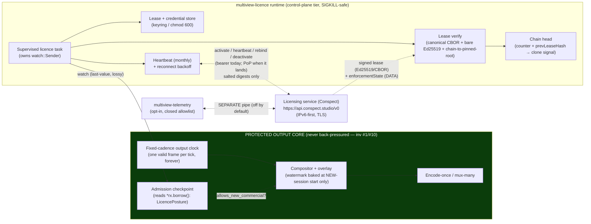

> **Design brief — Runtime commercial licensing & entitlement (Conspect device integration).**
> Authoritative research/design record backing the implementation. Produced by a verification-hardened
> design workflow against the Conspect device-facing OpenAPI (base `https://api.conspect.studio/v0`;
> first cut against `Conspect API` v0.4.0 — the current baseline is v0.6.0, and the concrete wire
> specifics (§2/§5) are re-pinned against the live docs at CONSPECT-3 implementation). Canonical
> crate/API naming lives in [docs/architecture](../architecture/).
>
> **Status: design of record; ~90% IMPLEMENTED.** The crate is `multiview-licence` (on disk) and most
> of this brief is shipped: CONSPECT-0/1/2/4/6/7/8/9/10/11 (PRs #86/#90/#92/#94/#104/#106/#109/#111/#120/#122)
> delivered the always-compiled state model (lease/ladder/fingerprint/verify/challenge/store), the three
> never-off-air engine seams S1/S2/S3 (proven by the CONSPECT-2 chaos gate), the control routes, the
> mesh plane, and the web screens. **The only remaining work is the API-gated remainder:** CONSPECT-3
> (the feature-gated `heartbeat` network client + S4 status + lease renew) and CONSPECT-12 (live-wire +
> on-hardware validation), both blocked on the Conspect API finalization (D1 key-trust/rotation, D2
> PoP request-signing, D3 canonical-CBOR lease pre-image + golden vector) and operator confirmations
> O1–O4 — see **[ADR-0096](../decisions/ADR-0096.md)** for the gate + the verification checklist. The
> ADRs of record are **[ADR-0050](../decisions/ADR-0050.md)/[0051](../decisions/ADR-0051.md)/[0052](../decisions/ADR-0052.md)/[0053](../decisions/ADR-0053.md)**
> (account licensing) + ADR-0096; the "ADR-L family" was a working label this brief used pre-numbering,
> superseded by those. Tense note: where the body says "will"/"the design is", read it as shipped
> behaviour except for the CONSPECT-3/12 items explicitly flagged as gated.

---

# Multiview Runtime Licensing & Entitlement — Authoritative Brief

**Status:** Proposed (design) — docs-only; implementation follows in dependency-ordered lanes.
**Date:** 2026-06-15
**Owning crate (new, greenfield, leaf):** **`multiview-licence`** (pure-Rust core, library target
`multiview_license`; **no FFI, no GPU**).
**Touched crates:** `multiview-core` (a small shared `LicencePosture` enum the engine reads),
`multiview-engine` (reads a `watch<LicencePosture>` — sampled, never awaited), `multiview-control`
(REST/WS surface + persistence of device credentials), `multiview-config` (offline-lease + endpoint
config), `multiview-cli` (wires the licence client; `anyhow` only at this boundary),
`multiview-telemetry` (the opt-in product-telemetry pipe — a **separate** transport from the licensing
heartbeat). The compositor/overlay gain a small **watermark-new-sessions** affordance driven entirely
by the posture value (§7).
**Vendor:** the licensing service is referred to throughout as **"the licensing service"** (its product
name is *Conspect*). This brief models only the **device/runtime side** — the client Multiview ships.

> **Scope boundary — read this first.** There are **two** Multiview-side design records for this
> service and they do **not** overlap:
>
> | This brief (`licensing-runtime.md`) | The companion brief ([`conspect-account-architecture.md`](conspect-account-architecture.md)) |
> |---|---|
> | The **device/runtime client** Multiview ships: the `multiview-licence` crate, the engine seam, the lease verifier, fingerprinting, the offline flow, the entitlement↔build channel, the watermark-new-sessions enforcement affordance. | The **account/org-side** subsystem: org/seat administration, mesh discovery/relay, two-pipe consent governance, support/ticketing, the portal-facing constants. |
> | Grounded in the **device-facing OpenAPI on disk** (v0.4.0) — exact field names verified. | Written before the spec was on disk; treats the spec as an external companion. |
> | Crate spelling: **`multiview-licence`** (American — matches the in-tree NDI `license.rs` gate and this brief's binding scope). | Crate spelling: `multiview-licence` (British). |
>
> **Naming reconciliation (operator-confirm, §13.2):** the two briefs currently spell the new leaf
> crate differently. They describe the **same** crate. This brief uses `multiview-licence`
> (consistent with the existing `crates/multiview-input/src/ndi/license.rs` codec gate and
> `crates/multiview-output/src/ndi/license.rs`). The account-side brief is on an unmerged branch; the
> spelling must be unified to **one** crate before either lands. We propose `multiview-licence`.

---

## 0. The four rules that shape everything (read this first)

Four rules govern every decision below. They are the reason the subsystem is shaped the way it is, and
they are not negotiable.

1. **The output clock is untouchable (invariant #1).** Licensing **never** stops, stalls, or de-paces
   running program output. No data-plane code path
   (decode→composite→encode→mux→[output clock](core-engine.md)) ever makes a network call, takes a
   lock a licensing task can hold, or `.await`s a licensing result. The hardest enforcement rung the
   ladder can reach **still emits one valid frame per tick, forever** on every program that is already
   on air. This is a product promise, not a nicety. (Full safety analysis: §8.)

2. **Licensing is data the engine *samples*, never control flow that *gates* it (invariant #10).**
   The licensing client publishes a single last-value `watch<LicencePosture>`. The engine reads the
   latest value at frame-boundary checkpoints (a wait-free load) and at no other time. The licensing
   client is **physically incapable of back-pressuring the engine** — it owns no channel the engine
   blocks on, and the engine never sends to it on the data plane. A CI chaos gate proves that
   killing, stalling, or partitioning the licensing service leaves program output bit-for-bit
   unaffected (§8.3, §17).

3. **Default-allow / fail-open on uncertainty.** Any ambiguity — the service is unreachable, a lease
   is being refreshed, the clock looks wrong, a response is malformed — resolves toward **keeping
   output up and features available**. Enforcement only ever *tightens* on a **positive, verified**
   signal (a validly-signed lease whose `enforcementState` says so, or a verified-expired lease). We
   never fail *closed* into degrading a customer's program because we could not reach a server.

4. **Privacy is structural, not promised.** The device **never** transmits a raw serial, MAC, UUID,
   or TPM endorsement key. Identity travels as **salted SHA-256 digests** plus a `0..=100` match
   score. Product telemetry is **off by default, opt-in, a closed allowlist** on a **separate
   transport** from the licensing heartbeat — the two are never co-mingled (§9, §10).

Everything in `multiview-licence` is **greenfield**. The only licensing precedent in the tree is the
**NDI codec-licence gate** (`crates/multiview-input/src/ndi/license.rs`,
`crates/multiview-output/src/ndi/license.rs`) — a *codec/SDK* acceptance gate, unrelated to *account*
entitlement. Greenfield is an advantage: the new leaf crate collides with nothing and is built first
(§13).

---

## 1. What we are integrating — and the three targets on one code path

The licensing service is an entitlement/licensing API. Multiview ships a **device client** for it. The
operator decision is unambiguous: **build all three deployment shapes on one code path**, because the
free tier is itself a licence, so the whole fleet runs the same client.

| Target | What it is | Why it is the same code path |
|---|---|---|
| **Self-hosted claim-code activation** | A home/non-commercial or commercial operator runs the `multiview` binary and either redeems a claim code (paid order) or **auto-issues a free licence** (claim code omitted). | `activate` with-or-without a claim code is one call; the free tier returns a real signed lease. |
| **Entitled-build auto-update** | A licensed device resolves the exact build it is entitled to and updates to it. | `resolveDeviceBuild` returns a signed artefact manifest + a short-lived download URL; the device verifies and applies it. |
| **Appliance / fleet provisioning** | A vendor/partner ships pre-bound appliances and fleets at scale. | Same `activate`/`heartbeat`/`rebind`/`deactivate` lifecycle; provisioning differs only in *who* holds the bearer token and *when* the claim happens. |

The free tier is **not** a degraded unlicensed state — it is a first-class licence with a lease and an
`enforcementState`. This is why there is no separate "unlicensed" client: there is one client, and the
free tier is one of its valid postures.

---

## 2. The device-facing contract (verified against the on-disk spec)

The following endpoints, fields, and enums are **verified against `Conspect API` v0.4.0** on disk
(`jq` over the spec). Field names are reproduced **exactly** because the implementation, the tests, and
the service must agree byte-for-byte.

### 2.1 Endpoints the device calls

| # | Operation (`operationId`) | Method + path | Purpose | Idempotency |
|---|---|---|---|---|
| 1 | `activateDevice` | `POST /organisations/{orgId}/activate` | Redeem a claim code **or** auto-issue a free licence; returns the first signed lease + `enforcementState`. | `idempotency-key` (required on mutations) |
| 2 | `heartbeat` | `POST /organisations/{orgId}/heartbeat` | Monthly keep-alive; renews the chained 35-day lease; returns `lease` + `enforcementState` + `nextDue`. | `idempotency-key` |
| 3 | `rebindInstance` | `POST /organisations/{orgId}/rebind` | Lawful hardware change; **same binding, no new seat**; needs ≥ engineer role. | `idempotency-key` |
| 4 | `deactivateInstance` | `POST /organisations/{orgId}/deactivate` | Return the seat; idempotent; **never touches running output**. | `idempotency-key` |
| 5 | `getDeviceLicenceState` | `GET /devices/me/licence` | All of the caller's instances + each one's enforcement rung. **Always `200`.** | — |
| 6 | `resolveDeviceBuild` | `GET /devices/me/build?licenceId&platform` | The entitled signed build (download) **or** `{state:"pending"}`. **Always `200`.** | — |
| 7 | `exportOfflineChallenge` | `GET /devices/me/licence/challenge?bindingId` | Export a `.challenge` file (CBOR) for an air-gapped lease issuance. | — |
| 8 | `installOfflineLease` | `POST /devices/me/licence/lease` | Install an org-signed offline (90-day) lease file. | `idempotency-key` |
| 9 | `getTelemetryConsent` | `GET /devices/me/telemetry/consent?organisationId&licenceId` | Read the licence's telemetry-consent posture. | — |
| 10 | `setTelemetryConsent` | `PUT /devices/me/telemetry/consent` | Set telemetry consent (opt-in). | `idempotency-key` |

> **Activate/heartbeat/rebind/deactivate live under `/organisations/{orgId}/…`, not `/devices/me/…`.**
> That is deliberate on the service side and matches the deferred-device-auth reality (§3): today the
> device authenticates these lifecycle calls with an **operator-provisioned account bearer token**
> scoped to the org. The read-only/self endpoints (`/devices/me/licence`, `/devices/me/build`,
> `/devices/me/licence/*`, `/devices/me/telemetry/consent`) are the device's own surface.

### 2.2 The enforcement ladder is **data on every response** (the 9 rungs, exact)

The spec carries `enforcementState` as a **string enum field** on `ActivateResponse`,
`HeartbeatResponse`, and each `DeviceInstance` in `GET /devices/me/licence`. It is **never** a control
verb. The nine rungs, verified verbatim:

```
compliant | grace | lapsed_soft | lapsed_hard | evaluation | on_hold | class_mismatch | over_gpu | revoked
```

We map these onto our internal `LicencePosture` (§6) — the engine reads our enum, not the wire string,
so a future rung the service adds degrades **safely** (an unknown rung maps to the most-permissive
posture, never to a stricter one — fail-open, Rule 3).

### 2.3 The lease object (bare Ed25519 over canonical CBOR — exact fields)

`ActivationLease` and `HeartbeatLease` carry, verified:

| Field | Type | Meaning (from the spec) |
|---|---|---|
| `serial` | string | Signer-minted lease serial, **UUIDv7** — the lease-ledger/transparency key and the per-instance chain anchor. |
| `licenceId` | string (activation lease) | The licence this lease was issued against. |
| `instanceBindingId` | string (activation lease) | The seat-consuming, lease-bearing instance binding. |
| `notAfter` | integer | Lease expiry in **epoch milliseconds** — issue + **35 days online** (90 days offline). |
| `signature` | string | **Bare Ed25519 (EdDSA)** over the canonical-CBOR lease body, **lower-case hex**. (No COSE wrapper.) |
| `signerKeyId` | string | The **dual-pin intermediate key** id the lease was signed under (rotating). |

The verification model (Rule 4 + §5): the device canonicalises the lease body to CBOR, verifies the
bare Ed25519 `signature` against the public key identified by `signerKeyId`, and checks that
`signerKeyId` **chains to a pinned root trust anchor** shipped with the build (§5.1, the first
confirmed contract gap). Then it checks `notAfter` against a **trusted** clock (§5.3).

### 2.4 Activation request — the identity triple + the PoP key (privacy-load-bearing fields)

`ActivateRequest` carries, verified — note every identity field is a **salted digest or a score**,
never a raw identifier:

| Field | Type | Privacy note |
|---|---|---|
| `machineId` | string | The registered machine id (a service-side handle, not a hardware serial). |
| `claimCode` | string (optional) | The 6-character single-use claim code from a paid order. **Omit to auto-issue a free non-commercial licence.** |
| `fingerprintDigest` | string | **Salted SHA-256, lower-case hex.** "Raw serials/MACs/TPM-EK never leave the machine." Carried inside the signed lease body. |
| `fingerprintScore` | integer | The weighted match score `0..=100`. **Activation requires ≥ 70** (`REBIND_THRESHOLD`); below it the device must re-fingerprint. |
| `hardwareDigest` | string | Salted digest shared by co-located sibling instances on one machine — part of the seat-key identity triple. |
| `instanceId` | string | The instance id (seat-consuming, lease-bearing unit). |
| `instanceDiscriminatorHash` | string | `SHA-256(server-salt ‖ instance_slug)` — the no-cross-tenant-collision guarantee. |
| `instanceDiscriminatorDigest` | string | Salted SHA-256 digest carried inside the signed lease body. |
| `devicePublicKey` | string | The instance's **Ed25519 device proof-of-possession PUBLIC key**, stored on the binding. Authenticating *with* it is **deferred** service-side (§3). |
| `serverNonce` | string | The server-issued freshness anchor for the per-instance lease chain. |

`HeartbeatRequest` carries `bindingId`, `leaseSerial` (nullable), `fingerprintDigest`, `appVersion`,
and a `transport` enum (`direct | relay | file`). `RebindRequest` carries `licenceId`, `bindingId`,
`instanceId`, `instanceDiscriminatorHash`, `fingerprintDigest`, `fpScore`. `DeactivateRequest` carries
only `bindingId`.

### 2.5 Build resolution + offline + consent (exact shapes)

- **`BuildResolution`** = `{ state: "available" | "pending", variantKey?, download? }`.
  `BuildResolutionDownload` = `{ url (short-lived presigned GET), manifest (signed artefact manifest),
  signature (Ed25519 hex over the manifest pre-image), signerKeyId, contentDigest (sha256 hex — the
  lease's build-variant digest) }`. The device **verifies `signature` and `contentDigest` before
  applying** (§11).
- **`OfflineChallenge`** = `{ filename, mediaType, challenge (CBOR) }` — exported, carried to the org
  out-of-band, signed into a 90-day lease, then installed via `installOfflineLease`.
- **`OfflineLeaseInstallRequest`** = `{ bindingId, lease, signature, signerKeyId, fingerprintDigest,
  leaseSerial }` → `OfflineLeaseInstallResponse` = `{ bindingId, leaseSerial, installedAt }`.
- **`TelemetryConsentView`** = `{ licenceId, enabled, changedAt, actor }`;
  **`TelemetrySetConsentRequest`** sets `enabled`. Consent defaults **off**.

### 2.6 Error model + auth (matches our own conventions)

The service uses **RFC 9457 `application/problem+json`** (`Problem` = `{ type, title, status, detail?,
instance? }`) — the **same** error model Multiview's own API mandates ([conventions §6](../architecture/conventions.md)).
Mutations require an **`idempotency-key`** header. The spec declares **no global security scheme**
(consistent with §3: device-native auth is deferred; a bearer token is used today). The seat-limit
condition on activate is **`409`** — which, per the operator decision, means a **START refusal**, never
an interruption (§8). A fingerprint below threshold is **`422`**.

---

## 3. Two confirmed contract gaps (design around them; do not block)

These are gaps in the **service-side** contract that the device design must accommodate **today**, with
a clean upgrade path. They are dependencies on the service publishing more, **not** blockers.

### 3.1 Gap A — trust-anchor distribution is out-of-band

**There is no key/JWKS endpoint on the device API.** The device's lease-verification **root** must be
**pinned/shipped with the build**, and the rotating intermediate (`signerKeyId`) must **chain to that
root**. The design (§5.1):

- Ship a **pinned root trust anchor** (or a small pinned set, for rotation overlap) compiled into the
  `multiview-licence` crate / the signed build manifest.
- Accept rotating intermediate signer keys **only** when they chain to a pinned root; cache verified
  intermediates locally with their own expiry.
- **Flag:** this is a hard dependency on the licensing service **publishing its key-trust model**
  (root set, rotation cadence, intermediate-chain format). Until then we pin the root the operator
  provides out-of-band. Recorded as an operator-confirm item (§13).

### 3.2 Gap B — device-native authentication is deferred service-side

The device **registers** an Ed25519 PoP public key (`devicePublicKey`) at activate, but
**authenticating a request *with* that key is "the deferred device-credential wire format."** Today,
device calls authenticate with an **operator-provisioned account bearer token** (PAT/API key). The
design (§5.4):

- **Today:** the client sends the operator-provisioned bearer token on every call; the token is stored
  via the OS keyring / a `chmod 600` secret file, never logged, never in config-as-code exports.
- **Now, in parallel:** the client **generates and persists the device Ed25519 keypair** at first
  activate (the public half is sent as `devicePublicKey`; the private half stays on the device, in the
  keyring). When the device-credential wire format lands, the client switches to **PoP request
  signing** with the key it already holds — no re-provisioning, no re-activation.
- **Flag:** a dependency on the licensing service shipping the PoP wire format. Recorded in §13.

---

## 4. The `multiview-licence` crate — shape and dependency direction

`multiview-licence` is a **pure-Rust leaf** (no FFI, no GPU, no native deps) so it builds in the
GPU-free CI baseline and adds nothing to the default build's link surface.

```
multiview-core  ──►  multiview-licence  ──►  multiview-cli   (wires the client; anyhow only here)
      ▲                     │   │
      │                     │   └──►  multiview-control   (REST/WS surface + credential persistence)
   (shared LicencePosture)  │
                            └──►  multiview-engine  reads  watch<LicencePosture>  (sampled, never awaited)

   multiview-telemetry  ◄── opt-in product-telemetry pipe (SEPARATE from the licensing heartbeat)
```

- **Dependency direction (no cycles):** `core ← license`; `cli` depends on `license`; `engine` reads a
  `watch<LicencePosture>` published by the licence runtime (it does **not** depend on
  `multiview-licence` for types beyond the shared posture enum, which lives in `multiview-core`);
  `control` depends on `license` for its REST/WS surface and persists the device credentials. This
  matches the canonical dependency rules ([conventions §3](../architecture/conventions.md)).
- **Error handling:** a single per-crate `Error` enum via `thiserror` (`LicenseError` with variants
  `Transport`, `Verify`, `Untrusted`, `Expired`, `ClockUntrusted`, `Malformed`, `SeatLimit`,
  `Fingerprint`, …). `anyhow` appears **only** at the `multiview-cli` boundary.
- **Absolute typing:** no `unwrap`/`expect`/`panic`/`todo`/`unimplemented`/`indexing_slicing`/
  `as_conversions` in non-test code; `unsafe` is `forbid`. Wire enums are modelled with serde
  **adjacently/internally-tagged** representations (`#[serde(tag = "…")]`) — **never `untagged`**
  ([conventions §9](../architecture/conventions.md)). Unknown enum variants deserialize to an explicit
  `Unknown` arm that maps to the most-permissive posture (Rule 3).
- **Crate modules (proposed):** `client` (the typed HTTP client over the verified contract),
  `lease` (canonical-CBOR encode + bare-Ed25519 verify + chain-to-root), `chain` (the per-instance
  monotonic counter + `prevLeaseHash` clone-signal logic, §5.2), `fingerprint` (salted-digest +
  score), `posture` (wire `enforcementState` → `LicencePosture` mapping), `runtime` (the supervised
  task that owns the `watch` sender, heartbeat cadence, and reconnect), `offline` (challenge/lease
  file I/O), `store` (lease + credential persistence).

---

## 5. The lease & crypto model (device side)

### 5.1 Verification chain (Gap A)

A lease is trusted iff **all** hold: (1) the canonical-CBOR body re-serialises to the bytes the
`signature` covers; (2) the **bare Ed25519** `signature` verifies against the public key named by
`signerKeyId`; (3) `signerKeyId` **chains to a pinned root** shipped with the build; (4) the lease has
not been replaced by a **diverging chain** (§5.2); (5) `notAfter` is in the future on a **trusted
clock** (§5.3). Any failure → the lease is **ignored**, and the device falls back to the
last-known-good lease if one is still valid, else to fail-open posture (Rule 3). The verification is
**bare Ed25519 over canonical CBOR — no COSE**, exactly as the spec's `signature`/`signerKeyId` fields
describe.

### 5.2 The chain — clone detection without an active kill

Each instance keeps a **monotonic counter** and the **`prevLeaseHash`** of its last installed lease;
each new lease extends the chain. **Replaying an older `serial`** (a cloned device presenting a stale
lease) makes the chain **diverge** — a **clone signal**. The device's role is to (a) refuse to *regress*
its own chain (it will not install a lease older than its current head), and (b) surface the divergence
as a health signal to the service via the next heartbeat's salted digests. Detection is the service's
job (it holds the lease-ledger); the device contributes the chain evidence. **Revocation is by
non-reissue** — a revoked instance's lease simply **ages out** (`notAfter` passes); there is **no
active "kill" verb** the service can send, and so **no code path that can take a running program off
air** (§8).

### 5.3 Trusted-clock dependency (a real footgun, handled)

`notAfter` is epoch-ms, so lease validity depends on the device clock. A device with a **wrong clock**
must not be enforced against a "future" expiry, and must not be tricked into honouring an
ancient-but-"valid" lease. The design:

- The runtime derives a **clock-trust verdict** (reusing the engine's existing PTP/NTP lock-state
  machine where present, per [wall-clock-sync](wall-clock-sync.md)): `Trusted` (synced),
  `Suspected`, or `Untrusted`.
- On `Untrusted`, expiry comparisons are **not** used to *tighten* posture — uncertainty fails **open**
  (Rule 3). A monotonic "time since last verified contact" bound is used instead, which cannot be
  rolled back by changing the wall clock.
- A grossly-backwards wall-clock jump is treated as `Untrusted`, never as "the lease is now valid
  again."

### 5.4 Device credential (Gap B) + secret hygiene

The device Ed25519 keypair is **generated at first activate**, the public half sent as
`devicePublicKey`, the private half stored in the **OS keyring** (or a `chmod 600` file fallback),
**never logged** and **never** in config-as-code exports. The bearer token used today is stored the
same way. Both are read at runtime, used over **TLS to a bracketed IPv6-first endpoint** (§12), and
zeroized from memory after use where practical.

---

## 6. The engine seam — `watch<LicencePosture>`, sampled at frame boundaries

This is the heart of the isolation guarantee (Rule 2, invariant #10).

- `multiview-core` defines a small, `Copy`, `#[non_exhaustive]` **`LicencePosture`** enum that the
  engine understands. The licence runtime maps each wire `enforcementState` onto it:

  | Wire `enforcementState` | `LicencePosture` | Engine behaviour (NEW work only) |
  |---|---|---|
  | `compliant`, `evaluation` | `FullyLicensed` | Everything works; no banner, no watermark. |
  | `grace`, `lapsed_soft` | `WarnOnly` | **Full function**; UI warning banner; **no** watermark. |
  | `lapsed_hard`, `revoked` | `RefuseNewCommercial` | Commercial-only **new** outputs/features refuse to **start**; free tier always starts; **"UNLICENSED" watermark on program outputs started while in this posture** (§7); running outputs untouched; prominent banner. |
  | `on_hold` | `WarnOnly` (billing hold ≠ revocation) | Full function; banner explaining the hold. |
  | `over_gpu` | `CapNewPlacement` | New placement capped to the licensed GPU count + warn; **never migrate/kill** a running pipeline. |
  | `class_mismatch` | `CapNewPlacement` | New placement capped to the licensed class + warn; running pipelines untouched. |
  | *(unknown future rung)* | `FullyLicensed` | Fail-open (Rule 3). |

- The licence runtime owns the **`watch::Sender<LicencePosture>`**; the engine holds only a
  `watch::Receiver`. The engine reads `*rx.borrow()` (a wait-free load) **at frame-boundary
  checkpoints** — when admitting a *new* output/pipeline, when stamping the watermark decision onto a
  *new* program session, and in the periodic supervisor tick — and **at no point on the per-frame hot
  path**. The engine **never `.await`s** the receiver on the data plane.
- **Why `watch` and not a queue:** a `watch` channel is last-value, lossy, and the reader never blocks
  the writer (and vice-versa). The licence runtime can stall, crash, or be SIGKILLed and the engine
  keeps reading the **last posture it saw**, forever, with default-allow on the initial value. There
  is **no** bounded queue, mutex, or oneshot the engine can be parked on. This is the same structural
  isolation the [preview subsystem](preview-subsystem.md) §2 uses for taps and
  [realtime-api](realtime-api.md) uses for events.

---

## 7. Enforcement posture — "never-off-air + watermark new sessions" (the operator decision, exact)

The binding enforcement posture is **never-off-air, plus a watermark on new sessions started while
unlicensed.** Spelled out precisely:

- **Running program output is NEVER interrupted at ANY rung.** Not stalled, not de-paced, not
  watermarked-after-the-fact, not torn down. A program that is on air **stays exactly as it was**
  (invariant #1). This holds for `revoked` just as for `compliant`.
- **`grace` / `lapsed_soft` (→ `WarnOnly`):** **full function**, prominent **UI warning banner**, and
  **no watermark anywhere**. The operator is told to renew; nothing is degraded.
- **`lapsed_hard` / `revoked` (→ `RefuseNewCommercial`):**
  - The **free tier ALWAYS works** — every free-tier output/feature starts normally.
  - **Commercial-only** features/outputs **refuse to START** (a typed `LicenseError::SeatLimit` /
    `…::RefusedUnlicensed` surfaced as RFC 9457 `problem+json`, never a crash, never a silent no-op).
    Already-running commercial outputs **keep going untouched**.
  - A **prominent banner** is shown in the UI.
  - A visible **"UNLICENSED" badge/watermark** is composited onto program outputs **started while in
    this posture** — and **only** those. **Never** on an already-running program (we never reach back
    into a running session). **Never** on free/compliant/grace/on_hold output.
- **`over_gpu` / `class_mismatch` (→ `CapNewPlacement`):** cap **new** placement to the licensed GPU
  count/class and **warn**; **never migrate or kill** a running pipeline (consistent with the
  [GPU placement principle](gpu-placement-engine.md): load only *informs* placement, never fragments a
  running pipeline).

**Watermark mechanics (compositor/overlay).** The watermark is a small, legible **"UNLICENSED"** mark
composited as an overlay layer **at session start** for new program sessions whose posture is
`RefuseNewCommercial`. It is decided **once, at admission**, from the sampled posture value and **baked
into that session's overlay set** — it is **not** re-evaluated per frame (per-frame licence checks are
forbidden by Rule 1) and it is **not** added to or removed from a session after it starts. The decision
is a pure function of `(posture_at_session_start, is_free_tier_output)`. It rides the existing
[overlay](resilience-and-av.md) layer compositing — no new hot-path branch in the compositor inner
loop.

| Rung → posture | Free tier | New commercial output | Already-running output | Banner | Watermark on NEW commercial sessions |
|---|---|---|---|---|---|
| compliant / evaluation → `FullyLicensed` | ✅ starts | ✅ starts | ✅ untouched | — | ❌ |
| grace / lapsed_soft / on_hold → `WarnOnly` | ✅ starts | ✅ starts | ✅ untouched | ⚠️ warn | ❌ |
| lapsed_hard / revoked → `RefuseNewCommercial` | ✅ starts | ⛔ refuses to start | ✅ untouched | ⚠️ prominent | ✅ "UNLICENSED" |
| over_gpu / class_mismatch → `CapNewPlacement` | ✅ starts | ✅ within cap; ⛔ above cap | ✅ untouched | ⚠️ warn | ❌ |

---

## 8. The never-off-air safety analysis (invariant #1 + #10)

This section is the proof obligation. It must survive adversarial review.

### 8.1 The data plane makes no licensing call, ever

The decode→composite→encode→mux→clock path contains **zero** licensing logic. The only licensing
artefact it touches is a `watch::Receiver<LicencePosture>` read **at frame boundaries** (a wait-free
atomic load of a `Copy` enum), used **only** to decide whether to *admit a new session* and whether a
*new* session is watermarked. There is no network call, no lock shared with a licensing task, no
`.await`, and no allocation on this path attributable to licensing.

### 8.2 Every enforcement action is a START-time refusal or a NEW-session decoration

Re-read §7: the strongest thing the ladder ever does is **refuse to start** a new commercial output and
**decorate a new** session with a watermark. Neither touches a running pipeline. There is **no service
verb** that reaches into the engine — recall revocation is **by non-reissue** (§5.2), so even a
fully-`revoked` device only ever **fails to start new** commercial work; its running programs are
sacrosanct. The seat-limit `409` is therefore correctly a **START refusal**, never an interruption.

### 8.3 The licensing client cannot back-pressure the engine

The licence runtime is a **supervised control-plane task** (the same tier as preview/telemetry, never
the protected output core). It owns the `watch` **sender**; the engine owns only a **receiver**. There
is no path from the runtime *into* the engine that the engine blocks on. If the runtime stalls
(network hang), crashes (panic in parsing), or is SIGKILLed:

- the engine keeps reading the **last posture** and emits frames unaffected;
- on a cold start with no posture yet, the initial value is **`FullyLicensed`** (default-allow);
- a slow/hostile licensing **server** cannot stall the runtime in a way that touches the engine,
  because the runtime's HTTP calls are bounded-timeout and entirely off the data plane.

### 8.4 The CI chaos gate (hard requirement)

A chaos/soak test (§17) **kills, stalls, and partitions the licensing service** (and SIGKILLs the
licence runtime task) under load and asserts the program output is **bit-for-bit unaffected** with
**zero added frame-interval jitter** and **zero zero-gap-SLO violations** — the same harness the engine
already uses for the output-clock invariant. "Licensing cannot back-pressure the engine" is a **gate**,
not a hope. This mirrors the isolation gates the preview and realtime subsystems already carry.

---

## 9. Privacy — salted digests, never raw identifiers

Identity leaves the device **only** as salted SHA-256 digests plus a score (verified field names in
§2.4):

- **`fingerprintDigest` / `instanceDiscriminatorDigest` / `hardwareDigest`** are lower-case-hex
  salted SHA-256. **Raw serials, MACs, UUIDs, and TPM endorsement keys never leave the machine** —
  this is an invariant of the design, not a setting.
- **`fingerprintScore`** is a weighted `0..=100` match score; **≥ 70** (`REBIND_THRESHOLD`) means
  "same machine, hardware drift tolerated"; below it forces a re-fingerprint / re-claim.
- The salt is server-issued (`serverNonce` / the discriminator salt), so digests are **not** linkable
  across tenants and cannot be reversed to the underlying identifiers.
- The fingerprint computation lives in `multiview-licence::fingerprint`, is **pure** (testable without
  hardware via injected component readings), and is **property-tested** for monotonic score behaviour
  under single-component drift (a NIC swap drops the score a bounded amount and stays ≥ 70; a
  wholesale re-platform drops below 70).

---

## 10. Telemetry — opt-in, closed allowlist, a SEPARATE pipe from the heartbeat

This must never be conflated with the licensing heartbeat. They are **two pipes**:

| | Licensing heartbeat | Product telemetry |
|---|---|---|
| Endpoint | `POST /organisations/{orgId}/heartbeat` | the telemetry pipe (`/telemetry`, consent at `/devices/me/telemetry/consent`) |
| Default | **mandatory** monthly keep-alive (it is what keeps the lease live) | **OFF** — opt-in only |
| Payload | only what licensing needs: `bindingId`, `leaseSerial`, **salted** `fingerprintDigest`, `appVersion`, `transport` | a **closed allowlist** of fields; **any extra field is rejected `422`** |
| Consent | not a consent surface (it is the licensing keep-alive, not analytics) | `TelemetryConsentView { enabled, changedAt, actor }`; defaults `enabled:false` |
| Transport | the licence runtime | a **separate** transport in `multiview-telemetry` |
| Retention/copy | licensing | product analytics — distinct privacy copy in the UI |

The settings UI, the API docs, and the privacy copy must **never present them as one switch.** The
heartbeat is **not** "telemetry you can't turn off"; it is the licensing keep-alive. The telemetry
client enforces the **closed allowlist locally** (it cannot send a field the allowlist does not name)
so a future code change cannot silently widen what is sent — the allowlist is the contract, mirroring
the service's `422`-on-extra-field behaviour.

---

## 11. Entitlement ↔ build ↔ feature-gate reconciliation

Three notions of "what this device may do" must line up, and the brief pins how:

1. **Build profile (compile-time license obligations).** The Multiview build is LGPL-clean by default;
   `gpl-codecs` makes it GPL; `ndi` is runtime-loaded + runtime-accepted ([conventions §7](../architecture/conventions.md)).
   This is about **Multiview's own + third-party code licences** and is **orthogonal** to the
   commercial *entitlement*. The watermark/refuse-new logic **never** changes the build profile and
   the build profile **never** changes the entitlement posture. They are kept explicitly separate to
   avoid the classic "is this a codec licence or a commercial licence?" confusion (the NDI gate is the
   former; Conspect is the latter).
2. **Entitled build (auto-update channel).** `resolveDeviceBuild?licenceId&platform` returns the exact
   artefact the device is entitled to (`BuildResolutionDownload`). The device **verifies the signed
   manifest `signature` (Ed25519 hex) and `contentDigest` (sha256) against the same pinned-root chain
   as leases (§5.1) before applying** — an entitled build is only trusted if it verifies. `platform`
   is IPv6-first-irrelevant but must name the exact target (e.g. `linux-x86_64`, `linux-aarch64`,
   `macos-aarch64`, `macos-x86_64` — **no Windows**, per [core-engine §2](core-engine.md)).
3. **Runtime feature gate (the posture).** `LicencePosture` (§6) decides at **admission** whether a
   *new* commercial output/feature may start. Commercial-only surfaces query a single
   `posture.allows_new_commercial()` predicate at start; the free tier never asks. The set of
   "commercial-only" features is **data** (a typed table), not scattered `if` checks, so it is
   auditable and testable.

A device can be (a) on the **entitled** build, (b) running a **compliant** posture, and (c) within its
GPU/class caps — three independent checks that the management UI surfaces independently so an operator
can see *which* of the three is the reason for any refusal.

---

## 12. Networking — IPv6-first, by construction

All licensing network surfaces are **IPv6-first** ([conventions §10](../architecture/conventions.md),
[ipv6-first](ipv6-first.md)):

- The base URL is `https://api.conspect.studio/v0` (TLS). The HTTP client **prefers IPv6** (AAAA) and
  brackets any IPv6 literal in any derived URL.
- Any **local** listener the licence/consent UI exposes (it is served via `multiview-control`) binds
  **dual-stack `[::]`** (`IPV6_V6ONLY=false`), never `0.0.0.0`; loopback is `[::1]`.
- The offline-lease file flow (challenge export / lease install) is transport-agnostic (sneakernet),
  so it is unaffected — but any helper URL printed for the operator uses bracketed IPv6 form.
- TLS is rustls-based (consistent with [acme-tls](acme-tls.md)); the licensing client validates the
  server certificate normally **in addition to** the application-layer lease-signature chain (§5.1) —
  the two are independent trust layers.

---

## 13. Open items — operator-confirm + service dependencies (explicit)

Per Rule "design is a quality step, not a hand-off," these are flagged, not parked. None blocks writing
the ADR-L family.

### 13.1 Service-side dependencies (track upstream)

| # | Dependency | Our posture until it lands |
|---|---|---|
| D1 | **Key-trust model** (root set, rotation cadence, intermediate-chain format) — Gap A. | Pin the operator-provided root out-of-band; accept intermediates that chain to it. |
| D2 | **Device-credential (PoP) wire format** — Gap B. | Bearer token today; generate+persist the device keypair now; switch to PoP signing when it ships. |
| D3 | **Canonical-CBOR field ordering** for the lease body the device re-serialises. | Implement a deterministic canonical-CBOR encoder; pin a golden vector once the service confirms the exact pre-image. |

### 13.2 Operator-confirm items

| # | Item | Proposed default |
|---|---|---|
| O1 | **Crate spelling** — `multiview-licence` (this brief) vs `multiview-licence` (account brief). | **`multiview-licence`** (matches the in-tree NDI `license.rs`). Unify before either lands. |
| O2 | The exact **commercial-only feature set** (the data table in §11.3). | Conservative: only features that are unambiguously commercial; free tier defined by exclusion. Confirm the list. |
| O3 | **Watermark copy/placement** — the exact "UNLICENSED" string + corner. | Small, legible, bottom-corner; non-defamatory; vendor-neutral. |
| O4 | **`orgId` provisioning** for self-hosted (which org a free self-host activates against). | A well-known default org for free auto-issue; operator-set for paid/fleet. Confirm. |

### 13.3 The companion ADRs are the licensing service's, NOT ours (disambiguation)

The on-disk spec's prose cites **Conspect-internal** documents and ADRs — `licensing-architecture.md`,
**Conspect** `ADR-0036`, `ADR-0015`, `ADR-0014`, `ADR-0037`, `ADR-0004`, `ADR-0009`, `ADR-0003`,
`ADR-0025`. **These are the licensing service's own internal records, not Multiview's.** Do **not**
cite them as Multiview ADRs (Multiview has its own `ADR-0036` etc., about codec capabilities, that are
entirely unrelated). Multiview's licensing decisions are the **ADR-L family** below. When this brief
needs to reference a service concept it says "**Conspect ADR-00xx**" explicitly.

---

## 14. Decisions of record (the "ADR-L family", consolidated)

This brief's design was recorded as the numeric **account-licensing ADRs**. The "ADR-L"
labels below were this brief's working names; they were consolidated into the ADRs of
record (the device live-wire heartbeat client itself, CONSPECT-3, is gated per
[ADR-0096](../decisions/ADR-0096.md)):

| Working label | Decision | Recorded in |
|---|---|---|
| ADR-L001 | `multiview-licence` (pure-Rust leaf) + the sampled-data engine seam; licensing is data the engine samples, never data-plane control flow. | [ADR-0050](../decisions/ADR-0050.md) |
| ADR-L002 | Lease trust: bare Ed25519 over canonical CBOR, pinned-root chain (Gap A), per-instance counter + `prevLeaseHash` clone signal, revocation-by-non-reissue. | [ADR-0050](../decisions/ADR-0050.md) + [ADR-0096](../decisions/ADR-0096.md) (wire trust D1/D3) |
| ADR-L003 | Never-off-air posture + watermark-new-sessions; the 9 wire rungs → `LicencePosture`; START-time refusal only; watermark decided once at admission. | [ADR-0050](../decisions/ADR-0050.md) |
| ADR-L004 | Identity & privacy: salted SHA-256 digests only, `fingerprintScore ≥ 70`, raw identifiers never transmitted; device PoP keypair. | [ADR-0050](../decisions/ADR-0050.md) + [ADR-0096](../decisions/ADR-0096.md) (PoP, Gap B/D2) |
| ADR-L005 | Two-pipe separation: mandatory licensing heartbeat vs opt-in closed-allowlist product telemetry; never co-mingled. | [ADR-0052](../decisions/ADR-0052.md) |
| ADR-L006 | Offline / air-gapped flow: challenge export → org-signed 90-day lease → install; same verification chain; trusted-clock handling. | [ADR-0050](../decisions/ADR-0050.md) |
| ADR-L007 | Entitlement↔build channel: `resolveDeviceBuild` signed-manifest verification before apply; build profile kept orthogonal to commercial posture. | [ADR-0050](../decisions/ADR-0050.md) |

---

## 15. Efficiency budget (standing review)

Licensing must cost ~nothing on the data plane and little anywhere:

- **Hot path:** one wait-free atomic load of a `Copy` enum at frame boundaries — **zero** allocation,
  zero syscalls, zero network. The watermark is decided once per *session* (not per frame) and rides
  the existing overlay pass.
- **Control plane:** the licence runtime makes **one heartbeat call per month** (plus reconnect
  backoff on failure), holds **one** small lease + a few cached intermediate keys in memory, and
  parks idle on a timer otherwise. CBOR verify is microseconds and happens at most a few times a month.
- **Memory:** bounded and tiny — the current lease, the chain head (counter + `prevLeaseHash`), the
  pinned root + a small intermediate cache, the credentials. No queues into the engine; no per-frame
  state.
- **Telemetry (if opted in):** conflated/batched on its own transport at a low rate, never on the data
  plane.

---

## 16. Mermaid — the licence seam relative to the protected output core



**Legend:** the only edge from the licence runtime *into* the engine is the **last-value `watch`** read
at the admission checkpoint — lossy, wait-free, and impossible to block on. Every service call is
off the data plane. The telemetry pipe is **separate** from the heartbeat.

---

## 17. Testing posture

- **TDD-first, real tests.** Failing test first, committed separately, then implement to green.
- **Lease verify** — golden signed-lease vectors (valid, wrong-signer, not-chained-to-root, expired,
  regressed-serial); **property tests** that any single-byte mutation of body/signature fails
  verification; canonical-CBOR round-trip determinism.
- **Posture mapping** — exhaustive `match` over all 9 wire rungs + the `Unknown` arm; a table test
  asserting each rung's `(free-tier-starts, new-commercial-starts, watermark, banner)` tuple from §7.
- **Fingerprint** — property test: single-component drift keeps score ≥ 70; re-platform drops below;
  pure/hardware-free via injected readings.
- **Isolation chaos gate (hard CI gate)** — kill/stall/partition the service **and** SIGKILL the
  licence runtime under soak; assert program output is bit-for-bit unaffected, zero added jitter, zero
  zero-gap-SLO violations (reuse the engine's existing freezedetect/jitter harness). Mirrors the
  preview/realtime isolation gates.
- **Fail-open** — with the service unreachable from cold start, assert posture is `FullyLicensed` and
  all features start; with a wrong/backwards clock, assert expiry never *tightens* posture.
- **Privacy assertion** — a test that inspects every outbound request body and **fails** if any field
  matches a raw-identifier shape (bare serial/MAC/UUID) outside the allowlisted salted-digest fields.
- **Mutation score is the target** (`cargo mutants --in-diff` on the diff); held-out acceptance suite.

---

## 18. Dependency-ordered backlog (LIC-*)

Greenfield-first so the leaf crate lands before anything depends on it. Each item ships **wired
end-to-end** (no stubs, no "core now, integration later").

| # | Item | Depends on |
|---|---|---|
| LIC-0 | `multiview-licence` skeleton + `LicenseError` + the `LicencePosture` enum in `multiview-core`. | — |
| LIC-1 | `lease` module: canonical-CBOR encode + bare-Ed25519 verify + pinned-root chain (Gap A) + golden vectors. | LIC-0 |
| LIC-2 | `chain` module: counter + `prevLeaseHash` + regress-refusal + clone-signal evidence. | LIC-1 |
| LIC-3 | `fingerprint` module: salted digests + weighted score (pure, property-tested). | LIC-0 |
| LIC-4 | `client` + `runtime`: typed device client (bearer today; device keypair generated), heartbeat cadence, reconnect, `watch::Sender`. | LIC-1, LIC-3 |
| LIC-5 | `posture` mapping + the engine admission seam (`watch::Receiver` read at frame boundaries) — wired into `multiview-engine`. | LIC-4 |
| LIC-6 | Enforcement: refuse-new-commercial at admission + the watermark-at-new-session affordance (compositor/overlay). | LIC-5 |
| LIC-7 | `offline` module: challenge export + lease install + trusted-clock handling. | LIC-1 |
| LIC-8 | Entitlement↔build: `resolveDeviceBuild` signed-manifest verify-before-apply. | LIC-1 |
| LIC-9 | Telemetry pipe (opt-in, closed allowlist) in `multiview-telemetry` — **separate** from the heartbeat. | LIC-4 |
| LIC-10 | `multiview-control` REST/WS surface (posture, consent, activate/rebind/deactivate operator actions) + credential persistence. | LIC-4 |
| LIC-11 | Web UI: licence status, banner, consent toggle, activate/rebind flows; the "which of build/posture/cap is the reason" view (§11). | LIC-10 |
| LIC-12 | The isolation chaos gate + the privacy assertion in CI. | LIC-5 |

---

## 19. Invariant re-assertion

- **#1 (output-clock):** licensing **never** stops, stalls, or de-paces a running program. The hardest
  rung only **refuses to start new** commercial work and **decorates new** sessions. Running output is
  sacrosanct, including under `revoked`. Verified by §8 and the chaos gate (§17).
- **#10 (isolation):** the licence runtime is a control-plane task that owns a **last-value `watch`
  sender**; the engine holds only a receiver and reads it wait-free at frame boundaries. There is no
  channel, lock, or `.await` by which licensing can back-pressure the engine. Proven by the CI chaos
  gate.
- **Fail-open:** uncertainty (unreachable service, refreshing lease, untrusted clock, malformed
  response, unknown rung) always resolves toward keeping output up and features available. Enforcement
  tightens only on a positive, verified signal.
- **Privacy:** raw serials/MACs/UUIDs/TPM-EK never leave the device; identity is salted SHA-256
  digests + a score; telemetry is opt-in, closed-allowlist, and on a separate pipe from the heartbeat.
