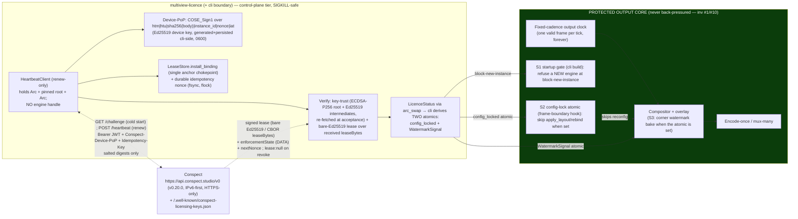

> **Design brief — Runtime commercial licensing & entitlement (Conspect device integration).**
> Research/design record for the **device/runtime** side of the Conspect entitlement integration —
> the client Multiview ships. Canonical crate/API naming lives in
> [docs/architecture/conventions.md](../architecture/conventions.md); where this brief disagrees with
> conventions or the Rust code, **the code wins** (rule 27 — flag the drift). This brief was
> originally drafted (2026-06-15) against an early on-disk Conspect device-facing OpenAPI snapshot
> and has been **currency-corrected (2026-06-19)** against the shipped code and the live API.
>
> **Status — MIXED (corrected). Part of the device client is IMPLEMENTED and merged; the rest is
> Proposed.** Concretely:
> - **IMPLEMENTED & merged** (`crates/multiview-licence` + the `multiview-cli` boundary, behind the
>   off-by-default `heartbeat` feature): the always-compiled state model (lease verify, enforcement
>   ladder-as-data, fingerprint score, `LicenceStatus` hand-off), the **renew-only heartbeat client**
>   with **key-trust verification** and **device proof-of-possession (PoP)**, and the three
>   never-off-air engine seams. Decisions: **[ADR-0050](../decisions/ADR-0050.md)** (charter),
>   **[ADR-0096](../decisions/ADR-0096.md)** (live-wire gate, resolved), **[ADR-I006](../decisions/ADR-I006.md)**
>   (heartbeat client), **[ADR-I007](../decisions/ADR-I007.md)** (device-PoP).
> - **PROPOSED / NOT built** (this brief is the design record, no code asserted): device-side
>   **online-activate / claim-code redemption** (deliberately deferred and *removed*, not stubbed —
>   ADR-I006 §11), **rebind / deactivate**, **entitled-build auto-update** (`resolveDeviceBuild`),
>   **the offline challenge→lease install flow as a device action**, **telemetry consent**, and the
>   **watermark-new-sessions** affordance described in §7 (the shipped enforcement is the
>   *config-lock + corner-watermark + start-gate* model of ADR-0050, not a per-session
>   "UNLICENSED"-badge-on-new-outputs scheme).
>
> **There is no "ADR-L family."** Earlier drafts of this brief invented an `ADR-L001..L007` series;
> those files do **not** exist and must not be cited. The real Conspect decisions are the **ADR-0050
> / ADR-0051 / ADR-0052 / ADR-0053** account-side family and the **ADR-0096 / ADR-I006 / ADR-I007**
> device build-out. The §14 table below maps the brief's themes onto those real ADRs.

---

# Multiview Runtime Licensing & Entitlement — Device-Side Brief

**Date:** 2026-06-15 (original) · **Currency pass:** 2026-06-19.
**Owning crate:** **`crates/multiview-licence`** — British spelling, **`licence`**, lib target
`multiview_licence` (pure-Rust leaf; **no FFI, no GPU, no network/socket I/O, no RNG in non-test
code** — the live HTTP transport is the cli's, and the only filesystem I/O in the crate is the
control-plane lease-directory watcher, §4;
[ADR-0050 §1](../decisions/ADR-0050.md), [crate CLAUDE.md](../../crates/multiview-licence/CLAUDE.md)).
**Touched crates:** `multiview-core` + `multiview-events` (the only deps of the leaf crate),
`multiview-cli` (wires the client: keypair generation + persistence, the `reqwest`/rustls HTTP
transport, the durable idempotency nonce, the env-driven config; `anyhow` only at this boundary),
`multiview-engine` (reads the two derived hot-loop signals — it does **not** depend on
`multiview-licence`), `multiview-telemetry` / `multiview-control` (the consent + status surfaces —
account-side, see the companion brief). The compositor/overlay carry the **corner-watermark** bake
(S3) driven by one wait-free boolean.
**Vendor:** the licensing service is **Conspect** (`https://api.conspect.studio/v0`). This brief
models only the **device/runtime** side — the client Multiview ships.

> **Naming — RESOLVED.** The crate is **`multiview-licence`** (British), per
> [ADR-0050](../decisions/ADR-0050.md) and the on-disk crate directory. An earlier draft of this
> brief proposed the American `multiview-license` "to match the in-tree NDI `license.rs` gate". That
> is now settled: the NDI **codec** gate files are indeed spelled
> `crates/multiview-input/src/ndi/license.rs` and `crates/multiview-output/src/ndi/license.rs`
> (American — a *codec/SDK* acceptance gate, unrelated to *account* entitlement), but the **account
> licensing crate** is `multiview-licence` (British). Do not introduce a `multiview-license` crate.

> **Scope boundary.** There are **two** Multiview-side design records for Conspect; they do **not**
> overlap:
>
> | This brief (`licensing-runtime.md`) | Companion ([`conspect-account-architecture.md`](conspect-account-architecture.md)) |
> |---|---|
> | The **device/runtime client** Multiview ships: the heartbeat client, key-trust verify, lease verify, device-PoP, fingerprint scoring, the engine seams, and the **proposed** offline/build/activate flows. | The **account/org-side** subsystem: org/seat administration, mesh discovery/relay (`multiview-mesh`), two-pipe consent governance, support/ticketing, the portal-facing constants. |
> | Currency-grounded against the **live Conspect API v0.20.0** and the shipped `multiview-licence` code. | The authoritative subsystem brief behind [ADR-0050](../decisions/ADR-0050.md)/[51](../decisions/ADR-0051.md)/[52](../decisions/ADR-0052.md)/[53](../decisions/ADR-0053.md). |
> | Crate: **`multiview-licence`**. | Crate: **`multiview-licence`** (same crate). |

---

## 0. The four rules that shape everything (read this first)

Four rules govern every decision below. They are the reason the subsystem is shaped the way it is,
and they are not negotiable. **All four are upheld by the IMPLEMENTED code** (ADR-0050 §5, ADR-I006
§6/§12, ADR-I007 §7).

1. **The output clock is untouchable (invariant #1).** Licensing **never** stops, stalls, or de-paces
   running program output. No data-plane code path
   (decode→composite→encode→mux→[output clock](core-engine.md)) ever makes a network call, takes a
   lock a licensing task can hold, or `.await`s a licensing result. The hardest enforcement rung the
   ladder can reach **still emits one valid frame per tick, forever** on every program already on
   air. (Full safety analysis: §8.)

2. **Licensing is data the engine *samples*, never control flow that *gates* it (invariant #10).**
   The licensing client computes a `LicenceStatus` and publishes it via a wait-free
   `arc_swap::ArcSwapOption` ([ADR-I001](../decisions/ADR-I001.md) primitive). The cli derives **two
   cheap atomics the engine reads on the hot path** — a config-lock signal and a watermark signal —
   and nothing richer ever touches the loop. The licensing client is **physically incapable of
   back-pressuring the engine**: it holds no engine handle, owns no channel the engine blocks on, and
   the engine never sends to it. The CONSPECT-2 chaos gate demonstrates that killing, stalling, or
   partitioning the service (and SIGKILLing the heartbeat task) leaves the output clock emitting
   exactly one frame per tick with no falter and the last-good lease state unchanged (§8.3–§8.4).

   > **Drift corrected.** The original brief specified a single `watch::Sender<LicencePosture>` seam
   > with the engine reading `*rx.borrow()` at frame boundaries. **That abstraction never shipped and
   > there is no `LicencePosture` type in the tree.** The actual seam is `arc_swap::ArcSwapOption<LicenceStatus>`
   > (off the loop) **plus two pre-derived atomic booleans** the engine reads per tick (ADR-0050 §3:
   > "two atomic loads per tick, derived from data"). The reasoning (last-value, lossy, non-blocking,
   > default-allow on the initial value) is identical; the primitive is `arc_swap` + atomics, not
   > `watch`.

3. **Default-allow / fail-open on uncertainty.** Any ambiguity — the service is unreachable, a lease
   is being refreshed, the clock looks wrong, a response is malformed, a PoP nonce is missing — resolves
   toward **keeping output up and features available**. On internal failure the crate publishes
   `warning`, **never** a harder rung (ADR-0050 §5). Enforcement only ever *tightens* on a **positive,
   verified** signal (a cryptographically-valid lease whose signed `not_after` / `enforcementState`
   says so). We never fail *closed* into degrading a customer's program because we could not reach a
   server.

4. **Privacy is structural, not promised.** The device **never** transmits a raw serial, MAC, UUID,
   or TPM endorsement key. Identity travels as **salted SHA-256 digests** plus a `0..=100` match
   score (`FINGERPRINT_MATCH_THRESHOLD = 70`, `FINGERPRINT_MATCH_STRONG = 100`). Product telemetry is
   **off by default, opt-in, a closed allowlist** on a **separate transport** from the licensing
   heartbeat — the two are never co-mingled (§9, §10; ADR-0052).

The only licensing precedent before this crate was the **NDI codec-licence gate**
(`crates/multiview-input/src/ndi/license.rs`, `crates/multiview-output/src/ndi/license.rs`) — a
*codec/SDK* acceptance gate, unrelated to *account* entitlement. `multiview-licence` is the
greenfield account-entitlement leaf, built first ([ADR-0050](../decisions/ADR-0050.md) §"Greenfield").

---

## 1. What we are integrating — three deployment targets, ONE renew core

The licensing service (Conspect) is an entitlement/licensing API. Multiview ships a **device client**
for it. The operator intent is that **the free tier is itself a licence**, so the whole fleet runs
the same client and the same lease/ladder state model.

| Target | What it is | Status on the device side |
|---|---|---|
| **Self-hosted claim-code activation** | A home/non-commercial or commercial operator runs `multiview` and either redeems a claim code (paid order) or auto-issues a free licence. | **Onboarding is operator/portal-driven, NOT device-side.** The signed lease reaches the device via one of three **install surfaces** (control-upload, the offline file-drop watcher, the mesh relay), then the **renew-only** heartbeat keeps it alive. Device-side online-activate is **deferred** (§1.1). |
| **Entitled-build auto-update** | A licensed device resolves the exact build it is entitled to and updates to it. | **Proposed / not built** — `resolveDeviceBuild` + signed-manifest verify-before-apply is designed (§11) but no code exists. |
| **Appliance / fleet provisioning** | A vendor/partner ships pre-bound appliances at scale. | The same renew/install lifecycle; provisioning differs only in *who* holds the bearer token and *when* the lease is first installed. Pre-seeding a device key is sketched in ADR-I007 §2 but out of scope there. |

The free tier is **not** a degraded unlicensed state — it is a first-class licence with a lease and
an `enforcementState`. There is one client and one state model; the free tier is one valid posture.

### 1.1 The shipped client is RENEW-ONLY (activate is deferred, and *removed* — not stubbed)

**Per [ADR-I006 §11](../decisions/ADR-I006.md), the device client is renew-only.** Device-side
online-activate was **deliberately deferred and the scaffold deleted** (rule 6 — never ship a stub):
a real Conspect server `422`s an empty `ActivateRequest.serverNonce`, and the server-side
device-credential/nonce mechanism that would let a device obtain a valid `serverNonce` is itself
deferred. So:

- **Onboarding** is an operator/portal action; the signed lease arrives via the three install
  surfaces (`POST /api/v1/licence/lease`, the file-drop watcher, the mesh relay), all of which feed
  `LeaseStore::install_binding`.
- **`run_once` resolves the binding to renew *before* any network call** (`configured ?? learned ??
  store.current_binding_id()`). With an established binding it RENEWS via the heartbeat path; with no
  binding it makes **no** server call, installs nothing, keeps last-good, and returns
  `HeartbeatOutcome::NoBinding`.
- The `ActivateRequest`/`ActivateResponse` wire types, the claim-code settings, and the activate
  branch were **removed**; the device-credential `DeviceIdentity` fields are retained with
  `forward-compat:` docs so the activate slice re-adds cleanly when the server-nonce flow lands. The
  named external blocker is the Conspect `serverNonce` issuance.

> **Drift corrected.** The original brief's §1 table and §2.1 listed `activateDevice`
> (`POST /organisations/{orgId}/activate`) as a live device call ("`activate` with-or-without a claim
> code is one call"). **That path is not implemented on the device** and was removed. The
> forthcoming activate/enrolment slice (which will consume `DeviceChallenge.instanceId`, added in
> Conspect v0.16.0 — see §2) is tracked as future work, **not** an existing ADR.

---

## 2. The device-facing contract (as of Conspect API v0.20.0)

> **API version — corrected.** Earlier drafts cited **v0.4.0**. The live device-facing API is now
> **v0.20.0** (`https://api.conspect.studio/v0/openapi.json`). For the **device-PoP / heartbeat /
> licensing** wire the contract has been **byte-stable across v0.16 → v0.20**; the only material
> change since the early drafts that affects the device is in **v0.16.0**, which added a **required
> `instanceId`** to `DeviceChallenge` (a server-assigned durable id `ib_<uuidv7>` a first-contact
> device echoes back at activate and binds into the PoP pre-image's `instance_id`; a renewing device
> signs over its own known id and ignores it). The v0.16→v0.20 delta is otherwise additive and
> unrelated (support-ticketing + partner-portal paths/schemas). Future device-PoP diffs should
> baseline against v0.20.0.

The endpoints/fields below are reproduced from the live spec. **Bold = touched by the shipped
renew-only client; the rest are the read/lifecycle surface the future slices use.**

### 2.1 Endpoints

| # | Operation | Method + path | Purpose | Device status |
|---|---|---|---|---|
| 1 | `getDeviceChallenge` | **`GET /v0/devices/licence/challenge?orgId`** | Issue a single-use PoP `nonce` (+ `expiresAtMs`, `instanceId`). | **IMPLEMENTED** — fetched at cold start / nonce loss (ADR-I007 §5). |
| 2 | `heartbeat` | **`POST /organisations/{orgId}/heartbeat`** | Monthly keep-alive; renews the chained lease; returns `lease` + `enforcementState` + `nextDue` + `nextNonce`. | **IMPLEMENTED** — the renew core (ADR-I006). |
| 3 | `activateDevice` | `POST /organisations/{orgId}/activate` | Redeem a claim code / auto-issue a free licence; first signed lease. | **DEFERRED (removed, not stubbed)** — §1.1. |
| 4 | `rebindInstance` | `POST /organisations/{orgId}/rebind` | Lawful hardware change; same binding, no new seat. | **Proposed / not built.** |
| 5 | `deactivateInstance` | `POST /organisations/{orgId}/deactivate` | Return the seat; idempotent; never touches output. | **Proposed / not built.** |
| 6 | `getDeviceLicenceState` | `GET /devices/me/licence` | The caller's instances + each enforcement rung. Always `200`. | **Proposed / not built (device read).** |
| 7 | `resolveDeviceBuild` | `GET /devices/me/build?licenceId&platform` | The entitled signed build, or `{state:"pending"}`. Always `200`. | **Proposed / not built** (§11). |
| 8 | `exportOfflineChallenge` / `installOfflineLease` | `GET/POST /devices/me/licence/challenge…`, `/lease` | Air-gapped lease issuance. | **Partial** — `challenge.rs` + the file-drop `watcher.rs` exist for the **install** half; the device-driven export call is not wired. |
| 9 | `get/setTelemetryConsent` | `GET/PUT /devices/me/telemetry/consent` | Read/set telemetry consent (opt-in). | **Proposed / not built (device)** — consent model is ADR-0052. |

All mutations require an **`Idempotency-Key`** header. The PoP-gated device-mutating ops also require
a **`Conspect-Device-PoP`** header (§2.4). Activate/heartbeat/rebind/deactivate live under
`/organisations/{orgId}/…`; the read/self endpoints are the `/devices/me/…` surface.

### 2.2 The enforcement ladder — TWO vocabularies (do not conflate)

There are **two** ladders and they are different things:

- **The Conspect WIRE `enforcementState`** is a string enum field on the heartbeat/activate responses
  and each `DeviceInstance`. Its nine rungs (verbatim from the live spec):
  ```
  compliant | grace | lapsed_soft | lapsed_hard | evaluation | on_hold | class_mismatch | over_gpu | revoked
  ```
  It is **data on every response**, never a control verb. (Note: in the shipped renew client, the
  authoritative offline-enforcement inputs are taken from the **signed CBOR lease body**
  (`not_after`, `gpu_limit`, `hardware_class`) — the JSON fields are a convenience subset; ADR-I006
  §3.)

- **The Multiview INTERNAL `enforcement.level`** ([ADR-0050 §2/§4](../decisions/ADR-0050.md)) is what
  the engine, the API, the chrome banner, and the portals all read identically. Its levels:
  ```
  active · warning · config-locked · watermark · block-new-instance · unlicensed-build
  ```
  Computed **only** in `multiview-licence`, off the hot loop, from lease arithmetic + fingerprint
  continuity + claim/transfer state. The shipped `LadderState`
  (`crates/multiview-licence/src/ladder.rs`) realises this: `active → warning (14-day grace) →
  block-new-instance + config-lock (15–45d past) → watermark + config-lock (>45d) → evaluation
  (honest watermark from day 31)`, plus the honest `unlicensed-build` when the heartbeat is compiled
  out.

> **Drift corrected.** The original brief invented a third enum, `LicencePosture`, and a mapping
> table from the 9 wire rungs onto it. **`LicencePosture` does not exist in the tree.** The wire
> `enforcementState` (above) is real; the implemented internal model is the 6-level `enforcement.level`
> / `LadderState`. Treat the wire→internal mapping as: a future rung the service adds degrades
> **safely** to the most-permissive internal level (fail-open, Rule 3), exactly as the original
> brief intended — just onto `enforcement.level`, not `LicencePosture`.

### 2.3 The lease object (bare Ed25519 over deterministic CBOR — exact, IMPLEMENTED)

`lease.signature` is a **bare Ed25519 (EdDSA) signature, lower-case hex (64 bytes), NO COSE**,
computed over `lease.leaseBytes`. **`leaseBytes` is the STANDARD-base64 (RFC 4648 §4, *not*
base64url) encoding of the RFC 8949 §4.2.1 deterministic-CBOR signed body** ([ADR-0096 D3](../decisions/ADR-0096.md),
[ADR-I006 §3](../decisions/ADR-I006.md)). Verified fields:

| Field | Type | Meaning |
|---|---|---|
| `serial` | string (UUIDv7) | Lease-ledger/transparency key + the per-instance chain anchor. |
| `leaseBytes` | string | STANDARD-base64 of the deterministic-CBOR signed body (the bytes the signature covers). |
| `signature` | string | **Bare Ed25519, lower-case hex, 64 bytes, no COSE.** |
| `signerKeyId` | string | The dual-pin **intermediate** key the lease was signed under. |
| `notAfter` | integer | Lease expiry, **epoch ms**, carried in the **signed** body. **35 days** online (`LEASE_FULL`). |

**Verification (IMPLEMENTED, `verify.rs` + `heartbeat.rs::verify_signed_lease_chain`):** the device
**verifies the bare Ed25519 signature over the decoded `leaseBytes` exactly as received — it never
re-serialises the lease body** (sidesteps any dependence on reproducing Conspect's canonicalisation),
then `ciborium`-parses that body for the authoritative fields. The installed `expires_at` is the
**signed** `not_after` (never `system_now()+35d`); an already-expired or replayed-older still-valid
lease is **rejected** (`HeartbeatError::LeaseExpired`, keep last-good).

> **Drift corrected.** The original brief's §2.3 said the device "canonicalises the lease body to CBOR
> and verifies the signature against `signerKeyId`". The shipped design is **verify-over-received-bytes,
> never re-serialize** — stronger and drift-proof. The `signerKeyId`→intermediate→pinned-root chain is
> real (§5.1) but is **not** a "Gap" — it is resolved (see §3).

### 2.4 Device proof-of-possession (PoP) — COSE_Sign1, IMPLEMENTED (ADR-I007)

**The device authenticates each PoP-gated mutation with a `Conspect-Device-PoP` header** (handler-enforced:
missing → `pop-required` 401, bad → `pop-invalid` 401). The header is a **base64 COSE_Sign1**
(library: `coset` 0.4.2, runtime closure already in the crate's `ciborium` graph — zero new deps) the
device signs with its bound **Ed25519 device key** over the canonical PoP pre-image:

```
htm | htu | sha256(body) | instance_id | nonce | iat
```

encoded as a deterministic-CBOR `map(6)` (ADR-I007 §4). `iat` is epoch **seconds** (server checks
±60 s); `nonce` is the **raw 32 bytes** decoded from the 64-hex challenge nonce; `sha256(body)` is over
the **exact serialized request body** the transport sends. The server pins Ed25519, recomputes the
pre-image, verifies against its **STORED** device key (continuity), checks the iat leeway, and burns
the single-use nonce. `devicePublicKey` is base64url of the raw-32 point; its RFC 7638 thumbprint is
the lease `cnf_jkt` (holder-of-key).

**Nonce lifecycle (ADR-I007 §5):** cold start fetches `/challenge`; steady state uses the prior
response's **`nextNonce`** (RFC 9449 DPoP-nonce style — no extra round-trip). The PoP nonce is held as
loop-only control state and is **entirely separate** from the durable idempotency-key counter.

> **Two distinct crypto envelopes — do not conflate.** The **lease** is bare Ed25519, **no COSE**
> (§2.3). The **device-PoP proof** is a **COSE_Sign1** (§2.4). The original brief described the system
> as "bare Ed25519 over canonical CBOR — no COSE" everywhere and treated PoP request-signing as
> deferred; that is now wrong on both counts — leases are bare-Ed25519, PoP proofs are COSE_Sign1, and
> PoP **is enforced and implemented**.

### 2.5 The identity fields (privacy-load-bearing) and the request bodies

Every identity field is a **salted digest or a score**, never a raw identifier. The
`DeviceIdentity` fields (`instance_id`, `fingerprint_digest`, `hardware_digest`, the discriminator
hash/digest, `device_public_key_b64url`) are configured via `MULTIVIEW_LICENCE_*` env vars at the cli
boundary. `HeartbeatRequest` carries `bindingId`, `leaseSerial` (nullable), `fingerprintDigest`,
`appVersion`, the closed `transport` enum (`direct | relay | file`), and — since v0.9.0 — the required
PoP **`nonce`**. `HeartbeatResponse` carries `lease`, `enforcementState`, `nextDue`, and **`nextNonce`**.
The activate/rebind/deactivate request bodies (`devicePublicKey`, `serverNonce`, `claimCode`,
discriminator fields, `fpScore`, etc.) belong to the **deferred/proposed** slices (§1.1).

### 2.6 Error model + auth

Conspect uses **RFC 9457 `application/problem+json`** — the same model Multiview's own API mandates
([conventions §6](../architecture/conventions.md)). Device auth is the **account JWT Bearer chain
today** (`Authorization: Bearer <jwt>`; **Engineer** role / `account:licence:write` for activate,
**operator** role for heartbeat) **plus** the device-PoP header on the PoP-gated ops
([ADR-0096 D2](../decisions/ADR-0096.md), [ADR-I007](../decisions/ADR-I007.md)). The HTTP transport is
**HTTPS-only and fails closed** — a non-HTTPS-only client is never constructed while a bearer JWT is
attached (ADR-I006 §12). A seat-limit `409` on activate is a **START refusal**, never an interruption;
a sub-threshold fingerprint is `422`.

---

## 3. Trust + auth: D1/D2/D3 are RESOLVED (the original "two gaps" are closed)

The original brief listed **Gap A** (no key/JWKS endpoint → pin the root out-of-band) and **Gap B**
(device-native auth deferred → bearer only). **Both are resolved** by the live API
([ADR-0096](../decisions/ADR-0096.md)):

- **D1 — key-trust → RESOLVED (was "Gap A").** There **is** a public, unauthenticated device-facing
  key endpoint: `GET https://api.conspect.studio/.well-known/conspect-licensing-keys.json`. It
  publishes a pinned **ECDSA-P256 root**, `lease_keys` = dual-pin **Ed25519 intermediates** (each with
  a `root_sig`), an `update_keys` set, a root-attested `revocation` list, and the
  `attestation_contract`. **Trust bootstrap (IMPLEMENTED, `heartbeat.rs::keytrust`):** pin the root →
  for each intermediate verify its `root_sig` (`ecdsa-p256-sha256`, raw r‖s, base64url) over the
  deterministic-CBOR key pre-image `[key_id, key_type, statement, public_key, valid_from, valid_until]`
  → accept current+next within validity → honour the (root-attested) revocation list → verify the
  lease against the attested intermediate. Roots are **not** obtained out-of-band.

  > The shipped verifier is hardened well beyond the original sketch: `key_type == "lease"` is a
  > signed trust gate, the unsigned `status` field is **not** a trust gate, trust is **re-evaluated at
  > lease-acceptance against a freshly re-fetched key document** (no revocation TOCTOU), and the
  > binding anchor is bound into the signed lease bytes. See ADR-I006 §6–§10.

- **D2 — device auth → RESOLVED (was "Gap B").** Account JWT Bearer **today**, **plus** device-PoP
  request signing, which is now **enforced and implemented** (§2.4, ADR-I007). The original brief's "send
  the public key now, switch to PoP later" is **done** — the device generates + persists its keypair
  and signs PoP proofs.

- **D3 — lease signing → RESOLVED.** Bare Ed25519 hex over STANDARD-base64-decoded `leaseBytes`
  (deterministic CBOR); every lease response is its own golden vector (§2.3).

**One residual (O4, non-blocking):** the default `{orgId}` a **free** self-host activates against lives
in the external `licensing-architecture.md §5`, not the OpenAPI; the client treats `orgId` as config.
This gates only the free auto-issue onboarding default, not the renew core.

---

## 4. The `multiview-licence` crate — shape and dependency direction (IMPLEMENTED)

`multiview-licence` is a **pure-Rust leaf** (no FFI, no GPU, **no network/socket I/O, no RNG in
non-test code**) so it builds in the GPU-free CI baseline and adds nothing to the default link
surface. Default build is a **pure shell**; the network client is behind the off-by-default
**`heartbeat`** feature. The crate's verification/state core is I/O-free; the **only** filesystem I/O
it performs is the **control-plane lease-directory watcher** (`watcher.rs` — a poll loop that
`read_dir`/`metadata`/`read`s the lease dir and feeds `LeaseStore::install_binding`; it holds no
engine handle and cannot back-pressure the engine). All network I/O — the live HTTP transport and the
device keypair generation/persistence — lives at the `multiview-cli` boundary.

```
multiview-core ─┐
multiview-events ┴─►  multiview-licence  ──►  multiview-cli  (wires the client; reqwest/rustls; anyhow only here)
                                                  │
   (the cli derives TWO atomics the engine reads on the hot loop:
    a config-lock signal + a WatermarkSignal — the engine does NOT depend on multiview-licence)
```

- **Dependencies (ADR-0050 §1, crate CLAUDE.md):** `core`, `events`, `serde`, `thiserror`, `tracing`,
  `chrono` (exact lease arithmetic — never float), `ed25519-dalek` (**verify-only**, deny-clean). Under
  `heartbeat`: `coset`, `p256`, `base64`, `hex`, `tokio` (all MIT/Apache); the cli adds `reqwest`
  (rustls) + `rustix` (`fs`, for the safe `flock`). **No `multiview-ffmpeg`, no GPU, no
  `multiview-engine` dependency.**
- **Error handling:** a single per-crate `Error` enum via `thiserror` (variants include `Transport`,
  `KeyTrust`, `SignedLease`/`SignatureInvalid`, `LeaseExpired`, `MalformedBody`, `BindingMismatch`,
  `FingerprintMismatch`, `Pop(PopError)`, `NonceStore`, `ServerRejected`). `anyhow` only at the
  `multiview-cli` boundary.
- **Absolute typing:** `#![forbid(unsafe_code)]`, `#![warn(missing_docs)]`, no
  `unwrap`/`expect`/`panic`/`indexing`/`as` in non-test code; serde unions tagged (never `untagged`);
  wire resources `#[non_exhaustive]`.
- **Actual modules** (`crates/multiview-licence/src/`): `lease`, `verify` (lease verify),
  `ladder`, `status`, `entitlement` (the ladder-as-data + `LicenceStatus` hand-off), `fingerprint`
  (salted-digest score), `heartbeat` (the renew client + key-trust + PoP + nonce + retry — the large
  module), `challenge` (offline challenge shapes), `store` (`LeaseStore::install_binding` — the single
  binding-anchor chokepoint), `watcher` (the file-drop install surface), `constants`, `error`, `lib`.

> **Drift corrected.** The original brief proposed modules `client`/`runtime`/`chain`/`posture`/`offline`.
> The shipped module map is the list above. There is no `posture` module (the ladder is in
> `ladder.rs`/`status.rs`), no separate `chain` module (chain/anti-replay logic lives inside
> `heartbeat.rs`/`store.rs`), no `runtime` module (the loop is `HeartbeatClient` in `heartbeat.rs`;
> the spawn point is `spawn_heartbeat` in `multiview-cli/src/licence.rs`), and the "offline" surface is
> `challenge.rs` + `watcher.rs`.

---

## 5. The lease & crypto model (device side, IMPLEMENTED)

### 5.1 Verification chain

A lease is trusted iff: (1) the **bare Ed25519** `signature` verifies over the **decoded `leaseBytes`
exactly as received** (no re-serialisation); (2) `signerKeyId` resolves to a **trusted intermediate**
that (a) carries a valid `root_sig` under the pinned ECDSA-P256 root, (b) declared
`key_type == "lease"` (signed), (c) is within its signed validity window, and (d) is **not** in the
root-attested revocation list — **all re-checked against a freshly re-fetched key document at
lease-acceptance** (no TOCTOU); (3) the signed `not_after` is in the future. Any failure → the lease is
**ignored**, last-good is kept (fail-open, Rule 3). **No COSE on the lease** — bare Ed25519, exactly as
the `signature`/`signerKeyId` fields describe.

### 5.2 The chain — clone detection without an active kill

Each instance keeps the chain anchored on the server-issued `instanceBindingId` (learned from the
verified body, recorded **atomically with the install** in `LeaseStore::install_binding`). Cross-instance
replay is rejected (`BindingMismatch`): a valid Conspect-signed lease minted for **another device**
cannot be installed here, and the binding anchor is bound into the **signed** lease bytes so a grafted
id fails `SignatureInvalid`. **Revocation is by non-reissue** — a revoked instance's lease simply ages
out (`not_after` passes); the server returns `200` with `lease: null` + the current `enforcementState`.
There is **no active "kill" verb** and so **no code path that can take a running program off air** (§8).

### 5.3 Trusted-clock + acceptance-time trust (real footguns, handled)

`not_after` is epoch-ms, so validity depends on the clock. The shipped design (ADR-I006 §8–§9): the
installed term is the **signed** `not_after`, never `system_now()+35d`, so a wrong forward clock cannot
mint a fresh term and a replayed-older lease is rejected. Key-trust is re-evaluated with a **fresh
`now()` against a freshly re-fetched key document** at lease-acceptance, so a signer that elapses or is
revoked **during** a stalled network call no longer validates the lease. (A device-clock-trust verdict
reusing the engine's PTP/NTP lock-state — original §5.3 — remains a reasonable **enhancement**, but the
shipped guard is the signed-expiry + acceptance-re-fetch model above.)

### 5.4 Device credential + secret hygiene (IMPLEMENTED)

The Ed25519 **device keypair is generated once** (the only RNG use; **cli-side**, never the leaf crate)
and **persisted** to `<lease-dir>/device-key.ed25519` (`0600`) via a crash-durable
write-temp → fsync → rename → fsync-parent protocol — **SSH-host-key model**: minted on first run,
reused forever, the public half is the device identity, the 32-byte seed is the only on-disk secret and
is never logged. The load is **inode-bound** (`O_NOFOLLOW`, `fstat` the open fd for regular-file +
exactly `0600`, read the same fd) to defeat a symlink/replace TOCTOU. **Losing the seed forces a
re-bind** (consumes the rebind budget) — back it up with the lease state. The account JWT is read from
env (`MULTIVIEW_LICENCE_*`), never logged, never in config-as-code exports; the transport is
**HTTPS-only, fail-closed**. The durable **idempotency nonce** (`<dir>/idempotency-nonce`) is
crash-durable, rejects a present `0`, and is guarded by a held `flock` for inter-process uniqueness
(ADR-I006 §10/§12/§13).

---

## 6. The engine seam — `arc_swap` + two derived atomics (IMPLEMENTED)

This is the heart of the isolation guarantee (Rule 2, invariant #10).

- `multiview-licence` publishes **`LicenceStatus`** (level + reasons + lease bounds) via
  `arc_swap::ArcSwapOption` ([ADR-I001](../decisions/ADR-I001.md) primitive). The cli derives exactly
  **two cheap atomics the engine reads on the hot path** — a **config-lock** signal and a
  **`WatermarkSignal`** (`crates/multiview-cli/src/licence.rs`) — and everything richer is read only
  off the loop (the control plane). **That is the entire engine surface: two atomic loads per tick,
  derived from data** (ADR-0050 §3).
- **Three engine seams (ADR-0050 §5):**
  - **S1 — Startup gate:** at `SoftwareEngine::build()` in the cli, before `EngineRuntime::new()`,
    refuse to create a *new* engine when the ladder is at `block-new-instance`. A *running* engine never
    re-enters `build()`, so the hardest rung cannot touch it.
  - **S2 — Config-lock:** the frame-boundary control hook reads the config-lock atomic and **skips**
    `apply_layout`/`rebind_cell` when set — the running scene keeps playing; you simply cannot
    reconfigure it. O(1), allocation-free, wait-free, no `.await`.
  - **S3 — Tile watermark:** post-composite, before publish, when the `WatermarkSignal` is set, blit a
    corner watermark into the NV12 canvas (region-limited, NV12-throughout). Reads the atomic; mutates
    only the canvas.
- **Why `arc_swap` + atomics and not a queue:** last-value, lossy, the reader never blocks the writer
  (and vice-versa). The licence task can stall, crash, or be SIGKILLed and the engine keeps reading the
  **last value**, forever, with default-allow on the initial value. There is **no** bounded queue,
  mutex, or oneshot the engine can be parked on — the same structural isolation the
  [preview subsystem](preview-subsystem.md) and [realtime-api](realtime-api.md) use.

---

## 7. Enforcement posture — never-off-air (the SHIPPED model)

**The binding enforcement posture is never-off-air.** The shipped enforcement
([ADR-0050 §4/§5](../decisions/ADR-0050.md), `ladder.rs`) is:

- **Running program output is NEVER interrupted at ANY rung.** Not stalled, not de-paced, not torn
  down. A program on air **stays on air with its cadence and timing preserved** (invariant #1) —
  uninterrupted, correctly-paced output, including under a revoked/lapsed entitlement
  (revocation-by-non-reissue, §5.2). Invariant #1 is a guarantee about **uninterrupted, correctly-timed
  delivery, not pixel-identical frames**: under the `watermark` rung the running canvas **may gain the
  documented corner watermark** (S3 below) — the output never stops or de-paces, but its pixels are not
  frozen.
- **`active`:** full function, no banner, no watermark.
- **`warning` (nearing expiry / 14-day grace):** full function, prominent **UI warning banner**, no
  watermark — the operator is told to renew; nothing is degraded.
- **`config-locked` (past grace, before hard):** the running scene keeps playing; **hot-reconfig is
  denied** (S2). No watermark.
- **`watermark` (further lapse toward `LEASE_HARD`):** a small legible **corner watermark** is baked
  into the NV12 canvas (S3); reconfig stays denied; the program stays on air.
- **`block-new-instance` (past `LEASE_HARD` ~90 days):** a **new** engine instance refuses to **start**
  (S1, a typed `LicenceError`); **a running instance stays on air**; watermark + config-lock as data.
- **`unlicensed-build` (heartbeat compiled out):** reported **honestly** (never a fake `active`), with
  an honest watermark; the licence binds regardless — the official signed binary is the licensed
  *convenience*, enforcement is a convenience-and-evidence mechanism, **not** a cryptographic lock
  (ADR-0050 §7).

> **Drift corrected — this is the biggest design-vs-shipped gap.** The original brief specified a
> different enforcement affordance: a **per-session "UNLICENSED" badge/watermark composited onto
> *new commercial program outputs* started while in a `RefuseNewCommercial` posture, never on
> already-running output**, decided once at admission from a sampled `LicencePosture`, with `over_gpu`/
> `class_mismatch` mapping to a `CapNewPlacement` "cap new placement" posture. **None of that is
> implemented.** The shipped model is the global **config-lock + corner-watermark-on-the-canvas +
> start-gate** ladder above — the watermark is a whole-canvas corner mark gated by one boolean per
> tick (S3), not a per-new-session badge, and there is no `RefuseNewCommercial`/`CapNewPlacement`
> taxonomy. The per-session-badge / GPU-cap design in this section is **Proposed** and would be a
> distinct future enhancement; it must not be described as existing. The wire `enforcementState` rungs
> (`over_gpu`, `class_mismatch`, etc.) are real **data**, but the device maps them onto the 6-level
> internal ladder, not onto the original brief's posture enum.

---

## 8. The never-off-air safety analysis (invariant #1 + #10) — PROVEN

This is the proof obligation; it is an **executable CI gate**, not a hope.

### 8.1 The data plane makes no licensing call, ever

The decode→composite→encode→mux→clock path contains **zero** licensing logic — only the two derived
atomics (a config-lock load at the frame-boundary control hook, and a `WatermarkSignal` load in the
overlay bake). No network call, no shared lock, no `.await`, no licensing-attributable allocation.

### 8.2 Every enforcement action is a START-time refusal or a canvas decoration

The strongest thing the ladder does is **refuse to start a new engine instance** (S1) and **stamp a
corner watermark on the canvas** (S3) / **deny reconfig** (S2). None touches the running pipeline. There
is **no service verb** that reaches into the engine — revocation is **by non-reissue** (§5.2), so even a
fully-revoked device only ever fails to start *new* work and watermarks; its running program is
sacrosanct.

### 8.3 The licensing client cannot back-pressure the engine

The heartbeat task is a **supervised cli-boundary task** holding **only** `Arc<LeaseStore>` + the pinned
root + `Arc<dyn LicenceServer>` — **never** an engine handle/channel/lock (ADR-0096 spawn rules). It
publishes via `arc_swap`; the engine *samples* it. If it stalls (network hang), crashes (parse panic —
which it doesn't, every path is `Result`), or is SIGKILLed: the engine keeps reading the last value and
emits frames unaffected; on cold start the initial value is default-allow.

### 8.4 The never-off-air chaos gate (HARD requirement, IMPLEMENTED)

`crates/multiview-cli/tests/heartbeat_never_off_air.rs` (the CONSPECT-3 gate, extending the engine's
CONSPECT-2 isolation gate to the heartbeat task) runs the real software output clock while a heartbeat
task against a misbehaving in-process server is **SIGKILLed (aborted), stalled in-flight, and
partitioned**, and asserts the output clock **emits exactly one frame per tick** (`frames == ticks ==
N`) and **never falters** (`!report.faltered`), and that the **last-good lease state is unchanged**.
What it proves precisely: it is an **engine-clock isolation property** test — frame/tick-count +
no-falter + store-unchanged against an **empty** store (last-good == no lease) at a single
`EnforcementLevel::Active`. **It does not byte-compare output and does not iterate the enforcement
rungs** — it is the structural "licensing cannot back-pressure or perturb the clock" gate, not a
per-rung output-equality proof. (The seeded-lease "withhold keeps last-good Active" path is covered by
the crate-level `heartbeat_client` suite against a real fake that mints verified leases.) "Licensing
cannot back-pressure the engine" is therefore a **gate**, not a hope.

---

## 9. Privacy — salted digests, never raw identifiers (IMPLEMENTED)

Identity leaves the device **only** as salted SHA-256 digests plus a score:

- **`fingerprintDigest` / `instanceDiscriminatorDigest` / `hardwareDigest`** are salted SHA-256.
  **Raw serials, MACs, UUIDs, and TPM endorsement keys never leave the machine** — a design invariant,
  enforced by the crate's "fingerprint over salted digests **handed in**, never gather raw here" rule.
- **`fingerprintScore`** is a weighted `0..=100` match score; **≥ 70** (`FINGERPRINT_MATCH_THRESHOLD`)
  means "same machine, hardware drift tolerated"; below it forces a re-fingerprint / re-claim. The
  install path stamps the device's **actual** score (never an unconditional `FINGERPRINT_MATCH_STRONG`),
  and the store's continuity gate genuinely rejects a non-matching machine (`FingerprintMismatch`).
- `fingerprint.rs` is **pure** (testable via injected component readings) and **property-tested** for
  monotonic score behaviour under single-component drift.

---

## 10. Telemetry — opt-in, closed allowlist, a SEPARATE pipe from the heartbeat (ADR-0052)

The licensing heartbeat and product telemetry are **two pipes**, never conflated:

| | Licensing heartbeat | Product telemetry |
|---|---|---|
| Endpoint | `POST /organisations/{orgId}/heartbeat` | the telemetry pipe; consent at `/devices/me/telemetry/consent` |
| Default | **mandatory** monthly keep-alive (it keeps the lease live) | **OFF** — opt-in only |
| Payload | only what licensing needs: `bindingId`, `leaseSerial`, **salted** `fingerprintDigest`, `appVersion`, `transport`, PoP `nonce` | a **closed allowlist**; any extra field is rejected |
| Consent | not a consent surface (it is the licensing keep-alive) | LWW consent, defaults off |
| Transport | the licence runtime (cli boundary) | a **separate** transport in `multiview-telemetry` |

The settings UI, API docs, and privacy copy must **never** present them as one switch. The heartbeat is
**not** "telemetry you can't turn off"; it is the licensing keep-alive. **Status:** the heartbeat pipe is
**implemented**; the device-side telemetry-consent surface is **account-side / Proposed** (ADR-0052).

---

## 11. Entitlement ↔ build ↔ feature-gate reconciliation (mixed)

Three notions of "what this device may do" must line up:

1. **Build profile (compile-time licence obligations) — IMPLEMENTED & orthogonal.** The Multiview build
   is LGPL-clean by default; `gpl-codecs` makes it GPL; `ndi` is runtime-loaded + runtime-accepted
   ([conventions §7](../architecture/conventions.md)). This is about **code licences** and is
   **orthogonal** to the commercial *entitlement* — the watermark/start-gate logic **never** changes the
   build profile and vice-versa (the NDI gate is a *codec* licence; Conspect is the *account* licence).
2. **Entitled build (auto-update channel) — PROPOSED / not built.** `resolveDeviceBuild?licenceId&platform`
   would return the entitled `BuildResolutionDownload`; the device would **verify the signed manifest
   `signature` (Ed25519 hex) and `contentDigest` (sha256) against the same pinned-root chain as leases
   (§5.1) before applying**. `platform` must name the exact target (`linux-x86_64`, `linux-aarch64`,
   `macos-aarch64`, `macos-x86_64` — **no Windows**). No code exists for this yet.
3. **Runtime enforcement (the ladder) — IMPLEMENTED.** The `enforcement.level` (§7) decides at startup
   whether a *new* engine instance may build (S1) and whether reconfig/watermark apply (S2/S3). The set of
   "commercial-only" behaviours is **data**, not scattered `if` checks.

A device can be (a) on the **entitled** build, (b) running an **active** ladder level, and (c) within its
GPU/class caps — independent checks the management UI surfaces independently so an operator can see *which*
is the reason for any refusal.

---

## 12. Networking — IPv6-first, by construction ([ADR-0042](../decisions/ADR-0042.md))

- The base URL is `https://api.conspect.studio/v0` (TLS, **HTTPS-only, fail-closed** — §5.4). The HTTP
  client prefers IPv6 (AAAA) and brackets any IPv6 literal in derived URLs.
- Any **local** listener the licence/consent UI exposes (served via `multiview-control`) binds
  **dual-stack `[::]`** (`IPV6_V6ONLY=false`), never `0.0.0.0`; loopback `[::1]`.
- The offline-lease file flow is transport-agnostic (sneakernet); any helper URL printed for the
  operator uses bracketed IPv6 form.
- TLS is rustls-based; the client validates the server certificate **in addition to** the
  application-layer lease-signature chain (§5.1) — two independent trust layers.

---

## 13. Open items — operator-confirm + service dependencies (explicit)

### 13.1 Service-side dependencies (track upstream)

| # | Dependency | Status |
|---|---|---|
| D1 | **Key-trust model** (root set, rotation, intermediate-chain). | **RESOLVED** — public well-known doc, ECDSA-P256 root + Ed25519 intermediates (§3). |
| D2 | **Device-credential (PoP) wire format.** | **RESOLVED & IMPLEMENTED** — COSE_Sign1 PoP enforced (§2.4, ADR-I007). |
| D3 | **Lease pre-image / canonicalisation.** | **RESOLVED** — bare Ed25519 over STANDARD-base64-decoded deterministic-CBOR `leaseBytes`; verify-over-received-bytes (§2.3). |
| D4 | **`serverNonce` issuance** for device-side online-activate. | **OPEN** — the named blocker for the activate slice (§1.1). |

### 13.2 Operator-confirm items

| # | Item | Status |
|---|---|---|
| O1 | **Crate spelling.** | **RESOLVED** — `multiview-licence` (British), ADR-0050. |
| O2 | The exact **commercial-only behaviour set** (the §11.3 data table). | Proposed — confirm the list when the feature-gate slice lands. |
| O3 | **Watermark copy/placement** — exact mark + corner. | Small, legible, bottom-corner, vendor-neutral; the canvas-corner S3 bake is shipped. |
| O4 | **Free-tier default `{orgId}`.** | **OPEN (non-blocking)** — external `licensing-architecture.md §5`; `orgId` is config. |

### 13.3 The companion ADRs cited by the Conspect spec are the SERVICE's, not ours

The on-disk Conspect spec's prose cites **Conspect-internal** ADRs (e.g. its own `ADR-0036`, `ADR-0015`,
`ADR-0014`, `ADR-0037`, `ADR-0004`, `ADR-0009`, `ADR-0003`, `ADR-0025`). **These are the licensing
service's own records, not Multiview's** — Multiview has its own `ADR-0036` etc. about codec
capabilities, entirely unrelated. When this brief references a service concept it says "**Conspect
ADR-00xx**" explicitly. Multiview's device-licensing decisions are **ADR-0050 / ADR-0096 / ADR-I006 /
ADR-I007** (§14).

---

## 14. The real ADRs (this brief's themes mapped onto SHIPPED + account-side decisions)

There is **no ADR-L family** (those files do not exist). The brief's themes map onto:

| Theme | Real ADR(s) | Status |
|---|---|---|
| The `multiview-licence` crate + enforcement-ladder-as-data + the two-atomic engine seam + never-off-air | [ADR-0050](../decisions/ADR-0050.md) | Accepted (charter) |
| Mesh discovery/relay so an offline machine still heartbeats | [ADR-0051](../decisions/ADR-0051.md) (`multiview-mesh`) | account-side |
| Two-pipe separation (mandatory heartbeat vs opt-in telemetry) | [ADR-0052](../decisions/ADR-0052.md) | account-side |
| Support / ticketing / audit | [ADR-0053](../decisions/ADR-0053.md) | account-side |
| The device→server live wire gate + its D1/D2/D3 resolution | [ADR-0096](../decisions/ADR-0096.md) | Accepted (resolved) |
| The renew-only heartbeat client: key-trust verify, bare-Ed25519 lease verify, install convergence, crash-durable idempotency nonce, fail-closed cli wiring | [ADR-I006](../decisions/ADR-I006.md) | **Accepted — IMPLEMENTED & merged** |
| Device proof-of-possession (COSE_Sign1, keypair gen+persist, nonce lifecycle, status-aware retry, fail-closed) | [ADR-I007](../decisions/ADR-I007.md) | **Accepted — IMPLEMENTED & merged** |
| Device-side online-activate / claim-code redemption (`serverNonce`, `DeviceChallenge.instanceId`) | — (no ADR; deferred future slice, blocked on D4) | **Proposed / deferred** |
| `rebind` / `deactivate` / `resolveDeviceBuild` / device-side offline export / telemetry-consent surface | — (this brief's design records) | **Proposed / not built** |

When the deferred activate/rebind/deactivate/build slices are designed and built, record each as a new
ADR via the `adr` skill — **do not** reintroduce an "ADR-L" series.

---

## 15. Efficiency budget (standing review)

Licensing costs ~nothing on the data plane and little anywhere:

- **Hot path:** **two** wait-free atomic loads per tick (config-lock + watermark) — zero allocation,
  zero syscalls, zero network. The watermark, when set, is a region-limited corner bake on the NV12
  canvas (S3), riding the existing overlay pass.
- **Control plane:** the heartbeat task makes **one call per month** (plus reconnect backoff), holds one
  small lease + a few cached intermediate keys, and parks idle on a timer otherwise. Bare-Ed25519 verify
  + COSE_Sign1 build are microseconds, a few times a month.
- **Memory:** bounded and tiny — the current lease, the binding anchor, the pinned root + small
  intermediate cache, the device key + idempotency counter. No queues into the engine.
- **Telemetry (if opted in):** conflated/batched on its own transport at a low rate, never on the data
  plane (ADR-0052).

---

## 16. Mermaid — the licence seam relative to the protected output core



**Legend:** the only edges from the licence runtime *into* the engine are the **two derived atomics**
(config-lock + watermark) and the **startup gate** — wait-free, last-value, impossible to block on.
Every service call is off the data plane.

---

## 17. Testing posture (IMPLEMENTED where the code exists)

- **TDD-first, real tests.** Failing test first, committed separately, then implement to green.
- **Lease/key-trust verify** — golden vectors pinned **byte-exact against the live well-known
  `root_sig`/`root_revocation_sig`**; rejection tests for wrong-signer, non-`lease` `key_type`,
  not-chained-to-root, revoked, expired, replayed-older, tampered binding id (`SignatureInvalid`).
- **Device-PoP** — the leaf crate builds a COSE_Sign1 over the exact pre-image with a `FixedDeviceSigner`
  and **verifies it against the public key byte-exactly** (self-verifiable, no network/real key).
- **Posture/ladder** — exhaustive `match` over the ladder levels; property tests pin the day boundaries
  (`LEASE_FULL`/`LEASE_GRACE`/`LEASE_HARD`) — never weakened.
- **Fingerprint** — property test: single-component drift keeps score ≥ 70; re-platform drops below;
  pure/hardware-free via injected readings.
- **Isolation chaos gate (HARD CI gate)** — `heartbeat_never_off_air.rs`: kill/stall/partition the
  service **and** SIGKILL the heartbeat task while the output clock runs; assert one frame per tick
  (`frames == ticks`), no falter, and the last-good lease store unchanged — against an empty store at
  `EnforcementLevel::Active`. (Engine-clock isolation property; not a byte-equality or per-rung proof —
  §8.4.)
- **Fail-open** — service unreachable from cold start ⇒ default-allow and all features start; a
  wrong/backwards clock never *tightens* (signed-expiry guard).
- **Privacy assertion** — inspect every outbound body; **fail** if any field matches a raw-identifier
  shape outside the allowlisted salted-digest fields.
- **Mutation score is the target** (`cargo mutants --in-diff`); held-out acceptance suite.

> **Rule-26 follow-up (carried from ADR-I007):** the device-PoP implementation is **spec-correct +
> unit-tested** (produces a structurally-valid COSE_Sign1 an independent verifier accepts) but is **not
> live-server-validated** in this environment. The operator validates PoP against the live Conspect
> server; the load-bearing unknowns to confirm are the pre-image byte-layout/CBOR shape, the `iat` unit
> (seconds vs ms), attached-vs-detached payload, and tagged-vs-untagged COSE_Sign1.

---

## 18. Dependency-ordered backlog (status against the SHIPPED tree)

| # | Item | Status |
|---|---|---|
| 0 | `multiview-licence` skeleton + `Error` enum + the ladder/status model in the crate | **DONE** (ADR-0050) |
| 1 | `lease`/`verify`: bare-Ed25519 verify over received `leaseBytes` + key-trust chain + golden vectors | **DONE** (ADR-I006 §1–§3) |
| 2 | chain / binding-anchor / clone-signal (in `heartbeat.rs`/`store.rs`) | **DONE** (ADR-I006 §6–§10) |
| 3 | `fingerprint`: salted digests + weighted score (pure, property-tested) | **DONE** |
| 4 | `heartbeat` client + the cli transport: renew-only, key-trust, **device-PoP**, durable nonce, fail-closed | **DONE** (ADR-I006/I007) |
| 5 | the engine seam (`arc_swap` `LicenceStatus` + two atomics) wired into the cli/engine | **DONE** (ADR-0050 §3) |
| 6 | enforcement seams S1/S2/S3 (start-gate + config-lock + corner watermark) | **DONE** (ADR-0050 §5; CONSPECT-2 gate) |
| 7 | the isolation chaos gate + the privacy assertion in CI | **DONE** (`heartbeat_never_off_air.rs`) |
| 8 | device-side **online-activate** / claim-code (consume `DeviceChallenge.instanceId`; `serverNonce`) | **DEFERRED** — blocked on D4 |
| 9 | `rebind` / `deactivate` device actions | **Proposed / not built** |
| 10 | entitled-build: `resolveDeviceBuild` signed-manifest verify-before-apply | **Proposed / not built** |
| 11 | device-side offline **export** (`exportOfflineChallenge`) — the install half exists | **Partial / proposed** |
| 12 | the per-session-badge / GPU-cap enforcement variant (original §7) | **Proposed enhancement (distinct from the shipped ladder)** |
| 13 | device-side telemetry-consent surface (opt-in, closed allowlist) | **Proposed** (ADR-0052) |
| 14 | web UI: licence status, banner, consent toggle, activate/rebind flows | account-side / per the companion brief |

---

## 19. Invariant re-assertion

- **#1 (output-clock):** licensing **never** stops, stalls, or de-paces a running program. The hardest
  rung only **refuses to start a new instance** (S1), **denies reconfig** (S2), and **stamps a corner
  watermark** (S3). Running output is never taken off air or de-paced, including under revocation — the
  guarantee is uninterrupted, correctly-paced delivery, **not** pixel-identical frames (the `watermark`
  rung modifies the canvas via S3, §7). Demonstrated by the §8.4 never-off-air chaos gate (one frame per
  tick, no falter, store unchanged).
- **#10 (isolation):** the heartbeat task is a control-plane task holding **no engine handle**; it
  publishes `LicenceStatus` via `arc_swap` and the engine reads **two derived atomics** wait-free per
  tick. There is no channel, lock, or `.await` by which licensing can back-pressure the engine.
- **Fail-open:** uncertainty (unreachable service, refreshing lease, untrusted clock, malformed
  response, missing PoP nonce, unknown rung) always resolves toward keeping output up and features
  available. Enforcement tightens only on a positively-verified signed lease.
- **Privacy:** raw serials/MACs/UUIDs/TPM-EK never leave the device; identity is salted SHA-256 digests
  + a score; telemetry is opt-in, closed-allowlist, on a separate pipe from the heartbeat.
