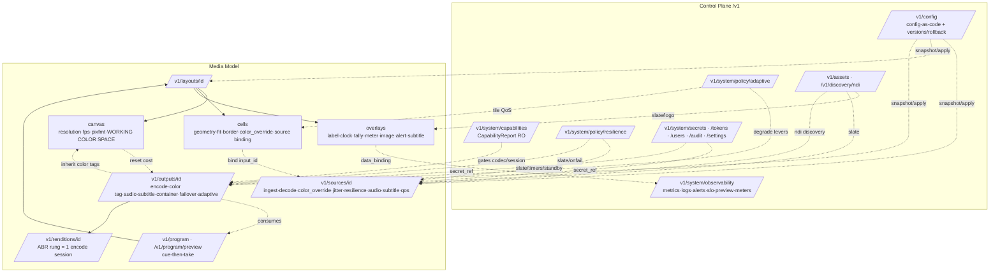

> **Design brief — Management.** Authoritative research/design record backing the implementation. Produced by a verification-hardened multi-agent research workflow (2026-06-02). Canonical crate/API naming lives in [docs/architecture](../architecture/). ADRs derived from this brief are in [docs/decisions](../decisions/).

---

# Multiview — Management Capability Matrix (Authoritative)

**Lead document proving the web UI + HTTP API FULLY and COMPLETELY manage the Multiview engine.** Every controllable parameter the engine exposes is reachable through a versioned (`/v1/...`) API resource and surfaced in a named web-UI screen+control. Nothing the engine can do is left unmanageable.

---

## 1. Management Model Overview

### 1.1 Resource model
The control plane is a REST+WebSocket API (axum) rooted at `/v1`. Top-level resources:

- **`/v1/sources/{id}`** — Inputs (ingest, decode, per-source color override, jitter/reconnect/resilience, per-input audio/subtitle attributes, transform, QoS). Sources own *per-input* attributes.
- **`/v1/layouts/{id}`** — Layout/Template documents: `canvas` (incl. **working color space**), `layout` (grid|absolute), `cells[]`, `overlays[]`. Cells *bind* sources; overlays are first-class z-stack layers.
- **`/v1/outputs/{id}`** — Output publishers: `encode` (EncodeProfile + backend), `color` (CICP tagging + HDR + tone-map + verify), `audio` (program bus + discrete tracks), `subtitles`, `container` (protocol-tagged), `failover`, `adaptive`.
- **`/v1/renditions/{id}`** — ABR ladder rungs (each = one scale+encode session).
- **`/v1/program`, `/v1/program/preview`** — Program/Preview bus (cue-then-take, cut/crossfade).
- **`/v1/system/...`** — Capabilities, policy (adaptive/resilience), observability, config-as-code, users/RBAC, tokens, secrets, audit, settings (TLS/CORS/ports).
- **`/v1/assets`, `/v1/secrets`, `/v1/discovery/ndi`** — cross-cutting stores.
- **`/v1/events`, `/v1/ws/*`, `/metrics`** — telemetry (WS push 10-25 Hz + Prometheus).

### 1.2 Ownership boundaries (overlap resolution)
To avoid two-sources-of-truth, ownership is assigned explicitly:

| Concern | Owner (writes) | Consumers (reference) |
|---|---|---|
| Per-input ingest/decode/color/jitter/reconnect | **Source** | Cell binding (by `input_id`) |
| Per-input audio *attributes* (track select, gain, mute, in-program-bus, metering) | **Source** | Audio routing matrix |
| Cross-product input→output-track *mapping* (PID/rendition/subsession/channel/trackId) | **Output.audio** (Audio area) | — |
| Canvas resolution/fps/pixel-format/**working color space** | **Layout.canvas** | Outputs (inherit color tags; bear reset cost) |
| Per-cell geometry/fit/overlays/source binding | **Layout.cell** | — |
| Output encode/transcode + **color tagging** + HDR/tone-map | **Output** | — |
| Policy *defaults* (adaptive/resilience/timers/backoff/slate) | **System policy** | Per-entity override via PATCH on the entity |
| Per-tile QoS (priority/degradation-preference/static-friendly) | **TilePolicy** (single object, two views: cell inspector + System QoS table) | Degradation ladder |

**Rule:** policy is global default; a PATCH on the entity overrides it. Inline source specs in a layout are convenience-only; promoting an inline source to a managed input is a first-class action so credentials/policy live once.

### 1.3 Live-apply classification (load-bearing for "never falters")
Every edit is classified and surfaced **before apply** via `POST /v1/outputs/{id}/plan` (dry-run) and `POST /v1/program:take?dry_run=true`:

- **Class-1 (Hot / seamless):** applied at a frame boundary via atomic double-buffered scene-graph swap or `NvEncReconfigureEncoder`. The vast majority of all parameters.
- **Reset-lite:** single IDR / discontinuity within pre-allocated `max_width/max_height` (e.g. NVENC in-max resolution change).
- **Class-2 (Controlled reset / parallel-output migration):** make-before-break; downstream-visible discontinuity. Pinned params: `kind`, `video.codec/profile/level`, `pixel_format/bit_depth/chroma`, GOP *structure* (bframes/lookahead/refs/fixed-GOP), `max_width/height`, audio track *layout*, subtitle track-*set*, canvas resolution/fps/pixel-format/working-color-space (cost borne by attached outputs), HDR enable.
- **Listener-restart (control-plane reconnect, safe):** API/health/metrics/TLS bind/port — never touches media output.

---

## 2. Capability Tables

### 2.1 INPUTS / Sources

| Entity | Parameter | API resource + method | UI control | Apply | Notes |
|---|---|---|---|---|---|
| Source | id | POST /v1/sources · GET /v1/sources/{id} | Inputs > New Source (ID, auto-suggested) | Hot | Immutable; renaming orphans bindings. |
| Source | display_name | PATCH /v1/sources/{id} {display_name} | Source editor > General > Name | Hot | Cosmetic. |
| Source | enabled | POST .../enable · POST .../disable · PATCH {enabled} | Row toggle; General > Enabled | Hot | Disable → tile to NO-SIGNAL; no output reset. |
| Source | kind/protocol | PATCH {kind,...transport} | Protocol selector (dynamic form) | Hot (reconnect) | rtsp\|hls\|ts\|srt\|rtmp\|ndi\|webrtc\|file\|test. |
| Source | url/uri | PATCH {url} | URL field + ffprobe Test | Hot (reconnect) | Move secrets to secret_ref. |
| Source | rtsp.ingest_backend | PATCH {rtsp.ingest_backend} | RTSP > Advanced > Ingest backend | Hot (reconnect) | ffmpeg\|retina (retina = TCP only). |
| Source | rtsp.transport | PATCH {rtsp.transport} | RTSP > Transport radio | Hot (reconnect) | tcp\|udp\|udp_multicast\|prefer_tcp. |
| Source | rtsp.reorder_queue_size | PATCH {rtsp.reorder_queue_size} | RTSP > Advanced > Reorder queue | Hot (reconnect) | UDP only. |
| Source | rtsp.max_delay_us | PATCH {rtsp.max_delay_us} | RTSP > Advanced > Max delay | Hot (reconnect) | Demux reorder window. |
| Source | timeouts.rw/connect_us | PATCH {timeouts.*} | Reconnect & Timeouts > I/O timeout | Hot (reconnect) | Backs AVIOInterruptCB. |
| Source | timeouts.dns_watchdog_ms | PATCH {timeouts.dns_watchdog_ms} | Reconnect & Timeouts > DNS watchdog | Hot | DNS not bounded by AVIO timeout; mandatory. |
| Source | http.headers | PATCH {http.headers} | HLS > Advanced > Custom headers | Hot (reconnect) | Values may use ${secret:ref}. |
| Source | http.user_agent | PATCH {http.user_agent} | HLS > Advanced > User-Agent | Hot (reconnect) | CDN gating. |
| Source | hls.http_persistent | PATCH {hls.http_persistent} | HLS > Advanced > Persistent connections | Hot (reconnect) | keep-alive. |
| Source | hls.reconnect flags | PATCH {hls.reconnect,_at_eof,_streamed} | HLS > Advanced > Reconnect flags | Hot (reconnect) | Resilient pull. |
| Source | hls.live_start_index | PATCH {hls.live_start_index} | HLS > Advanced > Live start index | Hot (reconnect) | Live edge vs offset. |
| Source | hls.pace_to_wallclock | PATCH {hls.pace_to_wallclock} | HLS > Advanced > Pace to real-time | Hot | VOD-as-live anti-burst. |
| Source | requested_rendition | PATCH {rendition_select} | Source > Rendition selector | Hot (reconnect) | auto\|lowest\|highest\|index:N\|res:WxH. Universal decode-cost lever. |
| Source | rtsp.substream_path | PATCH {url} | RTSP > Stream profile (main/sub) | Hot (reconnect) | NVR sub-stream. |
| Source | ts.scan_all_pmts | PATCH {ts.scan_all_pmts} | TS > Advanced > Scan all PMTs | Hot (reconnect) | Default on. |
| Source | ts.program | PATCH {ts.program} | TS > Program selector | Hot (reconnect) | Multi-program selection. |
| Source | srt.mode | PATCH {srt.mode} | SRT > Mode | Hot (reconnect) | caller\|listener\|rendezvous. |
| Source | srt.latency_us | PATCH {srt.latency_us} | SRT > Latency (µs + ms helper) | Hot (reconnect) | MICROSECONDS footgun. |
| Source | srt.passphrase/pbkeylen | PATCH {srt.passphrase_ref,srt.pbkeylen} | SRT > Encryption (secret picker) | Hot (reconnect) | Secret store; 16/24/32. |
| Source | srt.streamid | PATCH {srt.streamid} | SRT > Stream ID | Hot (reconnect) | Access control. |
| Source | srt.backend | PATCH {srt.backend} | SRT > Advanced > Backend | Hot (reconnect) | srt-tokio\|libav. |
| Source | rtmp.app/stream_key | PATCH {rtmp.app,rtmp.stream_key_ref} | RTMP > App/Stream key | Hot (reconnect) | Secret. |
| Source | ndi.source_name | PATCH {ndi.name}; GET /v1/discovery/ndi | NDI > Source picker (live + manual) | Hot | Bind-by-name; offline card if unresolved. |
| Source | ndi.receive_color_format | PATCH {ndi.color_format} | NDI > Color format | Hot (reconnect) | fastest\|best. |
| Source | ndi.bandwidth_mode | PATCH {ndi.bandwidth} | NDI > Bandwidth | Hot | highest\|lowest (proxy). |
| Source | webrtc.token/audio | PATCH {webrtc.token,webrtc.audio} | WebRTC (WHIP) > Bearer token + Accept audio; derived publish URL (copy button) | Hot (republish) | RFC 9725 ingest at POST /v1/whip/{source_id}; add/remove/edit classified like the other network sources (the publisher re-publishes; outputs untouched); configured-but-unpublished = NO_SIGNAL card (ADR-T014). |
| Source | bars/solid/clock (synthetic) | PATCH {kind; solid.color; clock.face,twelve_hour,tz_offset_minutes} | Synthetic > Bars \| Solid (colour) \| Clock (face/12h/UTC offset) | Hot | In-process pure-Rust synthetic kinds; `test`=`bars` alias (ADR-0027). |
| Source | file.path/loop | PATCH {file.path,file.loop} | File > Path + Loop | Hot (reconnect) | Slate/standby clip. |
| Source.color_override | primaries | PATCH {color_override.primaries} | Color > Primaries (detected+override) | Hot | AXIS 1; auto = detection precedence. |
| Source.color_override | transfer/trc | PATCH {color_override.transfer} | Color > Transfer | Hot | AXIS 2; never auto-promote PQ/HLG; warn on SDR. |
| Source.color_override | matrix | PATCH {color_override.matrix} | Color > Matrix | Hot | AXIS 3; rgb(0)≠unspecified(2). |
| Source.color_override | range | PATCH {color_override.range} | Color > Range | Hot | AXIS 4; highest-impact bug; VT range bug → trust VUI. |
| Source.color_override | chroma_siting | PATCH {color_override.chroma_siting} | Color > Advanced > Chroma siting | Hot | left\|center\|topleft. |
| Source.color_override | bit_depth | PATCH {color_override.bit_depth} | Color > Advanced > Bit depth | Hot | 8/10/12; drives chroma center. |
| Source.color_override | detected_color (RO) | GET /v1/sources/{id}/color | Color > Detected panel (provenance badges) | RO | Frame/Codec/Container/Guessed. |
| Source.color_override | hdr_tonemap | PATCH {color_override.tonemap.*} | Color > HDR tone-map | Hot | Per-tile; bt2390 anchored 203 nits. |
| Source.decode | backend_preference | PATCH {decode.backend_preference} | Decode > Backend preference (ordered chips) | Hot (reconnect) | [nvdec,vt,vaapi,qsv,sw]; falls back. |
| Source.decode | decode_at_display_resolution | PATCH {decode.scale_to_display} | Decode > toggle + realized-tier badge | Hot (reconnect) | Fused NVDEC / best-effort VT / VPP / no-op sw. |
| Source.decode | target_decode_size | PATCH {decode.target_size} | Decode > Target size (auto/custom) | Hot (reconnect) | VRAM/bandwidth tuning. |
| Source.decode | skip_frame | PATCH {decode.skip_frame} | Decode > Frame skipping | Hot | none\|bidir\|nonref\|nonkey\|all. |
| Source.decode | hwaccel_output_format | PATCH {decode.output_format} | Decode > Advanced > Keep on GPU | Hot (reconnect) | Zero-copy island membership. |
| Source.decode | extradata_normalize | PATCH {decode.extradata_normalize} | Decode > Advanced > Normalize extradata | Hot (reconnect) | Annex-B fixups for VT. |
| Source.framerate | mode/target | PATCH {framerate.mode,target} | Timing > Frame-rate handling | Hot | passthrough\|harmonize\|cap. |
| Source.framerate | static_friendly | PATCH {framerate.static_friendly} | Timing > Static-friendly mode | Hot | Decoder new-frame gated. |
| Source.jitter | buffer_ms | PATCH {jitter.buffer_ms} | Timing > Jitter buffer (LAN/WAN presets) | Hot | Leaky tile; MIN not MAX latency. |
| Source.jitter | queue_depth/leaky | PATCH {jitter.queue_depth,leaky} | Timing > Advanced > Queue/drop policy | Hot | drop-oldest; unbounded forbidden. |
| Source.reconnect | backoff | PATCH {reconnect.{initial,max,multiplier,jitter}} | Reconnect & Timeouts > Backoff | Hot | backon exponential+jitter. |
| Source.reconnect | max_attempts | PATCH {reconnect.max_attempts} | Reconnect & Timeouts > Max attempts | Hot | 0=infinite; Reconnect-now overrides park. |
| Source.reconnect | circuit_breaker | PATCH {reconnect.circuit_breaker.*} | Reconnect & Timeouts > Circuit breaker | Hot | State RO (Closed/Open/Half-Open). |
| Source.state_machine | hold/stale/nosignal_ms | PATCH {resilience.*} | Resilience > Failure ladder timers | Hot | Per-tile ladder. |
| Source.state_machine | placeholder/slate | PATCH {resilience.placeholder}; POST /v1/assets | Resilience > Placeholder card | Hot | Atlas-resident asset. |
| Source.credentials | secret_ref | PATCH {auth.secret_ref}; POST /v1/secrets | Credentials (secret picker); Settings > Secrets | Hot (reconnect) | Export → ${secret:ref}; audit-logged. |
| Source.audio | track_selection | PATCH {audio.tracks[]}; GET .../tracks | Audio > Track selector | Hot | Feeds routing matrix. |
| Source.audio | gain_db | PATCH {audio.gain_db} | Audio > Gain | Hot | Program-bus contribution only. |
| Source.audio | mute/in_program_bus | PATCH {audio.mute,audio.in_program_bus} | Audio > Mute / Include in mix | Hot | Discrete track stays clean (silence-filled). |
| Source.audio | resample_async/silence_fill | PATCH {audio.resample_async,silence_fill} | Audio > Advanced | Hot | async=1 default-on. |
| Source.subtitle | caption_source/track | PATCH {subtitle.source,track}; GET .../tracks | Subtitles > Caption source + track | Hot | 608/708\|dvbsub\|teletext+page\|webvtt\|srt\|ass\|mov_text. |
| Source.subtitle | language | PATCH {subtitle.language} | Subtitles > Language | Hot | Flows to output route label. |
| Source.transform | deinterlace | PATCH {transform.deinterlace} | Picture > Deinterlace | Hot (may reconnect decode) | off\|auto\|yadif/bob. |
| Source.transform | crop | PATCH {transform.crop} | Picture > Crop (visual tool) | Hot | src-rect. |
| Source.transform | rotate/flip | PATCH {transform.rotate,flip_h,flip_v} | Picture > Rotate/Flip | Hot | Compositor transform. |
| Source.lifecycle | prewarm/cue | POST .../prewarm · POST .../cue | Row > Cue/Pre-warm; Program bar | Hot | Off-air decode then cue to Preview. |
| Source.lifecycle | preview | GET .../preview (MJPEG); WS .../preview | Preview pane; hover thumbnail | RO | NDI proxy / low-res / I-frame. |
| Source.lifecycle | create/delete/duplicate | POST /v1/sources · DELETE · POST .../duplicate | New/Delete/Duplicate | Hot | Drained off-thread. |
| Source.lifecycle | reconnect now/reset | POST .../reconnect · POST .../reset | Reconnect now; Troubleshoot > Reset | Hot | Reset rebases PTS, clears jitter. |
| Source.lifecycle | probe/test | POST /v1/sources/probe · POST .../probe | New Source > Test; editor > Probe | RO | Auto-fills dropdowns. |
| Source.status | health/state | GET .../status; WS /v1/events | Row badge; Status panel; Health dash | RO | LIVE/STALE/RECONNECTING/NO_SIGNAL. |
| Source.status | stream_info | GET .../info; GET .../tracks | Info panel | RO | Mid-stream changes as normal. |
| Source.status | metrics | GET .../metrics; /metrics; WS | Metrics panel; Per-tile dashboard | RO | Prometheus {tile,source,backend,codec}. |
| Source.qos | priority/degradation_preference | PATCH {qos.priority,degradation_preference} | Resources > Priority + Degradation | Hot | Feeds adaptive ladder. |
| Source.qos | manual lever pins | PATCH {qos.pins[]} | Resources > Manual pins | Hot | Overrides auto; logged. |
| Source.audio.metering | meter_enable/true_peak | PATCH {audio.metering.*} | Audio > Metering | Hot | SPSC tap; off media thread. |

### 2.2 LAYOUT / TEMPLATES

| Entity | Parameter | API | UI control | Apply | Notes |
|---|---|---|---|---|---|
| Layout | id | POST /v1/layouts; GET /v1/layouts/{id} | Library card chip | Hot | Immutable. |
| Layout | name | PATCH {name} | Editor header > Name | Hot | — |
| Layout | description/tags | PATCH {description,tags[]} | Template Info; tag filter | Hot | — |
| Layout | schema_version | GET (RO); POST .../:migrate | Template Info; Import migration | Migrate (non-live) | — |
| Layout | thumbnail | GET .../thumbnail.png; POST .../:snapshot | Card image; Update thumbnail | RO/refresh | — |
| Layout lifecycle | create/duplicate/delete | POST /v1/layouts; POST .../:duplicate; DELETE ?force | Library New/Duplicate/Delete | Hot | Delete blocked if on Program. |
| Layout lifecycle | save/draft·revisions·rollback | PUT /v1/layouts/{id}; POST .../revisions; POST .../:rollback | Save & Apply; History | Hot | Draft never touches live. |
| Preset | apply-preset | GET /v1/presets; POST .../:apply-preset | Presets palette | Hot (scene swap) | Preserves bindings by area name. |
| Canvas | width/height | PATCH .../canvas {width,height} | Canvas > Resolution | **Reset (if bound)** | Geometry pinned per session. |
| Canvas | fps (rational) | PATCH .../canvas {fps} | Canvas > Frame rate (num/den) | **Reset (if bound)** | Must be rational. |
| Canvas | pixel_format | PATCH .../canvas {pixel_format} | Canvas > Pixel format [adv] | **Reset (if bound)** | nv12\|p010. |
| Canvas | **working_color_space** | PATCH .../canvas {color.profile} | Canvas > Color space | **Reset (if bound)** | sdr-bt709-limited\|hdr-pq-bt2020\|hdr-hlg-bt2020. |
| Canvas | color advanced | PATCH .../canvas {color.{primaries,transfer,matrix,range}} | Color space > Advanced (custom) | **Reset (if bound)** | Full-range warned. |
| Canvas | hdr static metadata | PATCH .../canvas {color.hdr_metadata} | Color space > HDR metadata | **Reset (if bound)** | ST 2086 / MaxCLL / MaxFALL. |
| Canvas | background | PATCH .../canvas {background} | Canvas > Background | Hot | color\|asset. |
| Canvas | default tone-map | PATCH .../canvas {tonemap.*} | Canvas > HDR handling | Hot | Per-cell overridable. |
| Canvas | editor_prefs (grid/snap/safe) | PATCH .../editor_prefs | Toolbar Snap/Guides | Hot (editor-only) | Never rendered. |
| Layout | kind | PATCH .../layout {kind} | Layout mode (Grid\|Freeform) | Hot (scene swap) | preset\|grid\|absolute. |
| Layout (grid) | columns/rows | PATCH .../layout {columns[],rows[]} | Grid > Columns/Rows (drag dividers) | Hot | fr/px/%. |
| Layout (grid) | areas | PATCH .../layout {areas[]} | Grid > Areas matrix | Hot | grid-template-areas. |
| Layout (grid) | gaps | PATCH .../layout {gap,row_gap,column_gap} | Grid > Gap | Hot | — |
| Cell | id | POST .../cells; addressed in PATCH | Inspector header | Hot | — |
| Cell | area | PATCH .../cells/{cellId} {area} | Inspector > Placement > Area | Hot | — |
| Cell | rect (x,y,w,h 0..1) | PATCH .../cells/{cellId} {rect} | Canvas handles; numeric x/y/w/h | Hot | Freeform/PiP. |
| Cell | z | PATCH .../cells/{cellId} {z} | Bring forward/back; Layers | Hot | — |
| Cell | fit | PATCH .../cells/{cellId} {fit} | Inspector > Fit | Hot | fill\|contain\|cover\|none\|scale_down. |
| Cell | align/anchor | PATCH .../cells/{cellId} {align} | Inspector > Alignment (9-pt) | Hot | object-position. |
| Cell | crop | PATCH .../cells/{cellId} {crop} | Inspector > Crop (overlay handles) | Hot | Source-space. |
| Cell | rotation/flip | PATCH .../cells/{cellId} {transform} | Inspector > Transform | Hot | — |
| Cell | opacity | PATCH .../cells/{cellId} {opacity} | Inspector > Opacity | Hot | Premultiplied linear. |
| Cell | visible | PATCH .../cells/{cellId} {visible} | Layers eye; Inspector Visible | Hot | Hidden → decode-skip. |
| Cell | border | PATCH .../cells/{cellId} {border} | Inspector > Border | Hot | Custom shader. |
| Cell | corner_radius | PATCH .../cells/{cellId} {corner_radius} | Inspector > Corner radius | Hot | SDF clip. |
| Cell | margin | PATCH .../cells/{cellId} {margin} | Inspector > Spacing | Hot | Overrides gap. |
| Cell | background | PATCH .../cells/{cellId} {background} | Inspector > Cell background | Hot | — |
| Cell | color_override | PATCH .../cells/{cellId} {color_override} | Inspector > Color > Override | Hot | Per-tile kernel uniforms. |
| Cell | tonemap override | PATCH .../cells/{cellId} {tonemap} | Inspector > Color > Tone-map | Hot | — |
| Cell | scaler | PATCH .../cells/{cellId} {scaler} | Inspector > Quality > Scaler | Hot | Auto\|Bilinear\|Lanczos. |
| Cell | qos (degradation/priority) | PATCH .../cells/{cellId} {qos} | Inspector > Performance | Hot | Shared TilePolicy. |
| Cell | static_friendly | PATCH .../cells/{cellId} {static_friendly} | Inspector > Performance | Hot | — |
| Cell lifecycle | add/remove | POST .../cells; DELETE .../cells/{cellId} | + Add cell; Delete | Hot (scene swap) | Source pre-warmed. |
| Cell binding | source bind | PUT .../cells/{cellId}/source {input_id\|inline} | Drag input; Inspector Source | Hot | Pre-warm then bind. |
| Cell binding | hot swap | POST .../cells/{cellId}/source:swap {input_id,transition} | Inspector > Swap; drag-replace | Hot | No black flash. |
| Cell binding | unbind | DELETE .../cells/{cellId}/source | Inspector > Clear | Hot | Reverts to placeholder. |
| Cell binding | NDI bind-by-name + fallback | PUT .../cells/{cellId}/source {kind:'ndi',name,fallback} | NDI discovery drag; Fallback picker | Hot | Offline card until resolved. |
| Cell binding | no-signal/fallback card | PATCH .../cells/{cellId} {fallback} | Inspector > On signal loss | Hot | Atlas-resident. |
| Cell binding | audio track+gain | PATCH .../cells/{cellId} {audio} | Inspector > Audio | Hot | Cross-links Audio mixer. |
| Cell binding | subtitle track | PATCH .../cells/{cellId} {subtitle} | Inspector > Subtitles | Hot | libass burn-in. |
| Overlay | id/kind | POST .../overlays {kind}; .../overlays/{overlayId} | Overlays panel > Add | Hot | label\|clock\|timecode\|image\|logo\|tally_border\|box\|meter\|alert_card\|subtitle\|lower_third. |
| Overlay | target | PATCH .../overlays/{overlayId} {target} | Inspector > Attach to | Hot | canvas\|cell. |
| Overlay | anchor+offset | PATCH {anchor,offset} | Inspector > Position (9-pt) | Hot | — |
| Overlay | rect/transform | PATCH {rect\|transform} | Canvas drag/resize | Hot | — |
| Overlay | z | PATCH {z} | Layers reorder | Hot | — |
| Overlay | opacity/blend/clip | PATCH {opacity,blend_mode,clip} | Inspector > Appearance | Hot | Premultiplied over. |
| Overlay | visible | PATCH {visible} | Layers eye | Hot | — |
| Overlay | color_space | PATCH {color_space} | Inspector > Advanced > Color space | Hot | sRGB→BT.2020 on HDR canvas. |
| Overlay (text) | text/font/size/color/weight | PATCH {text.*} | Inspector > Text | Hot | cosmic-text/glyphon. |
| Overlay (clock) | format/tz/source | PATCH {clock.*} | Inspector > Clock | Hot | Falter sentinel. |
| Overlay (timecode) | format/drop_frame/start | PATCH {timecode.*} | Inspector > Timecode | Hot | — |
| Overlay (image) | asset/fit | PATCH {image.*}; POST /v1/assets | Inspector > Image | Hot | Atlas. |
| Overlay (tally) | width/color/binding | PATCH {tally.*} | Inspector > Tally | Hot | Local state, alert-safe. |
| Overlay (box) | fill/stroke/radius/gradient | PATCH {box.*} | Inspector > Shape | Hot | Vello/SDF. |
| Overlay (meter) | track/scale/orientation/peak-hold | PATCH {meter.*} | Inspector > Meter | Hot | Uniforms each frame. |
| Overlay (alert) | trigger/content/style | PATCH {alert.*} | Inspector > Alert card | Hot | SDF, atlas-resident. |
| Overlay (subtitle) | track/style/position | PATCH {subtitle.*} | Inspector > Subtitle | Hot | Burn-in. |
| Overlay | data_binding | PATCH {data_binding} | Inspector > Data binding | Hot | Enumerable namespace. |
| Overlay lifecycle | add/remove/dup/reorder | POST .../overlays; DELETE; :duplicate; PATCH :reorder | Layers panel | Hot | — |
| Transition | cut\|crossfade | POST .../:apply {transition,duration_ms} | Take bar > Cut/Auto | Hot | Double-buffered swap. |
| Transition | crossfade duration/curve | POST .../:apply {duration_ms,curve} | Take bar > Transition settings | Hot | — |
| Transition | keyframe-aligned | POST .../:apply {align:'keyframe'} | Take bar > Advanced | Hot | Avoids artifacts. |
| Program/Preview | preview (cue) | PUT /v1/program/preview {layout_id} | Send to Preview; PVW | Hot | Pre-warms. |
| Program/Preview | take | POST /v1/program:take {transition} | TAKE button | Hot | Core live path. |
| Program/Preview | program binding | GET/PUT /v1/program | Program indicator; PGM | Hot | — |
| Editor | live preview + thumbnails | GET /v1/program/preview.stream; GET /v1/cells/{cellId}/thumbnail; WS /v1/events | Canvas underlay; per-cell badges | RO | Decoupled from input health. |
| Editor | validate | POST .../:validate; GET /v1/schema/layout | Problems panel | Hot (pre-flight) | garde + schemars. |
| Layout I/O | export/import | GET .../export?format=; POST /v1/layouts:import | Export/Import | Hot (doc); take if live | Migration on import. |
| Layout I/O | diff/dry-run | POST .../:diff; POST /v1/program:take?dry_run | Take bar > Preview changes | RO | reset_required flag. |

### 2.3 OUTPUT + TRANSCODING (video encode + container + lifecycle)

| Entity | Parameter | API | UI control | Apply | Notes |
|---|---|---|---|---|---|
| Output | create/list/delete | POST /v1/outputs; GET; DELETE .../{id} | Outputs list > Add/Delete | Hot | Drained off-thread. |
| Output | id/name/description | PATCH {name,description} | Header > Name/Notes | Hot | id immutable. |
| Output | enabled/start/stop | POST .../start · stop; PATCH {enabled} | Header Start/Stop | Hot | Graceful EOS+flush. |
| Output | protocol/kind | POST {kind} | Protocol dropdown | **Reset-on-change** | Capability-gated form. |
| Output | canvas/rendition binding | PATCH {canvas_id,rendition_id} | Source > Canvas + Rendition | Hot | Same rendition = free fan-out. |
| Rendition | CRUD; res/bitrate/codec | POST/PATCH/DELETE /v1/renditions | ABR ladder rung table | Hot (new) / Class-2 (live rung) | GOP aligned, scene-cut off. |
| EncodeProfile | video.codec | PATCH .../encode {video.codec} | Encoding > Video codec | **Class-2** | h264\|hevc\|av1. |
| EncodeProfile | video.backend | PATCH {video.backend} | Encoding > Encoder backend (Auto) | **Class-2** | nvenc\|vt\|vaapi\|qsv\|x264\|x265\|svt_av1\|aom. |
| EncodeProfile | profile/level/tier | PATCH {video.profile,level,tier} | Encoding > Advanced | **Class-2** | high10/main10 for 10-bit. |
| EncodeProfile | resolution/scaling/max | PATCH {video.width,height,scaler,max_width,max_height} | Encoding > Resolution + Scaler | Reset-lite (in-max NVENC) / Class-2 (VT) | VT can't change live. |
| EncodeProfile | fps | PATCH {video.fps} | Encoding > Frame rate | Hot (NVENC reconfig) | Rational. |
| EncodeProfile | pixel_format/bit_depth/chroma | PATCH {video.pixel_format,bit_depth,chroma} | Encoding > Advanced | **Class-2** | nv12\|p010\|yuv420p\|p210. |
| EncodeProfile | rc.mode | PATCH {video.rc.mode} | Encoding > Rate control | Hot (NVENC) | cbr\|vbr\|cq\|cqp\|icq. |
| EncodeProfile | rc.bitrate | PATCH {video.rc.bitrate} | Encoding > Bitrate | Hot | Primary knob. |
| EncodeProfile | rc.maxrate | PATCH {video.rc.maxrate} | Encoding > Advanced > Max bitrate | Hot | ≥ bitrate. |
| EncodeProfile | rc.bufsize | PATCH {video.rc.bufsize} | Encoding > Advanced > VBV | Hot | LL auto = bitrate/fps. |
| EncodeProfile | rc.cq/qp | PATCH {video.rc.cq,qp_min,qp_max} | Encoding > Quality (CQ) | Hot/reset-lite | VOD. |
| EncodeProfile | preset/tune | PATCH {video.preset,video.tune} | Encoding > Preset slider + Tune | Hot/reset-lite | Degradation lever. |
| EncodeProfile | gop mode/length/closed/scene_cut | PATCH {video.gop.*} | Encoding > GOP | Cadence Hot / structure Class-2 | scene_cut MUST be off for ABR. |
| EncodeProfile | bframes | PATCH {video.bframes} | Encoding > Advanced > B-frames | **Class-2** | AMD H.264 = none. |
| EncodeProfile | lookahead | PATCH {video.lookahead} | Encoding > Advanced > Lookahead | **Class-2** | — |
| EncodeProfile | refs | PATCH {video.refs} | Encoding > Advanced > Reference frames | **Class-2** | — |
| EncodeProfile | slices/tiles/multipass/sfe | PATCH {video.slices,tiles,multipass,sfe} | Encoding > Advanced | **Class-2** | SFE = Ada+ HEVC/AV1. |
| EncodeProfile | latency_profile | PATCH {video.latency_profile} | Encoding > Latency profile (LL/VOD/Custom) | Hot+Class-2 mix | One-click bundle. |
| EncodeProfile | intra_refresh | PATCH {video.intra_refresh.*} | Encoding > Advanced > Intra-refresh | **Class-2** | Mutually excl. with periodic-IDR. |
| OutputColor | primaries | PATCH .../color {primaries} | Color > Primaries | Hot (relabel) | Default from canvas. |
| OutputColor | transfer | PATCH .../color {transfer} | Color > Transfer | Hot (relabel) | PQ/HLG couples 10-bit+bt2020. |
| OutputColor | matrix | PATCH .../color {matrix} | Color > Matrix | Hot (relabel) | — |
| OutputColor | range | PATCH .../color {range} | Color > Range | Hot (relabel) | NVENC JPEG-range pitfall auto-handled. |
| OutputColor | inherit_canvas | PATCH .../color {inherit_canvas} | Color > Inherit from canvas | Hot | Tagging ≠ converting. |
| OutputColor | hdr.mode | PATCH .../color {hdr.mode} | Color > HDR mode (Off/HDR10/HLG) | **Class-2** | Flips 10-bit/main10. |
| OutputColor | hdr.mastering_display | PATCH .../color {hdr.mastering_display} | Color > HDR > Mastering display | Hot (metadata) | ST 2086; recommended. |
| OutputColor | hdr.max_cll/max_fall | PATCH .../color {hdr.max_cll,max_fall} | Color > HDR > MaxCLL/MaxFALL | Hot | In-band SEI for ES. |
| OutputColor | hdr.sei_inband/container_box | PATCH .../color {hdr.sei_inband,container_box} | Color > HDR > Advanced > Placement | Hot | Force in-band for RTSP/SRT/TS. |
| OutputColor | tonemap | PATCH .../color {tonemap.*} | Color > Tone mapping | Hot | bt2390-eetf @203 nits. |
| OutputColor | verify gate | GET .../color/verify; PATCH {verify.*} | Color > Verification; Health | Hot | ffprobe gate; on_fail alert/restart/stop. |
| Container (HLS/LL-HLS) | segment/part duration | PATCH .../container {segment_ms,part_ms} | Container > Segment/Part | Class-2 (re-pin GOP) / Hot (part) | keyint=fps*seg. |
| Container | playlist/dvr window | PATCH .../container {playlist_window,dvr_window} | Container > Window/DVR | Hot | — |
| Container | segment_format | PATCH .../container {segment_format} | Container > Segment format | **Reset-on-change** | fmp4\|ts; LL-HLS forces fmp4. |
| Container | LL-HLS server-control | PATCH .../container/llhls {*} | Container > LL-HLS advanced | Hot | CAN-BLOCK-RELOAD etc. |
| Container | CODECS/VIDEO-RANGE/STREAM-INF | GET .../container/manifest; PATCH {codecs_override} | Container > Manifest preview | Hot | VIDEO-RANGE from TRC. |
| Container (TS) | continuity/PSI | PATCH .../container/ts {*} | Container > MPEG-TS > Continuity | Hot/Class-2 (PIDs) | Color in ES VUI only. |
| Container (RTSP) | mount/transport/config-interval/shared | PATCH .../container/rtsp {*} | Container > RTSP | Hot | config_interval=-1 late joiners. |
| Container (push) | url/auth/srt/rist | PATCH .../container/push {*} | Container > Push destination | Hot (reconnect) | SRT latency µs; key as secret. |
| Container (webrtc) | max_viewers/token/audio | PATCH .../container/webrtc {max_viewers,token,audio} | Container > WebRTC (WHEP) > Viewer cap/Token/Audio | Hot | WHEP serve of the REAL program rendition at POST /v1/whep/{output_id} (encode-once route()+1); rendition must be H.264 + B-frames off (config-time validated); over max_viewers → 503 + Retry-After (ADR-0049). |
| Container (whip push) | url/token/audio | PATCH .../container/whip {url,token,audio} | Container > WHIP push destination | Hot (reconnect) | RFC 9725 client publish; Bearer; follows 307/308 redirects (https-only, depth-capped); supervised reconnect like RTMP/SRT push (ADR-0049). |
| Container (NDI) | sender_name/groups/color_format/clock | PATCH .../container/ndi {*} | Container > NDI | Hot | No CICP; convention. |
| Container (file) | path/format/rotate/write_colr | PATCH .../container/file {*} | Container > File | Hot (path) | nclx colr. |
| Output lifecycle | pinned summary + plan | GET .../pinned; POST .../plan | Banner; Pinned-params panel | RO/plan | Seamless\|reset-lite\|migration. |
| Output lifecycle | controlled reset/migration | POST .../migrate {new_config,cutover} | Apply-with-restart wizard | Class-2 | Make-before-break. |
| Output | config-as-code | GET .../config?format; PUT /v1/config; POST /v1/config/rollback | Config drawer; View as TOML | Hot/Class-2 | — |

> **WebRTC `token` doctrine:** the `token` fields above (webrtc source, webrtc/whip-push containers) are plaintext config values in v1 — the same posture as url-embedded RTMP/SRT stream keys (returned to authorized readers, present in config export); they migrate together with those keys if/when a `secret_ref` indirection lands.

### 2.4 AUDIO (program bus + discrete tracks + routing matrix)

| Entity | Parameter | API | UI control | Apply | Notes |
|---|---|---|---|---|---|
| AudioOutput (program) | enable/codec/channels/SR/bitrate/label/lang | PATCH .../audio/program {*} | Audio > Program bus card | codec/ch/SR Class-2; bitrate Hot | aac\|opus\|ac3\|eac3\|pcm. |
| AudioOutput (program) | loudnorm (R128) | PATCH .../audio/program/loudnorm {*} | Audio > Loudness card | Hot | -23/-16 LUFS, -1.5 dBTP. |
| AudioOutput (discrete) | track set CRUD | POST/PATCH/DELETE .../audio/tracks | Discrete tracks table | **Class-2** (layout) | Capability-gated. |
| AudioRoute | input + source channels | PATCH .../audio/tracks/{tid} {input_id,source_channels} | Track row > Source + Channel | Hot | Decode→re-encode clean. |
| AudioRoute | codec/channels/SR/bitrate | PATCH .../audio/tracks/{tid} {codec,channels,sample_rate,bitrate} | Track row > Codec/Ch/SR/Bitrate | codec/ch/SR Class-2; bitrate Hot | — |
| AudioRoute | label/language/default | PATCH .../audio/tracks/{tid} {language,title,default,autoselect} | Track row > Label/Lang/Default | Hot (relabel) | — |
| AudioRoute | in-program/gain/mute | PATCH .../audio/tracks/{tid} {include_in_program_bus,program_gain_db,program_mute} | Track row > In-program/Gain/Mute | Hot (mixer weights) | Discrete stays clean. |
| AudioOutput | NDI channel-map/multi-sender | PATCH .../audio {ndi_mode} | Audio > NDI audio mode | **Reset-on-change** | NDI = channels not tracks. |
| AudioOutput | E-RTMP multitrack negotiation | GET .../audio/capability; PATCH {rtmp_multitrack} | Audio > RTMP capability banner | Hot (negotiated) | Twitch ≤2; YouTube ignores. |

**Routing matrix** (rows=inputs, cols=output tracks/channels): capability-aware grid that greys impossible cells per output and shows degradation taken.

### 2.5 SUBTITLES

| Entity | Parameter | API | UI control | Apply | Notes |
|---|---|---|---|---|---|
| SubtitleOutput | burn-in on/off/target/style | PATCH .../subtitles {burn_in.*} | Subtitles > Burn-in | Hot (overlay) | Only path for RTMP/NDI. |
| SubtitleOutput | passthrough track set | POST/PATCH/DELETE .../subtitles/tracks | Passthrough tracks table | **Class-2** (set) | webvtt\|dvbsub\|teletext\|cea608\|cea708. |
| SubtitleRoute | input/track/page/lang/format | PATCH .../subtitles/tracks/{sid} {*} | Track row > Source/Page/Lang/Format | Hot (re-route) | 608/708 ride A53_CC SEI. |
| Source.subtitle (ingest) | caption_source/track/language | PATCH /v1/sources/{id} {subtitle.*} | Source editor > Subtitles | Hot | Owns ingest selection. |
| Cell (burn) | subtitle track/enabled | PATCH /v1/layouts/{id}/cells/{cellId} {subtitle} | Inspector > Subtitles | Hot | Per-cell burn-in. |
| Overlay (subtitle) | track/style/position | PATCH /v1/layouts/{id}/overlays/{overlayId} {subtitle} | Inspector > Subtitle | Hot | libass. |

### 2.6 OVERLAYS
Covered fully in §2.2 (Layout) — overlays are first-class layers in the layout z-stack (label/clock/timecode/image/logo/tally_border/box/meter/alert_card/subtitle/lower_third), each with target/anchor/rect/z/opacity/blend/clip/visibility/color_space + kind-specific params + data binding + lifecycle.

### 2.7 SYSTEM / POLICY

| Entity | Parameter | API | UI control | Apply | Notes |
|---|---|---|---|---|---|
| CapabilityReport | detected_gpus | GET /v1/system/capabilities; .../devices/{id}; POST :rescan | Capabilities > Devices | RO | Correlated by PCI/UUID. |
| CapabilityReport | backends | GET .../capabilities (backends) | Capabilities > Backends matrix | RO | compiled-in vs probed. |
| CapabilityReport | codec_support | GET .../devices/{id}/codecs | Capabilities > Codecs | RO | Gates Output dropdowns. |
| CapabilityReport | encode_session_caps | GET .../capabilities/sessions | Capabilities > Sessions gauge | RO | Probed, never hardcoded. |
| CapabilityReport | vram | GET .../devices/{id}; WS /v1/ws/metrics | Devices VRAM bar; Resources gauge | RO | Unified flagged. |
| CapabilityReport | host (cpu/cgroup/ram/psi) | GET .../capabilities/host | Capabilities > Host | RO | cgroup-aware. |
| CapabilityReport | effective_license/build | GET /v1/system/build | About | RO | NDI attribution. |
| AdaptivePolicy | mode | GET/PUT .../policy/adaptive | Policy > Adaptive > Mode | Hot | auto\|assisted\|manual. |
| AdaptivePolicy | control_loop (tick/hysteresis/cooldown) | PATCH .../policy/adaptive {control_loop.*} | Policy > Control Loop | Hot | Anti-oscillation. |
| AdaptivePolicy | targets (fps/latency/power) | PATCH {targets.*} | Policy > Targets | Hot (output-res lever Class-2) | — |
| AdaptivePolicy | admission (enabled/headroom) | PATCH {admission.*} | Policy > Admission Control | Hot | 409 on reject. |
| AdaptivePolicy | cost_model | GET/POST :recalibrate; PATCH | Policy > Cost Model | Hot (recal loads box) | Learned table. |
| AdaptivePolicy | degradation.ladder | GET/PUT .../degradation; PATCH per-lever | Policy > Degradation Ladder (drag) | Hot (lever 7 fires Class-2) | Cheapest-first. |
| AdaptivePolicy | degradation.current_level | GET .../adaptive/state; WS | Dashboard > Adaptation | RO | With "why". |
| TilePolicy | priority | PATCH /v1/layouts/{id}/cells/{cellId}/policy or .../policy/tiles/{tileId} | Cell inspector; QoS table | Hot | Two views, one object. |
| TilePolicy | degradation_preference | PATCH .../policy/tiles/{tileId} | Cell inspector; QoS table | Hot | maintain-fps/res/balanced. |
| AdaptivePolicy | lever_pins | GET/PUT/DELETE .../adaptive/pins | Policy > Manual Pins | Hot (some Class-2) | — |
| AdaptivePolicy | static_friendly_mode | PATCH {static_friendly_mode}; per-tile | Policy > Static-Friendly | Hot | — |
| ResiliencePolicy | tile_timers | GET/PUT .../policy/resilience; per-input PATCH /v1/inputs/{id}/resilience | Policy > Tile Timers; Input override | Hot | hold/stale/nosignal. |
| ResiliencePolicy | slate.assets | GET/POST .../assets/slates; PUT .../resilience | Policy > Slate Cards | Hot (atlas rebake) | Atlas-resident. |
| ResiliencePolicy | slate.clock_overlay | PATCH .../resilience {slate.clock_overlay} | Policy > Slate > Live clock | Hot | Liveness SLO. |
| ResiliencePolicy | reconnect.backoff | GET/PUT .../resilience {reconnect.*}; per-input | Policy > Reconnect/Backoff | Hot | — |
| ResiliencePolicy | circuit_breaker | GET/PUT .../resilience {circuit_breaker.*} | Policy > Circuit Breaker | Hot | Live state badges. |
| ResiliencePolicy | supervision.restart_intensity | GET/PUT .../resilience {supervision.levels[]} | Policy > Supervision | Hot | Meltdown alert. |
| ResiliencePolicy | watchdog.heartbeat_deadline | PATCH {watchdog.*} | Policy > Watchdog | Hot | SIGKILL+respawn. |
| ResiliencePolicy | encoder.hot_standby/recycle | GET/PUT {encoder.*} | Policy > Encoder | Hot | Doubles session use. |
| ResiliencePolicy | gpu_loss_behavior | GET/PUT {gpu_loss.*} | Policy > GPU Loss (fallback chain) | Hot policy | CPU fallback may Class-2. |
| ResiliencePolicy | output_onfail_default | GET/PUT {output_onfail_default}; per-output PATCH | Policy > Output On-Fail; Output editor | Hot | ignore default. |

### 2.8 OBSERVABILITY

| Entity | Parameter | API | UI control | Apply | Notes |
|---|---|---|---|---|---|
| Observability | metrics_export | GET/PUT .../observability/metrics | Observability > Metrics | Listener restart | Prometheus. |
| Observability | tracing/otel | GET/PUT .../observability/tracing | Observability > Tracing | Hot | OTLP + tokio-console. |
| Observability | logs | GET .../logs; WS /v1/ws/logs | Observability > Logs (live tail) | RO | Secrets redacted. |
| Observability | alerts.rules | GET/PUT/POST/DELETE .../observability/alerts | Observability > Alerts | Hot | Webhook secrets via store. |
| Observability | alerts.active | GET .../alerts/active; WS | Dashboard > Alerts; bell | RO | — |
| Observability | slo_dashboard | GET .../observability/slo; WS | Dashboard > Output Validity | RO | Zero-gap/PTS/TR101290. |
| Observability | live_preview | GET/PUT .../observability/preview; WS /v1/ws/preview | Dashboard > Live Preview | Hot start/stop | Extra encode session. |
| Preview (WHEP) | program/input/output focus sessions | POST/DELETE /v1/preview/program/whep · /v1/preview/inputs/{id}/whep · /v1/preview/outputs/{id}/whep | Monitoring program card; tile focus dialog; Outputs preview; layout-editor live preview | Hot start/stop | Sub-second WebRTC focus preview; FocusGate-capped, shed-first (ADR-P006); output scope labels real-vs-approx (ADR-P005). |
| Preview | transport capabilities | GET /v1/preview/capabilities | Preview panes (transport auto-select; WHEP → JPEG fallback badge) | RO | {webrtc, scopes{program{whep,fidelity},inputs{whep},outputs{whep}}, fallback:"jpeg"}; drives the SPA fallback ladder (ADR-W020). |
| Observability | tile_thumbnails | GET .../observability/tiles; WS /v1/ws/thumbnails | Dashboard > Tiles | RO | 1-5 Hz. |
| Observability | audio_meters_ws | GET/PUT .../observability/metering; WS /v1/ws/meters | Dashboard > Audio Meters | Hot config | 10-25 Hz numeric. |
| Output health | per-output health/metrics/preview | GET /v1/outputs/{id}/health; .../metrics; .../preview.jpg; WS | Outputs > Health panel + thumbnail | RO | Validity SLO. |
| Output adaptive | participation/pins | PATCH /v1/outputs/{id}/adaptive | Output > Adaptive | Hot | Late ladder stages. |

### 2.9 USERS / AUTH / SECURITY / SETTINGS

| Entity | Parameter | API | UI control | Apply | Notes |
|---|---|---|---|---|---|
| UserAccount | identity/state | GET/POST/PATCH/DELETE /v1/users | Users table; editor | Hot | Disable invalidates sessions. |
| UserAccount | role (RBAC) | PATCH /v1/users/{id} {role}; GET /v1/roles | User editor > Role; Roles matrix | Hot | admin/operator/viewer. |
| UserAccount | password/MFA/OIDC | PUT .../password; POST .../mfa; PUT /v1/system/auth | Security; Settings > Authentication | Hot (auth restart) | argon2; OIDC/SSO. |
| ApiToken | tokens | GET/POST/DELETE /v1/system/tokens | Security > API Tokens | Hot | Shown once; scoped. |
| SecretStore | secrets | GET (meta)/POST/PUT/DELETE /v1/system/secrets | Security > Secrets | Hot | Write-only; op:// refs. |
| AuditLog | entries | GET /v1/system/audit; :export | Security > Audit Log | RO append-only | Immutable. |
| SystemSettings | network.api_bind/port | GET/PUT /v1/system/settings {network.api_*} | Settings > Network > API | Listener restart | Media unaffected. |
| SystemSettings | network.health_bind/port | PUT {network.health_*} | Settings > Network > Health | Listener restart | /livez in-process-only. |
| SystemSettings | tls | PUT {tls.*} | Settings > TLS | Cert Hot / enable restart | GnuTLS; mTLS. |
| SystemSettings | cors | PUT {cors.*} | Settings > CORS | Hot | Middleware. |
| SystemSettings | ports.media_outputs | PUT {ports.*} | Settings > Media Ports | Class-2 per output | Firewall awareness. |
| SystemSettings | allocator/runtime | GET /v1/system/runtime | Settings > Runtime | RO/launch | RT-priority best-effort. |
| SystemSettings | ndi_attribution | GET /v1/system/build (ndi) | About > NDI | RO | License obligation. |
| ConfigManagement | full_config | GET /v1/config; POST :validate; :apply; PUT | Config-as-Code editor | Hot/Class-2 | Diff classifies. |
| ConfigManagement | versions/diff | GET /v1/config/versions; :diff | History timeline | RO | Audit-tied. |
| ConfigManagement | rollback | POST .../versions/{rev}:rollback?dry_run | History > Rollback | Hot/Class-2 | Reset preview. |
| ConfigManagement | import/export | GET :export?secrets=ref\|redact; POST :import | Import/Export | Hot/Class-2 | Never plaintext. |

### 2.10 MANAGED DEVICES & DISPLAY NODES *(planned)*

**Planned capability area — nothing in this section is implemented yet.** It is designed in [managed-devices](managed-devices.md) + [display-out](display-out.md) and decided in [ADR-M008](../decisions/ADR-M008.md) (device registry + compiled-in driver model) and [ADR-M009](../decisions/ADR-M009.md) (device stream binding); rows gain the full Entity/Parameter/API/UI columns of §2.1–§2.9 as the surface ships. The Class column maps onto §1.3 with one addition: **CP** = control-plane only (registry/state writes that, like "listener-restart", are physically incapable of touching media output); **C1** = Class-1 (hot/seamless at a frame boundary); **C2** = Class-2 (controlled reset, make-before-break); **DEV** = a *device-side* reset — the managed device restarts its own pipeline while the Multiview program output is unaffected (bound sources ride the normal tile ladder). Devices are inventory, never themselves Sources or Outputs: a device *projects* source candidates / output targets / display heads, and the engine only ever sees ordinary Sources and Outputs (invariant #10 by construction).

| Operation | Class | Notes |
|---|---|---|
| Adopt / remove / edit device record | CP | Registry only |
| Probe / status / identify / test-pattern | CP | — |
| Bind device stream as Source | C1 | Additive input; normal tile ladder |
| Send program to device (existing rendition) | C1 | Free fan-out; "shares encoder" badge |
| Send program to device (new rendition) | C1-additive | Admission-gated (409 if budget exceeded); placement re-assess per the instant-apply doctrine |
| Display-node content/layout reassignment | C1 | Node-local make-before-break; engine untouched |
| Sync-group offset change | C1 | Node buffer trim at a frame boundary; engine cadence untouched |
| Local display head modeset (resolution/refresh) | C2 | ALLOW_MODESET blanks that head briefly; program output unaffected |
| Device mode convergence (encoder⇄decoder) | DEV | Device pipeline restarts; declared impact pre-apply |
| Device LAN/mDNS/port change; reboot; firmware | DEV | Device reboots (some vendor sets return no HTTP response) |
| Cast session start/stop | CP + C1 | Free fan-out of an existing HLS output |
| Scheduled vendor-decoder re-sync | DEV (opt-in) | Blanks that device 1–3 s at the scheduled instant |

---

## 3. Key Resource Schemas

### 3.1 Source (JSON, adjacently-tagged transport)
```json
{
  "id": "cam-stage-main", "display_name": "Stage Camera (Main)", "enabled": true,
  "kind": "rtsp", "url": "rtsp://cam-stage.lan/main",
  "rtsp": { "ingest_backend": "ffmpeg", "transport": "tcp", "reorder_queue_size": 0, "max_delay_us": 200000 },
  "auth": { "secret_ref": "op://Servers/cam-stage/credentials" },
  "timeouts": { "connect_us": 5000000, "rw_timeout_us": 8000000, "dns_watchdog_ms": 4000 },
  "rendition_select": "auto",
  "reconnect": { "initial_ms": 500, "max_ms": 30000, "multiplier": 2.0, "jitter": 0.3,
    "max_attempts": 0, "circuit_breaker": { "threshold": 5, "open_ms": 15000, "half_open_probes": 1 } },
  "resilience": { "hold_ms": 500, "stale_ms": 3000, "nosignal_ms": 10000,
    "placeholder": { "kind": "offline_card", "asset_ref": null } },
  "jitter": { "buffer_ms": 60, "queue_depth": 2, "leaky": "drop_oldest" },
  "framerate": { "mode": "harmonize", "target": null, "static_friendly": false },
  "decode": { "backend_preference": ["nvdec","vaapi","software"], "scale_to_display": true,
    "target_size": null, "skip_frame": "none", "output_format": "auto", "extradata_normalize": "auto" },
  "color_override": { "primaries": "auto", "transfer": "auto", "matrix": "auto", "range": "auto",
    "chroma_siting": "auto", "bit_depth": null,
    "tonemap": { "enabled": false, "curve": "bt2390", "peak_nits": 1000, "anchor_nits": 203, "desat": 0.75 } },
  "transform": { "deinterlace": "auto", "crop": null, "rotate": 0, "flip_h": false, "flip_v": false },
  "audio": { "tracks": [ { "track_id": 0, "channels": "stereo" } ], "gain_db": 0.0, "mute": false,
    "in_program_bus": true, "resample_async": true, "silence_fill": true,
    "metering": { "enabled": true, "true_peak": false } },
  "subtitle": { "source": "none", "track": null, "page": null, "language": null },
  "qos": { "priority": 5, "degradation_preference": "balanced", "pins": [] }
}
```

### 3.2 Layout / Template (JSON canonical wire form, 1+5)
```json
{
  "schema_version": 1, "id": "lyt_1plus5", "name": "Studio 1 + 5", "tags": ["studio"], "revision": 7,
  "editor_prefs": { "grid_px": 16, "snap": true, "safe_areas": true },
  "canvas": { "width": 1920, "height": 1080, "fps": "60000/1001", "pixel_format": "nv12",
    "background": { "color": "#101014" },
    "color": { "profile": "sdr-bt709-limited", "primaries": "bt709", "transfer": "bt709", "matrix": "bt709", "range": "limited" },
    "tonemap": { "algorithm": "bt2390", "peak_nits": 203, "desat": 1.0 } },
  "layout": { "kind": "grid", "columns": ["3fr","1fr"], "rows": ["1fr","1fr","1fr"], "gap": 8,
    "areas": ["big small1","big small2","big small3"] },
  "cells": [
    { "id": "cell_big", "area": "big", "z": 0, "fit": "cover", "corner_radius": 6, "scaler": "lanczos",
      "qos": { "degradation": "maintain-resolution", "priority": 100 },
      "source": { "input_id": "in_camA" }, "audio": { "track": 0, "gain_db": 0.0 },
      "fallback": { "kind": "slate_card", "card_asset_id": "ast_signal_lost", "stale_ms": 2000 } },
    { "id": "cell_s1", "area": "small1", "fit": "contain", "static_friendly": true,
      "source": { "kind": "ndi", "name": "STUDIO (CAM 1)", "fallback": "offline_card" },
      "color_override": { "matrix": "bt709", "range": "limited" } },
    { "id": "cell_pip", "z": 10, "fit": "cover", "corner_radius": 8,
      "rect": { "x": 0.72, "y": 0.74, "w": 0.25, "h": 0.22 },
      "border": { "width_px": 3, "color": "#FFCC00", "style": "solid" },
      "source": { "kind": "rtmp", "url": "rtmp://ingest.lan/live/guest" } }
  ],
  "overlays": [
    { "id": "ov_clock", "kind": "clock", "target": "canvas", "anchor": "bottom_right",
      "offset": { "x": -20, "y": -16 }, "z": 100, "clock": { "format": "%H:%M:%S", "tz": "Australia/Sydney", "source": "wall" } },
    { "id": "ov_tally_big", "kind": "tally_border", "target": "cell_big", "z": 50,
      "tally": { "width_px": 6, "color": "#FF0000", "binding": "tally://cell_big" } }
  ]
}
```
HDR canvas variant: `"color": { "profile": "hdr-pq-bt2020", "primaries": "bt2020", "transfer": "pq", "matrix": "bt2020ncl", "range": "limited", "hdr_metadata": { "max_cll": 1000, "max_fall": 400 } }` with `"pixel_format": "p010"`.

### 3.3 Output (with EncodeProfile + color + audio track-mapping)
```json
{
  "id": "out_rtsp_main", "name": "RTSP /multiview (primary)", "enabled": true, "kind": "rtsp_server",
  "source": { "canvas_id": "program", "rendition_id": "r_1080p" },
  "encode": {
    "video": {
      "codec": "h264", "backend": "auto", "profile": "high", "level": "auto",
      "width": 1920, "height": 1080, "max_width": 1920, "max_height": 1080, "scaler": "lanczos",
      "fps": "60000/1001", "pixel_format": "nv12", "bit_depth": 8, "chroma": "420",
      "latency_profile": "low_latency",
      "rc": { "mode": "cbr", "bitrate": 6000000, "maxrate": 6000000, "bufsize": 100000, "filler_data": true },
      "preset": "p4", "tune": "ull",
      "gop": { "mode": "infinite_force_idr", "length_ms": 2000, "closed": true, "scene_cut": false },
      "bframes": 0, "lookahead": 0, "refs": 1, "sfe": false,
      "intra_refresh": { "enabled": false, "period": null }
    },
    "standby": { "enabled": true, "recycle_schedule": "24h" }
  },
  "color": {
    "inherit_canvas": true, "primaries": "bt709", "transfer": "bt709", "matrix": "bt709", "range": "tv",
    "hdr": { "mode": "off", "mastering_display": null, "max_cll": null, "max_fall": null, "sei_inband": true, "container_box": true },
    "tonemap": { "enabled": false, "algorithm": "bt2390_eetf", "target_nits": 203, "desat": 1.0, "peak_percentile": 99.995 },
    "verify": { "enabled": true, "on_fail": "alert" }
  },
  "audio": {
    "program": { "enabled": true, "codec": "aac", "channels": 2, "sample_rate": 48000, "bitrate": 128000,
      "language": "eng", "title": "Program",
      "loudnorm": { "enabled": true, "target_lufs": -23, "true_peak": -1.5, "lra": 7 } },
    "tracks": [
      { "id": "a_cam1", "input_id": "in_cam1", "source_channels": [0,1],
        "codec": "aac", "channels": 2, "sample_rate": 48000, "bitrate": 128000,
        "language": "eng", "title": "Camera 1", "default": true, "autoselect": true,
        "include_in_program_bus": true, "program_gain_db": 0.0, "program_mute": false }
    ],
    "ndi_mode": null, "rtmp_multitrack": "auto"
  },
  "subtitles": {
    "burn_in": { "enabled": false, "target": "canvas", "style": null },
    "tracks": [ { "id": "s_eng", "input_id": "in_cam1", "source_track": 0, "language": "eng", "format": "webvtt" } ]
  },
  "container": { "kind": "rtsp_server", "mount": "/multiview", "config_interval": -1, "shared": true, "transports": ["tcp","udp"] },
  "failover": { "on_fail": "retry_backoff", "backoff": { "base_ms": 500, "max_ms": 30000, "jitter": true },
    "backup_endpoints": [], "redundancy": "none",
    "slate": { "enabled": true, "card_asset": "signal_lost", "show_clock": true, "audio_on_blackout": "silence" } },
  "adaptive": { "participate": true, "pins": { "resolution": null, "fps": null, "bitrate": null, "preset": null } }
}
```
Pinned (→Class-2): `kind`, `video.codec/profile/level`, `pixel_format/bit_depth/chroma`, GOP structure (`bframes/lookahead/refs`/fixed-GOP), `max_width/height`, audio track layout, subtitle track-set, HDR enable. Hot: fps (NVENC reconfig), rc.mode/bitrate/maxrate/bufsize, preset, color tags (relabel), bitrate-per-track, labels.

### 3.4 CapabilityReport (read-only, gates UI/validator)
```json
{
  "schema_version": 1, "generated_at": "2026-06-02T13:48:00Z",
  "detection": { "l1_ffmpeg": true, "l2_vendor": true, "l3_probe": "cached" },
  "host": { "os": "linux", "arch": "x86_64", "cpu_cores": 8, "available_parallelism": 8,
    "cgroup": { "cpu_max": "4.0", "memory_max_bytes": 8589934592 },
    "total_ram_bytes": 33554432000, "psi_available": true, "thermal_sensors": true },
  "devices": [{
    "id": "GPU-7e3f-uuid", "vendor": "nvidia", "model": "NVIDIA RTX A2000",
    "pci_bus_id": "0000:01:00.0", "driver_version": "570.86", "unified_memory": false,
    "vram": { "total_bytes": 6442450944, "free_bytes": 5242450944 },
    "engines": { "nvdec_count": 1, "nvenc_count": 1 },
    "backends": { "decode": { "nvdec": { "compiled_in": true, "available": true, "probe": "ok" } },
      "encode": { "nvenc": { "compiled_in": true, "available": true, "probe": "ok" } } },
    "codecs": [
      { "codec": "h264", "encode": { "supported": true, "max_w": 4096, "profiles": ["baseline","main","high"], "bframes": true, "bit_depth": [8] } },
      { "codec": "hevc", "encode": { "supported": true, "profiles": ["main","main10"], "bit_depth": [8,10] } },
      { "codec": "av1", "encode": { "supported": false, "reason": "av1_encode_requires_ada+" } }
    ]
  }],
  "sessions": { "nvenc_system_cap": 12, "nvenc_used": 1, "nvenc_available": 11, "source": "nvmlDeviceGetEncoderSessions" },
  "build": { "effective_license": "LGPL-clean", "features": ["cuda","nvenc","nvdec"], "redistributable": true, "ndi": false }
}
```

### 3.5 AdaptivePolicy
```json
{
  "schema_version": 1, "mode": "auto",
  "control_loop": { "tick_interval_ms": 1500, "hysteresis_up": 0.85, "hysteresis_down": 0.70, "recovery_cooldown_s": 30 },
  "targets": { "fps": 30, "latency_ms": 200, "max_power_w": null },
  "admission": { "enabled": true, "headroom_pct": 15, "cost_model": { "learning": true, "overrides": [] } },
  "static_friendly_mode": false,
  "degradation": { "ladder": [
    { "id": "tile_decode_res", "enabled": true, "floor": "360p", "reset": false },
    { "id": "tile_fps", "enabled": true, "floor_fps": 5, "reset": false },
    { "id": "simpler_scaler", "enabled": true, "reset": false },
    { "id": "encoder_preset", "enabled": true, "floor_preset": "p1", "reset": false },
    { "id": "output_bitrate", "enabled": true, "floor_kbps": 1500, "reset": false },
    { "id": "output_fps", "enabled": true, "floor_fps": 15, "reset": false },
    { "id": "output_resolution", "enabled": false, "floor": "720p", "reset": true },
    { "id": "shed_lowest_tiles", "enabled": true, "reset": false }
  ] },
  "per_tile": [
    { "tile_id": "big", "priority": 90, "degradation_preference": "maintain-resolution", "static_friendly": false }
  ],
  "pins": [ { "id": "pin1", "lever": "output_resolution", "value": "720p30", "reset": true } ]
}
```

### 3.6 ResiliencePolicy
```json
{
  "schema_version": 1,
  "tile_timers": { "hold_ms": 500, "stale_ms": 3000, "nosignal_ms": 10000 },
  "slate": { "tile_card_id": "slate-nosignal-tile", "canvas_card_id": "slate-blackout",
    "reconnecting_card_id": "slate-reconnecting-spinner",
    "clock_overlay": { "enabled": true, "format": "%H:%M:%S", "anchor": "bottom_right" }, "atlas_resident": true },
  "reconnect": { "initial_ms": 500, "max_ms": 30000, "multiplier": 2.0, "jitter": true },
  "circuit_breaker": { "failure_threshold": 5, "open_duration_s": 30, "half_open_probes": 1 },
  "supervision": { "levels": [
    { "name": "input_worker", "max_restarts": 5, "window_s": 300 },
    { "name": "encoder_worker", "max_restarts": 3, "window_s": 600 },
    { "name": "compositor", "max_restarts": 2, "window_s": 600 }
  ] },
  "watchdog": { "input_deadline_ms": 2000, "encoder_deadline_ms": 2000, "compositor_deadline_ms": 1000 },
  "encoder": { "hot_standby": true, "recycle_interval_h": 24, "recycle_on_leak_mb": 512 },
  "gpu_loss": { "slate_during_rebuild": true, "fallback_chain": ["rebuild","hot_standby","cpu_encode"], "cpu_encode_may_reduce_resolution": true },
  "output_onfail_default": "ignore"
}
```

### 3.7 Source TOML (config-as-code, mirrors multiview.toml)
```toml
[[sources]]
id = "camera-1"
display_name = "RTSP Camera 1"
enabled = true
kind = "rtsp"
url = "rtsp://camera.example.net:8554/stream"

[sources.rtsp]
transport = "tcp"
ingest_backend = "ffmpeg"

[sources.timeouts]
rw_timeout_us = 12000000
dns_watchdog_ms = 4000

[sources.decode]
backend_preference = ["nvdec", "software"]
scale_to_display = true

[sources.color_override]
primaries = "auto"
transfer = "auto"
matrix = "auto"
range = "auto"

[sources.resilience]
hold_ms = 500
stale_ms = 3000
nosignal_ms = 10000
```

---

## 4. Transcoding + Color Space — End-to-End

Color is managed as **four independent CICP axes** (primaries, transfer/TRC, matrix, range) plus chroma siting and bit depth, at **three stages**: ingest (per-source detection+override), canvas (single working space), output (tagging). **Tagging never converts** — pixels are produced by the compositor; output CICP only *labels* them, and a mandatory ffprobe verify gate enforces label-vs-pixel agreement.

### 4.1 Per-source color override (fix mis/untagged feeds)
1. **Detection precedence** frame > codec ctx > container > policy heuristic; the result is *never UNSPECIFIED*. `GET /v1/sources/{id}/color` returns the resolved 4-tuple + per-axis provenance badge (Frame/Codec/Container/Guessed) + whether the policy fallback fired.
2. The **Source editor > Color** tab shows each detected axis with its provenance and an Override dropdown defaulting to Auto. A live before/after split-screen on the preview shows the effect. `PATCH /v1/sources/{id} {color_override.{primaries,transfer,matrix,range,chroma_siting,bit_depth}}` applies per-frame in the compositor kernel uniforms — **Hot, no output reset**.
3. Guard rails: warn loudly when forcing PQ/HLG on an SDR-resolution source (catastrophic); warn when forcing full where policy guessed limited; on macOS trust VUI not the VT surface (VT range bug). Per-tile HDR→SDR tone-map (`color_override.tonemap`) prevents the one-HDR-tile-washes-out bug.

### 4.2 Canvas working color space (single source of truth)
- `PATCH /v1/layouts/{id}/canvas {color.profile}`: `sdr-bt709-limited` (default safe), `hdr-pq-bt2020`, `hdr-hlg-bt2020`, or `custom` (explicit four axes). The linear working buffer is always Rgba16Float; the profile drives whether gamut-convert + tone-map stages run and the bit depth/pixel format required (HDR → p010 10-bit).
- Changing canvas color while a layout is bound to a running output is the **one inherently non-hot path** (output bit-depth/tags/codec constraints change) → blocking warning, offer apply-on-unbound-copy. The reset cost is borne by attached outputs (their geometry/codec/GOP are pinned per session). HDR is gated behind an expert confirmation with interop-risk warning; the validator ensures `pixel_format=p010` + 10-bit-capable outputs first.

### 4.3 Per-output encode (transcode) + color tagging
- **Transcode model:** the canvas is composited *once* at canvas resolution; each output/rendition does GPU scale → one encode session. Two outputs sharing canvas+rendition+codec+bitrate get free packet fan-out ("shares encoder, free fan-out" badge); any differing rendition is a separate session ("+1 against NVENC budget" badge). The NVENC session budget is probed live and shown as used/total.
- **Encoder negotiation:** backend `auto` uses HAL scored negotiation (platform fixed-function first, software fallback). Every codec/profile/level/session option in the Output editor is gated by `CapabilityReport` (impossible options greyed with explanatory tooltip).
- **Latency profile** one-click bundle (Low-latency / Quality VOD / Custom) maps to per-backend flags (NVENC `tune=ull -rc cbr -bf 0 -rc-lookahead 0`; x264 `-tune zerolatency`; VideoToolbox `EnableLowLatencyRateControl+RealTime`). Hot params apply live; structural params (B-frames/lookahead/GOP-structure) trigger the migration banner.
- **Output color tagging:** `PATCH /v1/outputs/{id}/color {...}` writes CICP into the bitstream VUI/SEI + container. Defaults inherit the canvas working space; an override that disagrees with canvas pixels raises a warning (tagging ≠ converting). All four axes MUST be set (never leave CICP=2). Pitfalls auto-handled + surfaced: NVENC full-range NV12 needs JPEG range to reach the encoder; VideoToolbox silently defaults to MPEG/limited; TS/RTSP/SRT carry color only in VUI so HDR static metadata must be in-band SEI. **HDR is explicit-only** (mode toggle flips 10-bit + main10, reveals ST 2086 + MaxCLL/MaxFALL for HDR10). **Tone-map** engages whenever canvas and output color targets differ (default bt2390-eetf anchored 203 nits — "the wash-out fix"). The **post-encode ffprobe verify gate** runs after every encode AND remux (TS↔MP4 can drop colr), fails on unknown/mismatch, and shows observed-vs-expected 4-tuple in the Health panel.

---

## 5. Management Resource Model (Mermaid)



---

## 6. UX Notes (polished editor screens)

- **Live-apply transparency everywhere:** every control surfaces, before apply, whether the edit is seamless (Class-1), reset-lite, or parallel-migration (Class-2) via `POST .../plan` and `take?dry_run`. Class-2 controls show a "will reset N outputs / consumers reconnect" badge + confirm. Listener-restart settings are labeled "control-plane reconnect (safe)" so operators don't fear network changes.
- **Inputs:** the Color tab is the centerpiece — per-axis detected value + provenance badge + Override dropdown + live before/after. Protocol form is dynamic (RTSP/HLS/SRT/NDI/TS/test sub-forms); SRT latency shows µs with a ms helper. Add-source is probe-first: paste → Test → auto-fill → Pre-warm → Cue → Take. Decode-at-display-resolution shows a realized-tier badge per backend (no false VRAM promises).
- **Layout editor:** layered drag-and-drop — Sources panel (left, drag onto cells + NDI discovery), WYSIWYG canvas with live program/preview underlay (center), context Inspector (right, swaps per selected object), Layers panel (bottom z-tree), Take bar + Canvas settings (top). Geometry editable on-canvas and numerically, kept in sync. Snap/guides/safe-areas are editor-only. Preview→Program (Cut/Auto-crossfade) is the only path to live. Always-ticking clock doubles as falter sentinel, easy to add and hard to delete.
- **Outputs:** Protocol dropdown is first and re-renders the form to that protocol's capability set; impossible options greyed by the machine-readable capability matrix (single source of truth for UI + validator). Encoder backend defaults to Auto with live availability from Capabilities. Latency profile segmented control. Color section forces all four CICP axes and warns on canvas disagreement; HDR is explicit-only and couples PQ/HLG+BT.2020+10-bit. Encode-once-fan-out vs +1-session is badged; live NVENC budget shown. Reliability tab groups on-fail, backup endpoints, hot-standby, recycle, slate. Per-output post-encode preview confirms the verify gate visually.
- **Audio:** capability-aware routing grid (rows=inputs, cols=output tracks/channels); program-bus loudnorm separate from clean discrete tracks; degradation taken (e.g. "Twitch: degraded to single mixed bus") shown explicitly, never silent.
- **System/Policy:** capability-aware gating throughout; live session-budget calculator (renditions + hot-standby + preview) against the per-system NVENC cap. Adaptation transparency (live ladder position + active lever + "why" sensor). Secrets write-only/reference-based. RBAC reflected in UI (viewer hides mutating controls; operator hides Users/Tokens/Secrets/TLS). Per-tile QoS edits in cell inspector and System QoS table are two views of one object.
- **Config-as-code:** editor with JSON Schema validation, Validate/Dry-run/Apply, diff view; version history with author/message + side-by-side diff; rollback computes and shows reset impact before applying; export offers secrets=ref|redact, never plaintext.

---

## 7. Gaps / Risks (cross-area, reconciled)
- **Canvas-change reset boundary** couples Layout↔Output; output area validates/blocks/sequences multi-output reset on canvas resolution/fps/pixfmt/working-color-space change (the one non-hot media path).
- **decode-at-display-resolution** is per-backend partial (fused NVDEC; best-effort VT; post-decode VPP Intel/AMD; no-op sw) — realized-tier badge manages expectations.
- **HW color-metadata propagation** is version/driver dependent (NVDEC usually OK; VAAPI unconfirmed; VT range bug) — detection precedence + per-source override + post-encode verify gate are the safety net.
- **NVENC session cap** is a moving, host-wide, per-system number — probed live, never hardcoded; budget calculator warns it is shared across processes.
- **Carrier asymmetry** (N tracks on TS/RTSP; select-one on HLS/DASH; channels-only on NDI; 1-or-N on RTMP) is designed-in; capability validator + explicit degradation, never silent drops.
- **Config rollback** to a different geometry/codec/track-layout is Class-2 — rollback preview must show consumer-reconnect impact before apply.
- **Audit/version store** must be append-only/WORM or SIEM-forwarded for tamper-evidence.
- **macOS telemetry** is coarse (thermalState only; no per-VT-session stats) — adaptive UI presents thermal-driven degradation with lower confidence on Mac.
- **Inline source specs vs managed inputs:** inline is convenience-only; promote-to-managed is first-class to keep secrets/policy single-sourced.