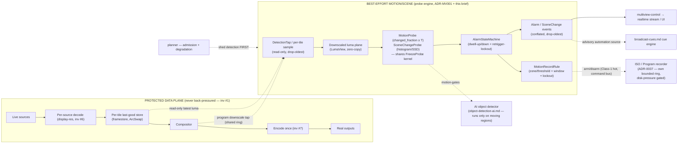

# Multiview — Motion & Scene-Change Detection: Finely Configurable, Trigger-Capable

**Area:** Detection / Engine / Events / Config / Output / Control / Web.
**Status:** Design brief (Proposed) — docs-only; implementation follows in dependency-ordered waves.
**Drives:** [ADR-0068](../decisions/ADR-0068.md) (configurable motion / scene-change detection — algorithms, zones/masks, sensitivity/debounce; feeds record + cues).
**Extends:** [ADR-MV001](../decisions/ADR-MV001.md) + [broadcast-multiviewer-features.md §4](broadcast-multiviewer-features.md) (the **existing** content-aware probe engine — black/freeze probes, `LumaView`, `DetectionZone`, dwell/hysteresis `AlarmStateMachine` — that this brief generalizes, *not* re-invents), [object-detection-ai.md](object-detection-ai.md) + [ADR-0066](../decisions/ADR-0066.md) (the read-only detection frame-tap this reuses) + [ADR-0067](../decisions/ADR-0067.md) (the detection-event + record-trigger pattern this mirrors), [iso-program-recording.md](iso-program-recording.md) + [ADR-0037](../decisions/ADR-0037.md) (the recorder arm/disarm the trigger reuses), [realtime-api.md](realtime-api.md) (event envelope, topics, conflation), [efficiency.md](efficiency.md) (decode-at-display-res, bounded queues, admission ladder). Sibling briefs in this intake: [broadcast-cues.md](broadcast-cues.md) (the GPIO/cue debounce + retrigger-lockout vocabulary this mirrors), [recording-storage-offload.md](recording-storage-offload.md) (where triggered clips land).
**Backlog:** `MOT-*` in [`../development/feature-intake-2026-06-13.md`](../development/feature-intake-2026-06-13.md).

> The operator asked for two things: **finely configurable "motion" / scene-change detection**, and **record on motion / scene-change**. Multiview already ships the *hard half* of this: a content-aware probe engine that samples a tile's last-good luma plane and runs **freeze** detection — which is literally *motion below a threshold* — through a per-zone, dwell-debounced X.733 alarm lifecycle ([ADR-MV001](../decisions/ADR-MV001.md); `LumaView::changed_fraction`, `FreezeProbe`, `DetectionZone`, `AlarmStateMachine` are all in-tree today). This brief does **not** re-build that. It (a) adds a **MotionProbe** (changed-fraction *above* a threshold) and a **scene-change/cut probe** (histogram/SSD, the `scdet`-style cut detector) as siblings of the existing black/freeze probes, (b) pins **fine configurability** — zones/masks, per-zone sensitivity, min-duration, debounce, and a **retrigger-lockout** mirroring the GPIO-cue semantics, (c) routes results onto the existing conflated realtime stream, and (d) makes **record-on-motion** a thin rule that arms the *already-designed* ISO/Program recorder. Everything here is pure-Rust, runs off a downscaled luma plane the engine already sampled, and is "should/would/proposed."

---

## 0. Headlines

- **This is mostly *generalization*, not new machinery.** The in-tree probe engine ([ADR-MV001](../decisions/ADR-MV001.md), [broadcast-multiviewer-features.md §4](broadcast-multiviewer-features.md)) already computes the load-bearing primitive: `LumaView::changed_fraction(prev, zone, tolerance)` (`crates/multiview-engine/src/probe/luma.rs:286`) returns the fraction of luma samples that changed by more than a per-sample tolerance — **frame-differencing / SAD** in everything but name — and `FreezeProbe` (`crates/multiview-engine/src/probe/freeze.rs:103`) already raises an alarm when that fraction is **at or below** a threshold. **Motion is the same metric with the comparison flipped** (changed-fraction *at or above* a threshold). The deliverable is a `MotionProbe` + a scene-change probe + the trigger plumbing, reusing the zone model, the dwell/hysteresis state machine, and the event lane verbatim.
- **Three condition classes, one cheap luma pipeline.** (1) **Motion** — sustained inter-frame change over a zone (frame-differencing today; optional adaptive background-subtraction later). (2) **Scene-change / cut** — a *single-frame* discontinuity (a hard cut / source switch), detected by a histogram-distance or sum-of-squared-difference score, the in-house analogue of FFmpeg's `scdet` / `select='gt(scene,…)'`. (3) **Black / freeze** — already shipped; motion and freeze are inverses of the *same* `changed_fraction`, so they share config and code. All run on the **downscaled luma plane only** (invariant #5/#6) — no RGBA, no second decode.
- **Finely configurable, with cue-grade debounce.** Per detector: a normalized **detection zone** (rectangle today, polygon/mask noted), a **sensitivity/threshold**, a **min-duration** (dwell-up — change must persist before it fires), a **debounce** (dwell-down — must be quiet before it clears), and a **retrigger-lockout** (a refractory window after a fire during which it will not re-fire). The first four reuse `DetectionZone` + `Dwell` + `AlarmStateMachine` exactly; the lockout is the **one new state-machine field**, and its name/semantics are deliberately the **same as the GPIO-cue debounce + retrigger-lockout** in [broadcast-cues.md](broadcast-cues.md) so operators learn one model.
- **Shares the read-only detection frame-tap (ADR-0066).** Motion/scene detection reads frames the way preview and AI detection do — a non-blocking reader of a last-good slot via the `DetectionTap` ([ADR-0066](../decisions/ADR-0066.md), `crates/multiview-preview/src/tap.rs:61` pattern; per-tile `TileStore` `crates/multiview-framestore/src/tile.rs:371`). A slow/absent detector gets a stale frame or nothing — **never** a producer the engine awaits. And because motion detection is the *cheapest* possible analyser, it should **front** the expensive AI detector ([object-detection-ai.md §6](object-detection-ai.md)): run object detection only on moving regions.
- **The output clock is never gated on detection (invariant #1).** No motion/scene result is read on the output-clock thread or by the compositor; results flow strictly *outward* to events + the record trigger. `out_pts = f(tick)` is independent of detection latency, success, or failure. Detection is *sampled*, exactly like the existing probes (whose module doc, `probe/mod.rs:10`, already states this).
- **Record-on-motion reuses the recorder verbatim.** A motion/scene rule does not invent a recording path: it arms an **ISO** (per-input) or **Program** recorder ([iso-program-recording.md](iso-program-recording.md), [ADR-0037](../decisions/ADR-0037.md)) with pre-roll, hold/cooldown, and a clip-window — the *same* `Arm{Iso,Program}Recording` command + `Idempotency-Key` + `202` the AI record-trigger ([ADR-0067](../decisions/ADR-0067.md)) uses. The recorder's bounded drop-oldest ring + disk-pressure gating is the existing isolation guarantee; the trigger only flips arm/disarm (Class-1 hot, [ADR-R004](../decisions/ADR-R004.md), invariant #11).
- **Cheap by construction.** Frame-differencing on a downscaled luma plane (e.g. 320×180) is a few tens of thousands of `abs_diff` + compares per sampled frame, at ≤ a few fps — negligible CPU, **zero** GPU, **zero** extra decode, one reusable previous-frame buffer per source. A static wall costs ~nothing. This is the same posture the existing freeze probe already runs under.
- **Honest scope.** v1 is frame-differencing motion + histogram/SSD scene-cut + the record trigger, on the per-tile luma tap, emitting events through the existing alarm/event lane and (optionally) arming a recorder. **Adaptive background subtraction (MOG2-style), object-aware motion, optical flow, and motion-vector reuse from the decoder** are noted future axes, not v1.

---

## 1. Algorithms — motion vs scene-change vs black/freeze

All three classes are **picture conditions over a luma plane**, sampled per detection tick and turned into a debounced raise/clear by the existing `AlarmStateMachine`. They differ only in the *statistic* and the *comparison*.

### 1.1 What already exists (and must not be duplicated)

| Condition | In-tree today | Statistic |
|---|---|---|
| **Black** | `BlackProbe` (`crates/multiview-engine/src/probe/black.rs:85`) | `LumaView::mean_luma(zone)` ≤ threshold |
| **Freeze** | `FreezeProbe` (`crates/multiview-engine/src/probe/freeze.rs:103`) | `LumaView::changed_fraction(prev, zone, tol)` ≤ threshold |
| **Format mismatch / signal loss** | `FormatProbe` (`crates/multiview-engine/src/probe/mod.rs:31`) | observed `FrameMeta` vs expected |

The probe engine is **stateless analysers + a pure dwell/hysteresis state machine** over an injected `MediaTime` (`probe/mod.rs:10`, `alarm/state.rs`). Config lives in `multiview-config` (`crates/multiview-config/src/probe.rs` — `Probe`, `ProbeKind`, `DetectionZone`, `Dwell`), the X.733 vocabulary in `multiview-core` (`crates/multiview-core/src/alarm.rs` — `AlarmKind`, `PerceivedSeverity`), and the realtime surface in `multiview-events` (`Event::AlarmRaised/Updated/Cleared`, `crates/multiview-events/src/event.rs:1201`). **This brief adds variants, not subsystems.**

### 1.2 Motion — frame-differencing / SAD (v1), background-subtraction (future)

**Frame-differencing is already half-built.** A `MotionProbe` is the mirror of `FreezeProbe`: it calls the *same* `LumaView::changed_fraction(prev, zone, tolerance)` and reports `condition_present` when the changed fraction is **at or above** a `motion_threshold` (vs freeze's *at or below*). The two are the **same primitive with the opposite threshold comparison**, under separately configured thresholds/dwell (so naturally static content reads as "low change" without being a fault-level freeze, and vice versa); sharing `changed_fraction` means one tested, allocation-free kernel serves both. (FFmpeg's own `freezedetect` computes the *mean average absolute difference* of frame components against a noise floor — *to verify against the FFmpeg filter docs before implementation* — which is the same kind of metric, supporting the case that the in-house `changed_fraction` is the right primitive for both freeze and motion.)

- **Statistic.** `changed_fraction ∈ [0,1]` over the zone, with a per-sample 8-bit `diff_tolerance` (the existing `FreezeConfig::diff_tolerance`, default 2) absorbing sensor/codec noise. Optionally a **mean-absolute-difference (MAFD)** scalar over the zone — a cheap second statistic the FFmpeg `scdet`/`freezedetect` family also uses — for a smooth "motion energy" readout in the UI. (A new `LumaView::mean_abs_diff(prev, zone)` is the only kernel addition; it is the same loop as `changed_fraction` accumulating magnitude instead of a count.)
- **Sensitivity.** `motion_threshold` is the changed-fraction (or MAFD) above which the zone "has motion." Lower = more sensitive. A static logo/lower-third is excluded by drawing the **zone** around it (the existing `DetectionZone` already does this for black/freeze; `probe.rs:30` doc: *"so a static logo bug or a lower-third does not mask a black/frozen background"*).
- **Background subtraction (future, opt-in).** Frame-differencing fires on global lighting changes and trails fast objects. An **adaptive background model** (a MOG2-style per-pixel mixture-of-Gaussians, or a cheaper running-mean/median) adapts to gradual lighting and isolates true foreground — *(unverified)* MOG2 (Zivkovic 2004/2006, the OpenCV `BackgroundSubtractorMOG2`) models each pixel as a Gaussian mixture and segments shadows; it is materially heavier than frame-differencing (per-pixel state + updates). It is therefore a **separate `MotionAlgorithm::BackgroundSubtraction` variant**, off by default, admitted/shed like any heavier analyser (§5). v1 ships `MotionAlgorithm::FrameDiff` only; the config enum is `#[non_exhaustive]` so the model can be added without a breaking change.

### 1.3 Scene-change / cut — histogram / SSD (the in-house `scdet`)

A **scene change** (hard cut, source switch, graphics take) is **not** sustained motion — it is a *single-frame discontinuity*. Detecting it needs a different statistic and a different lifecycle (an **edge/pulse**, not a dwelled level).

- **Statistic.** A per-frame **scene score** in `[0,1]`: either a normalized **histogram distance** between consecutive luma histograms (robust to small motion, sensitive to a wholesale content change) or a normalized **sum-of-squared / sum-of-absolute differences** over the (downscaled) frame. This mirrors FFmpeg's `scdet` filter, whose `threshold` is *"a percentage of maximum change," range [0,100], default 10, good values [8,14]*, setting `lavfi.scd.score` + `lavfi.scd.mafd` per frame — and `select='gt(scene,T)'`, whose `scene` variable is a normalized `[0,1]` scene-change **score** for the frame (a relative measure, **not** a calibrated probability) — *to verify against the FFmpeg filter docs before implementation*. We compute the same kind of score in-house over the luma tap; **we do not shell out to FFmpeg filters** (no `xstack_cuda`/filtergraph dependency on the data plane — house rule).
- **Lifecycle = pulse, with a retrigger-lockout.** A cut is instantaneous, so the scene-change "alarm" is an **edge event**: when the score crosses `scene_threshold`, emit one `SceneChange` event/pulse, then enter a **retrigger-lockout** (a refractory window, default e.g. 1 s) during which further crossings are suppressed — exactly the GPIO-cue retrigger-lockout in [broadcast-cues.md](broadcast-cues.md). This stops a dissolve or a busy montage from emitting a burst of cuts. (Implementation: a thin `EdgeDetector { threshold, lockout }` state machine alongside the level-based `AlarmStateMachine`, or — simpler — model the cut as a zero-dwell alarm whose **`dwell_down` is repurposed as the lockout**; §2.4 picks the cleaner of the two.)
- **Min content change vs scene-cut.** Scene-cut and motion are complementary: motion = *something moved within the same shot*; scene-cut = *the shot itself changed*. An operator can arm either or both per source.

### 1.4 Black / freeze — already shipped, listed for completeness

`BlackProbe`/`FreezeProbe` exist (§1.1). This brief only **adds** `MotionProbe` and `SceneChangeProbe` as `ProbeKind` variants + `AlarmKind` variants (`Motion`, `SceneChange`), and a `MotionAlgorithm` enum. The existing black/freeze config, validation, dwell, severity, latch, roll-up, and northbound delivery (SNMP/syslog/webhook per [ADR-MV001](../decisions/ADR-MV001.md)) apply unchanged.

---

## 2. Configurability — zones/masks, sensitivity, min-duration, debounce, retrigger-lockout

Fine configurability is the operator's first ask. The vocabulary is **reused** from the existing probe config and the GPIO-cue brief, so an operator who knows one knows all.

### 2.1 Detection zones / masks (reuse `DetectionZone`)

- **Today:** `DetectionZone { x, y, w, h }` — a normalized `[0,1]` sub-rectangle of the picture (`crates/multiview-config/src/probe.rs:30`, with a validated runtime twin at `crates/multiview-engine/src/probe/luma.rs:67`). Motion/scene probes take a `zone` exactly like black/freeze. Multiple zones per source = multiple probes (the existing one-probe-per-condition model).
- **Masks (future, additive).** A rectangle excludes a static bug but cannot mask an arbitrary region (a road but not the sky). A **polygon/bitmap mask** is a future `DetectionZone` variant (the union becomes `#[serde(tag="kind")]` `Rect | Polygon | Mask` — never `untagged`, conventions §5). The layout editor already does react-konva polygon geometry ([conventions.md §8](../architecture/conventions.md)) and the AI detector's zones should **share this one geometry type** ([object-detection-ai.md §4.3](object-detection-ai.md)). v1 ships the rectangle; the mask is noted.

### 2.2 Sensitivity / threshold

- **Motion:** `motion_threshold` (changed-fraction or MAFD above which there is motion) + `diff_tolerance` (per-sample noise floor). Lower threshold / lower tolerance = more sensitive.
- **Scene-change:** `scene_threshold` (score above which it is a cut), mirroring `scdet`'s `[8,14]`-percent sweet spot (we normalize to `[0,1]`).
- Both are per-probe and individually disableable, satisfying the ADR-MV001 consequence: *"any probe can be made cheaper or disabled to protect the output-clock invariant"* (`probe/mod.rs:22`).

### 2.3 Min-duration + debounce (reuse `Dwell` + `AlarmStateMachine`)

- **`min_duration` = dwell-up.** Motion must persist for `up_ms` before the probe fires (kills a single-frame glitch / a passing bird). This is `Dwell::up_ms` (`crates/multiview-config/src/probe.rs:113`) fed into `AlarmHysteresis::from_dwell` → `AlarmStateMachine::observe` (`crates/multiview-engine/src/alarm/state.rs:321`) **verbatim**.
- **`debounce`/quiet = dwell-down.** Motion must be absent for `down_ms` before the probe clears (stops flapping at the edge of the threshold). This is `Dwell::down_ms`, also verbatim. Asymmetric dwell (long up, short down, or vice-versa) is the existing hysteresis (`probe.rs:108` doc).
- The state machine already clamps a non-monotonic clock (`state.rs:318`) and is property-tested with an injected clock — motion/scene inherit all of that.

### 2.4 Retrigger-lockout (the one new field — mirrors the GPIO cue)

A **retrigger-lockout** is a refractory window *after a fire* during which the probe will **not fire again**, regardless of the condition. It is distinct from dwell-down: dwell-down governs *clearing*; lockout governs *re-arming*. It is the right tool for **record-on-motion** (don't start a new clip every second in a busy scene) and for **scene-cut pulses** (don't emit a burst on a dissolve).

- **Semantics — deliberately identical to the GPIO cue** ([broadcast-cues.md](broadcast-cues.md)): `debounce` (must be stable before the edge counts — our dwell-up), and `retrigger_lockout_ms` (after an accepted edge, ignore further edges for N ms). Naming, units (ms), and behaviour match so the two surfaces read the same in config and UI.
- **Implementation.** The cleanest fit is to **extend `AlarmStateMachine` with an optional `retrigger_lockout` window**: after a `Raised` (or after a `SceneChange` pulse), record `locked_until = now + lockout` and have `observe` refuse to re-enter `Pending`/re-raise until `now ≥ locked_until`. This is **one field + two guard clauses** in the existing total transition function, fully property-testable with the existing injected clock — no new subsystem. (Alternative: a separate `EdgeDetector` for the pulse case; the brief leans to the single extended state machine so motion *and* scene share it. See §6 Q1.)
- For the **level** conditions (motion, black, freeze) the lockout is optional and defaults to off (their dwell already debounces); for the **edge** condition (scene-cut) the lockout is the primary anti-burst control and defaults on.

### 2.5 Config shape (additive, serde-default, non-breaking — proposed)

New `ProbeKind` variants in `crates/multiview-config/src/probe.rs` (internally tagged by `kind`, never `untagged`):

```text
ProbeKind::Motion { motion_threshold: u16 /*per-mille*/, diff_tolerance: u8,
                    algorithm: MotionAlgorithm /*default FrameDiff*/, #[serde(default)] zone }
ProbeKind::SceneChange { scene_threshold: u16 /*per-mille*/, metric: SceneMetric /*Histogram|Ssd*/,
                         #[serde(default)] zone }
MotionAlgorithm #[serde(tag="kind")] #[non_exhaustive] = FrameDiff | BackgroundSubtraction /*future*/
SceneMetric     #[serde(tag="kind")] #[non_exhaustive] = Histogram | Ssd
```

Plus `retrigger_lockout_ms: Option<u32>` on `Probe` (additive; `None` = no lockout, preserving existing black/freeze behaviour). `AlarmKind` gains `Motion` and `SceneChange` (`crates/multiview-core/src/alarm.rs:83`, `#[non_exhaustive]` — additive). All existing `examples/*.toml` keep parsing. Validation (in `ProbeKind::validate`) bounds the per-mille thresholds `0..=1000` (mirroring the existing freeze `difference_threshold` check at `probe.rs:283`) and the zone geometry (existing `DetectionZone::validate`).

---

## 3. Shared frame-tap with detection (ADR-0066)

Motion/scene detection needs frames; it gets them the **same read-only way** as preview and AI object detection — never as a queue the producer pushes into. This is the single load-bearing isolation decision and it is *reused twice over*: once from the existing probe engine, once from the AI detection tap.

### 3.1 Tap points (all already exist)

| Tap | Source slot (in-tree) | What the probe sees |
|---|---|---|
| **Per-input (default)** | `TileStore::read`/`read_at` over the lock-free `ArcSwap` ring (`crates/multiview-framestore/src/tile.rs:371,421`); simpler `LatestSlot` (`crates/multiview-framestore/src/latest.rs:33`) | The last-good decoded frame for one source, at decode (≈display) resolution. **No second decode** (invariant #6). Its **luma plane** is the first NV12 plane (Y), carrying its own **stride/pitch** metadata (hardware frames are frequently row-padded, so `LumaView` must carry width, height **and** stride rather than assume tight packing) — handed to `LumaView` with **zero copy** (the existing probe path, `luma.rs:1`). |
| **Program** | The program downscale tap `ProgramTap`/`ProgramFrame` (`crates/multiview-preview/src/whep/program.rs`), started on first subscriber | The composed wall, downscaled. For "anything moved anywhere on the wall." Mapping a wall-region motion back to a tile is the same open question as the AI detector ([object-detection-ai.md §7 Q3](object-detection-ai.md)). |

The existing probe engine already samples the per-tile last-good store; motion/scene **inherit that path directly**. Where a probe wants the program/off-air scope, it subscribes through the **`DetectionTap`** of [ADR-0066](../decisions/ADR-0066.md) — the moral twin of `multiview-preview`'s `TapRegistry` (`crates/multiview-preview/src/tap.rs:61`): lazy-start, refcounted, auto-stop, bounded **drop-oldest** ring (`crates/multiview-preview/src/lib.rs:11,22`). **One tap, N subscribers**: the cheap motion probe and the expensive AI detector should share the same downscale ring (the AI brief's leaning default, [object-detection-ai.md §7 Q2](object-detection-ai.md)).

### 3.2 Downscale once, to a tiny luma plane (invariant #5/#6)

- Detection runs on a **downscaled luma plane** (e.g. 320×180 or smaller) — the same blit the program/preview tap already produces, or a one-time box-downscale of the per-tile frame. Never RGBA (invariant #5), never a second full-res decode (invariant #6). The probe reads `plane[0]` (Y) only; chroma is irrelevant to motion/scene.
- One **reusable previous-frame buffer per source** (pool, never per-frame — safety rule §5, [efficiency.md §2.4](efficiency.md)). `changed_fraction`/histogram compares current-vs-previous, then the current becomes previous (a buffer swap, not an alloc).

### 3.3 Sampling, not pacing (invariant #1) + isolation (invariant #10)

- The detector **pulls** at its own cadence (default ≤ a few fps per source). On each tick it reads whatever the slot holds (an `Arc`-clone; holding it cannot stall the producer — the `ArcSwap` swap is wait-free, `tile.rs:191`) and skips if unchanged. It never sets the engine cadence and never blocks waiting for a fresh frame.
- **No motion/scene result is ever read on the output-clock thread or by the compositor.** Results flow strictly *outward* to the event lane (§4) and the record trigger (§4.2). `out_pts = f(tick)` is independent of detection entirely — a stalled or crashed detector changes nothing about output. This is the same guarantee the existing probe module already documents (`probe/mod.rs:10`) and the same one ADR-0066/ADR-P001 prove with a chaos gate.
- If a detector backing ever needs a queue, it is depth-1–3 **drop-oldest**; full → drop + count, never block, never grow.

---

## 4. Events + record-on-motion trigger

Detections are **advisory events** on the existing realtime envelope, and an optional rule arms the existing recorder. Neither is a control input to the data plane.

### 4.1 Event model (reuse the alarm/event lane)

- **Motion / freeze / black** are *level* conditions → they ride the **existing X.733 alarm lane** unchanged: `MotionProbe` → `AlarmStateMachine` (kind `Motion`) → `Event::AlarmRaised/Updated/Cleared(AlarmTransition)` (`crates/multiview-events/src/event.rs:1201`), with severity, roll-up, latch, and ack already implemented. Motion simply becomes another `AlarmKind` with its own threshold/dwell/zone. (Operator nuance: "motion present" is often *informational*, not a *fault* — so a motion probe will typically carry `PerceivedSeverity::Warning`/`Indeterminate`, or be surfaced as a non-alarm "activity" event; the X.733 lifecycle still gives free debounce + roll-up. See §6 Q4.)
- **Scene-change** is an *edge* → a dedicated **pulse event** `Event::SceneChange(SceneChange { scope, score, detected_at })` (proposed, `#[non_exhaustive]`, tagged) rather than a raise/clear pair, because a cut has no "duration to clear." `scope` is `Input{input_id} | Program | CuedSource{id}`, mirroring the recorder/detection scope ([iso-program-recording.md §F](iso-program-recording.md), [object-detection-ai.md §4.1](object-detection-ai.md)).
- **Topic, conflation, isolation (invariant #10).** Motion alarms ride the existing alarm topic. High-rate "motion energy" readouts (the MAFD scalar for a UI meter), if surfaced, ride a **conflated drop-oldest** lane like `AudioMeters` (`crates/multiview-events/src/topic.rs:37`; `Event::is_conflated`, `event.rs:1327`) — latest-per-(scope) wins under load, re-snapshotable, never polled, the engine never awaits a subscriber. A busy scene cannot back-pressure: conflation collapses it ([realtime-api.md §8](realtime-api.md)).

### 4.2 Record-on-motion / scene-change trigger (reuse the recorder)

The operator's second ask is a **rule that arms the existing recorder** — *the same rule shape and command path as the AI record-trigger* ([ADR-0067 §5](object-detection-ai.md), [iso-program-recording.md §F](iso-program-recording.md)), with a motion/scene match instead of a label match.

A `MotionRecordRule` (proposed config, additive) declares:

- **Match:** `condition` (`motion` | `scene_change`), `source/scope`, the probe `zone`, `threshold`, and the `min_duration` / `retrigger_lockout` (§2). For motion-record, the **retrigger-lockout is the key control** — it sets the minimum gap between clips.
- **Target:** which recorder to arm — an **ISO** recorder on the matched **input** or the **Program** recorder ([iso-program-recording.md §A/§B](iso-program-recording.md)). Reuses `IsoRecording`/`ProgramRecording` *verbatim*; the rule supplies only arm/disarm + a clip-window.
- **Window:** `pre_roll` (seconds of already-segmented footage kept before the event — the recorder is a rolling segmenter, so pre-roll = "don't prune the last N seconds," [iso-program-recording.md §C](iso-program-recording.md)), `min_duration`, and `hold`/`cooldown` (keep recording until no motion for T seconds, then disarm) — anti-flap on motion at the threshold edge.
- **Consumes detector transitions, not the conflated stream.** Record/audit correctness must **not** depend on the best-effort realtime lane: a `MotionRecordRule` is evaluated against the detector's `AlarmStateMachine` transitions (raise/clear) and scene-cut edges **before** realtime conflation, in the detection worker tier. Conflated pulse/meter delivery to the UI (§4.1) remains best-effort and may drop; the rule never reads the conflated topic. (This keeps a busy scene from dropping a record trigger on the floor while still honouring invariant #10 outward.)
- **Apply path (invariants #1, #10, #11).** A matched rule submits the existing `Arm{Iso,Program}Recording` command on the command bus (`202` + op-id, `Idempotency-Key`, shed-to-`503`, [ADR-0037 §F](iso-program-recording.md)). Arm/disarm is **Class-1 hot** ([ADR-R004](../decisions/ADR-R004.md), invariant #11): it only flips a best-effort sink's state. The trigger runs **off the data plane**, in the detection worker tier; it **never** calls the engine on the clock thread; it enqueues a command the existing drain applies at a frame boundary. The `202`/op-id/`503` shape is **REST surface vocabulary** reused for shape only; internally the trigger is a command-bus enqueue, and idempotency for repeated detections is keyed **deterministically** off `{rule_id, scope, detection_epoch}` (the dwell-confirmed fire window) — not a client-supplied `Idempotency-Key` — so a sustained detection re-evaluated each tick arms once per fire window, not once per tick. The recorder's own bounded drop-oldest ring + disk-pressure gating ([ADR-0037 §E](iso-program-recording.md)) means even a storm of triggers cannot stall output or grow RAM — a slow disk drops + warns + backs off, as designed.

### 4.3 Auditability

Every fire emits the alarm/scene event (the "why") and the recorder's `Event::RecordingStatus` ([ADR-0037 §F](iso-program-recording.md)) shows the "what." A `HealthWarning` ([ADR-MV001](../decisions/ADR-MV001.md), `WarningCode` is `#[non_exhaustive]`, `crates/multiview-events/src/event.rs:319`) surfaces a rule that could not arm (e.g. disk pressure) — so a silently-not-recording motion rule is *loud*, not invisible.

### 4.4 Also feeds cues (forward link)

Beyond recording, a motion/scene event is a natural **automation source** for the broadcast-cue engine ([broadcast-cues.md](broadcast-cues.md)): an operator may wire "scene-change on cam-3 → fire cue X" the same way a GPIO input fires a cue. That routing belongs to the cue engine (it owns the action vocabulary and the debounce/lockout it shares with us); this brief only **emits the event** and guarantees it is advisory, conflated, and off the clock thread. Driving *program* from motion (auto-director) is explicitly out of scope and, if ever pursued, must go through the command bus + switcher's frame-boundary seam ([ADR-0059](../decisions/ADR-0059.md) area), never the clock thread, and be operator-opt-in.

---

## 5. Efficiency — downscaled luma plane; cheap

Per the standing efficiency rule, here is the explicit budget. Motion/scene detection is the **cheapest** content-analyser in the system and a net efficiency *win* when it fronts heavier consumers.

- **CPU.** Frame-differencing over a 320×180 luma zone is ≈ 57k `u8::abs_diff` + compare + count per sampled frame; at ≤ 5 fps/source that is on the order of a few hundred-thousand integer ops/sec/source — negligible. The histogram/SSD scene score is one extra single-pass accumulation over the same plane. All integer/`f64` accumulation, no `as` casts (the existing `changed_fraction`/`mean_luma` already obey the `as_conversions` ban, `luma.rs:258`).
- **GPU.** **No additional GPU compute.** Motion/scene run on the CPU over an already-sampled luma plane; they add no GPU work and no VRAM. The "zero GPU" claim holds only because a CPU-side downscaled luma plane already exists for the chosen tap; where the tap source is GPU-resident, the GPU→CPU map/copy is the existing tap's cost, and any such boundary must be **explicit, bounded, and costed** (per the zero-copy-island budget) rather than added per-detector. (Background-subtraction, if added later, is still CPU-side per-pixel state — modest, and admitted/shed like any analyser.)
- **Memory.** Bounded everywhere: **one reusable previous-frame luma buffer per source** (a few tens of KiB at downscaled size, pooled at arm, never per-frame, [efficiency.md §2.4](efficiency.md)); optional small histogram bins (256 `u32`); depth-1–3 drop-oldest tap ring shared with preview/AI. No unbounded growth on a busy scene — the event lane conflates.
- **IO.** None beyond the shared tap. Events are tiny and conflated; record-arm is a single command, not a stream.
- **Rate, gating, shedding.** Per-source fps cap (default ≤ 5 fps, configurable down for static walls). On the degradation ladder ([efficiency.md §3.3/§3.5](efficiency.md)) detection is **above preview/program** in shed-priority (shed *first*): reduce detect fps → motion-only (drop scene-score) → suspend, **all before** any preview or program lever moves — the same posture as the AI detector ([object-detection-ai.md §6.2](object-detection-ai.md)) and the ADR-MV001 *"probes run at reduced cadence/resolution and are individually disableable to protect the output-clock invariant."*
- **Net win: motion-gates the expensive detector.** Object detection should run **only on moving regions** ([object-detection-ai.md §6.1](object-detection-ai.md), the low-cost-motion-then-detect pattern). A static wall ⇒ the AI detector idles ⇒ the biggest GPU/VRAM saving in the detection stack comes *from this cheap probe*. Motion detection pays for itself many times over.

---

## 6. Open questions

1. **One extended state machine, or a separate edge detector?** Motion/black/freeze are *level* conditions that fit `AlarmStateMachine` perfectly; scene-cut is an *edge/pulse*. Proposed: extend `AlarmStateMachine` with an optional `retrigger_lockout` field (one field, two guards, fully property-testable) and model the cut as a zero-dwell raise gated by the lockout — so motion *and* scene share one tested machine. Alternative: a dedicated `EdgeDetector { threshold, lockout }`. Reversible; lean to the extended machine to avoid a second lifecycle.
2. **Is "motion" an alarm or an activity event?** The X.733 alarm lane gives free debounce/roll-up/ack, but "motion present" is usually *informational*, not a *fault*. Proposed: reuse the alarm machine for the **lifecycle** (dwell + lockout) but surface motion as a distinct **activity** event class (or `PerceivedSeverity::Indeterminate`/`Warning`) so it does not pollute the NOC fault roll-up unless the operator wants it to. Flag for the events-model wave.
3. **Per-mille vs float thresholds.** The existing freeze config uses a `u16` **per-mille** difference threshold (`probe.rs:209`); motion/scene should match it for consistency and to keep config integer-exact (no float-`==` lint pain). Confirm per-mille resolution is fine-grained enough for the operator's "finely configurable" ask (it is 0.1 % steps); a float is the alternative if not.
4. **Background subtraction priority.** Frame-differencing is enough for "did something move," but trails fast motion and false-fires on lighting changes. Is a MOG2-style adaptive model (heavier, per-pixel state) worth a near-term wave, or strictly future? Proposed: ship frame-diff v1, gate the model behind `MotionAlgorithm::BackgroundSubtraction` (off by default), and only build it if operators hit frame-diff's limits. *(MOG2 specifics above are unverified training knowledge — verify the algorithm + a permissive pure-Rust/own implementation before committing, since OpenCV is not a dependency we want on the data plane.)*
5. **Program-scope coordinate mapping.** A motion/scene event on the *composed wall* needs mapping back to which tile/source moved (for "record the ISO of the camera that moved"). Same open question as the AI detector ([object-detection-ai.md §7 Q3](object-detection-ai.md)) — resolve once, share the policy (centroid-in-tile vs overlap). Per-input tapping sidesteps it but costs N taps.
6. **Decoder motion vectors as a free signal.** Hardware/codec decoders already produce per-macroblock motion vectors. Reusing them would make motion detection *truly* free (no pixel pass at all), but they are codec/backend-specific, only available behind the FFI feature islands, and absent for synthetic/raw sources. Noted as a future efficiency axis, not v1 (v1's frame-diff already costs ~nothing).

---

## 7. Mermaid — motion/scene detection relative to the protected pipeline



**Legend:** every dotted edge into `Detect` is read-only / fire-and-forget / drop-oldest — none can stall the solid (protected) edges. The only edges *out* of `Detect` toward the data plane are the **command-bus arm/disarm** (applied at a frame boundary by the existing drain, never on the clock thread) and the advisory **cue** event.
