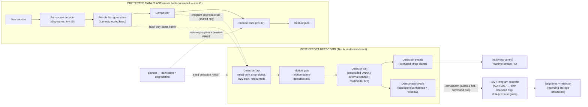

# Multiview — Object Detection & Image/Video-Model Integration: The Inference Seam + Record-on-Detection

**Area:** Detection / Preview / Engine / Events / Control / Output / Config / Web.
**Status:** Design brief (Proposed) — docs-only; implementation follows in dependency-ordered waves.
**Drives:** [ADR-0066](../decisions/ADR-0066.md) (inference seam + read-only frame-tap; embedded ONNX vs external model service; engine isolation), [ADR-0067](../decisions/ADR-0067.md) (detection event model + record-on-named-object trigger).
**Extends:** [preview-subsystem.md](preview-subsystem.md) (the read-only tap pattern + Tier-A isolation), [ADR-P001](../decisions/ADR-P001.md) (taps are read-only / drop-oldest / shed-first), [iso-program-recording.md](iso-program-recording.md) + [ADR-0037](../decisions/ADR-0037.md) (the recorder arm/disarm + bounded write path the trigger reuses), [realtime-api.md](realtime-api.md) (event envelope, topics, conflation), [efficiency.md](efficiency.md) (decode-at-display-res, bounded queues, admission ladder), [self-aware-placement.md](self-aware-placement.md) (SENSE→DETECT→WARN→PLAN→APPLY; inference is a GPU co-tenant). Sibling briefs in this intake: [motion-scene-detection.md](motion-scene-detection.md) (the cheap motion gate that fronts the detector), [recording-storage-offload.md](recording-storage-offload.md) (where triggered clips land).
**Backlog:** `DET-*` in [`../development/feature-intake-2026-06-13.md`](../development/feature-intake-2026-06-13.md).

> The operator asked for two things: **preparation for future connectivity to image and/or video models for object detection**, and **record-on-named-object once that integration exists**. This brief designs a *seam*, not a shipped detector. It specifies (a) a read-only frame-tap that hands sampled frames to a detector with **zero** ability to back-pressure the engine, (b) a **provider-agnostic** detector interface that an embedded ONNX runtime, an external model service, or a future multimodal vision API can each satisfy behind the same trait, (c) a typed detection event model on the existing realtime stream, and (d) a record-on-detection trigger that arms the *already-designed* recorder. We build the connectors; we do **not** bundle a vendor model or SDK. Everything here is "should/would/proposed."

---

## 0. Headlines

- **This is a seam, not a detector.** The operator asked for *preparation*. The deliverable is an interface (`Detector` trait + a frame-tap + an event type + a trigger) that any future detector — embedded or remote — plugs into. No model weights, no vendor SDK, and no detector implementation are bundled or required for the default build. The seam compiles and is testable with a deterministic stub detector; real providers are off-by-default Cargo features.
- **Detection rides the preview tap pattern, read-only.** The detector subscribes to a frame source exactly the way preview does ([preview-subsystem.md §2](preview-subsystem.md), [ADR-P001](../decisions/ADR-P001.md)): a capacity-1 / drop-oldest latest-wins slot. It reads frames that *already exist* (the per-tile last-good store `crates/multiview-framestore/src/tile.rs:371` / `latest.rs:33`, or the program downscale tap `crates/multiview-preview/src/whep/program.rs`). A slow, stalled, crashed, or absent detector gets a *stale frame or nothing* — **never** a producer the engine awaits. Invariant **#10**.
- **The output clock is never gated on detection.** No detection result is ever read on the output-clock thread; `out_pts = f(tick)` is untouched whether the detector is fast, slow, or dead. Invariant **#1**. Detection is *sampled* like every other aux consumer.
- **Decode-at-display-resolution, and detect-at-model-resolution.** The detector samples the frame already decoded near its display size (invariant **#6**) and downscales **once** to the model's input geometry (commonly 320×320 / 640×640). It never forces a second full-res decode and never materializes RGBA per tile beyond the small model tensor.
- **Provider-agnostic by construction.** One `Detector` trait, three sanctioned backings: **(a) embedded** ONNX Runtime via the `ort` crate (off-by-default `onnx` feature); **(b) external model service** over a network detector protocol (HTTP/gRPC/WHIP-style frame push) to a sidecar or a box like a Coral/Hailo/Triton/Frigate-style detector; **(c) future multimodal / vision-LLM API** (image or short-clip in, structured labels out) behind the same trait. The engine knows only the trait.
- **Open models, open runtimes, nominative interop only.** We target open runtimes (ONNX Runtime via `ort`, pure-Rust fallbacks) and permissively-licensed open models (YOLO-NAS / YOLOX / RT-DETR / SSD-MobileNet families — Apache-2.0). We do **not** redistribute model weights, and we flag that some popular weights (Ultralytics YOLOv8/v11) are **AGPL-3.0** — an operator-supplied choice, never a bundled default. Vendor detectors are spoken to over their published protocols, nominatively, like the ZowieTek-driver posture in [managed-devices.md](managed-devices.md).
- **Record-on-named-object reuses the recorder verbatim.** A detection trigger does not invent a recording path: it arms an **ISO** (per-input) or **Program** recorder ([iso-program-recording.md](iso-program-recording.md), [ADR-0037](../decisions/ADR-0037.md)) on a matched label, with pre-roll, hold/cooldown, and a clip-window policy. The recorder's bounded drop-oldest ring + disk-pressure gating is the existing isolation guarantee; the trigger only flips arm/disarm (Class-1 hot, [ADR-R004](../decisions/ADR-R004.md)).
- **Inference is a GPU co-tenant, and the placement engine knows it.** A GPU/ASIC inference session competes with decode/composite/encode for VRAM and engine time. It is admitted against the same per-engine budget as preview ([efficiency.md §3.2](efficiency.md), [self-aware-placement.md](self-aware-placement.md)) at **below** program priority and is shed *before* any program lever moves.
- **Honest scope.** v1 of any later implementation should be a single, well-lit path (embedded ONNX *or* one external service), motion-gated, on a subset of sources, emitting bounding-box + label + confidence + zone events and (optionally) arming a recorder. Tracking, re-ID, multimodal scene description, and audio-event detection are noted future axes, not v1.

---

## 1. Scope — a seam to plug detectors in later

**In scope (the preparation the operator asked for):**

1. A **read-only frame-tap** that samples frames from an existing store (input tile, program canvas, or a cued off-air source) at a configured rate, with the same structural isolation as preview taps.
2. A **provider-agnostic `Detector` trait** + a registry, so an embedded ONNX runtime, an external model service, or a future multimodal API can each be a backing without the engine knowing which.
3. A **typed detection event model** (boxes/labels/confidence/zones/track-id-optional) on the existing realtime envelope ([realtime-api.md](realtime-api.md)), conflated + drop-oldest, never polled.
4. A **record-on-named-object trigger** that arms the existing ISO/Program recorder ([iso-program-recording.md](iso-program-recording.md)) on a label/zone/confidence match, with pre-roll + cooldown.
5. **Config, API, and UI surfaces** to declare a detector binding, label filters, zones, and a record rule — all additive, all serde-default, none touching the engine's hot path.
6. **Efficiency + placement integration** so inference is admitted, budgeted, and shed like any other GPU co-tenant.

**Explicitly out of scope (noted future axes):**

- Bundling model weights or a vendor SDK; training/fine-tuning; a model zoo download manager (operator supplies a model path or a service URL).
- Multi-object **tracking / re-identification across frames** (a `track_id` field is reserved in the event model but no tracker is specified here).
- **Multimodal scene description / vision-LLM captioning** as a shipped feature (the trait is forward-compatible with it; the brief stops at the seam).
- **Audio-event detection** (gunshot/glass-break) — a parallel seam off the audio bus, out of scope here.
- Acting on detections to *switch* program (auto-director) — detection events are advisory; the switcher consumes them only if an operator wires a rule, and even then via the existing command bus, never on the clock thread.

**Why "seam, not detector" is the right v1.** Models, runtimes, and accelerators move fast (ONNX EP matrix, Coral/Hailo/NPU churn, multimodal APIs). Committing the engine to one detector would age badly and risk a hot-path coupling. A trait + a tap + an event + a trigger is *durable*: it survives every backend swap and lets the operator bring their own model the day they want one, without an engine change.

---

## 2. The frame-tap — read-only, drop-oldest, exactly the preview pattern

Detection needs frames. It must get them the way preview gets them: **as a non-blocking reader of a slot that already holds the latest frame**, never as a queue the producer pushes into synchronously. This is the single load-bearing isolation decision and it is *reused*, not reinvented.

### 2.1 Tap points (all already exist)

| Tap | Source slot (in-tree) | What the detector sees |
|---|---|---|
| **Per-input** | `TileStore::read`/`read_at` over the lock-free `ArcSwap` ring — `crates/multiview-framestore/src/tile.rs:371,421` (and the simpler `LatestSlot` — `crates/multiview-framestore/src/latest.rs:33`) | The last-good decoded frame for one source, at its decode (≈display) resolution. **No second decode** (invariant #6). |
| **Program** | The program downscale tap — `crates/multiview-preview/src/whep/program.rs` (`ProgramTap`, `ProgramFrame`), the same extra GPU blit preview uses, started only on first subscriber | The composed multiview canvas, already downscaled. Useful for "anything anywhere on the wall." |
| **Off-air cued source** | The preview cue decoder (Tier-B isolated worker, [preview-subsystem.md §2](preview-subsystem.md)) | A source not yet on the wall, for pre-bind confirmation (e.g. "only bind if a person is present"). |

The detector subscribes through a **`DetectionTap`** that is the moral twin of `multiview-preview`'s `TapRegistry` (`crates/multiview-preview/src/tap.rs:61`): lazy-start on first detector binding, refcounted, auto-stop when no rule references it, and reading from a bounded **drop-oldest** ring (`crates/multiview-preview/src/lib.rs:11,22`). Cost is **~zero when no detection rule is active**.

### 2.2 Sampling, not pacing (invariant #1)

- The detector **pulls** at its own configured cadence (default ≤ 5 fps per source; see §6). It never sets the engine's cadence and never blocks waiting for a fresh frame — on each tick it reads whatever the slot holds (or skips if unchanged).
- The frame the detector reads is an `Arc`-clone of the latest published frame; holding it cannot stall the producer (the producer publishes a new `Arc` into the slot regardless — the `ArcSwap` swap is wait-free, `tile.rs:191`).
- **No detection result is ever read by the compositor or the output-clock loop.** Results flow *outward* to the event stream and the trigger; they never flow *into* the data plane. `out_pts = f(tick)` is independent of detection latency, success, or failure (invariant #1).

### 2.3 Structural isolation (invariant #10) — restated for detection

The detector is a **Tier-A best-effort consumer** ([preview-subsystem.md §2](preview-subsystem.md), [ADR-P001](../decisions/ADR-P001.md)). Specifically:

- **Read-only latest-wins slot.** A slow detector gets a stale frame or nothing; it never holds a ref the producer awaits. (Same `arc_swap` posture as `tile.rs`/`latest.rs`.)
- **Own task tier; isolation matched to the backing.** An **external** service/sidecar is a separate **process** (or remote box) — genuinely SIGKILL-able, with own timeouts, circuit breaker, and supervised backoff, exactly like the cue-decoder posture. An **embedded** ONNX session runs in-process on its own thread/pool: a thread is *not* SIGKILL-able independently of the host process, so embedded isolation is supervised-thread (panic-catch, watchdog timeout → drop the session, bounded memory/concurrency caps) and a hard segfault/OOM in native code is a residual risk that the operator accepts when enabling the `onnx` feature. Operators needing hard crash isolation for native inference run the **external-service** backing (separate process) instead. Either way a hung/failed detector degrades to "paused, warned," never touching the protected core.
- **Bounded, drop-oldest hand-off if a queue is unavoidable.** If a detector backing needs a small input queue (e.g. to batch), it is depth 1–3 drop-oldest; full → drop + count, never block, never grow (invariant #5/#10; the `efficiency.md §2.4` rule).
- **Admission + shed-first.** All inference compute is admitted against the planner's per-engine budget at **lowest** priority (below program *and* below preview by default), and is the first thing the degradation ladder sheds ([efficiency.md §3.5](efficiency.md), §6 below).
- **CI chaos gate.** Reuse the preview no-back-pressure soak: stall and SIGKILL the detector under load and assert the program output is byte-for-byte unaffected with zero added frame-interval jitter. A "detection never back-pressures" assertion is a hard gate, mirroring ADR-P001's.

> **Why not feed the detector inside the compositor for "free" frames?** Rejected for the same reason preview is not: it couples a best-effort fault to invariant #1. The detector reads the *published* store, off the clock thread.

---

## 3. The detector provider seam — embedded ONNX vs external service vs future multimodal API

The engine depends only on a **trait**. Three sanctioned backings satisfy it; the operator picks per binding. (Decision: [ADR-0066](../decisions/ADR-0066.md).)

### 3.1 The trait (shape, not final signature — proposed)

A proposed new pure-Rust crate **`multiview-detect`** (no native deps in the default build, mirroring the `multiview-preview`/`multiview-hal` shell posture and the `*sys`-crate precedent in [iso-program-recording.md §D](iso-program-recording.md)) owns:

- `trait Detector`: a `detect` method returning a boxed future — `fn detect(&self, frame: DetectFrame, ctx: &DetectCtx) -> Pin<Box<dyn Future<Output = Result<Detections, DetectError>> + Send + '_>>` (the `async-trait`-style boxed-future shape). Native `async fn` in a trait is **not** object-safe, and the provider registry must store `dyn Detector` trait objects, so the boxed-future signature is what makes the seam dyn-dispatchable; the one allocation per call is negligible at ≤ 5 fps. `DetectFrame` is a borrowed NV12/relevant-format view + geometry + `MediaTime`, and `Detections` is a vec of `{ label: Label, confidence: f32, bbox: NormRect, track_id: Option<TrackId> }` in **normalized** coordinates (resolution-independent, robust to the display-res decode of invariant #6).
- `trait DetectorProvider`: capability advertisement (`labels()`, `input_geometry()`, `is_remote()`, `max_fps()`), construction, and health, so the planner and the capability surface know what a build/host actually offers (the `self-aware-placement.md` DETECT discipline).
- A **deterministic stub** `Detector` (always present, no features) that emits scripted detections — this is what TDD tests and the default build use, so the seam is real and exercised without any model.

The trait carries **no** tensor/runtime types in its signature (no `ort` types leak across the seam), so a backend swap is a feature flip, not an API change. Labels are a typed, open vocabulary (`Label(String)` newtype) — the engine does not hard-code a class list; the *model* defines it and advertises it via `labels()`.

### 3.2 Backing (a) — embedded ONNX Runtime (`onnx` feature, off by default)

- **Runtime.** ONNX Runtime via the **`ort`** crate (the maintained Rust binding for Microsoft's ONNX Runtime; pin the exact `ort` release line and the underlying ONNX Runtime version at implementation time — *to verify before implementation*). `ort` supports CPU and a broad hardware-accelerator matrix (CUDA/TensorRT, OpenVINO, DirectML/CoreML, etc.) selected by **execution provider**, which maps cleanly onto our existing per-vendor feature islands (`cuda`/`vaapi`/`videotoolbox`). Pure-Rust ONNX alternatives such as `tract` (a separate Rust inference stack, not part of `ort`) are an option where no native ONNX Runtime is acceptable, subject to model-operator compatibility.
- **License posture.** `ort`/ONNX Runtime are permissively licensed (open runtime). **Model weights are operator-supplied** by path/URL — we ship none. We prefer documenting **Apache-2.0 model families** (YOLO-NAS, YOLOX, RT-DETR, SSD-MobileNet) and we **flag** that Ultralytics YOLOv8/v11 weights are **AGPL-3.0** (a strong copyleft that reaches SaaS) so the operator chooses knowingly — *model licenses to verify before implementation*. This keeps the default build clean and the licensing decision the operator's, mirroring the `gpl-codecs`/NDI opt-in discipline.
- **Where it runs.** On its own thread/pool, **not** the output-clock thread; its GPU session is a co-tenant admitted by the planner (§6). It is `unsafe`-isolated like the FFI crates (FFI owned behind the feature, `// SAFETY:` blocks), never on the hot path.

### 3.3 Backing (b) — external model service (network detector protocol)

- For operators who run a **dedicated detector box** (Coral EdgeTPU, Hailo, an NVIDIA Triton/TensorRT server, or a Frigate-style ONNX/OpenVINO detector — *Frigate's detector matrix to verify before implementation*), the seam speaks to it over the network: a small **detector protocol** that pushes a downscaled frame (or a region crop) and receives structured detections. Transport is HTTP/gRPC for request/response, with a frame-push variant for streaming detectors. **IPv6-first**: connect to bracketed IPv6 literals, dual-stack resolve, no IPv4-only assumptions ([conventions.md §10](../architecture/conventions.md)).
- **Isolation.** The service client is a process-isolated worker with per-request timeouts, a circuit breaker, and supervised backoff (the cue-decoder / recorder back-off posture, [ADR-0037](../decisions/ADR-0037.md) §E). A dead or slow service degrades the detector to "paused, warned" — never the engine.
- **Nominative interop only.** We implement *their published protocol*, clean-room, nominatively (the ZowieTek-driver posture in [managed-devices.md](managed-devices.md)). We do not vendor their SDK or redistribute their specs; ToS/licensing caveats are flagged and deferred to the operator.

### 3.4 Backing (c) — future multimodal / vision-model API

- The same trait accepts a backing that sends an **image (or a short clip)** to a multimodal vision model and parses **structured labels/regions** back. Because `detect()` is `async` and returns the same `Detections` shape, a higher-latency, lower-rate multimodal call (e.g. 0.2–1 fps, "is there a delivery truck in view?") is just a slow `Detector` — the tap's drop-oldest sampling already tolerates slow consumers.
- This is the operator's "image and/or video models" forward path. We specify the seam's *shape* (image/clip in, typed regions+labels+confidence out, normalized coords) and the isolation; we do **not** specify or bundle any particular model or API here. Provider-specific auth/quotas/ToS are the operator's, flagged not assumed.

### 3.5 Selection & capability advertisement

A binding declares its provider; the build/host advertises which providers are available (embedded ONNX only if the `onnx` feature is compiled and a model loads; external/multimodal only if a URL is configured). The UI greys out unavailable providers — the same "report what this build/host can do" discipline preview and the capability matrix already use ([preview-subsystem.md §8](preview-subsystem.md), [self-aware-placement.md §4](self-aware-placement.md)). A missing model/credential is a **warning**, never a crash.

---

## 4. Detection event model — zones, labels, confidence (realtime API)

Detections are **advisory events** on the existing realtime envelope ([realtime-api.md](realtime-api.md)), never a control input to the data plane. (Decision: [ADR-0067](../decisions/ADR-0067.md).)

### 4.1 Event shape (proposed `multiview-events` additions)

Following the in-tree pattern — every event enum/struct is `#[non_exhaustive]` and **tagged** (never `untagged`), as `crates/multiview-events/src/event.rs:318` (`WarningCode`) and the `Topic` enum (`crates/multiview-events/src/topic.rs:16`) already demonstrate:

- `Event::DetectionFrame(DetectionFrame { scope, detected_at: MediaTime, detections: Vec<Detection>, model: ModelId, dropped: u32 })` — the per-sample result for one tap; `scope` is `Input{input_id}` | `Program` | `CuedSource{id}` (mirroring `RecordingStatus`'s scope in [iso-program-recording.md §F](iso-program-recording.md)).
- `Detection { label: Label, confidence: f32, bbox: NormRect, zone: Option<ZoneId>, track_id: Option<TrackId> }`. Coordinates **normalized** `[0,1]` so they survive the display-res decode and any downscale (invariant #6).
- `Event::DetectionTrigger(DetectionTrigger { rule_id, action: TriggeredAction, label, confidence, scope })` — emitted when a rule fires (e.g. armed a recorder); the auditable record of "why did we start recording."

### 4.2 Topic, conflation, isolation (invariant #10)

- Detection events ride a dedicated high-rate topic alongside `AudioMeters` (`crates/multiview-events/src/topic.rs:37` is the precedent for a conflatable high-rate lane). They are **conflated drop-oldest** — latest-per-(scope) wins under load — and **re-snapshotable** (a late subscriber gets the current detection state, like `OutputStatus`). They are **never** correctness-critical and **never** polled; the engine publishes through the existing drop-oldest publisher and **never awaits** a subscriber.
- A flood of detections (busy scene, low confidence threshold) cannot back-pressure: conflation collapses it. This is the same lane discipline the audio meters and health warnings use.

### 4.3 Zones & labels (config)

- **Zones** are operator-drawn polygons/rectangles in normalized canvas/source coordinates (the layout editor already does react-konva geometry, [conventions.md §8](../architecture/conventions.md)). A detection is tagged with the zone(s) its bbox centroid (or overlap > threshold) falls in. Zones make "person in the driveway" expressible without per-pixel logic — the motion-gate's region model ([motion-scene-detection.md](motion-scene-detection.md)) and the detector's zones should share one geometry type.
- **Label filters** are an allow/deny list of labels per binding (the open vocabulary from `Detector::labels()`), plus a per-label minimum confidence. The engine does not hard-code a class taxonomy.

---

## 5. Record-on-named-object — the trigger into the recorder

The operator's second ask — *"record on named object detection (when AI integration is done)"* — is a **rule that arms the existing recorder**, not a new recording path. (Decision: [ADR-0067](../decisions/ADR-0067.md).)

### 5.1 The rule

A `DetectRecordRule` (proposed config, additive) declares:

- **Match:** `labels` (e.g. `["person","car"]`), `min_confidence`, optional `zones`, optional `scope` (which input / program).
- **Target:** which recorder to arm — an **ISO** recorder on the matched **input** (`crates/`/[iso-program-recording.md §A](iso-program-recording.md)) or the **Program** recorder ([§B](iso-program-recording.md)). Reuses `IsoRecording`/`ProgramRecording` *verbatim*; the rule only supplies arm/disarm + a clip-window.
- **Window:** `pre_roll` (seconds of already-segmented footage to keep before the match — satisfiable because the recorder is a **rolling segmenter** with retention; pre-roll = "do not prune the last N seconds," [iso-program-recording.md §C](iso-program-recording.md)), `min_duration`, and `cooldown`/`hold` (keep recording until no match for T seconds, then disarm) to avoid arm/disarm flapping on a flickering detection.
- **De-bounce:** require K matches in a sliding window before arming (kills single-frame false positives), and the motion gate ([motion-scene-detection.md](motion-scene-detection.md)) should front the detector so it only runs on changed regions (the Frigate motion-gating pattern — *to verify before implementation*).

### 5.2 How the trigger is applied (invariants #1, #10, #11)

- A matched rule submits an **arm** command on the existing command bus — the **same** `Arm{Iso,Program}Recording` operation [ADR-0037 §F](iso-program-recording.md) defines (`202` + op-id, `Idempotency-Key`, shed-to-`503`). Arm/disarm is **Class-1 hot** ([ADR-R004](../decisions/ADR-R004.md), invariant #11): it only flips a best-effort sink's state.
- The trigger runs **off the data plane**, in the detection worker tier. It **never** calls into the engine on the clock thread; it enqueues a command that the existing drain applies at a frame boundary. The recorder's own bounded drop-oldest ring + disk-pressure gating ([ADR-0037 §E](iso-program-recording.md)) means even a storm of triggers cannot stall output or grow RAM — a full/slow disk just drops + warns + backs off, exactly as designed. The trigger worker also **coalesces idempotently per (rule, target)**: it submits a command only on an arm/disarm *state transition*, and the arm/disarm op's `Idempotency-Key` ([ADR-0037 §F](iso-program-recording.md)) dedups retries — so even with the K-of-N de-bounce off, a flickering detection cannot flood the control plane.
- **Clip retention/offload.** Triggered clips are ordinary recorder segments with a "pinned until export/expiry" flag; their lifecycle (retention, export, offload to network/object storage) is owned by [recording-storage-offload.md](recording-storage-offload.md), not duplicated here. The trigger's only job is *arm with a window + a pin*.

### 5.3 Auditability

Every fire emits `Event::DetectionTrigger` (the "why") and the recorder's `Event::RecordingStatus` ([ADR-0037 §F](iso-program-recording.md)) shows the "what" (bytes/segments/state). A `HealthWarning` ([self-aware-placement.md §5](self-aware-placement.md), `WarningCode` is `#[non_exhaustive]` — `crates/multiview-events/src/event.rs:319`) surfaces a detector that is down, a model that failed to load, or a rule that could not arm (e.g. disk pressure) — so a silently-not-recording detector is *loud*, not invisible.

---

## 6. Efficiency & placement — inference is a GPU co-tenant

A detector — embedded GPU/ASIC or remote — consumes real resources. It is governed by the *same* model as every other co-tenant ([efficiency.md](efficiency.md), [self-aware-placement.md](self-aware-placement.md)); detection never gets a free pass.

### 6.1 Budget (mem / cpu / gpu / io)

- **GPU/VRAM.** An embedded ONNX session holds a model (tens–hundreds of MB) + activation buffers + the input tensor. It is admitted against the planner's per-engine VRAM/compute budget ([efficiency.md §3.2](efficiency.md)) at **below-program, below-preview** priority. Decode/composite/encode sessions are reserved **first**; inference allocates from leftover budget or is denied with a warning (never displacing program). On Apple, note the **ANE is separate from the GPU and the media engine** ([efficiency.md §3.1](efficiency.md)) — a CoreML/ANE detector may be nearly free on the GPU budget but must still be admitted on its own engine.
- **CPU.** A CPU-only detector (ONNX CPU EP) is the universal fallback but is expensive; it is rate-capped hard (≤ 1–2 fps, motion-gated) and shed first. CPU JPEG/pre-processing (downscale to model geometry) reuses the preview JPEG/downscale path, not a new one.
- **Memory.** Bounded everywhere: depth-1–3 drop-oldest input ring, one reusable input-tensor buffer per session (pool, never per-frame, [efficiency.md §2.4](efficiency.md) / safety rule §5), normalized small `Detections` vecs out. No unbounded growth on a busy scene — conflation + drop-oldest cap it.
- **IO.** Remote detectors send only a **downscaled** frame/crop (320×320–640×640), not full-res — modest bandwidth, IPv6-first, bounded in-flight requests.

### 6.2 Rate, gating, and shedding

- **Motion-gate the detector** ([motion-scene-detection.md](motion-scene-detection.md), Frigate's low-cost motion-then-detect pattern — *to verify before implementation*). Run object detection only on changed regions, only when motion crosses a threshold. This is the biggest efficiency lever — a static wall costs ~zero inference.
- **Detect-at-model-resolution.** Downscale the display-res frame **once** to the model's input geometry; never upscale, never re-decode (invariant #6).
- **Per-source FPS cap + global concurrency cap.** Default ≤ 5 fps per source; a hard cap on concurrent inference sessions server-wide (the preview focus-cap discipline, [preview-subsystem.md §3](preview-subsystem.md)). Requests beyond the cap queue/drop, never grow.
- **First on the degradation ladder — shed detection before preview.** When the planner sheds load ([efficiency.md §3.5](efficiency.md)): reduce detect fps → drop to motion-only → suspend detection entirely — **all before** any preview or program lever moves. Detection is the *most* sheddable consumer because it is purely advisory. Every adaptation is logged (operator trust), like preview's.
- **Placement re-assessment.** Per the instant-apply / self-aware-placement doctrine, arming a detector (or a heavier model) **re-runs** placement: the planner re-checks whether the inference session fits beside the current decode/composite/encode load on the chosen engine, and warns (or refuses) if it would threaten program ([self-aware-placement.md §6](self-aware-placement.md)). Inference *informs* placement; it never fragments or migrates a running program pipeline (the GPU-placement-affinity principle).

---

## 7. Open questions

1. **One detect crate, or a feature on an existing crate?** This brief proposes a new pure-Rust `multiview-detect` crate (trait + stub + tap + event mapping) with `onnx`/`service` features for the real backings — mirroring `multiview-preview`. Alternative: fold the trait into `multiview-core` and the ONNX session into a `*sys`-style crate. The crate boundary is reversible; defaulting to a dedicated crate keeps `core` native-dep-free.
2. **Where does the tap live for the program scope?** Reuse `multiview-preview`'s `ProgramTap` downscale ring directly (one blit serves preview *and* detection), or a dedicated detection blit? Sharing is cheaper but couples detection's lifetime to preview's; a dedicated tap is cleaner but adds a blit. Lean: **share the ring, separate the subscriber** (the preview pattern already supports N subscribers on one tap).
3. **Coordinate frame for program-scope detections.** A detection on the *composed wall* needs mapping back to which **tile/source** it is in (for "record the ISO of the camera that saw a person"). That requires the layout's tile rectangles — resolvable from the scene graph, but the mapping policy (centroid-in-tile vs overlap) needs nailing. Per-input tapping sidesteps this but costs N taps.
4. **Embedded model lifecycle.** Operator supplies a model path/URL; do we verify/checksum it, sandbox the load, and how do we surface a model that loads but mismatches the declared labels? Proposed: load → probe `labels()`/`input_geometry()` → warn-on-mismatch, fail-safe to "detector unavailable."
5. **Multimodal latency vs the event model.** A 0.5–2 s multimodal call does not fit a per-frame event cadence. Is a multimodal backing a *different* event (`Event::SceneAssessment`) at a slow cadence rather than `DetectionFrame`? Likely yes — flagged for the multimodal wave, not v1.
6. **Trigger → switcher.** Should a detection ever *drive program* (auto-cut to the camera that saw motion+person)? Out of scope here, but the event model is forward-compatible; if pursued it must go through the command bus + switcher's frame-boundary seam ([ADR-0059](../decisions/ADR-0059.md) area), never the clock thread, and must be operator-opt-in.
7. **Privacy / governance.** On-device-only vs sending frames to an external/cloud multimodal API has real privacy and ToS implications. Proposed default: **embedded/on-prem only**; any external/cloud backing is explicit operator opt-in with a clear data-egress warning. Deferred to the operator's stance on proprietary services.
8. **Model licensing UX.** How loudly do we surface that an operator-supplied weight is AGPL-3.0 (reaches SaaS)? Proposed: a one-time warning at bind time + a docs note; we never bundle weights, so the obligation is the operator's, but we should make it visible.

---

## 8. Mermaid — the detection seam relative to the protected pipeline

**Legend:** every dotted edge into `Detect` is read-only / fire-and-forget / drop-oldest — none can stall the solid (protected) edges. The only edge *out* of `Detect` toward the data plane is the **command-bus arm/disarm**, applied at a frame boundary by the existing drain, never on the clock thread.
