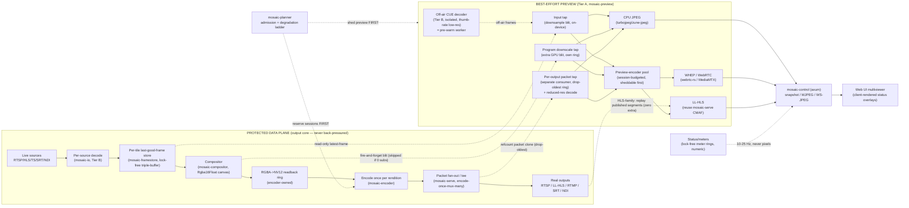

> **Design brief — Preview.** Authoritative research/design record backing the implementation. Produced by a verification-hardened multi-agent research workflow (2026-06-02). Canonical crate/API naming lives in [docs/architecture](../architecture/). ADRs derived from this brief are in [docs/decisions](../decisions/).

---

# Mosaic Preview Subsystem — Authoritative Brief

**Status:** Proposed (preview-subsystem lead merge of INPUT / PROGRAM / OUTPUT scope designs)
**Date:** 2026-06-02
**Owning crates:** `mosaic-control` (axum REST+WS surface), `mosaic-framestore` (read-only frame taps + per-tile state machine), `mosaic-compositor` (program canvas downscale tap), `mosaic-serve` (per-output packet fan-out tap + reuse of CMAF/LL-HLS segmenter), `mosaic-io`/`mosaic-input` (process-isolated cue decoders), `mosaic-encoder` (preview-encoder pool, session-budgeted), `mosaic-planner` (admission + degradation ladder), `mosaic-hal` (capability+cost registry). New leaf crate: **`mosaic-preview`**.

---

## 1. The Preview Model & The Three Scopes

Mosaic preview is a **strictly best-effort, read-only side-channel** layered onto the existing data plane. It NEVER inserts itself on the protected output path. There is exactly ONE governing rule: **preview reads frames/packets that already exist (or spins up a deliberately-throttled cue decoder for sources that have none), and is paid for ONLY while someone is watching.**

Three scopes, each with a distinct tap point on the existing pipeline:

1. **INPUT preview** — view any individual source live.
   - (a) **On-air inputs** already bound to a tile and decoded for the program: preview registers as an extra non-blocking *reader* of that tile's existing `mosaic-framestore` last-good-frame slot. **No second decode.** This is the single biggest efficiency win and the core isolation guarantee.
   - (b) **Off-air sources** not yet in the layout that must be *cued/confirmed before binding*: a lightweight, process-isolated **cue decoder** (thumbnail-rate, low-res) is spun up on demand. This cue worker IS the existing "new input pre-warmed off-air" mechanism (resilience-av §1.4 source-add), so a subsequent bind is an atomic scene-graph swap with zero connect/decode latency. One mechanism serves both "let me look at it" and "now put it on air instantly."

2. **PROGRAM preview** — the composed mosaic as produced by `mosaic-compositor`, before the encode path. A single extra GPU downscale blit appended to the compositor's existing render submission writes a small (~480p, 1/4 area) copy into a dedicated preview ring. Explicitly a **pre-encode canvas tap** — labeled as such.

3. **OUTPUT preview** — what each individual output/rendition (RTSP, LL-HLS, RTMP, SRT, NDI) actually looks like. The default is a **tap of the REAL encoded packet stream** at the existing `mosaic-serve` encode-once-mux-many fan-out point, decoded back for the operator (a confidence/return-feed monitor). This is the only way to reveal color-tag, scaling, GOP, and encode-artifact differences between renditions. Every preview surface is labeled `REAL ENCODED OUTPUT (tap: <protocol>)` or `PRE-ENCODE CANVAS APPROX` — never silently mixed.

Per-tile / per-source / per-output **health & metrics are NEVER burned into preview pixels.** They ride the existing `mosaic-control` WebSocket (the same one specified for tile FPS / tally / metering in resilience-av §4) as compact JSON/binary at 10–25 Hz and are rendered client-side as DOM/canvas overlays. This keeps status accurate even when the pixel image is frozen, and keeps the video transport pure pixels.

---

## 2. The ISOLATION Guarantee (preview never affects program output)

**Non-negotiable invariant:** a slow, stalled, malicious, or absent preview consumer can NEVER back-pressure, stall, starve, or add frame-interval jitter to the program decode / composite / encode / mux path. Isolation is **structural**, not best-effort-by-hope.

| Mechanism | How it enforces isolation |
|---|---|
| **Read-only lock-free slots** | Every tap reads from a capacity-1 latest-wins / drop-oldest slot — the SAME lock-free triple-buffer / `Arc`-swap / `watch`-channel pattern resilience-av §1.2 and efficiency §2.4 already mandate. A slow preview reader gets a *stale frame or nothing*; it never holds a ref the producer waits on. **Never a bounded queue the decoder/compositor/encoder pushes into synchronously.** |
| **Separate rings, never shared** | The program-tap preview ring is its OWN ring, distinct from the encoder's NV12 readback ring; the per-output preview ring is a *separate registered consumer* on the existing tee fan-out, depth 1–3 drop-oldest. The protected output core's buffers are untouched. |
| **Own task tier** | Preview lives in the supervised **Tier A (control-plane analog)** task tier (resilience-av §2.1), NEVER the protected Output/Clock Core. Preview can panic / OOM / stall and the invariant "one valid frame per output tick, forever" holds. |
| **Off-air cue = Tier B isolated worker** | Cue decoders run in the SAME process-isolated, SIGKILL-able Tier B input-worker model as program inputs (AVIOInterruptCB + per-protocol timeouts + outer DNS watchdog + circuit breaker + supervised backoff), but flagged low-priority. A malformed/hostile off-air URL can hang or segfault its worker without touching the program core. |
| **Conditional tap (zero cost idle)** | The program downscale blit is *skipped entirely* when subscriber count is 0; per-output taps are not registered when nobody watches. The fan-out runs exactly as in production with one consumer fewer. |
| **Admission-controlled, shed first** | All preview decode/encode is admitted against the SAME `mosaic-planner` per-engine budget (NVDEC MP/s, NVENC sessions, VRAM, cgroup CPU) at LOWEST priority. The degradation ladder sheds preview BEFORE any program lever moves (see §3). Program output encoder sessions are reserved FIRST; preview allocates only from leftover budget. |
| **GPU device-loss independence** | Preview tap surfaces + preview encoder are recreated *lazily and independently AFTER* the output core's idempotent `rebuild()` completes. Preview being down during a TDR/Xid rebuild is acceptable; output slate continuity is not. |

**CI / chaos assertion:** stall and SIGKILL preview consumers under soak and assert the program output is byte-for-byte unaffected and shows **zero added frame-interval jitter and zero zero-gap-SLO violations** (resilience-av §6 freezedetect/jitter harness). A "no preview back-pressure" test is a hard gate.

---

## 3. The EFFICIENCY Model

Cost must be **~zero when nobody is watching** and CHEAP on commodity hardware (Intel iGPU, AMD APU, entry NVIDIA dGPU, base Apple silicon, CPU-only).

- **REUSE, DON'T RE-DECODE / RE-ENCODE.** On-air input preview reads the existing `mosaic-framestore` slot (no second decode). Program preview reads the already-composited canvas (no second composite). Output preview taps the already-encoded packet stream (no second encode of the canvas). For HLS/LL-HLS outputs, output preview *replays the already-published segments* — zero extra work. A second full encode/decode/composite purely for preview is explicitly forbidden.
- **SHARED LOW-RES TAP per source/output, fan-out many.** At most ONE preview tap per source/output produces ONE small NV12 thumbnail (~320×180 input grid / ~480–720p program/output), shared by ALL viewers of that entity. N viewers cost the same as one. Downscale once, fan out to JPEG / WHEP / LL-HLS.
- **DECODE-AT-DISPLAY-RESOLUTION for cue & output taps** using the registry's per-backend decode-scale tier (efficiency §2.1): NVDEC `cuvid -resize` (free on the ASIC), VideoToolbox reduced-res / `scale_vt`, VAAPI/QSV SFC/VPP. Budget by decoded MP/s, not stream count. Request a lower source substream / smaller ABR variant where the protocol offers one.
- **THUMBNAIL-RATE + FRAME-SKIP.** Cue decoders and output thumbnails run at 1–5 fps with `skip_frame=nokey` (I-frames only). A 2 s-GOP rendition then yields ~0.5 fps of decode work — exactly enough for a thumbnail. Only a FOCUSED source is briefly promoted to higher frame rate.
- **NV12-THROUGHOUT.** Preview stays in NV12 (1.5 B/px); never materialize RGBA (the 2.67× tax, multiplied across many tiles). Convert to sRGB/BT.709 for the browser at the small thumb size, in-shader.
- **STAY ON-DEVICE.** The downsample blit happens on the same GPU device/context as the decode/composite; only the final small thumbnail (JPEG bytes / encoded NALs) crosses to host/network. No full-res host round-trips for preview.
- **ON-DEMAND ACTIVATION + AUTO-STOP.** Subscriber refcounts per `(entity, mode={grid|focus|llhls})`. First subscriber starts the tap / cue decoder / encoder; last unsubscribe (after a short linger, 5–15 s, to avoid thrash on grid scroll) tears it all down. Auto-stop is enforced on BOTH explicit close and ICE/RTCP/socket-drop timeout, plus an idle watchdog that force-stops if no read occurs for N seconds.
- **VIEWPORT-DRIVEN GRID.** Only thumbnails actually visible in the operator's viewport are subscribed. A 200-source list never costs 200 live previews — only what is on screen.
- **CAP CONCURRENCY.** Hard caps on concurrent focus (WHEP) sessions, concurrent off-air cue decoders, and total concurrent output focus streams server-wide; requests beyond the cap queue or downgrade the least-recent to JPEG/snapshot. Bounds worst-case preview load deterministically.
- **MULTIPLEX JPEG OVER ONE WS** for the program/multiviewer grid to sidestep the browser ~6-connections-per-host cap (raw per-stream MJPEG is unsuitable for a many-tile web grid). Single-source MJPEG-over-HTTP remains available for the input grid and ``-simple clients.
- **STATUS IS NUMERIC-ONLY**, over one multiplexed WS at 10–25 Hz, rendered client-side — near-zero bandwidth, zero GPU, tapped read-only from the lock-free meter rings the audio brief already mandates.

---

## 4. Transport-Selection Table (scope × transport × latency × cost)

| Scope | Mode | Transport | Latency | Cost |
|---|---|---|---|---|
| **Input** | Grid / multiviewer | MJPEG-over-HTTP (`multipart/x-mixed-replace`) or single-shot JPEG GET, 1–5 fps, ~320×180 | 0.2–1 s refresh | Very low — 1 HW downsample + small JPEG/frame; ~25–75 KB/s per tile @5fps; encode-once-serve-many |
| **Input** | Focus (expand 1 source) | **WebRTC / WHEP** | sub-250 ms | Moderate, on-demand — 1 low-latency H.264 preview encode session (budgeted, sheddable first); 1 per operator |
| **Input** | Focus fallback (UDP/STUN blocked) | LL-HLS (reuse `mosaic-serve` CMAF) | ~2–5 s | Low-moderate — same 1 preview encode session, packetized to CMAF |
| **Program** | Grid / at-a-glance (DEFAULT) | Multiplexed binary JPEG over ONE WebSocket, 1–5 fps | 0.5–2 s | Very low — 1 CPU JPEG (turbojpeg/zune-jpeg) of the downscaled tap; NO GPU encode session |
| **Program** | Focus (verify motion/latency/A-V) | **WebRTC / WHEP** | 200–800 ms | Moderate — 1 low-res HW preview encode session (after program's reserved sessions); auto-stop on last-leave |
| **Program** | At-scale / many distributed viewers | LL-HLS (reuse `mosaic-serve` CMAF) | ~2–5 s | One shared encode session, encode-once-segment-many; per-viewer ≈ static file serving |
| **Output** | Grid thumbnail (DEFAULT) | Periodic JPEG snapshot (poll/push, ETag), 1–5 s, of REAL decoded rendition | 1–5 s refresh | Lowest — viewport-driven; 1 decode tick (`skip_frame=nokey`) + downscale + 1 JPEG per interval |
| **Output** | Focus (single rendition) | **WebRTC / WHEP** (in-process webrtc-rs or MediaMTX sidecar) | 150–500 ms | Highest per-stream — tap decode (reduced-res) + small re-encode + peer conn; 1 focus at a time, shared across viewers of that output |
| **Output** | Motion view w/o WebRTC | MJPEG-over-HTTP | 0.3–1.5 s | Medium — 1 JPEG per delivered frame from the tapped+downscaled decode |
| **Output** | Consumer-experience (HLS-family) / WebRTC-blocked fallback | **Play the output's OWN published LL-HLS/HLS playlist** (hls.js / native) | LL-HLS ~2–5 s; HLS 6–30 s | **~Zero additional** — segments already exist for real consumers; byte-for-byte what a real client gets (ABR, colr, VIDEO-RANGE) |
| **All scopes** | Health / metrics / metadata | Control-plane WebSocket (SSE fallback), 10–25 Hz, JSON/binary, never pixels | Real-time | Negligible — numeric/enum only |

**Selection logic:** cheap JPEG/snapshot is the *default* for any grid/at-a-glance view; WHEP is reserved for ONE focused entity at a time and is strictly on-demand; LL-HLS is the WebRTC fallback (and, for HLS-family outputs, the true-consumer-experience view at zero extra cost). On base Apple silicon (1 encode engine) prefer JPEG (CPU/Media JPEG, no video-encode session) and restrict/queue WHEP.

---

## 5. API Endpoints (all served by `mosaic-control` / axum)

All preview + cue endpoints are **authenticated/authorized**; cue source schemes are allowlisted/validated (SSRF/DoS guard) and rate-limited.

### INPUT scope
| Method | Endpoint | Purpose |
|---|---|---|
| GET | `/api/inputs` | List on-air + off-air sources with health, codec/res/fps, state-machine state, jitter/reconnect/circuit-breaker, preview subscriber counts, cue/pre-warm readiness |
| GET | `/api/inputs/{id}/preview/snapshot.jpg` | Single current low-res JPEG (on-air: framestore slot; off-air: cue decoder). Cheapest; lazy grid cells, polling, alert thumbs. Returns last-good or NO-SIGNAL/STALE placeholder |
| GET | `/api/inputs/{id}/preview/mjpeg` | MJPEG stream of low-res thumbnails at `?fps=` (clamped, default 2–5). Primary input-grid transport; holding the conn = a refcounted subscriber |
| POST | `/api/inputs/{id}/preview/whep` | WHEP focus: SDP offer in, SDP answer out, SRTP media. Starts/attaches preview encode session; promotes off-air cue decoder to higher fps. `503` if focus cap hit |
| DELETE | `/api/inputs/{id}/preview/whep/{session}` | WHEP teardown (+ standard WHEP resource URL); frees encoder immediately |
| GET | `/api/inputs/{id}/preview/llhls/index.m3u8` | LL-HLS focus fallback (CMAF parts under same prefix); reuses `mosaic-serve` segmenter; auto-stop on unpolled |
| POST | `/api/inputs/cue` | Cue/pre-warm an off-air source (body: kind/url/transport). Spins up isolated cue decoder + capability probe; returns a source id usable with all preview endpoints. This warmed worker makes a later bind instant |
| DELETE | `/api/inputs/cue/{id}` | Drop a cued source (SIGKILL its worker). Also automatic after last-unsubscribe + linger, unless bound |
| POST | `/api/inputs/{id}/bind` | Take a cued/previewed off-air source to air (Preview→Program). Atomic scene-graph swap at a frame boundary (Cut/Crossfade) — reuses seamless live-reconfig (Class 1) |
| GET | `/api/inputs/preview/capabilities` | Which transports this build/deployment offers (WHEP only if WebRTC/TURN configured; LL-HLS/JPEG always) + current budgets/caps |

### PROGRAM scope
| Method | Endpoint | Purpose |
|---|---|---|
| GET | `/api/v1/preview/program` | Descriptor: available transports, canvas geometry + color tags (e.g. "SDR BT.709 limited"), default downscale res, subscriber count, HW preview-encoder availability |
| GET | `/api/v1/preview/program/snapshot.jpg` | Single JPEG of the downscaled canvas; `<video>` poster / static cards |
| GET | `/api/v1/preview/program/stream.ws` | WebSocket upgrade for multiplexed low-rate JPEG (program + input thumbnails). `subscribe {scope, fps, max_dim}` refcounts the GPU tap + CPU JPEG loop |
| POST | `/api/v1/preview/program/whep` | WHEP focus: SDP offer in, SDP answer out (201 + Location). Allocates low-res preview encode if HW budget allows; else `409/503` with `fallback: ws-jpeg` hint |
| DELETE | `/api/v1/preview/program/whep/{session_id}` | WHEP teardown (draft-ietf-wish-whep); also auto-invoked on ICE/RTCP timeout |
| GET | `/api/v1/preview/program/hls/*` | Optional LL-HLS at-scale rendition (master/media playlists, CMAF init/parts), shared encoder; present only when enabled |
| PATCH | `/api/v1/preview/program/config` | Operator controls: default transport, downscale res, JPEG fps/quality caps, WHEP bitrate cap, overlay burn-in (headless), allow-HW-session toggle — bounded so preview can never outrank program |

### OUTPUT scope
| Method | Endpoint | Purpose |
|---|---|---|
| GET | `/api/outputs` | List outputs with pinned params, health (state/fps/bitrate/consumer count), **resolved color tuple** (primaries/trc/matrix/range, HDR transfer, bit-depth), **ffprobe verification result** (pass/fail + mismatched field), available preview transports |
| GET | `/api/outputs/{id}` | Full detail: pinned `OutputSession`, capability-matrix entry, resolved+verified color from actual bitstream VUI/SEI + (fMP4) `colr` atom, encoder backend, hot-standby/recycle state, measured GOP cadence, consumer list |
| GET | `/api/outputs/{id}/preview/snapshot.jpg` | On-demand single low-res JPEG of the REAL decoded rendition (ETag/short max-age). Default grid thumbnail. `?w/h` (capped), `?src=real|approx` |
| GET | `/api/outputs/{id}/preview/mjpeg` | MJPEG of the decoded real rendition (capped fps/res); lazy tap, auto-stop on conn close |
| POST | `/api/outputs/{id}/preview/whep` | WHEP focus for one output (in-process or republish to MediaMTX). One-focus-per-session; counts against session budget; `503` w/ reason under load |
| DELETE | `/api/outputs/{id}/preview/session` | Tear down active preview (WHEP/MJPEG); release tap/decode/encode session immediately |
| GET | `/api/outputs/{id}/preview/source` | Reports REAL tap vs PRE-ENCODE APPROX + reason (e.g. NDI host-only, no session) + tap point. Drives the mandatory on-video fidelity label |
| POST | `/api/outputs/{id}/verify` | Force an immediate post-encode ffprobe verification pass (color_space/primaries/transfer/range/pix_fmt from VUI/SEI + colr); returns resolved tuple + pass/fail vs policy ("check now" button) |
| GET | `/api/outputs/{id}/hls-preview` | For HLS/LL-HLS outputs: the output's own published playlist URL (+ CODECS/VIDEO-RANGE) for zero-extra-cost true-consumer playback; redirect to whep for non-HLS |

### Status (existing, shared)
| Method | Endpoint | Purpose |
|---|---|---|
| WS | `/api/ws` (and `/api/v1/status/stream.ws`; SSE at `/api/v1/status/stream.sse`) | Existing multiplexed control-plane WS carries all preview status as additional message types at 10–25 Hz: per-source/tile/output state (LIVE/STALE/RECONNECTING/NO-SIGNAL/ENCODER-RECYCLING), fps/bitrate/GOP, jitter/reconnect/backoff/circuit-breaker, audio meters (peak/RMS/M/S/I/LRA/dBTP + clip), queue depth, drop counts, resolved color tuple, verification pass/fail, preview-active + preview-source(real|approx), subscriber counts, cue readiness, GPU device-loss/rebuild + encoder-recycle events, degradation/"preview suspended due to load" events. No new socket |

---

## 6. Multiviewer / Monitoring UX, Cue-Before-Bind Flow, Per-Output Verification View

**Multiviewer (input)** — a broadcast-style wall of small live thumbnails for all sources, on-air (bound) AND off-air (available to cue). Each cell: image + CLIENT-rendered overlay (from status WS): source name, state badge (LIVE green / STALE amber / FROZEN / NO-SIGNAL red), codec·res·fps, tally/on-air indicator if bound. Status is always accurate even if the image is frozen — the client can render its own NO SIGNAL / STALE / CONNECTING card the instant state changes, never trusting a frozen frame as live.

**Clear on-air vs off-air distinction** — bound sources carry a red tally border (program tally model); unbound sources are badged off-air/available with a **CUE** affordance.

**Cue-before-bind flow** — (1) operator pastes a URL into "cue new source" or clicks CUE on an off-air source → `POST /api/inputs/cue` warms it (connect + thumbnail decode + capability probe); (2) its live thumbnail appears in the grid for confirmation; (3) operator click-to-focuses for a close WHEP look (lipsync/motion/quality); (4) `POST /api/inputs/{id}/bind` takes it to air — **instant**, because the cue worker already holds connection/jitter-buffer/decoder/probe, so binding is an atomic scene-graph swap (Class 1 seamless reconfig). This realizes Preview→Program cue-then-take for inputs.

**Click-to-focus (all scopes)** — clicking a cell upgrades that single entity from cheap JPEG to low-latency WHEP; closing reverts to JPEG and frees the encoder. Only the focused entity pays the WebRTC cost; opening a second focus demotes the first.

**Program panel** — a large PROGRAM view (cheap WS-JPEG default) with a single "Focus / Live" toggle to WHEP; client-side overlay on top: per-tile health borders, per-tile fps + audio PPM meters, program-bus LUFS/dBTP strip. A persistent label: "PROGRAM PREVIEW — downscaled canvas tap (pre-encode), SDR BT.709 limited" — explicit that this is NOT the encoded output. Subscriber/cost shown ("Live preview active (1 focused viewer)" vs "Idle — preview off (0 cost)").

**Per-output verification view** — the output multiviewer grid shows one REAL-rendition thumbnail per output with identity, codec·res·fps·bitrate, a color chip ("BT.709 limited 8-bit" / "PQ BT.2020 10-bit HDR"), and a health dot. **Fidelity label is non-negotiable**: every surface carries `REAL ENCODED OUTPUT (tap: <protocol>)` or `PRE-ENCODE CANVAS APPROX` (approx only when a real tap is genuinely impossible, e.g. NDI host-only or no encode session, with a tooltip). The **output editor verification panel** shows CONFIGURED vs DELIVERED side-by-side with per-field match/mismatch icons across the four color axes (primaries / transfer / matrix / range) + HDR signaling (transfer=PQ/HLG + BT.2020 + 10-bit), turning the classic silent range/matrix bug into a loud, actionable callout, with a live real-rendition preview beside it. For HLS-family outputs a **consumer-experience toggle** switches between the fast WHEP tap and "play the actual published playlist" (byte-for-byte consumer view incl. ABR + player colr handling) at zero extra encode cost.

**Graceful degradation indicators** — when the engine sheds preview (focus→JPEG, grid fps reduced, cue decoders dropped) the UI shows it honestly ("preview reduced — system busy", lowered-fps badge, "Sub-second view unavailable (program has encoder priority) — showing snapshot at N fps") rather than silently freezing. Preview health is decoupled from program health: a stalled preview shows a "preview stalled" chip on the preview panel only and NEVER implies the program output is impaired (a separate always-on output-validity/SLO indicator is the source of truth for "is the program actually going out").

---

## 7. Mermaid — Preview Taps Relative to the Main Pipeline

**Tap legend:** dotted edges into the Preview subgraph are all **read-only / fire-and-forget / drop-oldest** — none can stall the solid (protected) edges.

---

## 8. Integration with the Management Capability Matrix

Preview is a first-class citizen of the existing `mosaic-hal` **capability+cost registry** and `mosaic-planner` loop — it does not invent a parallel resource model:

- **Capability advertisement.** `GET /api/inputs/preview/capabilities`, `GET /api/v1/preview/program`, and the per-output `available preview transports` field are computed from the registry + build features, mirroring the existing capability-aware validator pattern. WHEP appears only if the WebRTC feature + TURN are configured; LL-HLS/JPEG are always available; the UI greys out unavailable modes. This is the same "report what this build/host can do" discipline used for codecs/backends.
- **Shared budgets.** Preview decode is budgeted in decoded MP/s against the same per-NVDEC/media-engine ceiling as ingest; preview encode sessions count against the same per-system NVENC cap (probed at runtime via `nvmlDeviceGetEncoderSessions` — never hard-coded; 12/system Nov-2025, GTX 1630 = 3) / VideoToolbox engine count (base Apple = 1 encode). **Real-output sessions are reserved FIRST**; the planner returns `503 "preview unavailable under load"` rather than displacing a real output.
- **First on the degradation ladder.** The existing cheapest-impact-first ladder (efficiency §3.3) is extended with preview as the topmost (cheapest-to-shed) rung: shed focus WHEP → grid fps → grid resolution → off-air cue decoders → suspend preview entirely — ALL before any program tile/output lever moves. Every preview adaptation is logged like any other (operator trust).
- **Color/verification reuse.** Output preview reads the resolved color tuple and the post-encode ffprobe verification result from the **same gate the color runbook already mandates** (bitstream VUI/SEI + fMP4 `colr`), honoring the `frame > codec ctx > container > policy` precedence. Verification re-runs after every encode (re)init / remux / parallel-output cutover; a stale verification renders amber, not green.
- **Live-reconfig awareness.** The UI surfaces Class 1 (seamless, e.g. cue→bind) vs Class 2 (parallel-output migration, e.g. editing a pinned resolution/codec/pixfmt/GOP) distinctions; during a Class 2 cutover the verification view previews BOTH the existing and the candidate output so the operator confirms the new rendition before migrating consumers — never an in-place mutation of a live output.
- **Sidecar reuse.** The optional MediaMTX sidecar already accepted for RTSP/multi-protocol output fan-out doubles as the preferred WHEP terminator for v1 (offloads ICE/DTLS/SRTP), with in-process webrtc-rs/str0m as the lean-binary alternative; LL-HLS preview reuses the custom `mosaic-serve` CMAF segmenter + blocking-reload HTTP server with no new segmenter.