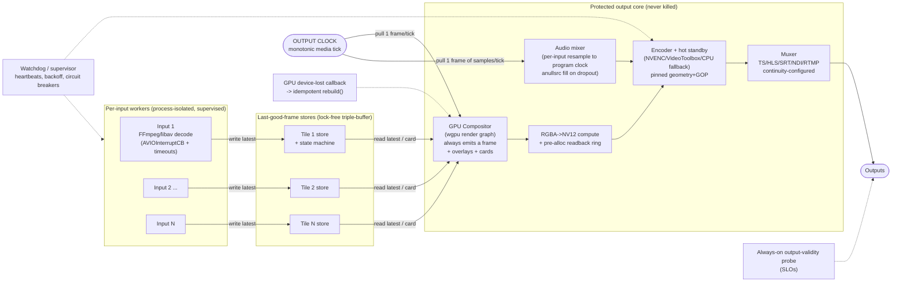

> **Design brief — Resilience & A/V.** Authoritative research/design record backing the implementation. Produced by a verification-hardened multi-agent research workflow (2026-06-02). Canonical crate/API naming lives in [docs/architecture](../architecture/). ADRs derived from this brief are in [docs/decisions](../decisions/).

---

# Architecture Brief: Bulletproof Output, Resilience, and Audio/Visual Features

**Scope:** This brief is the authoritative source for the four hard requirements added by the user — (A) bulletproof continuous output, (B) discrete per-input audio, (C) overlays/subtitles, and (D) full web/API management — for the Rust live GPU video multiview. It honours all verification corrections. Where a research claim was refuted or narrowed by verification, the corrected statement is used and called out explicitly.

---

## 1. The Bulletproof Output Guarantee

### 1.1 The invariant

> **At every tick of the output clock, the output stage emits exactly one valid, correctly-timestamped frame (and the matching number of audio samples per track), forever, regardless of the state of any input, the compositor, or the GPU.**

This is a *liveness + validity* invariant, not a best-effort target. It decomposes into measurable sub-invariants:

- **Continuity:** output PTS/DTS are a pure monotonic function of the tick counter — no gaps, no backward jumps.
- **Validity:** the muxed stream is perpetually decodable (TS continuity counters/PCR continuous; HLS segments continuous; no spurious discontinuity markers).
- **Independence:** the output cadence is *never* derived from any input clock. (Verification confirmed: a pipeline whose output is gated on input frame arrival WILL stall on input loss — reproduced across FFmpeg, GStreamer, VLC, MEncoder.)
- **Format honesty:** any change that a container/codec cannot absorb is implemented as a *new parallel output + consumer migration*, not an in-place mutation (verification confirmed for resolution/codec/pixel-format/bit-depth/chroma).

### 1.2 The control inversion that enforces it

Control flow is **inverted**: inputs only ever *write into buffers*; a fixed-rate **output clock pulls** frames from the compositor, which pulls the latest frame from each tile's last-good-frame store. This is the NDI frame-synchronizer model (push→pull, hold-last-frame) and the GStreamer `GstAggregator` force-live / `livesync` model (deadline-based aggregation, repeat last frame on miss). PTS becomes `f(tick_count)` — monotonic and gap-free by construction.

Key structural rules:

1. **Output clock = locally-generated monotonic media clock** (frame/sample counter), only *loosely* disciplined to wall-clock. Never `-copyts`; never timestamp from an input.
2. **Per-tile last-good-frame store** = lock-free triple-buffer / `Arc`-swap (SPSC). Decoder writes freely; compositor always reads the latest complete frame; stale updates dropped; neither side blocks.
3. **Compositor always emits.** Every tick it renders into the fixed canvas, substituting a per-tile placeholder card when a tile is stale/down. The disturbance from any one input is contained to that tile's rectangle.
4. **Encoder is never starved.** A pre-allocated ring of GPU→CPU readback buffers (RGBA→NV12 via compute shader — note: wgpu cannot render directly to NV12) guarantees the encoder always has a frame.
5. **Muxer configured for continuity** (mpegts `+resend_headers/+pat_pmt_at_frames`; HLS `force_key_frames` at segment boundaries, `independent_segments`). No discontinuity is ever emitted under normal operation.

### 1.3 Per-tile state machine (the failure ladder)

Modeled on AWS Elemental MediaLive's "a running channel must ALWAYS be encoding content" rule and its repeat-frame → black → slate ladder, per-tile and configurable:

```
LIVE ──(no fresh frame for hold_ms)──▶ STALE (hold last good frame)
STALE ──(no recovery for stale_ms)──▶ RECONNECTING (reconnect card + spinner overlay)
RECONNECTING ──(no recovery for nosignal_ms)──▶ NO-SIGNAL (SIGNAL LOST slate card)
any state ──(fresh frame arrives)──▶ LIVE
```

The whole-output stage has the analogous ladder for total blackout: if *all* tiles are down (or the GPU is lost), the output still emits a full-canvas slate + a live ticking clock overlay + silence/last-good audio. The "SIGNAL LOST" and slate assets are **atlas-resident at startup** so they can be drawn at the exact instant of failure without any GPU upload.

### 1.4 Failure-mode handling (each keeps output continuous)

| Failure | Handling | Output impact |
|---|---|---|
| **Input loss / reconnect** | libav AVIOInterruptCB + per-protocol timeouts (`rw_timeout`, tcp/rtsp `timeout`) make a stalled read return; supervisor reconnects with backoff. Tile rides the LIVE→STALE→…→NO-SIGNAL ladder. | None — other tiles unaffected; failed tile shows card. |
| **Mid-stream resolution/codec/fps/aspect change** | Absorbed *inside the tile*: decoder re-inits (or parallel hot-swap) behind the frame store while compositor keeps reading last-good and scaling to the fixed tile rect. Never reaches output geometry. | None. |
| **Source add / remove** | New input pre-warmed off-air (connect + decode + jitter-buffer fill) before binding to a tile; removal drained (block-probe + EOS) on a non-render thread. Atomic scene-graph swap binds at a frame boundary. | None. |
| **Live layout change** | Atomic double-buffered scene-graph pointer swap at a frame boundary (cut) or per-frame alpha interpolation (crossfade). Output geometry/GOP/codec **pinned** — only the composited picture changes. | None. |
| **GPU device loss / TDR** | Treated as first-class recoverable: one idempotent `rebuild()` re-creates all wgpu/Metal resources on the device-lost callback. Output stage (decoupled, own clock) keeps emitting slate during rebuild. NVENC/CUDA device loss (Xid 79 "fell off the bus") needs a GPU reset/reboot to recover, so a CPU/software encoder fallback or hot-standby path carries output across the gap. | Slate during rebuild; **no gap**. |
| **Encoder hiccup / forced re-init** | Hot-standby encoder with identical pinned config, SMPTE-2022-7-style packet/GOP-level merge; force IDR + repeat SPS/PPS at the splice. The one truly disruptive event (GOP/canvas change) is hidden behind make-before-break. | Continuous; correctly-signalled discontinuity only if format demands it. |
| **Output consumer connect/disconnect** | Periodic SPS/PPS + IDR (NVENC `forceIDR` / infinite-GOP) and PAT/PMT resend let late joiners decode immediately; consumer churn never touches the pipeline. | None. |

### 1.5 Resilience dataflow (Mermaid)



---

## 2. Supervision & Fault Isolation

### 2.1 Three-tier isolation model

`catch_unwind` is **necessary but not sufficient** (verification confirmed): it catches only unwinding Rust panics, is a no-op under `panic=abort`, and cannot catch C/CUDA/NDI segfaults, aborts, foreign exceptions, or *hangs*. There is no safe way to force-kill a thread wedged in FFI without risking shared-state corruption; only an OS process can be SIGKILLed cleanly. Therefore:

| Tier | Fault domain | Isolation | Rationale |
|---|---|---|---|
| **A — Control/compositor logic** | Pure Rust (layout engine, control plane, scene graph) | Supervised tokio tasks/threads + `catch_unwind` at boundaries | Cheap; shares GPU context; only panics need containment. |
| **B — Per-input FFI ingest** | FFmpeg/NDI/SRT decode | OS-process-isolated worker (Linux); in-process re-initable on macOS | FFI hangs/segfaults must be SIGKILL-able; libav interrupt callbacks handle the *common* network stalls in-process without a kill. |
| **C — NVENC/CUDA encoder** | Hardware encode | OS-process-isolated worker; proactive recycling | Documented multi-day host/kernel leaks and `INVALID_DEVICE` degradation cleared only by process restart. |
| **Core — Output/clock** | Clock, mux, slate generator | Most-protected, never restarted; decoupled by bounded drop-newest queues | The invariant lives here. |

**Cross-process transport:** shared-memory ring buffers (`shmem-ipc`/`ipmpsc` on Linux). For GPU frames, prefer keeping them on-GPU (CUDA IPC / DMA-BUF) where the worker is the encoder; otherwise pre-allocated CPU staging rings.

**Platform split:** macOS/Apple-Silicon (VideoToolbox/Metal) FFI is more stable, so inputs/encoder may run as in-process threads with aggressive watchdog + re-init; Linux/NVENC uses process isolation. This doubles the test surface (an accepted cost).

### 2.2 Supervision tree

- **Crate:** `ractor-supervisor` (OTP-style: OneForOne for independent inputs, RestForOne where downstream depends on upstream) or `task-supervisor` (heartbeat-first). Both are 0.1.x — pin and be ready to vendor.
- **Restart intensity:** per-level `max_restarts/max_window` (meltdown limits). Do **not** set equal intensities at every level (they multiply: 10×10 = 100 leaf restarts). Period 5–10 min, not hours.
- **Backoff:** `backon` (the `backoff` crate is unmaintained — RUSTSEC-2025-0012) with exponential + jitter to avoid thundering-herd reconnects.
- **Circuit breaker:** `failsafe` (Closed/Open/Half-Open) per input connect and per output publish — stop hammering a dead endpoint, gate half-open recovery probes.
- **Watchdog:** every worker writes an `AtomicU64` monotonic heartbeat each loop; a watchdog declares a missed deadline dead and triggers restart/kill. Cooperative cancellation (`tokio-util` `CancellationToken` + `TaskTracker`) for clean flush/free, **paired with a hard timeout + process kill** (a worker wedged in FFI never observes the token).

### 2.3 Memory & GPU stability

- No-panic hot path (clippy `deny(unwrap_used, panic)`, `thiserror`).
- RAII Drop wrappers for every FFI handle; **refcounted AVFrames + `av_frame_ref` before crossing any queue/thread boundary** (non-refcounted frames are silently reused on the next decode → corruption).
- Bounded buffer pools (`thingbuf` by-ref slots) to bound memory and cut allocator churn.
- GPU device loss → single idempotent `rebuild()` (testable via `device.destroy()`).
- Proactive encoder-process recycling on schedule/threshold, overlapped (hot standby) so the recycle is invisible to output.

### 2.4 Recovery matrix

| Detected by | Fault | Recovery action |
|---|---|---|
| libav interrupt callback / EAGAIN | network stall, input down | in-thread unwind → supervised reconnect (backoff) |
| Heartbeat miss | hung worker (FFI deadlock, CPU spin) | watchdog → SIGKILL process → respawn |
| Process exit code / signal | segfault/abort in FFI worker | supervisor respawn; circuit-break if flapping |
| `panic` payload | Rust logic panic (Tier A) | `catch_unwind` → task restart |
| Device-lost callback | GPU TDR/driver reset | `rebuild()` all resources; slate during rebuild |
| NVENC `INVALID_DEVICE` / leak threshold | encoder degradation | recycle encoder process behind hot standby |

---

## 3. Hot Reconfiguration: Seamless vs. Controlled Reset

### 3.1 Class 1 — Truly seamless (no output reset)

Applied via **atomic double-buffered scene-graph swap at a frame boundary** (lock-free pointer swap), exposed as a Preview→Program (cue-then-take) model with **Cut** (immediate swap) and **Crossfade** (per-frame alpha interpolation):

- Tile geometry/position/z-order/alpha changes
- Swapping which source feeds a tile
- Whole-layout/template switch
- Adding/removing tiles and inputs (new input pre-warmed off-air; removal drained off-thread)
- Per-tile overlays, labels, clocks, logos, meters, alert cards, subtitle burn-in
- **NVENC live changes that ARE seamless:** bitrate, rate-control mode, and framerate via `NvEncReconfigureEncoder`; and — corrected per verification — **keyframe cadence** is fully controllable live by initializing with infinite GOP (`NVENC_INFINITE_GOPLENGTH`, B-frames disabled) and driving IDRs per-frame with `forceIDR`. No restart needed for GOP cadence.

### 3.2 Class 2 — Requires controlled reset / parallel-output migration

These force new SPS/PPS + IDR and a downstream-visible discontinuity (HLS `EXT-X-DISCONTINUITY` → rebuffer; RTMP/many players break). **Implement as: spin up a new parallel output instance with the new pinned config and migrate consumers; leave the original running until cutover.** Never an in-place mutation.

- Output **resolution** beyond pre-allocated `maxEncodeWidth/Height` (within the max, NVENC supports it but still injects an IDR/discontinuity; VideoToolbox cannot change resolution live at all — must invalidate and recreate the session).
- Output **codec / pixel-format / bit-depth / chroma**.
- **GOP structure** via `NvEncReconfigureEncoder` (idrPeriod/gopLength/frameIntervalP) and sync/async mode — not reconfigurable; need make-before-break dual session.
- Audio **track layout** changes (count/identity of tracks) and subtitle **track-set** changes.

### 3.3 The pinning rule (load-bearing)

**Pin output geometry, codec, GOP structure, pixel format, framerate, and audio/subtitle track layout for the life of an output session.** Set `maxEncodeWidth/Height` to the largest canvas you will ever emit at session creation. Live edits change only the composited picture and audio mix. This is what makes "never falters" provable: no discontinuity is ever needed under normal operation.

---

## 4. Audio Architecture

### 4.1 Routing model

Per input: `decode → aresample (libswresample) to 48 kHz / common layout, async=1 + first_pts → anullsrc silence-fill on dropout → fan out to (a) clean discrete per-input track and (b) the program bus`. All PTS-locked to the **program clock** (same monotonic source as video). On total input loss the fill source still emits the correct *number* of (silent/last-good) tracks so discrete tracks never vanish from the mux.

- **Discrete tracks:** passed through clean (no gain/normalization).
- **Program bus:** `amix` (normalize/weights) → `loudnorm` EBU R128 **single-pass/dynamic** mode (live), target e.g. -23 LUFS broadcast / -16 LUFS web, TP -1.5 dBTP. Live tolerance ±1 LU (vs ±0.2 LU for files); the -70 LUFS gate correctly excludes silence from a lost input.
- **Routing data model (API/UI):** `{input_id, source_channel_selection, target_track_index/PID/rendition, language, title, include_in_program_bus, gain, mute}`, validated against the selected output's capability matrix at config time.

### 4.2 Output discrete-audio capability matrix (verified)

| Output | Discrete tracks? | Mechanism / limit | Notes |
|---|---|---|---|
| **MPEG-TS** | **Yes, N (best general carrier)** | One audio elementary stream per PID in one program; `-streamid` (base-10!), per-track `language`/`title` metadata | No practical FFmpeg cap. Primary multitrack target. |
| **SRT** | **Yes, N** | Carries MPEG-TS → inherits N PIDs | **Receiver-dependent**: many decoders select only the first PID. |
| **RIST** | Yes, N | Carries MPEG-TS | Same receiver caveat. |
| **RTSP/SDP** | **Yes, N (simultaneous)** | Multiple `m=audio` lines, each its own RTP subsession | Client must `SETUP` each subsession. |
| **HLS / LL-HLS** | **Yes, N — but SELECT-one-of-N** | `EXT-X-MEDIA TYPE=AUDIO` renditions by GROUP-ID | Player plays one at a time → UI = track *selector*, not simultaneous monitoring. |
| **DASH** | Yes, N — select-one | Audio AdaptationSets | Same as HLS. |
| **NDI** | **No discrete tracks — channels only** | ONE audio stream/source, up to 255 ch (Opus) / unlimited (PCM); **AAC capped at 2 ch** | Per-input audio = channel-map (input k → ch 2k,2k+1) **or** emit N NDI senders. Layout is **planar (FLTP)**, not interleaved. (Verification refuted "interleaved/N tracks".) |
| **RTMP / FLV** | **Tiered (corrected)** | Legacy: **1 track only**. Enhanced-RTMP v2 + FFmpeg `flvenc` (merged late 2024): **N tracks via `audioTrackId`/`audioTrackIdInfoMap`** | **Real constraint is endpoint capability**, not the format. Twitch ≤2 tracks (enhanced trackId must be non-zero); YouTube ignores multitrack; IVS multitrack = video. **Negotiate per endpoint; degrade explicitly to the mixed bus; never silently drop tracks.** |
| **MP4 / MKV** | Yes, N — select-one | Multiple tracks; "secondary audio program" model | The "mark all default" trick is non-standard; for VOD/archive only. |

**High-risk corrections honoured:** NDI cannot carry N selectable tracks (channel-map or multi-sender only). RTMP is *conditionally* capable via E-RTMP — do **not** hardcode "RTMP = single track impossible"; gate the multitrack-audio path on detected endpoint capability and surface degradation in the UI.

### 4.3 Sync, drift, missing audio

- Each input's clock reconciled to the program clock via `aresample async=1` (disabled by default — must enable) + `first_pts`; long-term drift absorbed by adaptive resampling.
- Missing/dropped audio → `anullsrc` silence, PTS-locked, so the track never gaps (load-bearing for invariant A).
- Discrete tracks should be **decode→re-encode normalized** (not passthrough) because passthrough breaks when an input changes codec mid-stream.

---

## 5. Audio Metering

- **Engine:** pure-Rust `ebur128` crate (sdroege), one `EbuR128` per input and per output track. M/S/I LUFS, LRA, sample-peak, true-peak (dBTP). BS.1770-4/-5 + Tech 3341/3342 compliant.
- **Two cadences:**
  - *Fast (video frame rate):* sample-peak + ~50 ms RMS for burned-in per-tile PPM-style meters (fast attack, slow decay, peak-hold — done client/renderer side).
  - *Slow (10 Hz):* M/S/I/LRA/dBTP telemetry for UI and program-bus compliance.
- **Read-only & non-blocking (load-bearing, verified):** metering must never run on the media/compositor/encoder thread or apply backpressure. Tap audio via a bounded lock-free SPSC ring (drop-oldest) per track; run DSP on a separate thread. **True-peak (4× oversampling FIR) is the expensive metric** and is ~2.5–3× costlier than sample-peak — far worse on ARM/Apple-Silicon — so **cap true-peak to tracks that actually display dBTP**. Enable FTZ/DAZ (flush denormals) on meter threads.
- **Mid-stream SR/channel change (CORRECTED — verification refuted the original claim):** `ebur128::change_parameters(channels, rate)` re-inits filters/resampler/peak state but **preserves** the I/LRA integration history — it does **NOT** restart it. If you want a clean per-tile loudness restart you must explicitly call `reset()` (or construct a new instance). Design contract:
  - *Want continuity across a transient input reconfig* → `change_parameters` (I/LRA continue; note retained gating-block energies were computed under the old SR/layout — a subtle averaging hazard).
  - *Want a fresh window (e.g. source treated as new)* → `reset()`.
  - Handle `change_parameters` returns: `NoMem` for channels==0/out-of-range rate, `Ok(())` no-op if unchanged.
  - Either way metering is per-input and read-only → **does not affect the output clock**.
- **Wire to browser:** single multiplexed WebSocket, 10–25 Hz, compact binary (peak, RMS, M, S, I, LRA, dBTP, clip/overflow flags per tile/track). Numeric only, never audio. Ballistics/decay/peak-hold applied once, in the client.
- **Normalization is metering-independent:** `loudnorm` only on the program bus; discrete tracks stay unaltered (preserves the requirement-B authenticity guarantee).

---

## 6. Subtitles

### 6.1 Ingest

- **CEA-608/708:** NOT a mappable stream — they ride as `AVFrame` side data `AV_FRAME_DATA_A53_CC` (and video SEI). Read via decoded-frame side data, the lavfi `movie=...[out+subcc]` trick, or CCExtractor (robust, also teletext/DVB; 708 weak in some paths).
- **DVB-sub (bitmap):** decode per PID; passthrough bit-exact when format matches.
- **DVB teletext:** libzvbi; one PID multiplexes multiple pages (handle page selection, not just PID).
- **WebVTT / SRT / ASS / mov_text:** native libav decoders.

### 6.2 Burn-in (render)

Normalize everything to ASS internally and rasterize with **libass** (CPU-only — no GPU renderer) into sparse alpha-coverage bitmaps. **Run subtitle decode + libass off the hot path** in dedicated threads with a lock-free "latest rendered overlay" handoff; the compositor samples per frame and holds/drops if late. The libavfilter `subtitles`/`ass` filter is synchronous and can stall — **never put it in the live output path** (load-bearing). Pin libass ≥ 0.17 built with libunibreak + HarfBuzz + FriBidi (Unicode wrap / CJK / RTL). `libass-rs`/`libass-sys` are thin — expect to vendor/fork; `ass-rs` (pure Rust) is a candidate to avoid the C dep but must be fidelity-validated.

**libass alpha is already premultiplied** (invariant r,g,b ≤ alpha) — upload as-is, blend with premultiplied factors; do NOT premultiply it again.

### 6.3 Passthrough as discrete tracks — capability matrix

| Output | Discrete subtitle tracks? | Mechanism |
|---|---|---|
| **HLS / LL-HLS** | **Yes, N** | Segmented WebVTT renditions (`EXT-X-MEDIA TYPE=SUBTITLES`) **and/or** in-bitstream 608/708 (`TYPE=CLOSED-CAPTIONS` + `INSTREAM-ID`). Ship both. `X-TIMESTAMP-MAP` must use **90 kHz** MPEGTS timescale, recomputed per segment (fMP4 PTS~0 vs TS PTS~10s mismatch = classic ~10s desync). |
| **MPEG-TS / SRT / RIST** | **Yes, N** | One DVB-sub PID per language + teletext PIDs + 608/708 in video SEI (via `A53_CC` side data). |
| **RTMP / FLV** | **No (confirmed)** | Only single, lossy 608 via `onCaptionInfo`. E-RTMP multitrack is audio+video only. → **burn-in only** (or one 608 service). |
| **NDI** | **Effectively no (corrected)** | No selectable subtitle track in SDK; captions = per-frame XML metadata. Official CEA-708/SCTE-104 NDI metadata standards exist (March 2025, via ToolsOnAir) — but **FFmpeg's NDI muxer sets `subtitle_codec = AV_CODEC_ID_NONE` with no caption path**, so passthrough via FFmpeg is impossible. → **burn-in default**; CEA-708-over-NDI-metadata only as an advanced, direct-SDK, best-effort feature with no interop guarantee. |

### 6.4 Passthrough of 608/708 through re-render

Attach `AV_FRAME_DATA_A53_CC` side data to the output canvas frames; libx264/x265/NVENC/QSV/VAAPI/VideoToolbox emit it as SEI via `ff_alloc_a53_sei`. This keeps in-bitstream captions valid even though the multiview is fully re-rendered, and drives HLS `CLOSED-CAPTIONS` signalling for free. **FFmpeg cannot rasterize text into DVB-sub** — text→DVB-sub output requires you to feed libass bitmaps to the dvbsub encoder.

---

## 7. Overlay Rendering Model

- **Layer model (OBS-style, serializable):** ordered `Layer` stack; each `{id, kind (text|meter|logo|lower_third|clock|alert_card|subtitle), target (full-canvas | tile N), rect/transform, z, opacity, blend_mode, clip, color_space, data_binding, visibility}`. Compositor walks the stack each frame, blends premultiplied "over". Per-tile layers ride along under live layout changes (re-bound atomically with the tile in the same frame).
- **Text + small images:** `cosmic-text` + `glyphon` on wgpu (middleware into an existing render pass; CPU shaping/raster cached in an etagere atlas; `CustomGlyph` also draws arbitrary RGBA bitmaps for logos/icons/meter caps). One `SwashCache`, reuse `Buffer`s, re-shape only changed strings.
- **Rich vector graphics** (rounded alert cards, lower-thirds, gradients, gauges): `Vello`/`Vello Hybrid` — but it is **alpha and compute-shader-dependent**, so the **must-never-fail** elements (SIGNAL LOST card, per-tile meters) use hand-written SDF/textured-quad shaders with assets atlas-resident at startup.
- **Meters as geometry:** levels pushed as small uniforms each frame; bar = scaled quad / SDF rounded rect. No per-frame bitmap re-upload.
- **Alpha correctness (load-bearing, verified):** premultiplied alpha end-to-end. wgpu `PREMULTIPLIED_ALPHA_BLENDING` = `OVER` (src=One, dst=OneMinusSrcAlpha) for both color and alpha. swash/zeno output is **straight coverage** → you MUST premultiply (`rgb*coverage, coverage`) before atlas upload; libass output is **already premultiplied** → upload as-is. Mismatch produces dark/colored halos on *every* antialiased edge — a silent, pervasive bug.
- **Upload discipline (load-bearing, verified):** a full 1080p RGBA layer is ~8.3 MB/frame (~249 MB/s @30, ~498 @60, ~995 @4K30) and competes with decode/encode/compositor bandwidth (tight on Apple unified memory). **Dirty-region / sub-texture updates + persistent atlas caching are mandatory** — re-upload only animated regions (meter bars, clock seconds, pulsing cards). No stable wgpu external-texture import exists → design overlay output as a portable premultiplied RGBA atlas + quad list.
- **Color management:** blend in linear light; per-layer color-space tag; convert sRGB overlays → BT.2020 PQ/HLG when the program is HDR (else overlays shift color).
- **Decoupled from input health (load-bearing):** overlays render purely from local state (clock, health flags, cached levels) — never from a live decoded input frame — so the alert path is drawable even when all inputs and the GPU are gone.
- **FFmpeg `drawtext`/`overlay`** only in a degraded CPU/software fallback path.

---

## 8. Web UI + API Management Surface

The UI/OpenAPI API must fully manage all of the above. New management surface this adds:

- **Inputs:** add/remove/reconnect; per-input status, codec/resolution/fps, jitter-buffer health, reconnect/backoff state, circuit-breaker state.
- **Layout:** live tile add/remove/move/resize/z-order/alpha; template switch; **Preview→Program** with Cut/Crossfade; cue/pre-warm controls.
- **Audio routing matrix:** per-input → output-track mapping (PID/rendition/NDI channel/RTMP trackId), language, title, include-in-program-bus, gain, mute; **capability-aware validator** that disables impossible selections per output (e.g. greys out N-track audio on a legacy-RTMP endpoint, shows "channel-map" for NDI) and surfaces explicit degradation.
- **Metering:** live per-tile/per-track meters (peak/RMS/M/S/I/LRA/dBTP), program-bus loudness compliance, clip/overflow alerts (WebSocket 10–25 Hz).
- **Subtitles:** per-input ingest source + format, page/language selection (teletext), burn-in on/off + per-tile position/style, passthrough track config + per-output capability indication.
- **Overlays:** full layer editor (kind, target, transform, z, opacity, blend, data binding, color space, visibility); alert-card triggers; clock/label/logo config.
- **Outputs:** per-output format/geometry/codec/GOP (pinned; "session restart" is the only path to change pinned params); endpoint capability negotiation status; consumer count.
- **Health/alerts:** per-tile state-machine state, GPU device-loss/rebuild events, encoder-recycle events, output-validity SLO dashboard, supervision restart counts/meltdown warnings.
- **Live-reconfig safety:** UI clearly distinguishes seamless edits from those requiring a parallel-output migration (Class 1 vs Class 2).

---

## 9. Resilience Testing

### 9.1 "Never falters" as numeric SLOs

Encode the invariant as SLIs from an always-on output-validity probe (Prometheus histograms + error budget). Custom buckets around the nominal frame interval (tens–hundreds of ms — default web buckets are useless):
- Output frame-interval jitter within bound; **zero gaps** (interval > N× nominal); PTS strictly monotonic.
- Zero TR 101 290 priority-1 errors (TS/SRT, via TSDuck `tsp` analyze/continuity/pcrverify).
- HLS/LL-HLS spec conformance + correctly-*signalled* discontinuities (Apple `mediastreamvalidator`) — assert discontinuities are *tagged*, not that they never occur.
- No unexpected freeze/black/silence (FFmpeg `freezedetect`/`blackdetect`/`silencedetect`) — distinguish "one tile froze" (expected) from "whole canvas + clock overlay froze" (real falter); keep an always-ticking clock element and assert it advances.
- All configured discrete audio/subtitle tracks present; per-track **mapping** verified (inject a distinct tone per input, confirm via ebur128/correlation).

### 9.2 Fault injection

- **TCP outputs/inputs:** Toxiproxy (latency, timeout, bandwidth, slicer) — TCP-only, test-env only.
- **UDP/SRT/RTSP/NDI:** tc/netem (loss, corruption, reorder, dup) via Pumba; egress-direction caveat (impair on source side / ifb / proxy).
- **Source death/hang:** container kill / **pause** (pause = perfect hung-source simulation).
- **Mid-stream changes:** deliberately-mutating FFmpeg test sources (resolution/codec/fps/aspect).
- **Live config/layout chaos:** stateful property-based tests (`proptest-state-machine`/`proptest-stateful`) drive randomized, shrinkable command sequences; invariant = "output stayed valid" → minimal repro of the bad ordering.
- **Total blackout + GPU loss:** first-class scenarios — kill ALL inputs and/or force device loss (`device.destroy()`; real GPU job injects Xid-class loss) and assert **zero output gaps**.

### 9.3 Soak, fuzz, CI-without-GPU

- **Soak (multi-day):** continuous low-rate chaos; track RSS/heap (jemalloc stats + RSS/FD/GPU-mem sampling always-on; heaptrack/dhat targeted — heaptrack overhead can OOM and perturb timing), and especially **output-PTS-vs-wallclock drift** (a slow diverging clock is a latent falter; deterministic-time tests via tokio paused clock / madsim simulate days in seconds for clock arithmetic).
- **Fuzz:** `cargo-fuzz`/libFuzzer + `arbitrary` (structure-aware) on demux/parse/SEI/caption/SDP/playlist + config/OpenAPI bodies; `afl.rs` for hang detection (a parse hang IS a falter); mirror OSS-Fuzz's FFmpeg targets.
- **CI without GPU:** abstract the per-stage backend so a CPU/software path (Mesa llvmpipe / SwiftShader for Vulkan, software libav) runs the full chaos+validity+fuzz suite on every PR. Reserve scarce GPU runners (GitHub L4/T4, self-hosted NVIDIA, Apple-Silicon for Metal/VideoToolbox) for a periodic backend-parity + GPU-device-loss job. **Caveat:** software CI cannot reproduce NVENC reset / CUDA device loss / VRAM exhaustion — the real-GPU job is required to close that gap.

### 9.4 Per-format expectations table

Tests must be parameterized by output format (e.g. "N inputs → N audio tracks" correctly fails on legacy RTMP / NDI-single-stream, passes on TS/HLS/RTSP). This asymmetry is a designed-in expectation, not a regression.

---

## 10. Impact on Crate Layout & Data Model

**Suggested crate boundaries (the invariant must be owned in dedicated crates):**

- `multiview-clock` — monotonic output/program clock, tick generation, drift discipline.
- `multiview-framestore` — lock-free per-tile last-good-frame store + per-tile state machine.
- `multiview-compositor` — wgpu render graph, scene-graph double-buffer/atomic swap, overlay layer stack, RGBA→NV12, readback ring, device-lost `rebuild()`.
- `multiview-overlay` — cosmic-text/glyphon + Vello/SDF, libass burn-in, premultiplied atlas, color management. Backend-agnostic output (atlas + quad list).
- `multiview-audio` — per-input resample/sync, anullsrc fill, discrete-track + program-bus routing, loudnorm; metering (`ebur128`) on isolated threads.
- `multiview-input` — process-isolated FFI ingest workers (libav, interrupt callbacks, timeouts).
- `multiview-encoder` — process-isolated encoder workers, hot-standby, pinned config, proactive recycle.
- `multiview-mux` — TS/HLS/SRT/NDI/RTMP/RTSP muxers, continuity config, per-format capability matrix.
- `multiview-supervisor` — supervision tree, backoff, circuit breakers, watchdog, IPC.
- `multiview-ipc` — shared-memory rings, control/metadata transport.
- `multiview-control` / `multiview-api` — OpenAPI surface, config validation against capability matrix, WebSocket telemetry.
- `multiview-chaos` / `multiview-validate` — fault-injection harness, output-validity probe, SLO metrics.

**Data model anchors:** `OutputSession` (pinned params, immutable for life), `AudioRoute`, `SubtitleRoute`, `Layer`, `Tile`/`TileState`, `OutputCapability` (the verified matrix, machine-readable, gating the UI/validator). The capability matrix is a first-class data structure, not scattered conditionals.
