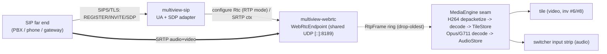

# Multiview — SIP/TLS Calling: Inbound/Outbound Audio+Video over SIP, Bridged to the Engine & Switcher Audio

**Area:** Calling / remote-contribution (a `multiview-sip` seam + `multiview-webrtc` media reuse + `multiview-input` source + `multiview-output`/`multiview-audio` return + `multiview-control` + web/)
**Status:** Design brief (Proposed) — docs-only; implementation follows in dependency-ordered waves.
**Drives:** [ADR-0084](../decisions/ADR-0084.md) (SIP/SIPS + SRTP stack & seam — inbound call = source, outbound = output/return), [ADR-0085](../decisions/ADR-0085.md) (SIP media ↔ engine bridge — reuse the WebRTC RTP/SRTP media engine; audio into switcher-audio mix-minus).
**Extends:** [webrtc.md](webrtc.md) + [ADR-0048](../decisions/ADR-0048.md)/[ADR-0049](../decisions/ADR-0049.md) (the native ICE/DTLS/**SRTP** media endpoint and the WHIP/WHEP source/output shapes this brief reuses), [switcher-audio.md](switcher-audio.md) + [ADR-0078](../decisions/ADR-0078.md) (the **mix-minus / N-1** return the SIP party must receive), [decoupled-routing.md](decoupled-routing.md)/[ADR-0034](../decisions/ADR-0034.md) (per-stream crosspoints — a SIP call's video is a routable input stream, its audio a strip), [ipv6-first.md](ipv6-first.md)/[ADR-0042](../decisions/ADR-0042.md) (binds, bracketed URLs, SDP `c=IN IP6`).
**Backlog:** `SIP-*` in [`../development/feature-intake-2026-06-13.md`](../development/feature-intake-2026-06-13.md).

> The operator asked for **full SIP/TLS in/outbound calling, with audio and video**. This brief
> designs SIP as a thin **signaling + media-negotiation** layer that terminates onto the media
> machinery Multiview already designs for WebRTC: an inbound call becomes a first-class **source**
> (its video into a tile, its audio into a switcher strip), an outbound call becomes an
> **output/return** carrying a **mix-minus** so the far end never hears itself. SIP is the dial-plan;
> the bytes ride the same RTP/SRTP engine as WHIP/WHEP. Nothing here touches the output clock, and the
> SIP signaling/media planes are physically incapable of back-pressuring the engine.

---

## 0. Headlines

1. **SIP is signaling; the media engine is shared.** A SIP user agent (UA) handles
   REGISTER/INVITE/SDP offer-answer ([RFC 3261](https://www.rfc-editor.org/rfc/rfc3261.html),
   [RFC 8866](https://www.rfc-editor.org/rfc/rfc8866.html)); the negotiated RTP/SRTP media is driven
   by the **same str0m-based engine** the WebRTC subsystem already owns
   ([ADR-0048](../decisions/ADR-0048.md)). We do **not** stand up a second media stack, a second
   socket family, or a second SRTP implementation.
2. **Inbound call = source; outbound call = output/return.** An accepted inbound call is a
   `kind = "sip"` source — its video decoded into a tile (invariant #6, decode-at-display-res), its
   audio de-embedded into the switcher-audio substrate exactly like any other source
   ([switcher-audio.md §4](switcher-audio.md)). A configured outbound call is an `Output::SipCall`
   that publishes a **return bus** (almost always a **mix-minus**) to the dialed party.
3. **The SIP party always gets a mix-minus (N-1).** Echo elimination is structural, not optional: a
   remote participant's return is `program − that participant + talkback`, the
   [ADR-0078](../decisions/ADR-0078.md) `AudioBusKind::MixMinus` with the participant auto-excluded
   from its own return. This is the single most load-bearing requirement in this brief.
4. **SIPS/TLS for signaling, SRTP for media — secure by default, IPv6-first.** Signaling uses the
   `sips:` scheme over TLS ([RFC 3261 §26.2.2](https://www.rfc-editor.org/rfc/rfc3261.html)); media
   uses SRTP ([RFC 3711](https://www.rfc-editor.org/rfc/rfc3711.html)) negotiated via the
   `UDP/TLS/RTP/SAVP(F)` SDP profile for DTLS-SRTP ([RFC 5764](https://www.rfc-editor.org/rfc/rfc5764.html))
   or the `RTP/SAVP` + `a=crypto` profile for SDES-SRTP (§3.3). Plaintext SIP/RTP is opt-in legacy,
   never the default. Binds are dual-stack `[::]`,
   SDP emits `c=IN IP6`, URLs bracket IPv6 literals ([ADR-0042](../decisions/ADR-0042.md)).
5. **Invariants #1 and #10 are untouched.** SIP signaling and media run off the data plane in their
   own crate/task; the engine never awaits the UA, and every engine→SIP and SIP→engine channel is a
   bounded **drop-oldest** ring. A wedged registrar, a flapping call, or a slow far end can lose
   *that call's* media — never an output tick.
6. **Open-standard only; clean-room interop.** SIP/SIPS/SDP/SRTP are open IETF standards. Where a
   far-end PBX or trunk has vendor quirks we interop nominatively and clean-room — we do not bundle a
   vendor SDK or redistribute a vendor's spec (the [managed-devices.md](managed-devices.md)
   ZowieTek-driver posture). Telephony-grade audio codecs that carry patent/licensing caveats (e.g.
   G.729) are flagged and deferred (§5.4).

---

## 1. Scope

### 1.1 In scope

- **Inbound calling (call = source):** Multiview registers a UA with a SIP registrar/PBX (or accepts
  direct INVITEs), answers an incoming call, and exposes it as a `kind = "sip"` source — **video into
  a tile, audio into a switcher input strip**. The caller hears a **mix-minus return**.
- **Outbound calling (call = output/return):** Multiview dials a SIP URI (`sip:`/`sips:`), sends the
  program **video** (or a configured bus's video) + a **mix-minus audio bus** to the far end. The
  WebRTC sibling of `Output::WhipPush` ([ADR-0049](../decisions/ADR-0049.md)).
- **Audio + video media.** Opus audio and H.264 video are the floor (reusing the WebRTC codec floor,
  [webrtc.md §1.3](webrtc.md)); narrowband telephony codecs (G.711 µ-law/A-law) are supported for
  audio-only PSTN-style legs (§5.4).
- **SIP over UDP/TCP, and SIP over TLS using `sips:` defaults** (`sips:` is a URI scheme that requires
  secure transport, not a transport itself), plus **SIP over WebSocket**
  ([RFC 7118](https://www.rfc-editor.org/rfc/rfc7118.html)) as an optional transport for
  browser-originated SIP clients (§2.4).
- **Registration + direct-INVITE + (optionally) a SIP trunk.** REGISTER to a registrar; accept/place
  calls; OPTIONS keepalive.

### 1.2 Out of scope (stated non-goals, not deferred work)

- **Not a softswitch / PBX / SBC.** Multiview is a UA endpoint (and a media bridge into the
  production), not a call-routing server, conference focus, or session border controller. Conferencing
  is achieved by the **switcher** (multiple SIP sources composited + per-party mix-minus returns),
  not by a SIP conference focus.
- **No transcoding farm.** One decode per call, one encode per distinct return rendition (invariant
  #7); we do not offer arbitrary codec transcoding between legs.
- **No PSTN/carrier billing, E.911, LIS/HELD, or number provisioning** — that belongs to the
  upstream trunk/PBX.
- **No SIP video transcoding to legacy H.263/H.261**; far ends that cannot do H.264 negotiate
  audio-only.
- **No DTLS-SRTP-only interop assumption.** WebRTC mandates DTLS-SRTP; classic SIP commonly uses
  SDES-SRTP or plain RTP. The bridge must straddle both keying models (§3.3) — this is the one place
  the shared engine needs a SIP-specific path.

---

## 2. SIP/SIPS stack — registration, INVITE, transports

### 2.1 A new leaf crate `multiview-sip` (signaling only)

SIP signaling lives in a **new leaf crate `multiview-sip`** (lib target `multiview_sip`), mirroring
the [ADR-0048](../decisions/ADR-0048.md) house pattern: `default = []` (a pure-Rust shell so
`cargo check --workspace` stays native-free and deny-clean), with a `native` feature enabling the
real UA. It owns the SIP transaction/dialog state machine, registration, the SDP offer/answer model,
and the transport sockets — but **not** the media. It depends on `multiview-core` and
`multiview-webrtc` (for the shared media endpoint handle); the cli maps config to a plain
`SipConfig`. Dependency direction stays acyclic: `sip → {webrtc, core}`; `cli → sip`.

**Why a separate crate from `multiview-webrtc`:** the media transport is shared, but SIP signaling is
a large, independent state machine (transactions, dialogs, registration, auth, NAT traversal helpers)
with its own dependency closure. Keeping it a leaf beside `multiview-webrtc` means one media endpoint,
two signaling front-ends (HTTP for WHIP/WHEP, SIP for calls). (Crate-vs-module is a reversible
default; if the UA proves small, it folds into `multiview-webrtc` as a `sip` feature — stated so the
decision is not load-bearing.)

### 2.2 The SIP stack — open-standard, Rust, vendor-neutral

The UA implements the [RFC 3261](https://www.rfc-editor.org/rfc/rfc3261.html) core: the transaction
layer (INVITE/non-INVITE client/server transactions), the dialog layer, REGISTER, and the
offer/answer model ([RFC 3264](https://www.rfc-editor.org/rfc/rfc3264.html)) over
[RFC 8866](https://www.rfc-editor.org/rfc/rfc8866.html) SDP.

**Candidate library (default-and-move):** the **ezk** Rust SIP crates (`ezk-sip-core`, `ezk-sip-ua`,
`ezk-rtc`; MIT-licensed — verified on the project repository) provide transports, transactions, and a
SIP user-agent abstraction for registrations and calls. (unverified) ezk's exact SRTP/`sips:`-TLS
coverage at the pinned version must be validated before commit — if a gap exists, it is filled in
`multiview-sip` against the RFCs, not worked around. reSIProcate is named here only as a **conceptual**
reference for a mature UA/transaction design (it is C++ and not a dependency). The library choice is
pinned in [ADR-0084](../decisions/ADR-0084.md) with a license/advisory `cargo deny` gate, exactly as
str0m is gated for WebRTC; if no Rust stack cleanly covers SIPS+SRTP, the transaction/dialog core is
implemented in-crate (RFC 3261 is well-specified) — flagged honestly as the larger-effort path.

### 2.3 Registration & dialog lifecycle

- **REGISTER** to a configured registrar with digest auth ([RFC 3261 §22](https://www.rfc-editor.org/rfc/rfc3261.html));
  re-REGISTER before `expires`; supervised with backoff exactly like an RTSP/RTMP reconnect
  ([decoupled-routing.md](decoupled-routing.md) supervision posture). A registrar that is down must
  **warn + retry**, never stall anything (bad inputs are the purpose — a flapping registrar is a
  normal, survivable condition).
- **Inbound INVITE:** ring → answer (auto-answer per source policy, or operator-gated via the control
  plane) → SDP answer with the negotiated media → `200 OK` → ACK; the call becomes a LIVE source.
  `BYE`/timeout tears it down → the tile rides STALE → NO_SIGNAL (invariant #2).
- **Outbound INVITE:** Multiview is the UAC; offer carries the program video + return-bus audio;
  far-end `200 OK` answer is applied; `BYE` on disable.
- **OPTIONS** keepalive + Session Timers ([RFC 4028](https://www.rfc-editor.org/rfc/rfc4028.html))
  detect a dead far end so a stuck call is reaped (the call's own watchdog, not the engine's).

### 2.4 Transports — SIPS/TLS first, IPv6-first

| Transport | Use | Posture |
|---|---|---|
| **TLS (`sips:`)** | Default for registration + signaling | Secure by default ([RFC 3261 §26.2.2](https://www.rfc-editor.org/rfc/rfc3261.html)); cert validation on; bound dual-stack `[::]` |
| **TCP** | Large messages / where TLS unavailable | Legacy; allowed, not default |
| **UDP** | Classic SIP peers | Legacy; allowed, not default; SIP's own retransmission timers apply |
| **WS/WSS** ([RFC 7118](https://www.rfc-editor.org/rfc/rfc7118.html)) | Browser-originated SIP clients | Optional; rides the existing control-plane HTTP listener path (a `Sec-WebSocket-Protocol: sip` upgrade) — no new public port |

All transports bind **dual-stack `[::]`** (`IPV6_V6ONLY=false`), bracket IPv6 URI literals
(`sips:[2001:db8::15]:5061`), and the SDP the UA produces/consumes is IPv6-first
(`c=IN IP6 …`, no TTL on IPv6 multicast — [ipv6-first.md](ipv6-first.md),
[ADR-0042](../decisions/ADR-0042.md)). The media rides the shared UDP port the WebRTC
endpoint already owns (`webrtc.udp_port`, default `8189`, [ADR-0048](../decisions/ADR-0048.md) §4) —
SIP adds **signaling** ports (5060 UDP/TCP, 5061 TLS by convention; configurable), not a new media
port. **The SDP port model (single shared socket vs per-call ports) is explicit in §3.2** — a single
shared media port is only viable for far ends that accept it; classic non-ICE peers may need
per-call RTP/RTCP ports.

### 2.5 NAT traversal

Classic SIP NAT problems (private addresses in SDP/Via, symmetric RTP) are handled by reusing the
WebRTC endpoint's posture: media uses the endpoint's gathered host candidates +
`webrtc.advertised_addresses` (NAT 1:1 / Docker), and outbound calls work because **we initiate** the
media flow (the same argument that lets `whip_push`/RTMP push traverse NAT,
[ADR-0049](../decisions/ADR-0049.md)). Signaling uses `rport`/symmetric response routing
([RFC 3581](https://www.rfc-editor.org/rfc/rfc3581.html)) and the `Via`/`Contact` rewriting a UA
behind NAT needs. ICE in SIP ([RFC 8839](https://www.rfc-editor.org/rfc/rfc8839.html)) is supported
**when the far end offers it** (the WebRTC engine already runs full ICE); a non-ICE far end gets plain
host-candidate SDP. **Inbound, non-ICE NAT is harder than outbound** because we do not initiate the
media: for a non-ICE inbound call the endpoint uses **symmetric-RTP/latching** (it locks media onto the
source tuple of the first inbound RTP it receives rather than trusting a possibly-private address in
the offer SDP) and rewrites its advertised connection address via `advertised_addresses`. A far end
behind a **symmetric NAT** with neither ICE nor a relay may simply be unreachable for non-initiated
media — that is a clearly-stated limit of non-ICE support, not a silent gap; ICE (when offered) or an
external TURN/media relay is the resolution. No embedded STUN/TURN **server** (stated boundary, mirrors
[ADR-0048](../decisions/ADR-0048.md) §11); an external TURN relay is an operator option.

---

## 3. Media bridge — reuse the WebRTC RTP/SRTP engine

### 3.1 The shared endpoint

The negotiated RTP/SRTP media for **every** SIP call is driven by the existing single
`WebRtcEndpoint` (`multiview-webrtc`, feature `native`): one dual-stack UDP socket, one driver task,
ufrag/remote-addr demux ([ADR-0048](../decisions/ADR-0048.md) §4). A SIP call is just another media
session on that endpoint, alongside WHIP publishers and WHEP viewers. This is the heart of the design:
**SIP contributes a dial-plan and an SDP, not a media stack.**

The real seams this reuses (verified in-tree):

- **Ingest:** the pure `MediaEngine` trait and `WebRtcProducer` (a `FrameProducer` that pulls
  decrypted RTP, depacketizes H.264, and is *sampled, never pacing*) at
  `crates/multiview-input/src/webrtc/transport.rs:201` (`pub trait MediaEngine`), `:213`
  (`fn poll_rtp`), `:547` (`pub struct WebRtcProducer`); the keyframe-gated `H264Depacketizer` at
  `:227`. A SIP inbound call feeds the **same** `MediaEngine` seam — the depacketize→decode→TileStore
  path is unchanged.
- **RTP timestamp wrap:** `WrapBits::Rtp32` already exists
  (`crates/multiview-input/src/normalize.rs:42`/`:54`) and the `PtsNormalizer` unwraps RTP's 32-bit
  timestamp like any other wrap width (invariant #3) — SIP RTP needs no new timing path.
- **Audio store:** decoded Opus/PCM → `AudioStore::publish`
  (`crates/multiview-audio/src/store.rs:171`) exactly as WHIP audio does ([webrtc.md §6.2](webrtc.md)).
- **Egress/return:** the encode-once fan-out `PacketRouter`/`PacketSink`
  (`crates/multiview-output/src/fanout.rs:140`/`:152`) — an outbound SIP call registers a `PacketSink`
  for video (route()+1, invariant #7, **zero extra video encode** when the rendition already exists)
  and consumes a per-call **mix-minus** audio rendition (§4).
- **Mix-minus return:** `ProgramBus::repoint_crossfade` and the mix-minus bus type
  (`crates/multiview-audio/src/program.rs:217`; [ADR-0078](../decisions/ADR-0078.md)).

### 3.2 What SIP adds to the engine: the SDP↔media adapter

SIP's offer/answer SDP is **classic SDP** (m-lines, rtpmap, fmtp, `a=rtcp-mux` maybe-absent,
`a=sendrecv`), not the BUNDLE-everything WebRTC SDP str0m emits natively. The `multiview-sip` crate
owns a small adapter that:

1. Parses the far-end SDP offer/answer (codecs, payload types, SRTP keying, direction).
2. Configures a str0m `Rtc` session **in RTP mode** for that call (the same mode WHIP ingest already
   uses, [webrtc.md §4.2](webrtc.md)), or — where the far end speaks plain RTP/SDES — a SIP-specific
   SRTP/RTP transport path on the shared socket (§3.3).
3. Produces the SDP answer/offer Multiview sends back, IPv6-first.

**SDP port model + demux (the non-ICE reality, made explicit).** A non-ICE SIP peer does **not** do
WebRTC's ICE/DTLS connectivity-check demux; it just sends RTP/RTCP to the concrete `m=` port(s) the
SDP advertises, and expects ours at the port(s) we advertise. So Multiview's SDP answer always
advertises a concrete RTP port (and RTCP port). The shared `webrtc.udp_port` is reused **only when the
call can RTP/RTCP-mux on it** (Multiview offers/requires `a=rtcp-mux`) and inbound packets demux
unambiguously to the call by 5-tuple + SSRC/PT (the [ADR-0048](../decisions/ADR-0048.md) §4
remote-addr/tuple demux, extended to per-call SSRC/PT). Where a legacy far end **cannot** `rtcp-mux`
or where the shared-port tuple is ambiguous (e.g. behind a symmetric NAT that rewrites the source
tuple, or an SSRC/PT collision), the adapter **allocates a per-call RTP/RTCP port pair** from a bounded
pool instead — never silently forcing unsupported multiplexing. Port-pool exhaustion is an admission
denial (a logged 488/486), never a fallback that breaks isolation. [ADR-0085](../decisions/ADR-0085.md)
§3 pins the rule; whether str0m can host the shared-socket per-call demux for non-BUNDLE RTP, or the
adapter must own a small per-call socket path, is an open question (§6).

This adapter is the **only** net-new media code; everything downstream (depacketize, decode, tile,
audio store, fan-out, mix-minus) is reused verbatim. [ADR-0085](../decisions/ADR-0085.md) pins it.

### 3.3 The keying-model straddle (the one genuine SIP-specific complication)

| Far end | Media keying | Path |
|---|---|---|
| WebRTC-style SIP (some PBXes, WebRTC-SIP gateways) | **DTLS-SRTP** (`UDP/TLS/RTP/SAVP(F)` + `a=fingerprint`/`a=setup`, [RFC 5764](https://www.rfc-editor.org/rfc/rfc5764.html)) | str0m's native DTLS-SRTP — fully reused |
| Classic secure SIP | **SDES-SRTP** (`RTP/SAVP` + `a=crypto`, [RFC 4568](https://www.rfc-editor.org/rfc/rfc4568.html)) | SIP-specific: keys exchanged in (TLS-protected) SDP; SRTP transform on the shared socket. **SDES keys MUST ride `sips:`/TLS** — never offer SDES over plaintext signaling, and note that `sips:`/TLS only protects the keys hop-by-hop through SIP proxies (not end-to-end) so SDES is permitted only for trusted-direct/trusted-proxy plants (§5.1) |
| Legacy SIP | **plain RTP** (`RTP/AVP`) | Allowed only when explicitly enabled (`allow_insecure_media`); off by default |

(unverified) Whether str0m exposes an SDES-SRTP transform usable off-WebRTC must be validated; if not,
the SDES/SRTP-context handling is implemented in `multiview-sip` against
[RFC 3711](https://www.rfc-editor.org/rfc/rfc3711.html)/[RFC 4568](https://www.rfc-editor.org/rfc/rfc4568.html)
using a vetted SRTP crate, with the keys still flowing through the shared socket/demux. This is flagged
as the largest implementation risk and is an open question (§6). The default and strongly-preferred
posture is **DTLS-SRTP**; SDES is the interop concession for classic plants, and plaintext RTP is a
deliberate, logged opt-in.

### 3.4 Codecs

- **Audio:** Opus (the shared floor, 48 kHz, [webrtc.md §1.3](webrtc.md)); **G.711 µ-law/A-law**
  (8 kHz, the universal telephony floor) for audio-only/PSTN legs — decoded to 48 kHz PCM into the
  `AudioStore` like any other source (the switcher engine is 48 kHz f32 throughout,
  [switcher-audio.md §5](switcher-audio.md)). DTMF as [RFC 4733](https://www.rfc-editor.org/rfc/rfc4733.html)
  telephone-event (surfaced as a control event, not mixed into program audio).
- **Video:** H.264 Constrained Baseline, **B-frames off**, in-band SPS/PPS — identical constraints to
  the WebRTC outputs (RTP carries no DTS; [webrtc.md §1.3](webrtc.md),
  [ADR-0049](../decisions/ADR-0049.md)). The SDP `fmtp` must negotiate `packetization-mode` and
  `profile-level-id` with the far end ([RFC 6184](https://www.rfc-editor.org/rfc/rfc6184.html)); SIP
  video peers vary here, so the hardware-validation matrix (open question §6.7) is mandatory. A far end
  that cannot do H.264 negotiates audio-only.
- Decode is **at display resolution** (invariant #6); the call's measured Mpx/s enters the standard
  admission/degradation plan like any other source.

### 3.5 Inbound media path (call → tile + strip)



Dotted = drop-oldest ring; the engine samples the TileStore/AudioStore, never blocks on the call.

---

## 4. Audio — the SIP party gets a mix-minus return; video into a tile

### 4.1 Mix-minus is mandatory (no self-audio)

A SIP participant **must** receive a return that excludes its own (delayed) audio, or it hears itself
echoed — the cardinal remote-contribution rule. This is **exactly** the
[ADR-0078](../decisions/ADR-0078.md) machinery, reused without modification:

```
sip_party_N_return = program − sip_party_N + producer_talkback
```

- Each SIP call's **inbound** audio is a switcher input strip ([switcher-audio.md §4](switcher-audio.md)).
- Its **return** is an `AudioBusKind::MixMinus` whose `excluded_strips` auto-includes that party's own
  strip (the [ADR-0078](../decisions/ADR-0078.md) auto-exclude-self safety invariant — a participant
  is *structurally* removed from its own return; an explicit override is required to defeat it).
- The mix-minus is realized over the [ADR-0077](../decisions/ADR-0077.md) send matrix as
  `base − excluded` — **not** a second decode — using the [ADR-0059](../decisions/ADR-0059.md)
  `AudioReader` multi-cursor view (each return bus gets its own wait-free cursor over the shared
  stores). Per-return delay/gain/limiter/mute are available; talkback/IFB can interrupt the return
  ([switcher-audio.md §12](switcher-audio.md)).
- **Talkback can never leak to Program** (the [ADR-0078](../decisions/ADR-0078.md) validator refuses
  talkback→Program); a SIP return is a safe place to fold producer talkback because it never re-enters
  the on-air mix.

This makes the operator's "with audio" requirement concrete and safe: a SIP call is a remote guest,
and remote guests get N-1 returns by construction.

### 4.2 Return encoding (encode-once for audio)

The return bus is encoded **once per distinct rendition** (invariant #7 for audio,
[ADR-0049](../decisions/ADR-0049.md) §6.1 / [ADR-0078](../decisions/ADR-0078.md)): if a far end wants
Opus, the program's existing Opus rendition is reused where the mix matches; a **mix-minus** return is
a *different mix* than program, so it is one extra encode **per distinct return**, not per call —
multiple parties excluded identically share a return. **Caveat:** for true per-party mix-minus each
party excludes a *different* strip, so distinct-return sharing is mostly theoretical — N talking parties
is effectively N distinct mix-minus returns (N encodes); sharing only helps listen-only parties that
exclude the same set (e.g. several muted observers). Budget N-party cost as ≈ N returns, not 1. G.711
returns are a cheap narrowband encode.
Return audio is delivered as the call's negotiated audio m-line over SRTP on the shared endpoint.

### 4.3 Video into a tile (inbound) and program/bus out (outbound)

- **Inbound video** is decoded into a `TileStore` and is a **routable input stream**
  ([decoupled-routing.md §3–§4](decoupled-routing.md)): it can feed any layout cell, be a PiP, a
  full-frame guest, etc. A call with no video (audio-only PSTN leg) simply contributes no tile — its
  strip is still on the mixer.
- **Outbound video** is the program rendition (or a configured bus's video) fanned to the call's
  `PacketSink` (route()+1, zero extra encode) under the H.264-bf0 constraint of §3.4. A
  `SipCall` output that wants a *clean* or *different* video bus pays exactly one extra encode for
  that rendition, same as any breakaway output route ([switcher-audio.md §14](switcher-audio.md)).

### 4.4 Config & apply classification

- **Inbound:** `SourceKind::Sip { ... }` (internally tagged `kind = "sip"`, never `untagged` — house
  rule). A configured-but-unconnected SIP source shows NO_SIGNAL; an active call rides LIVE; a SIP
  source is never RECONNECTING for an *inbound* call (there is nothing to dial — the far end calls us),
  mirroring the `webrtc` source lifecycle ([ADR-T014](../decisions/ADR-T014.md)).
- **Outbound:** `Output::SipCall { id, uri, register?, codec, gpu_pin, audio (mix-minus ref) }` — the
  SIP sibling of `Output::WhipPush`. Supervised reconnect/redial with backoff like the push clients.
- Add/remove of a call is the same apply class as other network source/output kinds (invariant #11,
  recorded in the [capability matrix](management-capability-matrix.md)); changing the **return
  audio-track set** is Class-2 ([switcher-audio.md §14](switcher-audio.md),
  [ADR-0079](../decisions/ADR-0079.md)).

---

## 5. Security, IPv6, efficiency, licensing

### 5.1 Security

- **Secure by default:** `sips:`/TLS signaling with certificate validation; SRTP media (DTLS-SRTP
  **preferred**, SDES over TLS as the interop concession). Plaintext SIP and plain RTP are **off by
  default**, gated behind explicit `allow_insecure_signaling`/`allow_insecure_media` flags that
  **log a standing warning** when enabled.
- **SDES key-exposure caveat (the "secure by default" claim, scoped honestly):** `sips:`/TLS is
  **hop-by-hop** — it protects the SDP (and the SDES media key in `a=crypto`) on each leg between the
  UA and its next SIP proxy, **not** end-to-end. Any SIP proxy/B2BUA on the path (and its logs) can see
  the SDES key and decrypt the media. So SDES is permitted only for **trusted-direct or trusted-proxy**
  deployments and is never claimed as end-to-end media secrecy; **DTLS-SRTP is preferred** wherever the
  far end supports it because the key never leaves the endpoints. This is surfaced to the operator as a
  per-call security indicator (DTLS-SRTP vs SDES vs plaintext).
- **Auth:** digest auth for REGISTER/INVITE; per-source/per-output credentials follow the existing
  config-secret posture (returned to authorized readers, present in config export, migrating with a
  future `secret_ref` indirection — the rtmp/srt stream-key precedent,
  [ADR-0049](../decisions/ADR-0049.md)). The control-plane API gates who may place/answer calls (BOLA
  `authorize_object`, [decoupled-routing.md §9](decoupled-routing.md)).
- **Toll-fraud / DoS:** inbound INVITEs are rate-limited and admission-gated; only configured
  registrars/trunks or an allow-list may originate calls that auto-answer; an INVITE flood sheds at
  the SIP layer and can never starve a media session or a tick (the §2.2 admission pool is the SIP
  analogue of the WebRTC `max_sessions` split, [ADR-0048](../decisions/ADR-0048.md) §8).
- **No self-feed / echo:** structurally guaranteed by the mix-minus auto-exclude-self
  ([ADR-0078](../decisions/ADR-0078.md)).

### 5.2 IPv6-first

Binds are dual-stack `[::]`; loopback `[::1]`; URIs bracket IPv6 literals; SDP is `c=IN IP6` with the
no-TTL rule for any IPv6 connection address ([ipv6-first.md §2](ipv6-first.md),
[ADR-0042](../decisions/ADR-0042.md)). Examples lead IPv6
(`sips:[2001:db8::15]:5061`); an IPv4 form, if shown, is labeled legacy. The SDP the UA writes reuses
the IPv6-aware SDP path the WebRTC answer already needs.

### 5.3 Efficiency budget (standing review)

| Resource | Budget | Mechanism |
|---|---|---|
| Memory per call | ≤ ~2 MiB transport (shared str0m buffers) + up to one in-progress H.264 access unit + decoder surfaces + 1 `AudioReader` cursor per return | Bounded drop-oldest rings; the WebRTC per-session caps apply ([ADR-0048](../decisions/ADR-0048.md) §12) |
| Inbound video decode | 1 decode per call, **at display resolution** (inv #6) | Measured Mpx/s into the admission/degradation plan |
| Return audio encode | 1 per **distinct** mix-minus rendition (not per call) | Encode-once for audio (inv #7); identical exclusions share a return |
| Outbound video encode | **0** extra when the program/bus rendition exists | `PacketSink` route()+1 (inv #7) |
| Signaling | I/O-bound; transactions are small; REGISTER refresh at minutes-scale | Off the data plane in `multiview-sip`'s task |
| CPU ceiling | Per-call ≈ one Opus/G.711 decode + one H.264 decode + the shared mix; conferencing N parties = N decodes + N mix-minus mixes | Sheds calls (an aux/return rung) before any program lever moves (inv #9) |

The mix-minus cost grows with the number of *distinct* returns, not raw participant count; soak-test
the `AudioReader` multi-cursor contention under N returns ([ADR-0059](../decisions/ADR-0059.md) open
question) before scaling conferencing.

### 5.4 Licensing / vendor-neutrality

- **Open standards only:** RFC 3261/3264/8866/3711/4568/5764/6184/7118/4733 etc. — all IETF.
- **Codecs:** Opus (BSD/royalty-free), G.711 (royalty-free) — LGPL-clean, default-build-safe. **G.729
  and other royalty-bearing telephony codecs are flagged and deferred** (a licensing escalation akin
  to `gpl-codecs`; not in the default build) — honest open question (§6).
- **No vendor SDKs / no redistributed vendor specs.** Far-end PBX/trunk quirks are handled
  clean-room and nominatively, the [managed-devices.md](managed-devices.md) ZowieTek-driver posture.
  We defer to the operator on any proprietary-protocol stance.
- **The SIP library + SRTP crate ride a `cargo deny` license/advisory gate** under the `native`
  feature graph, exactly like str0m for WebRTC ([ADR-0048](../decisions/ADR-0048.md) §11).

### 5.5 Invariant posture (explicit)

- **#1 output-clock:** SIP signaling and media are entirely off the tick path. Inbound call media is
  *sampled* through the bounded, keyframe-gated `MediaEngine`/`AudioStore` path (the same one WHIP
  uses); outbound returns consume the existing fan-out through bounded per-call rings. No SIP code path
  paces or blocks a tick. A call that never connects, drops mid-stream, or floods us cannot perturb the
  clock.
- **#10 isolation:** all SIP work lives in `multiview-sip`'s task + the shared `multiview-webrtc`
  driver, joined to the engine **only** by bounded drop-oldest rings; the engine never awaits the UA
  or a far end. A wedged registrar/UA loses *its* calls' media, never output. The mix-minus return is a
  consumer-side `ProgramBus` the engine never awaits ([ADR-0078](../decisions/ADR-0078.md) §5).
- **#3 timing:** RTP 32-bit wrap handled by the existing `PtsNormalizer`/`WrapBits::Rtp32`; output PTS
  re-stamped from the tick counter; mix-minus sample budgets are exact-rational
  ([ADR-0059](../decisions/ADR-0059.md)), never float.
- **#6 decode-at-display-res / #8 color:** inbound video decoded near tile size, `ColorInfo` tagged
  from the H.264 VUI defaulting BT.709 (the compressed-ingest policy, [webrtc.md §4.2](webrtc.md)).
- **#7 encode-once:** outbound video is a route()+1; return audio is one encode per distinct rendition.

---

## 6. Open questions (honest)

1. **SRTP-keying straddle.** Can str0m's SRTP transform be driven off-WebRTC for **SDES-SRTP**, or
   does `multiview-sip` need a standalone SRTP crate for classic-SIP keying (§3.3)? This is the single
   largest implementation **risk** — but note it does **not** make SDES optional: classic SIP/TLS plants
   overwhelmingly key media with SDES-SRTP (or plain RTP), so **SDES-SRTP is a v1 requirement** for the
   operator's "full SIP/TLS calling" ask, implemented in-crate against
   [RFC 3711](https://www.rfc-editor.org/rfc/rfc3711.html)/[RFC 4568](https://www.rfc-editor.org/rfc/rfc4568.html)
   with a vetted SRTP crate if str0m cannot host it. The open question is the *mechanism* (reuse str0m
   vs vetted SRTP crate), not *whether* SDES ships. A DTLS-SRTP-only first cut is a stopgap for an
   early hardware-validation milestone, **not** a "full SIP/TLS" v1 — it would interop only with
   WebRTC-SIP gateways and modern PBXes, so the "full" claim is not met until SDES lands.
2. **Library vs in-crate UA.** Pin ezk (MIT) after validating its `sips:`-TLS + SRTP coverage at the
   chosen version, or implement the RFC 3261 transaction/dialog core in-crate? (Reversible; affects
   effort, not architecture.)
3. **Codec floor for telephony.** Is G.711 + Opus enough, or is **G.729** interop required (and is the
   operator willing to take the licensing escalation)?
4. **Auto-answer policy.** Default to operator-gated answer (a call rings in the UI and an operator
   takes it) or auto-answer for trusted trunks? (Recommend operator-gated for inbound, auto for a
   configured trunk allow-list.)
5. **Conferencing shape.** Multiple SIP parties + per-party mix-minus is the switcher-native answer;
   do we need a *single* SIP "conference" dial-in (one INVITE, mixed) too, or is per-party always
   better for a production? (Recommend per-party; one-dial-in is a possible convenience layer.)
6. **SIP-over-WS scope.** Ship WS/WSS transport ([RFC 7118](https://www.rfc-editor.org/rfc/rfc7118.html))
   in v1 for browser SIP clients, or defer until a concrete need (browsers already have WHIP/WHEP)?
7. **Video far-end reality.** Many SIP video endpoints are H.264 but with profile/level quirks and no
   PLI handling; the hardware-validation matrix needs real SIP video peers (a softphone, a hardware
   video phone, a WebRTC-SIP gateway) to be honest about interop.

---

## 7. References

- **In-repo:** [webrtc.md](webrtc.md), [ADR-0048](../decisions/ADR-0048.md),
  [ADR-0049](../decisions/ADR-0049.md), [switcher-audio.md](switcher-audio.md),
  [ADR-0077](../decisions/ADR-0077.md), [ADR-0078](../decisions/ADR-0078.md),
  [ADR-0079](../decisions/ADR-0079.md), [ADR-0059](../decisions/ADR-0059.md),
  [decoupled-routing.md](decoupled-routing.md), [ADR-0034](../decisions/ADR-0034.md),
  [aes67-delivery.md](aes67-delivery.md), [ADR-0033](../decisions/ADR-0033.md),
  [ADR-T013](../decisions/ADR-T013.md) (RTP-audio rebase seam),
  [ADR-T014](../decisions/ADR-T014.md) (WHIP ingest lifecycle precedent),
  [ipv6-first.md](ipv6-first.md), [ADR-0042](../decisions/ADR-0042.md),
  [management-capability-matrix.md](management-capability-matrix.md),
  [managed-devices.md](managed-devices.md) (clean-room interop posture).
- **External (open standards, web-verified):** [RFC 3261](https://www.rfc-editor.org/rfc/rfc3261.html)
  (SIP core; `sips:`/TLS §26.2.2; digest §22), RFC 3264 (offer/answer),
  [RFC 8866](https://www.rfc-editor.org/rfc/rfc8866.html) (SDP),
  [RFC 3711](https://www.rfc-editor.org/rfc/rfc3711.html) (SRTP), RFC 4568 (SDES-SRTP),
  [RFC 7118](https://www.rfc-editor.org/rfc/rfc7118.html) (SIP over WebSocket), RFC 4028 (session
  timers), RFC 3581 (`rport`), RFC 8839 (ICE in SDP), RFC 4733 (telephone-event/DTMF),
  [RFC 5764](https://www.rfc-editor.org/rfc/rfc5764.html) (DTLS-SRTP, `UDP/TLS/RTP/SAVP(F)` profile),
  [RFC 6184](https://www.rfc-editor.org/rfc/rfc6184.html) (H.264 RTP payload — `packetization-mode`/`profile-level-id`).
  Bridging practice (DTLS-SRTP mandatory in WebRTC; `UDP/TLS/RTP/SAVP(F)` for DTLS-SRTP vs `RTP/SAVP`+`a=crypto`
  for SDES vs `RTP/AVP` for plain RTP; gateway DTLS/SRTP↔plain-RTP conversion) is industry consensus,
  web-verified (webrtcHacks, PJSIP, TelcoBridges).
- **Rust SIP (web-verified existence/license, internals unverified):** ezk crates
  (`ezk-sip-core`/`ezk-sip-ua`/`ezk-rtc`, MIT); reSIProcate (C++, conceptual reference only).
