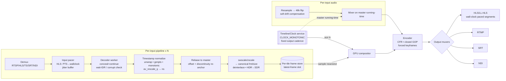

> **Design brief — Streaming/Timing.** Authoritative research/design record backing the implementation. Produced by a verification-hardened multi-agent research workflow (2026-06-02). Canonical crate/API naming lives in [docs/architecture](../architecture/). ADRs derived from this brief are in [docs/decisions](../decisions/).

---

# Streaming Robustness Runbook: Timing, Frame-Rate, Codec & HLS Failure Modes for a Live Video Multiview

**Audience:** engineers building the Rust + FFmpeg/libav live multiview. This is the authoritative "streaming gotchas & mitigations" runbook. The user has been burned by these in production; treat every mitigation here as load-bearing.

> **See also:** [timing-architecture.md](timing-architecture.md) unifies this runbook's timing material into a five-layer model (monotonic pacing · optional PTP/ST 2059 reference-lock · per-input frame-sync · wall-clock time-of-day · timecode) and answers how/whether to tie the output to timed sources without breaking invariant #1. This runbook is the failure-mode detail behind Layer C (per-input frame-sync) and Layers A/D. [input-timing-and-sync.md](input-timing-and-sync.md) deepens §0–§2 here into the definitive **input-side** design (best-effort PTS acquisition → normalise → wall-clock pacer → sample-at-tick) and diagnoses the *ultra-fast-then-freeze* file/VOD bug ([ADR-0021](../decisions/ADR-0021.md)).

**The one principle that governs everything:** *The output is driven by a single internal monotonic clock. Inputs are SAMPLED into the output; they never PACE it.* Every failure mode below is ultimately solved by decoupling each input behind a per-input buffer + timestamp normalizer, and driving the compositor and muxer from one fixed-cadence output clock. There is **no single FFmpeg flag** that makes the output bulletproof — error resilience, timestamp normalization, clock decoupling, and CFR enforcement are *separate* mechanisms that must *all* be present.

---

## 0. The Unified Timing Model

### Three-stage timestamp pipeline (per input)

```
RAW INPUT PTS  ──►  [1] NORMALIZE  ──►  [2] REBASE  ──►  internal media_time (i64 ns)
                       unwrap wrap          offset = anchor_now − first_pts
                       genpts fallback      re-anchor on discontinuity
                       monotonic guard
                       rescale via av_rescale_q

internal media_time  ──►  per-tile FRAME STORE (latest-frame slot / small ring)

[3] OUTPUT CLOCK (free-running, CLOCK_MONOTONIC, fixed cadence)
    output frame N  ⇒  out_pts = N   (in 1/out_fps timebase)
    at each tick: composite the frame in each tile whose media_time is nearest-but-not-after  N/out_fps
    re-stamp ALL output PTS/DTS from the output counter — never propagate input PTS to the muxer
```

### Exact algorithm: input-PTS → normalized-time → output-frame-index

**Per input `i`, on every decoded frame:**
```
raw      = frame.best_effort_timestamp        // use best_effort, NOT dts (B-frames reorder)
if raw == AV_NOPTS_VALUE: raw = synthesize_from_cadence()   // genpts-equiv fallback
unwrapped = raw + accumulated_wrap_i          // 33-bit TS / 32-bit RTP unwrap, delta-based
if (unwrapped - last_unwrapped_i) < -(1 << (wrap_bits-1)):
        accumulated_wrap_i += (1 << wrap_bits)         // wrap detected
ns       = av_rescale_q(unwrapped, in_tb, NS_TB)       // NS_TB = 1/1_000_000_000
if abs(ns - expected_ns_i) > DISCONTINUITY_NS  OR  saw_EXT_X_DISCONTINUITY:
        offset_i += continuous_time_i − ns             // RE-ANCHOR (smooth continuation)
on first valid frame: anchor_i = master_now(); offset_i = anchor_i − ns
media_time = ns + offset_i
if media_time <= last_media_time_i: media_time = last_media_time_i + 1   // monotonic guard
frame_store[i].put(media_time, frame)         // single-slot overwrite (or small ring)
```

**Output clock (one thread, drives the whole multiview):**
```
start = master_now()                                  // monotonic Instant
for N in 0.. :
    target_ns   = N * 1_000_000_000 * out_fps_den / out_fps_num   // exact rational, 1001-safe
    deadline    = start + target_ns
    sleep_until(deadline − SPIN_MARGIN); busy_spin_until(deadline)  // accurate cadence
    for each tile i:
        f = frame_store[i].nearest_at_or_before(target_ns)
        if f is None: f = frame_store[i].last_good()  // HOLD on starvation
        composite(f)                                  // GPU
    encode_and_mux(out_pts = N)                        // CFR, counter-derived PTS
```

This is mathematically equivalent to per-tile nearest/previous-PTS resampling with implicit duplicate-on-stall and drop-on-overrun — at zero motion-interpolation cost, and bulletproof: a stalled source → held tile; a bursting source → overwritten slot (newest wins); a wrong-fps source → implicit resample. The output never stalls because it is gated by the wall clock, not any input.

### Dataflow / timing diagram



---

## 1. Mismatched & Variable Input Frame Rates

| | |
|---|---|
| **Problem** | Sources run at different and/or variable fps (declared ≠ actual; cameras drop fps in low light); compositor must emit one fixed output cadence. |
| **Symptom** | Output stalls when one input is slow; tiles speed up/skip when an input bursts; judder; drift over hours. |
| **Root cause** | Coupling inputs to one shared filtergraph clock (a single `fps`/`xstack` graph is gated by its slowest input — `framesync` returns `FFERROR_NOT_READY` whenever any input has neither a frame nor EOF). Trusting declared fps. Using float fps for 1001-family rates. |

**Mitigation — "hold last good frame, sample on output tick" (per tile):**
- Each input decodes independently into a **single-slot latest-frame cell** (overwrite policy → bounded memory, newest wins). The output clock samples it. This is exactly GStreamer `compositor`/`videoaggregator` live mode (deadline-based aggregation, `ignore-inactive-pads`, leaky queues) and OBS's render loop (fixed canvas FPS, GPU-composite latest source frame, drop over-rate / duplicate under-rate, "frames missed due to rendering lag").
- **Duplicate/drop is the default per-tile policy** (the `fps`/`videorate` model: dup when slow, drop when fast, **no blending**). It is O(1) and the only option that scales to N tiles at 50/60 fps live. Reserve `minterpolate` (motion-compensated, tens of ms/HD frame) and `framerate` (linear blend, ghosts on motion) as opt-in *per-tile* quality modes only — never the global default. (Open question: confirm whether the product requires *smooth* motion from low-fps sources; if yes, this flips the resampling choice and limits tile count — benchmark before promising.)
- **Detect real fps from decoded-PTS deltas** (rolling median), never from `r_frame_rate` (it is the smallest *timebase*, can be 2× the real rate after dup/drop), `avg_frame_rate` (hint only), or RTSP SDP. With latch-on-tick you do not strictly *need* the real input fps for correctness — only for jitter-buffer sizing, drop-only-vs-duplicate policy, and diagnostics.
- **Fractional NTSC (the 1001 family):** 23.976=24000/1001, 29.97=30000/1001, 59.94=60000/1001. Carry all internal time as **i64 nanoseconds** (or 90 kHz); pick a rational output cadence (e.g. 60000/1001 for NTSC ecosystems). Never use float fps — it drifts ~3.6 s/hour and eventually produces non-monotonic/duplicate PTS. Do **not** attempt inverse-telecine in the live path; a telecined source just becomes a slightly juddery, stall-free tile.

**HIGH RISK:** `-fps_mode cfr` / `-vsync 1` / the `fps` filter on a multi-input `filter_complex` does **not** make output bulletproof — a stalled (no-EOF) or non-monotonic input freezes the whole graph (confirmed at source level via `framesync.c`). In-graph options (`eof_action=repeat`, `repeatlast`, `shortest`) mask EOF/mild skew but not a live stall-without-EOF. CFR must be the compositor's own output clock + per-tile latch; `-fps_mode cfr` is valid only as the *final encoder-stage* CFR enforcement on already-paced output.

---

## 2. PTS / DTS / Timebase / Wraparound / Discontinuities

| | |
|---|---|
| **Problem** | Long-running ingest hits MPEG-TS 33-bit wrap (~26.5 h), RTP 32-bit wrap (~13.25 h), B-frame DTS reorder, non-monotonic/missing PTS, mid-stream resets, HLS `EXT-X-DISCONTINUITY`. |
| **Symptom** | "Non-monotonic DTS" muxer abort; segmenter stalls; video freeze; sudden burst/multi-minute stall after a discontinuity. |
| **Root cause** | Passing raw source timestamps to encoder/muxer; trusting libav's built-in wrap heuristics; relying on single flags. |

**Normalization rules (the only timestamps the encoder/muxer ever see are clean & counter-derived):**
- **Unwrap delta-based, not value-based:** if `(cur − last) < −2^(wrap_bits−1)` → wrap forward (`accumulated_wrap += 2^wrap_bits`). For RTP, use the int32 delta trick: `delta = (int32_t)(cur − last)`, accumulate into a 64-bit counter. Do **not** trust libavformat's `pts_wrap_reference`/`update_wrap_reference`: a bogus SDP `rtptime` made FFmpeg schedule a **false** rollover at ~13h14m and corrupt output (MediaMTX #622). For RTSP, prefer your own depacketizer/unwrapper, or strip/correct RTP-Info `rtptime`.
- **Discontinuity → re-anchor, don't pass through.** On `EXT-X-DISCONTINUITY`, TS `discontinuity_indicator`, or `|jump| > ~10 s`: `offset += continuous_time − new_raw_time` so the next output media time continues smoothly. After `EXT-X-DISCONTINUITY`, PTS may be *any* value including descending (RFC 8216) — reset the per-input parser/decoder if needed.
- **B-frames:** decode order ≠ display order. Schedule by `frame.best_effort_timestamp` (display order); only the **output encoder** needs DTS, which libavcodec assigns automatically. Drain (`send NULL`) `AV_CODEC_CAP_DELAY` decoders at EOS; `avcodec_flush_buffers()` on seek/reset so stale reordered frames don't leak.
- **Output muxer:** let libavcodec assign DTS on the encoded path. For any stream-copy path, clamp `dts = max(dts, last_dts+1)`, `pts = max(pts, dts)` before `av_interleaved_write_frame` (it **aborts** on the first non-monotonic DTS). Set `avoid_negative_ts=make_zero` and a small `max_interleave_delta`. Prefer re-encode over copy when source timestamps are pathological (aggressive DTS clamping on a real B-frame copy corrupts reorder relationships).

**HIGH RISK:** No single flag "just works." `+genpts` only synthesizes PTS *when DTS exists*; `avoid_negative_ts=make_non_negative` shifts only *leading* negatives (not mid-stream); `correct_ts_overflow` handles one wrap and its RTP heuristic has misfired in production; `use_wallclock_as_timestamps` injects your host's NTP-step/scheduling jitter. **Own the timeline.** Implement and **test past the wrap boundary** (synthetic wrapping timestamps) — 24/7 services that ran fine for an hour fail overnight.

---

## 3. HLS INGEST Bursting

| | |
|---|---|
| **Problem** | On connect/reconnect, several already-published segments sit on the origin; a naive reader pulls them all back-to-back. |
| **Symptom** | Tile plays too fast / time-warps; RAM blowup; tile skips. |
| **Root cause** | Segment-granular HTTP delivery + a consumer reading as fast as the network allows (RFC 8216bis: client SHOULD start ≥3 target-durations from the edge → a built-in multi-segment backlog). |

**Mitigation — a custom PTS-to-wall-clock pacer between demux and compositor:**
```
on first frame: anchor_wall = now(); pts0 = frame.pts
release frame when now() >= anchor_wall + (pts − pts0)
bounded ring buffer (target ~0.5–3 s pre-roll); overflow on connect is fine (absorbed)
re-anchor (pts0, anchor_wall) on EXT-X-DISCONTINUITY or |pts−last| > threshold
bounded catch-up: if latency-to-edge grows, advance releases at ≤ ~1.25× until back to target — never instant seek for small drift
```
- **Start at live edge minus hold-back:** `live_start_index=-3` (default) or honor `EXT-X-START` via `prefer_x_start=1`; respect HOLD-BACK / PART-HOLD-BACK.
- **Detect live vs VOD up front** (`EXT-X-ENDLIST` / `EXT-X-PLAYLIST-TYPE`); treat ambiguous as live (pace + track edge). Set `seg_max_retry>0` (default 0 silently skips a failed segment → gap) but cap it. Try `http_multiple=0` if bursting is severe (parallel segment downloads aggravate the connect burst).
- This mirrors hls.js (`liveSyncDurationCount=3`, `maxLiveSyncPlaybackRate`, `nudgeOffset`), GStreamer `hlsdemux2` + `queue2`, MediaMTX parts buffer.

**HIGH RISK:** **`-re` is for files, not live ingest.** It is documented *verbatim* as "equivalent to -readrate 1" and FFmpeg explicitly warns it "should not be used with actual grab devices or live input streams where it can cause packet loss." On a true live source it does not smooth the connect burst, and after a stall its wall-clock-anchored budget refills via an **unthrottled burst** — the opposite of a fix. `readrate_catchup` (FFmpeg **8.0+**, merged Feb 2025; confirmed present in our 8.1.1 build) bounds post-stall catch-up — but it is a **CLI-only fftools option**, unavailable to a libav-linked Rust pipeline at *any* version. Build your own pacer; it is mandatory for in-process libav and the only safe path on older/distro builds.

---

## 4. HLS / LL-HLS OUTPUT Pacing

| | |
|---|---|
| **Problem** | If segments are published faster than real time (file inputs, or "catching up" after a stall by flushing a backlog), the player's edge jumps forward. |
| **Symptom** | Player plays >1.0× / fast-forwards / seeks; downstream consumers burst. |
| **Root cause** | Output edge advancing faster than wall clock; non-GOP-aligned segments inflating TARGETDURATION; PROGRAM-DATE-TIME drift; relying on the player to compensate. |

**Mitigation (server-side is authoritative):**
- **Pace segment PUBLICATION to wall clock.** Frame-pace the compositor (the master output clock already guarantees ≤ one segment per `hls_time` of real time). **Never catch up by flushing buffered frames — drop to live instead.**
- **GOP-aligned, closed, fixed GOP:** `-g N -keyint_min N -sc_threshold 0` + `-force_key_frames 'expr:gte(t,n_forced*SEG_SECONDS)'`; x264 `keyint=N:min-keyint=N:scenecut=0:open-gop=0`; **x265 defaults to OPEN gop — must pass `open-gop=0`**. Choose fps/segment so keyint divides evenly (30 fps, 2 s → keyint=60). NVENC **cannot reconfig GOP structure**; keep canvas fixed for the session.
- **Standard HLS (2–6 s):** `hls_segment_type fmp4`, `hls_time 2`, `hls_list_size 6–10`, `hls_flags +delete_segments+temp_file+independent_segments+program_date_time+omit_endlist`, `hls_delete_threshold≥1`. `+temp_file` prevents fetch-during-write stalls (atomic rename). `EXT-X-TARGETDURATION` = ceil(max EXTINF) — one stray long segment permanently inflates it. Anchor `EXT-X-PROGRAM-DATE-TIME` to a real monotonic→UTC clock (computing it from summed EXTINF *drifts*).
- **CMAF/fMP4 preferred over MPEG-TS** (lower overhead, byte-range parts, shared with DASH, tolerates intra-timeline timestamp jumps). TS only for legacy reach (it needs continuity-counter bookkeeping; fMP4 needs monotonic moof sequence numbers + a once-served init segment). Emit `EXT-X-DISCONTINUITY` + bump `EXT-X-DISCONTINUITY-SEQUENCE` only on genuine timeline breaks.

**HIGH RISK:** **FFmpeg's `lhls` flag is NOT Apple LL-HLS.** It emits only `#EXT-X-PREFETCH` (community LHLS) and is documented "Note: This is not Apple's version LHLS" — Safari and hls.js `lowLatencyMode` ignore it; there is **no `EXT-X-PART` option** in the FFmpeg HLS muxer. True LL-HLS needs `EXT-X-SERVER-CONTROL` (CAN-BLOCK-RELOAD=YES, PART-HOLD-BACK≥2×, SHOULD ≥3× PART-TARGET) + `EXT-X-PART-INF`/`EXT-X-PART` + `EXT-X-PRELOAD-HINT` + blocking playlist reload (`_HLS_msn`/`_HLS_part`) over HTTP/2 (Safari requires HTTPS even on localhost; chunked-transfer for parts is forbidden). Build a custom CMAF origin (axum/hyper + `tokio::sync::Notify` per part), use GStreamer `hlscmafsink` for the chunks, or republish through MediaMTX/OvenMediaEngine. Do **not** rely on `maxLiveSyncPlaybackRate` as the primary fix: hls.js source gates catch-up on lowLatencyMode + live + >50 ms behind + >1 s buffered + not stalled; issues #4681/#6350 show it under-fires and never recovers post-stall drift. Configure it as a secondary client trim only. **And:** any free-running consume stage reintroduces bursting — every stage you own must be wall-clocked (GStreamer `sink sync=true`/`clocksync`, or a Rust frame-pacing loop); for browser/hls.js players you do not control, no-bursting cannot be *guaranteed* (e.g. LL-HLS part toggling stutter, hls.js #7431).

---

## 5. Long-Run Clock Drift

| | |
|---|---|
| **Problem** | Every source crystal drifts tens–hundreds of ppm vs the output clock over hours/days. |
| **Symptom** | Slow buffer overrun (drop) or underrun (freeze/repeat); A/V desync. |
| **Root cause** | Independent clocks, no active correction; making an input the master. |

**Mitigation:**
- **Master clock = system CLOCK_MONOTONIC driving the output pacer.** Never an input clock or audio hardware clock (an input hiccup/wrap/jump would stall or speed up the whole multiview). This is GStreamer's single-pipeline-clock model and NDI's wall-clock recommendation. (If exactly one PTP-locked authoritative feed exists, a hybrid "slave master to that input, free-run the rest" is an option; for multi-machine sync use an NTP/PTP-disciplined clock.)
- **Per-source drift control loop (PI + dead-band + EMA):** low-pass the buffer-level/PTS error (GStreamer `audiobasesink` 31/32 EMA), dead-band ~40 ms (GStreamer `drift-tolerance`), accumulate many samples before acting (SRT TSBPD ~1000-sample window; coarse base-shift + fine continuous correction). The loop output is the per-source ppm correction.
- **Video:** correct by whole-frame select/drop/duplicate at the compositor (NDI Framesync "most appropriate recent frame"). Free, artifact-light.
- **Audio:** **never** drop/dup blocks audibly — apply **continuous soft resampling** by the measured ppm (software word-clock). Two paths:
  - libswresample: **`async > 1`** (e.g. `async=1000`) to enable soft stretch (NOTE: `async=1` enables *only* fill/trim = hard compensation; soft `max_soft_comp` is set only when `async > 1.0001`). Or explicitly set `min_comp`/`comp_duration`/`max_soft_comp` and drive `swr_set_compensation(sample_delta, comp_distance)` + `swr_next_pts` from your master-clock A/V offset each interval.
  - soxr `SOXR_VR`: `soxr_set_io_ratio(nominal*(1+ppm/1e6), slew)` — higher quality, explicit ppm. (Rust: `rubato` is a pure-Rust alternative.)
  - Keep **hard** compensation (silence inject / sample drop) as a *discontinuity-only* safety net.

**HIGH RISK:** `aresample=async=1` alone is NOT a multi-hour drift fix. Compensation is OFF by default (`async=0`, `min_comp=FLT_MAX`); passing `async` overrides `min_comp→0.001`, but `async=1` does **no stretching** (hard fill/trim only) and `min_hard_comp` default 0.1 s lets ~100 ms accumulate — *larger than the EBU R37 lip-sync window* — before correction fires. Drive correction from the master-clock offset, act earlier, and **soak-test for hours/days** (acceptance: max |A/V offset| within window + zero output gaps over ≥72 h).

---

## 6. Codec / Decode / Encode Edge Cases

| | |
|---|---|
| **Problem** | Inputs change resolution/SPS/colorspace/range mid-stream, deliver corrupt NALs, start mid-GOP, use interlaced/10-bit/4:2:2/MJPEG-full-range/HDR, reorder via B-frames; hardware decode can fault. |
| **Symptom** | Stall, green/garbage frames at join, combing, washed-out tiles, dark HDR tiles, decoder abort. |
| **Root cause** | Treating inputs as trusted; aborting on a bad packet; reconfiguring the OUTPUT encoder for input changes. |

**Mitigation — per-input isolated `DecoderWorker` that conceals-and-continues and NEVER aborts the multiview:**
- **Error policy:** `err_recognition` WITHOUT `AV_EF_EXPLODE` (optionally + `AV_EF_IGNORE_ERR`), set `error_concealment` (guess_mvs|deblock|favor_inter), do **not** set `AV_CODEC_FLAG_OUTPUT_CORRUPT`, set a moderate `discard_damaged_percentage`. Gate compositing on **both** `frame.flags & AV_FRAME_FLAG_CORRUPT == 0` **and** `frame.decode_error_flags == 0` (a frame can return with concealment active and the CORRUPT bit unset — check `FF_DECODE_ERROR_*`), plus format sanity (w/h>0, pix_fmt matches, `buf[0]` present).
- **Wait-for-IDR is free:** the default (do NOT set `AV_CODEC_FLAG2_SHOW_ALL`) suppresses frames before the first keyframe. But it is a heuristic, not a guarantee (raw bitstream / `AV_CODEC_FLAG2_CHUNKS` / recovery-point-SEI streams can emit early/partial frames; SEI recovery frames stay CORRUPT until recovered). Gate on the corrupt/error check, not suppression alone. For GDR/intra-refresh streams with **no IDR**, gate on the CORRUPT flag *clearing*, not on an IDR.
- **No-EXPLODE ≠ never-fails.** Severe corruption, mid-stream profile/level escalation, `ENOMEM`/`EINVAL`/`AVERROR_EXTERNAL`, or a HW fault still return hard errors or *no frames* (perpetual EAGAIN). Keep a per-input **error counter + no-output watchdog**; on threshold/reference-loss: drain (NULL) → `avcodec_flush_buffers()` → request upstream IDR / reconnect → **hold last-good frame** (GstVideoDecoder pattern: `max-errors`, `request_sync_point`, `needs_format`).
- **Normalize EVERY frame to one canonical compositor format/size**; reconfigure **swscale/zscale (never the encoder)** whenever `(w,h,fmt,color_range,colorspace,primaries,trc)` change. Handle `yuvj420p/yuvj422p` as full-range (`AVCOL_RANGE_JPEG`) or MJPEG tiles look washed-out. **swscale cannot do gamut conversion** — HDR→SDR needs `zscale=t=linear → format=gbrpf32le → tonemap=hable → zscale=p=bt709:t=bt709:m=bt709:r=limited → format=yuv420p`. Detect interlacing (`idet` + stream flag) and deinterlace with `bwdif=mode=send_frame` (frame-rate-preserving) before normalizing.
- **HW decode with software fallback per input** via the `get_format` callback: prefer the HW pix_fmt, but be willing to return the software format; on init/decode failure recreate *that one input's* decoder in software (drop `hw_device_ctx`) and hold last-good during re-init. (Open: some HW decoders need explicit close/reopen on mid-stream resolution change — validate per VAAPI/QSV/VideoToolbox.)
- **ENCODE:** fixed canvas resolution + closed fixed GOP for the whole session; `-fps_mode cfr` (not deprecated `-vsync 1`); `independent_segments` only valid when every segment starts on a keyframe (requires the forced-keyframe/CFR setup). For ABR, IDR frames across renditions must land on identical timestamps.

**send_packet returning `EAGAIN` is normal flow control** (drain `receive_frame`, then resend) — not fatal.

---

## 7. A/V Sync & Per-Input Jitter Buffers

| | |
|---|---|
| **Problem** | Network jitter, reorder/loss, separate RTP sessions for A/V, mixed sample rates, audio-only/video-only inputs. |
| **Symptom** | Lip-sync error, clicks, stalls, mixer desync. |

**Mitigation:**
- **Per-input adaptive jitter buffer** (reorder by RTP seqnum, de-dup, drop too-late, bound memory). Size = small multiple of RFC 3550 interarrival jitter J (`J += (|D|−J)/16`), `target ≈ 3–4·J + margin`, capped by latency budget. **Audio buffer:** adopt WebRTC **NetEq** principles — relative-delay histogram (20 ms buckets, 2 s window), 0.95-quantile target, WSOLA Accelerate/Preemptive-Expand (pitch-preserving, no clicks). Rust `neteq` crate exists (re-tune constants for AAC/Opus, not speech defaults).
- **Sizing:** LAN/SRT 50–200 ms; internet RTSP/RTP/SRT 200 ms–1 s; HLS = multi-second *segment-smoothing* buffer (not a packet jitter buffer). **SRT's own latency window IS a jitter buffer** — budget across transport + app, don't double-buffer.
- **Lip-sync:** align via RTCP SR (NTP↔RTP) for RTP inputs (separate sessions can't be compared by RTP timestamp), or container PTS for muxed inputs; rebase to master. Target window EBU R37 +40/−60 ms (audio-ahead is more perceptible — bias audio slightly behind).
- **Video cadence:** ffplay-style thresholds (`AV_SYNC_THRESHOLD` 0.04–0.1 s, `AV_NOSYNC_THRESHOLD` 10 s): per tick pick nearest-PTS frame, drop stale, repeat last on underrun; **resync (don't catch up)** on >10 s discontinuity. Never block the compositor on a slow input.
- **Audio mixing:** unify to **48 kHz fltp BEFORE mixing** (`amix`/`audiomixer` require identical rates; `amix` auto-resamples *format* not *rate*). `aresample async` does NOT work with stream copy.
- **Audio-only / video-only are first-class:** synthesize the missing modality on the master timeline (silence via `apad`/`aresample=async=1`; black/last-frame/placeholder video) *upstream of the mixer* so the mixer/compositor always see a continuous gap-free stream. Behaviour for a long-dead source (hold last frame / "no signal" card / black, and when to trigger demux-layer reconnect) is a configurable policy.

---

## 8. Summary Table

| Problem | Symptom | Root cause | Mitigation | FFmpeg/libav knob or component |
|---|---|---|---|---|
| Mismatched/variable fps | Stall/skip/judder | Inputs coupled to one graph clock | Per-tile latch + output-clock sampling; dup/drop | compositor model; `fps`/`videorate` semantics; `-fps_mode cfr` only at encoder |
| Wrong declared fps | Bad dup/drop ratios, drift | Trusting `r_frame_rate`/SDP | Median of decoded PTS deltas | `best_effort_timestamp`; ignore `r_frame_rate` |
| 1001-family rates | Drift, dup/non-mono PTS over hours | Float fps | i64 ns / 90 kHz rational time | `av_rescale_q` (`AV_ROUND_NEAR_INF\|PASS_MINMAX`) |
| MPEG-TS/RTP wrap | Non-mono DTS, segmenter stall | Naive value compare; lib heuristic misfires | Delta-based unwrap, own 64-bit clock | own depacketizer; NOT `correct_ts_overflow` |
| Discontinuity | Burst or multi-min stall | Passing new PTS through | Re-anchor offset | detect `EXT-X-DISCONTINUITY`/TS indicator |
| B-frame reorder | Wrong scheduling | Using DTS for display | Schedule by `best_effort_timestamp` | `avcodec_flush_buffers` on reset; drain at EOS |
| Muxer abort | Output dies | Non-monotonic DTS | Clamp `dts=max(dts,last+1)` | `av_interleaved_write_frame`; `avoid_negative_ts=make_zero` |
| HLS ingest burst | Tile too fast / RAM blowup | Read faster than realtime | PTS→wallclock pacer + jitter buffer + live-edge | NOT `-re`; `live_start_index=-3`, `seg_max_retry>0`, custom pacer; `readrate_catchup` (CLI 8.0+ only) |
| HLS output burst | Player fast-forwards | Edge advances > wallclock | Wall-clock-paced publication; drop-to-live | master clock; `+program_date_time`, `+temp_file` |
| Bad TARGETDURATION | Inflated latency | Non-GOP-aligned segments | Closed fixed GOP, forced keyframes | `-g`/`-keyint_min`/`-sc_threshold 0`; x265 `open-gop=0` |
| No real LL-HLS | "Low latency" ignored | `lhls`=EXT-X-PREFETCH only | Custom CMAF EXT-X-PART origin | `hlscmafsink` / axum HTTP/2; NOT `-lhls` |
| Clock drift | Overrun/underrun, desync | No active correction | PI+dead-band loop; frame-select video; soft-resample audio | `swr_set_compensation` (`async>1`), soxr `SOXR_VR` |
| Mid-stream fmt change | Stall / wrong colors | Reconfig encoder for input | Reconfig swscale/zscale only | per-frame `w/h/fmt/range/primaries` check |
| Corrupt frames | Artifacts / abort | Trusting decoder | Conceal+continue; gate on CORRUPT + decode_error_flags | `err_recognition` w/o `AV_EF_EXPLODE`; `AV_FRAME_FLAG_CORRUPT` |
| HW decode fault | Tile/process dies | HW-only | Per-input software fallback | `get_format` callback |
| A/V desync | Lip-sync off | Separate RTP clocks | RTCP SR align; EBU R37 window | NetEq buffer; `aresample` (decode, not copy) |
| Audio rate mismatch | Drift in mix | 44.1k+48k mixed | Unify to 48k before mix | `amix`/`audiomixer` (same-rate required) |

---

## 9. Architecture & Crate Layout

**Components (one principle: inputs sampled, never pacing):**
- **Input pacer** (per input) — HLS PTS→wallclock pacer + jitter buffer + live-edge tracking; RTP/SRT jitter buffer; emits paced frames/packets.
- **Decoder worker** (per input) — conceal-and-continue, wait-IDR/corrupt gating, HW+SW fallback, error-counter + watchdog + flush/reconnect.
- **Normalization stage** (per input) — unwrap, genpts fallback, monotonic guard, rebase to master, discontinuity re-anchor, swscale/zscale to canonical fmt/size, deinterlace, HDR→SDR.
- **Per-tile frame store** — single-slot latest-frame cell (overwrite) or small ring; bounded memory.
- **Timeline / clock service** — one `CLOCK_MONOTONIC` master; absolute-deadline `sleep_until` + busy-spin tail; fixed rational cadence; running-time for audio.
- **Compositor** — GPU; samples each tile on each tick; holds last-good on starve.
- **Encoder + output muxers** — CFR, closed fixed GOP, forced keyframes, counter-derived PTS; wall-clock-paced HLS/LL-HLS, RTMP, SRT, NDI.
- **Audio path** — per-input resample to 48k fltp with soft drift compensation; mixer on master running-time; synthesize silence/black for missing modality.

**Crates:** `rsmpeg` (or `ffmpeg-next`/`ffmpeg-the-third`) for libav decode/encode/scale/swresample; `tokio` (bounded mpsc as leaky-bucket jitter buffer, `sleep_until` pacer); `quanta` + `spin_sleep` for accurate cadence (read clock with quanta, hit deadlines with spin_sleep); `axum`/`hyper` for the LL-HLS HTTP/2 blocking origin; `libsoxr`/`rubato` for variable-rate audio; `neteq` for the adaptive audio jitter buffer. **Alternative:** `gstreamer-rs` gives compositor/videoaggregator live-mode latch-on-tick, `rtpjitterbuffer`, `hlscmafsink`, and `hlsdemux2` largely off the shelf — choose one ecosystem; mixing both adds complexity.
