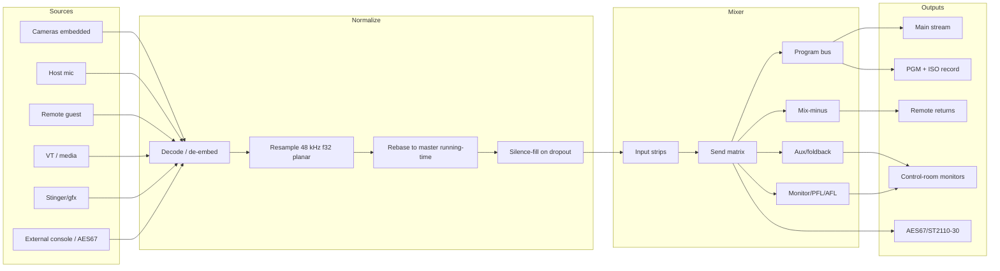

# Multiview — Production Switcher Audio (the live audio mixer layer)

**Area:** Audio / Production switcher (control plane + `multiview-audio` + `multiview-output` + web/)
**Status:** Design brief (Proposed) — docs-only; implementation follows in dependency-ordered waves.
**Drives:** [ADR-0077](../decisions/ADR-0077.md) (input strips + buses + send matrix), [ADR-0078](../decisions/ADR-0078.md) (mix-minus / IFB / talkback safety), [ADR-0079](../decisions/ADR-0079.md) (monitor/PFL/AFL + AFV via the visibility graph + transition de-click/crossfade + output audio-track routing).
**Extends:** [ADR-0059](../decisions/ADR-0059.md) + [production-switcher.md §8](production-switcher.md) (the **first slice**: audio control seam, AFV, master gain/FTB/mute, per-bus audio) — this brief is the **deep mixer extension** of that slice.
**Backlog:** `SWAUD-*` in [`../development/feature-intake-2026-06-13.md`](../development/feature-intake-2026-06-13.md).

> This brief grows Multiview's audio from "whatever audio is embedded in the current picture" into a
> deterministic, routable, meterable, automatable **live audio mixer** with Program, aux, monitor,
> record, and mix-minus busses — implemented Multiview-style: **output-clock driven, gap-free,
> source-supervised, API-first**, on commodity hardware. It is the operator-authored audio
> architecture, formalized and dependency-linked into the existing design.

---

## 0. Relationship to what already exists (read first)

This is **not** a greenfield design. It builds strictly on top of, and must not contradict, the
shipped/planned audio substrate:

- **Lower layer (the substrate it stands on):** per-input audio decode/de-embed; PTS rebasing to the
  common media timeline; **48 kHz resample** with soft drift compensation; **silence-fill on
  dropout**; a Program bus; discrete tracks; **EBU R128 / true-peak metering** — see
  [ADR-R005](../decisions/ADR-R005.md) (discrete per-input audio + program bus + per-output
  capability matrix), [ADR-R006](../decisions/ADR-R006.md) (read-only R128 metering),
  [ADR-M004](../decisions/ADR-M004.md) (audio track-mapping: Source owns attributes, Output owns the
  cross-product), [ADR-T006](../decisions/ADR-T006.md)/[ADR-T008](../decisions/ADR-T008.md) (drift +
  A/V sync), and the program-clock RTP rebase seam [ADR-T013](../decisions/ADR-T013.md).
- **The switcher's audio "first slice":** [ADR-0059](../decisions/ADR-0059.md) +
  [production-switcher.md §8](production-switcher.md) already pin the **audio control seam, AFV,
  master gain/FTB/mute, and per-bus audio** (incl. the `AudioReader` multi-cursor open question,
  production-switcher §19.1). **This brief is the layer above that:** input strips, the send matrix,
  mix-minus/IFB/talkback, monitor/PFL/AFL, and output audio-track routing.
- **Routing & breakaway:** [decoupled-routing.md](decoupled-routing.md) /
  [ADR-0034](../decisions/ADR-0034.md) already provide audio-track→bus crosspoints with **BREAKAWAY**
  and the **RT-9 equal-power cross-fade** pop-avoidance. The send matrix here is the operator-facing
  expression of those crosspoints.
- **Audio-over-IP & calls:** AES67/ST 2110-30 ([ADR-0033](../decisions/ADR-0033.md),
  [aes67-delivery.md](aes67-delivery.md)) and WebRTC returns ([webrtc.md](webrtc.md),
  [ADR-0049](../decisions/ADR-0049.md)) are bus I/O and remote-return endpoints;
  [sip-calling.md](sip-calling.md) adds SIP parties that need mix-minus returns.
- **Media audio:** [media-playout.md §11](media-playout.md) defines media-player audio (VT) which
  becomes an input strip here.

**Invariant posture (non-negotiable):** the **output clock owns time** (inv #1) — audio is sampled,
resampled, and emitted against the master running-time; no input/device/preview/remote ever paces
program output. Metering, UI, monitor, and remote consumers are **read-only / drop-oldest** and can
never back-pressure the mix (inv #10). Every output stays **gap-free** (silence-fill, never a hole).

---

## 1. Design principles

1. **Audio is independent, but video-aware.** Program video and Program audio are separate busses;
   they can follow each other (AFV) but are never hard-bound.
2. **The output clock owns time** (inv #1).
3. **Every output stays gap-free** — input audio loss ⇒ silence for that source; source loss ⇒ tracks
   stay present and time-continuous.
4. **Everything is a bus or a send.** Program, aux, monitor, record, stream, guest return, IFB, and
   mix-minus are all busses; inputs feed busses through explicit sends.
5. **Preview is not on air.** Selecting a source on the switcher **PVW** bus (or in the preview
   subsystem) never puts its audio on Program; preview audio is monitoring (PFL/AFL).
6. **Mix-minus is a first-class routing product** (remote guests, IFB, foldback, talkback, bridges).
7. **Track-layout changes are not casual live edits** — the count/identity of **encoded output
   tracks** is pinned for an output session; changing it is a controlled reset / make-before-break
   ([ADR-R004](../decisions/ADR-R004.md)/[ADR-R010](../decisions/ADR-R010.md),
   [ADR-M012](../decisions/ADR-M012.md) classification).
8. **Meters and compliance are read-only** (inv #10).
9. **Discrete/ISO tracks stay clean by default** — Program processing may gain/EQ/limit; ISO tracks
   default to clean, source-aligned, unprocessed audio (ties [iso-program-recording.md](iso-program-recording.md)).

## 2. Terminology

| Term | Meaning |
| --- | --- |
| **Input strip** | Operator-facing mixer channel for a source or selected source channels. |
| **Source audio** | Audio decoded from a camera/stream/file/media player/capture/AES67/ST2110/generated source. |
| **Program bus / PGM** | Main on-air mix (embedded into the main Program output; stream/record). |
| **Preview audio** | Audio from a source being checked before air — **monitoring only**, not Program. |
| **Aux bus** | Independently mixed bus: speakers/monitors/foldback/clean feed/language/record/return. |
| **Mix-minus / N-1** | A mix minus one or more excluded sources (e.g. Program minus a remote guest's own mic). |
| **PFL / AFL** | Pre/After-fader listen (monitor before/after the fader/processing). |
| **AFV** | Audio-follow-video — a strip's audio reaches Program when its linked video is on air. |
| **IFB** | Interruptible foldback — a return mix that producer/director talkback can interrupt/overlay. |
| **Clean audio** | A mix/track without certain elements (no commentary/talkback/post-processing). |
| **Discrete track** | A separately-encoded audio track/PID/rendition, not summed into the stereo Program mix. |

> **PVW vocabulary:** the switcher's **PVW** bus is *not* the preview subsystem — see
> [production-switcher.md §2](production-switcher.md) and [ADR-P007](../decisions/ADR-P007.md).
> Preview-audio monitoring here is PFL/AFL on the monitor bus.

## 3. High-level signal flow



## 4. Source & input-strip model

A source may contain video, audio, both, or neither — **do not assume every video source has usable
audio**. Each source exposes audio metadata (`has_audio`, `channel_count`, `native_sample_rate`,
`native_layout`, `nominal_level`, `latency_hint_ms`, `status`).

Each operator-facing mixer channel is an **input strip** with, at minimum: source + mono/stereo
channel select; gain/trim; mute; fader; balance/pan; per-input **delay (ms)**; phase invert per
channel; Program mode `off | on | afv`; level meter + clip; **PFL/AFL**; per-bus send enable/level.
Post-MVP: channel matrix, EQ, compressor, gate/expander, limiter, de-esser, sidechain ducking,
high-pass, stereo width/mono-sum, labels, (optional) plugin slots.

```rust
struct AudioInputStrip {
  id: AudioStripId, source_id: SourceId, label: String,
  channel_select: ChannelSelect, channel_matrix: ChannelMatrix,
  delay_ms: f32, trim_db: f32, fader_db: f32, pan: PanMode, mute: bool,
  phase_invert: Vec<u16>, afv: AudioFollowVideoMode,
  processing: StripProcessing, sends: Vec<AudioSend>, meter_taps: MeterTapSet,
}
```

## 5. Internal audio format

`48,000 Hz · f32 planar · explicit channel layout · master running-time clock · small bounded
processing block (~5–10 ms)`. 48 kHz is the production rate even for 44.1/96 kHz or drifting device
clocks — every source is resampled to the internal rate before the send matrix.

The output clock requests the **exact** sample count per output interval; for rates that don't divide
evenly into 48 kHz, counts accumulate via **rational arithmetic, never float** (inv #3):

```rust
fn samples_for_tick(tick: u64, sr: u64, fps_num: u64, fps_den: u64) -> u64 {
  (tick+1)*sr*fps_den/fps_num - tick*sr*fps_den/fps_num   // 59.94 fps ⇒ alternating 800/801; long-run exact
}
```

> **Overflow:** `tick*sr*fps_den` overflows `u64` over long runtimes (a multi-hour `tick` × 48000 ×
> `fps_den` saturates the product), so the implementation widens the accumulator (`u128`, or a
> reset-free rational `(num, den)` accumulator carried across ticks) rather than computing the naive
> `u64` product — checked/widened arithmetic only, never a wrapping multiply.

## 6. Program bus

Stereo by default; master gain; mute/dim; **true-peak limiter**; optional loudness
normalisation/levelling profile; R128/BS.1770 loudness meter; sample-peak + RMS; **FTB audio fade**
integration; macro control; direct routing to stream/record/device outputs. Inputs may be manually
on/off, AFV-, macro-, or sidechain-controlled, or bus-fed (feedback explicitly prevented).

Program is **not necessarily the only on-air bus**: a production may run `pgm_stream`, `pgm_record`,
`pgm_clean`, `pgm_language_1/2`, … For MVP ship **one** stereo Program bus, but model multiple output
busses from the start.

## 7. Audio-follow-video (AFV)

Per-source modes `off | on | afv | macro | auto(future)`. Typical defaults: camera embedded =
`afv`/`off`; presenter/desk mic = `on`; remote guest = `on`/`afv`; VT = `afv` (auto-play); stinger =
`macro`/transition-controlled; lower-third graphic = `off`; external console master = `on`.

**AFV uses the program visibility graph, not just the selected Program source id** — this matters for
PiP/SuperSource/multi-box, DVE layers, keyers, stingers, transitions, and nested M/E
([production-switcher.md §4](production-switcher.md), [ADR-MV006](../decisions/ADR-MV006.md)'s
contributes-to-program derivation is the same graph). A first implementation may use direct Program
source equality, evolving to a `VideoVisibility { source_id, bus_id, visible, opacity, coverage, role }`
derivation. **Apply a short audio ramp even for video cuts** to avoid clicks (reuse the RT-9
equal-power cross-fade, [decoupled-routing.md](decoupled-routing.md)).

| Video action | Default audio behaviour |
| --- | --- |
| Cut | 20–50 ms de-click ramp between AFV sources |
| Mix/dissolve | Configurable constant-power crossfade, ≤ the video transition |
| Dip to colour | No audio dip unless enabled |
| Fade to black | Optional full Program audio fade at the master stage |
| Stinger | Include stinger audio if the asset has audio and the transition enables it |
| **PVW/preview selection** | **No Program audio change** |

## 8. Aux busses

Independent mixes for non-Program outputs (control-room speakers, foldback, guest return, green-room,
record mix, M&E clean mix, language feeds, isolated commentary, comms bridge, AES67/ST2110-30 out).

```rust
struct AudioBus { id, label, kind: AudioBusKind, channel_layout, master_gain_db, mute, dim_db: Option<f32>, processing, meters, outputs }
enum AudioBusKind { Program, Aux, Monitor, Pfl, Afl, MixMinus, Ifb, Record, Stream, Clean, Language }
struct AudioSend { bus_id, enabled, level_db, pan: Option<PanMode>, tap: SendTap }
enum SendTap { PreFader, PostFader, PostProcessing, PostMute }
```

MVP may simplify sends to `Program: off/on/afv + fader`, `Aux A/B: off/on + level`, `Monitor:
PFL/AFL` — but the **state model is a proper send matrix** from the start (the operator-facing
expression of the [ADR-0034](../decisions/ADR-0034.md) audio crosspoints).

## 9. Mix-minus / N-1 (first-class — [ADR-0078](../decisions/ADR-0078.md))

```
Guest 1 return  = Program − Guest 1 mic
Presenter IFB   = Program − Presenter mic + producer talkback
Studio foldback = Program − PA-hostile mics + VT playback
```

Implement as a **bus type**, not one-off hacks:

```rust
struct MixMinusBus { id, base_bus: AudioBusId, excluded_strips: Vec<AudioStripId>, extra_sends: Vec<AudioSend>, talkback_sources: Vec<AudioStripId>, duck_base_when_talkback: Option<DuckSettings> }
```

Two modes: **explicit** (operator selects each return's sends — safest) and **derived** (`return =
program − guest + talkback + cue`, the default for remote-call workflows). **Hard rules:** a
mix-minus bus never feeds itself; bus-to-bus routing has **cycle detection**; a remote source never
receives its own delayed signal unless explicitly overridden; **talkback to IFB/returns can never
leak into Program by accident**; returns support per-destination delay/gain/limiter/mute. Default
remote-guest template wires `guest_N → guest_N_return = pgm − guest_N + producer_talkback` to the
guest's WebRTC/SIP/NDI/SRT return endpoint.

## 10. Monitor, solo, PFL, AFL ([ADR-0079](../decisions/ADR-0079.md))

Control-room + headphone monitor busses; PFL/AFL listen; solo clear; multi-solo; monitor dim/mute;
optional mono check; phase/correlation (future). **PFL/AFL is non-destructive** — soloing never
changes Program/stream/record/guest-returns (inv #10). Preview/PVW selection may optionally cue the
**monitor** bus (`follow_preview_audio_to_monitor = true`) but **never** Program audio.

## 11. VT, graphics, stinger, FTB

- **VT / media playback** ([media-playout.md §11](media-playout.md)) is an audio-capable source:
  cue, load, auto-start-on-take, AFV, pre-roll, clip-end actions (`silence | hold_last+silence | loop
  | stop_and_clear | trigger_macro`), meters before air. The UI must show transport state + whether
  the player is routed to any bus (no "clip playing unheard somewhere").
- **Graphics/stingers:** lower thirds/bugs/clocks default to **no audio**; stinger transitions may
  carry audio if the asset has an audio stream; a DSK/keyer on-air state may *explicitly* activate an
  audio strip but the switcher never infers audio from a keyer being up.
- **FTB:** optionally fades **Program** audio at the master stage (`follow_video_ftb`); by default
  monitor and guest returns are **not** muted by FTB, and dip-to-colour does not fade audio.

## 12. Talkback & IFB (safe by default)

Producer/director mic; momentary + latched talk; route to selected IFB/mix-minus busses; **never to
Program** unless an explicit protected setting allows it; optional Program dim/duck on the target
return during talk; visible "talkback live" status; API/macro + (future) hardware-button support
([control-surfaces-midi.md](control-surfaces-midi.md)).

## 13. External-console workflows

Three styles: **all-in-Multiview** (mics/cams/VT/guests/gfx mixed internally); **external-console
master** (a console makes the main mix, Multiview receives one Program feed + embeds it — embedded
camera audio may be ignored, AFV does not drive Program, delay-compensation preserved); **hybrid**
(console = local studio sound, Multiview = VT/remote/return/embedding). Source roles
`program_master | embedded_source | iso_only | monitor_only | return_only`; per-source delay aligns
the console to video; clear UI warnings when embedded + console audio could double-feed a mic.

## 14. Output routing & transport capability ([ADR-0079](../decisions/ADR-0079.md))

Video and audio output routing are **independent**:

```rust
struct OutputRoute { output_id, video_bus, audio_tracks: Vec<AudioTrackRoute> }
struct AudioTrackRoute { track_id, source_bus: AudioBusId, codec, channel_layout, language: Option<String>, label: Option<String> }
```

e.g. `main_stream.audio.track_1 = pgm_stream`; `recording = pgm_record + host_iso + guest_iso`;
`clean_feed = pgm_clean`; `guest_1_return = guest_1_mix_minus`. Selecting Program video does **not**
auto-select Program audio (though the default route is PGM video + PGM audio). Routes are **validated
against the transport** before going live (extends the [ADR-R005](../decisions/ADR-R005.md) /
[ADR-M004](../decisions/ADR-M004.md) per-output capability matrix):

| Transport | Audio routing implication |
| --- | --- |
| Local device | Physical stereo/multichannel per device |
| Recording file | PGM + ISO tracks (container/codec dependent) |
| MPEG-TS / SRT | Multiple audio PIDs (receiver support varies) |
| HLS / LL-HLS | Exposes **alternate audio renditions** (RFC 8216 `EXT-X-MEDIA` groups); typical clients select one active rendition at playback, so simultaneous multi-track monitoring is not portable |
| RTMP | One Program audio track unless the endpoint explicitly supports more |
| NDI | One multichannel stream (or multiple senders), not N selectable tracks — NDI support is opt-in/**runtime-loaded** (no SDK/spec redistribution; user supplies the licensed runtime); NDI® is a registered trademark of Vizrt NDI AB |
| AES67 / ST 2110-30 | Good fit for separate uncompressed PCM busses over IP |
| WebRTC / SIP returns | Per-participant return busses (usually mix-minus) |

**Changing the number/identity of encoded audio tracks is Class-2** (controlled reset /
make-before-break, [ADR-R010](../decisions/ADR-R010.md), classified by [ADR-M012](../decisions/ADR-M012.md)).

## 15. Loudness, limiting, metering

Per-input pre/post-fader peak/RMS; Program peak/RMS + loudness (momentary/short-term/integrated, true
peak); output-track meters; clip/over + silence detection; phase/correlation (future). **Meter
cadence:** ~10–25 Hz UI telemetry; the hot path never waits for meter consumers (inv #10,
[ADR-R006](../decisions/ADR-R006.md)). Program: internal summing with headroom; master limiter on by
default; optional loudness profile; **no loudness normalisation on ISO/discrete tracks by default**.
Defaults: ~−18 dBFS alignment; streaming target configurable (e.g. −16 LUFS), broadcast (e.g. −23
LUFS, EBU R128); true-peak ceiling configurable (commonly ≤ −1 dBTP). **Loudness targets are an
output profile, never one global hard-code.** (Compliance logging ties
[ADR-MV003](../decisions/ADR-MV003.md).)

## 16. Sync, drift, latency

Per input: PTS rebasing to master running-time; jitter absorption; resample to 48 kHz; soft drift
compensation ([ADR-T006](../decisions/ADR-T006.md)); per-source delay; silence insertion on missing
blocks; no audible drop/duplicate except after real discontinuities. UI per-source delay (≈ −250 ms …
+2000 ms, 1 ms fine) with coarse presets (HDMI camera / USB mic / external console / remote guest)
and an A/V-sync test source (flash+beep). Negative delay is realized by delaying other paths /
pre-buffering — **never by violating the output invariant**. This per-strip delay is the
**per-switcher audio** expression of the layered offset model in
[input-and-consumption-offsets.md](input-and-consumption-offsets.md)
([ADR-T016](../decisions/ADR-T016.md)/[ADR-T017](../decisions/ADR-T017.md)); video offsets and the
per-output / per-layout / universal-input levels live there.

## 17. Data model, config & API sketches

```rust
struct SwitcherAudioState { sample_rate, internal_format, strips: Vec<AudioInputStrip>, buses: Vec<AudioBus>, mix_minus: Vec<MixMinusBus>, monitor: MonitorState, output_routes: Vec<AudioOutputRoute>, meters: MeterConfig, automation: AudioAutomationState }
```

Config is **additive** to the switcher config blocks ([ADR-M012](../decisions/ADR-M012.md)) —
`[audio]` with `[[audio.strips]]`, `[[audio.buses]]` (incl. `kind="mix_minus"` with `base_bus` /
`exclude_strips` / `extra_strips` / `duck_base_when_talkback_db`), and `[[outputs.routes.audio_tracks]]`.
REST verbs sit under `/api/v1/audio/*` (strip gain/mute/afv/delay/sends, bus gain/mute, monitor
solo/clear, talkback press/release, output-routes) consistent with the switcher control surface
([ADR-W021](../decisions/ADR-W021.md)); realtime events (`audio.strip_changed`, `audio.bus_changed`,
`audio.meter_frame`, `audio.clip_detected`, `audio.afv_changed`, `audio.mix_minus_changed`,
`audio.talkback_changed`, `audio.sync_warning`, `audio.transport_capability_warning`) ride the
switcher realtime topic ([ADR-RT008](../decisions/ADR-RT008.md), conflated per
[ADR-RT004](../decisions/ADR-RT004.md)). Macros ([production-switcher.md §10](production-switcher.md),
[ADR-M012](../decisions/ADR-M012.md)) drive audio via `audio.*` commands (strip mode, bus duck/unduck,
waits), and cues ([broadcast-cues.md](broadcast-cues.md)) can `fade audio bus` / `mute-unmute source`.

## 18. UI requirements

Mixer page (strips, Program/aux masters, monitor/PFL/AFL, meters, faders, mute/solo/AFV/on-off, bus
sends, delay/gain quick controls, clip/silence warnings); routing/matrix page (channel select,
strip→bus matrix, bus→output routing, mix-minus templates, transport-capability warnings, track
labels/language); source-details audio tab (format/layout/rate/drift/delay/health/meters/AFV target);
multiview overlays (per-source meter, silence/clip/over, AFV/on/off, PGM/PVW tally, return health).
**Dangerous controls** (talkback, Program routing, output-route + track-layout changes) have clear
visual state + validation — *a producer mic leaking to Program is the kind of failure the UI must
make hard*.

## 19. MVP boundary

48 kHz f32 engine; per-source decode/resample/rebase/silence-fill (substrate, exists); **one** stereo
Program + **one** stereo monitor + **two** stereo aux busses; strips with gain/fader/mute/delay/pan +
mono/stereo select + modes `off/on/afv` (graph-aware AFV per [ADR-0079](../decisions/ADR-0079.md),
falling back to direct Program-source equality where no composition graph is active; short de-click
ramps); Program master gain/mute/limiter/meters; PFL/AFL; one mix-minus template (`Program −
strip + talkback`); VT audio with auto-start-on-take + clip-end silence; FTB audio fade option;
per-output route (video bus + audio bus); WebSocket meter telemetry; REST for all core controls;
transport-capability validation. This is enough for a real small studio.

## 20. Post-MVP & pro

Full send matrix; more aux busses; bus mixer UI; channel matrix; per-strip EQ/dynamics; per-bus
limiter/loudness profiles; sidechain ducking; multiple guest mix-minus returns; IFB panel;
AES67/ST 2110-30 I/O; multitrack recording; language busses; clean-feed variants; per-output loudness
profiles; silence/clip/phase alarms; loudness logging. Pro: NMOS IS-08 channel mapping;
surround/immersive; comms integration; console-protocol integration; plugin hosting; active-speaker
automix; WebRTC echo-cancellation (if not endpoint-handled); compliance reports; hardware surfaces
([control-surfaces-midi.md](control-surfaces-midi.md)).

## 21. Testing & acceptance criteria

1. **Continuous output on input loss** — drop an audio source; Program emits silence for it with no
   PTS gaps / no output-track disappearance.
2. **AFV cut** — Cam1→Cam2 Program audio switches on the take, **not** on PVW change.
3. **AFV transition ramp** — no click/pop; sends ramp per the de-click/crossfade rules.
4. **Always-on mic** — host mic stays on while cameras switch.
5. **VT auto-start** — media-player audio starts on take + routes to Program when AFV on.
6. **FTB** — fades Program audio only when `follow_video_ftb`; monitor/returns unaffected.
7. **Mix-minus** — guest return = Program − that guest; no self-audio leak; bus graph rejects cycles.
8. **PFL/AFL safety** — solo affects only the monitor bus.
9. **Track-layout validation** — adding/removing an encoded track live is classified Class-2.
10. **Long-run drift** — multi-source slight-drift stays aligned over multi-hour soak.
11. **Meter isolation** — meter subscribers can stall/disconnect with zero effect on Program (inv #10).
12. **Talkback safety** — producer talkback cannot reach Program unless explicitly + protectedly routed.

## 22. Decisions (ADRs this brief drives)

- **[ADR-0077](../decisions/ADR-0077.md)** — Switcher audio mixer: **input strips + buses + send
  matrix** (extends the [ADR-0059](../decisions/ADR-0059.md) per-bus audio; the operator-facing
  expression of the [ADR-0034](../decisions/ADR-0034.md) crosspoints; the `AudioReader` multi-cursor
  contention from production-switcher §19.1 is measured before the lane starts).
- **[ADR-0078](../decisions/ADR-0078.md)** — **Mix-minus / IFB / talkback safety**: N-1 as a bus
  type, no self-feed, cycle detection, talkback-never-to-Program, per-return delay/gain/limiter.
- **[ADR-0079](../decisions/ADR-0079.md)** — **Monitor/PFL/AFL + AFV via the visibility graph +
  transition de-click/crossfade + output audio-track routing/validation** against the per-transport
  capability matrix.

## 23. Open questions (honest)

1. **Aux count for the first UI** — 2, 4, or 7? (recommend 2 for MVP, model N).
2. **Program loudness default** — on, or metering + limiter only?
3. **MVP external audio devices** — OS device / USB·CoreAudio·ALSA·PipeWire / AES67·ST2110-30 / file·stream only?
4. **WebRTC return in the first mix-minus, or local/AES67/NDI first?**
5. **First AFV** — direct Program source only, or start with the visibility graph (PiP/SuperSource)?
6. **Plugin hosting** — in scope at all, or native EQ/dynamics only (reliability)?
7. **Default Program loudness profiles** for "web stream" / "broadcast" / "record only"?
8. **`AudioReader` multi-cursor contention** under real per-bus load (production-switcher §19.1) —
   measure before the per-bus lane begins.

## 24. References

Project: [production-switcher.md §8](production-switcher.md), [ADR-0059](../decisions/ADR-0059.md),
[ADR-R005](../decisions/ADR-R005.md), [ADR-R006](../decisions/ADR-R006.md),
[ADR-M004](../decisions/ADR-M004.md), [decoupled-routing.md](decoupled-routing.md),
[media-playout.md](media-playout.md), [aes67-delivery.md](aes67-delivery.md),
[webrtc.md](webrtc.md), [sip-calling.md](sip-calling.md),
[broadcast-cues.md](broadcast-cues.md), [resilience-and-av.md](resilience-and-av.md).
External (behavioural references, conceptual only — vendor-neutral): ATEM/vMix-style per-channel
on/off/AFV + aux busses + PFL/AFL solo + mix-minus; ITU-R BS.1770 / EBU R128 (loudness/true-peak);
SMPTE ST 2110-30 / AES67 (open IP audio); NMOS IS-08 (channel mapping).
