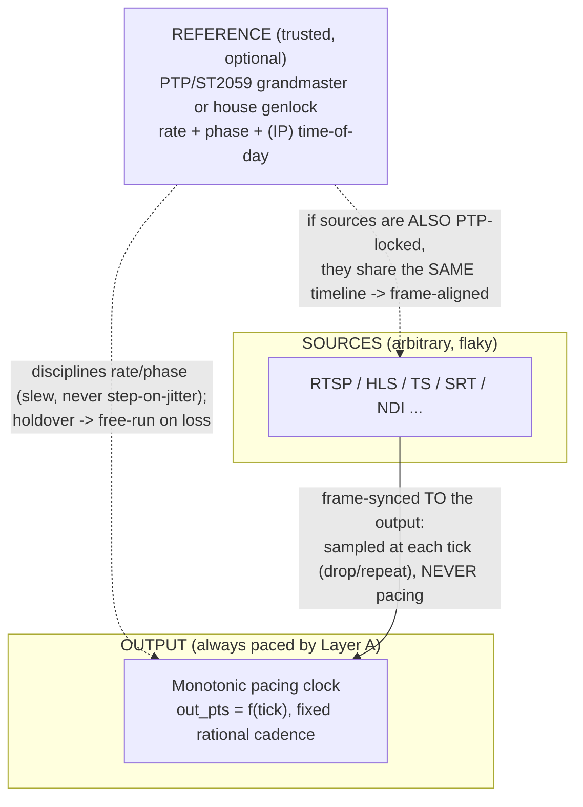

> **Design brief — Streaming/Timing (Unified Timing Architecture).** Authoritative research/design record backing the implementation. Produced by a verification-hardened research workflow (2026-06-03). Canonical crate/API naming lives in [docs/architecture](../architecture/). Decisions derived from this brief: [ADR-0020](../decisions/ADR-0020.md); cross-references [ADR-T001](../decisions/ADR-T001.md), [ADR-T003](../decisions/ADR-T003.md), [ADR-T006](../decisions/ADR-T006.md), [ADR-0018](../decisions/ADR-0018.md). This brief **unifies** (does not contradict) the timing material in [streaming-gotchas.md](streaming-gotchas.md) §0–§7 and [core-engine.md](core-engine.md) §11.

---

# Timing Architecture: Pacing, Reference-Lock, Frame-Sync, Wall-Clock & Timecode

**Audience:** engineers building `mosaic-engine` (clock/runtime/drive/ptp), `mosaic-input` (PTS normaliser + pacer), `mosaic-framestore`, `mosaic-overlay` (timecode), and `mosaic-output` (HLS PROGRAM-DATE-TIME, NDI, RTSP). This is the single place that answers: *given inbound timing information (PTS, embedded timecode, PTP-locked RTP arrival), how — and whether — do we use it to sync sources, and may the output ever be "tied to" timed sources?*

**The answer in one paragraph (the reconciliation).** Mosaic separates **five distinct timing concerns** into layers that never blur. The **pacing clock** (Layer A) is always a fixed-cadence *monotonic* clock and is *never* paced by an input — invariant #1 is absolute. A **reference** (Layer B) — a PTP/ST 2059 grandmaster or house genlock — is a stable, disciplined, low-jitter clock whose only job is to carry rate and phase; it is **categorically not a source**. The output's monotonic cadence *may optionally be disciplined to a reference* (slew, not step) without ever being slaved to program content, and on reference loss it goes to holdover then free-run, so it never falters. **Sources** are always **frame-synced TO the output** (Layer C): each input's PTS/PTP timestamp chooses *which buffered frame to present at this output tick* — phase alignment, A/V sync, and drift absorption by drop/repeat, never by blocking. A **wall-clock** (Layer D, NTP/PTP-disciplined system time) supplies time-of-day for display and HLS `PROGRAM-DATE-TIME` but never paces anything. **Timecode** (Layer E) is a per-frame *label*, neither a clock nor a pacer. "Tying the output to timed sources" is therefore achieved by locking **both** the output and the sources to a **common reference** (Layer B), *not* by slaving the output to a source. This is exactly how professional video has worked for decades and how SMPTE ST 2059 / ST 2110 work today.

---

## 0. Why a reference is not a source (the load-bearing distinction)

Professional video has kept **reference** and **source** categorically separate for decades, and the whole reconciliation rests on it:

- A **reference** is a *stable, disciplined, low-jitter clock* whose only payload is **rate and phase** (and, in IP, time-of-day). Historically: house **genlock** — analog black burst (SD) or **tri-level sync** (HD/3G). In IP: the **PTP** timeline under **SMPTE ST 2059-2**. A reference is engineered to be trustworthy; it does not carry pictures.
- A **source** is *arbitrary, flaky program content* (a camera, an RTSP feed, an HLS playlist, an NDI sender). It carries pictures and may stall, burst, wrap its timestamps (33-bit TS ~26.5 h, 32-bit RTP ~13.25 h), reset, or simply lie about its rate.

> **Genlock** "forces every device to capture and output frames at the exact same microsecond" (phasing); **timecode** "gives every frame a unique name" (a per-frame label). They are "two completely different things." For IP, "PTP carries both absolute epoch time (replacing timecode) and microsecond phase alignment (replacing genlock) over a single Ethernet cable." — *JEM Productions, "Genlock vs Timecode" (accessed 2026-06-03);* corroborated by *B&H eXplora, "Timecode versus Sync"* — timecode "indexes each frame," sync (genlock) "is the beat that calls out when a field occurs."

The industry **never slaves a device's output cadence to a program source.** It locks the output to a **reference**, and frame-synchronises sources onto that output. Mosaic does exactly this. The owner's wish — *"tie the output to timed sources"* — is satisfied by **locking output and sources to one common reference**, which is what makes them frame-aligned. It is *not* satisfied by making a source pace the output (that would reintroduce every failure mode invariant #1 was created to kill: a dead camera freezing the mosaic, a bursting playlist time-warping it).



---

## 1. The five layers

| Layer | Name | What it is | Paces the output? | Default | Pro option |
|---|---|---|---|---|---|
| **A** | **Pacing clock** | One fixed-cadence **monotonic** clock; `out_pts = f(tick)` | **YES — and only this** | `CLOCK_MONOTONIC` free-run | same clock, *disciplined* by Layer B |
| **B** | **Reference-lock** | Optional discipline of A's rate/phase to a trusted reference (PTP/ST 2059) | No (it adjusts A's *rate*, A still owns frame emission) | none (free-run) | PTP/ST 2059-2 servo, slew-not-step, holdover→free-run |
| **C** | **Per-input frame-sync** | The last-good store + sample-at-tick = a frame synchroniser; uses source PTS/PTP to pick which buffered frame to show | **No — sources are sampled, never pacing** | always on (every input) | PTP-common-timeline phase alignment when source + output share a reference |
| **D** | **Wall-clock** | NTP/PTP-disciplined *system* time for time-of-day | **No** | system clock (NTP) | PTP-disciplined system clock |
| **E** | **Timecode** | A per-frame *label* (embedded ATC/VITC/LTC, or generated) | **No** | display embedded-or-generated | output TC + HLS `PROGRAM-DATE-TIME` derived from D |

The cardinal rule across all layers: **only Layer A paces the output, and Layer A is never paced by an input.** Layers B/D discipline *clocks*; Layer C *samples* sources at A's ticks; Layer E *labels* frames. None of B–E can stall or speed up the tick loop.

---

## 2. Layer A — the pacing clock (invariant #1, unchanged)

This is exactly what is already built in `mosaic-engine/src/clock.rs` and specified by [ADR-T001](../decisions/ADR-T001.md):

- **One fixed-cadence monotonic clock.** `out_pts = MediaTime::from_tick(tick, cadence)` — a pure function of the integer tick counter and the exact rational cadence (e.g. `60000/1001`), recomputed exactly via `rescale` every tick, **never float-accumulated** (which would drift ~3.6 s/hour for 29.97) and **never derived from an input**.
- **Monotonic, not wall.** The pacer reads a `MonotonicTimeSource` (`CLOCK_MONOTONIC` on Linux / `mach_continuous_time` on macOS), uses **absolute deadlines** recomputed from the tick counter (so OS sleep jitter cannot cause cumulative drift), and emits exactly one valid, correctly-timestamped frame per tick **forever, independent of any input**.
- **Why monotonic and never wall for pacing:** a wall clock can step (NTP correction, leap second, operator change) and is non-monotonic; pacing on it would inject jitter/discontinuities and risk a non-monotonic output PTS — exactly what `use_wallclock_as_timestamps` does wrong (streaming-gotchas §2). Wall-clock is Layer D, for *labels*, never for *pacing*.

**This layer does not change.** Everything below is *additive* and must preserve it.

---

## 3. Layer B — optional reference-lock (the "tie to timed sources" mechanism)

### 3.1 What "disciplining the pacing clock to a reference" means

Disciplining changes only the **rate** at which Layer A's monotonic time advances relative to wall/reference time; it does **not** change `out_pts = f(tick)` (the cadence stays the exact rational) and does **not** make any input pace the output. Concretely, two things can be referenced-locked:

1. **Frequency (syntonization):** the long-term rate of the output cadence is matched to the grandmaster so the mosaic emits the same number of frames per real second as the rest of the facility — eliminating slow drift over hours.
2. **Phase (genlock):** the output's frame boundaries are aligned to the reference's frame grid. Under **SMPTE ST 2059-1**, the frame grid is *computable from time-of-day alone*: the SMPTE Epoch is `1970-01-01T00:00:00 TAI` (identical to the IEEE 1588 PTP epoch), and "the phase of the video signal is given by time since the Epoch modulo video frame period." A device "calculate[s] how many milliseconds have occurred since the epoch, and then divide[s] the result by [the frame period]"; the remainder gives the distance to the next alignment point. Worked example from the standard: a 25 Hz signal has a 40 ms period with alignment points at 0, 40, 80 ms… since the epoch. — *Artel, "Aligning to the SMPTE Epoch" (citing SMPTE ST 2059-1:2015; accessed 2026-06-03).* So Mosaic can **seed the output clock's origin** onto the ST 2059-1 alignment grid (`AlignmentTime = n × AlignmentPeriod`) at start/relock, then keep pace by syntonization.

### 3.2 The servo: slew, not step (already implemented)

A clock servo corrects **small** offsets by adjusting **frequency** in parts-per-billion (a smooth "slew") and only **steps** (an instantaneous jump) for **large** discontinuities. This is the standard rule:

> "The step threshold of the servo is the maximum offset that the servo corrects by changing the clock frequency instead of stepping the clock… The default [servo] is pi [a PI controller]." — *linuxptp `phc2sys(8)` man page (linuxptp.nwtime.org, accessed 2026-06-03).*

Mosaic's `mosaic-engine/src/ptp.rs` `PtpServo` already implements exactly this: offsets within `step_threshold_ns` are exponentially slewed (a `1/alpha_recip` correction with a ppb frequency estimate), offsets beyond it are stepped (grandmaster change / reset), with a delay-outlier guard. **Slew is what lets a fixed cadence be reference-locked without ever glitching the output** — small corrections are absorbed into the rate, not the picture.

### 3.3 SMPTE ST 2059-2 profile (the IP reference)

ST 2110-10 mandates the **ST 2059-2 profile of IEEE 1588-2008 (PTP)** as the media reference. Verified profile properties (cite at the *secondary-source* confidence noted; the primary PDF is paywalled/large):

- **Fast lock:** "any slave introduced into a network [becomes] synchronized within **5 seconds** and… maintain[s] network-based time accuracy between slaves to within **1 microsecond**" — deliberately tuned for an SDI-like feel. — *Tektronix, "An Introduction to IP Video and PTP" white paper; SMPTE ST 2059-2 (accessed 2026-06-03).*
- **Message rates (typical config, vendor docs):** Sync at log2 interval `-3` (8/s), Delay-Req/Resp `-3` (8/s), Announce `-2..0` (1–4/s), Management ~1/s. — *Juniper "PTP Media Profile", IP Infusion OcNOS ST 2059-2 profile config (accessed 2026-06-03).*
- **Measurement:** Sync / Follow-Up / Delay-Req / Delay-Resp exchanges yield, per exchange, the local↔grandmaster **offset** and **mean path delay** — exactly the `(offset, delay)` pair `PtpSample` models.

> **Confidence note:** the *existence* of the fast-lock (5 s / 1 µs) requirement and the message-rate ranges are **confirmed** across multiple independent secondary sources (Tektronix, Juniper, IP Infusion, Wikipedia "SMPTE 2059"). The *exact* default log2 intervals vary by deployment config and are **deployment-tunable, not a single fixed constant** — treat the numbers above as representative, not normative; the normative source is SMPTE ST 2059-2:2021 (`pub.smpte.org/pub/st2059-2/st2059-2-2021.pdf`).

### 3.4 Holdover and reference loss (the never-falter guarantee, industry-confirmed)

A reference-locked device that loses its reference **does not stop** — it enters **holdover** ("flywheel"): it keeps emitting at the last disciplined rate from its local oscillator, drifting only as fast as that oscillator allows, then eventually **free-runs**.

> "Holdover provides continuation of operation for a period of time in the event of loss of a reference clock input… Sometimes called flywheel mode." Holdover quality scales with oscillator stability: TCXO ≈ 10 ms/day; premium OCXO ≈ 80 µs/day; Rubidium ≈ 5 µs/day. — *TimeTools, "What is Holdover"; Microsemi/Microchip rubidium-holdover app note (accessed 2026-06-03).*

The **direct software analog** — and the precedent for Mosaic — is **NDI Genlock**: a software app with no internal timebase locks frame rate + frame-start-times to a reference, and:

> "If the genlock clock cannot correctly genlock to an NDI sender for some reason it will fall back to using the system clock and so can continue to work reasonably." — *NDI Advanced SDK "Genlock" docs (docs.ndi.video, accessed 2026-06-03).*

**Mosaic's holdover ladder (preserves invariant #1):**
1. **Locked:** servo slews the output cadence's rate toward the reference; phase aligned to the ST 2059-1 grid at relock points only.
2. **Holdover:** reference lost → freeze the last good frequency estimate; keep emitting on the local monotonic oscillator. (Commodity TCXO drift is tens of ppm — irrelevant to the never-falter guarantee over a single outage; it is the same monotonic clock Mosaic already free-runs on.)
3. **Free-run:** prolonged loss → revert to undisciplined `CLOCK_MONOTONIC` (the **default mode**). The output **never stalls, never steps the picture** at any transition because the cadence is always `out_pts = f(tick)`; only the *rate* of `tick` advance changes, and only by a slew.
4. **Re-lock:** a returning/better grandmaster is adopted via the servo's step path (the BMCA selects the best master; the servo treats the resulting large offset as a step of the *reference estimate*, then resumes slewing). Crucially, **the output clock origin is not re-stepped mid-run** unless an operator explicitly requests a phase re-jam — a phase jam is a Class-2 (controlled-reset) change, not a hot change, because it shifts frame boundaries.

> **Why this honours invariant #1:** the servo and reference live *beside* the pacer, not *in front of* it. `mosaic-engine/src/ptp.rs` already documents this: "PTP does **not** pace the output clock… a drifting, jittering, or absent grandmaster changes only the reference estimate this servo reports; it does **not** change how many frames the output emits, nor when." A reference is *trusted infrastructure*; a source is *untrusted content*. Disciplining a fixed cadence to trusted infrastructure (with holdover) is genlock; slaving it to untrusted content is the failure invariant #1 forbids.

---

## 4. Layer C — per-input frame-sync (using a source's timing to sync it)

This is the layer that **uses** inbound timing (PTS, and optionally PTP-derived arrival time) to *sync sources properly* — and it does so **without ever pacing the output**. It is already the design in [ADR-T002](../decisions/ADR-T002.md), [ADR-T003](../decisions/ADR-T003.md), [ADR-T008](../decisions/ADR-T008.md), streaming-gotchas §0–§1/§7, and core-engine §11; this brief names it precisely as a **frame synchroniser** and details how a source's timestamp is *used*.

> **Input-side deep dive:** [input-timing-and-sync.md](input-timing-and-sync.md) ([ADR-0021](../decisions/ADR-0021.md)) is the definitive design for the *ingest half* of this layer — per-frame `best_effort_timestamp` acquisition, the `PtsNormalizer`, the wall-clock `Pacer`, the sample-at-tick rule, and the deterministic test matrix. It diagnoses and fixes the *ultra-fast-then-freeze* file/VOD bug (the running ingest loop bypassed the normaliser/pacer).

### 4.1 A frame synchroniser is exactly the right model

A broadcast **frame synchroniser** sizes a buffer ≥1 frame to absorb the offset/drift between an **asynchronous input** and a **reference-locked output**, and **drops or repeats** whole frames to maintain sync (interpolation is rare/optional for video). The software analog is NDI Frame Synchronization: video uses hysteresis to "drop or insert a video frame," "the same frame can be returned multiple times if duplication is needed," and returns a last-good/empty frame when none has arrived; audio uses *dynamic resampling*, not drop/insert. — *NDI Advanced SDK "Frame Synchronization" (docs.ndi.video); US patents 4,646,151 / 6,195,393 (accessed 2026-06-03).* This **is** invariant #2: the compositor samples last-good-or-placeholder at each output tick and never blocks.

### 4.2 How a source's PTS/PTP timestamp is *used* per tick

After the per-input normaliser (Layer-C input, ADR-T003: 33-bit/RTP unwrap → genpts fallback → monotonic guard → rebase to one internal ns timeline → discontinuity re-anchor), each frame lands in the per-tile store stamped with its **normalised `media_time`**. At each output tick `N` (target `t_N = N · den/num` ns on the internal timeline):

```
f = frame_store[i].nearest_at_or_before(t_N)     // pick which buffered frame this tick should show
if f is None: f = frame_store[i].last_good()      // HOLD on starvation — never block
composite(f)
```

This single rule delivers, *for free*, everything the owner means by "sync them properly":
- **Phase alignment** — each source is presented at the output tick whose time it best matches; bursting sources collapse to newest-wins, slow sources hold.
- **A/V sync** — audio is carried through the *same* rebasing as its video (ADR-T008) and mixed/resampled on the master running-time, keeping skew inside the EBU R37 window (−45 ms..+125 ms; bias audio slightly late). Lip-sync for separate RTP A/V sessions is recovered via RTCP SR (NTP↔RTP), then rebased — see §4.3.
- **Drift absorption** — independent source crystals drift tens–hundreds of ppm; the nearest-at-or-before sampling *is* continuous drop/repeat, and audio uses continuous soft resampling (ADR-T006). Align-once-at-startup glitches within minutes; continuous correction is mandatory (core-engine §11).

### 4.3 When a source carries *trusted* timing (PTS vs PTP-locked RTP arrival)

There are two qualitatively different kinds of inbound timing, and they are used differently:

- **Untrusted source timestamps (the common case): PTS / PCR / RTP timestamp from arbitrary RTSP/HLS/TS/SRT/RTMP.** These are *content* timestamps. Use them only to **order and phase frames within that one source** (which frame is "next," how far apart frames are) and to drive the input pacer and A/V alignment. **Never** map them onto the output cadence as a pacing signal, and **never** compare raw PTS *across* sources (different epochs/clocks). This is the conservative default and the only safe assumption for internet/CDN inputs.
- **Trusted, reference-locked source timing: PTP-locked RTP arrival under ST 2110-10.** When a source is genuinely PTP-locked to the **same** grandmaster as the output, its RTP timestamps are *on the common PTP timeline*:

  > "SMPTE ST 2110-10 describes a system timing model based on RTP timestamp values in the RTP packet headers and a common reference clock… distributed… via IEEE 1588-2008 PTP." "For a successful synchronisation, all devices creating RTP timestamps must use the same time base as the devices consuming the RTP streams." ST 2110-10 distinguishes **synchronous** senders (PTP-aligned) from **asynchronous** senders (not time-aligned, requiring frame synchronisation). — *SMPTE ST 2110-10:2022 (pub.smpte.org); Riedel "PTP Within ST2110 Deployments"; Macnica ST2110 primer (accessed 2026-06-03).*

  For such a source, Mosaic can map its RTP timestamp to the **same internal timeline** the output clock is disciplined to (both are functions of the one grandmaster) and pick the frame for tick `N` by **true common-timeline phase**, not just per-source ordering — i.e. genuinely frame-aligned multi-source compositing. **This is the technical content of "tying the output to timed sources": output and sources are both locked to the common reference, so sampling at the output tick lands on matching source frames.** Critically, this is *still* Layer C — the source is *sampled*, never pacing; if a PTP-locked source dies, it falls back to hold-last-good exactly like any other tile. ST 2110-10 itself confirms receivers actively *realign* flows (to absorb differing path delays) rather than assuming wire-level alignment — i.e. a frame synchroniser is still required even on a PTP fabric.

> **Mapping rule:** trust a source's timestamp *as a common-timeline reference* **only** when it is verifiably ST 2110/PTP-locked to the output's grandmaster (NMOS/SDP signalling or operator assertion). Otherwise treat it as an untrusted per-source PTS. When in doubt, treat as untrusted — the frame synchroniser is correct in both cases; the only difference is whether cross-source phase is meaningful.

---

## 5. Layer D — wall-clock reference (time-of-day; task #30)

This layer fills the documented gap (roadmap "loosely disciplined to wall-clock"; codebase task #30): a **time-of-day** source, *separate from the pacing clock*, for human-facing time and protocol date stamps.

- **What it is:** the **system clock** (`CLOCK_REALTIME` / `gettimeofday`), disciplined by **NTP** (default, commodity) or **PTP** (pro). It is the answer to "what UTC time is it now," not "when is the next frame due."
- **Why it is *not* Layer A:** the system clock can **step** (NTP correction, leap second, operator change) and is non-monotonic. Pacing on it would jitter/discontinue the output. So Layer D is **read for labels only** and is never on the data-plane critical path.
- **How it is anchored to the media timeline:** keep a single, occasionally-refreshed mapping `(monotonic_tick_origin ↔ UTC)` captured at start and re-anchored on large wall-clock steps (mirrors ADR-T003's monotonic→UTC anchoring for HLS). Time-of-day for any tick `N` is then `UTC_origin + (t_N − t_origin)`, computed from the **monotonic** timeline so it is smooth, then offset to UTC — *never summed from segment durations* (which drifts).
- **Uses:**
  - **HLS `EXT-X-PROGRAM-DATE-TIME`:** "an informative mapping of the (wall-clock) date and time… to the first media timestamp in the segment… always indicate[s] the UTC timezone." Live ingest "requires… (wall-clock) time in UTC." — *RFC 8216 / draft-pantos-hls-rfc8216bis-17; Unified Streaming "Recommendations for Live" (accessed 2026-06-03).* Anchor PDT to the monotonic→UTC map (streaming-gotchas §4).
  - **On-screen clock overlays** (TOD), telemetry timestamps, logs, the "TOD-run" timecode generator (§6), and NDI frame timestamps.
- **Default vs pro:** default = NTP-disciplined system clock (good to single-digit ms, ample for TOD/PDT). Pro = the **same PTP grandmaster** disciplines both the system clock (Layer D) and the pacing-clock reference (Layer B), so labels and pacing share one time base — the ST 2110 facility model.

---

## 6. Layer E — timecode (a label, not a clock)

Timecode is a **per-frame identifier** (`HH:MM:SS:FF` + drop-frame flag), already modelled in `mosaic-overlay/src/timecode.rs`. It is neither a pacer (Layer A) nor a time-of-day clock (Layer D); it is metadata that *labels* frames. Two roles:

- **Embedded timecode (ingest):** carried in the source as **ATC/RP 188** (ancillary, SMPTE ST 12-1/-2/-3), **VITC** (vertical interval), or **LTC** (separate audio track). Mosaic decodes it and can display the source's own house clock per tile (`TimecodeModel::displayed` prefers embedded when present). Embedded TC is **information about the source**, not a sync signal — two cameras can share identical timecode yet be phase-misaligned (which is *why* genlock exists alongside timecode; §0). So embedded TC is for **display / logging / alignment metadata**, never for pacing or for cross-source phase.
- **Generated timecode (output):** Mosaic generates the output program timecode from **Layer A** (the tick counter → `Timecode::from_frame_count`, exact integer arithmetic, NTSC drop-frame labelling for 29.97). Three run modes, mirroring broadcast generators:
  - **Record/free-run:** counts ticks from a chosen start (e.g. `00:00:00:00`) — derived purely from Layer A.
  - **Time-of-day (TOD) run:** the displayed `HH:MM:SS` tracks **Layer D** (wall-clock UTC/local), with `FF` derived from the tick phase. This is the only mode that couples TC to wall time, and it does so for the *label*, never the pace.
  - **Jam/sync to reference:** in a pro PTP facility, the output TC is jammed to the ST 2059 daily-jam time so the program TC matches the facility — again a label aligned to Layer B/D, computed via Layer A's tick phase.

> **The clean separation:** Layer A says *when* a frame is emitted; Layer D says *what UTC time it is*; Layer E says *what this frame is called*. They are computed from each other (E and D are derived from A's monotonic tick, offset to UTC) but never feed back into A's pacing.

---

## 7. The two operating modes

### 7.1 Default mode (commodity — the shipping default)

- **A:** free-run `CLOCK_MONOTONIC`, fixed rational cadence. (Unchanged; ADR-T001.)
- **B:** **off** (free-run). No PTP NIC required; nothing to configure.
- **C:** per-input frame-sync **on for every input**, using **untrusted per-source PTS** (ADR-T002/T003/T006/T008). Cross-source phase is best-effort (nearest-frame); this is correct and bulletproof for RTSP/HLS/TS/SRT/RTMP/NDI.
- **D:** NTP-disciplined system clock for TOD overlays and HLS `PROGRAM-DATE-TIME` (monotonic→UTC anchored).
- **E:** display embedded-or-generated TC; generate output TC from A (free-run or TOD-run).

This is the entire current design — the layered model **does not change anything** for commodity deployments. It simply *names* the layers so the pro mode can be added without touching invariant #1.

### 7.2 Pro mode (IP broadcast / ST 2110 facility — opt-in, feature `ptp`)

- **A:** same monotonic pacer, now **disciplined** by B (slew-not-step), origin optionally seeded to the ST 2059-1 alignment grid.
- **B:** **on** — `PtpServo` driven by a real PHC behind the `ptp` feature; holdover→free-run on loss (§3.4).
- **C:** PTP-locked sources mapped to the **common** timeline → true frame-aligned multi-source compositing (§4.3); non-PTP sources still frame-synced as untrusted. Either way, sources are sampled, never pacing.
- **D:** the **same** grandmaster disciplines the system clock → labels and pacing share one base.
- **E:** output TC jammed to the facility (ST 2059 daily jam); embedded source TC displayed as before.

In pro mode, "the output is tied to the timed sources" is **true and correct** — because both are tied to the *common reference*, not to each other. Invariant #1 is untouched: a dying source still holds-last-good; a vanishing grandmaster still goes to holdover then free-run.

---

## 8. Explicit answers to the four owner questions

1. **If inbound sources carry timing (PTS, embedded timecode, PTP-locked RTP arrival), should/can we use it to sync them properly? How?**
   **Yes — in Layer C (per-input frame-sync), never to pace the output.** Every source's normalised PTS is *used* to choose which buffered frame to present at each output tick (phase alignment), to carry A/V together (lip-sync within EBU R37), and to absorb drift via drop/repeat (video) + soft resample (audio). For a source that is **verifiably PTP-locked to the output's grandmaster** (ST 2110-10), map its RTP timestamp onto the *common* timeline and align by true cross-source phase; for everything else, treat the timestamp as untrusted per-source ordering. Embedded timecode is used as a **display/alignment label**, never as a sync clock (two feeds can share TC yet be out of phase). The mechanism is the frame synchroniser (invariant #2): sample-at-tick, hold-last-good, never block.

2. **Timecode vs wall-clock — what's the difference and how does each flow through?**
   **Timecode (Layer E) is a per-frame *label* (`HH:MM:SS:FF`); wall-clock (Layer D) is *time-of-day* (UTC).** Wall-clock flows in as the NTP/PTP-disciplined *system* clock, is anchored to the media timeline via a monotonic→UTC map, and flows out to HLS `PROGRAM-DATE-TIME`, TOD overlays, logs, and NDI timestamps — it **never paces**. Timecode flows in *embedded* (ATC/VITC/LTC) for per-tile display/logging, and is *generated* on output from the tick counter (free-run, TOD-run sourced from Layer D, or jammed to the facility). Both are *derived from / aligned to* the monotonic pacing clock and the wall-clock; neither feeds back into pacing.

3. **The output free-runs on a monotonic clock today; when we HAVE timed sources, should the output be tied to them? How, without breaking the never-falter guarantee?**
   **Yes — by disciplining the output's monotonic cadence to a trusted *reference* (PTP/ST 2059) that the sources are *also* locked to, not by slaving the output to any source.** The pacing clock stays `out_pts = f(tick)`; the servo only adjusts the *rate* of tick advance and (at relock points) phase, always by **slew, not step** for normal corrections. The never-falter guarantee is preserved by the **holdover→free-run ladder**: reference loss → hold last frequency on the local oscillator → revert to free-run monotonic; the picture never stalls or steps because only the cadence *rate* changes, never the per-tick emission. A source dying still holds-last-good. This is genlock applied to a software output, with NDI Genlock's "fall back to the system clock and continue reasonably" as the direct precedent.

4. **What is industry best practice?**
   **Separate reference from source; lock the output to a *reference*; frame-synchronise *sources* onto the output.** In IP this is **SMPTE ST 2059-2 PTP** (5 s fast-lock, 1 µs inter-slave) as the single facility reference under **ST 2110-10**, with the **ST 2059-1 SMPTE-Epoch** giving every device a computable frame grid from time-of-day; RTP timestamps are derived from that common PTP clock so PTP-locked senders/receivers are frame-aligned, while a frame synchroniser still absorbs path-delay differences. Output devices that lose the reference go to **holdover then free-run** (oscillator-stability-bounded) — they never stop. This is precisely Mosaic's monotonic-pace + optional-reference-lock + per-input-frame-sync model. Best practice explicitly does **not** pace a device's output from program content — which is what makes invariant #1 *aligned with* the industry, not in tension with it.

---

## 9. Cross-references, gaps, and unverified items

**Unifies / does not contradict:** [streaming-gotchas.md](streaming-gotchas.md) §0–§7 (the three-stage PTS pipeline, drop/repeat, drift loop, A/V sync, HLS PDT) and [core-engine.md](core-engine.md) §11 (master clock, per-tile FrameSync, deadline-driven compositor). It *names the layers* and *adds* Layers B/D as the optional/explicit pieces those docs flagged ("if exactly one PTP-locked authoritative feed exists, a hybrid… is an option"; "loosely disciplined to wall-clock").

**ADRs:** new [ADR-0020](../decisions/ADR-0020.md) records the layered model; it builds on [ADR-T001](../decisions/ADR-T001.md) (Layer A), [ADR-T003](../decisions/ADR-T003.md) (Layer C input), [ADR-T006](../decisions/ADR-T006.md) (Layer C drift), and relates to [ADR-0018](../decisions/ADR-0018.md) (which already references the `ptp.rs` servo for placement, not timing).

**Confirmed (current, dated, authoritative):** SMPTE Epoch = 1970-01-01 TAI and the modulo-period frame-grid computation (Artel / SMPTE ST 2059-1:2015); ST 2059-2 fast-lock 5 s / 1 µs (Tektronix / SMPTE); ST 2110-10 RTP-from-PTP + synchronous-vs-asynchronous senders + receiver realignment (SMPTE ST 2110-10:2022 / Riedel / Macnica); genlock-vs-timecode and PTP-replaces-both (JEM Productions / B&H); slew-not-step / step_threshold (linuxptp `phc2sys(8)`); holdover→free-run and oscillator stability (TimeTools / Microchip); NDI Genlock + Frame Sync software fallback (docs.ndi.video); HLS PDT = UTC wall-clock mapping (RFC 8216 / rfc8216bis-17).

**Unverified / deployment-tunable (do not assert as fixed constants):**
- The *exact* ST 2059-2 default PTP message log2 intervals (Sync `-3`, Announce `-2..0`, etc.) vary by config; confirm against SMPTE ST 2059-2:2021 and the deployed grandmaster, not against this brief.
- Commodity-host oscillator stability (no OCXO/rubidium) means **Mosaic's holdover is only as good as a TCXO/`CLOCK_MONOTONIC`** — acceptable for never-falter (it is the same clock we free-run on) but **not** facility-grade phase holdover; do not promise sub-µs holdover without dedicated timing hardware.
- Whether to *seed* the output clock origin to the ST 2059-1 grid at startup (one-time anchor) vs only syntonize: leave to config; a phase re-jam mid-run is a **Class-2** change (shifts frame boundaries), not hot.
- Real PHC binding (`ptp.rs` `phc` module) is **compile-verified only** in this environment (no PTP NIC); the servo math is unit/property tested. Hardware lock/holdover behaviour must be validated on a real ST 2059 fabric before any pro-mode promise.

---

## Sources

- Artel, "Aligning to the SMPTE Epoch for Synchronization" — https://www.artel.com/blog/aligning-to-the-smpte-epoch-for-synchronization/ (accessed 2026-06-03; cites SMPTE ST 2059-1:2015)
- SMPTE ST 2059-1 Revision draft (2021) — https://pub.smpte.org/pub/st2059-1/st2059-1-2021.pdf
- SMPTE ST 2059-2:2021, PTP profile for IEEE-1588 in broadcast — https://pub.smpte.org/pub/st2059-2/st2059-2-2021.pdf
- Tektronix, "An Introduction to IP Video and Precision Time Protocol" white paper — https://download.tek.com/document/1602_AM_TEK_VIDEO_IP_MIGRATION_WP_2cw-60360-0.pdf
- Juniper Networks, "PTP Media Profile (Junos OS)" — https://www.juniper.net/documentation/us/en/software/junos/time-mgmt/topics/concept/ptp-media-profile.html
- IP Infusion OcNOS, "PTP SMPTE Profile (ST 2059-2)" — https://docs.ipinfusion.com/service-provider-6.5/OcNOS_SP/PTP-Config/Timing_profile_SMPTE_2059-2.html
- SMPTE ST 2110-10:2022, System timing and definitions — https://pub.smpte.org/pub/st2110-10/st2110-10-2022.pdf
- Riedel, "PTP Within ST2110 Deployments" — https://www.riedel.net/fileadmin/user_upload/800-downloads/07-Guides/PTP_Within_ST2110_Deployments.pdf
- Macnica, "Basics of Media over IP SMPTE ST2110 — Part 3" — https://www.macnica.co.jp/en/business/semiconductor/articles/basic/141502/
- JEM Productions, "Genlock vs Timecode — Broadcast Sync, PTP & Tri-Level Explained" — https://jemproductions.fi/guides/what-is-genlock-vs-timecode/
- B&H eXplora, "Timecode versus Sync: How They Differ" — https://www.bhphotovideo.com/explora/video/tips-and-solutions/timecode-versus-sync-how-they-differ-and-why-it-matters
- linuxptp, `phc2sys(8)` man page — https://linuxptp.nwtime.org/documentation/phc2sys/
- TimeTools, "What is Holdover in Time Synchronization Applications?" — https://timetoolsltd.com/time-sync/what-is-holdover-in-time-synchronization-applications/
- Microsemi/Microchip, "Rubidium Holdover for PTP Phase Synchronization Applications" app note — https://syncworks.com/wp-content/uploads/2023/06/Microsemi_Rubidium_Holdover_for_PTP_Phase_Synchronization_Applications_A.pdf
- NDI Advanced SDK, "Genlock" — https://docs.ndi.video/all/developing-with-ndi/advanced-sdk/genlock
- NDI Advanced SDK, "Frame Synchronization" — https://docs.ndi.video/all/developing-with-ndi/advanced-sdk/ndi-sdk-review/video-formats/frame-synchronization
- IETF RFC 8216 (HTTP Live Streaming) and draft-pantos-hls-rfc8216bis-17 — https://datatracker.ietf.org/doc/html/draft-pantos-hls-rfc8216bis-17
- Unified Streaming, "Recommendations for Live" — https://docs.unified-streaming.com/best-practice/live.html
