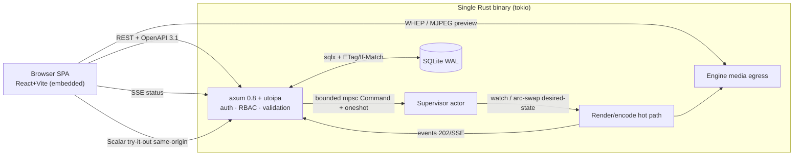

> **Design brief — Web/API Stack.** Authoritative research/design record backing the implementation. Produced by a verification-hardened multi-agent research workflow (2026-06-02). Canonical crate/API naming lives in [docs/architecture](../architecture/). ADRs derived from this brief are in [docs/decisions](../decisions/).

---

# Management Layer — Locked Stack Brief (Web App + API)

**Scope:** Technology-stack decisions ONLY for the management web app + HTTP API of the Rust live video multiview engine. The REST resource model, realtime/WebSocket protocol, and preview subsystem are designed in **separate authoritative briefs** — referenced here at overview level only.

**Verdict:** All load-bearing claims confirmed by verification. The single product (engine + API + SPA) ships as **one tokio-based Rust binary**.

---

## (a) Rust Web/API Framework — **axum 0.8.x** ✅ LOCKED

Built by the Tokio team on tokio/tower/hyper, so the API shares the engine's existing tokio runtime with **zero second runtime / actor layer**. State sharing is idiomatic `Arc<AppState>` + `with_state` holding the engine's mpsc/watch/broadcast channels. First-class WebSocket + SSE + streaming bodies; full tower-http middleware (CORS, trace, compression, timeout, rate-limit, auth). Largest ecosystem.

- **actix-web** rejected: ~10-15% faster under saturation but its own runtime + actor-influenced model adds friction sharing tokio engine state; not worth it for a single deployable.
- **poem + poem-openapi** is the strong runner-up BUT **verified to emit OpenAPI 3.0.0 only** (hardcoded `OPENAPI_VERSION = "3.0.0"` in `registry/ser.rs`). Disqualified given the 3.1 requirement.
- *Gotcha:* axum 0.8 path syntax is `/{name}` (not `/:name`); ws `Message` is `Bytes`/`Utf8Bytes`. Pre-0.8 snippets won't compile.

## (b) OpenAPI 3.1 + Interactive Docs + Typed Client — **utoipa 5.x + utoipa-axum 0.2 + Scalar** ✅ LOCKED

Code-first, compile-time **OpenAPI 3.1** (verified: `OpenApiVersion` has only `Version31` → `"3.1.0"`; no 3.0 mode). `OpenApiRouter` + `routes!` register `#[utoipa::path]` handlers; `split_for_parts` yields **both** the axum `Router` and the `OpenApi` object — single source of truth, no doc drift.

- **Try-it-out:** **utoipa-scalar (primary)** — embeds assets, no build-time download, served **same-origin** with the API. **utoipa-swagger-ui (secondary)**, must use the **`vendored`** feature (otherwise it does a build-time network download that breaks sandboxed/offline container builds).
- **Scalar same-origin caveat (verified, corrected):** same-origin alone does NOT disable Scalar's default external `proxy.scalar.com`. Use **relative `servers` URLs** (resolve against `window.location`) AND set `proxyUrl` to a same-origin path (or disable it) AND emit CORS headers. The toggle is the resolved request URL being relative + `proxyUrl`, not UI origin-equality.
- **Typed client:** export the `OpenApi` object to JSON → generate the SPA's client with **openapi-typescript + openapi-fetch** (lightweight, type-only) or **Orval** (TanStack Query hooks + MSW mocks). Same spec backs external SDKs via openapi-generator (confirm 3.1 input support).
- *Sharp edge:* polymorphic Source/Output schemas → use serde `untagged` + explicit discriminator mapping for clean `oneOf` (utoipa #1456). Validate the generated spec in CI early.

## (c) Frontend — **React 19 + TS + Vite + shadcn/ui (Radix + Tailwind v4) + TanStack Query** ✅ LOCKED

Deepest ecosystem for the polish-critical, component- and canvas-heavy parts. shadcn/ui = copy-in source (no lock-in), Radix gives WCAG/WAI-ARIA + keyboard/focus for free, Tailwind v4 OKLCH tokens + `.dark` override = coherent light/dark theming. TanStack Query for all server state; **TanStack Table** for source/output lists. SvelteKit runner-up (thinner DnD/canvas ecosystem); Leptos/Dioxus rejected (immature UI/a11y/editor tooling — the editor is the highest-polish surface).

## (d) Layout Editor — **react-konva (canvas) + dnd-kit** ✅ LOCKED

The product is a **GPU compositor** outputting broadcast formats (RTMP/SRT/NDI) → a free-form compositing paradigm (overlap, z-order, rotation, sub-pixel placement). Konva natively provides drag, Transformer resize/rotate, layer z-order, hit detection. **dnd-kit** for the accessible source-palette → canvas drag and reorderable lists.

- **react-grid-layout rejected** (verified refutation): no rotation, no native z-index control, overlap is a bolted-on workaround. Only correct if layouts were a strict non-overlapping grid — they are not.
- ⚠️ **Confirm with engine team** the compositor supports overlap/z-order/rotation (expected yes). A production canvas editor is months of work — budget it.

## (e) Auth / Security — Dual-credential on one axum server ✅ LOCKED

- **Web UI:** signed+encrypted private cookie sessions via **tower-sessions** (HttpOnly + Secure + SameSite=Lax/Strict) + **CSRF synchronizer token** (axum-csrf-sync-pattern) on state-changing requests. SameSite alone is NOT sufficient CSRF defense.
- **Machine/API:** long random **API keys (Bearer)**, stored as **SHA-256/HMAC** hashes (high-entropy → no slow KDF), shown once at creation. Human passwords (if any) → **Argon2id** (OWASP params).
- **RBAC** admin/operator/viewer via **axum-login** (`AuthnBackend`/`AuthzBackend`, `permission_required`); Casbin only if policy outgrows static roles. **BOLA (OWASP API1) is the #1 risk** — per-object authz check on every source/output/template/preview ID, not just role gating.
- **Rate-limit** auth endpoints with **tower-governor**. **CORS** locked to the app origin (never `*` with credentials; same-origin docs ⇒ minimal CORS).
- **TLS:** front with **Caddy** (auto Let's Encrypt) for internet-exposed installs; built-in **rustls** self-signed/operator-cert path for air-gapped. **OIDC/SSO** (axum-oidc) optional add-on, not the default.
- **Secrets:** wrap source-URL creds (RTSP/SRT/RTMP/NDI) in **secrecy::SecretString** (zeroize, redacted Debug), encrypt at rest, write-only/masked in the API — never echo back. Live-preview access gated by **short-lived signed tokens** over HTTPS/WSS.

## (f) Config Persistence — **SQLite via sqlx** + config-as-code ✅ LOCKED

sqlx 0.8.x: async, compile-time-checked queries, migrations, transactional multi-resource updates (needed for atomic relayout), single-file backup. Enable **WAL + busy_timeout**. Each mutable resource carries a monotonic version → **ETag/If-Match** optimistic concurrency (412 on mismatch) so two operators can't clobber a layout. **sled rejected** (unstable on-disk format). **config-as-code:** `GET/PUT /config:export|:import` as one versioned validated JSON/TOML doc (GitOps, DR, reproducible installs).

## (g) Engine Command Bus — actor + lock-free hand-off ✅ LOCKED

The HTTP layer is a **thin shell**; it NEVER touches render/encode threads directly. Validated request → **bounded `mpsc` Command** (+`oneshot` for sync reply, `try_send`→429/503 on overload) → **supervisor actor** (Ryhl task+handle) → desired-state pushed to the render loop via **`tokio::watch` / arc-swap / triple-buffer** (`borrow_and_update` once per frame, never blocks/awaits). `CancellationToken` for teardown. Async reconfig (source-swap/relayout) returns **202 + operation id**; final outcome arrives on the SSE event stream after the engine applies it at a frame boundary. Idempotency-Key on start/stop/swap.

## SPA Build/Serve — **embed in binary (rust-embed / axum-embed)** ✅ LOCKED

Vite build embedded at compile time + SPA fallback handler → index.html for client routes. One process, one port, sub-1MB bundle = negligible bloat. Honors the single-deployable constraint. tower-http `ServeDir` cannot serve embedded files → must use rust-embed. Wire the Vite build into the cargo build so embedded assets stay current.

---

## Realtime & Preview (overview only — see dedicated briefs)

- **Status/state push:** **SSE** (axum `Sse` + `KeepAlive`, fed by `tokio::broadcast`), over HTTP/2; WebSocket only for high-rate client→server control. *Detail deferred to the realtime-protocol brief.*
- **Live multiview preview:** **WebRTC/WHEP** for sub-second (gst-plugins-rs `whepserversink` shipped in 0.14 / GStreamer 1.28; works on Linux/NVIDIA `nvh264enc` + macOS `vtenc_h264_hw`), with **MJPEG/periodic-JPEG** zero-JS fallback that always ships (works where UDP/TURN is blocked). A low-fps confidence preview MAY ride the JSON API as base64 JPEG; only smooth sub-second motion needs the media egress. *Detail deferred to the preview-subsystem brief.*

---

## Key Screens

1. **Dashboard / Health** — per-tile FPS/bitrate/up-down, alerts (SSE-driven TanStack Query cache).
2. **Live Multiview Preview** — WebRTC `<video>`, per-tile crops from the single multiview frame.
3. **Layout/Template Editor** — react-konva canvas, snap, resize/rotate, z-order, palette drag.
4. **Sources** — add/edit/test RTSP/HLS/TS/SRT/NDI (write-only credentials).
5. **Outputs/Publishers** — RTSP/HLS/NDI/RTMP/SRT config.
6. **Settings / Auth** — API keys (one-time display + revoke), users/roles, TLS, OIDC.
7. **API Docs** — embedded Scalar try-it-out, same-origin.

## UX Principles (what makes it polished)
- Optimistic mutations + instant SSE-confirmed state; **202 + progress** for frame-boundary reconfig (never fake "done").
- Sub-second live preview = "feels live"; graceful MJPEG fallback, never a black box.
- Full keyboard + screen-reader operability (Radix + dnd-kit) incl. the canvas; WCAG 2.2 AA, both themes.
- Field-level validation surfaced from **RFC 9457 problem+json** `errors[]` (garde via axum-valid).
- One coherent design system, dark/light, prebuilt dashboard blocks; no jank.

