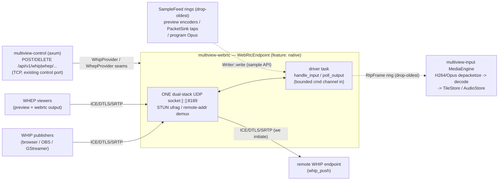

> **Design brief — WebRTC.** Authoritative research/design record backing the implementation.
> Produced by a verification-hardened multi-agent design workflow (2026-06-10). Canonical crate/API
> naming lives in [docs/architecture](../architecture/). ADRs derived from this brief are in
> [docs/decisions](../decisions/): [ADR-0048](../decisions/ADR-0048.md) (endpoint),
> [ADR-T014](../decisions/ADR-T014.md) (WHIP ingest), [ADR-0049](../decisions/ADR-0049.md)
> (WebRTC outputs), [ADR-P006](../decisions/ADR-P006.md) (WHEP preview completion),
> [ADR-W023](../decisions/ADR-W023.md) (SPA player & management).

---

# Multiview WebRTC Subsystem — Authoritative Brief

**Status:** Proposed (full-WebRTC merge: WHIP ingest + WebRTC outputs + WHEP preview completion + SPA)
**Date:** 2026-06-10
**Owning crates:** new leaf crate **`multiview-webrtc`** (ALL native ICE/DTLS/SRTP transport);
`multiview-preview` (the pure WHEP seam — `src/whep.rs`, `src/whep/transport.rs`,
`src/whep/program.rs`); `multiview-input` (WHIP media path — `src/webrtc/transport.rs`);
`multiview-output` (encode-once packet fan-out — `src/fanout.rs`); `multiview-audio` (Opus
en/de-embed — `src/store.rs`, `src/program.rs`); `multiview-control` (HTTP signaling routes);
`multiview-cli` (preview encoders + pipeline wiring); `web/` (the `<WhepPlayer>`).

---

## 0. Scope — what "full WebRTC support" means

Five pillars, shipped together (no "core now, wiring later"):

1. **WHIP ingest** ([RFC 9725](https://www.rfc-editor.org/rfc/rfc9725)): browsers and encoders
   (OBS Studio ≥ 30, GStreamer) publish **into** Multiview as a first-class configured source
   (`kind = "webrtc"`). H.264 video + Opus audio accepted; audio is **de-embedded** into the
   standard audio pipeline (`AudioStore` → `ProgramBus` routing) like any other source's audio.
2. **WebRTC outputs** (two new `Output` kinds): `webrtc` — a WHEP server handing the **real
   encoded program rendition** to N viewers (encode-once fan-out, one extra `PacketSink` on the
   `PacketRouter`); and `whip_push` — Multiview as the WHIP **client**, publishing the program to a
   remote WHIP endpoint (open-source servers such as MediaMTX or Broadcast Box, or hosted WHIP
   ingest services), exactly like RTMP/SRT push but over WebRTC. Program audio is **embedded** as
   one shared Opus rendition.
3. **WHEP preview completion**: the existing focus-preview WHEP seam
   (`crates/multiview-preview/src/whep/`) gains a real native transport, real preview encoders
   (hardware H.264 / software VP8 / Opus), program + input + output scopes, program audio, and
   honest fidelity labels.
4. **SPA**: a `<WhepPlayer>` component for program/input/output/layout-editor previews with
   automatic fallback to the existing JPEG-poll path; forms for the new source/output kinds;
   in-app docs; a capabilities probe ([ADR-W023](../decisions/ADR-W023.md)).
5. **Docs/process**: this brief; the five ADRs above; conventions §3/§4 updates (crate row +
   canonical features); capability-matrix and work-schedule updates.

Everything *not* in this list is in §11 (explicit boundaries) — stated non-goals, not deferred work.

---

## 1. Protocol background — the standards we build on

### 1.1 WHIP — RFC 9725 (Standards Track)

The WebRTC-HTTP Ingestion Protocol is a published RFC: one HTTP `POST` of an SDP offer
(`application/sdp`) to an endpoint URL returns `201 Created`, a session resource in `Location`,
and the SDP answer in the body; `DELETE` on the session resource tears down. Key spec facts this
design leans on:

- **The server MUST NOT trickle.** RFC 9725 requires the answer to be complete — the server
  gathers all of its candidates before answering (server→client trickle is structurally
  impossible: there is no server-initiated channel). This is why a full, eager ICE gather at
  answer time is correct, not a shortcut.
- **Trickle ICE and ICE restart (HTTP `PATCH`) are OPTIONAL.** We implement neither: `PATCH` is
  rejected `405 Method Not Allowed` with `Allow: DELETE, OPTIONS` (§4, §11) — vanilla ICE. The
  405 is justified by RFC 9110's generic method semantics and deployed-server practice, not by
  RFC 9725: the RFC's only PATCH-rejection code is `422` (for a server that supports one kind of
  PATCH but not the one offered), and the supports-neither case is unspecified by the RFC.
- **Bearer authentication** (RFC 6750 `Authorization: Bearer`) is the spec's auth model.
- Clients follow `307` redirects on the initial `POST` (an RFC 9725 provision); `308` handling
  and resolving a relative `Location` against the **post-redirect** effective URL are generic
  HTTP (RFC 9110 / RFC 3986), not RFC 9725 facts — our `whip_push` client implements all
  three (§5.2).

### 1.2 WHEP — draft-ietf-wish-whep-03 (EXPIRED) and the ecosystem-interop note

The WebRTC-HTTP Egress Protocol — same HTTP shape as WHIP, with the server **sending** media — is
**not an RFC**. `draft-ietf-wish-whep-03` (2025-08-18) is the **final** revision of the I-D
series (00–03); it expired 2026-02-19 and there are **no later revisions**. The deployed
consensus (players, gateways, and every open-source media server we interop with) is the draft's
**stable client-offer core**: `POST application/sdp` → `201` + `Location` + answer, `DELETE` to
tear down, Bearer auth, no mandatory trickle. **Decision:** implement that core exactly and
document the draft status, with two stated deviations: `PATCH` is rejected `405` +
`Allow: DELETE, OPTIONS` rather than the draft's `422` (the §1.1 posture), and the draft's `406`
server-counter-offer mode is not implemented — codec-incompatible offers on the new routes get a
plain `406 Not Acceptable` (ecosystem practice, §4.1). (The pure scaffold already models the
core: `WhepSession` in `crates/multiview-preview/src/whep.rs`.)

### 1.3 Codec floors — RFC 7742 (video) and RFC 7874 (audio)

WebRTC endpoints have *mandatory-to-implement* codecs, which is what makes a no-negotiation-matrix
design possible:

| Codec | Floor | Our use | Wire format |
|---|---|---|---|
| **H.264 Constrained Baseline** | RFC 7742 — browsers MUST implement (alongside VP8) | The **only video codec we answer for WHIP ingest** and the program codec for `webrtc`/`whip_push` outputs | `profile-level-id=42e01f`, `packetization-mode=1` (non-interleaved: single NAL / STAP-A / FU-A, RFC 6184), **B-frames off** |
| **VP8** | RFC 7742 — browsers MUST implement | The always-available **software preview encode** rung (§7.2 — why not x264) | str0m packetizes (RFC 7741) |
| **Opus** | RFC 7874 — MUST implement | The only audio codec, both directions | RFC 7587 payload, **48 kHz RTP clock**, 20 ms frames |

**Why B-frames are hard-off everywhere WebRTC touches:** RTP H.264 carries presentation timestamps
only — there is no decode-order/composition-offset signal — and WebRTC receivers (libwebrtc jitter
buffers included) assume decode order == presentation order. B-frames reorder, and real receivers
glitch or stall. The ecosystem consensus is bf=0 end-to-end; we **validate** it at config time for
outputs (§5.1) and tolerate it **defensively** on ingest (PTS-order publish, never crash — §4.3).

`42e01f` = Constrained Baseline profile, level 3.1 — the universally-decodable answer that every
browser accepts; `packetization-mode=1` is what every packetizer actually sends. Opus at 48 kHz is
unconditional: the RTP clock for Opus is always 48 000 regardless of the coded bandwidth.

---

## 2. Endpoint architecture — `multiview-webrtc`

### 2.1 Stack: str0m 0.16.2, pinned, sans-IO

- **str0m `=0.16.2`** (`MIT OR Apache-2.0`; sans-IO; `default-features = false,
  features = ["rust-crypto"]`) — **tightening** `multiview-preview`'s caret `"0.16.2"`
  requirement (`crates/multiview-preview/Cargo.toml`, lockfile-resolved) to an exact `=0.16.2`
  pin; the crypto closure is already allowlisted in
  `deny.toml` (aws-lc-rs via `dimpl` — note: 0.16.x uses aws-lc-rs, not ring). MSRV 1.81 ≤
  workspace 1.82.
- **Known gaps at 0.16.2, documented not hidden:** the Firefox RTX-SSRC frame-drop fix landed in
  str0m 0.18.0 → mitigation: Firefox is a **mandatory hardware-validation peer** (§10). The MSRV
  1.85 + Edition 2024 requirement begins at str0m 0.17.0, so picking up **any** fix beyond 0.16.x
  is a tracked follow-on gated on that MSRV decision. The Chrome v144 ICE fix **is**
  in 0.16.1, so current Chrome is covered.
- **One str0m owner.** `multiview-preview`'s `webrtc-native` feature, its
  `src/whep/native.rs` transport, and its optional str0m dependency are **relocated** into the new
  leaf crate `crates/multiview-webrtc` (tests preserved/moved). Preview keeps the pure `webrtc`
  seam (`whep.rs`, `whep/transport.rs`, `whep/program.rs`) untouched. Rationale: ingest and egress
  share the socket, the DTLS certificate, and the driver — two str0m owners would mean two sockets,
  two certs, and two drivers for one protocol. Features: `default = []` (empty pure shell — the
  house pattern that keeps `cargo check --workspace` native-free and deny-clean),
  `native = ["dep:str0m", "tokio/net", …]`. Dependency direction stays acyclic:
  `webrtc → {preview, input, core}`; `cli → webrtc`. No ffmpeg and no config dependency — the cli
  maps config to a plain `EndpointConfig`. ([ADR-0048](../decisions/ADR-0048.md).)

### 2.2 One endpoint, one UDP socket, every role

One `WebRtcEndpoint` per process (feature `native`): a **single dual-stack UDP socket** bound
**`[::]:8189`** (`webrtc.udp_port`, `IPV6_V6ONLY=false` — [ADR-0042](../decisions/ADR-0042.md)
dual-stack posture). **All** sessions multiplex on it: WHIP ingest publishers, WHEP preview
viewers, WHEP output viewers, and the outbound `whip_push` client. Demultiplexing: STUN packets by
ICE-ufrag → session map; non-STUN datagrams by learned remote `SocketAddr` (str0m's
`Rtc::accepts()` — the upstream `chat` example pattern).

- **Full-ICE agent** (str0m's in-library agent), **not** ice-lite: lite modes in the pion lineage
  have documented interop gaps, and full ICE is the production consensus among the servers we
  interop with. The server gathers **all** candidates before answering (§1.1): host candidates for
  every reachable address — **IPv6 first** — plus `webrtc.advertised_addresses` for NAT 1:1 /
  Docker port-publish deployments (the analogue of MediaMTX's additional-hosts setting).
- **One self-signed `DtlsCert`** minted at endpoint start (rcgen via str0m): stable fingerprint per
  run; no persistence — WebRTC sessions are per-run, so a persisted cert buys nothing.
- **The driver**: ONE tokio task owns the socket — `recv` → `Rtc::handle_input`; drains
  `poll_output()` fully (Transmit → send, Event → dispatch, Timeout → sleep). Session registration
  crosses a **bounded** command channel; per-session media ingress/egress crosses **only**
  drop-oldest rings (`SampleFeed` egress, `RtpFrame` ring ingress). Invariant #10: the engine never
  awaits this task — a wedged endpoint loses preview/ingest media, never output ticks.
- **Session ids**: ≥ 128-bit random (`rand` over the OS RNG, hex/base64url-encoded), **never**
  sequential — the relocated scaffold's sequential minting is replaced.
- **Session GC**: ICE-disconnect or idle timeout (`webrtc.session_idle_timeout`, default 30 s) →
  close; closed-session tombstones evicted after 60 s (this fixes the unbounded tombstone map in
  today's preview scaffold). **Limits**: `webrtc.max_sessions` (default 64) caps **preview +
  output-viewer** sessions only, with per-role caps inside it (preview `FocusGate`, output
  `max_viewers`). WHIP ingest sessions (bounded by the count of configured `webrtc` sources) and
  the `whip_push` client session (bounded by configured outputs) are admitted **outside** that
  pool, so a viewer flood can never starve a publisher or the push client's reconnect.

Config schema (the `webrtc` section, mapped by the cli into `EndpointConfig`):

| Key | Default | Meaning |
|---|---|---|
| `webrtc.udp_port` | `8189` | The single UDP media port, bound dual-stack `[::]` |
| `webrtc.advertised_addresses` | `[]` | Extra candidate addresses (NAT 1:1 / Docker), e.g. `["2001:db8::15", "192.0.2.15"]` — IPv6 listed first |
| `webrtc.max_sessions` | `64` | Hard cap on preview + output-viewer sessions (ingest/push admitted outside the pool, §2.2) |
| `webrtc.session_idle_timeout` | `30s` | Idle/ICE-disconnect GC horizon |
| `webrtc.cors_allow_origins` | `["*"]` | CORS allow-list, applied only to the media-signaling routes (§7.4) |

### 2.3 Roles on the shared endpoint

Dotted edges are drop-oldest rings — nothing on the engine side ever blocks on the endpoint.

---

## 3. Port & firewall model

The entire subsystem needs exactly **one new UDP port**. Signaling rides the existing control-plane
HTTP listener; there are no per-session port ranges and Multiview does not *run* a STUN/TURN server.
It **is** an in-crate TURN *client* (Amendment 2026-06-13, [ADR-0048 §5.1](../decisions/ADR-0048.md)):
where host + advertised candidates cannot establish, configured TURN servers (`webrtc.ice_servers`)
provide relayed candidates over the same single UDP port.

| Port | Proto | Direction | Purpose |
|---|---|---|---|
| control port (existing) | TCP | inbound | ALL WHIP/WHEP signaling (`OPTIONS`/`POST`/`DELETE` under `/api/v1/whip/…`, `/api/v1/whep/…`, `/api/v1/preview/…`) + SPA + REST |
| `webrtc.udp_port` (default **8189**) | UDP | inbound + outbound | ALL ICE/DTLS/SRTP media, every role, single-port mux (§2.2) |
| remote WHIP endpoint | TCP (HTTPS) + UDP | outbound only | `whip_push` signaling + media — we initiate, so plain NAT works with host candidates; a configured TURN server can supply relayed candidates where it does not |

Deployment rules:

- **Docker/compose**: publish `8189/udp` and set `webrtc.advertised_addresses` to the host's
  addresses (IPv6 first) — bridge-mode containers otherwise advertise unreachable container
  addresses. Host networking needs neither.
- **Inbound behind NAT** (WHIP publishers / WHEP viewers reaching a Multiview behind NAT): forward
  `webrtc.udp_port` and advertise the external address — the self-hosted posture every open-source
  WHIP/WHEP server documents. Where forwarding/advertising is not possible (symmetric NAT /
  restrictive firewall), configure a TURN server (`webrtc.ice_servers`) and the in-crate TURN client
  relays via it (§11.0).
- **Outbound `whip_push`** traverses NAT with host candidates alone, because Multiview initiates
  the connectivity checks.
- IPv6-first throughout: candidates are gathered and listed IPv6 before IPv4; SDP uses
  `c=IN IP6` for IPv6 candidates (no TTL — [conventions §10](../architecture/conventions.md));
  URL examples bracket literals (`https://[2001:db8::15]:8443/api/v1/whip/cam-1`).

---

## 4. WHIP ingest — `kind = "webrtc"` sources ([ADR-T014](../decisions/ADR-T014.md))

### 4.1 Config & endpoint semantics

New `SourceKind::Webrtc { token: Option<String>, audio: bool /* default true */ }` — internally
tagged `kind = "webrtc"` per house schema rules (never `untagged`). The WHIP endpoint URL is
**derived, not configured**: `POST /api/v1/whip/{source_id}`; session resource
`/api/v1/whip/{source_id}/sessions/{session_id}`.

| Request | Response |
|---|---|
| `OPTIONS` | CORS preflight + `Accept-Post: application/sdp` |
| `POST application/sdp` (offer) | `201 Created` + `Location` + `application/sdp` answer (no `ETag` — RFC 9725 ties the entity-tag to ICE restart, which we do not support) |
| `DELETE` session | `200` (idempotent; requires the same credential class as the creating `POST`) |
| `PATCH` | **`405`** + `Allow: DELETE, OPTIONS` — vanilla ICE; RFC 9110 generic method semantics + deployed-server practice (§1.1) |
| wrong content type / malformed SDP | `415` / `400` |
| codec-incompatible offer | `406 Not Acceptable` (ecosystem practice; the existing preview WHEP routes keep their shipped mapping) |
| bad / missing token | `401` / `403` |
| **second concurrent publisher** (WHIP only) | `409` (one publisher per source) |
| viewer capacity (WHEP routes: the `max_sessions` pool / `max_viewers`) | `503` + `Retry-After`; the problem body hints `fallback: "jpeg"` |

Errors are RFC 9457 `application/problem+json` (house API convention). `application/sdp` request
bodies are capped at **64 KiB** (an explicit axum body limit on these routes). Auth: per-source
Bearer `token` (RFC 6750); control-plane API keys with Write scope are also accepted — never
anonymous. Session ids are ≥ 128-bit random (§2.2), and session resources (`DELETE`) require the
same credential class as the `POST` that created them. The plaintext `token` follows the existing
config-secret posture (rtmp/srt URLs already embed stream keys in config): returned to authorized
readers, present in config export, and it migrates together with url-embedded keys if/when a
`secret_ref` indirection lands.
`multiview-control` stays native-free via a `WhipProvider` seam (the mirror of the existing
`WhepProvider` in `crates/multiview-control/src/preview.rs`):
`negotiate(source_id, offer, bearer) → WhipAnswer | WhipReject`, `release(session)`; the cli
implements it over `multiview-webrtc`.

### 4.2 Media path

RTP-mode `Rtc` for ingest. Video: RTP → the existing `MediaEngine` seam →
`H264Depacketizer` (keyframe-gated, bounded — unchanged;
`crates/multiview-input/src/webrtc/transport.rs`) → a **new packet-fed H.264 decoder in
`multiview-ffmpeg`** (`ffmpeg`-gated; decode-at-display-resolution per invariant #6) → NV12 →
`TileStore` publish through `IngestPump` (`crates/multiview-input/src/source.rs`), with
`PtsNormalizer` running `WrapBits::Rtp32` (`crates/multiview-input/src/normalize.rs`) — RTP's
32-bit timestamp wrap is just another wrap width to the existing unwrapper (invariant #3). Audio:
RTP → a new pure Opus depacketizer in `multiview-input` (RFC 7587 — the payload *is* one Opus
frame) → `multiview-ffmpeg` Opus decode → 48 kHz stereo PCM → `AudioStore::publish` (§6.2).
`ColorInfo` is tagged from the H.264 VUI, defaulting to BT.709 when absent — the same policy as
every other compressed ingest (invariant #8).

This **fixes `WebRtcProducer::to_produced`**: today it fabricates frame geometry from declared
constructor arguments; after this work it feeds the decoder and geometry comes from the
decoder/SPS.

**Decode ceiling:** publishers are capped at **4096×2304 (~8.8 Mpx)** — access units whose SPS
exceeds it are rejected: frames are dropped with a rate-limited warn, the tile shows an
error/NO_SIGNAL state, and the session stays up. Once observed, the source's measured Mpx/s
enters the standard admission/degradation plan like any other source
([ADR-T014](../decisions/ADR-T014.md) budget section).

### 4.3 Keyframe policy and the OBS publisher profile

We **send** PLI at session start and after loss/discontinuity while the keyframe gate is closed,
rate-limited to ≥ 2 s — never an unconditional every-2-s ping; browsers honour it.
**OBS Studio does not**: its WHIP output (libdatachannel-based) has **no PLI handler** — verified
by inspection of its WHIP send chain; PLI arrives and is dropped on the floor. So recovery for OBS
publishers comes from the encoder configuration, and the docs state the supported profile rather
than pretending PLI works:

> **OBS publisher profile:** keyframe interval **1–2 s**, **CBR**, B-frames **0** (OBS forces
> bf=0 and repeat-headers itself for WHIP), H.264.

B-frames from non-compliant publishers are tolerated defensively: PTS-order publish through the
normalizer, never a crash (bad inputs are the product).

### 4.4 Tile lifecycle & apply classification

A configured-but-unpublished `webrtc` source shows the NO_SIGNAL placeholder; session connect +
first IDR → LIVE; publisher disconnect rides STALE (hold last-good) → NO_SIGNAL — a `webrtc`
source is **never** RECONNECTING, because there is nothing to dial
([ADR-T014](../decisions/ADR-T014.md) pins this; invariant #2). Ingest is supervised by the pipeline ingest supervisor — `drive_webrtc`
mirrors `drive_ndi` (`crates/multiview-cli/src/pipeline.rs`). Apply classification: add/remove is
the same class as the other network source kinds (recorded in the
[capability matrix](management-capability-matrix.md); invariant #11).

---

## 5. WebRTC outputs ([ADR-0049](../decisions/ADR-0049.md))

### 5.1 `Output::Webrtc` — WHEP-serve the real program rendition

`Output::Webrtc { id, label, max_viewers (default 8), token: Option<String>, codec ("h264"),
gpu_pin, audio }` — a WHEP endpoint at `POST /api/v1/whep/{output_id}` (+ session URLs; the same
HTTP table as §4.1, with the capacity rule: over `max_viewers` → `503` + `Retry-After`). Auth:
with a `token`, the bearer alone suffices; with `token: None`, viewing requires an API key with
**View** scope (read-shaped — View suffices, not Write) — never anonymous.

Viewers receive the **real encoded program rendition** — not a re-encode: a `PacketSink`
registered on the `multiview-output` fan-out `PacketRouter`
(`crates/multiview-output/src/fanout.rs`) — `route()` simply gains one consumer, preserving
encode-once (invariant #7). Per-viewer work is a str0m sample-API write of the **same AU bytes**;
packetization is header work per viewer, not encode work. SPS/PPS are cached and prepended at each
IDR for late joiners (the standard remuxer pattern). Viewer-join and PLI both funnel into a
**rate-limited force-IDR** (≥ 2 s floor, coalesced) on the program encoder via a new force-keyframe
seam — a viewer storm cannot inflate the encoder's bitrate unboundedly.

**Validation:** the rendition a `webrtc` output consumes must be H.264 with B-frames off +
repeat-headers (§1.3). Config-file load with a non-compliant rendition is a **hard validation
error**; a live apply that would force an existing rendition to bf=0 surfaces as a **Class-2
plan** (encoder reset) per the live-apply doctrine — never a silent runtime fixup. Audio: the
shared program Opus rendition (§6.1) as a sendonly `m=audio`.

### 5.2 `Output::WhipPush` — Multiview as the WHIP client

`Output::WhipPush { id, url, token: Option<String>, codec ("h264"), gpu_pin, audio }` — Multiview
publishes the program to a remote WHIP endpoint: create a sendonly offer with host candidates and
`a=setup:actpass` (the answerer chooses the DTLS role — RFC 5763 answerers typically pick active —
so Multiview commonly runs the DTLS **server** role), `POST` with Bearer, follow **307/308
redirects with method + headers preserved** (depth-capped at 3, https-only — an https→http
downgrade **aborts**; `308`/relative-`Location` handling is generic HTTP, RFC 9110/3986), resolve
the session `Location` against the post-redirect URL, apply the answer. Cross-origin https
redirects are followed **with** the `Authorization` header: the bearer is already entrusted to the
configured endpoint's operator, who could forward it server-side regardless — the real leak
channel is plaintext downgrade, which is forbidden. Supervised reconnect
with backoff, exactly like RTMP/SRT push supervision. Same rendition + Opus constraints as §5.1.
Outbound-through-NAT works with host candidates because we initiate (§3).

### 5.3 Real outputs, never shed

Both kinds are **real outputs**: engine-protected, never shed by the preview degradation ladder.
Per-viewer send rings are bounded drop-oldest, so a slow viewer loses **its** packets and never
stalls the fan-out — the invariant-#10 chaos-gate shape, proven by the same stalled-consumer test
pattern the fan-out already carries.

---

## 6. Audio en/de-embedding (both directions)

### 6.1 Embed (out): one Opus rendition per program

The post-loudnorm program `AudioBlock` in `consumer_main` (`crates/multiview-cli/src/pipeline.rs`)
feeds a bounded drop-oldest ring → **exactly ONE Opus encode per program** (encode-once extends to
audio renditions — the AUD-4b shape) → encoded samples fan to every consumer: all program-scope
WHEP preview sessions, all `webrtc` output viewers, and the `whip_push` session. N audio consumers
cost one encode. Lifecycle is **lazy with refcount semantics mirroring
[ADR-P003](../decisions/ADR-P003.md) taps**: the encoder starts when the **first** audio-consuming
WebRTC session/output attaches and stops with the **last**; a configured `webrtc`/`whip_push`
output with audio counts as a standing consumer (always-on while the output runs). Settings:
48 kHz, 20 ms frames, 96 kbps (libopus; libav native `opus` encoder as
fallback).

### 6.2 De-embed (in): WHIP audio into the standard pipeline

The WHIP session's Opus m-line → RFC 7587 depacketize (pure — one payload, one Opus frame) →
`multiview-ffmpeg` Opus decode → 48 kHz stereo PCM → `AudioStore::publish`
(`crates/multiview-audio/src/store.rs`; the source is registered in the pipeline's
`audio_stores`) → `ProgramBus` routing and breakaway (`crates/multiview-audio/src/program.rs`)
**exactly like any other source's audio**. WebRTC sources need no special-casing anywhere
downstream of the store.

---

## 7. WHEP preview completion — encoders, scopes, fidelity ([ADR-P006](../decisions/ADR-P006.md))

### 7.1 The seam grows audio; the answer SDP becomes str0m's own

- The signaling answer for native sessions is **str0m's complete answer SDP** (BUNDLE, mid,
  rtcp-mux, fmtp all correct) — **not** the hand-rolled rebuild. The pure
  `WhepSession::build_answer` scaffold (`crates/multiview-preview/src/whep.rs`) stays for the
  fake-transport tests; its `c=IN IP4 0.0.0.0` placeholders become **`c=IN IP6 ::`** (IPv6-first,
  [ADR-0042](../decisions/ADR-0042.md)) and it gains `a=mid`/`a=rtcp-mux` lines so the fake path
  emits honest SDP too.
- Egress media uses str0m's **sample API** (`Writer::write` — str0m packetizes H.264/VP8/Opus);
  `Event::KeyframeRequest` (PLI/FIR) maps to the rate-limited (≥ 2 s, coalesced) force-IDR callback
  into the feeding encoder.
- The seam (`crates/multiview-preview/src/whep/transport.rs`) gains audio:
  `EncodedSample.kind: SampleKind { Video, Audio }` with per-kind RTP clocks (video 90 kHz, audio
  48 kHz); `PreviewMediaSource` gains an optional Opus audio feed. The in-memory fake and its
  tests move with it — a pre-1.0 seam change with every in-repo consumer updated in the same push.

### 7.2 The preview encoder ladder — and why VP8, not x264, for software

Adapters live in `multiview-cli` implementing `multiview_preview::PreviewEncoder`
(`crates/multiview-preview/src/whep/program.rs`) over `multiview-ffmpeg`:

| Rung | Codec | When | Why |
|---|---|---|---|
| 1 | **H.264 hardware** (nvenc / vaapi / videotoolbox) | When the host has it (existing candidate-encoder selection) | Cheapest watts/frame; sessions budgeted like all encoder sessions |
| 2 | **VP8 software (libvpx)** | Always available | **x264 is GPL-blocked**: enabling it flips the entire binary to GPL (`gpl-codecs` is opt-in only — [conventions §7](../architecture/conventions.md)). libvpx is BSD (LGPL-clean), VP8 is RFC 7742-**mandatory** in every browser, and str0m packetizes it. The default build therefore always has a working browser-compatible software encoder without a licensing escalation |
| 3 | **Opus** (libopus, libav `opus` fallback) | Always (audio) | 48 kHz / 20 ms / 96 kbps (§6.1) |

**Also considered and rejected: openh264.** Cisco's BSD-licensed openh264 (`libopenh264`) does
exist as a software H.264 encoder, but its patent-royalty grant covers only Cisco's **binary**
distribution — building it from source re-exposes royalty liability — and it would add an extra
runtime dependency. VP8/libvpx stays the software rung.

Encoder settings: zerolatency-class, **B-frames hard-off**, repeat-headers (SPS/PPS with every
IDR), 2 s GOP, preview bitrate budget; input scaled to longest-edge ≤ 1280 (swscale) sampled at
≤ 15 fps. Codec choice at negotiate time = intersection of the client's offer and what **this
build** can encode (H.264 preferred, else VP8) — never a hard-coded assumption.

### 7.3 Scopes and fidelity labels

- **Program scope**: the cli run loop (which already fills the JPEG `ProgramSlot`) also drives the
  `ProgramTap` start-closure, publishing `ProgramFrame`s into a dedicated drop-oldest
  `EventStream` ring (`crates/multiview-engine/src/isolation.rs`) at preview cadence — only while
  ≥ 1 subscriber (lazy start / auto-stop, [ADR-P003](../decisions/ADR-P003.md)).
- **Input scope**: sample the per-input `TileStore`
  (`crates/multiview-framestore/src/tile.rs` — the same read `CliPreviewProvider::input_jpeg`
  uses) into an encode session. No second decode, ever.
- **Output scope + "real" program fidelity** (PRV-5b): when the watched rendition is
  WebRTC-compatible (H.264, B-frame-free), register a preview `PacketSink` on the fan-out
  `PacketRouter` (`route()`+1, encode-once preserved) and label the surface
  **`RealEncodedOutput`**; otherwise fall back to the canvas-approx encode path and label it
  **`PreEncodeCanvasApprox`** (`FidelityLabel`,
  `crates/multiview-preview/src/whep/program.rs`). The label is non-negotiable and never silently
  mixed — the same doctrine as [preview-subsystem §6](preview-subsystem.md). SPS/PPS cached and
  prepended at each IDR for late joiners.
- **Degradation glue (PRV-4b)**: the cli loop observes `Hysteresis`
  (`crates/multiview-hal/src/degradation.rs`) and calls `FocusGate::suspend()/resume()`
  (`crates/multiview-preview/src/focus.rs`) with tracing — preview WebRTC rides the existing
  topmost (cheapest-to-shed) preview rungs, shed before any program lever moves (invariant #9).

### 7.4 Control surface & SPA (summary — [ADR-W023](../decisions/ADR-W023.md))

`GET /api/v1/preview/capabilities` reports
`{ webrtc, scopes: { program: { whep, fidelity }, inputs: { whep }, outputs: { whep } },
fallback: "jpeg" }` and drives SPA transport selection — `"jpeg"` is the **one** fallback literal
everywhere (the 503 problem-body hint uses it too, §4.1; the shipped `ws-jpeg` literal in
`routes/preview.rs` is renamed in this push — no consumer exists yet, so the rename is safe and
the route tests update honestly). CORS is configurable (`webrtc.cors_allow_origins`, default
`"*"`) and applied **only** to the media-signaling routes (WHIP / WHEP / preview-WHEP /
capabilities): `Access-Control-Allow-Headers: authorization, content-type` and
`Access-Control-Expose-Headers: location, link` — browsers cannot read `Location` cross-origin
otherwise, which silently breaks WHIP/WHEP session teardown (no `ETag`: we do not support ICE
restart, §4.1); the preflight `OPTIONS` is unauthenticated by browser construction. Every new
route enters OpenAPI (utoipa triple registration + the route-completeness assertion in
`crates/multiview-control/src/openapi.rs` — the `ApiDoc::rest_routes` vs mounted-router parity
test in `tests/openapi.rs`), and the existing untyped JPEG snapshot endpoints enter the spec too so
the SPA fallback path becomes typed. The `<WhepPlayer>` posts after ICE-gathering-complete (or a
2 s timeout — with no iceServers configured, host gathering is effectively instant), sets
`muted` + `playsinline` before play (Safari), resolves relative `Location` against the
post-redirect URL, tears down with `fetch(…, { keepalive: true })` carrying its `Authorization`
header (fetch keepalive **can** carry headers; `sendBeacon` cannot — which is why fetch keepalive
is used), and falls back to the existing
JPEG poll on non-2xx POST / `connectionState === "failed"` / a ~6 s `getStats` inbound-rtp byte
watchdog — always with an honest "fallback" badge. No new realtime topics in v1; session counts,
drops, and PLIs become Prometheus metrics (`multiview-telemetry`).

---

## 8. Features, licensing, CI

- **cli features**: `webrtc = ["multiview-preview/webrtc", "multiview-input/webrtc"]` (pure
  seams); `webrtc-native = ["webrtc", "dep:multiview-webrtc", "multiview-webrtc/native",
  "ffmpeg"]`. The `nvidia`, `apple`, `linux-vaapi`, and `full` presets all gain `webrtc-native` —
  the deployed image must serve WebRTC preview out of the box. The default build stays pure
  (str0m only behind `native`). `multiview-preview`'s `webrtc-native` flag is **removed**
  (migration note in [conventions §4](../architecture/conventions.md)).
- **deny.toml**: the str0m 0.16.2 closure is already allowlisted; comments updated for the crate
  move. The default `cargo deny check` scans default features only (the default build never sees
  str0m), so CI adds a **targeted `cargo deny check` leg running with the cli `webrtc-native`
  feature graph** (not `--all-features`) — the shipped str0m/dimpl/aws-lc closure is tool-gated,
  not comment-gated ([ADR-0048](../decisions/ADR-0048.md)).
- **CI**: the feature-clippy matrix gains `multiview-webrtc/native` and cli `webrtc-native`;
  `multiview-webrtc` tests run under `--features native` (loopback str0m↔str0m needs only UDP
  loopback — CI-safe, §10). Docker: the builder image needs cmake (aws-lc-rs); the ffmpeg base
  must include libvpx + libopus (both LGPL-clean — verify, add if missing).

---

## 9. Efficiency budget (standing review)

| Resource | Budget | Mechanism |
|---|---|---|
| Per-session memory | egress ≤ 2 MiB; ingest ≤ 2 MiB transport + up to 8 MiB in-progress access unit (`MAX_ACCESS_UNIT_BYTES`) + decoder surfaces | str0m internal buffers + two drop-oldest feeds; the `max_sessions` (64) viewer pool worst case ≈ 128 MiB, plus the per-configured-source ingest budgets admitted outside the pool (§2.2) |
| Preview video encode | ≤ 1 per focused scope; `FocusGate` default 1 global | Lazy start / auto-stop ([ADR-P003](../decisions/ADR-P003.md)); sampled ≤ 15 fps, longest edge ≤ 1280 |
| Program audio encode | Exactly **1** Opus encode per program | Encode-once for audio (§6.1); all WHEP/`webrtc`/`whip_push` consumers share it |
| `webrtc` output viewers | **0** extra encodes; header-only packetization per viewer | `PacketSink` on the fan-out, `route()`+1 (invariant #7) |
| `whip_push` | **0** extra encodes | Same rendition + the shared Opus rendition |
| Endpoint CPU / driver ceiling | One I/O-bound task on one socket; worst case ≈ `max_sessions` × program bitrate (64 × 8 Mbps ≈ 0.5 Gbps, ~50 kpps) serialized on one driver task — comfortable headroom on a modern core | Zero allocations on the per-datagram path beyond str0m's own; if saturated, viewer sessions shed first (preview rungs) while real outputs/ingest stay prioritized via the pool split (§2.2) |
| Keyframe cost | Force-IDR floor ≥ 2 s, coalesced | Viewer-join/PLI storms cannot inflate program bitrate |
| Degradation | Preview WebRTC shed first | `Hysteresis` → `FocusGate::suspend()/resume()` (§7.3); real outputs never shed |

---

## 10. Testing & validation tiers

**The big unlock: str0m is its own test peer.** Because str0m is sans-IO, a second `Rtc` in the
client role over a UDP loopback (or an in-memory datagram shuttle) completes **real
ICE + DTLS + SRTP in CI** — no browser, no GPU, no display. The old premise that native-transport
tests "need a peer" and must be env-gated is retired: the full handshake and media-flow tests run
in the ordinary `native` CI leg.

| Tier | What runs | Where |
|---|---|---|
| 1 — pure unit / proptest | SDP build/parse, H.264/Opus depacketizers, session GC, ufrag/addr demux map | default CI (no native deps) |
| 2 — native loopback | str0m↔str0m: full ICE+DTLS+SRTP handshake; WHEP egress asserted by the client `Rtc` **receiving decodable samples**; WHIP ingest by a client publishing baked H.264/Opus | `--features native` CI leg |
| 3 — control routes | WHIP/WHEP HTTP semantics (§4.1 table incl. 405/406/409/503), auth, problem+json — against fake `WhipProvider`/`WhepProvider` | default CI |
| 4 — cli integration | End-to-end wiring under `webrtc-native` (gated) | feature CI leg |
| 5 — hardware validation | Real browsers + encoders | the GPU test box (gpu-test-box) |

Interop / hardware-validation matrix (tier 5):

| Peer | Role | Notes |
|---|---|---|
| Chrome (Playwright) | WHEP viewer + WHIP publisher | Chrome v144 ICE change covered by str0m 0.16.1+ |
| Firefox (Playwright) | WHEP viewer | **Mandatory** — the str0m 0.16.2 RTX-SSRC gap (fixed upstream in 0.18.0) must be validated here (§2.1) |
| Safari | WHEP viewer | `muted` + `playsinline` handled in the player (§7.4) |
| OBS Studio ≥ 30 | WHIP publisher | The documented profile (§4.3); remember it ignores PLI |
| GStreamer | WHIP publisher / WHEP viewer | Scriptable second implementation |
| MediaMTX / Broadcast Box | `whip_push` target | Assert with ffprobe on the remote's re-served output |
| str0m client `Rtc` | Both | The CI peer (tiers 2/4) |

`examples/whip_publish.rs` in `multiview-webrtc` (feature `native`) publishes bars+tone H.264/Opus
to any WHIP URL — it is simultaneously the hardware-validation client and an operator debugging
tool.

---

## 11. Explicit boundaries (stated non-goals, not deferred work)

### 11.0 In scope: TURN client (Amendment 2026-06-13)

**TURN is in scope** — an operator hard requirement, recorded in
[ADR-0048 §5.1](../decisions/ADR-0048.md). The subsystem ships an **in-crate, sans-IO TURN client**
(RFC 5389 / RFC 5766 / RFC 8656: `Allocate` / `Refresh` / `CreatePermission` / `ChannelBind`,
`Send`/`Data`, `MESSAGE-INTEGRITY`, `FINGERPRINT`, `XOR-…-ADDRESS` for IPv4 **and** IPv6) because
str0m 0.16.2 is full-ICE but has **no TURN client** (it consumes a relay candidate but cannot allocate
one). Credentials are long-term and coturn-style ephemeral REST/HMAC
(`draft-uberti-behave-turn-rest-00`), secret-named for the redactor; TURN runs IPv6-first; and the
client is pure and CI-tested offline against an in-process fake TURN server. Multiview still does not
*run* a STUN/TURN **server** — it is a relay **client** only.

### 11.1 Genuine non-goals

- **No VP8 ingest depacketization.** We *answer* H.264+Opus only for WHIP — every browser and OBS
  can send that (RFC 7742/7874 floors, §1.3). VP8 remains an **egress** preview codec only.
- **No simulcast.**
- **No trickle ICE / ICE restart.** `PATCH` is answered `405` + `Allow: DELETE, OPTIONS`
  (RFC 9110 generic method semantics + deployed-server practice; server→client
  trickle is structurally impossible anyway, §1.1).
- **No data channels.**
- **No LL-HLS preview fallback rung** — a separate schedule item; the preview ladder ships
  WHEP → JPEG.
- **No per-viewer re-encode / ABR-per-tile** — an explicit product non-goal
  ([core-engine §2](core-engine.md)).

---

## 12. Invariant re-checks

| Invariant | Verdict |
|---|---|
| **#1 output-clock** | Untouched. WHIP ingest is *sampled* (pull-based `MediaEngine`, bounded rings, keyframe gate); WHEP/push outputs consume the existing packet fan-out through bounded per-viewer rings. Nothing here paces the tick loop. |
| **#10 isolation** | All WebRTC work lives in the endpoint task + per-session bounded drop-oldest rings; the engine never awaits a client; force-IDR is floor-limited (≥ 2 s). The two new engine→outside channels — the `ProgramFrame` `EventStream` ring and the program-audio ring — are drop-oldest and lazy, each proven no-stall by the 1000-publish stalled-consumer test pattern. |
| **#3 timing** | RTP 32-bit wrap handled by the existing `PtsNormalizer` via `WrapBits::Rtp32`; output PTS still re-stamped from the tick counter. |
| **#6 decode-at-display-resolution** | The WHIP H.264 packet decoder honours it. |
| **#7 encode-once** | Preserved and extended: `route()`+1 for video; **one** Opus rendition for all WebRTC audio consumers. |
| **#8 color** | WHIP decode tags `ColorInfo` from the H.264 VUI, defaulting BT.709 when absent — the same policy as other compressed ingest. |

---

## 13. ADR map

| ADR | Covers |
|---|---|
| [ADR-0048](../decisions/ADR-0048.md) | The `multiview-webrtc` transport endpoint: crate move from preview, str0m pin policy, single-port mux, full-ICE, IPv6-first candidates, DTLS cert, session GC, the `webrtc` config section, feature gating (§2–§3) |
| [ADR-T014](../decisions/ADR-T014.md) | WHIP ingest: endpoint semantics, auth, source-kind schema, media path, PLI policy + OBS profile, lifecycle, apply classification (§4, §6.2) |
| [ADR-0049](../decisions/ADR-0049.md) | WebRTC program outputs: `Output::Webrtc` + `Output::WhipPush`, encode-once fan, B-frame validation, force-IDR seam, the Opus program rendition, viewer caps, push redirect/reconnect, never-shed status (§5, §6.1) |
| [ADR-P006](../decisions/ADR-P006.md) | WHEP preview completion: native-transport relocation, encoder ladder, audio in the seam, scopes, fidelity labels, capabilities endpoint, PRV-4b glue, answer-SDP policy (§7) |
| [ADR-W023](../decisions/ADR-W023.md) | SPA: `<WhepPlayer>`, fallback ladder + badge, capabilities probe, forms for the new kinds, docs/i18n/test strategy, JPEG endpoints entering OpenAPI (§7.4) |
