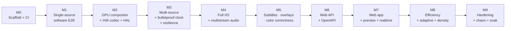

# Multiview — Implementation Roadmap

> Top-level summary + status table: [`../ROADMAP.md`](../ROADMAP.md). Per-feature capability/status
> matrix: [`../FEATURES.md`](../FEATURES.md). This page is the detailed per-milestone plan.

This is the **phased delivery plan** for Multiview, the efficient, hardware-accelerated Rust live
video multiview engine. It sequences the work from an empty workspace to a hardened, production-grade
product, with **crisp, testable exit criteria** at every milestone.

> **Status today: greenfield.** Only the scaffold and these docs exist. No engine code is written
> yet. The roadmap below is the plan to change that.

It is derived from, and stays subordinate to, the canonical
[conventions](architecture/conventions.md) (crate names, feature flags, invariants, licensing) and
the five design briefs distilled into [`research/`](research/) and the
[ADRs](decisions/README.md). Where any phase text disagrees with the conventions, **the conventions
win**.

---

## Reading this roadmap

- **Milestones are capability-defined**, not calendar-defined. Each ships a coherent, demonstrable
 increment and is gated by **exit criteria** that must be green before the next milestone starts.
- **Invariants are non-negotiable from the milestone they are introduced.** Once the
 [output-clock invariant](architecture/conventions.md#5-canonical-technical-invariants) lands in
 M3, every later milestone must keep it green; the resilience SLO probe (M3+) enforces it in CI.
- **The software/CPU path is the CI enabler.** GPU-free runners must exercise the full pipeline on
 every PR; scarce GPU/Apple-Silicon runners run a periodic backend-parity + device-loss job. This
 constraint shapes the early ordering.
- **Default build stays LGPL-clean** ([§7](architecture/conventions.md#7-licensing-model-build-profiles)).
 `gpl-codecs`, `nonfree`, and `ndi` are opt-in and never gate the default CI lane.

### Phase map

### Crate introduction by milestone

| Milestone | Crates first exercised (canonical names from [conventions §3](architecture/conventions.md#3-canonical-crate-map)) |
|---|---|
| M0 | workspace, `xtask`, `multiview-core`, `multiview-config`, `multiview-events`, `multiview-cli` |
| M1 | `multiview-ffmpeg`, `multiview-input`, `multiview-compositor` (software), `multiview-output` (file/RTSP) |
| M2 | `multiview-hal`, `multiview-compositor` (GPU backends), `multiview-ffmpeg` (hwaccel) |
| M3 | `multiview-engine`, `multiview-framestore`, `multiview-telemetry` (validity probe) |
| M4 | `multiview-input` (full), `multiview-output` (full), `multiview-audio` |
| M5 | `multiview-overlay`, `multiview-compositor` (color pipeline + linear-light blend) |
| M6 | `multiview-control` |
| M7 | `web/`, `multiview-preview`, `multiview-control` (realtime + embed) |
| M8 | `multiview-hal` (cost model), `multiview-engine` (admission/degradation), `multiview-telemetry` (GPU stats) |
| M9 | all — chaos/soak harness, license CI, build-profile matrix |

---

## M0 — Scaffold & CI

**Goal:** an empty-but-correct workspace that builds, lints, and tests green on GPU-free runners,
with the trait/type layer in place so every later crate has a contract to implement against.

- Cargo workspace (`resolver = "2"` — mandatory so a Linux-only dep can't leak into a macOS build),
 `rust-toolchain.toml` (stable, edition 2021), `rustfmt.toml`, `clippy.toml`, `.editorconfig`,
 `deny.toml`, dual `LICENSE-MIT`/`LICENSE-APACHE`.
- `multiview-core`: the shared types & **stage traits** — `Frame`, `PixelFormat` (NV12 canonical),
 `ColorInfo` (the 4 axes), clock/`MediaTime`, the layout/template model, error taxonomy, and
 `Source`/`Sink`/`Decoder`/`Encoder`/`Compositor`/`Backend`. **No FFI.**
- `multiview-config` schema (serde, adjacently-tagged enums, `schemars` JSON Schema) and
 `multiview-events` (versioned envelope) stubs.
- `multiview-cli` skeleton with `run`/`validate` subcommands (no-op engine).
- CI: `cargo check`/`clippy -D warnings`/`fmt --check`/`test` on the **default features** (pure-Rust,
 no native deps); `cargo-deny` license + advisory gate; `#![warn(missing_docs)]` on libs.

**Exit criteria**
- [ ] `cargo check`, `clippy -D warnings`, `fmt --check`, `cargo test`, `cargo deny check` all green on a GPU-free runner with default features.
- [ ] `multiview validate examples/*.toml` round-trips config ↔ JSON Schema.
- [ ] Every crate in [conventions §3](architecture/conventions.md#3-canonical-crate-map) exists as at least a documented stub; dependency direction has no cycles.

---

## M1 — Single source: decode → compose (software) → output

**Goal:** the first end-to-end multiview, entirely in software, runnable in GPU-free CI. This proves the
trait contracts and gives golden-frame tests a deterministic target.

- `multiview-ffmpeg`: safe RAII wrappers over libav for demux/decode/encode (software), AVERROR →
 `thiserror`, `AVFrame` clone-by-ref. (See [ADR-0002](decisions/ADR-0002.md) — rsmpeg binding.)
- `multiview-input`: one source (file + `test` pattern), bounded drop-oldest queue.
- `multiview-compositor`: **software/CPU** backend honoring the one contract —
 *NV12 tiles at display size → one composite pass → NV12 canvas*. Fixed 2×2 layout from config;
 fit/cover/crop math as (src-rect, dst-rect) pairs.
- `multiview-output`: file mux **and** a basic RTSP serve path (single output, software-encoded H.264).
- Golden-frame tests (`framemd5`/`framehash`) against the deterministic CPU compositor on a pinned
 arch (the only place exact-match is valid — GPU output uses SSIM/PSNR later).

**Exit criteria**
- [ ] `test`-pattern (or file) → 2×2 → H.264 file output runs to completion in GPU-free CI.
- [ ] RTSP-out plays in a real player (ffplay/VLC) from the software encoder.
- [ ] Golden-frame test passes deterministically; NV12 is held throughout (no per-tile RGBA materialized — [invariant 5](architecture/conventions.md#5-canonical-technical-invariants)).
- [ ] Decode/compose/output are wired through the `multiview-core` traits only (no backend-specific types leak into the core API).

---

## M2 — GPU compositor + HW decode/encode + HAL negotiation

**Goal:** real hardware acceleration on the first vendor island, behind the per-stage HAL, with the
software path preserved as the universal fallback. Establishes the **zero-copy island** discipline.

- `multiview-hal`: capability detection (L1 FFmpeg / L2 vendor / L3 sandboxed probe), backend registry,
 device correlation by **PCI bus id / UUID / IOKit id**, and the scored per-stage planner that
 **penalizes cross-vendor seams** and prefers single-device end-to-end. (See
 [ADR-0003](decisions/ADR-0003.md), [ADR-0004](decisions/ADR-0004.md), and the
 [pipeline doc](architecture/pipeline.md).)
- `multiview-compositor` GPU backends behind features: **`wgpu`** (default, portable) plus vendor fast
 paths — **`cuda`** (NVDEC→custom CUDA kernel→NVENC, one shared CUDA context) and **`metal`**
 (VideoToolbox→IOSurface/`CVMetalTextureCache`→Metal→VideoToolbox). (See
 [ADR-0005](decisions/ADR-0005.md).)
- `multiview-ffmpeg` hwaccel lifecycle: generic `get_format` path (not `*_cuvid` wrappers),
 `AVHWFramesContext` (re)build on mid-stream geometry/`sw_format` change, software fallback always
 available.
- **"Stayed-on-GPU" assertion**: a test that counts host↔device copies so a silent CPU/host fallback
 fails CI.

**Exit criteria**
- [ ] NVIDIA: NVDEC → custom CUDA compositor → NVENC validated zero-copy on real GPU (no host round-trip; copy counter == 0 on the island path).
- [ ] Apple: VideoToolbox → Metal → VideoToolbox validated zero-copy on Apple Silicon + Intel Mac; universal2 build signed/notarized.
- [ ] Planner selects best per-stage backend on a mixed host and inserts **exactly one** costed copy at any surviving vendor boundary; absent backend → graceful next-ranked → CPU fallback.
- [ ] GPU output quality gated by SSIM/PSNR thresholds (GPU encode is not bit-exact across drivers).
- [ ] Default-feature CI (software) stays green; GPU lane runs on a tagged runner.

---

## M3 — Multi-source + bulletproof output clock + framestore + resilience

**Goal:** the **protected output core**. This is the milestone where Multiview earns "bulletproof
continuous output." From here on, the output-validity SLO probe gates every PR.

- `multiview-engine`: the **fixed-cadence output clock** (locally-generated monotonic media clock,
 loosely disciplined to wall-clock; PTS = `f(tick)`), compositor drive, supervisor/actors, and the
 control-inversion that makes inputs *sampled, never pacing*
 ([invariant 1](architecture/conventions.md#5-canonical-technical-invariants),
 [ADR-R001](decisions/ADR-R001.md), [ADR-T001](decisions/ADR-T001.md)).
- `multiview-framestore`: per-tile **last-good-frame** stores (lock-free triple-buffer / arc-swap) +
 the tile **state machine** LIVE→STALE→RECONNECTING→NO_SIGNAL with atlas-resident slate cards
 ([ADR-0013](decisions/ADR-0013.md), [resilience doc](architecture/resilience.md)).
- Multi-source ingest with per-source supervisors, bounded drop-oldest queues, and the
 **deadline-driven compositor** (never wait-for-all-inputs).
- Unified timing model: per-input PTS normalization (33-bit wrap unwrap, genpts fallback, monotonic
 guard, discontinuity re-anchor), output re-stamps all PTS/DTS from the tick counter; NTSC `1001`
 rates as exact rationals ([ADR-T003](decisions/ADR-T003.md),
 [timing-and-sync doc](architecture/timing-and-sync.md)).
- Three-tier fault isolation: process-isolate FFI ingest/encoder (Linux), in-process re-initable on
 macOS; supervision tree, backoff (`backon`, not the unmaintained `backoff`), circuit breakers,
 watchdog heartbeats; GPU device-loss → idempotent `rebuild` ([ADR-R002](decisions/ADR-R002.md),
 [ADR-R003](decisions/ADR-R003.md), [ADR-R004](decisions/ADR-R004.md)).
- `multiview-telemetry`: the **always-on output-validity probe** (SLOs: zero output gaps, strictly
 monotonic PTS, frame-interval jitter bound) + `/livez`/`/readyz` ([ADR-R009](decisions/ADR-R009.md)).

**Exit criteria**
- [ ] **One dead/hung input never freezes the multiview** — failed tile rides the state-machine ladder; all other tiles unaffected.
- [ ] Output emits exactly one valid, correctly-timestamped frame per tick **forever**, independent of input state; **zero output gaps** and strictly monotonic PTS under input chaos (probe-enforced).
- [ ] Survives PTS 33-bit wrap, HLS-style discontinuity, and source add/remove with **no output reset**.
- [ ] GPU device-loss injection (`device.destroy`) → slate during `rebuild` → recovery with **no output gap**.
- [ ] The output-validity probe is wired into CI as a gate on the GPU-free software path.

---

## M4 — Full I/O (HLS/LL-HLS/NDI/SRT) + multistream audio

**Goal:** breadth of ingest and egress, plus discrete per-input audio. Encode-once-mux-many fan-out.

- `multiview-input` breadth: RTSP (FFmpeg + optional `retina`), HLS (with the custom **PTS-to-wall-clock
 pacer** — not `-re` — [ADR-T004](decisions/ADR-T004.md)), MPEG-TS, SRT (latency in **µs**), RTMP;
 mandatory `AVIOInterruptCB` + **outer DNS watchdog** (AVIO timeout does not bound `getaddrinfo`).
- `multiview-output` breadth: in-process `gst-rtsp-server` serving **pre-encoded** NALs (no re-encode;
 MediaMTX optional sidecar — [ADR-0006](decisions/ADR-0006.md)); **custom CMAF segmenter +
 Apple LL-HLS** (FFmpeg's `hls` muxer cannot emit it) with blocking-reload HTTP server, reusing the
 `hls-playlist` tag layer ([ADR-0007](decisions/ADR-0007.md), [ADR-T005](decisions/ADR-T005.md));
 RTMP/SRT push. **Encode-once-mux-many** fan-out ([invariant 7](architecture/conventions.md#5-canonical-technical-invariants), [ADR-E004](decisions/ADR-E004.md)).
- **NDI** (feature `ndi`, off by default): `grafton-ndi` in/out + a `NDIlib_v6_load` dynamic-load
 backend so the default build needs no SDK; per-source FrameSync; attribution obligations recorded
 ([ADR-0008](decisions/ADR-0008.md), [licensing §7](architecture/conventions.md#7-licensing-model-build-profiles)).
- `multiview-audio`: per-input decode → resample to program clock (`async=1` + `first_pts`) →
 `anullsrc` silence-fill on dropout → fan to (a) **clean discrete track** and (b) the **program bus**
 (`amix` → `loudnorm` EBU R128). The **verified per-output capability matrix** gates routing
 (TS = N tracks; HLS = select-one-of-N; NDI = channels-not-tracks; RTMP = endpoint-negotiated)
 ([ADR-R005](decisions/ADR-R005.md)).

**Exit criteria**
- [ ] RTSP / LL-HLS / RTMP / SRT outputs validated against real players; LL-HLS passes Apple `mediastreamvalidator`; TS passes TR 101 290 priority-1 (TSDuck).
- [ ] NDI in/out interop verified behind the feature; a default (no-SDK) build still compiles and runs; attribution surfaced.
- [ ] Same-rendition outputs share one encode (packet fan-out, no re-encode); a stalled sink cannot back-pressure the encoder.
- [ ] N inputs → N discrete audio tracks on TS/RTSP; capability matrix correctly degrades (and the test *expects* the degradation) on NDI/legacy-RTMP; per-track mapping verified by injected tone.
- [ ] Multi-source drift held over a long run via continuous drop/repeat + adaptive resample; AV skew within ±1–2 frames.

---

## M5 — Subtitles, overlays & color correctness

**Goal:** broadcast-grade picture — correct color end-to-end, plus overlays and subtitles, all
rendered off the hot path and decoupled from input health.

- `multiview-compositor` **color pipeline**, in the exact, never-reordered order from
 [invariant 8](architecture/conventions.md#5-canonical-technical-invariants): detect 4 axes
 (untagged-default policy matching players, not swscale) → range-expand → YUV→RGB matrix → linearize
 → primaries-convert in linear → scale + **premultiplied-alpha blend in linear** → OETF →
 RGB→YUV + range-compress → **tag the output** → verify with ffprobe. (See the
 [color doc](architecture/color.md) and [ADR-C001](decisions/ADR-C001.md)…[ADR-C006](decisions/ADR-C006.md).)
- HDR canvas opt-in (PQ/HLG BT.2020, P010) with per-tile BT.2390 EETF tone-map anchored at 203 nits
 ([ADR-C005](decisions/ADR-C005.md)).
- `multiview-overlay`: serializable **layer stack** (text/clock/timecode/image/logo/tally/box/meter/
 alert-card/subtitle/lower-third); `cosmic-text`+`glyphon` for text, `Vello`/SDF for vector;
 premultiplied-alpha discipline; **dirty-region uploads**; must-never-fail elements (SIGNAL LOST,
 meters, ticking clock) atlas-resident at startup; rendered purely from local state
 ([ADR-R008](decisions/ADR-R008.md)).
- **Subtitles** (`multiview-overlay`, feature `libass`): ingest 608/708 (side data), DVB-sub, teletext,
 WebVTT/SRT/ASS/mov_text → normalize to ASS → **libass burn-in off the hot path** (the libavfilter
 `subtitles` filter is synchronous and must never sit in the live path); plus format-aware discrete
 passthrough per the subtitle capability matrix ([ADR-R007](decisions/ADR-R007.md)).

**Exit criteria**
- [ ] Color round-trip is verified: ffprobe confirms the output is tagged exactly as configured across encoder + container/protocol; the verify gate can alert/restart/stop on mismatch.
- [ ] Range/matrix handled in-shader exactly once; no halos on antialiased overlay edges (premultiplied-alpha correct for both swash/zeno straight-coverage and already-premultiplied libass).
- [ ] HDR canvas path emits valid PQ/HLG with mastering-display + MaxCLL/MaxFALL; SDR overlays converted into the HDR space.
- [ ] Subtitle burn-in and discrete passthrough both work; HLS ships WebVTT renditions **and** in-bitstream 608/708; a stalled libass render holds/drops the overlay without stalling output.
- [ ] Overlays draw correctly with all inputs and the GPU gone (input-decoupled alert path).

---

## M6 — Web API + OpenAPI

**Goal:** the full management surface as a versioned HTTP API — every controllable engine parameter
reachable under `/api/v1`, documented by an OpenAPI 3.1 spec, with the engine **physically incapable
of being back-pressured** by the control plane.

- `multiview-control` (axum 0.8): REST CRUD + `apply` over sources / layouts / outputs / renditions /
 program / system, rooted at `/api/v1`. (See [management-capability-matrix](research/management-capability-matrix.md),
 [ADR-M001](decisions/ADR-M001.md), [ADR-W001](decisions/ADR-W001.md).)
- **OpenAPI 3.1** via **utoipa + utoipa-axum**; **Scalar** try-it-out at `/docs`, spec at
 `/api/v1/openapi.json` (single source of truth, no doc drift — [ADR-W002](decisions/ADR-W002.md)).
- API conventions ([conventions §6](architecture/conventions.md#6-api--realtime-conventions)):
 RFC 9457 `problem+json` errors; `ETag`/`If-Match` (`412`) per-resource concurrency;
 `Idempotency-Key` on start/stop/swap; long-running ops → `202 Accepted` + operation id.
- **Live-apply classification** surfaced before apply: Class-1 (hot/seamless) vs reset-lite vs
 Class-2 (controlled reset / make-before-break migration), via a dry-run `plan`
 ([invariant 11](architecture/conventions.md#5-canonical-technical-invariants),
 [ADR-M005](decisions/ADR-M005.md), [ADR-R004](decisions/ADR-R004.md)).
- Engine command bus: thin HTTP shell → bounded `mpsc` Command (+`oneshot`) → supervisor actor →
 desired-state via `watch`/arc-swap to the render loop; **the engine never awaits a client**
 ([invariant 10](architecture/conventions.md#5-canonical-technical-invariants),
 [ADR-W008](decisions/ADR-W008.md)).
- Auth: `tower-sessions` cookie + CSRF (UI), hashed API keys / Bearer (machine), RBAC via
 `axum-login` with **per-object authorization on every id** (BOLA is the #1 risk); SQLite via `sqlx`
 (WAL) + config-as-code ([ADR-W005](decisions/ADR-W005.md), [ADR-W006](decisions/ADR-W006.md)).

**Exit criteria**
- [ ] Every controllable engine parameter in the [capability matrix](research/management-capability-matrix.md) is reachable via a `/api/v1` resource; the OpenAPI 3.1 spec validates in CI.
- [ ] `plan`/dry-run correctly classifies each edit (Class-1 / reset-lite / Class-2) before apply.
- [ ] A chaos gate proves the control plane cannot stall the output clock (bounded `try_send` → 429/503; watch/broadcast hand-off; engine never blocks on a client).
- [ ] Optimistic concurrency (`If-Match` → 412), idempotency keys, and `202` + operation-id semantics all enforced and tested.
- [ ] RBAC + per-object authz block cross-tenant id access (BOLA tests pass); secrets are write-only/redacted.

---

## M7 — Web app + preview + realtime

**Goal:** the polished single-deployable SPA, live preview, and the realtime event stream — the
product a human actually operates.

- `web/`: React 19 + TS + Vite, **shadcn/ui** (Radix + Tailwind v4), **TanStack Query**/Table; the
 **react-konva + dnd-kit** free-form layout editor (overlap, z-order, rotate, sub-pixel placement);
 client generated from the OpenAPI spec (`openapi-typescript` + `openapi-fetch`)
 ([conventions §8](architecture/conventions.md#8-frontend-conventions),
 [ADR-W003](decisions/ADR-W003.md), [ADR-W004](decisions/ADR-W004.md)). Embedded into the `multiview`
 binary via `rust-embed` (`embed-web` feature) for a single deployable
 ([ADR-W007](decisions/ADR-W007.md)).
- **Realtime** ([conventions §6](architecture/conventions.md#6-api--realtime-conventions)):
 WebSocket primary at `/api/v1/ws` (versioned envelope, snapshot+delta, resume via `seq`,
 per-topic conflation), SSE fallback at `/api/v1/events`, documented with AsyncAPI at `/docs/events`;
 audio meters sampled/conflated at ~10–30 Hz ([ADR-RT001](decisions/ADR-RT001.md)…[ADR-RT006](decisions/ADR-RT006.md)).
- `multiview-preview`: read-only **taps** (input/program/output), preview encoder pool, **WHEP**
 (sub-second focus) + **MJPEG/JPEG** (cheap grid + universal fallback) + snapshot; access gated by
 short-lived signed tokens; auto-stop with no subscribers; **strictly isolated from the program path**
 ([ADR-P001](decisions/ADR-P001.md)…[ADR-P005](decisions/ADR-P005.md),
 [preview-subsystem](research/preview-subsystem.md)).
- Key screens: Dashboard/Health, Live Preview, Layout Editor, Sources, Outputs, Audio routing matrix,
 Settings/Auth, embedded API Docs.

**Exit criteria**
- [ ] One `multiview` binary serves the embedded SPA, API, docs, realtime, and preview on one port.
- [ ] Operators can build/switch layouts (Preview→Program with Cut/Crossfade), manage sources/outputs, and route audio entirely from the UI; capability-aware controls grey out impossible selections.
- [ ] WS snapshot-then-delta with `seq`-resume works across reconnect; SSE fallback works where WS is blocked; meters stream at 10–30 Hz without back-pressuring the engine.
- [ ] WHEP sub-second preview works on Linux/NVIDIA + macOS; MJPEG fallback always ships and works where UDP/TURN is blocked; preview auto-stops when idle and never touches the program path.
- [ ] WCAG 2.1 AA: full keyboard + screen-reader operability incl. the canvas; light/dark themes.

---

**Accessibility & i18n (M7):** Adopt WCAG 2.2 AA as a release gate for the web app; stand up the CI a11y gate (eslint-plugin-jsx-a11y + jest-axe/vitest-axe components + @axe-core/playwright routes + keyboard-only E2E) that fails on new violations (ADR-W009).; Stand up the manual screen-reader test matrix (NVDA+Firefox/Chrome, JAWS+Chrome, VoiceOver+Safari macOS, VoiceOver+Safari iOS for touch/2.5.7) run per milestone and before release.; Build the layout editor's accessible-equivalent non-canvas path: APG-Grid Cells list + per-cell Inspector (numeric x/y/w/h/z/rotation, +/- steppers, front/back/forward/backward) driving the same layout model as react-konva (ADR-W010).; Implement keyboard editing (grab/move/drop/cancel, arrow-nudge 1px fine / grid coarse, modifier+arrow resize, Esc restore) with a drawn pseudo focus ring on the canvas; wire dnd-kit KeyboardSensor (custom coordinateGetter, translated announcements/instructions, position-not-index) for DOM reorder + palette drops.; Implement no-color-alone realtime status: triple-encode tally + alarm severity (color + icon/shape + text) on the CVD-safe Wong/Okabe-Ito palette, contrast-verified in both dark and light themes (1.4.1/1.4.11/1.4.3) (ADR-W011).; Implement the aria-live strategy: pre-mounted role=status (polite) + role=alert (assertive) via a single global announcer, role=log alarm history, per-tile debounce/coalesce with aria-busy; tune cadence against real NVDA/JAWS/VoiceOver.; Implement accessible audio meters as silent native <meter>/role=meter gauges (aria-valuetext on a focusable wrapper, on-demand read), announcing only thresholds (clip/silence); gate meters, alarm pulses and transitions behind prefers-reduced-motion.; Audit target size (24x24), focus-visible, focus-not-obscured (scroll-margin), contrast and reflow per theme; make TanStack tables accessible (th[scope], single moving aria-sort, sort/filter/page announcements).; Bootstrap i18n with Lingui v5 (SWC macro + Vite plugin, I18nProvider, ICU MessageFormat, auto content-hash IDs, <Trans> rich-text); set up extraction, pseudolocale, lazy per-locale catalogs, and TMS, with CI failing on new untranslated keys (ADR-W012).; Route all value formatting through the ECMAScript Intl API (memoized per locale+options); build the multi-timezone clock wall (one cached Intl.DateTimeFormat per zone) and timecode overlays (Intl numerals/separators, app-controlled SMPTE structure; dB/fps as number + literal).; Implement RTL: dir on <html> via feature-detected getTextInfo() + static fallback, CSS logical properties + Tailwind logical utilities, selective mirroring, and explicit konva canvas coordinate mirroring (mirroredX = stageWidth-(x+width)).; Implement locale negotiation (navigator.languages + RFC 4647 lookup + persisted override + Accept-Language) and client-localized RFC 9457 problem+json errors keyed off a stable machine code/type exposed in the OpenAPI 3.1 error schema (confirm/shape the Rust backend to emit it).; Enforce the localization boundary (chrome + value formatting localized; user/operator content rendered verbatim with lang/dir=auto) via lint guidance + a reviewer checklist.; Pin and smoke-test the version matrix (dnd-kit, Radix/shadcn, react-konva, Lingui v5 + React 19 + Vite 6 + SWC plugin) and re-verify quoted defaults/bundle sizes once a lockfile exists. — see [accessibility](web/accessibility.md) and [internationalization](web/internationalization.md).

## M8 — Efficiency, adaptive control & density

**Goal:** make an N-tile multiview run *well* on **commodity hardware** — entry GPUs, Intel/AMD iGPUs,
base Apple Silicon, low-RAM boxes — and degrade gracefully under pressure without ever breaking
output. (Source: [efficiency brief](research/efficiency.md).)

- **Decode-at-display-resolution**, per-backend negotiated ([invariant 6](architecture/conventions.md#5-canonical-technical-invariants),
 [ADR-E001](decisions/ADR-E001.md)): fused NVDEC `-resize`, best-effort VideoToolbox reduced-res,
 VAAPI/QSV VPP/SFC, software no-op; prefer a smaller source rendition/substream where the protocol
 offers it; budget decode in **megapixels/sec**. Per-tile `skip_frame`/`AVDISCARD` levers.
- Memory discipline ([ADR-E005](decisions/ADR-E005.md)): reference-counted **pooled** frame handles
 (recycle-on-drop), bounded depth-1–3 drop-oldest queues, one shared GPU/CUDA context, minimally
 sized decode pools, `mimalloc` global allocator.
- **Cost model & planner** in `multiview-hal`: a capability+cost registry per (stage × backend × codec)
 and an empirically-calibrated cost table ([ADR-E008](decisions/ADR-E008.md)).
- **Resource-adaptive degradation** in `multiview-engine` ([invariant 9](architecture/conventions.md#5-canonical-technical-invariants),
 [ADR-E007](decisions/ADR-E007.md)): the closed control loop (sense → estimate → plan → apply, with
 hysteresis + cooldown) sheds load tile-by-tile in the documented **cheapest-impact-first ladder**
 **before** the program output is touched; admission control with hard constraints (NVENC session
 budget probed at runtime, never hardcoded — currently 12/system on consumer GeForce).
- Sensors: Linux PSI/cgroup/thermal/NVML, macOS `thermalState`/IOReport — behind a fallible `Sensor`
 trait. GPU stats in `multiview-telemetry` behind a `GpuStats` trait (NVML / macmon), util% always
 corroborated with measured fps.
- Opt-in dirty-region recompositing + frame-rate harmonization for static feeds
 ([ADR-E006](decisions/ADR-E006.md)).
- Auto policy ON by default, fully operator-overridable via API/UI; every adaptation logged.

**Exit criteria**
- [ ] Per-tier density budgets (tiles/core, tiles/GB, tiles/watt, engine MP/s ceilings) measured on a self-hosted hardware matrix and documented; e.g. N100 ≈ 8×1080p decode, entry NVIDIA ≈ 3×3 NVDEC-bound.
- [ ] Telemetry **fails loudly** on any inserted `hwdownload`/`hwupload`/software-scale (silent copies blow the iGPU budget).
- [ ] Under induced CPU/GPU/VRAM/thermal pressure the degradation ladder sheds lowest-priority tiles first and **output never breaks** (validity probe stays green); recovery does not oscillate.
- [ ] NVENC session budget is probed at runtime and treated as a hard admission constraint; overflow falls back to CPU encode rather than failing output.
- [ ] Perf-regression CI gate (`iai-callgrind` deterministic counts + `criterion` wall-clock on a dedicated runner) tracks density over time.

---

## M9 — Hardening: chaos, soak & release

**Goal:** prove "never falters" as numeric SLOs, close the licensing/build-matrix story, and reach
production readiness across all platforms and build profiles.

- **Chaos / fault injection** ([ADR-R009](decisions/ADR-R009.md), [resilience brief](research/resilience-and-av.md)):
 Toxiproxy (TCP) + tc/netem/Pumba (UDP/SRT/RTSP/NDI) for loss/latency/reorder; container kill/**pause**
 (perfect hung-source sim); deliberately-mutating sources (mid-stream res/codec/fps changes);
 **total-blackout + GPU-loss** as first-class scenarios; stateful property-based tests
 (`proptest-state-machine`) over randomized live-reconfig command sequences.
- **Soak (multi-day):** continuous low-rate chaos asserting flat RSS **and** VRAM trends (Valgrind/ASan
 can't see GPU driver allocations) and bounded **output-PTS-vs-wallclock drift** (a slow diverging
 clock is a latent falter); deterministic-time tests (tokio paused clock / madsim) simulate days in
 seconds for clock arithmetic.
- **Fuzz:** `cargo-fuzz`/libFuzzer + `arbitrary` on demux/parse/SEI/caption/SDP/playlist + config &
 OpenAPI bodies; `afl.rs` for hang detection (a parse hang IS a falter).
- **CI tiering finalized:** full chaos+validity+fuzz on GPU-free runners every PR (Mesa llvmpipe /
 SwiftShader for the software path); periodic backend-parity + real GPU device-loss/VRAM-exhaustion
 job on NVIDIA + Apple-Silicon runners (the gap the software CI cannot reach).
- **Licensing & build-profile matrix** ([conventions §7](architecture/conventions.md#7-licensing-model-build-profiles),
 [ADR-0012](decisions/ADR-0012.md)): `cargo-deny` license/advisory gates; per-artifact license report;
 CI builds and verifies the default (LGPL-clean), `+gpl`, `+ndi`, and platform umbrella presets
 (`nvidia`, `apple`, `linux-vaapi`, `full`); verify FFmpeg `-buildconf` shows no
 `--enable-gpl`/`--enable-nonfree` in the default lane.
- **Packaging:** Linux `nvidia` + `generic` container variants (`NVIDIA_DRIVER_CAPABILITIES=...,video`
 baked in; startup probe + loud fail / VAAPI-CPU fallback); macOS universal2 inside-out codesign +
 notarize.

**Exit criteria**
- [ ] "Never falters" SLOs hold under the full chaos suite: zero output gaps, strictly monotonic PTS, zero TR 101 290 priority-1 errors, correctly-*signalled* discontinuities only, an always-advancing clock overlay.
- [ ] Multi-day soak shows flat RSS/VRAM and bounded output-vs-wallclock drift; no leaks.
- [ ] Fuzz corpus runs clean (no crashes/hangs) on demux/parse/caption/config/OpenAPI targets.
- [ ] Per-artifact license report is correct for every build profile; default build verified LGPL-clean and redistributable; GPL/NDI obligations documented and surfaced.
- [ ] Linux (NVIDIA + VAAPI containers) and macOS (universal2 notarized) release artifacts pass an end-to-end smoke test on real hardware.

---

## Invariant coverage matrix

The 11 canonical invariants ([conventions §5](architecture/conventions.md#5-canonical-technical-invariants))
and where each is first landed and thereafter enforced:

| # | Invariant | Lands | Enforced by |
|---|---|---|---|
| 1 | Output-clock (one valid frame per tick, forever) | M3 | validity probe (M3+), chaos/soak (M9) |
| 2 | Per-tile last-good-frame + state machine | M3 | resilience tests (M3+) |
| 3 | Unified timing / PTS normalization | M3 | wrap/discontinuity tests (M3+) |
| 4 | HLS ingest pacing (custom pacer, not `-re`) | M4 | LL-HLS + drift tests |
| 5 | NV12-throughout | M1 | "no per-tile RGBA" + copy-counter tests |
| 6 | Decode-at-display-resolution | M2 (negotiation) / M8 (budgeted) | telemetry + density budgets |
| 7 | Encode-once-mux-many | M4 | fan-out tests |
| 8 | Color pipeline order | M5 | ffprobe verify gate |
| 9 | Resource-adaptive degradation | M8 | pressure tests + validity probe |
| 10 | Isolation (control plane can't back-pressure engine) | M6 | CI chaos gate |
| 11 | Live-apply classification (Class-1/2) | M6 | dry-run `plan` tests |

---

## Related documents

- **Source of truth:** [architecture/conventions.md](architecture/conventions.md)
- **Architecture:** [overview](architecture/overview.md) · [pipeline](architecture/pipeline.md) ·
 [timing-and-sync](architecture/timing-and-sync.md) · [resilience](architecture/resilience.md) ·
 [color](architecture/color.md)
- **Decisions:** [ADR index](decisions/README.md)
- **Deep briefs:** [core-engine](research/core-engine.md) · [resilience-and-av](research/resilience-and-av.md) ·
 [efficiency](research/efficiency.md) · [management-capability-matrix](research/management-capability-matrix.md) ·
 [web-api-stack](research/web-api-stack.md) · [realtime-api](research/realtime-api.md) ·
 [preview-subsystem](research/preview-subsystem.md) · [color-management](research/color-management.md) ·
 [streaming-gotchas](research/streaming-gotchas.md)

---

## Broadcast multiviewer milestones (M10–M12)

Established, standards-based multiviewer capabilities layered on the core product. Add three cohesive new milestones after the current M9 for the professional-multiviewer delta, and fold smaller enhancements into existing milestones M3/M4/M5/M6/M9. Sequencing: M10 (monitoring/alarm engine) first — highest value, builds on the existing per-tile state machine and alert_card; then M11 (UMD/TSL/tally/salvos/operator UX), which depends on M10 alarms and the M7 UI; then M12 (heaviest: native IP/ST 2110/PTP, NMOS/router control, multi-head walls). The compositor, layout, overlay-render, audio (R128), caption, colour, resilience-state and API/preview foundations are already designed, so these milestones add only the broadcast monitoring + control plane on top. All capabilities are vendor-neutral and anchored in open standards. See [../ROADMAP.md](../ROADMAP.md), [../FEATURES.md](../FEATURES.md), and [research/broadcast-multiviewer-features.md](research/broadcast-multiviewer-features.md).

### M10 — Monitoring & alarm engine

**Focus:** Content-aware fault/QC probes (black/freeze with zone+dwell, audio silence/over/clip/phase/imbalance, loudness violation + dialnorm mismatch, caption presence-loss, format/AFD/colorimetry mismatch, optional open-metric QoE, ETSI TR 101 290 P1/P2/P3 for TS, Media Delivery Index + ST 2022-7 path health for RTP, SCTE-35/104 cues, ANC/VANC extraction) feeding an ITU-T X.733 alarm state machine with northbound notification, turning the compositor into a broadcast monitoring multiviewer.

**Exit criteria:** Each probe is configurable (threshold/zone/dwell) and verifiable under synthetic fault injection; alarms carry X.733 severity with dwell/hysteresis, latch, ack and probe->tile->group->system roll-up, exposed over REST/WebSocket; SNMP traps (+MIB)/syslog/email/webhook fire on raise and clear; penalty-box auto-promotes a faulted source; loudness and alarm logs persist and export (CSV/JSON); on-tile severity borders/cards are driven from aggregated state.

### M11 — UMD, tally & broadcast control surface

**Focus:** Dynamic labels, tally and operator control: TSL UMD v3.1/v4.0/v5.0 listener+sender (configurable port; v5.0 over UDP primary; DLE/STX only on TCP; ASCII/UTF-16LE; 0xFFFF broadcast) driving label + multi-region (LH/RH/text) tally with amber third state and brightness; external tally-bus integration + tally arbiter + configurable bit-to-colour profile; virtual GPI/GPO over HTTP/WebSocket (+ NMOS IS-07); named salvos with arm/take + scheduled/event-triggered automation; operator UX (count-up/down timers, IDENTIFY flash, round-robin cycling, output orientation/rotation, freeze/reference-still tiles, data-bound widgets, soft control-panel UI + mobile parity).

**Exit criteria:** TSL v3.1/4.0/5.0 round-trips with at least one third-party controller; tiles tally red/green/amber from an external bus via the arbiter; UMD text updates live without layout reload; virtual GPI/GPO + IS-07 trigger and emit; salvos apply atomically and on schedule/event; timers, IDENTIFY, cycling and reference-still tiles operate via API/UI; soft panel recalls layouts with state feedback.

### M12 — IP-broadcast I/O, multi-head walls & router control

**Focus:** Professional IP-facility tier: native SMPTE ST 2110-20/-30/-40 ingest+egress, ST 2110-22 (JPEG XS), ST 2022-6, ST 2022-7 hitless dual-path (in+out), PTP/ST 2059-2 timing + per-input frame-sync; AMWA NMOS IS-04/05 (each tile a routable receiver) + IS-08 audio mapping + IS-12/MS-05 control + IS-10 OAuth2/JWT; router/switcher control + route-follow via SW-P-08 and Ember+ + name-following labels; multi-head output (independent per-head layout/resolution) + optional video-wall spanning with bezel compensation; optional confidence scopes and coded-audio metadata read; HDMI output is first-party via the display node ([ADR-0045](decisions/ADR-0045.md), [research/display-out.md](research/display-out.md)); SDI reached only via a documented external IP gateway.

**Exit criteria:** Multiview ingests and emits ST 2110-20/-30/-40 locked to PTP, with ST 2022-7 hitless across two NICs proven under path-loss injection; registers/discovers via NMOS IS-04/05 and is patchable by an external controller; control APIs securable via IS-10; tile labels follow SW-P-08/Ember+ route changes; the engine renders multiple independent heads each with its own layout/resolution; HDMI heads are served by the first-party display node (ADR-0045) and the SDI gateway integration pattern is documented.

### Additions to existing milestones

- **M3:** Per-tile source crop/zoom (region-of-interest) in the layout model + compositor; Broaden layout presets (4x4, 2+8, n+m mixed) and add picture-outside-picture (PoP); Validate arbitrary/overlapping free-form tile geometry and raise the per-head PiP-count ceiling
- **M4:** Selectable audio meter ballistics/scales (PPM Type I/IIa/IIb per IEC 60268-10, VU, sample-peak per IEC TR 60268-18, true-peak dBTP per ITU-R BS.1770); Expose R128 sub-meters (M/S/I/LRA/max-TP) + selectable ATSC A/85 profile + per-channel and program-bus loudness; Phase/correlation + goniometer + surround grouping with Lo/Ro-Lt/Rt downmix metering (ITU-R BS.775); Multi-channel (16+) metering + channel mapping/shuffle/de-embed matrix; audio-follow-video monitor/PFL bus; MPEG-TS full PSI/SI parsing (PAT/PMT/NIT/SDT/CAT/TDT/TOT) + MPTS program selection; Confirm SRT Caller/Listener/Rendezvous + AES encryption + stream-id; add MPEG-DASH ingest + ABR-ladder awareness; add WebRTC ingest; explicit NDI HB+HX+HDR handling
- **M5:** Safe-area / title-safe / action-safe / center-cross marker overlay (SMPTE ST 2046-1: 93%/90% of the Production Aperture; cite ST 2046-1 not RP 2046-2 for the percentages); Analog-face clocks + multiple styles + multi-timezone + NTP/PTP source selection with lock/ref-loss status; Extract embedded source timecode (ATC/RP-188/VITC/LTC) for per-tile display vs generated TC; Per-input HDR-format detect/override (PQ/HLG/S-Log3) + correct mixed HDR/SDR compositing (BT.2446)
- **M6:** Finer RBAC scoping (admin/read-only/output-scoped roles) + change audit log + config versioning; OAuth2/JWT auth option (aligned to NMOS IS-10 where NMOS is adopted)
- **M9:** Formalize HA model: active/standby + N+1 engine instances with heartbeat health-check + automatic output failover + state replication

---

## Production switcher milestone (M13)

The live **production-switcher layer**, designed docs-first (2026-06-11) in the
[production-switcher](research/production-switcher.md) and [media-playout](research/media-playout.md)
briefs and decisions [ADR-0054](decisions/ADR-0054.md)…[ADR-0059](decisions/ADR-0059.md) +
[ADR-M012](decisions/ADR-M012.md)/[ADR-RT008](decisions/ADR-RT008.md)/[ADR-W021](decisions/ADR-W021.md)/
[ADR-P007](decisions/ADR-P007.md)/[ADR-T015](decisions/ADR-T015.md)/[ADR-C007](decisions/ADR-C007.md)/
[ADR-MV006](decisions/ADR-MV006.md)/[ADR-R011](decisions/ADR-R011.md) *(all Proposed)*; `SW-*` backlog
in [development/production-switcher-backlog.md](development/production-switcher-backlog.md). All
vocabulary is generic industry terminology; external references are open/published documents only.

**Honest sequencing.** M13 builds on the M1–M8 core (output clock + compositor drive, framestores,
audio program bus, control plane + SPA) and **overlaps M10–M12 rather than following them**: its
internally-derived tally feeds the same arbiter M11 wires for external TSL/IS-07 facts
([ADR-MV006](decisions/ADR-MV006.md)), and nothing in it depends on M12. It is listed after M12 only
to avoid renumbering existing milestones.

### M13 — Production switcher

**Focus:** M/E (mix/effects) stages **inside one program** — PGM and PVW are two scene states
composed against the *same* output-clock tick (a transition needs both scenes in one composite;
mix math is impossible across encoded streams), with a pure switcher state machine at the
frame-boundary control seam and a per-tick render-plan resolver
([ADR-0054](decisions/ADR-0054.md)); transitions (cut/mix/dip/FTB first; wipes/DVE/stinger later)
whose progress is an exact-rational pure function of the tick index with **integer-frame
durations** ([ADR-0055](decisions/ADR-0055.md), [ADR-T015](decisions/ADR-T015.md)); upstream/
downstream keyers + fade-to-black as on-clock render-plan stages with pinned color law
([ADR-0056](decisions/ADR-0056.md), [ADR-C007](decisions/ADR-C007.md)); a media library + media
players extending the production file-ingest path, with an NV12+A alpha payload for keyed media
([ADR-0057](decisions/ADR-0057.md), [ADR-0058](decisions/ADR-0058.md)); switcher audio —
audio-follow-video, master gain/FTB fade, gain-preserving mute, live meters
([ADR-0059](decisions/ADR-0059.md)); internally-derived tally merged with external facts in the
one arbiter ([ADR-MV006](decisions/ADR-MV006.md)); preview bus + cue/pre-warm as one mechanism
([ADR-P007](decisions/ADR-P007.md)); config/resource model, realtime topic and REST/SPA operator
surface ([ADR-M012](decisions/ADR-M012.md), [ADR-RT008](decisions/ADR-RT008.md),
[ADR-W021](decisions/ADR-W021.md)); resilience policies + chaos gates for every new seam
([ADR-R011](decisions/ADR-R011.md)).

**Exit criteria (MVP = one M/E, designed for N):**
- [ ] PGM/PVW switching with cut, auto (mix + dip + FTB) and T-bar; takes are frame-aligned; flip-flop works; transition progress is reproducible under a deterministic time source.
- [ ] The output-validity probe stays green through every switcher operation and through source death **mid-transition** (each side holds last-good + slate; completion lands on schedule — invariants #1/#2/#10, chaos-gated).
- [ ] Audio follows video pop-free (equal-power crossfade spanning exactly the transition window), FTB fades audio with the master gain stage, and live meters stream conflated at ~30 Hz.
- [ ] 2 downstream keyers key alpha stills (linear/luma) via the NV12+A path; FTB composites after the DSKs; the clean (pre-DSK) program tap exists.
- [ ] Media library imports validate-or-transcode (HEVC-with-alpha never silently accepted); 2 players cue (prime-gated), loop, hold-on-EOF and roll-on-take.
- [ ] Derived red/green tally flows from bus state through the tally arbiter (merged with external facts) to multiview borders and the API.
- [ ] The switcher REST surface ships plan/take classification, idempotency and correlatable operation outcomes; lifecycle events are lossless on the `switcher` topic with conflated progress/meter lanes (tally stays on the existing lossless `tally.state` lane — edge-triggered, never conflated); the SPA panel is fully keyboard-operable with no-color-alone bus state.
- [ ] Macros (command sequences with frame/ms waits, control-plane-side) and memories (salvo recall-scope extension) replay onto the same engine intents as live commands.

**Post-MVP:** wipes (SDF masks), DVE push/squeeze, stinger transitions (alpha media), chroma/
pattern keyers, aux buses via the output←program crosspoint, preview-transition, multi-M/E,
WHEP bus monitors, external control-surface module + OSC namespace + MIDI surface adapter,
TSL egress, GPI/GPO (NMOS IS-07 first), ISO-recording tie-in.
