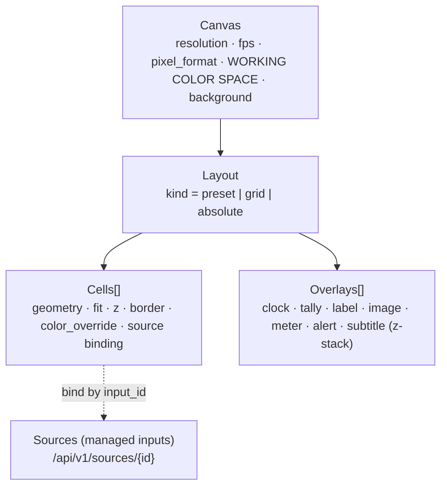

# Layout & Configuration

How Mosaic describes **what to render**: the layered template model (Canvas → Layout → Cells →
Overlays), the source-binding and hot-swap model, transitions, the named presets, and the
**config-as-code** schema used for both human authoring (TOML) and the wire/API (JSON).

> **Scope.** This is the reference for the *declarative* layer. The runtime that consumes it (the
> output clock, compositor, degradation loop) is described in
> [`../research/core-engine.md`](../research/core-engine.md); the full management surface (every
> API resource + UI control) is in
> [`../research/management-capability-matrix.md`](../research/management-capability-matrix.md).

**Crate:** schema, validation, and import/export live in **`mosaic-config`** (serde + `schemars`
JSON Schema + `garde` semantic checks). The layout/template *types* are part of **`mosaic-core`**.
See conventions: [`../architecture/conventions.md`](../architecture/conventions.md).

---

## 1. The layered model

A layout document is resolved, deadline-by-deadline, into an ordered list of draw quads
(`{source_id, src_rect, dst_rect, z, alpha, fit, crop, transform}`) that maps 1:1 onto any
compositor backend. Editing a layout is just publishing a new resolved list atomically — see §6.



| Layer | Owns | API resource | Key invariant |
|-------|------|--------------|---------------|
| **Canvas** | resolution, fps (rational), pixel format, **working color space**, background, default tone-map | `PATCH /api/v1/layouts/{id}/canvas` | Geometry/colorspace are **pinned per output session** — changing them while bound is the one non-hot media path (§3). |
| **Layout** | placement strategy (preset / CSS-grid tracks / absolute rects) + gaps | `PATCH /api/v1/layouts/{id}/layout` | Grid uses fr/px/% tracks + `grid-template-areas` ASCII map. |
| **Cell** | per-tile geometry, fit, z, border, corner radius, crop, transform, opacity, color override, QoS, **source binding** | `.../cells/{cellId}` | A cell *references* a source by `input_id`; inline specs are convenience-only. |
| **Overlay** | first-class z-stack layers attached to canvas or a cell | `.../overlays/{overlayId}` | Always above their target's z; premultiplied-alpha over. |

**Ownership boundaries** (to avoid two sources of truth): canvas owns resolution/fps/pixfmt/working
color space; the cell owns geometry/fit/binding; the *source* (`/api/v1/sources/{id}`) owns per-input
ingest/decode/color-override/jitter/resilience. Cells never re-declare ingest credentials. See
[ADR-M001](../decisions/ADR-M001.md).

---

## 2. Canvas

The canvas is the single frame everything is composited onto. The working color space is the
**single source of truth** for the linear pipeline; outputs *inherit* its CICP tags (tagging never
converts — see [ADR-C006](../decisions/ADR-C006.md)).

```toml
[canvas]
width        = 1920
height       = 1080
fps          = "60000/1001"     # ALWAYS a rational string; never float fps (NTSC 1001 exact)
pixel_format = "nv12"            # nv12 (8-bit) | p010 (10-bit, required for HDR)
background   = "#101014"         # color (or { asset = "ast_bg" })

[canvas.color]
profile   = "sdr-bt709-limited"  # see table below
primaries = "bt709"              # advanced override (only when profile = "custom")
transfer  = "bt709"
matrix    = "bt709"
range     = "limited"            # full-range is warned

[canvas.tonemap]                  # default HDR->SDR map; per-cell overridable
algorithm = "bt2390"
peak_nits = 203                   # 203-nit reference white (the "wash-out fix")
desat     = 1.0
```

### Working color space profiles

| `profile` | primaries / transfer / matrix | pixel_format | Notes |
|-----------|-------------------------------|--------------|-------|
| `sdr-bt709-limited` *(default, safe)* | bt709 / bt709 / bt709, limited | `nv12` | The default for all presets. |
| `hdr-pq-bt2020` | bt2020 / pq / bt2020ncl, limited | `p010` | Adds `color.hdr_metadata` (ST 2086 / MaxCLL / MaxFALL). Expert-gated. |
| `hdr-hlg-bt2020` | bt2020 / hlg / bt2020ncl, limited | `p010` | Broadcast HDR. |
| `custom` | explicit four axes | per bit depth | Validator forces all four CICP axes (never leave CICP=2). |

The linear working buffer is always `Rgba16Float`; the profile only drives whether gamut-convert +
tone-map stages run and the required bit depth. HDR canvas requires `pixel_format = "p010"` and
10-bit-capable outputs — the validator enforces this before apply. See
[`../research/color-management.md`](../research/color-management.md),
[ADR-C001](../decisions/ADR-C001.md), and [ADR-C005](../decisions/ADR-C005.md).

> **Reset boundary.** `width/height/fps/pixel_format/color.profile` are **Class-2** when a layout is
> on Program and bound to a running output: the change is borne as a controlled, make-before-break
> reset by the attached outputs (their geometry/codec/GOP are pinned per session). The API surfaces
> this via `POST /api/v1/outputs/{id}/plan` before apply. See [ADR-M005](../decisions/ADR-M005.md).

---

## 3. Layout strategies

A layout is expressible three ways. All three resolve to the same draw-quad list; the custom
compositor (not FFmpeg/GStreamer) owns all fit/cover/crop/gaps/borders/rounded-corners — see
[ADR-0005](../decisions/ADR-0005.md).

### 3.1 Named preset

```toml
[layout]
kind   = "preset"
preset = "1+5"        # 2x2 | 3x3 | 1+5 | pip  (see §7)
```

### 3.2 CSS-grid tracks (asymmetric, the 1+5 expanded)

```toml
[layout]
kind    = "grid"
columns = ["3fr", "1fr"]          # fr | px | %
rows    = ["1fr", "1fr", "1fr"]
gap     = 8                        # or row_gap / column_gap
areas = [
  "big small1",
  "big small2",
  "big small3",
]
```

Cells then bind to named `area`s (`area = "big"`). `areas` is a `grid-template-areas` ASCII map; a
repeated name spans those grid tracks.

### 3.3 Absolute normalized rects (arbitrary PiP / overlap)

```toml
[[cells]]
z    = 10
fit  = "cover"
rect = { x = 0.72, y = 0.74, w = 0.25, h = 0.22 }   # normalized 0..1
```

Used for overlap that a grid can't express. Validator checks `rect` components are in `0..1`.

---

## 4. Cells

A cell renders one source into a sub-rectangle. Cells are placed either by `area` (grid) or `rect`
(absolute). Almost every cell parameter is **hot** (applied at a frame boundary via the atomic
double-buffered scene-graph swap).

```toml
[[cells]]
id            = "cell_big"
area          = "big"            # OR rect = { x, y, w, h }
z             = 0
fit           = "cover"          # fill | contain | cover | none | scale_down
align         = "center"         # 9-point object-position (anchor for crop/letterbox)
opacity       = 1.0              # premultiplied, linear
corner_radius = 6               # SDF clip
scaler        = "lanczos"        # auto | bilinear | lanczos
visible       = true            # hidden -> decode-skip

[cells.border]
width_px = 0
color    = "#FFCC00"
style    = "solid"

[cells.crop]                      # source-space crop (src-rect)
x = 0.0; y = 0.0; w = 1.0; h = 1.0

[cells.transform]
rotate = 0; flip_h = false; flip_v = false

[cells.qos]                       # shared TilePolicy (also editable in System QoS)
priority    = 100
degradation = "maintain-resolution"   # maintain-fps | maintain-resolution | balanced

[cells.source]                    # see §5
input_id = "in_camA"

[cells.audio]
track   = 0
gain_db = 0.0

[cells.fallback]                  # on signal loss
kind          = "slate_card"      # offline_card | slate_card
card_asset_id = "ast_signal_lost"
stale_ms      = 2000
```

### Fit modes (CSS `object-fit` vocabulary)

| `fit` | Behaviour |
|-------|-----------|
| `fill` | Stretch to the cell (ignores aspect). |
| `contain` | Fit inside; letterbox the destination. |
| `cover` | Fill the cell; crop the source (src-rect). |
| `none` | 1:1; crop if larger. |
| `scale_down` | `none` or `contain`, whichever is smaller. |

Cover/none crop the source; contain/scale_down pad the destination. `align` is the anchor for both.
Hidden cells (`visible=false`) drop to decode-skip. Per-cell `color_override` and `tonemap` feed the
compositor kernel uniforms directly (hot, no output reset). See
[ADR-E001](../decisions/ADR-E001.md) for decode-at-display-resolution and
[ADR-C003](../decisions/ADR-C003.md) for premultiplied-linear compositing.

---

## 5. Source binding & hot swap

A cell binds a **managed input** by id (preferred) or carries an inline spec (convenience-only;
promoting inline → managed is a first-class action so credentials/policy live once). The managed
input is the owner of ingest/decode/color/jitter/reconnect — see
[`../research/management-capability-matrix.md`](../research/management-capability-matrix.md) §2.1.

```toml
# Preferred: reference a managed input
[cells.source]
input_id = "in_camA"

# Inline (convenience) — bound by NDI source name, with offline fallback
[cells.source]
kind     = "ndi"
name     = "STUDIO (CAM 1)"
fallback = "offline_card"
```

### Hot swap (no black flash)

Swapping the source in a live cell is **hot**: the engine pre-warms the new input off-air, then
binds at a frame boundary, optionally with a transition.

```http
POST /api/v1/layouts/{id}/cells/{cellId}/source:swap
{ "input_id": "in_camB", "transition": { "kind": "crossfade", "duration_ms": 300 } }
```

| Action | API | Apply |
|--------|-----|-------|
| Bind | `PUT .../cells/{cellId}/source {input_id\|inline}` | Hot (pre-warm then bind) |
| Hot swap | `POST .../cells/{cellId}/source:swap {input_id,transition}` | Hot (no black flash) |
| Unbind | `DELETE .../cells/{cellId}/source` | Hot (reverts to placeholder) |
| NDI bind-by-name + fallback | `PUT .../cells/{cellId}/source {kind:"ndi",name,fallback}` | Hot (offline card until resolved) |

Unresolved/lost sources never blank the mosaic: the tile rides
**LIVE → STALE → RECONNECTING → NO_SIGNAL** and renders last-good-frame, then the configured
placeholder/slate card. This is a load-bearing engine invariant —
see [`../research/core-engine.md`](../research/core-engine.md) and
[ADR-R001](../decisions/ADR-R001.md).

---

## 6. Overlays

Overlays are first-class layers in the z-stack, attached to the canvas or a specific cell, with a
9-point anchor + normalized offset (or an absolute `rect`). Each carries
target/anchor/z/opacity/blend/clip/visibility/color_space plus kind-specific params and optional
data binding. Rendered off the hot path (glyphon/Vello + SDF, premultiplied alpha, dirty-region
uploads) — see [ADR-R008](../decisions/ADR-R008.md).

**Kinds:** `label`, `clock`, `timecode`, `image`, `logo`, `tally_border`, `box`, `meter`,
`alert_card`, `subtitle`, `lower_third`.

```toml
[[overlays]]
id     = "ov_clock"
kind   = "clock"
target = "canvas"            # canvas | <cellId>
anchor = "bottom_right"      # 9-point
offset = { x = -20, y = -16 }
z      = 100
format = "%H:%M:%S"
tz     = "Australia/Sydney"
source = "wall"              # always-ticking clock doubles as a falter sentinel

[[overlays]]
id       = "ov_tally_big"
kind     = "tally_border"
target   = "cell_big"        # attach to a cell
z        = 50
width_px = 6
color    = "#FF0000"
binding  = "tally://cell_big"   # driven by external state (enumerable namespace)
```

On an HDR canvas, an overlay's `color_space` (e.g. `sRGB`) is converted to the canvas space
(BT.2020) before compositing. Overlay lifecycle (add/remove/duplicate/reorder) and per-kind params
are enumerated in the capability matrix §2.2/§2.6.

---

## 7. Transitions, Program/Preview, and presets

### 7.1 Transitions

Layout/source changes go live via the Program/Preview bus (cue-then-take). Transitions are applied
through the double-buffered scene-graph swap, so they never tear the protected output.

```http
POST /api/v1/program:take { "transition": { "kind": "crossfade", "duration_ms": 500, "curve": "ease", "align": "keyframe" } }
```

| `kind` | Params | Notes |
|--------|--------|-------|
| `cut` | — | Instant atomic swap. |
| `crossfade` | `duration_ms`, `curve` | Linear blend in linear light. |

`align: "keyframe"` aligns the swap to a keyframe boundary to avoid artifacts. The take is the only
path to live; `?dry_run=true` returns the live-apply classification (Class-1 / reset-lite / Class-2)
without applying — see [ADR-M005](../decisions/ADR-M005.md).

### 7.2 Named presets

Presets are factory layouts that preserve source bindings by area name when applied
(`POST /api/v1/layouts/{id}:apply-preset` / `GET /api/v1/presets`). Example configs ship under `examples/`.

| Preset | Grid expansion | Use |
|--------|----------------|-----|
| `2x2` | `columns=["1fr","1fr"]`, `rows=["1fr","1fr"]` | 4 equal tiles. |
| `3x3` | `columns=["1fr","1fr","1fr"]`, `rows×3` | 9 equal tiles. |
| `1+5` | `columns=["3fr","1fr"]`, `rows×3`, areas `big`/`small1..3` (+2) | 1 large + 5 small. |
| `pip` | 1 full-frame cell + 1 absolute `rect` cell at higher `z` | Picture-in-picture. |

---

## 8. Full TOML example (1 + 5 with PiP, mixed sources)

Consistent with `examples/`. A managed-inputs section plus a layout document; outputs are shown for
completeness (their detail lives in the output reference).

```toml
# examples/studio-1plus5.toml
schema_version = 1

[canvas]
width = 1920; height = 1080
fps = "60000/1001"
pixel_format = "nv12"
background = "#101014"
[canvas.color]
profile = "sdr-bt709-limited"

# --- Managed inputs (owners of ingest/decode/color/resilience) ---
[[sources]]
id = "in_camA"
display_name = "Stage Camera (Main)"
kind = "rtsp"
url  = "rtsp://cam-stage.lan/main"
[sources.rtsp]
transport = "tcp"
[sources.auth]
secret_ref = "op://Servers/cam-stage/credentials"   # reference only; never plaintext
[sources.color_override]
primaries = "auto"; transfer = "auto"; matrix = "auto"; range = "auto"

# --- Layout document ---
[layout]
kind = "grid"
columns = ["3fr", "1fr"]
rows    = ["1fr", "1fr", "1fr"]
gap = 8
areas = ["big small1", "big small2", "big small3"]

[[cells]]
id = "cell_big"; area = "big"; z = 0; fit = "cover"; corner_radius = 6; scaler = "lanczos"
[cells.qos]
priority = 100; degradation = "maintain-resolution"
[cells.source]
input_id = "in_camA"

[[cells]]
id = "cell_s1"; area = "small1"; fit = "contain"; static_friendly = true
[cells.source]
kind = "ndi"; name = "STUDIO (CAM 1)"; fallback = "offline_card"

[[cells]]                                   # PiP via absolute normalized rect
id = "cell_pip"; z = 10; fit = "cover"; corner_radius = 8
rect = { x = 0.72, y = 0.74, w = 0.25, h = 0.22 }
[cells.border]
width_px = 3; color = "#FFCC00"; style = "solid"
[cells.source]
kind = "rtmp"; url = "rtmp://ingest.lan/live/guest"

[[overlays]]
id = "ov_clock"; kind = "clock"; target = "canvas"; anchor = "bottom_right"
offset = { x = -20, y = -16 }; z = 100; format = "%H:%M:%S"; tz = "Australia/Sydney"; source = "wall"

[[overlays]]
id = "ov_tally_big"; kind = "tally_border"; target = "cell_big"; z = 50
width_px = 6; color = "#FF0000"; binding = "tally://cell_big"

# --- Outputs (encode-once; see output reference) ---
[[outputs]]
kind = "rtsp_server"; mount = "/mosaic"; codec = "h264"; latency_profile = "low_latency"

[[outputs]]
kind = "ll_hls"; path = "/hls/mosaic"; codec = "h264"
part_target_ms = 250; segment_ms = 2000; gop_ms = 2000
```

The same document in canonical JSON wire form (the layout subset, as returned by `GET
/api/v1/layouts/{id}`) is in
[`../research/management-capability-matrix.md`](../research/management-capability-matrix.md) §3.2,
including the HDR canvas variant (`color.profile = "hdr-pq-bt2020"`, `pixel_format = "p010"`).

---

## 9. Config-as-code (import / export)

Mosaic is config-as-code first: the entire engine state (sources + layouts + outputs + policy) is a
single declarative document that can be exported, version-controlled, diffed, and re-applied. TOML
is for human authoring; JSON is the canonical over-the-wire form. Layered loading uses `figment`
(TOML + JSON + env overrides). See [ADR-0010](../decisions/ADR-0010.md) and
[ADR-M006](../decisions/ADR-M006.md).

```mermaid
flowchart LR
    TOML["mosaic.toml / JSON<br/>(authoring)"] -->|import| VALIDATE
    VALIDATE["Validate<br/>JSON Schema (schemars) + garde semantics"] --> DIFF
    DIFF["Diff vs live<br/>classifies Class-1 / reset-lite / Class-2"] --> APPLY
    APPLY["Apply (atomic)"] --> LIVE["Live engine"]
    LIVE -->|export secrets=ref\|redact| TOML
    LIVE --> VERS["Versions + rollback<br/>(audit-tied)"]
```

| Operation | API | Notes |
|-----------|-----|-------|
| Get current config | `GET /api/v1/config?format=toml\|json` | Whole-engine snapshot. |
| Validate (dry) | `POST /api/v1/config:validate` | Schema + semantic checks; no apply. |
| Apply | `PUT /api/v1/config` / `POST /api/v1/config:apply` | Diff classifies; Class-2 surfaced before commit. |
| Versions / diff | `GET /api/v1/config/versions`, `POST .../:diff` | Author + message; side-by-side diff. |
| Rollback | `POST /api/v1/config/versions/{rev}:rollback?dry_run` | Shows reset/consumer-reconnect impact first. |
| Export | `GET /api/v1/config:export?secrets=ref\|redact` | **Never plaintext secrets** (`${secret:ref}` / `op://…`). |
| Import | `POST /api/v1/config:import` | Schema migration applied on import. |

**Validation invariants enforced by `mosaic-config`:**

- `fps` is a rational string (`"60000/1001"`), never a float.
- Absolute `rect` components are in `0..1`; required grid cells don't overlap; `z` is sane.
- All four CICP axes set when `color.profile = "custom"`; HDR profile requires `p010`.
- Adjacently-tagged enums (`#[serde(tag = "kind")]`) for source/overlay/fit unions — never
  `untagged` (robust across TOML and JSON). Top-level `schema_version` drives migration.

**Secrets are reference-only.** Credentials never appear inline; sources carry `auth.secret_ref`
(e.g. `op://…`), and export rewrites any value to `${secret:ref}`. Versions are audit-tied and
append-only. See [ADR-M006](../decisions/ADR-M006.md).

---

## 10. Live-apply classification (what resets)

Every layout/config edit is classified and surfaced *before* apply via the dry-run plan. See
[ADR-M005](../decisions/ADR-M005.md).

| Change | Class | Why |
|--------|-------|-----|
| Cell geometry/fit/z/border/opacity/crop/transform | **Class-1 (hot)** | Atomic scene-graph swap at a frame boundary. |
| Source bind / hot-swap / unbind | **Class-1 (hot)** | Pre-warm then bind; no black flash (§5). |
| Overlay add/edit/remove/reorder | **Class-1 (hot)** | Off-hot-path layer stack. |
| Add/remove cell, apply preset, transition | **Class-1 (hot)** | Scene swap (source pre-warmed). |
| Per-source / per-cell `color_override`, `tonemap` | **Class-1 (hot)** | Compositor kernel uniforms. |
| Canvas `width/height/fps/pixel_format/color.profile` (while bound) | **Class-2 (reset)** | Pinned per output session; make-before-break migration borne by outputs. |

---

## Related

- Engine that consumes the resolved layout: [`../research/core-engine.md`](../research/core-engine.md)
- Full management surface (every parameter): [`../research/management-capability-matrix.md`](../research/management-capability-matrix.md)
- Color pipeline depth: [`../research/color-management.md`](../research/color-management.md)
- ADRs: [ADR-0010](../decisions/ADR-0010.md) · [ADR-M001](../decisions/ADR-M001.md) ·
  [ADR-M005](../decisions/ADR-M005.md) · [ADR-M006](../decisions/ADR-M006.md) ·
  [ADR-C001](../decisions/ADR-C001.md) · [ADR-C005](../decisions/ADR-C005.md) ·
  [ADR-R008](../decisions/ADR-R008.md) · [ADR-E001](../decisions/ADR-E001.md)
- Conventions (source of truth): [`../architecture/conventions.md`](../architecture/conventions.md)
