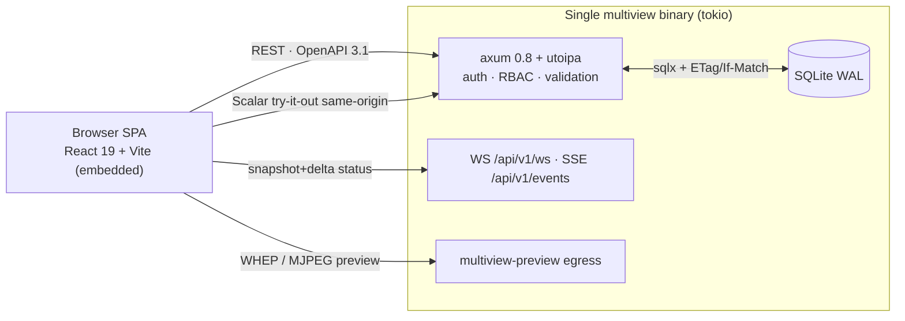
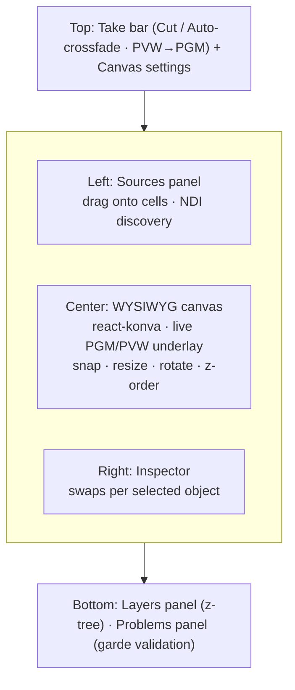
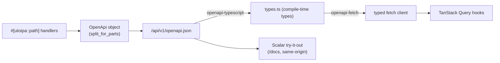

# Multiview — Management Web App

> The design of the **management SPA** that fully and completely operates the Multiview engine: its
> stack, screens, the canvas layout editor, the typed-client-from-OpenAPI flow, and the UX,
> accessibility, and theming principles that make it a polished broadcast control surface.
>
> **Source of truth:** [`../architecture/conventions.md`](../architecture/conventions.md) pins
> canonical crate names, API paths, feature flags, invariants, and licensing. Where any doc
> disagrees with conventions, conventions wins; the Rust code is the ultimate authority.

The SPA lives at `web/` and is embedded into the single `multiview` binary via `rust-embed`
([ADR-W007](../decisions/ADR-W007.md)). It talks only to the [`multiview-control`](../architecture/conventions.md)
HTTP/realtime API on the **same origin** — there is no second service to deploy.

---

## 1. What the app is for

Multiview is a GPU compositor that ingests many live sources, composites a templated multiview, and serves
it over RTSP / HLS / NDI / RTMP / SRT with **bulletproof continuous output**. The management app is
the human surface over the whole control plane: every parameter the engine exposes is reachable
through a `/api/v1` resource and surfaced in a named screen + control. The authoritative proof of
completeness is the **[Management Capability Matrix](../research/management-capability-matrix.md)** —
every row maps an engine parameter → API method → UI control → live-apply class.

Two non-negotiables shape every screen:

- **Isolation** (invariant 10): the UI is best-effort and is *physically incapable* of
  back-pressuring the engine. It reads conflated snapshots/deltas and never blocks the render loop.
- **Live-apply transparency** (invariant 11): before applying any change the UI tells the operator
  whether it is **Class-1** (hot/seamless), **reset-lite**, or **Class-2** (controlled reset /
  parallel migration). It never fakes "done."

---

## 2. Stack (locked)

| Concern | Choice | ADR |
|---|---|---|
| Framework + language + bundler | **React 19 + TypeScript + Vite** | [ADR-W003](../decisions/ADR-W003.md) |
| Design system | **shadcn/ui** (Radix primitives + Tailwind v4) | [ADR-W003](../decisions/ADR-W003.md) |
| Server state | **TanStack Query** | [ADR-W003](../decisions/ADR-W003.md) |
| Lists / tables | **TanStack Table** (source/output/user lists) | [ADR-W003](../decisions/ADR-W003.md) |
| Layout-editor canvas | **react-konva** (drag / Transformer resize+rotate / z-order / hit-test) | [ADR-W004](../decisions/ADR-W004.md) |
| Accessible DnD | **dnd-kit** (palette → canvas drag, reorderable lists) | [ADR-W004](../decisions/ADR-W004.md) |
| Typed API client | **openapi-typescript + openapi-fetch** generated from the spec | [ADR-W002](../decisions/ADR-W002.md) |
| Build / serve | Vite build embedded at compile time via **rust-embed** | [ADR-W007](../decisions/ADR-W007.md) |

shadcn/ui is **copy-in source** (no runtime lock-in); Radix gives WCAG / WAI-ARIA keyboard and focus
behaviour for free; Tailwind v4 OKLCH tokens + `.dark` override give coherent light/dark theming.
React's depth in the canvas + DnD + component ecosystem is the deciding factor because **the layout
editor is the highest-polish surface** — see the [web-api-stack brief](../research/web-api-stack.md)
for the full rejection of SvelteKit / Leptos / Dioxus and react-grid-layout.

---

## 3. App shell & navigation

A persistent left nav + a top **Program/Preview bar** (always visible during live operation). The
clock in the bar double-duties as a **falter sentinel** — if it stops ticking, the operator sees the
pipeline stalled at a glance.

| # | Screen | Primary resources | Capability-matrix section |
|---|---|---|---|
| 1 | **Dashboard / Monitoring** | health, SLO, alerts, meters, live preview | [§2.8](../research/management-capability-matrix.md) |
| 2 | **Sources** | `/api/v1/sources/{id}` | [§2.1](../research/management-capability-matrix.md) |
| 3 | **Layout / Template Editor** | `/api/v1/layouts/{id}`, `/api/v1/program` | [§2.2](../research/management-capability-matrix.md) |
| 4 | **Outputs / Transcoding** | `/api/v1/outputs/{id}`, `/api/v1/renditions/{id}` | [§2.3](../research/management-capability-matrix.md) |
| 5 | **Audio routing** | `/api/v1/outputs/{id}/audio`, source audio attrs | [§2.4](../research/management-capability-matrix.md) |
| 6 | **System / Policy** | capabilities, adaptive + resilience policy, observability | [§2.7–2.8](../research/management-capability-matrix.md) |
| 7 | **Users / Security / Settings** | users, roles, tokens, secrets, audit, TLS/CORS/ports | [§2.9](../research/management-capability-matrix.md) |
| — | **API Docs** | embedded **Scalar** try-it-out, same-origin | [ADR-W002](../decisions/ADR-W002.md) |

> Realtime status (WebSocket primary at `/api/v1/ws`, SSE fallback at `/api/v1/events`) and the live
> multiview preview (WHEP + MJPEG) are designed in the
> [realtime-api](../research/realtime-api.md) and [preview-subsystem](../research/preview-subsystem.md)
> briefs; the app consumes them but does not redefine them here.

---

## 4. The key screens

### 4.1 Dashboard / Monitoring

The operator's "is everything alive?" view. Per-tile FPS / bitrate / up-down, the **Output Validity
SLO** (zero-gap / PTS continuity / TR 101 290), active alerts, and the **adaptation panel** showing
the live degradation-ladder position + active lever + the *"why"* sensor reading. Audio meters
(EBU R128, true-peak) render from a conflated **10–25 Hz** numeric stream — never the raw audio rate.
A **live multiview preview** uses WHEP `<video>` for sub-second motion with a graceful MJPEG fallback
that always ships (works where UDP/TURN is blocked). All cards are SSE/WS-driven into the TanStack
Query cache — read-only, drop-oldest, never blocking.

### 4.2 Sources

Add / edit / test ingest of `rtsp | hls | ts | srt | rtmp | ndi | file | test`. Highlights:

- **Probe-first add flow:** paste URL → **Test** (ffprobe) → auto-fill dropdowns → **Pre-warm** →
  **Cue** → **Take**. No blind commits.
- **Dynamic protocol form:** the selector re-renders the sub-form to that protocol's fields
  (RTSP transport, HLS reconnect flags, SRT mode/latency with a µs-vs-ms helper, NDI source picker
  fed by `/api/v1/discovery/ndi`, TS program selector, test pattern).
- **Color tab is the centerpiece** ([ADR-M003](../decisions/ADR-M003.md)): each of the four CICP
  axes (primaries / transfer / matrix / range) shows its **detected value + provenance badge**
  (Frame / Codec / Container / Guessed) with an Override dropdown defaulting to Auto, and a live
  **before/after split** on the preview. Guard rails warn loudly on forcing PQ/HLG onto an SDR
  source. Applies **Hot** (per-frame compositor uniforms — no output reset). Deep dive:
  [color-management brief](../research/color-management.md).
- **Decode-at-display-resolution** toggle shows a **realized-tier badge** per backend (fused NVDEC /
  best-effort VideoToolbox / VPP / no-op software) so the UI never makes false VRAM promises.
- **Credentials are write-only:** source URL secrets are stored as `secret_ref` / `${secret:ref}`,
  masked in the API, and never echoed back ([ADR-W005](../decisions/ADR-W005.md)).

### 4.3 Layout / Template Editor (react-konva + dnd-kit)

The flagship, highest-polish surface and the reason React was chosen. Multiview is a free-form GPU
compositor (overlap, z-order, rotation, sub-pixel placement) — **not** a strict grid — so the editor
uses **react-konva** for the canvas and **dnd-kit** for accessible drag ([ADR-W004](../decisions/ADR-W004.md)).

- **Free-form compositing:** Konva natively gives drag, Transformer resize/rotate, layer z-order, and
  hit detection; cell geometry is editable **on-canvas and numerically** (kept in sync). Cells carry
  `rect` (0..1), `z`, `fit`, `crop`, `rotation`, `opacity`, `corner_radius`, `border`, per-cell
  `color_override` and `tonemap`, and `qos`.
- **Source binding by drag:** drop a source from the left palette onto a cell; **swap** does a
  pre-warm-then-bind hot swap with no black flash. dnd-kit makes the palette drag and the Layers
  reorder **fully keyboard- and screen-reader-operable**.
- **Overlays are first-class z-stack layers:** label / clock / timecode / image / logo / tally_border
  / box / meter / alert_card / subtitle / lower_third, each targeting canvas or a cell.
- **Live underlay:** the canvas shows the live program/preview and per-cell thumbnails, **decoupled
  from input health** — a dead input shows its slate, the editor stays responsive.
- **Cue-then-take is the only path to live:** edit a draft, send to **Preview (PVW)**, then **Take**
  (Cut or Auto-crossfade) atomically to **Program (PGM)**. Drafts never touch the live output.
- **Editor-only chrome:** snap / guides / safe-areas are persisted in `editor_prefs` and are
  **never rendered** into the multiview.
- **Problems panel:** field-level validation (garde + schemars) surfaced inline, plus a Take-bar
  **dry-run/diff** that flags `reset_required` before apply.

### 4.4 Outputs / Transcoding

Per-output encode + container + reliability. The model is **encode-once, scale-per-output, fan-out**
([ADR-M002](../decisions/ADR-M002.md)): the canvas composites once; each output/rendition does a GPU
scale → one encode session. The UI badges this directly:

- Two outputs sharing canvas + rendition + codec + bitrate → **"shares encoder, free fan-out."**
- A differing rendition → **"+1 against the NVENC budget,"** with the **live session budget**
  (probed, never hardcoded) shown as used / total.

**Capability-gated forms:** the Protocol dropdown is first and re-renders to that protocol's
capability set; every codec / profile / level / session option is gated by the
**[CapabilityReport](../research/management-capability-matrix.md)** ([ADR-M007](../decisions/ADR-M007.md)) —
impossible options are greyed with an explanatory tooltip. Encoder backend defaults to **Auto** with
live availability from Capabilities. A **latency-profile** segmented control (Low-latency / Quality
VOD / Custom) bundles per-backend flags.

**Color tagging** forces all four CICP axes (never `CICP=2`), defaults to inherit the canvas working
space, and warns when an override disagrees with canvas pixels — **tagging never converts**. HDR is
**explicit-only** (the toggle couples PQ/HLG + BT.2020 + 10-bit and reveals ST 2086 / MaxCLL /
MaxFALL). A **post-encode ffprobe verify gate** shows observed-vs-expected in the Health panel.

**Live-apply discipline:** Hot params (bitrate, rc.mode, fps via NVENC reconfig, color relabel) apply
seamlessly; pinned structural params (`codec`, `profile`, `pixel_format/bit_depth/chroma`, GOP
structure, `max_width/height`, HDR enable) trigger the **Class-2 migration banner**: *"will reset N
outputs / consumers reconnect"* + confirm ([ADR-M005](../decisions/ADR-M005.md)).

### 4.5 Audio routing

A **capability-aware routing matrix** ([ADR-M004](../decisions/ADR-M004.md)): rows = inputs, columns =
output tracks/channels. Impossible cells are greyed per output's carrier (N tracks on TS/RTSP;
select-one on HLS; channels-only on NDI; 1-or-N on RTMP), and any **degradation taken is shown
explicitly** (e.g. *"Twitch: degraded to single mixed bus"*) — never a silent drop. The **program
bus** (EBU R128 loudnorm, default −23 LUFS / −1.5 dBTP) is presented separately from the **clean
discrete tracks**. Source-owned audio *attributes* (track select, gain, mute, in-program-bus,
metering) live on the Sources screen; the **cross-product input→output-track mapping** is owned here.

### 4.6 System / Policy

Capability-aware gating throughout, plus a **live session-budget calculator** (renditions +
hot-standby + preview) against the host-wide NVENC cap (it warns the cap is shared across processes).

- **Adaptive policy** ([core-engine brief](../research/core-engine.md)): mode (auto / assisted /
  manual), control loop (tick / hysteresis / cooldown), targets, admission control, cost model, and a
  drag-to-reorder **degradation ladder** (cheapest-impact-first; most levers Hot, the
  output-resolution lever is Class-2). Adaptation is fully transparent: live ladder position + active
  lever + "why."
- **Resilience policy** ([resilience brief](../research/resilience-and-av.md)): per-tile
  hold/stale/nosignal timers, slate cards, reconnect backoff, circuit breaker (live state badges),
  supervision restart intensity, watchdogs, encoder hot-standby/recycle, GPU-loss fallback chain.
- **Observability:** metrics export, OTLP tracing, live log tail (secrets redacted), alert rules,
  SLO dashboard.
- **Capabilities** (read-only): detected GPUs, backend matrix (compiled-in vs probed), codec support,
  encode-session caps, VRAM, host cgroup/PSI, and the effective license/build (incl. **NDI
  attribution** when the `ndi` feature is active — see [conventions §7](../architecture/conventions.md)).

### 4.7 Users / Security / Settings

RBAC **admin / operator / viewer** via `axum-login` ([ADR-W005](../decisions/ADR-W005.md)), reflected
in the UI: viewer hides mutating controls; operator hides Users / Tokens / Secrets / TLS.

- **API tokens:** shown **once** at creation, scoped, revocable.
- **Secrets store:** write-only / reference-based (`op://` refs); never plaintext in the API or
  exports.
- **Audit log:** append-only, exportable.
- **Settings:** network bind/port (listener-restart — labelled *"control-plane reconnect (safe)"* so
  operators don't fear it), TLS, CORS, media ports.
- **Config-as-code** ([ADR-M006](../decisions/ADR-M006.md)): a JSON/TOML editor with JSON-Schema
  validation, **Validate / Dry-run / Apply**, a diff view that classifies the change, version history
  with author/message and side-by-side diff, and rollback that **computes and shows the reset impact
  before applying**. Export offers `secrets=ref|redact`.

---

## 5. UX principles (what makes it polished)

- **Optimistic mutations + truthful confirmation.** TanStack Query applies the edit optimistically;
  the SSE/WS event stream confirms the engine actually applied it at a frame boundary. Long-running
  reconfig returns **`202 Accepted` + an operation id** and shows real progress — never a fake "done."
- **Live-apply badges everywhere.** Every control surfaces Class-1 / reset-lite / Class-2 via
  `POST .../plan` and `take?dry_run=true` before apply, so an operator always knows the blast radius.
- **"Feels live."** Sub-second WHEP preview where possible, graceful MJPEG fallback always — never a
  black box.
- **Field-level errors from the wire.** Validation failures are surfaced from the RFC 9457
  `application/problem+json` `errors[]` array directly onto the offending fields.
- **Optimistic concurrency, no clobbering.** Every mutable resource carries a version → `ETag` /
  `If-Match`; a `412` means another operator changed it first, and the UI re-fetches and shows the
  conflict rather than silently overwriting ([ADR-W006](../decisions/ADR-W006.md)).
- **One coherent design system.** Prebuilt dashboard blocks, consistent spacing, dark/light, no jank.

---

## 6. Accessibility & theming

- **WCAG 2.1 AA** ([conventions §8](../architecture/conventions.md)); the briefs target 2.2 AA where
  feasible. Radix primitives provide WAI-ARIA roles, full keyboard navigation, and focus management
  for free; **dnd-kit** keeps the source-palette drag and the Layers reorder keyboard- and
  screen-reader-operable, including inside the canvas editor.
- **Theming** via Tailwind v4 OKLCH design tokens with a `.dark` override — light and dark are both
  first-class and visually coherent.
- **Color-pipeline accessibility caveat:** the editor's own UI chrome respects theme tokens, but the
  *multiview preview* shows true engine output (HDR/SDR, wide gamut). The Color tabs surface provenance
  and warnings precisely so operators are never misled by a tone-mapped browser approximation.

---

## 7. Typed client from OpenAPI (no drift)

The API is **code-first OpenAPI 3.1** via utoipa: `OpenApiRouter` + `routes!` register
`#[utoipa::path]` handlers, and `split_for_parts()` yields **both** the axum `Router` and the
`OpenApi` object from one source ([ADR-W002](../decisions/ADR-W002.md)). The SPA's client is
**generated**, not hand-written:

- **Generation step (xtask / CI):** `xtask` exports the `OpenApi` object to `openapi.json`, then
  `openapi-typescript` generates types and `openapi-fetch` wraps a type-only client; TanStack Query
  hooks build on top. The same spec backs external SDKs via openapi-generator.
- **CI guard:** validate the generated spec early and fail on drift between handlers and the committed
  spec — there is exactly one source of truth.
- **Polymorphic schemas:** the `oneOf` Source/Output transport variants use serde tagging + explicit
  discriminator mapping so the generated TypeScript discriminated unions are clean.
- **Scalar same-origin:** docs are served same-origin at `/docs` using **relative `servers` URLs**
  with `proxyUrl` set to a same-origin path (Scalar does not disable its external proxy on
  origin-equality alone) — see the [web-api-stack brief](../research/web-api-stack.md).

---

## 8. Build & deploy

Vite builds the SPA; the output is embedded into the `multiview` binary at compile time via
**rust-embed**, with an SPA-fallback handler serving `index.html` for client routes
([ADR-W007](../decisions/ADR-W007.md)). One process, one port, sub-1 MB bundle. The Vite build is
wired into the cargo build (the `embed-web` feature) so embedded assets never go stale; dev uses a
Vite proxy to a locally running `multiview`. `tower-http`'s `ServeDir` cannot serve embedded files —
rust-embed is required.

---

## See also

- [Management Capability Matrix](../research/management-capability-matrix.md) — authoritative
  parameter → API → UI → apply-class map (the completeness proof).
- [Web/API stack brief](../research/web-api-stack.md) — the full verified stack rationale.
- [Realtime API brief](../research/realtime-api.md) · [Preview subsystem brief](../research/preview-subsystem.md).
- [Color management brief](../research/color-management.md) · [Core engine brief](../research/core-engine.md)
  · [Resilience & A/V brief](../research/resilience-and-av.md).
- ADRs: [W001](../decisions/ADR-W001.md) · [W002](../decisions/ADR-W002.md) ·
  [W003](../decisions/ADR-W003.md) · [W004](../decisions/ADR-W004.md) ·
  [W005](../decisions/ADR-W005.md) · [W006](../decisions/ADR-W006.md) ·
  [W007](../decisions/ADR-W007.md) · [W008](../decisions/ADR-W008.md) · and the management series
  [M001–M007](../decisions/ADR-M001.md).
- [Architecture conventions](../architecture/conventions.md) — the source of truth.
