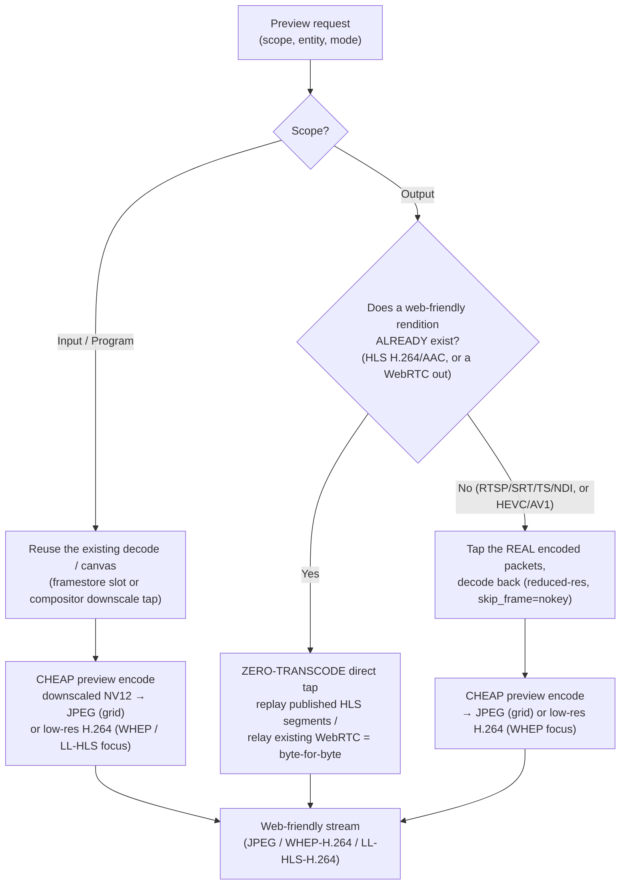
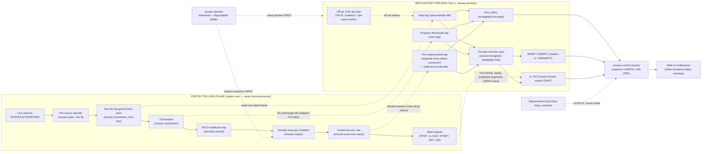

# Mosaic — Preview Subsystem

The preview subsystem lets operators *see* what the engine is doing — every input, the composed
program, and every real encoded output — from a web browser. It is a **strictly best-effort,
read-only side-channel** layered onto the existing data plane. It is implemented in the
**`mosaic-preview`** crate (preview taps, the preview encoder pool, WHEP/MJPEG/snapshot endpoints;
feature `webrtc`) and surfaced through **`mosaic-control`** (axum REST + WebSocket).

> **The one rule that governs everything:** *preview reads frames/packets that already exist (or
> spins up a deliberately-throttled cue decoder for sources that have none), and is paid for ONLY
> while someone is watching.* A slow, stalled, malicious, or absent preview consumer can **never**
> back-pressure, stall, starve, or add jitter to the program path. See
> [conventions §5.10 (Isolation)](../architecture/conventions.md) and the deep
> [Preview Subsystem brief](../research/preview-subsystem.md).

Related canonical references:

- Architecture: [conventions §3, §5, §6](../architecture/conventions.md) (crate map, invariants, preview/realtime conventions).
- Deep briefs: [Preview Subsystem](../research/preview-subsystem.md) · [Efficiency](../research/efficiency.md) · [Resilience & A/V](../research/resilience-and-av.md) · [Management Capability Matrix](../research/management-capability-matrix.md).
- Decisions: [ADR-P001](../decisions/ADR-P001.md) (isolation) · [ADR-P002](../decisions/ADR-P002.md) (transports) · [ADR-P003](../decisions/ADR-P003.md) (on-demand + auto-stop) · [ADR-P004](../decisions/ADR-P004.md) (cue = pre-warm) · [ADR-P005](../decisions/ADR-P005.md) (real-output tap + labels).

---

## 1. The three scopes

Each scope taps a different point on the existing pipeline. **Nothing is re-decoded, re-composited,
or re-encoded just for preview** unless it genuinely has to be (see §4).

| Scope | What you see | Tap point | Re-work? |
|-------|--------------|-----------|----------|
| **Input** | Any individual source, live | `mosaic-framestore` last-good-frame slot (on-air) **or** an isolated cue decoder (off-air) | None for on-air; a cheap thumb-rate decode for off-air |
| **Program** | The composed mosaic *before* the encode path | One extra GPU downscale blit appended to the compositor's render submission, into its own ring | One small downscale blit only |
| **Output** | What each individual output/rendition actually looks like | A tap of the **real encoded packet stream** at the `mosaic-output` encode-once-mux-many fan-out, decoded back | None (decode of existing packets) |

### 1.1 Input scope — on-air vs off-air (the cue)

- **(a) On-air inputs** already bound to a tile and decoded for the program: preview registers as
  an extra non-blocking *reader* of that tile's existing last-good-frame slot. **No second decode.**
  This is the single biggest efficiency win and the core of the isolation guarantee.
- **(b) Off-air sources** not yet in the layout — that an operator wants to *cue and confirm before
  binding* — get a lightweight, process-isolated **cue decoder** spun up on demand (thumbnail-rate,
  low-res). This cue worker **is** the "new input pre-warmed off-air" mechanism: it already holds the
  connection, jitter buffer, decoder, and capability probe, so a later
  `POST /api/inputs/{id}/bind` is an **atomic scene-graph swap at a frame boundary** (Class-1
  seamless reconfig) with zero connect/decode latency. One mechanism serves both *"let me look at
  it"* and *"now put it on air instantly."* See [ADR-P004](../decisions/ADR-P004.md).

### 1.2 Program scope

A single extra GPU downscale blit appended to the compositor's existing render submission writes a
small (~480p, ~1/4 area) NV12 copy into a dedicated preview ring. It is explicitly a **pre-encode
canvas tap** and labelled as such in the UI — it is *not* the encoded output.

### 1.3 Output scope

The default is a tap of the **real encoded packet stream** at the `mosaic-output` fan-out, decoded
back for the operator (a confidence / return-feed monitor). This is the only way to reveal
color-tag, scaling, GOP cadence, and encode-artifact differences between renditions. Every output
preview surface carries a non-negotiable on-video fidelity label:
`REAL ENCODED OUTPUT (tap: <protocol>)` or `PRE-ENCODE CANVAS APPROX` — never silently mixed
([ADR-P005](../decisions/ADR-P005.md)).

> **Status & metrics are NEVER burned into preview pixels.** Per-tile / per-source / per-output
> health rides the existing control-plane WebSocket as compact JSON/binary at 10–25 Hz and is
> rendered client-side as DOM/canvas overlays. This keeps status accurate even when the pixel image
> is frozen, and keeps the video transport pure pixels.

---

## 2. The isolation guarantee

**Non-negotiable invariant ([conventions §5.10](../architecture/conventions.md)):** a slow,
stalled, malicious, or absent preview consumer can NEVER back-pressure, stall, starve, or add
frame-interval jitter to the program decode / composite / encode / mux path. Isolation is
**structural**, not best-effort-by-hope. Full detail in [ADR-P001](../decisions/ADR-P001.md).

| Mechanism | How it enforces isolation |
|-----------|---------------------------|
| **Read-only lock-free slots** | Every tap reads from a capacity-1 latest-wins / drop-oldest slot (the same triple-buffer / `Arc`-swap / `watch` pattern the engine already mandates). A slow reader gets a *stale frame or nothing* — never a bounded queue the decoder/compositor/encoder pushes into synchronously. |
| **Separate rings, never shared** | The program-tap ring is its OWN ring, distinct from the encoder's NV12 readback ring; the per-output tap is a *separate registered consumer* on the existing tee, depth 1–3 drop-oldest. The protected output core's buffers are untouched. |
| **Own task tier** | Preview lives in the supervised **Tier A** (control-plane analog) task tier, NEVER the protected Output/Clock Core. Preview can panic / OOM / stall and "one valid frame per output tick, forever" still holds. |
| **Off-air cue = Tier B isolated worker** | Cue decoders run in the same process-isolated, SIGKILL-able Tier B worker model as program inputs (`AVIOInterruptCB` + per-protocol timeouts + DNS watchdog + circuit breaker + supervised backoff), flagged low-priority. A hostile off-air URL can hang or segfault its worker without touching the program core. |
| **Conditional tap (zero cost idle)** | The program downscale blit is *skipped entirely* when subscriber count is 0; per-output taps are not registered when nobody watches. |
| **Admission-controlled, shed first** | All preview decode/encode is admitted against the SAME per-engine budget at LOWEST priority. The degradation ladder sheds preview BEFORE any program lever moves (see §3). Program output encoder sessions are reserved FIRST. |
| **GPU device-loss independence** | Preview surfaces + preview encoder are recreated lazily and independently AFTER the output core's idempotent `rebuild()` completes. Preview being down during a TDR/Xid rebuild is acceptable; output slate continuity is not. |

> **CI / chaos gate:** stall and SIGKILL preview consumers under soak and assert the program output
> is byte-for-byte unaffected with **zero added frame-interval jitter and zero zero-gap-SLO
> violations**. A "no preview back-pressure" test is a hard gate.

---

## 3. The efficiency model

Cost must be **~zero when nobody is watching** and CHEAP on commodity hardware (Intel iGPU, AMD APU,
entry NVIDIA dGPU, base Apple silicon, CPU-only). Grounded in the
[Efficiency brief](../research/efficiency.md).

- **Reuse, don't re-decode / re-encode.** On-air input preview reads the existing framestore slot
  (no second decode); program preview reads the already-composited canvas (no second composite);
  output preview taps the already-encoded packets (no second encode). For HLS/LL-HLS outputs, output
  preview *replays the already-published segments* — zero extra work. A second full
  encode/decode/composite purely for preview is explicitly **forbidden**.
- **Shared low-res tap per entity, fan-out many.** At most ONE tap per source/output produces ONE
  small NV12 thumbnail (~320×180 input grid / ~480–720p program/output), shared by ALL viewers.
  **N viewers cost the same as one.** Downscale once, fan out to JPEG / WHEP / LL-HLS.
- **Decode-at-display-resolution** for cue & output taps via the per-backend decode-scale tier
  ([efficiency §2.1](../research/efficiency.md)): NVDEC `cuvid -resize` (free on the ASIC),
  VideoToolbox reduced-res / `scale_vt`, VAAPI/QSV SFC/VPP. Budget by decoded MP/s, not stream
  count. Request a lower source substream / smaller ABR variant where the protocol offers one.
- **Thumbnail-rate + frame-skip.** Cue decoders and output thumbnails run at 1–5 fps with
  `skip_frame=nokey` (I-frames only). A 2 s-GOP rendition then yields ~0.5 fps of decode work.
  Only a *focused* entity is briefly promoted to higher frame rate.
- **NV12-throughout.** Preview stays in NV12 (1.5 B/px); never materialise RGBA (the 2.67× tax,
  multiplied across many tiles). Convert to sRGB/BT.709 for the browser at the small thumb size,
  in-shader.
- **Stay on-device.** The downsample blit happens on the same GPU device/context as the
  decode/composite; only the final small thumbnail (JPEG bytes / encoded NALs) crosses to
  host/network. No full-res host round-trips for preview.
- **On-demand activation + auto-stop** ([ADR-P003](../decisions/ADR-P003.md)). Subscriber refcounts
  per `(entity, mode={grid|focus|llhls})`. First subscriber starts the tap / cue decoder / encoder;
  last unsubscribe (after a 5–15 s linger to avoid thrash on grid scroll) tears it all down.
  Auto-stop fires on **both** explicit close and ICE/RTCP/socket-drop timeout, plus an idle
  watchdog that force-stops if no read occurs for N seconds (guards leaked refcounts).
- **Viewport-driven grid.** Only thumbnails actually visible in the operator's viewport are
  subscribed. A 200-source list never costs 200 live previews — only what is on screen.
- **Cap concurrency.** Hard caps on concurrent focus (WHEP) sessions, off-air cue decoders, and
  total output focus streams server-wide; requests beyond the cap queue or downgrade the
  least-recent to JPEG/snapshot.
- **Multiplex JPEG over one WS** for the program/multiviewer grid to sidestep the browser
  ~6-connections-per-host cap. Single-source MJPEG-over-HTTP remains available for the input grid
  and ``-simple clients.

### 3.1 First on the degradation ladder

Preview is the **topmost (cheapest-to-shed) rung** of the existing cheapest-impact-first ladder
([efficiency §3.3](../research/efficiency.md)) — **all** of it sheds before any program tile/output
lever moves:

```
shed focus WHEP → grid fps → grid resolution → off-air cue decoders → suspend preview ENTIRELY
─────────────────────────── all of the above before ───────────────────────────
   [ any program tile/output degradation lever ]
```

When the engine sheds preview, the UI shows it honestly ("preview reduced — system busy",
lowered-fps badge, "Sub-second view unavailable (program has encoder priority) — showing snapshot at
N fps") rather than silently freezing. A stalled preview shows a "preview stalled" chip on the
preview panel only and **NEVER** implies the program is impaired.

---

## 4. Browser-codec compatibility → transcode decision

This is the heart of why preview transports look the way they do. **Browsers cannot play the
protocols and codecs that broadcast pipelines actually carry.** Preview must always land on a
web-friendly target.

### 4.1 What a browser can and cannot play

| Carried by the engine | Browser-playable directly? | Why |
|-----------------------|:--------------------------:|-----|
| **RTSP / SRT / RTP / MPEG-TS / NDI** transports | **No** | No browser speaks these wire protocols — they are not web transports. |
| **HEVC (H.265)** video | **No** in Chrome/Firefox (Safari only, HW-gated) | Not a baseline web codec; unplayable for the majority of operators. |
| **AV1** video | Patchy | Decode support uneven across browser/OS; never assume for a live operator view. |
| **H.264 (AVC) + AAC** in HLS (fMP4/CMAF) | **Yes** | Universally playable (`hls.js` / native Safari); the web baseline. |
| **H.264** over **WebRTC / WHEP** | **Yes** | The sub-second focus path; universally negotiable. |
| **MJPEG** (`multipart/x-mixed-replace`) / JPEG | **Yes** | Plain `` / fetch; the cheapest grid transport. |

**Web-friendly targets, therefore, are exactly:** **H.264/AAC HLS (LL-HLS/CMAF)**, **WHEP
(WebRTC, H.264)**, and **MJPEG / JPEG**. Everything preview emits must be one of these.

### 4.2 The transcode decision



The two governing rules:

1. **Inputs (and the program) almost always need a cheap preview transcode** — but it **reuses the
   existing decode / canvas** (no second decode, no second composite). A raw camera input is HEVC
   over RTSP that no browser can touch, so the already-decoded framestore frame is downscaled and
   re-emitted as JPEG (grid) or a small H.264 WHEP/LL-HLS stream (focus). The decode was already
   paid for the program; preview only adds a tiny downscale + small encode.

2. **Outputs use a ZERO-TRANSCODE direct tap when a web-friendly rendition already exists** —
   otherwise a cheap preview encode. If the output is already **HLS H.264/AAC**, preview *replays
   the output's own published segments* — byte-for-byte what a real consumer gets (ABR, `colr`,
   `VIDEO-RANGE` and all), at essentially **zero additional cost**. If the output is a non-web
   transport (RTSP/SRT/TS/NDI) or a non-web codec (HEVC/AV1), preview taps the **real encoded
   packets**, decodes them back at reduced resolution, and applies one cheap preview encode to a
   web-friendly target — still revealing the real rendition's encode artifacts and color tagging.

> **NDI / host-only outputs** have no encoded bitstream to tap, so preview taps the emitted host
> frame and labels its color *convention*; if even that is impossible it falls back to
> `PRE-ENCODE CANVAS APPROX` with an explicit reason ([ADR-P005](../decisions/ADR-P005.md)).

---

## 5. Transport selection (scope × mode)

| Scope | Mode | Transport | Latency | Cost |
|-------|------|-----------|---------|------|
| **Input** | Grid / multiviewer | MJPEG-over-HTTP or single-shot JPEG, 1–5 fps, ~320×180 | 0.2–1 s | Very low — 1 HW downsample + small JPEG/frame; encode-once-serve-many |
| **Input** | Focus (expand 1 source) | **WebRTC / WHEP** (H.264) | sub-250 ms | Moderate, on-demand — 1 low-latency preview encode session; 1 per operator |
| **Input** | Focus fallback (UDP/STUN blocked) | LL-HLS (reuse `mosaic-output` CMAF) | ~2–5 s | Low-moderate — same 1 preview encode session, packetized |
| **Program** | Grid / at-a-glance (**default**) | Multiplexed binary JPEG over ONE WebSocket, 1–5 fps | 0.5–2 s | Very low — 1 CPU JPEG of the downscaled tap; **no GPU encode session** |
| **Program** | Focus (verify motion/latency/A-V) | **WebRTC / WHEP** (H.264) | 200–800 ms | Moderate — 1 low-res HW encode (after program's reserved sessions); auto-stop |
| **Program** | At-scale / many viewers | LL-HLS (reuse `mosaic-output` CMAF) | ~2–5 s | One shared encode session, encode-once-segment-many |
| **Output** | Grid thumbnail (**default**) | Periodic JPEG snapshot (ETag), 1–5 s, of REAL decoded rendition | 1–5 s | Lowest — 1 decode tick (`skip_frame=nokey`) + downscale + 1 JPEG |
| **Output** | Focus (single rendition) | **WebRTC / WHEP** (H.264) | 150–500 ms | Highest per-stream — reduced-res tap decode + small re-encode; 1 focus at a time, shared |
| **Output** | Motion view w/o WebRTC | MJPEG-over-HTTP | 0.3–1.5 s | Medium — 1 JPEG per delivered frame from the tapped decode |
| **Output** | Consumer-experience (HLS-family) | **Play the output's OWN published LL-HLS/HLS playlist** | LL-HLS ~2–5 s; HLS 6–30 s | **~Zero** — segments already exist; byte-for-byte what a real client gets |
| **All** | Health / metrics | Control-plane WebSocket (SSE fallback), 10–25 Hz, JSON/binary, never pixels | Real-time | Negligible — numeric/enum only |

**Selection logic:** cheap JPEG/snapshot is the *default* for any grid/at-a-glance view; WHEP is
reserved for ONE focused entity at a time and is strictly on-demand; LL-HLS is the WebRTC fallback
(and, for HLS-family outputs, the true-consumer-experience view at zero extra cost). On base Apple
silicon (1 encode engine) prefer JPEG and restrict/queue WHEP. See [ADR-P002](../decisions/ADR-P002.md).

---

## 6. Taps relative to the main pipeline



**Tap legend:** every dotted edge into the Preview subgraph is **read-only / fire-and-forget /
drop-oldest** — none can stall a solid (protected) edge.

---

## 7. API surface (served by `mosaic-control`)

All preview + cue endpoints are **authenticated/authorized** ([conventions §6](../architecture/conventions.md));
cue source schemes are allowlisted/validated (SSRF/DoS guard) and rate-limited; preview access is
gated by short-lived signed tokens. Full endpoint catalog in the
[deep brief §5](../research/preview-subsystem.md).

| Scope | Representative endpoints |
|-------|-------------------------|
| **Input** | `GET /api/inputs/{id}/preview/snapshot.jpg` · `…/preview/mjpeg` · `POST …/preview/whep` (+ `DELETE …/whep/{session}`) · `…/preview/llhls/index.m3u8` · `POST /api/inputs/cue` (+ `DELETE /api/inputs/cue/{id}`) · `POST /api/inputs/{id}/bind` · `GET /api/inputs/preview/capabilities` |
| **Program** | `GET /api/v1/preview/program` (descriptor) · `…/snapshot.jpg` · `…/stream.ws` (multiplexed JPEG) · `POST …/whep` (+ `DELETE …/whep/{id}`) · `GET …/hls/*` · `PATCH …/config` |
| **Output** | `GET /api/outputs/{id}/preview/snapshot.jpg` · `…/preview/mjpeg` · `POST …/preview/whep` · `DELETE …/preview/session` · `GET …/preview/source` (real-vs-approx label) · `POST /api/outputs/{id}/verify` · `GET …/hls-preview` |
| **Status (shared)** | `WS /api/v1/ws` (and `/api/v1/status/stream.ws`; SSE at `/api/v1/events`) carries all preview status as additional message types — no new socket |

Capability advertisement (`…/preview/capabilities`, the program descriptor, the per-output
`available preview transports` field) is computed from the `mosaic-hal` registry + build features:
WHEP appears only if the `webrtc` feature + TURN are configured; LL-HLS/JPEG are always available;
the UI greys out unavailable modes.

---

## 8. Multiviewer & verification UX

- **Input multiviewer** — a broadcast-style wall of small live thumbnails for all sources, on-air
  (bound, red tally border) and off-air (badged available, with a **CUE** affordance). Each cell:
  image + **client-rendered** overlay (name, state badge LIVE/STALE/FROZEN/NO-SIGNAL, codec·res·fps,
  tally). The client renders its own NO-SIGNAL / STALE card the instant state changes — never
  trusting a frozen frame as live.
- **Cue-before-bind flow** — paste a URL or click CUE → `POST /api/inputs/cue` warms it → live
  thumbnail appears → click-to-focus for a close WHEP look → `POST /api/inputs/{id}/bind` takes it
  to air **instantly** (the cue worker already holds connection/jitter-buffer/decoder/probe →
  atomic scene-graph swap, Class-1 seamless reconfig).
- **Click-to-focus (all scopes)** — clicking a cell upgrades that single entity from cheap JPEG to
  low-latency WHEP; closing reverts to JPEG and frees the encoder. Opening a second focus demotes
  the first.
- **Program panel** — a large PROGRAM view (cheap WS-JPEG default) with a "Focus / Live" toggle to
  WHEP; client-side overlay on top (per-tile health borders, fps, audio PPM meters, program-bus
  LUFS/dBTP strip). A persistent label: *"PROGRAM PREVIEW — downscaled canvas tap (pre-encode), SDR
  BT.709 limited"* makes clear this is **not** the encoded output; subscriber/cost is shown.
- **Per-output verification view** — one REAL-rendition thumbnail per output with a color chip
  ("BT.709 limited 8-bit" / "PQ BT.2020 10-bit HDR") and a health dot. The **fidelity label is
  non-negotiable** (`REAL ENCODED OUTPUT (tap: <protocol>)` vs `PRE-ENCODE CANVAS APPROX`). The
  output editor verification panel shows **CONFIGURED vs DELIVERED** side-by-side with per-field
  match/mismatch icons across the four color axes (primaries / transfer / matrix / range) + HDR
  signaling — turning the classic silent range/matrix bug into a loud, actionable callout. Resolved
  color + post-encode ffprobe pass/fail come from the same gate the
  [color runbook](../architecture/color.md) mandates (bitstream VUI/SEI + fMP4 `colr`); a stale
  verification renders **amber**, not green. For HLS-family outputs a **consumer-experience toggle**
  switches between the fast WHEP tap and "play the actual published playlist" at zero extra cost.

---

## 9. Crate & feature map

| Concern | Crate | Feature |
|---------|-------|---------|
| Preview taps, encoder pool, WHEP/MJPEG/snapshot endpoints | **`mosaic-preview`** | `webrtc` (WHEP) |
| Read-only input taps + per-tile state machine | `mosaic-framestore` | — |
| Program downscale tap | `mosaic-compositor` | — |
| Per-output packet tap + LL-HLS/CMAF reuse | `mosaic-output` | `ffmpeg` |
| Process-isolated cue decoders | `mosaic-input` | `ffmpeg`, `ndi` |
| Admission + degradation (shed preview first) | `mosaic-engine` / planner | — |
| Capability + cost registry | `mosaic-hal` | backend probes |
| REST + WS surface, auth, signed tokens, embedded SPA | `mosaic-control` | `openapi`, `embed-web` |

> Per [conventions §3/§4](../architecture/conventions.md), the `webrtc` feature is off in the
> default LGPL-clean build; JPEG and LL-HLS preview transports are always available, WHEP only when
> `webrtc` + TURN are configured.
